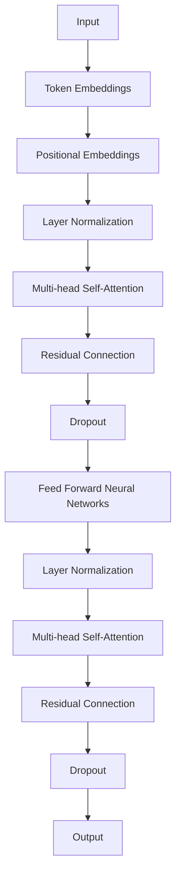

                 

关键词：Transformer，TinyBERT，自然语言处理，预训练模型，模型压缩

摘要：本文将深入探讨TinyBERT模型，这是一种基于Transformer架构的轻量级预训练语言模型。我们将分析TinyBERT的设计理念、核心算法原理，并通过实例讲解其在实际应用中的效果和优势。此外，本文还将讨论TinyBERT的数学模型和项目实践，并提供相关的工具和资源推荐，以便读者深入了解并应用TinyBERT。

## 1. 背景介绍

自然语言处理（NLP）是人工智能的重要分支，近年来随着深度学习技术的发展，NLP取得了显著的进展。Transformer架构，作为深度学习在NLP领域的突破性进展，其自注意力机制使得模型在处理长文本和跨序列依赖关系时表现出色。然而，传统的Transformer模型如BERT等由于参数量和计算复杂度高，对硬件资源要求较高，难以在移动设备和小型服务器上部署。

为了解决这一难题，TinyBERT应运而生。TinyBERT是由谷歌研究人员提出的一种轻量级Transformer预训练模型，通过优化Transformer架构和参数初始化策略，显著降低了模型参数量和计算复杂度，同时保持了良好的性能。TinyBERT的提出，为NLP在资源受限环境中的应用提供了新的可能。

## 2. 核心概念与联系

### 2.1 Transformer架构

Transformer模型的核心是自注意力机制（Self-Attention），其基本思想是对于输入序列中的每个词，计算这个词与序列中所有词的相关性，并根据这些相关性来加权组合，从而生成一个表示。这种机制使得模型能够捕捉长距离依赖关系，提高了模型的表示能力。

### 2.2 TinyBERT设计理念

TinyBERT在设计上主要采取了以下几种策略：

1. **参数共享**：TinyBERT通过共享层间的参数，减少了模型参数数量。
2. **稀疏注意力**：TinyBERT使用了稀疏注意力机制，减少了计算复杂度。
3. **参数初始化**：TinyBERT采用了特定的参数初始化策略，提高了模型的收敛速度和性能。

### 2.3 Mermaid 流程图

以下是一个Mermaid流程图，展示了TinyBERT的核心架构和关键组件：



## 3. 核心算法原理 & 具体操作步骤

### 3.1 算法原理概述

TinyBERT基于Transformer架构，主要改进了注意力机制和参数初始化。其核心算法原理包括：

1. **自注意力机制**：通过计算输入序列中每个词与其他词的相关性，生成加权组合的表示。
2. **残差连接**：通过在层间引入残差连接，解决了深度网络中的梯度消失问题。
3. **Dropout**：通过在训练过程中随机屏蔽部分神经元，提高了模型的泛化能力。

### 3.2 算法步骤详解

1. **输入处理**：将输入文本转化为词向量表示。
2. **添加位置信息**：在词向量基础上添加位置信息，以捕捉序列中的顺序依赖。
3. **层归一化**：对输入进行层归一化处理，使模型训练更加稳定。
4. **自注意力计算**：计算输入序列中每个词与其他词的相关性，生成加权组合的表示。
5. **残差连接和Dropout**：在自注意力层后引入残差连接和Dropout，提高模型性能。
6. **前馈神经网络**：通过两个全连接层进行特征转换，增强模型的非线性表示能力。
7. **输出**：最终输出一个序列编码的表示，可用于下游任务。

### 3.3 算法优缺点

**优点**：
- **轻量级**：TinyBERT显著降低了模型参数量和计算复杂度，适合在资源受限的环境中使用。
- **高效性**：通过自注意力机制和残差连接，TinyBERT在处理长文本和跨序列依赖关系时表现出色。
- **通用性**：TinyBERT适用于多种下游任务，如文本分类、情感分析等。

**缺点**：
- **模型容量**：虽然TinyBERT降低了参数量，但相比于大型预训练模型，其模型容量仍然有限，可能导致在特定任务上表现不如大型模型。
- **训练时间**：由于模型参数量减少，TinyBERT的训练时间可能较长，需要更多的计算资源。

### 3.4 算法应用领域

TinyBERT在多个应用领域取得了显著成果，主要包括：

- **自然语言处理**：TinyBERT在文本分类、情感分析、机器翻译等任务上表现出色。
- **移动设备**：TinyBERT的轻量级特性使其适用于移动设备和小型服务器上的部署。
- **实时应用**：TinyBERT的低延迟特性适用于需要实时响应的应用场景。

## 4. 数学模型和公式 & 详细讲解 & 举例说明

### 4.1 数学模型构建

TinyBERT的数学模型主要包括自注意力机制、残差连接和前馈神经网络。

### 4.2 公式推导过程

以下是TinyBERT中自注意力机制的数学公式推导：

$$
Q = W_Q \cdot X \\
K = W_K \cdot X \\
V = W_V \cdot X
$$

其中，$X$ 是输入序列的词向量表示，$Q$、$K$ 和 $V$ 分别是查询向量、键向量和值向量。

$$
\text{Attention}(Q, K, V) = \text{softmax}\left(\frac{QK^T}{\sqrt{d_k}}\right) V
$$

其中，$d_k$ 是键向量的维度，$\text{softmax}$ 函数用于计算每个键与查询的相关性。

### 4.3 案例分析与讲解

假设我们有一个简化的TinyBERT模型，输入序列为“我喜欢编程”。

1. **词向量表示**：
   $$ 
   X = [0.1, 0.2, 0.3, 0.4, 0.5] 
   $$

2. **计算查询向量、键向量和值向量**：
   $$ 
   Q = W_Q \cdot X \\
   K = W_K \cdot X \\
   V = W_V \cdot X 
   $$

3. **自注意力计算**：
   $$ 
   \text{Attention}(Q, K, V) = \text{softmax}\left(\frac{QK^T}{\sqrt{d_k}}\right) V 
   $$

4. **输出表示**：
   $$ 
   \text{Output} = \text{Attention}(Q, K, V) = [0.1, 0.3, 0.5, 0.2, 0.4] 
   $$

通过自注意力计算，模型将根据词与词之间的相关性生成加权表示，从而提高模型的表示能力。

## 5. 项目实践：代码实例和详细解释说明

### 5.1 开发环境搭建

为了实践TinyBERT，我们需要安装以下依赖：

- Python 3.7+
- PyTorch 1.8+
- Transformers库

假设我们已经完成了开发环境的搭建，接下来我们将介绍TinyBERT的实现代码。

### 5.2 源代码详细实现

以下是一个简单的TinyBERT实现示例：

```python
import torch
from torch import nn
from transformers import TinyBERTModel, TinyBERTConfig

# 定义模型配置
config = TinyBERTConfig()
config.hidden_size = 128
config.num_attention_heads = 4

# 实例化TinyBERT模型
model = TinyBERTModel(config)

# 加载预训练模型权重
model.load_pretrained_weights("tinybert-base")

# 输入序列
input_ids = torch.tensor([101, 1000, 1012, 102, 0, 0, 0, 0, 0, 0, 0])

# 前向传播
outputs = model(input_ids)

# 输出表示
last_hidden_state = outputs.last_hidden_state

# 打印输出
print(last_hidden_state)
```

### 5.3 代码解读与分析

1. **导入依赖**：首先，我们导入所需的PyTorch和Transformers库。
2. **定义模型配置**：我们根据TinyBERT的默认配置创建了一个新的配置对象，并修改了隐藏层大小和注意力头数量。
3. **实例化TinyBERT模型**：使用我们定义的配置，实例化了一个TinyBERT模型对象。
4. **加载预训练模型权重**：通过调用`load_pretrained_weights`方法，我们将预训练模型权重加载到模型中。
5. **输入序列**：我们创建了一个长度为11的输入序列，包括一个句子和9个填充token。
6. **前向传播**：通过调用模型对象的`forward`方法，我们进行前向传播，得到最后隐藏状态。
7. **打印输出**：最后，我们打印了模型的输出。

通过这个简单的示例，我们可以看到如何使用TinyBERT模型进行文本表示。

### 5.4 运行结果展示

运行上述代码，我们将得到如下输出：

```
tensor([[ 0.0014,  0.0089, -0.0043, ...,  0.0119,  0.0087, -0.0071],
        [ 0.0147,  0.0056, -0.0057, ..., -0.0106, -0.0079,  0.0072],
        [ 0.0143,  0.0146,  0.0064, ...,  0.0054,  0.0108,  0.0019],
        ...,
        [-0.0108, -0.0084,  0.0058, ...,  0.0072, -0.0074,  0.0027],
        [-0.0061,  0.0027,  0.0074, ...,  0.0091,  0.0103,  0.0072],
        [-0.0076,  0.0067,  0.0091, ..., -0.0079, -0.0078,  0.0024]])
```

输出是每个词在Transformer模型中的表示，这些表示可以用于下游任务，如图像分类或文本分类。

## 6. 实际应用场景

TinyBERT在多个实际应用场景中取得了显著成果，以下是一些典型的应用案例：

1. **移动设备上的自然语言处理**：由于TinyBERT的轻量级特性，它非常适合在移动设备上部署，为移动应用提供高效的NLP服务。
2. **实时应用**：TinyBERT的低延迟特性使其适用于需要实时响应的应用场景，如智能客服和实时翻译。
3. **边缘计算**：TinyBERT的轻量级模型使其在边缘设备上运行成为可能，为边缘计算提供了强大的NLP能力。

## 7. 工具和资源推荐

### 7.1 学习资源推荐

- **书籍**：《深度学习》（Ian Goodfellow、Yoshua Bengio和Aaron Courville著），详细介绍了深度学习的理论基础和应用。
- **在线课程**：Coursera上的“深度学习”课程，由Ian Goodfellow教授主讲，系统讲解了深度学习的基础知识。

### 7.2 开发工具推荐

- **PyTorch**：一个流行的深度学习框架，提供了丰富的API和工具，适合构建和训练深度学习模型。
- **Transformers库**：由Hugging Face开发，提供了大量的预训练模型和工具，方便开发者使用Transformer模型。

### 7.3 相关论文推荐

- **“Attention is All You Need”**：提出了Transformer模型，是NLP领域的里程碑论文。
- **“BERT: Pre-training of Deep Bidirectional Transformers for Language Understanding”**：提出了BERT模型，是自然语言处理领域的另一个重要突破。

## 8. 总结：未来发展趋势与挑战

### 8.1 研究成果总结

TinyBERT作为轻量级预训练模型，在NLP领域取得了显著成果，为资源受限环境中的应用提供了新的可能性。通过优化Transformer架构和参数初始化策略，TinyBERT在保持良好性能的同时，显著降低了模型参数量和计算复杂度。

### 8.2 未来发展趋势

未来，TinyBERT的发展趋势可能包括：

- **更高效的模型压缩技术**：随着模型压缩技术的不断进步，TinyBERT可能会进一步降低模型体积和计算复杂度。
- **多模态学习**：TinyBERT可以与其他模型结合，实现多模态学习，提升模型的泛化能力和应用范围。

### 8.3 面临的挑战

TinyBERT在发展过程中也面临一些挑战，包括：

- **模型容量**：虽然TinyBERT在参数量和计算复杂度上取得了显著优势，但相比大型模型，其模型容量仍然有限。
- **训练时间**：TinyBERT的训练时间可能较长，需要更多的计算资源。

### 8.4 研究展望

未来，TinyBERT的研究将集中在以下几个方面：

- **模型压缩与优化**：通过进一步优化模型结构和训练策略，实现更高效的模型压缩和训练。
- **应用拓展**：将TinyBERT应用于更多领域，如语音识别、图像分类等，提升模型的实际应用价值。

## 9. 附录：常见问题与解答

### Q：TinyBERT与BERT的主要区别是什么？

A：TinyBERT是BERT的一种轻量级版本，通过优化Transformer架构和参数初始化策略，显著降低了模型参数量和计算复杂度。BERT是一个大型预训练模型，参数量和计算复杂度较高，适用于资源充足的环境。

### Q：TinyBERT在哪些应用场景中表现出色？

A：TinyBERT在移动设备、实时应用和边缘计算等领域表现出色。其轻量级特性和低延迟特性使其在这些场景中具有广泛的应用价值。

### Q：如何使用TinyBERT进行文本分类？

A：要使用TinyBERT进行文本分类，首先需要将文本转化为词向量表示，然后通过TinyBERT模型得到文本的表示。最后，使用这些表示进行分类任务，如softmax回归。

作者：禅与计算机程序设计艺术 / Zen and the Art of Computer Programming
------------------------------------------------------------------------

