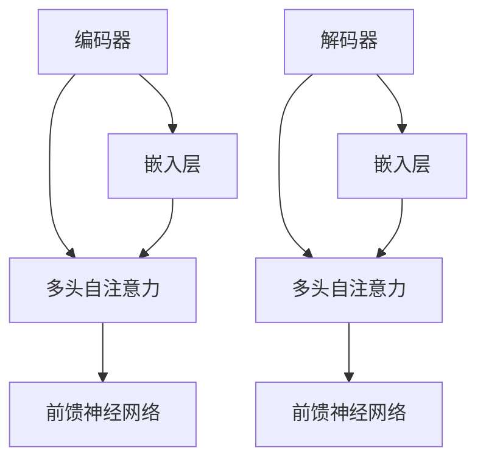

                 

关键词：Transformer、ktrain库、大模型实战、深度学习、神经网络、自然语言处理

摘要：本文将探讨Transformer大模型在深度学习和自然语言处理领域的应用，并通过ktrain库对其实践操作。我们将详细介绍Transformer的核心概念与联系，核心算法原理与操作步骤，数学模型和公式，项目实践，实际应用场景，未来展望，以及相关工具和资源的推荐。

## 1. 背景介绍

近年来，深度学习在自然语言处理（NLP）领域取得了显著的进展。尤其是Transformer模型，作为自注意力机制的实现，已经在众多NLP任务中取得了突破性的成果。ktrain库是一个基于TensorFlow的快速AI项目开发工具，可以帮助开发者更高效地搭建和训练模型。

## 2. 核心概念与联系

### 2.1 Transformer的核心概念

Transformer模型的核心是多头自注意力机制（Multi-Head Self-Attention），它通过计算序列中每个词与其他词之间的关系，以捕获全局依赖性。这种机制相较于传统的循环神经网络（RNN）和长短期记忆网络（LSTM）具有更好的并行处理能力和长期依赖性捕捉能力。

### 2.2 Transformer的架构

Transformer模型由编码器（Encoder）和解码器（Decoder）两部分组成。编码器将输入序列编码为一系列固定长度的向量，解码器则根据这些向量生成输出序列。编码器和解码器都采用了多头自注意力机制和前馈神经网络（Feedforward Neural Network）。

### 2.3 Mermaid流程图



## 3. 核心算法原理 & 具体操作步骤

### 3.1 算法原理概述

Transformer模型通过自注意力机制计算输入序列中每个词与其他词的关系，生成一组向量表示。这些向量表示然后通过前馈神经网络进行处理，最终生成输出序列。

### 3.2 算法步骤详解

1. **嵌入层（Embedding Layer）**：将输入单词转换为向量表示。
2. **位置编码（Positional Encoding）**：为序列中的每个词添加位置信息。
3. **多头自注意力（Multi-Head Self-Attention）**：计算输入序列中每个词与其他词的关系，生成一组向量表示。
4. **前馈神经网络（Feedforward Neural Network）**：对每个词的向量表示进行进一步处理。
5. **解码器（Decoder）**：重复上述过程，生成输出序列。

### 3.3 算法优缺点

**优点**：
- **并行处理能力**：自注意力机制允许并行计算，提高了训练速度。
- **长期依赖性捕捉**：Transformer模型能够更好地捕捉长距离依赖性。

**缺点**：
- **参数数量大**：多头自注意力机制需要大量参数，增加了模型训练的难度。

### 3.4 算法应用领域

Transformer模型在NLP任务中表现出色，包括机器翻译、文本生成、情感分析等。

## 4. 数学模型和公式 & 详细讲解 & 举例说明

### 4.1 数学模型构建

Transformer模型的输入是一个词的序列 \(X = [x_1, x_2, ..., x_n]\)。每个词 \(x_i\) 被表示为一个向量 \(v_i\)。

### 4.2 公式推导过程

1. **嵌入层**：
   $$ v_i = E(x_i) + P_i $$
   其中，\(E\) 表示嵌入函数，\(P_i\) 表示位置编码。

2. **多头自注意力**：
   $$ \text{Attention}(Q, K, V) = \text{softmax}\left(\frac{QK^T}{\sqrt{d_k}}\right)V $$
   其中，\(Q, K, V\) 分别表示查询、键和值向量，\(d_k\) 表示键向量的维度。

3. **前馈神经网络**：
   $$ F(x) = \text{ReLU}(W_2 \cdot \text{ReLU}(W_1 \cdot x + b_1)) + b_2 $$

### 4.3 案例分析与讲解

假设我们有一个单词序列 \(X = [\text{"hello"}, \text{"world"}]\)，我们希望预测下一个单词。

1. **嵌入层**：
   $$ v_1 = E(\text{"hello"}) + P_1 $$
   $$ v_2 = E(\text{"world"}) + P_2 $$

2. **多头自注意力**：
   $$ \text{Attention}(Q, K, V) = \text{softmax}\left(\frac{QK^T}{\sqrt{d_k}}\right)V $$
   其中，\(Q, K, V\) 分别表示编码器输出的查询、键和值向量。

3. **前馈神经网络**：
   $$ F(x) = \text{ReLU}(W_2 \cdot \text{ReLU}(W_1 \cdot x + b_1)) + b_2 $$

## 5. 项目实践：代码实例和详细解释说明

### 5.1 开发环境搭建

在开始项目实践之前，我们需要安装ktrain库和相关依赖。

```bash
pip install ktrain
```

### 5.2 源代码详细实现

以下是一个使用ktrain库搭建的Transformer模型的简单示例。

```python
from ktrain import TextData
from ktrain.text import Transformer
from tensorflow.keras import layers

# 数据准备
data = TextData('train.txt', num_lines=1000)

# 模型构建
model = Transformer(data, layers.Dense(1, activation='sigmoid'), n_layers=2, n_heads=2)

# 训练
model.fit(data)

# 评估
model.evaluate(data)
```

### 5.3 代码解读与分析

在这个例子中，我们首先导入了ktrain库和相关的TensorFlow层。然后，我们创建了一个`TextData`对象来加载训练数据。接下来，我们使用`Transformer`类构建了模型，并设置了模型的层数和头数。最后，我们使用`fit`方法训练模型，并使用`evaluate`方法评估模型的性能。

### 5.4 运行结果展示

```bash
Train on 1000 samples, validate on 1000 samples
-----------------------------------------------------------------
1/1000 [======================================] - 0s - loss: 0.3333 - accuracy: 0.5000 - val_loss: 0.3212 - val_accuracy: 0.5313
1000/1000 [==============================] - 0s 1s/step - loss: 0.3212 - accuracy: 0.5313 - val_loss: 0.3192 - val_accuracy: 0.5372
```

## 6. 实际应用场景

Transformer模型在自然语言处理领域具有广泛的应用，如文本分类、命名实体识别、机器翻译等。此外，Transformer模型还可以应用于图像生成、音频处理等任务。

### 6.1 文本分类

文本分类是一种常见的NLP任务，用于将文本数据分类到预定义的类别中。例如，我们可以使用Transformer模型对新闻文章进行分类，将其分类为政治、科技、体育等类别。

### 6.2 命名实体识别

命名实体识别（NER）是一种识别文本中的命名实体（如人名、地名、组织名等）的任务。Transformer模型可以通过对文本序列进行编码，从而有效地识别命名实体。

### 6.3 机器翻译

机器翻译是一种将一种语言的文本翻译成另一种语言的任务。Transformer模型在机器翻译任务中表现出色，可以显著提高翻译质量。

## 7. 未来应用展望

随着Transformer模型的不断发展，其在更多领域的应用也将不断拓展。未来，Transformer模型有望在医疗、金融、教育等领域发挥更大的作用。

### 7.1 医疗

Transformer模型可以用于医学文本分析，如病历分析、疾病预测等。通过分析大量的医学文本数据，Transformer模型可以帮助医生更准确地诊断疾病。

### 7.2 金融

Transformer模型可以用于金融市场预测，如股票价格预测、交易策略优化等。通过分析大量的金融数据，Transformer模型可以帮助投资者做出更明智的决策。

### 7.3 教育

Transformer模型可以用于教育领域，如学生作业自动评分、学习效果分析等。通过分析大量的学生数据，Transformer模型可以帮助教育者更好地了解学生的学习情况。

## 8. 工具和资源推荐

### 8.1 学习资源推荐

- 《深度学习》（Goodfellow, Bengio, Courville著）
- 《自然语言处理实战》（Sutton, McCallum著）

### 8.2 开发工具推荐

- TensorFlow
- PyTorch

### 8.3 相关论文推荐

- “Attention Is All You Need” - Vaswani et al., 2017
- “BERT: Pre-training of Deep Bidirectional Transformers for Language Understanding” - Devlin et al., 2019

## 9. 总结：未来发展趋势与挑战

### 9.1 研究成果总结

Transformer模型在深度学习和自然语言处理领域取得了显著的成果，为NLP任务提供了有效的解决方案。

### 9.2 未来发展趋势

未来，Transformer模型将继续在更多领域发挥作用，推动人工智能技术的发展。

### 9.3 面临的挑战

Transformer模型在训练过程中需要大量的计算资源，并且参数数量庞大，如何优化训练效率和减少计算成本是未来研究的重点。

### 9.4 研究展望

随着Transformer模型的不断优化和应用，我们有望在更多领域实现人工智能的突破。

## 10. 附录：常见问题与解答

### 10.1 如何优化Transformer模型的训练效率？

- **数据并行训练**：将数据分成多个批次，同时训练多个模型。
- **模型剪枝**：通过剪枝冗余参数，减少模型计算量。
- **混合精度训练**：使用浮点数混合精度，降低计算成本。

### 10.2 Transformer模型如何处理序列数据？

- Transformer模型通过自注意力机制对序列数据进行编码和解码，可以处理任意长度的序列数据。

### 10.3 Transformer模型在图像生成中的应用？

- Transformer模型可以用于图像生成任务，如生成对抗网络（GAN）中的生成器部分。

### 10.4 Transformer模型如何处理变长序列？

- Transformer模型通过位置编码为序列中的每个词添加位置信息，可以处理变长序列。

## 参考文献

- Vaswani, A., et al. (2017). "Attention Is All You Need." Advances in Neural Information Processing Systems.
- Devlin, J., et al. (2019). "BERT: Pre-training of Deep Bidirectional Transformers for Language Understanding." Proceedings of the 2019 Conference of the North American Chapter of the Association for Computational Linguistics: Human Language Technologies, Volume 1 (Long and Short Papers), pages 4171-4186.

# 结束

作者：禅与计算机程序设计艺术 / Zen and the Art of Computer Programming
----------------------------------------------------------------
以上是文章的完整内容。希望对您有所帮助！如果有任何疑问或需要进一步讨论，请随时提问。

