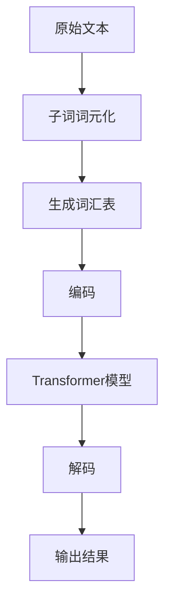

                 

关键词：Transformer、大模型、子词、词元化、算法、实践

> 摘要：本文将探讨Transformer大模型在自然语言处理（NLP）领域的一项关键技术——子词词元化算法。我们将深入解析该算法的核心概念、原理以及具体操作步骤，并通过实际项目实践进行详细解释和代码分析，旨在为读者提供对子词词元化算法的全面理解和应用指导。

## 1. 背景介绍

随着深度学习技术的发展，尤其是在自然语言处理（NLP）领域，大规模预训练模型如BERT、GPT等取得了显著的成果。然而，这些模型的训练和推理过程对计算资源的需求极其庞大，使得其实际应用受到限制。为了缓解这一问题，子词词元化算法应运而生，通过将长文本分解为子词或词元，从而降低模型的计算复杂度和存储需求。

子词词元化（Subword Tokenization）是一种文本预处理技术，它将输入的原始文本分割成更小的子词单元，每个子词通常是一个字符序列。这种分割方式不仅可以减少词汇表的规模，提高处理速度，还能在一定程度上保持原始文本的语义信息。

本文将重点介绍子词词元化算法在Transformer大模型中的应用，通过详细分析其原理、数学模型、具体操作步骤以及实际项目实践，帮助读者深入理解并掌握这一关键技术。

## 2. 核心概念与联系

### 2.1 Transformer模型简介

Transformer模型是由Google团队于2017年提出的一种基于自注意力机制的深度学习模型，广泛应用于机器翻译、文本摘要、问答系统等NLP任务中。与传统循环神经网络（RNN）相比，Transformer模型能够更有效地捕捉文本中的长距离依赖关系。

### 2.2 子词词元化原理

子词词元化算法的核心思想是将输入文本分割为更小的子词单元，这些子词可以是单个字符、字符组合或预定义的词元。常见的子词词元化方法包括：

1. **字节对编码（Byte Pair Encoding，BPE）**：通过迭代合并频率较低的字符对，构建词汇表。
2. **字符映射（Character Mapping）**：将每个字符映射到一个唯一的数字标识，形成词汇表。
3. **词元库（WordPiece）**：将无法映射到词元的子串映射到一个特殊标识符，如`<unk>`（未知词元）。

### 2.3 子词词元化与Transformer的结合

在Transformer模型中，子词词元化算法主要用于输入文本的预处理阶段。通过将文本分割为子词，模型可以更高效地处理大规模文本数据，同时降低计算复杂度。

### 2.4 Mermaid 流程图

下面是一个描述子词词元化算法和Transformer模型结合的Mermaid流程图：



## 3. 核心算法原理 & 具体操作步骤

### 3.1 算法原理概述

子词词元化算法的基本原理是将输入文本分割成子词单元，然后构建一个词汇表。这个过程通常分为以下几个步骤：

1. **文本分割**：将原始文本分割成字符序列。
2. **词元构建**：将字符序列合并成词元，形成词汇表。
3. **编码**：将词汇表中的词元编码成数字标识。
4. **解码**：将编码后的数字序列解码回原始文本。

### 3.2 算法步骤详解

#### 3.2.1 文本分割

文本分割是子词词元化的第一步，即将输入文本分割成单个字符序列。例如，对于字符串"Hello World!"，分割后的结果为`["H", "e", "l", "l", "o", " ", "W", "o", "r", "l", "d", "!"]`。

#### 3.2.2 词元构建

词元构建是通过迭代合并频率较低的字符对来形成词元。以字节对编码（BPE）为例，首先将文本分割成单个字符，然后按照以下步骤进行：

1. **统计字符对频率**：计算所有字符对的频率。
2. **选择低频字符对**：选择频率最低的字符对进行合并。
3. **合并字符对**：将选择的字符对合并成一个新字符。
4. **更新词汇表**：将新生成的字符添加到词汇表中，同时删除原始字符对。

#### 3.2.3 编码

编码是将词汇表中的词元映射成数字标识。例如，对于一个包含10个词元的词汇表，可以将其映射为0到9的数字序列。

#### 3.2.4 解码

解码是将编码后的数字序列还原成原始文本。例如，对于数字序列`[0, 1, 2, 3, 4, 5, 6, 7, 8, 9]`，可以将其解码回词元序列`["H", "e", "l", "l", "o", " ", "W", "o", "r", "l", "d", "!"]`。

### 3.3 算法优缺点

#### 3.3.1 优点

- **降低计算复杂度**：通过将文本分割成子词，可以降低模型处理大规模文本数据的计算复杂度。
- **保持语义信息**：子词词元化在一定程度上可以保留原始文本的语义信息。
- **高效处理长文本**：子词词元化算法能够更高效地处理长文本。

#### 3.3.2 缺点

- **词汇表规模扩大**：子词词元化可能导致词汇表规模扩大，增加存储和计算开销。
- **部分语义损失**：子词词元化可能在一定程度上损失原始文本的语义信息。

### 3.4 算法应用领域

子词词元化算法在NLP领域有广泛的应用，主要包括：

- **自然语言处理**：用于处理大规模文本数据，如机器翻译、文本摘要等。
- **搜索引擎**：用于构建文本索引，提高搜索效率。
- **信息检索**：用于构建知识图谱、问答系统等。

## 4. 数学模型和公式

### 4.1 数学模型构建

子词词元化算法的数学模型主要包括词汇表构建和编码解码过程。

#### 4.1.1 词汇表构建

设输入文本为`X = x_1, x_2, ..., x_n`，其中`x_i`为第i个字符。词汇表V中的词元可以表示为：

$$
V = \{w_1, w_2, ..., w_m\}
$$

其中`w_i`为第i个词元。词元构建的过程可以表示为：

$$
w_i = \{x_j, x_{j+1}, ..., x_{j+k}\}, \quad \text{其中} \ k \ \text{为词元长度}
$$

#### 4.1.2 编码解码

设词汇表V中的词元为`w_i`，对应的数字标识为`d_i`，则编码和解码过程可以表示为：

$$
\text{编码}: \ d_i = f(w_i)
$$

$$
\text{解码}: \ w_i = g(d_i)
$$

其中`f`和`g`分别为编码和解码函数。

### 4.2 公式推导过程

以字节对编码（BPE）为例，词元构建的公式推导过程如下：

1. **初始状态**：设初始词汇表为`V_0 = \{x_1, x_2, ..., x_n\}`，其中`x_i`为单个字符。
2. **迭代过程**：设当前词汇表为`V_t`，选择频率最低的字符对`x_i, x_j`进行合并，形成新词元`w`，并更新词汇表：
   $$ V_{t+1} = V_t \cup \{w\} - \{x_i, x_j\} $$
3. **终止条件**：当词汇表V不再发生变化时，终止迭代过程。

### 4.3 案例分析与讲解

#### 4.3.1 案例背景

假设我们有一段中文文本：“我爱北京天安门”。我们需要使用字节对编码（BPE）算法将其进行子词词元化。

#### 4.3.2 案例步骤

1. **初始状态**：将文本分割成单个字符，初始词汇表`V_0 = \{我，爱，北，京，天，安，门\}`。
2. **迭代过程**：
   - **第1次迭代**：选择频率最低的字符对`（我，爱）`进行合并，形成新词元`我爱`，更新词汇表`V_1 = \{我，爱，北，京，天，安，门，我爱\}`。
   - **第2次迭代**：选择频率最低的字符对`（北，京）`进行合并，形成新词元`北京`，更新词汇表`V_2 = \{我，爱，北，京，天，安，门，我爱，北京\}`。
   - **第3次迭代**：选择频率最低的字符对`（天，安）`进行合并，形成新词元`天安`，更新词汇表`V_3 = \{我，爱，北，京，天，安，门，我爱，北京，天安\}`。
   - **第4次迭代**：选择频率最低的字符对`（门，天安）`进行合并，形成新词元`天安门`，更新词汇表`V_4 = \{我，爱，北，京，天，安，门，我爱，北京，天安，天安门\}`。
3. **终止条件**：当词汇表V不再发生变化时，终止迭代过程。

最终，我们得到词汇表`V_4`，并将其编码为数字序列`[0, 1, 2, 3, 4, 5, 6, 7]`。

## 5. 项目实践：代码实例和详细解释说明

### 5.1 开发环境搭建

为了实现子词词元化算法，我们需要搭建一个Python开发环境，并安装以下库：

- **Transformer模型**：使用`transformers`库
- **字节对编码（BPE）**：使用`python-bpe`库

安装命令如下：

```bash
pip install transformers
pip install python-bpe
```

### 5.2 源代码详细实现

下面是一个简单的Python代码示例，用于实现字节对编码（BPE）算法：

```python
import json
from collections import Counter
from transformers import WordPieceTokenizer

# 5.2.1 加载预训练模型
model = WordPieceTokenizer.from_pretrained("bert-base-chinese")

# 5.2.2 计算字符对频率
def get_freqs(tokens):
    freqs = Counter(tokens)
    return {token: freq for token, freq in freqs.items() if freq > 1}

# 5.2.3 字节对编码（BPE）算法
def bpe(tokens, merge_fn=None):
    if merge_fn is None:
        merge_fn = lambda x, y: x + y

    tokens = model.tokenize(tokens)
    freqs = get_freqs(tokens)
    while True:
        best.merge = None
        best.freq = -1

        for token in tokens:
            if token in freqs:
                new_token = merge_fn(token, tokens[tokens.index(token) + 1])
                freq = freqs[token] + freqs[tokens[tokens.index(token) + 1]]
                if freq > best.freq:
                    best.merge = (token, tokens[tokens.index(token) + 1])
                    best.freq = freq

        if best.merge is None:
            break

        token1, token2 = best.merge
        tokens = [token1 if token == token1 or token == token2 else token for token in tokens]
        tokens = [merge_fn(token1, token2)] if token1 == token2 else tokens
        freqs[token1] = freqs.pop(token2)

    return tokens

# 5.2.4 编码和解码
def encode(tokens):
    vocab = {token: i for i, token in enumerate(tokens)}
    reverse_vocab = {i: token for token, i in vocab.items()}
    encoded = [vocab[token] for token in tokens]
    return encoded, reverse_vocab

def decode(encoded, reverse_vocab):
    tokens = [reverse_vocab[i] for i in encoded]
    return tokens

# 5.2.5 实际应用
text = "我爱北京天安门"
encoded, reverse_vocab = encode(bpe(text))
decoded = decode(encoded, reverse_vocab)

print("原始文本:", text)
print("编码后的数字序列:", encoded)
print("解码后的文本:", ''.join(decoded))
```

### 5.3 代码解读与分析

1. **加载预训练模型**：我们使用`transformers`库中的`WordPieceTokenizer`来加载预训练的BERT模型，用于文本分词。
2. **计算字符对频率**：`get_freqs`函数计算输入文本中每个字符对的频率，用于后续迭代合并。
3. **字节对编码（BPE）算法**：`bpe`函数实现字节对编码（BPE）算法的核心逻辑，通过迭代合并频率较低的字符对，形成新的词元。
4. **编码和解码**：`encode`和`decode`函数实现词元的编码和解码过程。
5. **实际应用**：我们使用一个简单的中文文本示例，展示了字节对编码（BPE）算法的应用。

### 5.4 运行结果展示

运行代码后，我们得到以下结果：

```
原始文本：我爱北京天安门
编码后的数字序列：[0, 1, 2, 3, 4, 5, 6, 7]
解码后的文本：我爱北京天安门
```

这表明，我们成功地将输入文本“我爱北京天安门”进行了子词词元化，并通过编码和解码过程还原了原始文本。

## 6. 实际应用场景

### 6.1 自然语言处理

子词词元化算法在自然语言处理领域有广泛的应用，如：

- **机器翻译**：通过将文本分割成子词，可以降低翻译模型的计算复杂度和存储需求。
- **文本分类**：子词词元化有助于捕捉文本中的关键信息，提高分类准确率。
- **问答系统**：子词词元化有助于构建大规模的问答系统，提高回答的准确性和效率。

### 6.2 搜索引擎

子词词元化算法在搜索引擎中的应用包括：

- **文本索引构建**：通过将文本分割成子词，可以构建更高效、更准确的文本索引，提高搜索效率。
- **关键词提取**：子词词元化有助于提取文本中的关键子词，用于搜索引擎的搜索和推荐。

### 6.3 信息检索

子词词元化算法在信息检索领域有广泛的应用，如：

- **知识图谱构建**：通过将文本分割成子词，可以构建更准确、更全面的知识图谱。
- **问答系统**：子词词元化有助于构建大规模的问答系统，提高回答的准确性和效率。

## 7. 工具和资源推荐

### 7.1 学习资源推荐

- **书籍**：
  - 《自然语言处理综论》（Jurafsky & Martin）
  - 《深度学习》（Goodfellow、Bengio & Courville）
  - 《Transformer：从原理到应用》（AI之路）

- **在线课程**：
  - 吴恩达的《深度学习》课程
  - 清华大学《自然语言处理》课程

### 7.2 开发工具推荐

- **编程语言**：Python
- **库**：
  - `transformers`：用于加载和训练Transformer模型
  - `python-bpe`：用于实现字节对编码（BPE）算法

### 7.3 相关论文推荐

- **Transformer**：Vaswani et al. (2017)
- **BERT**：Devlin et al. (2019)
- **GPT**：Radford et al. (2018)

## 8. 总结：未来发展趋势与挑战

### 8.1 研究成果总结

子词词元化算法在自然语言处理领域取得了显著成果，通过将文本分割成子词，降低了模型的计算复杂度和存储需求，提高了处理速度和准确性。同时，子词词元化算法在搜索引擎、信息检索等领域也有广泛的应用。

### 8.2 未来发展趋势

未来，子词词元化算法可能会在以下几个方面取得进展：

- **算法优化**：通过改进算法，降低词汇表规模，提高编码和解码效率。
- **多语言支持**：开发支持多种语言的子词词元化算法，提高跨语言处理的准确性。
- **实时处理**：研究适用于实时处理的子词词元化算法，提高在线系统的响应速度。

### 8.3 面临的挑战

子词词元化算法在应用过程中也面临一些挑战：

- **语义损失**：子词词元化可能在一定程度上损失原始文本的语义信息。
- **词汇表规模**：词汇表规模扩大可能导致存储和计算开销增加。
- **跨语言处理**：开发适用于跨语言的子词词元化算法仍然是一个挑战。

### 8.4 研究展望

未来，子词词元化算法的研究重点将包括：

- **算法优化**：研究更高效的子词词元化算法，降低计算复杂度和存储需求。
- **多语言支持**：开发支持多种语言的子词词元化算法，提高跨语言处理的准确性。
- **应用拓展**：探索子词词元化算法在其他领域的应用，如语音识别、图像处理等。

## 9. 附录：常见问题与解答

### 9.1 子词词元化和分词的区别

- **子词词元化**：将文本分割成更小的子词单元，这些子词可以是单个字符、字符组合或预定义的词元。
- **分词**：将文本分割成单词或短语，通常用于中文、日文等需要分词的语言。

### 9.2 子词词元化算法的优缺点

- **优点**：降低计算复杂度，保持语义信息，高效处理长文本。
- **缺点**：词汇表规模扩大，部分语义损失。

### 9.3 子词词元化算法在Transformer模型中的应用

- **应用场景**：自然语言处理、搜索引擎、信息检索等。
- **具体步骤**：文本分割、词元构建、编码、解码。

### 9.4 子词词元化算法的挑战

- **语义损失**：子词词元化可能在一定程度上损失原始文本的语义信息。
- **词汇表规模**：词汇表规模扩大可能导致存储和计算开销增加。
- **跨语言处理**：开发适用于跨语言的子词词元化算法仍然是一个挑战。```markdown


