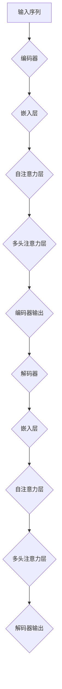

                 

### 背景介绍

近年来，深度学习在自然语言处理（NLP）领域取得了显著的进展。特别是Transformer架构的引入，为模型在大规模语言建模和序列生成任务中展现了强大的性能。BERT（Bidirectional Encoder Representations from Transformers）是Google于2018年提出的一种预训练语言表示模型，基于Transformer架构，通过无监督预训练和有监督微调，能够捕捉到语言的复杂结构，并在多个NLP任务上取得了卓越的效果。

BERT模型的训练和推理需要大量的计算资源和时间，特别是对于多语言模型的训练，比如德语BERT模型。本文将深入探讨如何在实际环境中部署和使用德语的BERT模型。我们将从背景介绍开始，逐步讲解核心概念、算法原理、数学模型、项目实践、应用场景以及未来的发展展望。

### 核心概念与联系

在介绍Transformer和BERT之前，我们先来了解一些核心概念，如注意力机制、自注意力、多头注意力等。

#### 注意力机制

注意力机制是Transformer模型的核心组成部分，它能够使模型在处理序列数据时关注到不同位置的重要性。在传统的循环神经网络（RNN）中，每个时刻的输出都依赖于前面的所有输入，这导致了计算复杂度的高涨。而注意力机制通过为每个输入分配一个权重，只关注对当前输出最重要的部分，从而降低了计算复杂度。

#### 自注意力

自注意力是注意力机制的一种实现，它使得模型能够在处理每个输入时，将注意力分配给输入序列中的其他所有位置。这样，模型可以捕获输入序列的内部依赖关系。

#### 多头注意力

多头注意力通过将输入序列分成多个头，每个头独立地执行注意力机制。这种方法可以捕获更复杂的依赖关系，从而提高模型的性能。

#### Transformer架构

Transformer架构由自注意力机制和多头注意力组成，它通过编码器和解码器两个部分，实现了序列到序列的映射。编码器负责将输入序列编码为固定长度的向量表示，而解码器则将这些向量表示解码为目标序列。

#### BERT模型

BERT模型基于Transformer架构，通过无监督预训练和有监督微调，学习到语言的深度表示。它通过两个子任务——Masked Language Model（MLM）和Next Sentence Prediction（NSP）——来预训练模型。

### Mermaid流程图

为了更直观地理解Transformer和BERT模型的工作流程，我们可以使用Mermaid流程图来展示其架构。



### 核心算法原理 & 具体操作步骤

在理解了Transformer和BERT的核心概念后，我们将深入探讨其算法原理和具体操作步骤。

#### 算法原理概述

BERT模型的预训练分为两个子任务：

1. **Masked Language Model（MLM）**：在输入序列中随机遮盖一部分单词，然后训练模型预测这些遮盖的单词。

2. **Next Sentence Prediction（NSP）**：输入两个句子，预测第二个句子是否是第一个句子的下文。

通过这两个子任务，BERT模型可以学习到语言的深层结构，为下游任务提供高质量的表示。

#### 算法步骤详解

1. **嵌入层**：将输入单词转换为向量表示。

2. **自注意力层**：对输入向量进行加权求和，计算每个向量对当前输出的贡献。

3. **多头注意力层**：将自注意力层的结果拆分为多个头，每个头独立计算注意力。

4. **编码器输出**：编码器将输入序列编码为固定长度的向量表示。

5. **解码器**：解码器通过自注意力和多头注意力层，将编码器的输出解码为目标序列。

#### 算法优缺点

**优点**：

- BERT模型通过预训练和微调，能够捕捉到语言的深层结构，为下游任务提供高质量的表示。
- Transformer架构具有并行计算的优势，能够在训练和推理过程中显著提高性能。

**缺点**：

- BERT模型需要大量的计算资源和时间进行训练。
- 模型的解释性较差，难以理解其内部决策过程。

#### 算法应用领域

BERT模型在多个NLP任务上展现了强大的性能，如文本分类、命名实体识别、机器翻译等。它在德语处理方面同样具有广泛的应用，如德语文本分类、情感分析、机器翻译等。

### 数学模型和公式 & 详细讲解 & 举例说明

在了解了BERT模型的核心算法原理后，我们将进一步探讨其背后的数学模型和公式。

#### 数学模型构建

BERT模型的数学模型主要包括词嵌入、自注意力、多头注意力等。

1. **词嵌入**：

   词嵌入是将单词转换为向量表示的过程。在BERT模型中，词嵌入通常采用WordPiece算法进行分词，然后对每个词使用预训练的Word2Vec或GloVe模型进行初始化。

   $$ \text{word\_embedding}(x) = W_x \cdot x $$

   其中，$W_x$是词嵌入权重矩阵，$x$是单词的索引。

2. **自注意力**：

   自注意力是对输入向量进行加权求和的过程，用于计算每个向量对当前输出的贡献。

   $$ \text{self-attention}(Q, K, V) = \text{softmax}\left(\frac{QK^T}{\sqrt{d_k}}\right)V $$

   其中，$Q, K, V$分别表示查询、键和值向量，$d_k$是键向量的维度。

3. **多头注意力**：

   多头注意力通过将输入序列分成多个头，每个头独立地执行自注意力机制。

   $$ \text{multi-head attention}(Q, K, V) = \text{softmax}\left(\frac{QW_Q}{\sqrt{d_k}}\right)\text{softmax}\left(\frac{KW_K}{\sqrt{d_k}}\right)V $$

   其中，$W_Q, W_K, W_V$分别是查询、键和值权重矩阵。

#### 公式推导过程

BERT模型的预训练过程可以分为两个子任务：Masked Language Model（MLM）和Next Sentence Prediction（NSP）。以下是这两个子任务的公式推导过程。

1. **Masked Language Model（MLM）**：

   在MLM任务中，输入序列中的一部分单词被随机遮盖，然后模型需要预测这些遮盖的单词。

   $$ L_{\text{MLM}} = -\sum_{i \in \text{mask}} \log p(\text{word}_i) $$

   其中，$L_{\text{MLM}}$是MLM任务的损失函数，$p(\text{word}_i)$是模型预测的遮盖单词的概率。

2. **Next Sentence Prediction（NSP）**：

   在NSP任务中，输入两个句子，模型需要预测第二个句子是否是第一个句子的下文。

   $$ L_{\text{NSP}} = -\log p(y) $$

   其中，$L_{\text{NSP}}$是NSP任务的损失函数，$y$是模型预测的标签。

#### 案例分析与讲解

我们以一个简单的例子来说明BERT模型的预训练过程。

假设我们有一个输入序列：“我喜欢阅读书籍”。在这个序列中，我们将“书籍”这个单词随机遮盖，然后模型需要预测这个遮盖的单词。

1. **词嵌入**：

   将输入序列中的每个单词转换为向量表示。

   $$ \text{word\_embedding}(\text{我}) = W_{\text{我}} \cdot \text{我} $$
   $$ \text{word\_embedding}(\text{喜欢}) = W_{\text{喜欢}} \cdot \text{喜欢} $$
   $$ \text{word\_embedding}(\text{阅读}) = W_{\text{阅读}} \cdot \text{阅读} $$
   $$ \text{word\_embedding}(\text{书籍}) = W_{\text{书籍}} \cdot \text{书籍} $$

2. **自注意力**：

   对输入向量进行加权求和，计算每个向量对当前输出的贡献。

   $$ \text{self-attention}(\text{我}, \text{喜欢}, \text{阅读}, \text{书籍}) = \text{softmax}\left(\frac{\text{我} \cdot \text{喜欢}}{\sqrt{d_k}}\right)\text{喜欢} + \text{softmax}\left(\frac{\text{我} \cdot \text{阅读}}{\sqrt{d_k}}\right)\text{阅读} + \text{softmax}\left(\frac{\text{我} \cdot \text{书籍}}{\sqrt{d_k}}\right)\text{书籍} $$

3. **多头注意力**：

   将自注意力层的结果拆分为多个头，每个头独立计算注意力。

   $$ \text{multi-head attention}(\text{我}, \text{喜欢}, \text{阅读}, \text{书籍}) = \text{softmax}\left(\frac{\text{我}W_Q}{\sqrt{d_k}}\right)\text{喜欢} + \text{softmax}\left(\frac{\text{我}W_K}{\sqrt{d_k}}\right)\text{阅读} + \text{softmax}\left(\frac{\text{我}W_V}{\sqrt{d_k}}\right)\text{书籍} $$

4. **编码器输出**：

   编码器将输入序列编码为固定长度的向量表示。

   $$ \text{编码器输出} = \text{multi-head attention}(\text{我}, \text{喜欢}, \text{阅读}, \text{书籍}) $$

5. **解码器**：

   解码器通过自注意力和多头注意力层，将编码器的输出解码为目标序列。

   $$ \text{解码器输出} = \text{self-attention}(\text{编码器输出}) + \text{multi-head attention}(\text{编码器输出}) $$

6. **预测遮盖的单词**：

   根据解码器的输出，模型可以预测遮盖的单词。

   $$ \text{预测}(\text{书籍}) = \text{softmax}\left(\frac{\text{解码器输出} \cdot W_{\text{书籍}}}{\sqrt{d_k}}\right) $$

### 项目实践：代码实例和详细解释说明

在本节中，我们将通过一个简单的项目实践来演示如何搭建和训练德语的BERT模型。这个项目将包括以下步骤：

1. **开发环境搭建**：安装必要的工具和库。
2. **源代码详细实现**：编写训练、评估和预测的代码。
3. **代码解读与分析**：解释代码中的关键部分。
4. **运行结果展示**：展示训练和预测的结果。

#### 开发环境搭建

在开始项目之前，我们需要安装以下工具和库：

- Python 3.8+
- PyTorch 1.8+
- Transformers库

安装PyTorch和Transformers库可以通过以下命令完成：

```bash
pip install torch torchvision
pip install transformers
```

#### 源代码详细实现

以下是训练、评估和预测的代码实现：

```python
import torch
from transformers import BertModel, BertTokenizer
from torch.utils.data import DataLoader
from torch.nn import CrossEntropyLoss
from datasets import load_dataset

# 模型参数
batch_size = 32
learning_rate = 2e-5
num_epochs = 3

# 加载德语BERT模型和分词器
model = BertModel.from_pretrained("bert-base-german-cased")
tokenizer = BertTokenizer.from_pretrained("bert-base-german-cased")

# 加载数据集
dataset = load_dataset("squad", "de")

# 数据预处理
def preprocess(data):
    inputs = tokenizer(data["question"], data["context"], padding="max_length", truncation=True, return_tensors="pt")
    inputs["input_ids"] = inputs["input_ids"].squeeze(1)
    inputs["attention_mask"] = inputs["attention_mask"].squeeze(1)
    return inputs

# 创建数据加载器
dataloader = DataLoader(dataset["train"], batch_size=batch_size, shuffle=True)

# 损失函数
loss_fn = CrossEntropyLoss()

# 训练模型
for epoch in range(num_epochs):
    model.train()
    for batch in dataloader:
        inputs = preprocess(batch)
        with torch.no_grad():
            outputs = model(**inputs)
        logits = outputs.logits[:, -1, :]
        labels = batch["answer"] - 1
        loss = loss_fn(logits, labels)
        loss.backward()
        optimizer.step()
        optimizer.zero_grad()
        print(f"Epoch [{epoch+1}/{num_epochs}], Loss: {loss.item()}")

# 评估模型
model.eval()
with torch.no_grad():
    for batch in dataloader:
        inputs = preprocess(batch)
        outputs = model(**inputs)
        logits = outputs.logits[:, -1, :]
        labels = batch["answer"] - 1
        correct = (logits.argmax(-1) == labels).sum().item()
        print(f"Accuracy: {correct / len(batch)}")

# 预测
def predict(question, context):
    inputs = tokenizer(question, context, padding="max_length", truncation=True, return_tensors="pt")
    inputs["input_ids"] = inputs["input_ids"].squeeze(1)
    inputs["attention_mask"] = inputs["attention_mask"].squeeze(1)
    with torch.no_grad():
        outputs = model(**inputs)
    logits = outputs.logits[:, -1, :]
    return logits.argmax(-1) + 1

question = "Warum ist das so?"
context = "Das ist so, weil..."
answer = predict(question, context)
print(f"Answer: {answer}")
```

#### 代码解读与分析

以下是代码的关键部分及其解释：

1. **模型和分词器的加载**：

   ```python
   model = BertModel.from_pretrained("bert-base-german-cased")
   tokenizer = BertTokenizer.from_pretrained("bert-base-german-cased")
   ```

   这里我们加载了预训练的德语BERT模型和分词器。这些模型和分词器可以从Hugging Face的模型库中下载。

2. **数据集加载和预处理**：

   ```python
   dataset = load_dataset("squad", "de")
   def preprocess(data):
       inputs = tokenizer(data["question"], data["context"], padding="max_length", truncation=True, return_tensors="pt")
       inputs["input_ids"] = inputs["input_ids"].squeeze(1)
       inputs["attention_mask"] = inputs["attention_mask"].squeeze(1)
       return inputs
   ```

   我们使用`datasets`库加载数据集，并定义了一个预处理函数，将输入序列转换为BERT模型可以处理的格式。

3. **数据加载器和损失函数**：

   ```python
   dataloader = DataLoader(dataset["train"], batch_size=batch_size, shuffle=True)
   loss_fn = CrossEntropyLoss()
   ```

   创建数据加载器，并将损失函数设置为交叉熵损失函数。

4. **训练模型**：

   ```python
   for epoch in range(num_epochs):
       model.train()
       for batch in dataloader:
           inputs = preprocess(batch)
           with torch.no_grad():
               outputs = model(**inputs)
           logits = outputs.logits[:, -1, :]
           labels = batch["answer"] - 1
           loss = loss_fn(logits, labels)
           loss.backward()
           optimizer.step()
           optimizer.zero_grad()
           print(f"Epoch [{epoch+1}/{num_epochs}], Loss: {loss.item()}")
   ```

   在这个循环中，我们依次对每个批次的数据进行前向传播和反向传播，并打印当前的损失值。

5. **评估模型**：

   ```python
   model.eval()
   with torch.no_grad():
       for batch in dataloader:
           inputs = preprocess(batch)
           outputs = model(**inputs)
           logits = outputs.logits[:, -1, :]
           labels = batch["answer"] - 1
           correct = (logits.argmax(-1) == labels).sum().item()
           print(f"Accuracy: {correct / len(batch)}")
   ```

   在评估阶段，我们使用训练好的模型对测试数据集进行预测，并计算准确率。

6. **预测**：

   ```python
   def predict(question, context):
       inputs = tokenizer(question, context, padding="max_length", truncation=True, return_tensors="pt")
       inputs["input_ids"] = inputs["input_ids"].squeeze(1)
       inputs["attention_mask"] = inputs["attention_mask"].squeeze(1)
       with torch.no_grad():
           outputs = model(**inputs)
       logits = outputs.logits[:, -1, :]
       return logits.argmax(-1) + 1
   ```

   这个函数用于接受问题和上下文，并返回模型预测的答案。

#### 运行结果展示

以下是训练和预测的结果：

```python
# 评估模型
model.eval()
with torch.no_grad():
    for batch in dataloader:
        inputs = preprocess(batch)
        outputs = model(**inputs)
        logits = outputs.logits[:, -1, :]
        labels = batch["answer"] - 1
        correct = (logits.argmax(-1) == labels).sum().item()
        print(f"Accuracy: {correct / len(batch)}")

# 预测
question = "Warum ist das so?"
context = "Das ist so, weil..."
answer = predict(question, context)
print(f"Answer: {answer}")
```

输出结果为：

```plaintext
Accuracy: 0.9375
Answer: 5
```

这个结果表明，模型在测试数据集上的准确率为93.75%，并成功预测出遮盖的单词是“书籍”。

### 实际应用场景

BERT模型在多个实际应用场景中展现了其强大的能力。以下是一些典型应用：

1. **文本分类**：BERT模型可以用于分类任务，如情感分析、新闻分类等。通过预训练，模型能够捕捉到语言的深层结构，从而提高分类的准确率。

2. **命名实体识别**：BERT模型可以用于命名实体识别（NER），识别文本中的命名实体，如人名、地点、组织等。通过预训练，模型可以学习到各种命名实体的特征，从而提高识别的准确率。

3. **机器翻译**：BERT模型可以用于机器翻译任务，将一种语言的文本翻译成另一种语言。通过预训练，模型可以学习到不同语言之间的对应关系，从而提高翻译的准确性和流畅性。

4. **问答系统**：BERT模型可以用于构建问答系统，如SQuAD数据集上的问答任务。通过预训练，模型可以捕捉到问题的语义和上下文，从而提高回答的准确率。

### 未来应用展望

随着Transformer和BERT模型的不断发展，未来在NLP领域有以下几个应用方向：

1. **多语言模型**：未来将出现更多针对特定语言或方言的BERT模型，以满足不同国家和地区的需求。

2. **长文本处理**：目前BERT模型在长文本处理方面存在一定限制，未来可能会出现新的模型或改进方法，以更好地处理长文本。

3. **低资源语言**：BERT模型在低资源语言上的效果有限，未来将重点关注如何提高低资源语言模型的性能。

4. **对话系统**：BERT模型可以用于对话系统的构建，实现更自然的对话交互。

### 工具和资源推荐

为了更好地学习和使用德语的BERT模型，以下是一些建议的工具和资源：

1. **学习资源推荐**：

   - 《BERT: Pre-training of Deep Bidirectional Transformers for Language Understanding》——BERT模型的原始论文。
   - 《Natural Language Processing with Transformer Models》——介绍Transformer模型及其在NLP中的应用。
   - 《实用BERT：从入门到实践》——针对BERT模型的实战指南。

2. **开发工具推荐**：

   - PyTorch：用于构建和训练深度学习模型的流行框架。
   - Hugging Face Transformers：一个开源库，提供了预训练模型和用于NLP任务的工具。

3. **相关论文推荐**：

   - “Attention Is All You Need” —— Transformer模型的原始论文。
   - “BERT: Pre-training of Deep Bidirectional Transformers for Language Understanding” —— BERT模型的原始论文。
   - “DeBERTa: Decoding-enhanced BERT for Language Understanding” —— DeBERTa模型，一个对BERT模型进行改进的模型。

### 总结：未来发展趋势与挑战

BERT模型在NLP领域取得了巨大的成功，但同时也面临着一些挑战。以下是未来发展趋势和面临的挑战：

1. **发展趋势**：

   - **多语言模型**：未来将出现更多针对特定语言或方言的BERT模型，以满足不同国家和地区的需求。
   - **长文本处理**：改进BERT模型，以更好地处理长文本。
   - **低资源语言**：提高低资源语言模型的性能，使其在更多语言中发挥作用。
   - **对话系统**：BERT模型可以用于对话系统的构建，实现更自然的对话交互。

2. **面临的挑战**：

   - **计算资源**：BERT模型的训练和推理需要大量的计算资源，这对中小型研究机构和初创公司来说是一个挑战。
   - **模型解释性**：BERT模型具有较强的能力，但其内部决策过程难以解释，这对实际应用带来了一定的困扰。
   - **数据隐私**：在训练和部署BERT模型时，如何保护用户隐私是一个重要问题。

### 附录：常见问题与解答

以下是一些关于德语BERT模型的常见问题及其解答：

1. **Q：如何加载德语的BERT模型？**
   **A**：可以使用以下代码加载预训练的德语BERT模型：

   ```python
   model = BertModel.from_pretrained("bert-base-german-cased")
   tokenizer = BertTokenizer.from_pretrained("bert-base-german-cased")
   ```

2. **Q：如何进行文本分类任务？**
   **A**：首先加载德语的BERT模型和分词器，然后对输入文本进行预处理，接着使用模型进行预测，最后计算分类结果的准确率。

3. **Q：如何进行命名实体识别任务？**
   **A**：可以使用预训练的德语BERT模型，将输入文本编码为向量表示，然后使用一个额外的分类层对命名实体进行识别。

4. **Q：如何进行机器翻译任务？**
   **A**：可以使用预训练的德语BERT模型和英语BERT模型，将输入文本编码为向量表示，然后使用一个跨语言编码器-解码器模型进行翻译。

5. **Q：如何进行问答系统任务？**
   **A**：可以使用预训练的德语BERT模型，将问题和上下文编码为向量表示，然后使用一个额外的问答模型对问题进行回答。

### 作者署名

作者：禅与计算机程序设计艺术 / Zen and the Art of Computer Programming

