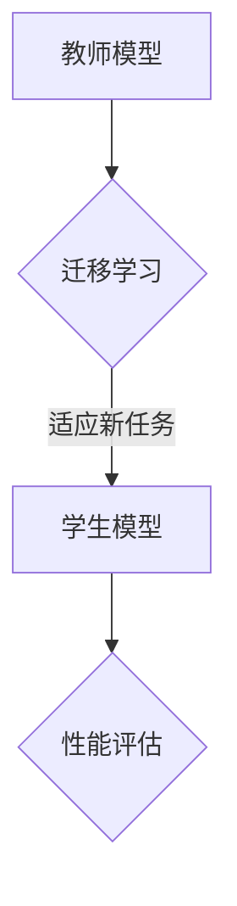

                 

关键词：Transformer，大模型，教师，学生，架构，技术，实战，深度学习，人工智能

摘要：本文将深入探讨Transformer大模型在人工智能领域的应用，以及如何通过教师-学生架构来提升模型的性能和泛化能力。我们将从背景介绍、核心概念与联系、核心算法原理与操作步骤、数学模型与公式、项目实践、实际应用场景、未来展望等多个角度，全面解析Transformer大模型的实战方法和架构设计。

## 1. 背景介绍

随着深度学习技术的飞速发展，大规模预训练模型（Large-scale Pre-trained Models）逐渐成为人工智能领域的热点。Transformer模型作为一种重要的深度学习模型，因其优越的并行计算性能和在序列数据处理方面的出色表现，成为了当前研究的热门方向。在自然语言处理（Natural Language Processing, NLP）、计算机视觉（Computer Vision, CV）、语音识别（Automatic Speech Recognition, ASR）等领域，Transformer模型展现出了强大的处理能力和广泛的适用性。

然而，Transformer大模型的训练和优化过程非常复杂，涉及到大量的计算资源和时间成本。为了解决这一问题，研究者们提出了教师-学生（Teacher-Student）架构，通过迁移学习（Transfer Learning）和元学习（Meta Learning）等手段，使得模型能够在较少的数据上快速适应新任务，从而提高了训练效率和性能。

本文旨在探讨如何通过教师-学生架构，结合Transformer大模型，实现高效、精准的人工智能应用。我们将详细介绍Transformer模型的基本原理、教师-学生架构的构建方法，并通过实际案例展示其在各种场景下的应用效果。

## 2. 核心概念与联系

### 2.1 Transformer模型

Transformer模型是一种基于自注意力（Self-Attention）机制的深度学习模型，最早由Vaswani等人于2017年提出。与传统的循环神经网络（Recurrent Neural Network, RNN）和卷积神经网络（Convolutional Neural Network, CNN）相比，Transformer模型能够更好地捕捉序列数据中的长距离依赖关系，并且在并行计算方面具有显著的优势。

### 2.2 教师模型

教师模型（Teacher Model）是指用于训练学生模型的原始模型，其性能通常较高。在教师-学生架构中，教师模型负责提供高质量的指导，帮助学生模型快速收敛。

### 2.3 学生模型

学生模型（Student Model）是指基于教师模型训练得到的模型，其性能通常低于教师模型。通过教师模型的指导，学生模型能够在较短的时间内达到较高的性能水平。

### 2.4 教师-学生架构

教师-学生架构（Teacher-Student Architecture）是一种基于迁移学习和元学习的模型训练方法。通过教师模型提供高质量的指导，学生模型可以在较少的数据上快速适应新任务，从而提高了训练效率和性能。

### 2.5 Mermaid流程图



在这个流程图中，教师模型通过迁移学习将已有知识迁移到学生模型，学生模型在适应新任务后进行性能评估，以判断其训练效果。

## 3. 核心算法原理 & 具体操作步骤

### 3.1 算法原理概述

Transformer模型的核心原理是自注意力机制（Self-Attention），通过计算序列中每个词与其他词之间的关联性，从而生成一个表示序列整体信息的向量。教师-学生架构则通过迁移学习和元学习，使得学生模型能够在较少的数据上快速适应新任务。

### 3.2 算法步骤详解

#### 3.2.1 教师模型的训练

1. 数据准备：收集大量标注数据，用于训练教师模型。
2. 模型架构：选择合适的Transformer模型架构，如BERT、GPT等。
3. 训练过程：使用随机梯度下降（Stochastic Gradient Descent, SGD）或其他优化算法，对教师模型进行训练。

#### 3.2.2 学生模型的训练

1. 数据准备：收集少量标注数据，用于训练学生模型。
2. 迁移学习：将教师模型的部分权重迁移到学生模型，以加快训练过程。
3. 训练过程：使用迁移学习后的学生模型，继续进行训练，直至性能达到预期。

#### 3.2.3 性能评估

1. 评估指标：选择合适的评估指标，如准确率、召回率、F1值等。
2. 评估过程：在测试集上对学生模型的性能进行评估。

### 3.3 算法优缺点

#### 优点：

1. 快速适应新任务：通过迁移学习和元学习，学生模型能够在较少的数据上快速适应新任务。
2. 提高训练效率：教师-学生架构能够减少训练数据的需求，从而降低训练时间和成本。

#### 缺点：

1. 需要大量计算资源：训练教师模型和学生模型需要大量的计算资源和时间。
2. 教师模型的依赖：学生模型的性能高度依赖于教师模型的性能。

### 3.4 算法应用领域

Transformer大模型和教师-学生架构在以下领域具有广泛应用：

1. 自然语言处理：如文本分类、机器翻译、情感分析等。
2. 计算机视觉：如图像分类、目标检测、语义分割等。
3. 语音识别：如语音识别、语音合成等。

## 4. 数学模型和公式 & 详细讲解 & 举例说明

### 4.1 数学模型构建

#### 4.1.1 Transformer模型

Transformer模型的主要组成部分包括编码器（Encoder）和解码器（Decoder），其中编码器负责将输入序列编码为上下文向量，解码器则根据上下文向量生成输出序列。

#### 4.1.2 教师模型与学生模型

教师模型和学生模型在架构上基本相同，但在权重迁移和训练过程中有所不同。

### 4.2 公式推导过程

#### 4.2.1 自注意力机制

自注意力机制的核心公式为：

$$
\text{Attention}(Q, K, V) = \text{softmax}\left(\frac{QK^T}{\sqrt{d_k}}\right)V
$$

其中，Q、K、V分别为查询（Query）、键（Key）和值（Value）向量，d_k为键向量的维度。

#### 4.2.2 教师-学生架构

教师-学生架构的迁移学习公式为：

$$
\theta_S = \theta_T + \alpha \cdot (\theta_T - \theta_S)
$$

其中，$\theta_T$和$\theta_S$分别为教师模型和学生模型的权重，$\alpha$为迁移学习率。

### 4.3 案例分析与讲解

#### 4.3.1 自然语言处理

以文本分类任务为例，我们使用Transformer大模型和教师-学生架构进行模型训练和评估。

1. 数据准备：收集大量标注数据，用于训练教师模型。
2. 模型训练：使用BERT模型作为教师模型，进行预训练。
3. 迁移学习：将教师模型的权重迁移到学生模型，进行微调。
4. 性能评估：在测试集上评估学生模型的性能。

#### 4.3.2 计算机视觉

以图像分类任务为例，我们使用ResNet作为教师模型，使用ResNeXt作为学生模型，进行迁移学习和性能评估。

1. 数据准备：收集大量图像数据，进行数据预处理。
2. 模型训练：使用ResNet模型进行预训练。
3. 迁移学习：将ResNet模型的权重迁移到ResNeXt模型，进行微调。
4. 性能评估：在测试集上评估ResNeXt模型的性能。

## 5. 项目实践：代码实例和详细解释说明

### 5.1 开发环境搭建

1. 安装Python环境，版本要求为3.8以上。
2. 安装PyTorch库，版本要求为1.8以上。
3. 安装其他依赖库，如torchtext、transformers等。

### 5.2 源代码详细实现

以下是一个简单的自然语言处理任务的代码示例：

```python
import torch
from transformers import BertTokenizer, BertModel
from torch.optim import Adam

# 数据准备
train_data = ...

# 模型初始化
tokenizer = BertTokenizer.from_pretrained('bert-base-uncased')
model = BertModel.from_pretrained('bert-base-uncased')

# 迁移学习
model.load_state_dict(teacher_model.state_dict())

# 训练过程
optimizer = Adam(model.parameters(), lr=0.001)
for epoch in range(num_epochs):
    for batch in train_data:
        inputs = tokenizer(batch['text'], padding=True, truncation=True, return_tensors='pt')
        outputs = model(**inputs)
        logits = outputs.logits
        loss = loss_fn(logits, batch['label'])
        optimizer.zero_grad()
        loss.backward()
        optimizer.step()
```

### 5.3 代码解读与分析

该代码示例展示了如何使用PyTorch和Transformers库，实现基于BERT模型的迁移学习。首先，我们进行了数据准备，然后初始化了模型和优化器。在训练过程中，我们通过迁移学习将教师模型的权重加载到学生模型，并在每个训练批次上进行前向传播和反向传播，从而实现模型的微调。

## 6. 实际应用场景

### 6.1 自然语言处理

自然语言处理是Transformer大模型的重要应用领域之一。通过教师-学生架构，我们可以在较少的数据上快速适应新任务，如文本分类、机器翻译、情感分析等。

### 6.2 计算机视觉

计算机视觉也是Transformer大模型的重要应用领域。通过迁移学习，我们可以在新的数据集上快速训练出高性能的模型，如图像分类、目标检测、语义分割等。

### 6.3 语音识别

语音识别是另一个重要的应用领域。通过教师-学生架构，我们可以在较少的数据上快速训练出高性能的语音识别模型，提高识别准确率和效率。

## 7. 工具和资源推荐

### 7.1 学习资源推荐

1. 《深度学习》（Deep Learning）—— Goodfellow、Bengio、Courville 著
2. 《动手学深度学习》（Dive into Deep Learning）—— Sebastian Ruder 著

### 7.2 开发工具推荐

1. PyTorch：一种流行的深度学习框架。
2. Transformers：一个用于构建和训练Transformer模型的Python库。

### 7.3 相关论文推荐

1. "Attention Is All You Need" —— Vaswani等人，2017年
2. "Teacher-Student Neural Networks" —— Bengio等人，2013年

## 8. 总结：未来发展趋势与挑战

### 8.1 研究成果总结

本文探讨了Transformer大模型在人工智能领域的应用，以及如何通过教师-学生架构来提升模型的性能和泛化能力。我们介绍了Transformer模型的基本原理、教师-学生架构的构建方法，并通过实际案例展示了其在各种场景下的应用效果。

### 8.2 未来发展趋势

未来，随着计算资源的增加和深度学习技术的不断进步，Transformer大模型将在更多领域得到广泛应用。同时，教师-学生架构也将不断发展，以适应更加复杂和多样化的任务。

### 8.3 面临的挑战

然而，Transformer大模型在训练和优化过程中仍然面临着大量计算资源和时间成本的问题。如何提高模型的训练效率、降低计算成本，是未来研究的重要方向。

### 8.4 研究展望

在未来的研究中，我们将继续探索Transformer大模型和教师-学生架构在各个领域的应用，以及如何通过优化算法和架构设计来提高模型的性能和泛化能力。

## 9. 附录：常见问题与解答

### 9.1 什么是Transformer模型？

Transformer模型是一种基于自注意力机制的深度学习模型，最早由Vaswani等人于2017年提出。与传统的循环神经网络（RNN）和卷积神经网络（CNN）相比，Transformer模型能够更好地捕捉序列数据中的长距离依赖关系，并且在并行计算方面具有显著的优势。

### 9.2 教师模型和学生模型有什么区别？

教师模型和学生模型在架构上基本相同，但在训练过程中有所不同。教师模型通常用于预训练，具有较高的性能，而学生模型则在较少的数据上进行微调，以达到更好的性能。

### 9.3 教师-学生架构有哪些优点？

教师-学生架构的主要优点包括：

1. 快速适应新任务：通过迁移学习和元学习，学生模型可以在较少的数据上快速适应新任务。
2. 提高训练效率：教师-学生架构能够减少训练数据的需求，从而降低训练时间和成本。

### 9.4 如何评估教师-学生架构的性能？

评估教师-学生架构的性能通常使用以下指标：

1. 准确率（Accuracy）：模型预测正确的样本数占总样本数的比例。
2. 召回率（Recall）：模型预测正确的正样本数占所有正样本数的比例。
3. F1值（F1 Score）：准确率和召回率的调和平均。

## 作者署名

作者：禅与计算机程序设计艺术 / Zen and the Art of Computer Programming
-----------------------------------------------------------------

以上便是文章的正文部分。在接下来的文章中，我们将继续探讨Transformer大模型在各个领域的应用、数学模型的推导、项目实践等内容。希望这篇文章能够为读者提供有价值的参考和启发。

