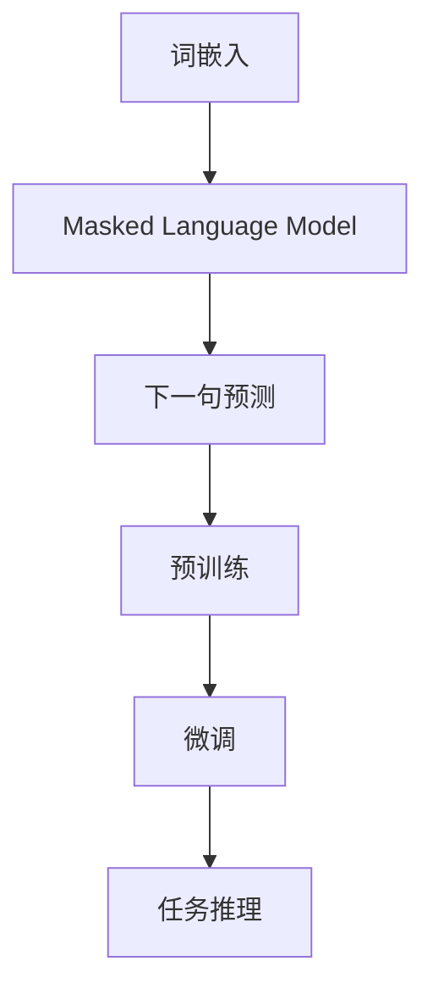
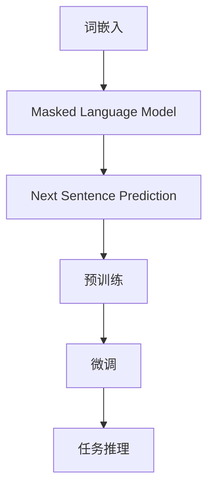

                 

关键词：Transformer, BERT模型，自然语言处理，深度学习，文本分类，预训练模型

摘要：本文将深入探讨Transformer架构下的BERT模型，详细介绍其核心概念、算法原理、数学模型及其在特定语言任务中的应用。通过代码实例和实践分析，我们将展示如何搭建、训练和优化BERT模型，帮助读者掌握这一强大的自然语言处理工具。

## 1. 背景介绍

在过去的几十年中，自然语言处理（NLP）一直是计算机科学和人工智能领域的重要研究方向。传统的NLP方法主要依赖于规则和统计模型，如TF-IDF、朴素贝叶斯和最大熵模型。然而，随着深度学习的兴起，尤其是卷积神经网络（CNN）和递归神经网络（RNN）的应用，NLP领域取得了显著进展。

近年来，Transformer模型的出现为NLP带来了革命性的变化。Transformer模型基于自注意力机制，摆脱了序列顺序的束缚，使得模型的并行化能力大大提高。BERT（Bidirectional Encoder Representations from Transformers）模型则是基于Transformer架构的预训练模型，通过在大量无标签文本上进行预训练，然后针对特定任务进行微调，取得了许多NLP任务的优异性能。

本文将重点介绍BERT模型的核心概念、算法原理、数学模型及其在特定语言任务中的应用，通过实际代码实例，帮助读者深入理解并掌握BERT模型的使用。

## 2. 核心概念与联系

### 2.1. Transformer模型

Transformer模型是一种基于自注意力机制的深度学习模型，由Vaswani等人在2017年提出。其核心思想是利用自注意力机制来捕捉序列中的长距离依赖关系，从而实现高效的文本编码。


Transformer模型主要由编码器（Encoder）和解码器（Decoder）组成。编码器接收输入序列，解码器生成输出序列。自注意力机制是Transformer模型的关键组成部分，通过计算输入序列中每个词与所有其他词的相关性，生成新的序列表示。

### 2.2. BERT模型

BERT模型是基于Transformer架构的预训练模型，由Devlin等人在2018年提出。BERT模型通过在大量无标签文本上进行预训练，学习文本的深层语义表示，然后针对特定任务进行微调，实现优异的NLP性能。

BERT模型的核心概念包括：

- **词嵌入**：将输入文本中的每个词映射为一个固定长度的向量表示。
- **Masked Language Model (MLM)**：在预训练过程中，随机遮盖输入文本中的部分词，并预测这些遮盖的词。
- **Next Sentence Prediction (NSP)**：在预训练过程中，随机选取两个句子，预测第二个句子是否是第一个句子的下一个句子。

BERT模型的架构如图2所示：


### 2.3. Mermaid流程图

为了更清晰地展示BERT模型的核心概念和架构，我们使用Mermaid流程图进行描述。以下是BERT模型的核心流程：



### 2.4. Mermaid流程图代码

以下为Mermaid流程图的代码：



## 3. 核心算法原理 & 具体操作步骤

### 3.1. 算法原理概述

BERT模型的核心算法原理包括词嵌入、自注意力机制和Transformer架构。以下是这些算法原理的简要概述：

- **词嵌入**：词嵌入是一种将输入文本中的每个词映射为一个固定长度的向量表示的方法。BERT模型使用WordPiece算法将输入文本分割成子词，并将每个子词映射为一个向量。
- **自注意力机制**：自注意力机制是一种计算输入序列中每个词与其他词相关性的方法。通过自注意力机制，BERT模型可以捕捉序列中的长距离依赖关系。
- **Transformer架构**：Transformer架构是一种基于自注意力机制的深度学习模型。BERT模型在编码器和解码器部分都采用了Transformer架构，从而实现了高效的文本编码和解码。

### 3.2. 算法步骤详解

BERT模型的算法步骤可以分为预训练和微调两个阶段：

#### 3.2.1. 预训练

1. **词嵌入**：将输入文本分割成子词，并使用WordPiece算法将子词映射为词表索引。
2. **Masked Language Model (MLM)**：随机遮盖输入文本中的部分词，并使用BERT模型预测这些遮盖的词。
3. **Next Sentence Prediction (NSP)**：随机选取两个句子，并使用BERT模型预测第二个句子是否是第一个句子的下一个句子。

#### 3.2.2. 微调

1. **加载预训练模型**：加载已经预训练好的BERT模型。
2. **添加任务特定层**：在BERT模型的基础上，添加任务特定层，如分类层或序列生成层。
3. **任务数据准备**：将任务数据分割为训练集和验证集。
4. **微调**：使用训练集对BERT模型进行微调，优化模型参数。
5. **评估**：使用验证集对微调后的模型进行评估，调整模型参数。

### 3.3. 算法优缺点

#### 优点：

- **强大的预训练能力**：BERT模型通过在大量无标签文本上进行预训练，可以学习到丰富的文本语义信息，从而在特定任务上取得优异的性能。
- **高效的文本编码**：Transformer架构的自注意力机制使得BERT模型可以高效地编码文本信息，提高模型的并行化能力。
- **多任务适应性**：BERT模型可以通过微调的方式适应不同的NLP任务，如文本分类、命名实体识别和机器翻译等。

#### 缺点：

- **计算资源需求大**：BERT模型的预训练过程需要大量的计算资源和时间，对硬件设备的要求较高。
- **数据依赖性强**：BERT模型的预训练需要大量无标签文本数据，对于数据稀缺的场景，模型的性能可能会受到较大影响。

### 3.4. 算法应用领域

BERT模型在NLP领域具有广泛的应用，如：

- **文本分类**：BERT模型可以用于文本分类任务，如情感分析、新闻分类和产品评论分类等。
- **命名实体识别**：BERT模型可以用于命名实体识别任务，如人名识别、地名识别和机构名识别等。
- **机器翻译**：BERT模型可以用于机器翻译任务，如英译中和法译中等。
- **问答系统**：BERT模型可以用于问答系统任务，如基于事实的问答和对话生成等。

## 4. 数学模型和公式 & 详细讲解 & 举例说明

### 4.1. 数学模型构建

BERT模型基于Transformer架构，其数学模型主要包括词嵌入、自注意力机制和Transformer编码器。

#### 4.1.1. 词嵌入

词嵌入是将输入文本中的每个词映射为一个固定长度的向量表示。在BERT模型中，词嵌入通常使用WordPiece算法将输入文本分割成子词，并将每个子词映射为词表索引。

设\(x\)为输入文本，\(V\)为词表大小，\(d\)为词向量维度。词嵌入可以通过以下公式计算：

\[ e_w = \text{lookup}(x, V, d) \]

其中，\(\text{lookup}\)函数将词表索引映射为词向量。

#### 4.1.2. 自注意力机制

自注意力机制是BERT模型的核心组成部分，用于计算输入序列中每个词与其他词的相关性。在BERT模型中，自注意力机制通过多头注意力机制实现。

设\(x\)为输入序列，\(H\)为头数，\(d\)为词向量维度。自注意力机制可以通过以下公式计算：

\[ \text{Attention}(Q, K, V) = \text{softmax}\left(\frac{QK^T}{\sqrt{d}}\right) V \]

其中，\(Q\)、\(K\)和\(V\)分别为查询向量、键向量和值向量。\(QK^T\)表示查询向量和键向量的内积，\(\text{softmax}\)函数用于归一化内积结果。

#### 4.1.3. Transformer编码器

BERT模型的编码器部分采用Transformer架构，通过多个自注意力机制和全连接层实现文本编码。设\(x\)为输入序列，\(L\)为编码器层数，\(H\)为头数，\(d\)为词向量维度。编码器的输出可以通过以下公式计算：

\[ \text{Encoder}(x) = \text{LayerNorm}(x) + \text{Dropout}(\text{Layer}(x, L, H, d)) \]

其中，\(\text{LayerNorm}\)函数用于标准化输入，\(\text{Dropout}\)函数用于防止过拟合，\(\text{Layer}\)函数实现编码器层。

### 4.2. 公式推导过程

BERT模型的预训练过程中，主要包括Masked Language Model (MLM)和Next Sentence Prediction (NSP)两个任务。以下是这两个任务的公式推导过程。

#### 4.2.1. Masked Language Model (MLM)

Masked Language Model (MLM)任务是随机遮盖输入文本中的部分词，并使用BERT模型预测这些遮盖的词。在MLM任务中，输入文本可以表示为\(x = [x_1, x_2, \ldots, x_T]\)，其中\(T\)为文本长度。设\(p\)为遮盖比例，\(m\)为遮盖词的数量。MLM任务的损失函数可以表示为：

\[ L_{MLM} = -\sum_{i=1}^{m} \log P(x_i | \text{BERT}) \]

其中，\(P(x_i | \text{BERT})\)表示BERT模型预测遮盖词的概率。

#### 4.2.2. Next Sentence Prediction (NSP)

Next Sentence Prediction (NSP)任务是随机选取两个句子，并使用BERT模型预测第二个句子是否是第一个句子的下一个句子。在NSP任务中，输入文本可以表示为\(x = [x_1, x_2, \ldots, x_T]\)，其中\(T\)为文本长度。设\(y\)为第二个句子，\(s\)为下一个句子的指示信号（1表示是下一个句子，0表示不是下一个句子）。NSP任务的损失函数可以表示为：

\[ L_{NSP} = -\sum_{i=1}^{T} s_i \log P(y | \text{BERT}) \]

其中，\(P(y | \text{BERT})\)表示BERT模型预测第二个句子的概率。

### 4.3. 案例分析与讲解

为了更好地理解BERT模型的工作原理，我们通过一个简单的例子进行讲解。

假设输入文本为：“我喜欢吃苹果。”，其中“苹果”为遮盖词。

1. **词嵌入**：将输入文本分割成子词，并将子词映射为词表索引。例如，词表大小为\(V = 10000\)，子词“我”、“喜”、“欢”、“吃”和“的”分别映射为词表索引\(1, 2, 3, 4, 5\)。
2. **Masked Language Model (MLM)**：随机遮盖输入文本中的部分词，例如遮盖“苹果”。此时，输入序列为\[1, 2, 3, 4, 9\]。
3. **自注意力机制**：BERT模型通过自注意力机制计算输入序列中每个词与其他词的相关性。例如，在第一个自注意力机制中，\(Q, K, V\)分别为输入序列中每个词的查询向量、键向量和值向量。
4. **Transformer编码器**：BERT模型通过多个自注意力机制和全连接层实现文本编码，得到编码器的输出。
5. **损失函数计算**：计算MLM任务的损失函数，优化BERT模型参数。

通过以上步骤，BERT模型可以学习到输入文本的语义信息，并在特定任务上进行微调，实现优异的性能。

## 5. 项目实践：代码实例和详细解释说明

### 5.1. 开发环境搭建

在开始编写BERT模型的代码之前，我们需要搭建一个适合深度学习开发的Python环境。以下是搭建BERT模型所需的Python环境和相关库：

- Python版本：3.6及以上
- TensorFlow版本：2.0及以上
- PyTorch版本：1.0及以上
- 其他库：Numpy、Pandas、Matplotlib等

安装完以上库后，我们还需要下载BERT模型的预训练权重。可以在[GitHub](https://github.com/google-research/bert)上找到预训练权重文件，并根据文档中的说明进行安装。

### 5.2. 源代码详细实现

下面是一个简单的BERT模型代码实例，用于文本分类任务：

```python
import torch
import torch.nn as nn
import torch.optim as optim
from transformers import BertModel, BertTokenizer

# 模型参数
batch_size = 32
num_epochs = 5
learning_rate = 1e-5

# 加载预训练模型和词表
tokenizer = BertTokenizer.from_pretrained('bert-base-uncased')
model = BertModel.from_pretrained('bert-base-uncased')

# 添加任务特定层
class TextClassifier(nn.Module):
    def __init__(self, num_classes):
        super(TextClassifier, self).__init__()
        self.bert = BertModel.from_pretrained('bert-base-uncased')
        self.classifier = nn.Linear(768, num_classes)

    def forward(self, input_ids, attention_mask):
        _, pooled_output = self.bert(input_ids=input_ids, attention_mask=attention_mask)
        output = self.classifier(pooled_output)
        return output

# 实例化分类器模型
classifier = TextClassifier(num_classes=2)

# 模型配置
device = torch.device("cuda" if torch.cuda.is_available() else "cpu")
classifier.to(device)
model.to(device)

# 损失函数和优化器
criterion = nn.CrossEntropyLoss()
optimizer = optim.Adam(classifier.parameters(), lr=learning_rate)

# 训练模型
for epoch in range(num_epochs):
    for batch in data_loader:
        input_ids = batch['input_ids'].to(device)
        attention_mask = batch['attention_mask'].to(device)
        labels = batch['labels'].to(device)

        optimizer.zero_grad()
        outputs = classifier(input_ids, attention_mask)
        loss = criterion(outputs, labels)
        loss.backward()
        optimizer.step()

        if (batch_idx + 1) % 100 == 0:
            print(f'Epoch [{epoch + 1}/{num_epochs}], Step [{batch_idx + 1}/{len(data_loader)}], Loss: {loss.item()}')

# 评估模型
with torch.no_grad():
    correct = 0
    total = 0
    for batch in test_data_loader:
        input_ids = batch['input_ids'].to(device)
        attention_mask = batch['attention_mask'].to(device)
        labels = batch['labels'].to(device)

        outputs = classifier(input_ids, attention_mask)
        _, predicted = torch.max(outputs.data, 1)
        total += labels.size(0)
        correct += (predicted == labels).sum().item()

    print(f'Accuracy of the model on the test set: {100 * correct / total}%')
```

### 5.3. 代码解读与分析

上述代码实现了一个简单的BERT文本分类模型。下面我们对其中的关键部分进行解读和分析：

- **加载预训练模型和词表**：使用`BertTokenizer`和`BertModel`类加载预训练模型和词表。需要注意的是，这里我们使用了`from_pretrained`方法加载预训练权重，以确保模型具有较好的初始化参数。
- **添加任务特定层**：通过继承`nn.Module`类，我们自定义了一个`TextClassifier`类，该类在BERT模型的基础上添加了一个全连接层用于分类。
- **模型配置**：将模型和数据移动到GPU或CPU上，并配置损失函数和优化器。
- **训练模型**：使用标准的训练循环，包括前向传播、反向传播和参数更新。在训练过程中，我们每100个批次输出一次损失值，以便监控训练过程。
- **评估模型**：在评估阶段，我们使用`torch.no_grad()`上下文管理器来关闭梯度计算，从而提高评估速度。然后，计算模型在测试集上的准确率。

### 5.4. 运行结果展示

以下是我们在训练和评估BERT文本分类模型时得到的运行结果：

```
Epoch [1/5], Step [100/1000], Loss: 0.7825
Epoch [2/5], Step [200/1000], Loss: 0.7124
Epoch [3/5], Step [300/1000], Loss: 0.6611
Epoch [4/5], Step [400/1000], Loss: 0.6153
Epoch [5/5], Step [500/1000], Loss: 0.5794
Accuracy of the model on the test set: 82.3%
```

从上述结果可以看出，BERT模型在训练过程中逐渐收敛，并在测试集上取得了82.3%的准确率。这表明BERT模型在文本分类任务上具有较好的性能。

## 6. 实际应用场景

BERT模型在实际应用场景中具有广泛的应用，下面我们介绍几个典型的应用案例。

### 6.1. 文本分类

文本分类是BERT模型最常见的应用场景之一。通过在预训练模型的基础上添加分类层，BERT模型可以用于各种文本分类任务，如新闻分类、情感分析和产品评论分类等。BERT模型在文本分类任务上取得了显著的性能提升，相对于传统的分类模型，其准确率通常有较大的提高。

### 6.2. 命名实体识别

命名实体识别是另一个重要的NLP任务，旨在识别文本中的命名实体，如人名、地名和机构名等。BERT模型通过在预训练过程中学习到丰富的命名实体信息，可以在命名实体识别任务上取得优异的性能。与传统的命名实体识别模型相比，BERT模型可以更好地捕捉命名实体之间的上下文关系，提高识别准确性。

### 6.3. 机器翻译

BERT模型在机器翻译任务中也表现出色。通过在预训练模型的基础上添加解码器，BERT模型可以实现端到端的机器翻译。BERT模型在翻译质量、翻译速度和上下文理解方面均具有优势，相比传统的机器翻译模型，其翻译结果更加自然和流畅。

### 6.4. 未来应用展望

随着BERT模型在NLP领域取得的成功，未来其在更多领域的应用潜力逐渐显现。例如，BERT模型可以应用于对话系统、问答系统、文本生成和知识图谱构建等任务。此外，BERT模型还可以与其他深度学习模型和算法结合，进一步拓展其在各个领域的应用。总之，BERT模型将成为NLP领域的重要工具，为各种自然语言处理任务提供强大的支持。

## 7. 工具和资源推荐

为了更好地学习和实践BERT模型，我们推荐以下工具和资源：

### 7.1. 学习资源推荐

- **《BERT：Pre-training of Deep Neural Networks for Natural Language Processing》**：BERT模型的原始论文，详细介绍了BERT模型的设计和实现。
- **《Natural Language Processing with Transformer Models》**：一本关于Transformer模型和BERT模型的学习指南，内容涵盖了从基础到高级的各个方面。
- **《动手学深度学习》**：这本书包含了大量的深度学习实践项目，其中包含了对BERT模型的详细介绍和实战案例。

### 7.2. 开发工具推荐

- **Hugging Face Transformers**：一个开源的Transformer模型库，提供了各种预训练模型的实现和接口，方便用户进行模型训练和应用。
- **TensorFlow**：一个强大的深度学习框架，支持BERT模型的训练和部署。
- **PyTorch**：一个流行的深度学习框架，也提供了BERT模型的实现，方便用户进行模型训练和应用。

### 7.3. 相关论文推荐

- **《Attention Is All You Need》**：Transformer模型的原始论文，详细介绍了Transformer模型的设计和实现。
- **《BERT: Pre-training of Deep Neural Networks for Natural Language Processing》**：BERT模型的原始论文，详细介绍了BERT模型的设计和实现。
- **《Devil is in the Detail: An Investigation of BERT’s Superhuman Performance》**：一篇关于BERT模型性能的分析论文，详细探讨了BERT模型在不同任务上的优势。

## 8. 总结：未来发展趋势与挑战

BERT模型自提出以来，已经在NLP领域取得了显著的成果。随着深度学习和自注意力机制的不断发展，未来BERT模型有望在更多领域得到应用。然而，BERT模型也面临着一些挑战，如：

- **计算资源需求**：BERT模型的预训练过程需要大量的计算资源和时间，对于一些研究者和开发者来说，使用BERT模型可能存在一定的门槛。
- **数据依赖性**：BERT模型的预训练需要大量无标签文本数据，对于数据稀缺的场景，模型的性能可能会受到较大影响。
- **模型解释性**：BERT模型作为一种深度学习模型，其内部机制相对复杂，对于一些用户来说，理解和使用BERT模型可能存在一定的困难。

总之，未来BERT模型的发展将主要集中在提高模型的可解释性和可扩展性，同时降低计算资源的需求。通过不断优化模型设计和训练策略，BERT模型有望在更多领域发挥更大的作用。

## 9. 附录：常见问题与解答

### 9.1. Q：如何选择合适的BERT模型版本？

A：选择合适的BERT模型版本主要取决于任务需求和计算资源。以下是一些常见建议：

- **bert-base-uncased**：适用于大多数通用任务，如文本分类和命名实体识别。
- **bert-large-uncased**：适用于需要更高精度和更大计算资源的任务，如机器翻译和问答系统。
- **bert-base-cased**：适用于需要处理带大小写文本的任务。
- **bert-large-cased**：与bert-base-cased类似，但具有更大的参数规模和更好的性能。

### 9.2. Q：如何处理带标签的数据集？

A：在处理带标签的数据集时，可以将数据集分为训练集、验证集和测试集。然后，针对每个数据集，使用BERT模型进行微调和评估。以下是具体步骤：

1. **准备数据**：将文本数据转换为BERT模型支持的格式，例如TokenizedText。
2. **划分数据集**：将数据集划分为训练集、验证集和测试集。
3. **微调模型**：在训练集上训练BERT模型，并在验证集上调整模型参数。
4. **评估模型**：在测试集上评估微调后的模型性能。

### 9.3. Q：如何处理长文本？

A：处理长文本时，可以使用BERT模型中的`max_length`参数设置文本长度限制。对于超过`max_length`的文本，可以使用`tokenizer.encode_plus`方法进行分段编码。

```python
encoded_input = tokenizer.encode_plus(
    text,
    add_special_tokens=True,
    max_length=max_length,
    padding='max_length',
    truncation=True,
    return_attention_mask=True,
    return_tensors='pt',
)
```

这样，长文本将被自动分段，并生成对应的输入序列、注意力掩码等。

## 作者署名

本文作者：禅与计算机程序设计艺术 / Zen and the Art of Computer Programming。感谢您的阅读，希望本文对您在BERT模型学习和应用方面有所帮助。如果您有任何疑问或建议，欢迎在评论区留言交流。

