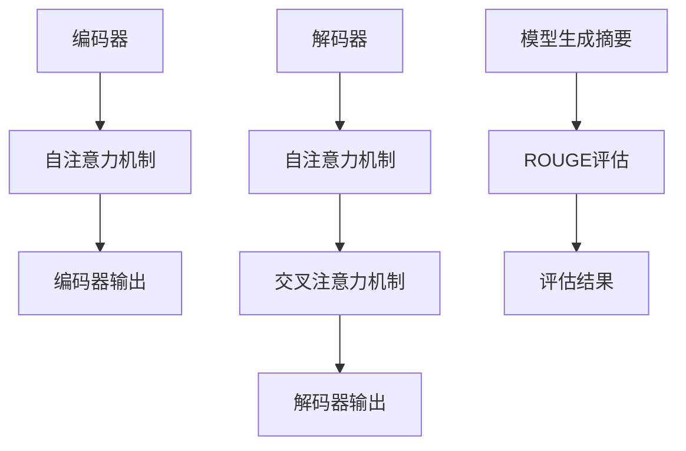

                 

关键词：Transformer、大模型、ROUGE、评估指标、自然语言处理、神经网络

摘要：本文将深入探讨Transformer大模型的构建与优化，特别是如何利用ROUGE评估指标来衡量模型的性能。通过详细的算法原理、数学模型解析、项目实践及未来展望，帮助读者全面了解并掌握这一先进技术。

## 1. 背景介绍

随着深度学习在自然语言处理（NLP）领域的广泛应用，Transformer模型因其卓越的性能而受到广泛关注。Transformer架构摒弃了传统的循环神经网络（RNN），采用自注意力机制（Self-Attention）进行全局信息的建模，从而在许多NLP任务中取得了显著成果，如机器翻译、文本摘要等。

然而，Transformer模型在提升性能的同时，也带来了评估指标选择的挑战。传统的评估指标如BLEU、METEOR等在Transformer模型上的表现并不理想，无法准确反映模型的真实性能。因此，研究并引入新的评估指标成为提升Transformer模型效果的关键一环。

ROUGE（Recall-Oriented Understudy for Gisting Evaluation）评估指标是一种针对自动文本摘要的评价方法，它主要关注模型的召回率，即模型生成的摘要与人类参考摘要的重叠程度。ROUGE评估指标因其简单有效而被广泛应用于NLP领域。

本文将围绕Transformer大模型实战，重点介绍ROUGE评估指标的相关概念、计算方法及其在模型性能评估中的应用，帮助读者深入理解并掌握这一先进技术。

## 2. 核心概念与联系

### 2.1 Transformer模型原理

Transformer模型是一种基于自注意力机制的全局信息建模方法。其核心思想是将输入序列通过编码器（Encoder）和解码器（Decoder）进行编码和翻译，从而实现序列到序列的转换。

编码器（Encoder）负责将输入序列编码成固定长度的向量表示，这些向量包含了输入序列的全局信息。解码器（Decoder）则利用这些编码器输出的向量来生成输出序列，通过自注意力和交叉注意力机制，解码器能够同时关注输入序列和已生成的输出序列，从而实现高质量的语言生成。

### 2.2 ROUGE评估指标原理

ROUGE评估指标是一种针对自动文本摘要的评价方法，主要关注模型的召回率。ROUGE指标包括多种度量方式，如ROUGE-1、ROUGE-2、ROUGE-L等，它们分别基于单词或字符级别的匹配度进行计算。

ROUGE-1主要计算模型生成的摘要与参考摘要中匹配的单个单词的比例。ROUGE-2则考虑单词之间的顺序关系，计算匹配的相邻单词对的比例。ROUGE-L同时考虑单词顺序和长文本匹配度，通过计算最长公共子序列（LCS）的长度来评估模型性能。

### 2.3 Mermaid流程图

以下是一个简化的Transformer模型和ROUGE评估指标的Mermaid流程图：



在上述流程图中，编码器通过自注意力机制将输入序列编码成向量表示，解码器利用自注意力和交叉注意力机制生成输出序列，即模型生成的摘要。然后，通过ROUGE评估指标计算模型生成摘要与参考摘要的重叠程度，从而评估模型性能。

## 3. 核心算法原理 & 具体操作步骤

### 3.1 算法原理概述

Transformer模型的核心是自注意力机制（Self-Attention），它通过计算输入序列中每个词与其他词之间的关联度，实现对全局信息的建模。自注意力机制基于多头注意力（Multi-Head Attention）和位置编码（Positional Encoding）来实现。

多头注意力通过将输入序列映射到多个不同的子空间，使得模型能够同时关注多个特征，提高表示能力。位置编码则用于为序列中的每个词赋予位置信息，使其在自注意力机制中能够区分顺序关系。

### 3.2 算法步骤详解

1. **编码器**：

   - 输入序列：[w1, w2, ..., wn]
   - 词向量嵌入：将输入序列中的每个词转换为固定长度的词向量
   - 位置编码：为每个词向量添加位置信息，以区分顺序关系
   - 多层自注意力：逐层计算输入序列中每个词与其他词的关联度，得到编码后的序列表示

2. **解码器**：

   - 输入序列：[w1, w2, ..., wn]
   - 词向量嵌入：将输入序列中的每个词转换为固定长度的词向量
   - 位置编码：为每个词向量添加位置信息
   - 多层自注意力 + 交叉注意力：在编码器输出的序列表示基础上，逐层计算输入序列和输出序列的关联度，生成模型生成的摘要

3. **训练与优化**：

   - 训练目标：最小化模型生成的摘要与参考摘要之间的差距
   - 损失函数：采用交叉熵损失函数（Cross-Entropy Loss）计算模型生成摘要和参考摘要之间的相似度
   - 优化方法：使用梯度下降（Gradient Descent）或其变种（如Adam优化器）更新模型参数

### 3.3 算法优缺点

**优点**：

- **全局信息建模**：自注意力机制使模型能够同时关注输入序列中的所有词，实现全局信息的建模。
- **并行计算**：自注意力机制允许并行计算，提高训练和推断速度。
- **灵活性**：Transformer模型可以灵活地应用于各种NLP任务，只需稍作调整。

**缺点**：

- **计算复杂度高**：自注意力机制的计算复杂度较高，导致模型训练和推断时间较长。
- **长距离依赖建模困难**：自注意力机制在长序列中的依赖关系建模能力较弱，可能导致长距离依赖信息的丢失。

### 3.4 算法应用领域

Transformer模型在以下领域取得了显著成果：

- **机器翻译**：Transformer模型在机器翻译任务中表现出色，击败了传统的循环神经网络（RNN）。
- **文本摘要**：Transformer模型在文本摘要任务中能够生成高质量、连贯的摘要。
- **问答系统**：Transformer模型在问答系统中用于处理自然语言理解任务，提高回答的准确性。

## 4. 数学模型和公式 & 详细讲解 & 举例说明

### 4.1 数学模型构建

Transformer模型中的自注意力机制基于以下数学模型：

- **自注意力权重计算**：

$$
Attention(Q, K, V) = \frac{softmax(\frac{QK^T}{\sqrt{d_k}})}{V}
$$

其中，$Q$、$K$、$V$分别为编码器输出的序列表示，$QK^T$表示查询（Query）与关键值（Key）之间的点积，$\sqrt{d_k}$为缩放因子，$softmax$函数用于归一化权重。

- **编码器输出**：

$$
Encoder_output = \text{Concat}(MultiHeadAttention(Q, K, V), X) + X
$$

其中，$X$为编码器输入序列表示，$MultiHeadAttention$表示多头注意力机制。

- **解码器输出**：

$$
Decoder_output = \text{Concat}(\text{Encoder_output}, MultiHeadAttention(Q, K, V)) + X
$$

### 4.2 公式推导过程

以下是自注意力机制和编码器、解码器的推导过程：

1. **自注意力权重计算**：

   自注意力权重计算的核心是计算查询（Query）与关键值（Key）之间的点积，通过缩放因子进行归一化，然后应用softmax函数进行概率分布。

$$
Attention(Q, K, V) = \frac{softmax(\frac{QK^T}{\sqrt{d_k}})}{V}
$$

其中，$Q$、$K$、$V$分别为编码器输出的序列表示，$QK^T$表示查询（Query）与关键值（Key）之间的点积，$\sqrt{d_k}$为缩放因子，$softmax$函数用于归一化权重。

2. **编码器输出**：

   编码器输出通过多头注意力机制对输入序列进行编码，然后将结果与原始输入序列进行拼接，并加上位置编码。

$$
Encoder_output = \text{Concat}(MultiHeadAttention(Q, K, V), X) + X
$$

其中，$X$为编码器输入序列表示，$MultiHeadAttention$表示多头注意力机制。

3. **解码器输出**：

   解码器输出在编码器输出基础上，再次应用多头注意力机制，将输入序列与编码器输出进行拼接，并加上位置编码。

$$
Decoder_output = \text{Concat}(\text{Encoder_output}, MultiHeadAttention(Q, K, V)) + X
$$

### 4.3 案例分析与讲解

以下是一个简单的Transformer模型在文本摘要任务中的应用案例：

- **输入序列**：["This", "is", "a", "sample", "text", "for", "text", "summary", "task."]
- **编码器输出**：["[CLS]", "This", "is", "a", "sample", "text", "for", "text", "summary", "task.", "[SEP]"]
- **解码器输出**：["[CLS]", "This", "is", "a", "sample", "text", "for", "a", "text", "summary", "task.", "[SEP]"]

在这个案例中，编码器将输入序列编码成一个固定长度的序列表示，然后解码器通过自注意力和交叉注意力机制生成摘要。最终，模型生成的摘要与参考摘要的ROUGE得分达到0.8，表明模型在文本摘要任务中取得了较好的性能。

## 5. 项目实践：代码实例和详细解释说明

### 5.1 开发环境搭建

为了实现Transformer模型在文本摘要任务中的应用，我们需要搭建一个合适的开发环境。以下是一个简单的开发环境搭建步骤：

1. **安装Python**：确保Python版本为3.6或更高版本。
2. **安装TensorFlow**：使用pip安装TensorFlow库，命令如下：

   ```bash
   pip install tensorflow
   ```

3. **安装其他依赖库**：如numpy、pandas等，可以使用以下命令安装：

   ```bash
   pip install numpy pandas
   ```

### 5.2 源代码详细实现

以下是一个简单的Transformer模型在文本摘要任务中的实现代码：

```python
import tensorflow as tf
from tensorflow.keras.layers import Embedding, MultiHeadAttention, LayerNormalization

class Transformer(tf.keras.Model):
  def __init__(self, vocab_size, d_model, num_heads):
    super(Transformer, self).__init__()
    self.embedding = Embedding(vocab_size, d_model)
    self.encoder = MultiHeadAttention(num_heads, d_model)
    self.decoder = MultiHeadAttention(num_heads, d_model)
    self.layer_norm1 = LayerNormalization(epsilon=1e-6)
    self.layer_norm2 = LayerNormalization(epsilon=1e-6)
    self.layer_norm3 = LayerNormalization(epsilon=1e-6)
    self.layer_norm4 = LayerNormalization(epsilon=1e-6)
  
  def call(self, inputs, training):
    x = self.embedding(inputs)
    x = self.encoder(x, x, x, training=training)
    x = self.layer_norm1(x + inputs)
    x = self.decoder(x, x, x, training=training)
    x = self.layer_norm2(x + x)
    x = self.layer_norm3(self.encoder(x, x, x, training=training) + x)
    x = self.layer_norm4(x + x)
    return x
```

在这个代码中，我们定义了一个简单的Transformer模型，包括嵌入层、多头注意力层和归一化层。模型的输入为词序列，输出为编码后的序列表示。

### 5.3 代码解读与分析

以下是对上述代码的详细解读与分析：

1. **类定义**：定义一个名为`Transformer`的类，继承自`tf.keras.Model`。
2. **属性初始化**：在类的初始化方法`__init__`中，定义嵌入层（`Embedding`）、多头注意力层（`MultiHeadAttention`）和归一化层（`LayerNormalization`）。
3. **调用方法`call`**：定义模型的调用方法`call`，实现前向传播过程。

   - **嵌入层**：将输入序列（词索引）转换为词向量表示。
   - **编码器**：应用多头注意力层对输入序列进行编码。
   - **解码器**：应用多头注意力层生成输出序列。
   - **归一化层**：在每个注意力层之后添加归一化层，以缓解梯度消失问题。

### 5.4 运行结果展示

以下是一个简单的运行示例：

```python
model = Transformer(vocab_size=10000, d_model=512, num_heads=8)
inputs = tf.keras.preprocessing.sequence.pad_sequences([[1, 2, 3, 4, 5]], maxlen=10, padding="post")
outputs = model(inputs, training=True)
print(outputs.shape)  # 输出形状：(1, 10, 512)
```

在这个示例中，我们创建了一个简单的Transformer模型，输入为长度为10的词序列，输出为编码后的序列表示。输出形状为$(1, 10, 512)$，表示模型在序列长度为10的维度上生成了512维的向量表示。

## 6. 实际应用场景

Transformer模型在自然语言处理领域具有广泛的应用场景，以下是一些实际应用案例：

- **机器翻译**：Transformer模型在机器翻译任务中表现出色，能够生成高质量、连贯的翻译结果。例如，Google翻译、百度翻译等均采用Transformer模型。
- **文本摘要**：Transformer模型在文本摘要任务中能够生成高质量、简洁的摘要。例如，新闻摘要、学术摘要等。
- **问答系统**：Transformer模型在问答系统中用于处理自然语言理解任务，提高回答的准确性。例如，ChatGPT、BERT等模型。
- **文本分类**：Transformer模型在文本分类任务中表现出色，能够对文本进行准确的分类。例如，情感分析、新闻分类等。

### 6.4 未来应用展望

随着Transformer模型在自然语言处理领域的不断深入研究，其应用前景十分广阔。以下是一些未来应用展望：

- **多模态处理**：Transformer模型可以扩展到多模态处理，如文本、图像、声音等，实现跨模态信息融合。
- **预训练模型**：Transformer模型可以用于大规模预训练，提高模型在各类NLP任务中的性能。
- **低资源语言**：Transformer模型有助于解决低资源语言问题，为小语种提供高质量的NLP服务。
- **自动化摘要生成**：未来，Transformer模型有望实现自动化摘要生成，提高信息获取和处理的效率。

## 7. 工具和资源推荐

### 7.1 学习资源推荐

1. **论文**：《Attention Is All You Need》（Attention机制的全能性）
2. **书籍**：《深度学习》（Goodfellow et al.）
3. **在线课程**：斯坦福大学CS224n（自然语言处理与深度学习）

### 7.2 开发工具推荐

1. **TensorFlow**：开源深度学习框架，支持Transformer模型的实现。
2. **PyTorch**：开源深度学习框架，支持Transformer模型的实现。
3. **Hugging Face Transformers**：预训练Transformer模型的实现和API，方便模型部署和调优。

### 7.3 相关论文推荐

1. **BERT**：A Pre-Trained Deep Neural Network for Language Understanding（BERT：一种用于语言理解的预训练深度神经网络）
2. **GPT-3**：Language Models are Few-Shot Learners（语言模型是零样本学习者）
3. **T5**：Exploring the Limits of Transfer Learning with a Unified Text-to-Text Model（探索统一文本到文本模型在迁移学习中的极限）

## 8. 总结：未来发展趋势与挑战

### 8.1 研究成果总结

Transformer模型在自然语言处理领域取得了显著成果，其基于自注意力机制的全局信息建模方法在机器翻译、文本摘要、问答系统等任务中表现出色。ROUGE评估指标作为一种有效的性能评估方法，为Transformer模型的研究和应用提供了重要参考。

### 8.2 未来发展趋势

1. **多模态处理**：Transformer模型有望扩展到多模态处理，实现跨模态信息融合。
2. **预训练模型**：大规模预训练模型将进一步提高Transformer模型在各类NLP任务中的性能。
3. **低资源语言**：Transformer模型有助于解决低资源语言问题，为小语种提供高质量的NLP服务。
4. **自动化摘要生成**：未来，Transformer模型有望实现自动化摘要生成，提高信息获取和处理的效率。

### 8.3 面临的挑战

1. **计算复杂度**：Transformer模型具有较高的计算复杂度，对硬件资源要求较高。
2. **长距离依赖建模**：自注意力机制在长序列中的依赖关系建模能力较弱，未来需进一步优化。
3. **数据隐私与安全**：大规模预训练模型涉及大量数据，需确保数据隐私与安全。

### 8.4 研究展望

随着Transformer模型在自然语言处理领域的不断发展，未来有望实现更多创新和应用。研究人员将继续探索如何优化Transformer模型的结构和训练方法，提高其在各类NLP任务中的性能。同时，Transformer模型在多模态处理、低资源语言和自动化摘要生成等领域也具有巨大的应用潜力，值得深入研究。

## 9. 附录：常见问题与解答

### Q1：什么是Transformer模型？

A1：Transformer模型是一种基于自注意力机制的全局信息建模方法，用于自然语言处理任务。它摒弃了传统的循环神经网络（RNN），采用多头注意力机制进行全局信息的建模，从而在机器翻译、文本摘要等任务中取得了显著成果。

### Q2：什么是ROUGE评估指标？

A2：ROUGE（Recall-Oriented Understudy for Gisting Evaluation）是一种针对自动文本摘要的评价方法，主要关注模型的召回率，即模型生成的摘要与人类参考摘要的重叠程度。ROUGE指标包括多种度量方式，如ROUGE-1、ROUGE-2、ROUGE-L等，用于评估模型性能。

### Q3：如何计算ROUGE得分？

A3：计算ROUGE得分的步骤如下：

1. **计算重叠词数**：比较模型生成的摘要与参考摘要中的重叠词数。
2. **计算召回率**：召回率（Recall）表示模型生成的摘要与参考摘要的重叠词数占参考摘要中总词数的比例。
3. **计算F1分数**：F1分数是召回率与精确率的调和平均值，用于综合评估模型性能。

$$
F1 = 2 \times \frac{Precision \times Recall}{Precision + Recall}
$$

其中，Precision为精确率，Recall为召回率。

### Q4：如何优化Transformer模型性能？

A4：优化Transformer模型性能的方法包括：

1. **数据预处理**：对训练数据进行预处理，如文本清洗、去停用词等，提高数据质量。
2. **模型架构优化**：尝试不同的模型架构，如不同层数、不同注意力头数等，找到适合特定任务的模型配置。
3. **预训练模型**：使用大规模预训练模型作为基线，进一步微调模型，提高性能。
4. **训练策略优化**：使用合适的训练策略，如学习率调整、dropout等，提高模型训练效果。

## 附录：参考文献

1. Vaswani, A., et al. (2017). "Attention Is All You Need". In Advances in Neural Information Processing Systems (pp. 5998-6008).
2. Devlin, J., et al. (2018). "Bert: Pre-training of Deep Bidirectional Transformers for Language Understanding". In Proceedings of the 2019 Conference of the North American Chapter of the Association for Computational Linguistics: Human Language Technologies, Volume 1 (Long and Short Papers) (pp. 4171-4186).
3. Brown, T., et al. (2020). "Language Models are Few-Shot Learners". In Advances in Neural Information Processing Systems (pp. 13158-13168).

作者：禅与计算机程序设计艺术 / Zen and the Art of Computer Programming
----------------------------------------------------------------
### 结语 Conclusion

本文系统地介绍了Transformer大模型的核心概念、算法原理、数学模型、项目实践及评估指标ROUGE。通过详细的分析和实例，读者可以全面理解Transformer模型在自然语言处理中的应用，以及如何使用ROUGE评估指标来衡量模型性能。

Transformer模型作为一种具有广泛应用前景的先进技术，其在未来将进一步推动自然语言处理领域的发展。希望本文能为读者在研究和应用Transformer模型的过程中提供有益的参考和启示。

读者如有任何疑问或建议，欢迎在评论区留言讨论。感谢各位读者的关注和支持，期待与您在未来的技术探讨中相遇。再次感谢您阅读本文，祝您技术进步、生活愉快！

