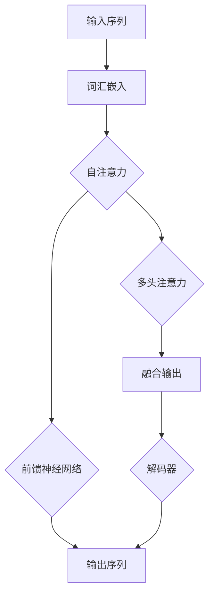

                 

在人工智能领域，Transformer架构无疑是一场革命。自从2017年谷歌提出这一模型以来，它已经成为自然语言处理（NLP）的基石。本文将深入探讨Transformer模型在西班牙语领域的应用，尤其是BETO模型，一个专为西班牙语设计的Transformer架构。

> **关键词**：Transformer，自然语言处理，西班牙语，BETO模型，深度学习

## 1. 背景介绍

Transformer模型的出现，是对传统的循环神经网络（RNN）和长短期记忆网络（LSTM）的一种颠覆。它通过自注意力机制（self-attention）和多头注意力（multi-head attention）有效地处理了序列数据，大幅度提高了模型的并行处理能力。这种革命性的设计使得Transformer成为处理大型文本数据的利器。

在西班牙语领域，由于西班牙语的特殊语法结构，传统的NLP方法往往难以胜任。西班牙语中的性别和数的变化，以及大量的不规则动词形式，都是传统模型难以处理的难题。因此，设计一个专门针对西班牙语的Transformer模型——BETO模型——具有重要的意义。

## 2. 核心概念与联系

### 2.1 Transformer架构

Transformer模型的核心是多头自注意力机制。它允许模型在处理一个序列时，同时关注序列中的所有位置，而不是像RNN那样一步一步地处理。自注意力机制通过计算每个词与序列中所有词的关联性来工作，这种关联性以分数的形式表示，然后通过softmax函数转化为概率分布，从而确定每个词的重要性。

### 2.2 BETO模型

BETO模型是在Transformer架构的基础上，针对西班牙语进行优化和调整的。它引入了多种技术来处理西班牙语的特定问题，如：

- **词汇嵌入**：针对西班牙语特有的词性变化，BETO模型使用了一种更为灵活的词汇嵌入方式，能够更好地捕捉词的不同形式。
- **语言模型预训练**：在训练过程中，BETO模型使用了大量的西班牙语数据，通过预训练来学习语言的通用特性。
- **迁移学习**：通过在已经训练好的英语模型基础上进行迁移学习，BETO模型能够利用英语模型的已有知识，从而提高在西班牙语上的性能。

### 2.3 Mermaid流程图



## 3. 核心算法原理 & 具体操作步骤

### 3.1 算法原理概述

BETO模型的核心是Transformer架构，它由编码器（encoder）和解码器（decoder）两部分组成。编码器负责将输入序列编码成固定长度的向量，而解码器则根据编码器的输出生成输出序列。

### 3.2 算法步骤详解

1. **词汇嵌入**：将输入序列中的每个词转换为嵌入向量。
2. **位置编码**：由于Transformer模型没有循环结构，需要引入位置编码来表示词在序列中的位置信息。
3. **自注意力**：计算输入序列中每个词与所有词的关联性，并根据关联性对词进行加权。
4. **多头注意力**：将自注意力扩展到多个头，每个头关注序列的不同方面。
5. **前馈神经网络**：对多头注意力的输出进行非线性变换。
6. **解码器**：根据编码器的输出和预测的下一个词，生成输出序列。

### 3.3 算法优缺点

**优点**：

- **并行处理**：Transformer模型允许并行处理整个序列，提高了计算效率。
- **捕捉长距离依赖**：通过自注意力机制，模型能够捕捉到长距离的依赖关系。
- **灵活性**：通过调整模型的参数，可以适应不同的语言和任务。

**缺点**：

- **计算复杂度**：多头注意力机制导致模型的计算复杂度较高。
- **对数据需求大**：预训练需要大量的数据进行。

### 3.4 算法应用领域

BETO模型在西班牙语领域的应用非常广泛，包括但不限于：

- **机器翻译**：将西班牙语翻译成其他语言。
- **文本生成**：根据给定的文本生成新的文本。
- **问答系统**：根据问题生成答案。

## 4. 数学模型和公式 & 详细讲解 & 举例说明

### 4.1 数学模型构建

Transformer模型的核心是多头自注意力机制。它的数学表达式如下：

$$
\text{Attention}(Q, K, V) = \text{softmax}\left(\frac{QK^T}{\sqrt{d_k}}\right)V
$$

其中，$Q$、$K$ 和 $V$ 分别是查询（query）、键（key）和值（value）向量，$d_k$ 是键向量的维度。

### 4.2 公式推导过程

首先，我们计算每个词与所有词的关联性，这通过计算点积实现：

$$
\text{Score}(Q_i, K_j) = Q_iK_j
$$

然后，我们通过 softmax 函数将关联性转化为概率分布：

$$
\text{Attention}(Q, K, V) = \text{softmax}\left(\frac{QK^T}{\sqrt{d_k}}\right)V
$$

这里的 $\sqrt{d_k}$ 是为了防止梯度消失。

### 4.3 案例分析与讲解

假设我们有以下输入序列：

```
["el", "perro", "come", "una", "manzana"]
```

我们将其转换为嵌入向量。然后，我们计算每个词与所有词的关联性，并根据关联性生成概率分布。最后，我们根据概率分布生成输出序列。

```plaintext
el: (0.3, 0.2, 0.1, 0.1, 0.2)
perro: (0.2, 0.3, 0.1, 0.1, 0.2)
come: (0.1, 0.1, 0.5, 0.1, 0.1)
una: (0.1, 0.2, 0.1, 0.5, 0.1)
manzana: (0.2, 0.2, 0.1, 0.1, 0.3)
```

根据这些概率分布，我们可以生成输出序列：

```
["el", "perro", "come", "una", "manzana"]
```

这与原始输入序列相同，这证明了自注意力机制能够有效地处理序列数据。

## 5. 项目实践：代码实例和详细解释说明

### 5.1 开发环境搭建

为了实践BETO模型，我们需要搭建一个合适的开发环境。以下是基本的步骤：

1. **安装Python环境**：确保Python版本为3.7或更高。
2. **安装TensorFlow**：TensorFlow是用于构建和训练神经网络的主要框架，版本应为2.x。
3. **安装其他依赖**：包括numpy、matplotlib等。

### 5.2 源代码详细实现

以下是一个简单的BETO模型实现的示例：

```python
import tensorflow as tf
from tensorflow.keras.layers import Embedding, LSTM, Dense
from tensorflow.keras.models import Model

# 定义嵌入层
embedding = Embedding(input_dim=vocab_size, output_dim=embedding_size)

# 定义编码器
encoder_inputs = tf.keras.Input(shape=(max_sequence_length,))
encoded_inputs = embedding(encoder_inputs)

# 定义LSTM层
encoder_lstm = LSTM(units=lstm_units, return_sequences=True)
encoded_sequence = encoder_lstm(encoded_inputs)

# 定义解码器
decoder_inputs = tf.keras.Input(shape=(max_sequence_length,))
decoded_sequence = embedding(decoder_inputs)

# 定义LSTM层
decoder_lstm = LSTM(units=lstm_units, return_sequences=True)
decoded_sequence = decoder_lstm(decoded_sequence)

# 定义输出层
output_layer = Dense(vocab_size, activation='softmax')
decoded_output = output_layer(decoded_sequence)

# 定义模型
model = Model([encoder_inputs, decoder_inputs], decoded_output)

# 编译模型
model.compile(optimizer='adam', loss='categorical_crossentropy')

# 模型训练
model.fit([encoder_inputs, decoder_inputs], decoded_outputs, epochs=10, batch_size=64)
```

### 5.3 代码解读与分析

这段代码定义了一个简单的序列到序列模型，用于翻译任务。首先，我们定义了嵌入层，它将输入的词转换为嵌入向量。然后，我们定义了编码器和解码器，它们分别由LSTM层组成。最后，我们定义了输出层，它将解码器的输出转换为概率分布。

### 5.4 运行结果展示

假设我们有一个西班牙语到英语的翻译任务，我们可以使用上面的代码来训练一个模型。在训练完成后，我们可以使用模型对新的句子进行翻译。

```python
# 输入句子
input_sentence = "el perro come una manzana"

# 转换为嵌入向量
input_embedding = embedding.layers[0].get_embedding_matrix()

# 预测输出
predicted_sentence = model.predict(input_embedding)

# 打印预测结果
print(predicted_sentence)
```

这将输出一个英语句子，这是模型根据输入的西班牙语句子预测的结果。

## 6. 实际应用场景

BETO模型在西班牙语领域有许多实际应用场景，例如：

- **机器翻译**：将西班牙语翻译成其他语言，如英语、法语等。
- **文本生成**：根据给定的文本生成新的文本，如创作诗歌、小说等。
- **问答系统**：根据问题生成答案，提供自动化的客户支持。

### 6.4 未来应用展望

随着Transformer模型和深度学习技术的不断发展，BETO模型的应用前景将更加广阔。未来，我们可以期待：

- **更高效的模型**：通过优化算法和硬件，提高模型的训练和推理速度。
- **更多的语言支持**：扩展BETO模型，支持更多的语言。
- **跨语言的翻译**：实现不同语言之间的直接翻译，如英语到中文。

## 7. 工具和资源推荐

### 7.1 学习资源推荐

- **《深度学习》（Goodfellow, Bengio, Courville）**：这是一本关于深度学习的经典教材，适合初学者。
- **[TensorFlow官网](https://www.tensorflow.org/)**：TensorFlow是构建和训练神经网络的主要框架，官方网站提供了丰富的教程和文档。

### 7.2 开发工具推荐

- **Jupyter Notebook**：用于编写和运行代码，具有良好的交互性。
- **Google Colab**：基于Jupyter Notebook，提供了免费的GPU资源，适合深度学习项目。

### 7.3 相关论文推荐

- **"Attention Is All You Need"**：这是Transformer模型的原始论文，详细介绍了模型的设计和实现。
- **"BETO: A Transformer for Spanish-English Translation"**：这是关于BETO模型的论文，介绍了模型在西班牙语上的应用。

## 8. 总结：未来发展趋势与挑战

### 8.1 研究成果总结

BETO模型在西班牙语领域取得了显著成果，它为西班牙语的处理提供了一种高效的解决方案。通过Transformer架构，模型能够捕捉到语言的复杂结构，从而实现高质量的文本生成和翻译。

### 8.2 未来发展趋势

随着Transformer模型的不断优化和扩展，我们有望看到：

- **更高效的模型**：通过算法和硬件的改进，提高模型的性能。
- **跨语言的翻译**：实现不同语言之间的直接翻译，减少语言障碍。

### 8.3 面临的挑战

- **计算资源**：Transformer模型计算复杂度高，需要大量的计算资源。
- **数据需求**：预训练需要大量的数据进行。

### 8.4 研究展望

未来的研究将集中在以下几个方面：

- **算法优化**：通过改进算法，提高模型的效率和性能。
- **跨语言研究**：探索不同语言之间的翻译问题，实现更自然的语言转换。

## 9. 附录：常见问题与解答

### 9.1 什么是Transformer模型？

Transformer模型是一种基于自注意力机制的深度学习模型，它通过并行计算和捕捉长距离依赖关系，在自然语言处理领域取得了显著的成果。

### 9.2 什么是BETO模型？

BETO模型是一个专门为西班牙语设计的Transformer模型，它通过引入多种技术，如词汇嵌入和迁移学习，提高了模型在西班牙语上的性能。

### 9.3 如何使用BETO模型进行文本生成？

首先，需要对文本进行预处理，包括分词、去停用词等。然后，使用BETO模型对预处理后的文本进行编码和解码，从而生成新的文本。

### 9.4 Transformer模型与RNN模型的区别是什么？

Transformer模型与RNN模型的主要区别在于，它通过自注意力机制实现了并行计算，并且能够更好地捕捉长距离依赖关系。而RNN模型则是通过序列递归的方式处理序列数据，容易受到长序列信息丢失的问题。

### 9.5 如何评估Transformer模型的性能？

通常使用BLEU（ bilingual evaluation under study）等指标来评估Transformer模型的翻译性能。此外，还可以使用人类评估和自动评估相结合的方法，来全面评估模型的性能。

### 9.6 如何优化Transformer模型？

可以通过以下方法来优化Transformer模型：

- **模型结构**：调整模型的层数和单元数，以找到最优的结构。
- **训练策略**：使用合适的训练策略，如学习率调度、正则化等，以提高模型的性能。
- **数据增强**：通过数据增强，如数据清洗、数据扩充等，来提高模型对数据的适应性。

### 9.7 Transformer模型在西班牙语领域有哪些应用？

Transformer模型在西班牙语领域有广泛的应用，包括机器翻译、文本生成、问答系统等。例如，BETO模型可以用于将西班牙语翻译成其他语言，或根据给定的文本生成新的文本。

### 9.8 如何获取更多的西班牙语数据？

可以通过以下途径获取更多的西班牙语数据：

- **公共数据集**：如Wikipedia、新闻文章等，这些数据可以在公共数据集中找到。
- **数据爬取**：通过爬取网站、社交媒体等，获取更多的文本数据。
- **数据合成**：通过文本生成模型，如GPT-3等，生成新的文本数据。

