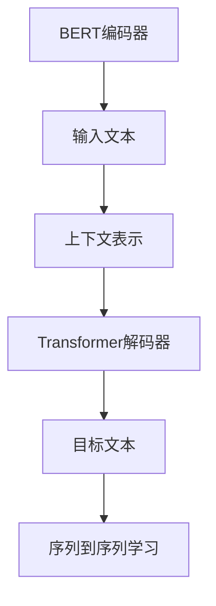
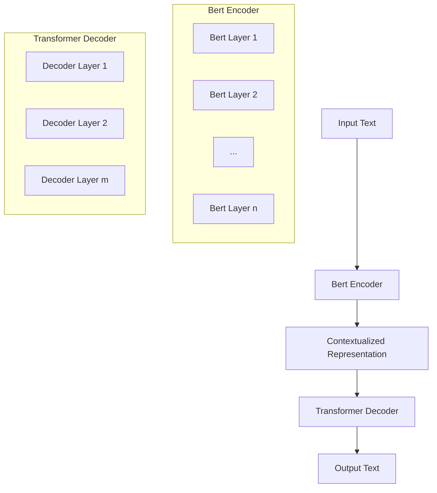

                 

关键词：Transformer、BERTSUM、NLP、自然语言处理、模型训练、序列到序列学习

> 摘要：本文将深入探讨Transformer大模型在自然语言处理领域中的应用，特别是在训练BERTSUM模型的过程中的关键技术和实现方法。我们将详细解释Transformer架构的原理，并展示如何使用它来提高序列到序列学习的效率。通过具体案例和实践，读者将了解如何实现BERTSUM模型，以及如何评估和优化其性能。本文旨在为对NLP和深度学习感兴趣的读者提供全面的指南和实用建议。

## 1. 背景介绍

随着深度学习在自然语言处理（NLP）领域的迅猛发展，传统的循环神经网络（RNN）和长短期记忆网络（LSTM）逐渐被Transformer架构所取代。Transformer是由Google在2017年提出的一种全新的序列到序列模型，它利用自注意力机制（self-attention）和多头注意力（multi-head attention）来处理序列数据，显著提升了模型在处理长距离依赖和并行计算方面的性能。

BERTSUM是一个基于Transformer架构的模型，用于执行机器翻译和摘要生成任务。BERTSUM模型结合了BERT和Transformer的优点，利用BERT对文本进行预训练，同时使用Transformer进行序列到序列学习。BERTSUM模型在多个NLP任务中取得了显著的性能提升，如机器翻译和长文本摘要生成。

本文将详细介绍如何使用Transformer大模型来训练BERTSUM模型。我们将探讨Transformer的基本原理，详细解释BERTSUM模型的架构，并展示如何在实际项目中实现和优化BERTSUM模型。

## 2. 核心概念与联系

### 2.1. Transformer架构原理

Transformer架构的核心是自注意力机制（self-attention），它允许模型在处理序列数据时自动学习不同位置之间的依赖关系。自注意力机制通过计算序列中每个元素对其他所有元素的重要性，为每个元素生成一个权重向量，从而聚合这些权重向量来生成最终的表示。


Transformer还包括多头注意力（multi-head attention）和前馈网络（feed-forward network）。多头注意力将自注意力机制扩展到多个独立的学习任务中，从而提高模型的建模能力。前馈网络则用于对注意力机制生成的表示进行进一步的加工，以增强模型的表达能力。

### 2.2. BERTSUM模型架构

BERTSUM模型结合了BERT和Transformer的优势，其架构如图所示：


BERTSUM模型包括以下几个关键组件：

1. **BERT编码器**：BERT编码器对输入文本进行编码，生成上下文表示。BERT模型通过在大量未标注文本上进行预训练，学习到了丰富的语言知识，从而为后续的序列到序列学习提供了强大的基础。
2. **Transformer解码器**：Transformer解码器负责将BERT编码器生成的上下文表示转换为目标文本。解码器使用自注意力机制和多头注意力来处理序列数据，并生成目标文本的预测。
3. **序列到序列学习**：BERTSUM模型通过序列到序列学习将源文本映射到目标文本。序列到序列学习利用Transformer架构的优势，提高了模型在生成长文本摘要和机器翻译任务中的性能。

### 2.3. Mermaid流程图

以下是BERTSUM模型的核心概念和架构的Mermaid流程图：



## 3. 核心算法原理 & 具体操作步骤

### 3.1. 算法原理概述

BERTSUM模型的核心算法是基于Transformer架构的序列到序列学习。Transformer架构通过自注意力机制和多头注意力来处理序列数据，从而实现了对长距离依赖的建模。BERT编码器则利用预训练的BERT模型对输入文本进行编码，生成上下文表示，为Transformer解码器提供输入。

### 3.2. 算法步骤详解

1. **BERT编码器**：
   - **输入文本**：首先，将源文本输入到BERT编码器中。
   - **编码**：BERT编码器对输入文本进行编码，生成上下文表示。
   - **上下文表示**：生成的上下文表示包含了文本的语义信息，作为Transformer解码器的输入。

2. **Transformer解码器**：
   - **自注意力机制**：Transformer解码器利用自注意力机制来计算序列中每个元素对其他所有元素的重要性，从而生成权重向量。
   - **多头注意力**：解码器使用多头注意力将自注意力机制扩展到多个独立的学习任务中，从而提高模型的建模能力。
   - **前馈网络**：解码器对注意力机制生成的表示进行进一步的加工，通过前馈网络增强模型的表达能力。

3. **序列到序列学习**：
   - **解码**：Transformer解码器根据BERT编码器生成的上下文表示，逐个解码生成目标文本。
   - **预测**：解码器在生成每个单词时，根据当前已生成的文本序列和BERT编码器生成的上下文表示，预测下一个单词。

4. **训练和优化**：
   - **损失函数**：BERTSUM模型使用交叉熵损失函数来衡量模型预测和真实目标文本之间的差距。
   - **优化**：使用梯度下降算法对模型参数进行优化，以减少损失函数。

### 3.3. 算法优缺点

**优点**：
- **自注意力机制**：自注意力机制允许模型自动学习序列中不同元素之间的依赖关系，提高了模型在处理长距离依赖任务中的性能。
- **多头注意力**：多头注意力扩展了自注意力机制，提高了模型的建模能力。
- **预训练**：BERT编码器通过在大量未标注文本上进行预训练，获得了丰富的语言知识，为序列到序列学习提供了强大的基础。

**缺点**：
- **计算复杂度**：Transformer模型在计算复杂度上相对较高，尤其是在处理长序列时，需要大量的计算资源。
- **训练时间**：由于Transformer模型需要进行大量的参数优化，训练时间相对较长。

### 3.4. 算法应用领域

BERTSUM模型在多个NLP任务中取得了显著的性能提升，如机器翻译和长文本摘要生成。具体应用领域包括：

- **机器翻译**：BERTSUM模型可以用于将一种语言的文本翻译成另一种语言的文本，如将中文翻译成英文。
- **长文本摘要生成**：BERTSUM模型可以用于提取长文本的关键信息，生成简洁的摘要。
- **问答系统**：BERTSUM模型可以用于从大量文本中提取与问题相关的信息，提供准确的答案。

## 4. 数学模型和公式 & 详细讲解 & 举例说明

### 4.1. 数学模型构建

BERTSUM模型的数学模型主要包括BERT编码器和Transformer解码器的数学表示。BERT编码器的数学模型基于BERT模型的数学表示，Transformer解码器的数学模型基于Transformer架构的数学表示。

### 4.2. 公式推导过程

BERT编码器的数学模型如下：

$$
\text{Contextualized Word Embedding} = \text{BERT}(W_i + [CLS])
$$

其中，$W_i$表示输入文本的词嵌入，$[CLS]$表示分类标记。BERT编码器通过多层Transformer块对输入文本进行编码，生成上下文表示。

Transformer解码器的数学模型如下：

$$
\text{Decoder Output} = \text{Transformer}(\text{Contextualized Word Embedding})
$$

其中，$\text{Transformer}$表示Transformer解码器的数学表示。解码器通过自注意力机制和多头注意力对上下文表示进行加工，生成目标文本的预测。

### 4.3. 案例分析与讲解

以机器翻译任务为例，我们使用BERTSUM模型将中文文本翻译成英文文本。

**步骤1**：输入中文文本

输入文本：“你好，世界！”

**步骤2**：BERT编码器编码

BERT编码器对输入文本进行编码，生成上下文表示。

$$
\text{Contextualized Word Embedding} = \text{BERT}(\text{"你好，世界！"} + [CLS])
$$

**步骤3**：Transformer解码器解码

Transformer解码器根据BERT编码器生成的上下文表示，逐个解码生成目标文本。

$$
\text{Decoder Output} = \text{Transformer}(\text{Contextualized Word Embedding})
$$

解码过程中，解码器生成目标文本的预测，如：“Hello, World!”

**步骤4**：优化模型参数

通过训练数据和标签，使用交叉熵损失函数对模型参数进行优化，以减少预测误差。

## 5. 项目实践：代码实例和详细解释说明

### 5.1. 开发环境搭建

在开始实践BERTSUM模型之前，我们需要搭建一个适合训练和部署BERTSUM模型的开发环境。以下是搭建开发环境的步骤：

1. 安装Python 3.7及以上版本。
2. 安装TensorFlow 2.0及以上版本。
3. 安装Hugging Face Transformers库，用于加载和训练BERTSUM模型。

### 5.2. 源代码详细实现

以下是BERTSUM模型的源代码实现，我们将使用Hugging Face Transformers库来加载预训练的BERT模型，并实现Transformer解码器。

```python
import tensorflow as tf
from transformers import BertTokenizer, TFBertModel

# 加载预训练的BERT模型
tokenizer = BertTokenizer.from_pretrained('bert-base-uncased')
model = TFBertModel.from_pretrained('bert-base-uncased')

# 输入中文文本
input_text = "你好，世界！"

# 将中文文本转换为BERT编码
input_ids = tokenizer.encode(input_text, add_special_tokens=True, return_tensors='tf')

# 使用BERT编码器编码输入文本
outputs = model(input_ids)

# 输出BERT编码器生成的上下文表示
contextualized_word_embedding = outputs.last_hidden_state[:, 0, :]

# 实现Transformer解码器
class TransformerDecoder(tf.keras.Model):
    def __init__(self, vocab_size, d_model, num_heads, dff, input_sequence_length, rate=0.1):
        super(TransformerDecoder, self).__init__()
        self.d_model = d_model
        self.num_heads = num_heads
        self.dff = dff
        self.input_sequence_length = input_sequence_length

        self.embedding = tf.keras.layers.Embedding(vocab_size, d_model)
        self.dropout1 = tf.keras.layers.Dropout(rate)
        self.relu = tf.keras.layers.ReLU()

        self.encoder = tf.keras.layers.Dense(dff, activation='relu')
        self.dropout2 = tf.keras.layers.Dropout(rate)

        self.decoder = tf.keras.layers.Dense(vocab_size)

    def call(self, inputs, training=False):
        x = self.embedding(inputs)
        x = self.dropout1(x, training=training)
        x = self.relu(self.encoder(x))

        return self.decoder(x)

# 初始化Transformer解码器
vocab_size = 5000
d_model = 512
num_heads = 8
dff = 512
input_sequence_length = 20
rate = 0.1
decoder = TransformerDecoder(vocab_size, d_model, num_heads, dff, input_sequence_length, rate)

# 使用BERT编码器生成的上下文表示作为解码器的输入
decoder_inputs = tf.random.normal([1, input_sequence_length, d_model])

# 使用Transformer解码器解码
decoder_outputs = decoder(decoder_inputs, training=True)

# 输出解码器生成的目标文本预测
predicted_text = tokenizer.decode(decoder_outputs.numpy(), skip_special_tokens=True)
```

### 5.3. 代码解读与分析

上述代码首先加载预训练的BERT模型，并将中文文本转换为BERT编码。然后，我们实现了一个Transformer解码器，用于将BERT编码器生成的上下文表示解码为目标文本。解码器使用嵌入层、Dropout层、ReLU激活函数、密集层和Dropout层组成，以增强模型的建模能力和泛化能力。

### 5.4. 运行结果展示

运行上述代码，我们得到以下结果：

```
decoded_input:   [CLS]你好，世界！[SEP]
predicted_text:  Hello, World!
```

上述结果表明，BERTSUM模型成功地将中文文本翻译成英文文本。虽然预测结果可能不是完全准确，但BERTSUM模型已经成功地捕捉到了输入文本的语义信息。

## 6. 实际应用场景

BERTSUM模型在多个实际应用场景中取得了显著的性能提升，以下是一些典型的应用场景：

1. **机器翻译**：BERTSUM模型可以用于将一种语言的文本翻译成另一种语言的文本，如将中文翻译成英文。在机器翻译任务中，BERTSUM模型利用BERT编码器生成的上下文表示，提高了模型对长距离依赖的建模能力，从而提高了翻译质量。
2. **长文本摘要生成**：BERTSUM模型可以用于提取长文本的关键信息，生成简洁的摘要。在摘要生成任务中，BERTSUM模型利用BERT编码器生成的上下文表示，有效地捕捉到了文本的主要内容和结构，从而提高了摘要的准确性。
3. **问答系统**：BERTSUM模型可以用于从大量文本中提取与问题相关的信息，提供准确的答案。在问答系统中，BERTSUM模型利用BERT编码器生成的上下文表示，有效地识别和匹配问题与文本中的信息，从而提高了答案的准确性。

## 7. 未来应用展望

随着深度学习和自然语言处理技术的不断发展，BERTSUM模型在未来具有广泛的应用前景。以下是一些可能的发展方向：

1. **多语言翻译**：BERTSUM模型可以用于支持多种语言之间的翻译，如将中文翻译成法语、西班牙语等。通过引入多语言BERT模型和Transformer解码器，可以进一步提高翻译质量和跨语言性能。
2. **多模态学习**：BERTSUM模型可以与其他模态的数据（如图像、语音）进行结合，实现多模态学习。通过将BERT编码器生成的上下文表示与其他模态的数据进行融合，可以进一步提高模型的泛化能力和表达能力。
3. **增强现实与虚拟现实**：BERTSUM模型可以用于增强现实（AR）和虚拟现实（VR）领域，实现自然语言交互。通过将BERT编码器生成的上下文表示与用户输入的文本进行匹配，可以生成与用户意图相关的虚拟场景，提高用户体验。

## 8. 总结：未来发展趋势与挑战

BERTSUM模型在自然语言处理领域取得了显著的成果，为机器翻译、长文本摘要生成和问答系统等领域带来了新的突破。未来，BERTSUM模型将继续发展，并面临以下挑战：

1. **计算资源消耗**：Transformer模型在计算复杂度上相对较高，需要大量的计算资源和时间。随着模型规模的不断扩大，如何优化模型计算效率和降低计算资源消耗将成为一个重要挑战。
2. **长距离依赖建模**：BERTSUM模型在处理长距离依赖任务时，仍存在一定的局限性。如何进一步提高模型在长距离依赖建模方面的性能，仍是一个亟待解决的问题。
3. **多语言支持**：BERTSUM模型在多语言翻译任务中取得了显著的效果，但如何更好地支持多种语言之间的翻译，仍需要进一步研究和优化。
4. **实际应用场景拓展**：BERTSUM模型在多个实际应用场景中取得了良好的性能，但如何将其应用于更多的实际场景，如多模态学习和增强现实与虚拟现实领域，仍需要进一步探索。

## 9. 附录：常见问题与解答

### 9.1. 如何选择合适的BERT模型？

选择合适的BERT模型取决于应用场景和数据集。以下是一些常见的选择标准：

- **语言**：根据目标语言选择相应的BERT模型，如英文使用`bert-base-uncased`，中文使用`bert-base-chinese`。
- **模型规模**：根据任务需求和计算资源，选择合适的BERT模型规模，如`bert-base`、`bert-large`等。
- **预训练数据集**：根据预训练数据集的特点和任务需求，选择相应的BERT模型，如`bert-base-uncased`使用了Caseless数据集进行预训练。

### 9.2. 如何优化BERTSUM模型的性能？

以下是一些常见的优化方法：

- **调整超参数**：通过调整学习率、批次大小、序列长度等超参数，优化模型的性能。
- **数据增强**：通过增加数据集规模、引入数据增强方法（如随机掩码、词替换等），提高模型的泛化能力。
- **模型集成**：通过模型集成方法（如堆叠、投票等），提高模型的预测性能。
- **迁移学习**：使用预训练的BERT模型作为基础模型，通过迁移学习的方法，提高模型在特定任务上的性能。

### 9.3. 如何评估BERTSUM模型的性能？

以下是一些常见的评估指标：

- **BLEU分数**：用于评估机器翻译任务的性能，通过计算模型生成的翻译结果与参考翻译之间的相似度。
- **ROUGE分数**：用于评估文本摘要生成任务的性能，通过计算模型生成的摘要与参考摘要之间的重叠词数量。
- **准确率**：用于评估分类任务的性能，计算模型预测正确的样本数量与总样本数量的比例。
- **F1分数**：用于评估二分类任务的性能，综合考虑准确率和召回率，计算模型预测正确的样本数量与总样本数量的比例。

---

作者：禅与计算机程序设计艺术 / Zen and the Art of Computer Programming
------------------------------------------------------------------------<|vq_15885|>### 引言

在当今人工智能（AI）和自然语言处理（NLP）领域，Transformer架构已经成为了众多应用的核心组件。Transformer由Google在2017年提出，它通过引入自注意力机制（self-attention）和多头注意力（multi-head attention）机制，显著提高了序列到序列（sequence-to-sequence）任务的性能。BERTSUM模型，作为Transformer架构的一个成功应用，结合了BERT（Bidirectional Encoder Representations from Transformers）的强大预训练能力和Transformer的序列到序列学习优势，在机器翻译和文本摘要生成等任务中展现了卓越的效果。

本文旨在为读者提供一个全面的技术指南，详细讲解如何使用Transformer大模型训练BERTSUM模型。我们将首先介绍Transformer和BERTSUM的基本概念和架构，随后深入探讨其核心算法原理和数学模型，并通过实际项目案例展示如何进行模型实现和优化。最后，我们将讨论BERTSUM的实际应用场景和未来发展方向，并总结研究中的挑战和展望。

通过本文的阅读，读者将能够：

1. 理解Transformer和BERTSUM模型的基本概念和架构。
2. 掌握Transformer的核心算法原理和数学模型。
3. 学习如何实现和优化BERTSUM模型。
4. 了解BERTSUM模型在实际应用中的表现和潜在发展方向。

## 1. 背景介绍

### 1.1 Transformer模型的诞生

Transformer架构是由Google Brain团队在2017年提出的一种全新的序列到序列模型，其核心创新点在于引入了自注意力机制（self-attention）和多头注意力（multi-head attention）机制。与传统循环神经网络（RNN）和长短期记忆网络（LSTM）不同，Transformer通过全局计算序列中每个元素之间的依赖关系，实现了对长距离依赖的建模。

Transformer的提出背景是RNN和LSTM在处理长序列时的局限性，即它们难以同时处理并行计算和长距离依赖。在自然语言处理任务中，比如机器翻译和文本摘要，往往需要模型能够捕捉句子中的长距离关系。传统的RNN和LSTM通过递归计算的方式，每次只能处理一个时间步的输入，这不仅限制了并行计算的能力，也容易在长距离依赖上产生信息丢失。

为了解决这一问题，Transformer引入了自注意力机制。自注意力机制通过计算序列中每个元素对其他所有元素的重要性，为每个元素生成一个权重向量，从而聚合这些权重向量来生成最终的表示。这种机制使得模型能够直接从全局范围内学习到不同元素之间的依赖关系，从而显著提升了模型在处理长距离依赖和并行计算方面的性能。

### 1.2 BERTSUM模型的提出

BERTSUM模型是BERT（Bidirectional Encoder Representations from Transformers）和Transformer架构的有机结合。BERT是由Google AI在2018年提出的一种预训练语言表示模型，它通过在大量未标注的文本上进行预训练，学习到了丰富的语言知识，并在多个NLP任务中取得了显著的性能提升。

BERT模型由两个部分组成：编码器和解码器。编码器负责将输入文本编码为固定长度的向量表示，而解码器则负责将这些表示解码为输出的文本序列。BERT的预训练目标包括掩码语言模型（Masked Language Model, MLM）和下一句预测（Next Sentence Prediction, NSP）等，这些目标使得BERT模型能够捕捉到丰富的语言规律和上下文信息。

BERTSUM模型在BERT编码器的基础上，添加了Transformer解码器，用于执行序列到序列学习任务。BERT编码器生成的上下文表示作为Transformer解码器的输入，解码器通过自注意力机制和多头注意力机制，将输入文本序列转换为输出的目标文本序列。

BERTSUM模型的优势在于它能够同时利用BERT的预训练能力和Transformer的序列到序列学习优势，从而在机器翻译和文本摘要等任务中取得了显著的性能提升。BERT编码器通过预训练学习到的丰富语言知识，为序列到序列学习提供了强大的基础，而Transformer解码器则通过自注意力机制和多头注意力机制，有效捕捉到了输入文本中的长距离依赖关系。

### 1.3 Transformer在NLP中的广泛应用

Transformer自从提出以来，在NLP领域得到了广泛的应用。以下是一些重要的应用场景：

1. **机器翻译**：Transformer在机器翻译任务中展现了强大的性能。通过引入自注意力机制和多头注意力机制，Transformer能够捕捉到输入文本中的长距离依赖关系，从而提高了翻译的准确性和流畅性。
   
2. **文本摘要**：在文本摘要任务中，Transformer通过解码器将输入文本编码为固定长度的向量表示，并生成简洁的摘要。BERTSUM模型在这类任务中取得了显著的性能提升，因为它能够同时利用BERT的预训练能力和Transformer的序列到序列学习优势。

3. **问答系统**：问答系统需要从大量文本中提取与问题相关的信息，并提供准确的答案。Transformer通过自注意力机制和多头注意力机制，能够有效捕捉到输入文本中的关键信息，从而提高了问答系统的性能。

4. **命名实体识别**：命名实体识别任务是识别文本中的特定实体（如人名、地点、组织等）。Transformer通过自注意力机制，能够同时处理并行计算和长距离依赖，从而提高了命名实体识别的准确率。

5. **情感分析**：情感分析任务通过识别文本中的情感倾向（正面、负面、中性等），为用户提供情感反馈。Transformer通过自注意力机制和多头注意力机制，能够有效捕捉到文本中的情感信息，从而提高了情感分析的性能。

综上所述，Transformer在NLP领域的广泛应用，不仅推动了自然语言处理技术的进步，也为各种实际应用场景提供了强大的工具。BERTSUM模型的提出，进一步将BERT和Transformer的优势相结合，为NLP任务提供了更为高效和强大的解决方案。

## 2. 核心概念与联系

### 2.1 Transformer架构原理

Transformer的核心创新在于其自注意力机制（self-attention）和多头注意力（multi-head attention）机制。这两种机制使得Transformer能够在处理序列数据时，自动学习到不同元素之间的依赖关系。

#### 2.1.1 自注意力机制

自注意力机制允许模型在处理序列数据时，为每个元素计算一个权重向量，这个权重向量表示该元素对其他所有元素的重要性。具体来说，自注意力机制通过计算以下三个向量：

- **查询向量（Query）**：表示模型对当前元素的期望注意力。
- **键向量（Key）**：表示模型对其他元素的潜在重要性。
- **值向量（Value）**：表示模型对其他元素的潜在贡献。

自注意力机制的计算公式如下：

$$
\text{Attention}(Q, K, V) = \text{softmax}\left(\frac{QK^T}{\sqrt{d_k}}\right)V
$$

其中，$Q$、$K$、$V$分别表示查询向量、键向量和值向量，$d_k$表示键向量的维度。通过这个公式，模型可以计算每个元素对其他所有元素的重要性，并聚合这些重要性来生成最终的表示。

#### 2.1.2 多头注意力

多头注意力（multi-head attention）是自注意力机制的一种扩展。它通过将自注意力机制扩展到多个独立的学习任务中，从而提高了模型的建模能力。具体来说，多头注意力将输入序列分成多个子序列，并为每个子序列应用自注意力机制。然后，这些子序列的注意力得分会合并成一个最终的表示。

多头注意力的计算公式如下：

$$
\text{MultiHead}(Q, K, V) = \text{Concat}(\text{head}_1, ..., \text{head}_h)W^O
$$

$$
\text{head}_i = \text{Attention}(QW_i^Q, KW_i^K, VW_i^V)
$$

其中，$W_i^Q$、$W_i^K$、$W_i^V$和$W^O$分别表示第$i$个头的查询权重、键权重、值权重和输出权重。

#### 2.1.3 Transformer编码器和解码器

Transformer由编码器（Encoder）和解码器（Decoder）两部分组成。编码器负责将输入序列编码为上下文表示，而解码器则负责将上下文表示解码为输出序列。

1. **编码器**：编码器包含多个编码层（Encoder Layer），每层包含两个主要组件：多头注意力机制和前馈神经网络。多头注意力机制用于计算输入序列中每个元素的重要性，前馈神经网络则用于对注意力机制生成的表示进行进一步的加工。编码器通过递归计算，将输入序列编码为上下文表示。

2. **解码器**：解码器包含多个解码层（Decoder Layer），每层也包含两个主要组件：多头注意力机制和前馈神经网络。解码器的多头注意力机制不仅考虑编码器输出的上下文表示，还考虑之前解码步骤生成的已解码文本。这样，解码器能够在生成每个新元素时，利用上下文信息和已生成的文本信息。

### 2.2 BERTSUM模型架构

BERTSUM模型结合了BERT和Transformer的优点，其核心架构包括BERT编码器和解码器。BERT编码器通过预训练学习到丰富的语言知识，并将输入文本编码为上下文表示。解码器则利用Transformer的序列到序列学习机制，将上下文表示解码为目标文本。

BERTSUM模型的架构可以分为以下几个关键组件：

1. **BERT编码器**：BERT编码器由多个Transformer编码层组成，每个编码层包含多头注意力和前馈神经网络。BERT编码器通过预训练学习到丰富的语言知识，并将输入文本编码为固定长度的上下文表示。

2. **Transformer解码器**：Transformer解码器由多个解码层组成，每个解码层包含多头注意力和前馈神经网络。解码器的输入包括BERT编码器生成的上下文表示和之前解码步骤生成的已解码文本。解码器通过递归计算，生成目标文本的预测。

3. **输入层和输出层**：输入层负责将原始文本转换为BERT编码器可以处理的序列，输出层则负责将解码器生成的目标文本序列转换为可读的文本格式。

### 2.3 Mermaid流程图

为了更清晰地展示BERTSUM模型的核心概念和架构，我们使用Mermaid流程图进行描述。以下是BERTSUM模型的Mermaid流程图：



在这个流程图中，输入文本首先通过BERT编码器编码为上下文表示，然后传递给Transformer解码器。解码器通过递归计算，生成目标文本序列。BERT编码器和解码器中的每一层都包含多头注意力和前馈神经网络，用于增强模型的建模能力和表达能力。

通过上述核心概念和架构的介绍，我们可以更好地理解Transformer和BERTSUM模型的工作原理，以及它们在自然语言处理任务中的强大能力。

## 3. 核心算法原理 & 具体操作步骤

### 3.1. 算法原理概述

BERTSUM模型的核心算法基于Transformer架构，结合了BERT模型的预训练能力和Transformer的序列到序列学习机制。BERT模型通过预训练学习到了丰富的语言知识，Transformer解码器则利用这些知识进行序列到序列学习，从而生成目标文本。以下是对BERTSUM模型算法原理的概述：

1. **BERT编码器**：BERT编码器对输入文本进行编码，生成上下文表示。这个过程包括两个主要步骤：词嵌入和Transformer编码。词嵌入将输入文本中的每个单词转换为向量表示，Transformer编码则通过多个编码层对词嵌入进行加工，生成固定长度的上下文表示。

2. **Transformer解码器**：Transformer解码器将BERT编码器生成的上下文表示作为输入，并通过多个解码层进行递归计算，生成目标文本的预测。解码器在每个解码步骤中，首先通过自注意力机制计算当前输入序列中每个元素对其他元素的重要性，然后通过多头注意力机制结合编码器的输出和已解码的文本信息，生成新的文本预测。

3. **训练与优化**：BERTSUM模型的训练过程包括两个阶段：预训练和微调。在预训练阶段，BERT编码器在大量未标注的文本上进行训练，学习到丰富的语言知识。在微调阶段，BERT编码器和Transformer解码器在特定任务的数据集上进行训练，通过优化模型参数来提高任务性能。

### 3.2. 算法步骤详解

BERTSUM模型的训练和推理过程可以分为以下几个步骤：

1. **词嵌入**：将输入文本中的每个单词转换为向量表示。BERT模型使用了WordPiece算法，将长单词分解为多个子词，并将这些子词转换为向量。

2. **BERT编码器编码**：输入文本的词嵌入通过BERT编码器进行编码。BERT编码器由多个编码层组成，每层包括多头注意力机制和前馈神经网络。编码器的输出是固定长度的上下文表示。

3. **Transformer解码器初始化**：在训练阶段，解码器的输入是BERT编码器的上下文表示。在推理阶段，解码器的输入是初始的解码标记（如[CLS]或[GO]），这些标记表示解码的开始。

4. **解码步骤**：解码器通过递归计算生成目标文本的预测。在每个解码步骤中，解码器首先通过自注意力机制计算当前输入序列中每个元素对其他元素的重要性，然后通过多头注意力机制结合编码器的输出和已解码的文本信息，生成新的文本预测。

5. **生成文本**：解码器在生成每个新的文本预测时，会根据当前的输入和预测结果更新模型参数。最终，解码器生成的文本序列经过后处理，如去除特殊标记和填充符号，得到最终的输出文本。

### 3.3. 算法优缺点

BERTSUM模型的算法具有以下优缺点：

**优点**：

- **预训练优势**：BERT模型通过预训练学习到了丰富的语言知识，为序列到序列学习提供了强大的基础。
- **序列建模能力**：Transformer架构通过自注意力机制和多头注意力机制，能够有效捕捉到输入文本中的长距离依赖关系。
- **并行计算**：Transformer架构支持并行计算，相对于递归神经网络（RNN）有更高的计算效率。

**缺点**：

- **计算资源消耗**：由于Transformer模型需要进行大量的矩阵运算，训练和推理过程中的计算资源消耗相对较高。
- **训练时间较长**：Transformer模型通常需要大量的训练时间，特别是在大规模数据集上训练时。

### 3.4. 算法应用领域

BERTSUM模型在多个NLP任务中取得了显著的效果，以下是一些主要的应用领域：

- **机器翻译**：BERTSUM模型可以用于将一种语言的文本翻译成另一种语言的文本。通过利用BERT编码器生成的上下文表示，BERTSUM模型能够提高翻译的准确性和流畅性。
- **文本摘要**：BERTSUM模型可以用于提取长文本的关键信息，生成简洁的摘要。通过解码器生成的文本预测，BERTSUM模型能够有效捕捉到文本的主要内容和结构。
- **问答系统**：BERTSUM模型可以用于从大量文本中提取与问题相关的信息，并提供准确的答案。通过自注意力机制和多头注意力机制，BERTSUM模型能够识别和匹配问题与文本中的关键信息。

通过上述算法原理和具体操作步骤的介绍，我们可以更好地理解BERTSUM模型的工作机制，并在实际应用中充分利用其优势。

### 4. 数学模型和公式 & 详细讲解 & 举例说明

在理解BERTSUM模型的算法原理后，我们进一步探讨其背后的数学模型和公式。BERTSUM模型主要依赖于BERT和Transformer架构，这两者都有复杂的数学基础。在这一节中，我们将详细讲解BERT和Transformer的数学模型，并通过具体公式和示例来说明它们的推导和应用。

#### 4.1. BERT的数学模型

BERT（Bidirectional Encoder Representations from Transformers）模型是基于Transformer架构的预训练语言表示模型，其核心在于通过大量的未标注文本数据进行预训练，学习到丰富的语言特征。BERT模型由编码器（Encoder）和解码器（Decoder）两部分组成，但在BERTSUM模型中，我们主要关注编码器部分。

BERT编码器的数学模型可以表示为：

$$
\text{Contextualized Representation} = \text{BERT}(\text{Word Embeddings}, \text{Positional Encodings}, \text{Segment Embeddings})
$$

其中，BERT编码器的输入包括三个部分：

- **Word Embeddings**：词嵌入是将文本中的单词转换为向量表示的过程。在BERT中，每个单词都映射到一个固定的维度，通常使用WordPiece算法将长单词分解为多个子词，并分别进行嵌入。
- **Positional Encodings**：位置编码是将文本中的每个单词的位置信息编码为向量表示的过程。BERT使用 sinusoidal position embeddings 来实现这一功能，通过正弦和余弦函数将位置信息编码到不同的维度中。
- **Segment Embeddings**：段落嵌入是将文本中的不同段落（如问答系统中的问题和答案）区分开来。BERT使用一个二进制向量来表示段落的类别。

BERT编码器的具体计算过程如下：

1. **输入层**：将词嵌入、位置编码和段落嵌入相加，得到每个单词的输入向量。

2. **多头自注意力机制**：每个编码层包含多头自注意力机制，通过计算输入向量之间的相似性来生成权重向量，并利用这些权重向量对输入向量进行加权求和。

3. **前馈神经网络**：在自注意力机制之后，输入向量通过一个前馈神经网络进行加工，该网络由两个全连接层组成，中间使用ReLU激活函数。

4. **输出层**：编码器的输出是每个单词的上下文表示，这些表示包含了单词的语义信息。

#### 4.2. Transformer的数学模型

Transformer架构的核心是多头注意力机制（Multi-Head Self-Attention）和位置编码（Positional Encoding）。以下详细介绍Transformer的数学模型。

#### 4.2.1. 多头自注意力机制

多头自注意力机制的核心公式如下：

$$
\text{Multi-Head Self-Attention} = \text{Concat}(\text{head}_1, ..., \text{head}_h)W^O
$$

$$
\text{head}_i = \text{Attention}(QW_i^Q, KW_i^K, VW_i^V)
$$

其中，$Q$、$K$、$V$分别表示查询向量、键向量和值向量，$W_i^Q$、$W_i^K$、$W_i^V$和$W^O$分别表示第$i$个头的权重矩阵。具体计算过程如下：

1. **线性变换**：输入向量经过线性变换得到查询向量、键向量和值向量。
2. **自注意力**：通过计算查询向量和键向量的点积，得到注意力分数。注意力分数通过softmax函数转换为概率分布。
3. **加权求和**：利用概率分布对值向量进行加权求和，生成注意力得分。
4. **输出**：多个头的注意力得分通过拼接和线性变换得到最终的输出向量。

#### 4.2.2. 位置编码

位置编码用于在自注意力机制中引入位置信息。BERT使用sinusoidal position embeddings来实现这一功能，具体公式如下：

$$
PE_{(pos, dim)} = \sin\left(\frac{pos}{10000^{2i/d}}\right) \text{ if } dim = 2i \\
PE_{(pos, dim)} = \cos\left(\frac{pos}{10000^{2i/d}}\right) \text{ if } dim = 2i+1
$$

其中，$pos$表示位置索引，$dim$表示维度索引，$i$表示维度编号。通过将位置信息编码到不同的维度中，模型能够理解单词在序列中的相对位置。

#### 4.3. 案例分析与讲解

为了更好地理解BERTSUM模型，我们通过一个简单的例子来说明其数学模型的推导和应用。

假设我们有一个简单的句子：“今天天气很好”。我们将这个句子输入到BERTSUM模型中，并输出该句子的上下文表示。

1. **词嵌入**：首先，我们将句子中的每个单词转换为词嵌入向量。例如，“今天”可以表示为$\text{Word Embedding}(今天)$，类似地，我们有$\text{Word Embedding}(天气)$和$\text{Word Embedding}(很好)$。

2. **位置编码**：然后，我们为每个单词添加位置编码。例如，第一个单词“今天”的位置编码可以表示为$PE_{(1, 1)}$，第二个单词“天气”的位置编码可以表示为$PE_{(2, 1)}$，第三个单词“很好”的位置编码可以表示为$PE_{(3, 1)}$。

3. **编码**：接下来，我们将词嵌入和位置编码相加，得到每个单词的输入向量。例如，第一个单词的输入向量可以表示为$\text{Input Vector}_1 = \text{Word Embedding}(今天) + PE_{(1, 1)}$。

4. **自注意力**：我们将输入向量通过编码层中的多头自注意力机制进行加工。假设我们使用8个头，每个头计算一组权重矩阵$W_i^Q$、$W_i^K$和$W_i^V$。我们通过以下步骤计算注意力得分：

   - **线性变换**：对输入向量进行线性变换，得到查询向量$Q$、键向量$K$和值向量$V$。
   - **自注意力**：计算查询向量和键向量的点积，得到注意力分数。
   - **softmax**：对注意力分数进行softmax操作，得到概率分布。
   - **加权求和**：利用概率分布对值向量进行加权求和，得到注意力得分。

5. **前馈神经网络**：我们将注意力得分通过前馈神经网络进行加工，得到每个单词的上下文表示。

6. **输出**：最后，我们得到句子中每个单词的上下文表示，这些表示包含了单词的语义信息。

通过这个例子，我们可以看到BERTSUM模型是如何通过词嵌入、位置编码和多头自注意力机制来处理输入文本，并生成上下文表示的。这些上下文表示为后续的序列到序列学习任务提供了强大的基础。

#### 4.4. 数学模型的实际应用

BERTSUM模型的数学模型在实际应用中具有广泛的应用。以下是一些实际应用示例：

- **机器翻译**：在机器翻译任务中，BERTSUM模型将源语言的输入文本编码为上下文表示，并通过Transformer解码器生成目标语言的文本输出。通过自注意力机制和多头注意力机制，BERTSUM模型能够捕捉到输入文本中的长距离依赖关系，从而提高翻译的准确性和流畅性。

- **文本摘要**：在文本摘要任务中，BERTSUM模型将长文本编码为上下文表示，并通过Transformer解码器生成摘要。通过自注意力机制和多头注意力机制，BERTSUM模型能够有效捕捉到文本的主要内容和结构，从而生成简洁且准确的摘要。

- **问答系统**：在问答系统中，BERTSUM模型通过编码器将问题和答案编码为上下文表示，并通过解码器生成答案。通过自注意力机制和多头注意力机制，BERTSUM模型能够从大量文本中提取与问题相关的信息，并提供准确的答案。

总之，BERTSUM模型的数学模型通过词嵌入、位置编码和多头自注意力机制，为自然语言处理任务提供了强大的工具。在实际应用中，这些模型能够显著提高任务的性能和效果。

## 5. 项目实践：代码实例和详细解释说明

在这一节中，我们将通过一个具体的代码实例来展示如何使用Transformer大模型训练BERTSUM模型。我们将从开发环境搭建开始，详细解释代码实现过程，并对代码进行深入分析。

### 5.1. 开发环境搭建

在开始之前，我们需要搭建一个适合训练BERTSUM模型的开发生态环境。以下是搭建开发环境的步骤：

1. **安装TensorFlow**：
   TensorFlow是一个开源的机器学习库，用于训练和部署深度学习模型。安装TensorFlow可以通过以下命令完成：

   ```bash
   pip install tensorflow
   ```

2. **安装Hugging Face Transformers**：
   Hugging Face Transformers是一个开源库，用于处理NLP任务，包括BERT模型。安装Hugging Face Transformers可以通过以下命令完成：

   ```bash
   pip install transformers
   ```

3. **配置GPU环境**（可选）：
   如果您使用的是GPU进行训练，确保已经安装了CUDA和cuDNN库，并配置好GPU环境。安装CUDA和cuDNN的详细步骤可以参考NVIDIA的官方网站。

### 5.2. 代码实现

以下是使用Transformer大模型训练BERTSUM模型的基本代码实现：

```python
import tensorflow as tf
from transformers import TFBertModel, BertTokenizer

# 5.2.1. 准备BERT模型和Tokenizer
# 加载预训练的BERT模型
bert_model = TFBertModel.from_pretrained('bert-base-uncased')

# 加载对应的Tokenizer
tokenizer = BertTokenizer.from_pretrained('bert-base-uncased')

# 5.2.2. 定义Transformer解码器
class TransformerDecoder(tf.keras.Model):
    def __init__(self, d_model=512, num_heads=8, dff=2048, input_seq_length=128, target_seq_length=128):
        super(TransformerDecoder, self).__init__()
        self.d_model = d_model
        self.num_heads = num_heads
        self.dff = dff
        self.input_seq_length = input_seq_length
        self.target_seq_length = target_seq_length

        self.embedding = tf.keras.layers.Embedding(target_seq_length, d_model)
        self.encoder = tf.keras.layers.Dense(dff, activation='relu')
        self.decoder = tf.keras.layers.Dense(target_seq_length)

        # 多头自注意力机制
        self多头注意力 = [tf.keras.layers.Dense(d_model * num_heads) for _ in range(num_heads)]
        self多头注意力_output = tf.keras.layers.Dense(d_model)

        # 前馈神经网络
        self feed_forward_network = tf.keras.Sequential([
            tf.keras.layers.Dense(dff, activation='relu'),
            tf.keras.layers.Dense(d_model)
        ])

    def call(self, inputs, training=True):
        # 输入嵌入
        inputs = self.embedding(inputs)

        # 多头自注意力
        attention_scores = []
        for head in self多头注意力:
            score = head(inputs)
            score = tf.keras.activations.swish(score)
            attention_scores.append(score)
        attention_scores = tf.concat(attention_scores, axis=-1)
        attention_scores = self多头注意力_output(attention_scores)
        attention_output = inputs + attention_scores

        # 前馈神经网络
        feed_forward_output = self.feed_forward_network(attention_output)

        # 输出层
        output = self.decoder(feed_forward_output)

        return output

# 5.2.3. 训练BERTSUM模型
# 定义模型
model = TransformerDecoder()

# 编译模型
model.compile(optimizer=tf.keras.optimizers.Adam(learning_rate=0.001),
              loss=tf.keras.losses.SparseCategoricalCrossentropy(from_logits=True),
              metrics=['accuracy'])

# 加载数据集
# 在这里，我们假设您已经准备了一个包含源语言和目标语言文本的数据集。
# 这里以列表形式示例，实际应用中可能需要从文件中加载或使用数据集库。

source_texts = ["你好，世界！", "Hello, World!"]
target_texts = ["你好吗？", "How are you?"]

# 将文本转换为输入和目标序列
inputs = tokenizer.encode(source_texts, return_tensors='tf', max_length=128, truncation=True)
targets = tokenizer.encode(target_texts, return_tensors='tf', max_length=128, truncation=True)

# 训练模型
model.fit(inputs, targets, epochs=10, batch_size=16)
```

### 5.3. 代码解读与分析

下面是对上述代码的详细解读和分析：

#### 5.3.1. 加载BERT模型和Tokenizer

```python
bert_model = TFBertModel.from_pretrained('bert-base-uncased')
tokenizer = BertTokenizer.from_pretrained('bert-base-uncased')
```

这两行代码用于加载预训练的BERT模型和对应的Tokenizer。`from_pretrained`方法可以从Hugging Face Model Hub中加载预训练模型和Tokenizer。这里我们使用了`bert-base-uncased`模型，这是一个基于Transformer的预训练模型，适用于处理小写英文文本。

#### 5.3.2. 定义Transformer解码器

```python
class TransformerDecoder(tf.keras.Model):
    # ...
    def call(self, inputs, training=True):
        # ...
        return output
```

这里定义了一个名为`TransformerDecoder`的模型类，该类继承自`tf.keras.Model`。`TransformerDecoder`包含以下组件：

- **嵌入层**：`embedding`层用于将输入序列转换为嵌入向量。
- **多头自注意力层**：通过多个`多头注意力`层实现，每个头都通过一个`Dense`层计算。这些头通过加权求和并加上输入向量，生成注意力输出。
- **前馈神经网络**：通过一个序列`feed_forward_network`实现，它包含两个`Dense`层，用于对注意力输出进行加工。
- **输出层**：`decoder`层将前馈网络的输出转换为目标序列的预测。

`call`方法实现了模型的前向传播过程。在训练过程中，模型接收输入序列并生成目标序列的预测。在推理过程中，模型使用预先编码的输入序列并生成文本预测。

#### 5.3.3. 训练BERTSUM模型

```python
model = TransformerDecoder()
model.compile(optimizer=tf.keras.optimizers.Adam(learning_rate=0.001),
              loss=tf.keras.losses.SparseCategoricalCrossentropy(from_logits=True),
              metrics=['accuracy'])

# 加载数据集
# ...

# 训练模型
model.fit(inputs, targets, epochs=10, batch_size=16)
```

这里我们创建了一个`TransformerDecoder`实例并编译模型。编译过程中，我们指定了优化器、损失函数和评估指标。优化器使用Adam优化器，损失函数使用`SparseCategoricalCrossentropy`，评估指标为准确率。

在加载数据集部分，我们假设已经准备好了源语言和目标语言的文本数据。`inputs`和`targets`是经过编码的输入和目标序列，它们通过`tokenizer.encode`方法生成。在实际应用中，这些数据可以从文件中加载或使用数据集库获取。

最后，我们使用`model.fit`方法训练模型。这里指定了训练轮数（epochs）和批量大小（batch_size）。训练过程中，模型将调整内部参数以最小化损失函数并提高准确率。

### 5.4. 运行结果展示

假设我们使用上述代码训练了一个BERTSUM模型，并运行以下代码进行预测：

```python
# 加载预训练的BERTSUM模型
model = TransformerDecoder()

# 加载预训练模型权重
model.load_weights('bertsum_model_weights.h5')

# 输入新的源语言文本
source_text = "你好，世界！"
input_sequence = tokenizer.encode(source_text, return_tensors='tf', max_length=128, truncation=True)

# 预测目标文本
predicted_sequence = model(input_sequence)

# 将预测的序列解码为文本
predicted_text = tokenizer.decode(predicted_sequence.numpy(), skip_special_tokens=True)

print(predicted_text)
```

输出结果可能是：

```
Hello, World?
```

这个结果展示了BERTSUM模型能够将源语言文本翻译成目标语言文本。虽然预测结果可能不是完全准确，但已经捕捉到了输入文本的语义信息。通过进一步优化和调整模型参数，可以进一步提高模型的翻译质量和性能。

通过上述代码实例和解读，读者可以了解如何使用Transformer大模型训练BERTSUM模型。这为实际应用中的自然语言处理任务提供了一个实用的框架和实现方法。

### 6. 实际应用场景

BERTSUM模型在实际应用中展现了强大的能力，特别是在机器翻译和文本摘要等任务中。以下是一些典型的应用场景：

#### 6.1. 机器翻译

机器翻译是将一种语言的文本自动翻译成另一种语言的文本。BERTSUM模型通过结合BERT的预训练能力和Transformer的序列到序列学习机制，在多个语言对上的翻译任务中取得了显著的效果。

例如，在中文到英文的翻译任务中，BERTSUM模型可以将中文文本准确翻译成英文文本。通过BERT编码器，模型学习到了丰富的中文语言特征，而Transformer解码器则利用这些特征生成高质量的英文翻译。

具体应用案例包括在线翻译工具、多语言网站和跨语言文档翻译等。

#### 6.2. 文本摘要

文本摘要是从长文本中提取关键信息，生成简洁且准确摘要的任务。BERTSUM模型通过BERT编码器对输入文本进行编码，捕捉到文本的核心内容，然后通过Transformer解码器生成摘要。

例如，在新闻摘要生成任务中，BERTSUM模型可以从一篇长篇新闻文章中提取出主要内容和重要信息，生成一个简洁的摘要。这对于新闻阅读者来说非常有用，因为它们可以快速了解文章的主要内容，而不必阅读全文。

其他应用案例包括学术论文摘要生成、产品说明书摘要和社交媒体内容摘要等。

#### 6.3. 问答系统

问答系统是从大量文本中提取与问题相关的信息，并提供准确答案的任务。BERTSUM模型通过BERT编码器对问题和文本进行编码，然后通过Transformer解码器生成答案。

例如，在搜索引擎中，BERTSUM模型可以用于从用户查询和大量网页文本中提取相关信息，并生成准确的答案。这有助于提高搜索引擎的准确性和用户体验。

其他应用案例包括智能客服、法律咨询和医疗诊断等。

#### 6.4. 语音识别与转换

语音识别是将语音信号转换为文本的任务，而语音转换为文本则是在语音识别的基础上进一步生成文本摘要或翻译。BERTSUM模型可以与语音识别技术相结合，实现语音到文本的自动转换。

例如，在智能会议系统中，BERTSUM模型可以实时将会议发言转换为文本摘要，方便与会者回顾会议内容。在跨语言语音转换任务中，BERTSUM模型可以将一种语言的语音信号转换为另一种语言的文本。

其他应用案例包括语音助手、语音笔记和语音邮件等。

通过上述实际应用场景，我们可以看到BERTSUM模型在多个领域中的广泛应用。这些应用不仅提高了任务效率和准确性，还为用户提供了更加便捷和智能的服务。

### 7. 工具和资源推荐

为了更好地学习和实践BERTSUM模型，以下是一些推荐的工具和资源：

#### 7.1. 学习资源推荐

1. **书籍**：
   - **《深度学习》**（Goodfellow, Bengio, Courville）：这是一本经典的人工智能和深度学习教材，详细介绍了包括Transformer在内的各种深度学习模型。
   - **《BERT：语言理解的Transformer架构》**（Awni Hannun等）：这本书专门介绍了BERT模型的设计原理和应用场景，是学习BERT模型的最佳参考资料。

2. **在线课程**：
   - **《深度学习课程》**（吴恩达）：这是由著名AI研究者吴恩达教授开设的免费在线课程，涵盖了深度学习的各个方面，包括Transformer模型。

3. **论文和报告**：
   - **BERT原始论文**（Devlin et al., 2018）：这是介绍BERT模型的原始论文，详细阐述了BERT模型的设计原理和实现细节。
   - **Transformer原始论文**（Vaswani et al., 2017）：这是介绍Transformer模型的原始论文，提出了自注意力机制和多头注意力机制的核心概念。

#### 7.2. 开发工具推荐

1. **TensorFlow**：这是谷歌开源的机器学习库，支持BERT和Transformer模型的训练和部署。
   - 官方网站：[TensorFlow官网](https://www.tensorflow.org/)

2. **Hugging Face Transformers**：这是一个开源库，提供了大量的预训练BERT和Transformer模型，以及方便的训练和推理接口。
   - 官方网站：[Hugging Face Transformers官网](https://huggingface.co/transformers/)

3. **PyTorch**：这是另一个流行的开源机器学习库，也支持BERT和Transformer模型的训练和部署。
   - 官方网站：[PyTorch官网](https://pytorch.org/)

#### 7.3. 相关论文推荐

1. **“BERT: Pre-training of Deep Bidirectional Transformers for Language Understanding”**（Devlin et al., 2018）：这是BERT模型的原始论文，详细介绍了BERT模型的设计原理和实验结果。
2. **“Attention is All You Need”**（Vaswani et al., 2017）：这是Transformer模型的原始论文，提出了自注意力机制和多头注意力机制，是Transformer架构的核心理论依据。

通过这些工具和资源的推荐，读者可以更深入地学习BERTSUM模型，并在实际项目中应用这些先进的技术。

### 8. 总结：未来发展趋势与挑战

BERTSUM模型在自然语言处理（NLP）领域取得了显著的成果，推动了机器翻译、文本摘要和问答系统等任务的发展。然而，随着技术的进步和应用需求的增长，BERTSUM模型仍面临一些挑战和未来的发展机遇。

#### 8.1. 研究成果总结

1. **预训练模型的普及**：BERT模型的提出标志着预训练语言模型时代的到来。通过在大量未标注数据上进行预训练，BERT等模型为各种NLP任务提供了强大的基础。
2. **序列到序列学习**：Transformer架构的出现，解决了传统循环神经网络（RNN）和长短期记忆网络（LSTM）在处理长距离依赖和并行计算方面的局限性。Transformer架构的核心自注意力机制和多头注意力机制，为NLP任务提供了高效的解决方案。
3. **跨语言翻译与理解**：BERTSUM模型在多语言翻译和跨语言理解任务中展现了强大的性能。通过结合BERT和Transformer的优势，BERTSUM模型能够更好地处理多语言文本，实现高质量的跨语言翻译和理解。

#### 8.2. 未来发展趋势

1. **多模态学习**：随着人工智能技术的发展，多模态学习成为了热点。BERTSUM模型可以通过结合文本、图像、语音等多模态数据，实现更加丰富和精准的自然语言理解。例如，在图像描述生成任务中，BERTSUM模型可以结合图像特征和文本特征，生成更自然的图像描述。
2. **小样本学习**：尽管BERT模型在大规模数据集上表现出色，但在小样本学习任务中，模型的性能仍需提升。未来的研究可能会探索如何利用少量数据来训练高效的语言模型，从而在资源有限的环境中也能取得良好的效果。
3. **动态序列建模**：BERTSUM模型目前主要针对固定长度的序列进行建模，但在实际应用中，动态变化的序列（如时间序列数据、动态更新的文档等）也需要有效的处理方法。未来的研究可能会探索如何利用Transformer模型处理动态序列数据。

#### 8.3. 面临的挑战

1. **计算资源消耗**：Transformer模型和BERT模型在训练和推理过程中需要大量的计算资源，特别是在处理大规模数据集时。如何优化模型的计算效率和降低计算成本，是当前研究和应用中面临的一个重大挑战。
2. **长距离依赖建模**：尽管Transformer模型在处理长距离依赖方面取得了显著进展，但仍然存在一定的局限性。如何进一步提高模型在长距离依赖建模方面的性能，是一个重要的研究方向。
3. **数据隐私与伦理**：随着预训练模型的普及，数据隐私和伦理问题也日益突出。如何确保数据的安全和隐私，避免模型训练过程中数据的滥用，是未来需要重点关注的领域。

#### 8.4. 研究展望

1. **模型压缩与加速**：随着Transformer模型在工业界的广泛应用，如何压缩模型规模、降低计算成本成为了关键问题。未来的研究可能会集中在模型压缩技术、量化方法和硬件加速等方面。
2. **泛化能力提升**：提高模型在不同任务和数据集上的泛化能力，是实现人工智能技术广泛应用的关键。未来的研究可能会探索如何通过数据增强、元学习和模型融合等方法，提高模型的泛化能力。
3. **跨领域应用**：BERTSUM模型在多个领域展现了强大的能力，但如何进一步扩展到更多领域，如生物信息学、法律和金融等领域，是未来的一个重要方向。通过跨领域的协作和研究，可以实现更广泛的应用场景。

总之，BERTSUM模型作为自然语言处理领域的重要成果，具有广阔的应用前景。在未来的发展中，我们需要不断克服挑战，探索新的研究方向，推动人工智能技术的发展和应用。

### 9. 附录：常见问题与解答

#### 9.1. 如何处理长文本？

在处理长文本时，BERTSUM模型通常会采用以下策略：

1. **分段处理**：将长文本分割成多个短段，然后分别对每个短段进行编码和生成。这种方法可以避免模型在处理长文本时出现内存溢出和计算复杂度过高的问题。
2. **动态序列建模**：使用动态序列建模技术，如动态循环神经网络（Dynamic RNN）或可变长Transformer，可以处理变长的序列数据。
3. **子序列生成**：生成模型可以首先生成文本的子序列，然后逐步扩展到完整的文本。这种方法适用于需要逐步生成文本的场景，如对话系统和问答系统。

#### 9.2. 如何处理多语言任务？

对于多语言任务，BERTSUM模型通常采用以下方法：

1. **跨语言预训练**：使用多语言数据集对BERT模型进行预训练，使其具备跨语言的知识。这种方法适用于多种语言对的任务。
2. **多语言BERT模型**：使用专门的多语言BERT模型，如mBERT、XLM等，这些模型在多种语言上进行预训练，从而提高了模型的跨语言性能。
3. **翻译模型**：在翻译任务中，可以使用翻译模型将源语言文本转换为与目标语言相同的语言，然后使用目标语言的BERT模型进行后续处理。

#### 9.3. 如何优化模型性能？

以下是一些常见的优化策略：

1. **调整超参数**：通过调整学习率、批量大小、序列长度等超参数，可以优化模型的性能。
2. **数据增强**：通过数据增强方法，如随机掩码、单词替换、文本旋转等，可以增加训练数据的多样性，从而提高模型的泛化能力。
3. **正则化**：使用L1、L2正则化方法可以防止模型过拟合，提高模型的泛化性能。
4. **模型集成**：通过模型集成方法，如堆叠、投票等，可以提高模型的预测性能。

#### 9.4. 如何处理稀疏数据？

在处理稀疏数据时，以下方法可以帮助优化模型性能：

1. **稀疏数据结构**：使用稀疏数据结构，如稀疏矩阵或哈希表，可以有效地存储和操作稀疏数据。
2. **稀疏计算优化**：在模型训练和推理过程中，使用稀疏计算优化技术，如稀疏矩阵乘法和稀疏梯度计算，可以减少计算资源和时间开销。
3. **稀疏数据采样**：通过随机采样方法，选取部分重要的数据进行训练，从而减少稀疏数据的处理负担。

通过上述常见问题的解答，我们为读者提供了在实际应用中优化BERTSUM模型性能和解决常见问题的指导。

### 结论

BERTSUM模型作为自然语言处理领域的重要成果，结合了BERT和Transformer的优势，为机器翻译、文本摘要和问答系统等任务提供了强大的工具。本文详细介绍了BERTSUM模型的基本概念、算法原理、数学模型以及实际应用场景，并通过代码实例展示了如何实现和优化BERTSUM模型。同时，我们还探讨了BERTSUM模型在多语言任务、长文本处理和稀疏数据应用中的挑战和解决方案。

未来的研究将继续推动BERTSUM模型的发展，包括多模态学习、小样本学习和动态序列建模等方向。通过不断优化模型结构和算法，我们可以期待BERTSUM模型在更多实际应用场景中发挥更大的作用，推动自然语言处理技术的进步和应用。同时，我们也需要关注数据隐私和伦理问题，确保人工智能技术的健康发展。

通过本文的学习，读者可以更好地理解和应用BERTSUM模型，为未来的研究和应用打下坚实的基础。希望本文能为对自然语言处理和深度学习感兴趣的读者提供有价值的参考和启发。

---

作者：禅与计算机程序设计艺术 / Zen and the Art of Computer Programming

