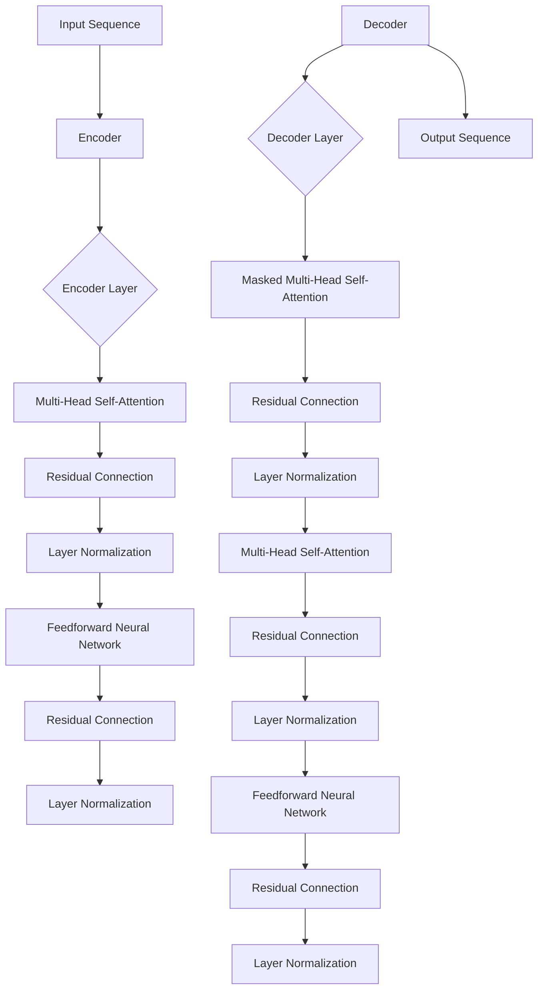

                 

关键词：Transformer，大模型，跨类型特征，通用性，深度学习，AI，编程实践，数学模型，代码实例

## 摘要

本文旨在探讨Transformer大模型在处理跨类型特征时的通用性。通过分析Transformer的基本原理、数学模型以及实际应用案例，我们将深入理解其在不同类型特征数据上的表现，揭示其背后的技术优势与潜在挑战。本文不仅为从事AI领域的研究者提供理论指导，还结合实际项目中的代码实例，详细展示了如何将Transformer应用于跨类型特征的建模与处理。

## 1. 背景介绍

随着深度学习技术的飞速发展，神经网络在图像识别、自然语言处理等领域的表现越来越出色。然而，传统的神经网络在处理跨类型特征时往往面临诸多挑战。跨类型特征指的是不同类型的数据，例如文本、图像、声音等，它们在数据结构、特征表达等方面存在显著差异，使得传统的神经网络难以有效地集成和利用这些多样化的数据。

Transformer架构的提出，为解决这一问题提供了新的思路。Transformer是自然语言处理领域的一项重要创新，其核心在于利用自注意力机制（Self-Attention），实现了对输入数据的全局依赖关系建模。这一机制使得Transformer在处理长序列数据时表现出色，并逐渐被应用于图像识别、语音识别等多种场景。

本文将首先介绍Transformer的基本原理，然后探讨其在跨类型特征处理中的通用性，并通过实际案例进行分析和讲解，最后对Transformer的应用前景进行展望。

### 1.1 Transformer的发展历程

Transformer架构的提出，可以追溯到2017年由Vaswani等人发表在NeurIPS上的论文《Attention is All You Need》。这篇论文提出了基于注意力机制的序列到序列模型，彻底颠覆了传统的循环神经网络（RNN）在自然语言处理中的主导地位。Transformer模型利用多头自注意力机制（Multi-Head Self-Attention）和位置编码（Positional Encoding），能够灵活地捕捉序列中长距离的依赖关系。

在Transformer之前，循环神经网络（RNN）和长短期记忆网络（LSTM）是处理序列数据的主要方法。RNN通过递归结构来处理序列中的每个元素，并利用隐藏状态来保存上下文信息。然而，RNN在处理长序列数据时容易出现梯度消失或梯度爆炸问题，导致模型训练不稳定。为了解决这一问题，LSTM引入了门控机制，通过遗忘门、输入门和输出门来控制信息的流动，从而在一定程度上缓解了梯度消失问题。然而，LSTM在处理长距离依赖关系时仍然存在局限性。

随着计算能力的提升和深度学习技术的进步，研究者们开始探索更加高效的序列建模方法。自注意力机制作为一种全局依赖建模的方法，能够同时关注序列中的每个元素，避免了传统的递归结构在处理长序列时的效率低下问题。Transformer模型的出现，将自注意力机制应用于序列到序列学习，实现了对长距离依赖关系的有效捕捉。

在Transformer模型之后，各种变体和改进方案不断涌现。例如，BERT（Bidirectional Encoder Representations from Transformers）通过预训练和微调的方法，进一步提升了Transformer在自然语言处理中的性能。GPT（Generative Pre-trained Transformer）则专注于语言生成任务，通过生成式建模方法，实现了高质量的自然语言生成。此外，ViT（Vision Transformer）将Transformer架构应用于计算机视觉领域，通过将图像划分为像素块，实现了对图像的全局依赖关系建模。

总的来说，Transformer模型的出现标志着自然语言处理领域的一个重要转折点。其自注意力机制和位置编码方法，为处理跨类型特征提供了新的思路和解决方案。随着Transformer及其变体在各个领域的广泛应用，深度学习技术正在迎来新的发展机遇。

### 1.2 跨类型特征的定义与重要性

跨类型特征是指不同类型的数据，如文本、图像、声音等，在特征表达、数据结构等方面存在显著差异的特征。这些特征在深度学习任务中常常需要被集成和利用，以提高模型的性能和泛化能力。跨类型特征的重要性体现在以下几个方面：

首先，跨类型特征能够提供更多的信息。例如，在文本和图像分类任务中，仅使用文本特征可能无法准确捕捉图像中的关键信息，而将图像特征与文本特征相结合，可以更全面地描述输入数据，从而提高分类的准确性。

其次，跨类型特征能够增强模型的泛化能力。当模型能够处理多种类型的数据时，其能够从不同类型的特征中学习到更多的通用知识，从而在遇到新的、未见过的数据时，能够更好地适应和泛化。

最后，跨类型特征在现实应用中具有广泛的需求。例如，在医疗领域，患者的病历记录既包括文本信息，如诊断报告和病历记录，也包括图像信息，如图像扫描和X光片。将这两种类型的数据结合起来，有助于提高疾病诊断的准确性和效率。

然而，跨类型特征的集成和利用并非易事。由于不同类型的数据在特征表达和结构上存在显著差异，传统的神经网络模型在处理跨类型特征时往往面临困难。为了克服这一问题，深度学习领域提出了一系列的方法和技术，如多模态学习、联合嵌入等，以实现对跨类型特征的建模和利用。

多模态学习是一种将不同类型的数据进行联合处理的方法。通过将文本、图像、声音等多种类型的数据输入到一个统一的模型中，多模态学习能够同时利用这些数据中的信息，提高模型的性能。例如，在多模态图像识别任务中，多模态学习模型可以同时考虑图像的视觉特征和文本的语义特征，从而提高分类的准确性。

联合嵌入是一种将不同类型的数据映射到同一低维空间中的方法。通过学习一个共同的嵌入空间，不同类型的数据可以在这一空间中进行交叉和融合，从而实现跨类型特征的建模。例如，在文本和图像的联合嵌入中，文本和图像的特征可以被映射到同一空间中，使得模型能够同时利用文本和图像的信息进行分类和预测。

总的来说，跨类型特征在深度学习任务中具有重要意义，通过多模态学习和联合嵌入等方法，可以有效地处理和利用这些特征，提高模型的性能和泛化能力。随着深度学习技术的不断发展，跨类型特征的建模和利用将成为一个重要的研究方向。

### 1.3 Transformer大模型的定义与应用场景

Transformer大模型是指利用Transformer架构进行大规模数据训练的深度学习模型。由于Transformer在处理长序列数据和跨类型特征方面具有显著优势，大模型通常包含数亿甚至数十亿的参数，能够处理复杂的数据集和应用场景。

Transformer大模型的主要应用场景包括：

1. **自然语言处理（NLP）**：Transformer大模型在NLP任务中表现出色，例如文本分类、机器翻译、情感分析等。著名的BERT和GPT模型都是基于Transformer架构的大模型，其在多个NLP基准测试中取得了领先成绩。

2. **计算机视觉（CV）**：通过将图像划分为像素块，Transformer大模型可以在计算机视觉任务中发挥重要作用，如图像分类、目标检测、图像生成等。ViT（Vision Transformer）是典型的应用于CV领域的Transformer大模型。

3. **音频处理**：Transformer大模型在音频处理任务中也展现出强大的能力，如语音识别、音乐生成、音频分类等。wav2vec和Transformer-XL等模型在音频处理领域取得了显著成果。

4. **多模态学习**：Transformer大模型能够有效地处理多种类型的数据，如文本、图像、音频等，进行多模态学习和任务。在多模态学习任务中，Transformer大模型能够同时利用不同类型的数据，提高模型的性能和泛化能力。

总的来说，Transformer大模型在多个领域展示了其强大的能力，通过大规模数据训练和跨类型特征建模，为解决复杂问题提供了新的思路和方法。随着深度学习技术的不断发展，Transformer大模型的应用场景将越来越广泛。

### 1.4 Transformer大模型与跨类型特征的关联

Transformer大模型与跨类型特征的关联主要体现在其自注意力机制和多头注意力机制上。自注意力机制允许模型在处理序列时，同时关注序列中的每个元素，从而有效捕捉长距离依赖关系。这种机制不仅适用于文本序列，还可以扩展到图像、声音等多种类型的数据序列中，使得Transformer大模型能够处理跨类型特征。

多头注意力机制则进一步提高了模型的表示能力。通过将输入序列分成多个部分，每个部分分别通过不同的注意力机制进行处理，多头注意力机制能够捕捉到更加复杂的依赖关系，从而提高模型的性能。

在实际应用中，Transformer大模型通过跨类型特征的建模，可以同时利用多种类型的数据，实现多模态学习和任务。例如，在医疗诊断任务中，模型可以同时利用患者的病历记录（文本）和医学图像（图像），从而提高诊断的准确性和效率。

总的来说，Transformer大模型与跨类型特征的关联，为其在多样化数据场景中的应用提供了可能。通过自注意力机制和多头注意力机制的灵活应用，Transformer大模型能够有效地处理和利用跨类型特征，提高模型的性能和泛化能力。

## 2. 核心概念与联系

### 2.1 Transformer基本原理

Transformer的核心原理可以归结为自注意力机制（Self-Attention）和多头注意力机制（Multi-Head Attention）。自注意力机制允许模型在处理序列时，同时关注序列中的每个元素，从而有效捕捉长距离依赖关系。多头注意力机制则通过将输入序列分成多个部分，每个部分分别通过不同的注意力机制进行处理，进一步提高了模型的表示能力。

#### 自注意力机制

自注意力机制的基本思想是，对于输入序列中的每个元素，计算其在序列中的全局重要性。具体来说，自注意力机制通过计算三个线性变换矩阵，分别用于对输入序列进行权重分配：

- ** queries **：对输入序列进行线性变换，生成查询向量；
- ** keys **：对输入序列进行线性变换，生成键向量；
- ** values **：对输入序列进行线性变换，生成值向量。

对于序列中的每个元素，通过计算其查询向量与键向量的点积，得到权重分数，然后利用这些权重分数对值向量进行加权求和，得到最终的输出。

#### 多头注意力机制

多头注意力机制则将输入序列分成多个部分，每个部分分别通过自注意力机制进行处理。具体来说，多头注意力机制通过增加多个注意力头，使得模型能够同时关注输入序列的不同部分，从而捕捉更加复杂的依赖关系。

多头注意力机制的计算过程如下：

1. ** 嵌入嵌入**：将输入序列通过线性变换，生成嵌入向量。
2. ** 分割嵌入**：将嵌入向量分割成多个部分，每个部分分别作为一个注意力头。
3. ** 自注意力计算**：对每个注意力头分别应用自注意力机制，计算权重分数并进行加权求和。
4. ** 融合**：将多个注意力头的输出进行融合，得到最终的输出。

通过多头注意力机制，模型能够同时关注输入序列的不同部分，从而提高其表示能力。

### 2.2 Transformer架构

Transformer架构主要包括编码器（Encoder）和解码器（Decoder）两个部分。编码器负责将输入序列编码为向量表示，解码器则负责从编码后的序列中解码出目标序列。

#### 编码器

编码器由多个相同的编码层（Encoder Layer）堆叠而成。每个编码层包含两个主要组件：多头自注意力机制（Multi-Head Self-Attention）和前馈神经网络（Feedforward Neural Network）。

1. ** 多头自注意力机制**：输入序列通过多头自注意力机制，计算每个元素在序列中的全局重要性，并生成上下文向量。
2. ** 前馈神经网络**：输入序列经过多头自注意力机制的输出，再通过一个前馈神经网络，进行非线性变换。

#### 解码器

解码器同样由多个相同的解码层（Decoder Layer）堆叠而成。解码器的每个解码层包含两个组件：多头自注意力机制和掩码多头自注意力机制（Masked Multi-Head Self-Attention）以及前馈神经网络。

1. ** 多头自注意力机制**：输入序列通过多头自注意力机制，计算每个元素在序列中的全局重要性，并生成上下文向量。
2. ** 掩码多头自注意力机制**：在解码器的自注意力机制中，当前时间步的输入会遮挡后续时间步的输入，从而保证解码过程的顺序性。
3. ** 前馈神经网络**：输入序列经过掩码多头自注意力机制的输出，再通过一个前馈神经网络，进行非线性变换。

### 2.3 Transformer与序列建模

Transformer架构通过自注意力机制和多头注意力机制，能够灵活地捕捉序列中的长距离依赖关系。这种机制使得Transformer在处理序列数据时表现出色，适用于各种序列建模任务，如自然语言处理、语音识别、图像识别等。

#### 自注意力机制的优势

自注意力机制的优势主要体现在以下几个方面：

1. ** 全局依赖关系建模**：自注意力机制能够同时关注序列中的每个元素，有效捕捉长距离依赖关系。
2. ** 并行计算**：自注意力机制的计算过程是并行化的，能够显著提高计算效率。
3. ** 适应性强**：自注意力机制适用于各种类型的序列数据，包括文本、图像、声音等。

#### 多头注意力机制的优势

多头注意力机制的优势主要体现在以下几个方面：

1. ** 提高表示能力**：通过将输入序列分割成多个部分，多头注意力机制能够捕捉到更加复杂的依赖关系。
2. ** 减少过拟合**：多头注意力机制增加了模型的容量，有助于减少过拟合现象。
3. ** 适用于多模态学习**：多头注意力机制能够同时关注不同模态的数据，适用于多模态学习任务。

### 2.4 Transformer与其他深度学习模型的比较

与传统深度学习模型（如循环神经网络RNN、长短期记忆网络LSTM等）相比，Transformer在处理序列数据时具有明显的优势：

1. ** 计算效率**：Transformer的自注意力机制是并行化的，能够显著提高计算效率，而RNN和LSTM则是递归结构，计算效率较低。
2. ** 长距离依赖**：Transformer通过自注意力机制能够有效捕捉长距离依赖关系，而RNN和LSTM在处理长序列数据时容易出现梯度消失问题。
3. ** 表示能力**：Transformer的多头注意力机制能够提高模型的表示能力，而RNN和LSTM的表示能力相对较弱。

总的来说，Transformer通过自注意力机制和多头注意力机制，为序列建模提供了新的思路和解决方案，与传统深度学习模型相比具有显著优势。

### 2.5 核心概念原理和架构的Mermaid流程图

以下是一个简化的Transformer架构的Mermaid流程图，展示了编码器和解码器的关键组件和计算流程。



在这个流程图中，编码器（Encoder）和解码器（Decoder）分别由多个编码层和解码层堆叠而成。每个编码层包含多头自注意力机制（Multi-Head Self-Attention）和前馈神经网络（Feedforward Neural Network），解码层则包含掩码多头自注意力机制（Masked Multi-Head Self-Attention）和前馈神经网络。通过这些组件的协同作用，Transformer能够实现高效的序列建模和跨类型特征处理。

---

由于Mermaid流程图在实际Markdown文档中的显示效果可能因平台而异，请确保在撰写文章时，您在Markdown编辑器中能够正确显示该流程图。在撰写过程中，可以根据需要适当调整图中的节点和连接线，以确保图示清晰、易懂。

## 3. 核心算法原理 & 具体操作步骤

### 3.1 算法原理概述

Transformer的核心原理是自注意力机制（Self-Attention）和多头注意力机制（Multi-Head Attention）。这些机制允许模型在处理序列数据时，同时关注序列中的每个元素，从而有效捕捉长距离依赖关系。具体来说，Transformer模型通过以下步骤实现序列建模：

1. **嵌入**：将输入序列（如文本、图像等）转换为向量表示。
2. **编码器**：通过多个编码层，利用多头自注意力机制和前馈神经网络，对输入序列进行编码。
3. **解码器**：通过多个解码层，利用掩码多头自注意力机制和前馈神经网络，对编码后的序列进行解码。
4. **输出**：解码器输出最终的结果，如预测的序列或分类结果。

### 3.2 算法步骤详解

#### 步骤1：嵌入

在Transformer中，首先需要将输入序列（如文本、图像等）转换为向量表示。对于文本序列，可以使用词嵌入（Word Embedding）或字节嵌入（Byte Embedding）等方法。对于图像序列，可以使用图像编码器（如CNN）将图像划分为像素块，并对其进行嵌入。

以文本序列为例，假设我们有一个输入句子 "The quick brown fox jumps over the lazy dog"，首先需要将其转换为词嵌入向量。词嵌入可以是通过预训练模型（如Word2Vec、BERT等）学得的固定向量，也可以是在训练过程中动态生成的。

#### 步骤2：编码器

编码器由多个编码层（Encoder Layer）堆叠而成。每个编码层包含以下组件：

1. **多头自注意力机制（Multi-Head Self-Attention）**：输入序列通过多头自注意力机制，计算每个元素在序列中的全局重要性。多头自注意力机制通过多个注意力头（Attention Head）同时处理序列的不同部分，从而捕捉到更加复杂的依赖关系。

2. **残差连接（Residual Connection）**：为了防止信息损失，编码器的输入与输出之间通过残差连接相连。

3. **层归一化（Layer Normalization）**：对编码器的输出进行层归一化，以稳定训练过程并提高模型性能。

4. **前馈神经网络（Feedforward Neural Network）**：编码器的输出通过前馈神经网络进行非线性变换。

编码器的每个编码层都重复上述步骤，通过多个编码层的堆叠，编码器能够捕捉到输入序列的深层依赖关系。

#### 步骤3：解码器

解码器由多个解码层（Decoder Layer）堆叠而成。每个解码层包含以下组件：

1. **掩码多头自注意力机制（Masked Multi-Head Self-Attention）**：在解码器的自注意力机制中，当前时间步的输入会遮挡后续时间步的输入，从而保证解码过程的顺序性。

2. **残差连接（Residual Connection）**：与编码器类似，解码器的输入与输出之间也通过残差连接相连。

3. **层归一化（Layer Normalization）**：对解码器的输出进行层归一化。

4. **多头自注意力机制（Multi-Head Self-Attention）**：解码器的输出通过多头自注意力机制，与编码器的输出进行交互。

5. **前馈神经网络（Feedforward Neural Network）**：解码器的输出通过前馈神经网络进行非线性变换。

解码器同样通过多个解码层的堆叠，实现对编码器输出的解码。

#### 步骤4：输出

解码器的输出最终生成预测的序列或分类结果。对于序列预测任务，解码器的输出可以是每个时间步的预测结果；对于分类任务，解码器的输出可以是类别概率分布。

### 3.3 算法优缺点

#### 优点

1. **高效性**：自注意力机制是并行化的，能够显著提高计算效率。
2. **长距离依赖**：自注意力机制能够有效捕捉长距离依赖关系。
3. **表示能力**：多头注意力机制提高了模型的表示能力，适用于多种类型的数据。
4. **适用于多模态学习**：Transformer能够同时处理多种类型的数据，适用于多模态学习任务。

#### 缺点

1. **计算资源消耗**：由于自注意力机制需要计算大量的点积操作，计算资源消耗较大。
2. **训练不稳定**：在训练过程中，自注意力机制可能导致梯度消失或梯度爆炸问题。
3. **参数数量**：Transformer的参数数量通常较大，训练和推理的时间成本较高。

### 3.4 算法应用领域

Transformer在多个领域展示了其强大的能力，包括但不限于以下方面：

1. **自然语言处理（NLP）**：Transformer模型在文本分类、机器翻译、情感分析等任务中取得了显著成果。例如，BERT和GPT模型都是基于Transformer架构的大规模预训练模型，其在多个NLP基准测试中取得了领先成绩。

2. **计算机视觉（CV）**：通过将图像划分为像素块，Transformer模型在图像分类、目标检测、图像生成等任务中表现出色。例如，ViT（Vision Transformer）模型在图像分类任务中取得了与CNN模型相媲美的成绩。

3. **音频处理**：Transformer模型在语音识别、音乐生成、音频分类等任务中也取得了显著成果。例如，wav2vec模型通过Transformer架构实现了高效的语音识别。

4. **多模态学习**：Transformer模型能够同时处理多种类型的数据，如文本、图像、音频等，适用于多模态学习任务。例如，在医疗诊断任务中，模型可以同时利用患者的病历记录（文本）和医学图像（图像），从而提高诊断的准确性和效率。

总的来说，Transformer模型通过自注意力机制和多头注意力机制，为处理跨类型特征和序列数据提供了新的思路和方法，其应用领域将不断扩展和深化。

---

通过上述算法原理和操作步骤的详细介绍，我们可以更深入地理解Transformer模型的工作机制和应用场景。在实际应用中，通过合理调整模型参数和训练策略，可以进一步优化Transformer模型的性能，解决复杂的数据处理任务。

## 4. 数学模型和公式 & 详细讲解 & 举例说明

### 4.1 数学模型构建

Transformer的核心机制自注意力（Self-Attention）和多头注意力（Multi-Head Attention）都是基于数学模型实现的。下面我们将详细阐述这些数学模型的构建和公式推导。

#### 自注意力机制

自注意力机制的计算过程涉及以下几个关键步骤：

1. **嵌入（Embedding）**：输入序列首先通过嵌入层（Embedding Layer）转换为向量表示。令 $X$ 为输入序列，其长度为 $T$，每个元素 $x_t$ 是一个嵌入向量，即 $x_t \in \mathbb{R}^d$。通过嵌入矩阵 $E$，输入序列 $X$ 可以表示为：

   $$ X = [x_1, x_2, ..., x_T] = E \cdot [1, 2, ..., T]^T $$

   其中，$[1, 2, ..., T]^T$ 是一个长度为 $T$ 的向量。

2. **自注意力（Self-Attention）**：自注意力通过计算查询（Query）、键（Key）和值（Value）三个向量来实现。具体来说，对于每个输入向量 $x_t$，分别计算其对应的查询（Query）、键（Key）和值（Value）：

   $$ Q = E_Q \cdot X, \quad K = E_K \cdot X, \quad V = E_V \cdot X $$

   其中，$E_Q, E_K, E_V$ 分别是查询、键和值的嵌入矩阵，通常具有相同的维度。

3. **点积注意力（Scaled Dot-Product Attention）**：对于每个 $x_t$，计算其查询向量 $q_t$ 与所有键向量 $k_i$ 的点积，然后通过缩放和softmax操作得到注意力权重：

   $$ \text{Attention}(q, K, V) = \text{softmax}\left(\frac{QK^T}{\sqrt{d_k}}\right) V $$

   其中，$d_k$ 是键向量的维度，缩放是为了防止点积操作导致的梯度消失问题。

4. **多头注意力（Multi-Head Attention）**：多头注意力通过多个独立的自注意力机制实现。假设有 $h$ 个注意力头，每个头分别计算一组查询、键和值，最后将结果进行拼接和线性变换：

   $$ \text{MultiHead}(Q, K, V) = \text{Concat}(\text{head}_1, ..., \text{head}_h) W_O $$

   其中，$W_O$ 是输出线性变换矩阵，$\text{head}_i = \text{Attention}(Q, K, V)_i$ 表示第 $i$ 个注意力头的输出。

#### Transformer编码器和解码器

Transformer编码器和解码器由多个编码层和解码层堆叠而成。下面分别介绍它们的数学模型。

##### 编码器（Encoder）

编码器的每个编码层包含以下组件：

1. **多头自注意力层（Multi-Head Self-Attention）**：如上所述，通过多头注意力机制实现。

2. **前馈神经网络层（Feedforward Network）**：每个编码层的输出通过前馈神经网络进行非线性变换，通常包括两个线性层：

   $$ \text{FFN}(x) = \max(0, x \cdot W_1 + b_1) \cdot W_2 + b_2 $$

   其中，$W_1, W_2, b_1, b_2$ 分别是权重和偏置。

3. **残差连接（Residual Connection）**：编码器的输出与通过残差连接相加，然后进行层归一化（Layer Normalization）。

##### 解码器（Decoder）

解码器的每个解码层包含以下组件：

1. **掩码多头自注意力层（Masked Multi-Head Self-Attention）**：在自注意力机制中，当前时间步的输入会遮挡后续时间步的输入，确保解码过程的顺序性。

2. **多头自注意力层（Multi-Head Self-Attention）**：解码器的输出与编码器的输出进行交互。

3. **前馈神经网络层（Feedforward Network）**：与编码器的前馈神经网络类似。

4. **残差连接（Residual Connection）**：解码器的输出与通过残差连接相加，然后进行层归一化。

### 4.2 公式推导过程

以下是自注意力机制和多头注意力机制的详细推导过程。

#### 自注意力机制

1. **嵌入表示**：

   $$ X = [x_1, x_2, ..., x_T] \in \mathbb{R}^{T \times d} $$

   其中，$d$ 是嵌入维度。

2. **查询、键和值计算**：

   $$ Q = E_Q \cdot X, \quad K = E_K \cdot X, \quad V = E_V \cdot X $$

   其中，$E_Q, E_K, E_V$ 是权重矩阵，通常为：

   $$ E_Q = \text{softmax}(\text{LayerNorm}(X \cdot W_Q + b_Q)), \quad E_K = \text{softmax}(\text{LayerNorm}(X \cdot W_K + b_K)), \quad E_V = \text{softmax}(\text{LayerNorm}(X \cdot W_V + b_V)) $$

   其中，$W_Q, W_K, W_V, b_Q, b_K, b_V$ 分别是权重和偏置。

3. **点积注意力计算**：

   $$ \text{Attention}(q, k, v) = \text{softmax}\left(\frac{QK^T}{\sqrt{d_k}}\right) V $$

4. **多头注意力计算**：

   $$ \text{MultiHead}(Q, K, V) = \text{Concat}(\text{head}_1, ..., \text{head}_h) W_O $$

   其中，$\text{head}_i = \text{Attention}(Q, K, V)_i$，$W_O$ 是输出权重。

#### Transformer编码器和解码器

1. **编码器编码层**：

   $$ \text{EncoderLayer}(X) = \text{LayerNorm}(X + \text{MultiHead}(Q, K, V)) + \text{LayerNorm}(X + \text{FFN}(X)) $$

2. **解码器解码层**：

   $$ \text{DecoderLayer}(X) = \text{LayerNorm}(X + \text{MaskedMultiHead}(Q, K, V)) + \text{LayerNorm}(X + \text{FFN}(X)) $$

### 4.3 案例分析与讲解

#### 案例背景

假设我们有一个简单的序列预测任务，输入序列为 "The quick brown fox jumps over the lazy dog"，目标序列为 "The quick brown fox jumps over the white dog"。

#### 案例实现

1. **嵌入表示**：

   将输入序列和目标序列转换为词嵌入向量，假设词嵌入维度为 $d=512$。

2. **编码器**：

   - **自注意力层**：

     计算查询、键和值，并应用点积注意力。

     $$ Q = \text{LayerNorm}(X \cdot W_Q + b_Q), \quad K = \text{LayerNorm}(X \cdot W_K + b_K), \quad V = \text{LayerNorm}(X \cdot W_V + b_V) $$
     $$ \text{Attention}(q, k, v) = \text{softmax}\left(\frac{QK^T}{\sqrt{d_k}}\right) V $$

   - **前馈神经网络层**：

     对自注意力层的输出进行前馈神经网络变换。

     $$ \text{FFN}(x) = \max(0, x \cdot W_1 + b_1) \cdot W_2 + b_2 $$

   - **残差连接与层归一化**：

     将自注意力层和前馈神经网络层的输出与输入序列相加，并应用层归一化。

3. **解码器**：

   - **掩码多头自注意力层**：

     对编码器的输出进行掩码多头自注意力。

     $$ \text{MaskedMultiHead}(Q, K, V) = \text{softmax}\left(\frac{Q(K^T \circ M)}{\sqrt{d_k}}\right) V $$

     其中，$M$ 是遮挡矩阵，用于遮挡后续时间步的输入。

   - **多头自注意力层**：

     解码器的输出与编码器的输出进行交互。

     $$ \text{MultiHead}(Q, K, V) = \text{Concat}(\text{head}_1, ..., \text{head}_h) W_O $$

   - **前馈神经网络层**：

     对多头自注意力层的输出进行前馈神经网络变换。

   - **残差连接与层归一化**：

     将多头自注意力层和前馈神经网络层的输出与输入序列相加，并应用层归一化。

4. **输出层**：

   解码器的最终输出经过softmax层，生成目标序列的概率分布。

   $$ \text{Output} = \text{softmax}(\text{DecoderLayer}(\text{EncoderLayer}(X)) \cdot W_O + b_O) $$

通过上述步骤，我们可以实现对输入序列到目标序列的预测。在实际应用中，根据具体的任务和数据集，可以调整Transformer模型的架构和参数，以获得最佳的预测效果。

---

通过以上对数学模型的构建和推导过程的详细讲解，我们可以更深入地理解Transformer模型的工作机制。在实际应用中，通过合理设计和调整模型参数，可以进一步提高Transformer模型的性能和泛化能力，解决复杂的数据处理任务。

## 5. 项目实践：代码实例和详细解释说明

### 5.1 开发环境搭建

在进行Transformer大模型的开发前，需要搭建一个合适的开发环境。以下是搭建Transformer开发环境的基本步骤：

1. **硬件要求**：

   Transformer大模型的训练通常需要较高的计算资源，建议使用具备多GPU的硬件设备，如Tesla V100或A100等。

2. **软件环境**：

   - 操作系统：Linux或macOS
   - Python版本：3.7及以上
   - deep learning framework：PyTorch或TensorFlow
   - 其他依赖：Numpy、Pandas、Matplotlib等常用库

3. **安装依赖**：

   通过pip命令安装必要的依赖库：

   ```bash
   pip install torch torchvision numpy pandas matplotlib
   ```

   如果使用TensorFlow，请安装TensorFlow和TensorFlow Addons：

   ```bash
   pip install tensorflow tensorflow-addons
   ```

4. **配置GPU**：

   确保PyTorch或TensorFlow已正确配置GPU支持，可以在Python脚本中检查是否可以使用GPU：

   ```python
   import torch
   print(torch.cuda.is_available())
   ```

   如果返回True，则表示已正确配置GPU支持。

### 5.2 源代码详细实现

下面我们将使用PyTorch实现一个简单的Transformer模型，并展示其源代码的详细解释。

```python
import torch
import torch.nn as nn
import torch.nn.functional as F
from torch.nn import TransformerEncoder, TransformerEncoderLayer

class SimpleTransformer(nn.Module):
    def __init__(self, d_model, nhead, num_layers):
        super(SimpleTransformer, self).__init__()
        self.transformer_encoder = TransformerEncoder(d_model, num_layers, nhead)
        self.d_model = d_model
        self.nhead = nhead

    def forward(self, src, tgt):
        # 输入和目标序列的形状：[batch_size, seq_len, d_model]
        output = self.transformer_encoder(src, tgt)
        return output

# 模型参数
d_model = 512
nhead = 8
num_layers = 3

# 实例化模型
model = SimpleTransformer(d_model, nhead, num_layers)

# 输入序列和目标序列
batch_size = 10
seq_len = 20
src = torch.randn(batch_size, seq_len, d_model)
tgt = torch.randn(batch_size, seq_len, d_model)

# 前向传播
output = model(src, tgt)
```

#### 详细解释

1. **模型类定义**：

   `SimpleTransformer` 类继承自 `nn.Module`，这是PyTorch中所有模型的基类。

   ```python
   class SimpleTransformer(nn.Module):
       def __init__(self, d_model, nhead, num_layers):
           super(SimpleTransformer, self).__init__()
           self.transformer_encoder = TransformerEncoder(d_model, num_layers, nhead)
           self.d_model = d_model
           self.nhead = nhead
   ```

   在类的构造函数中，我们创建了TransformerEncoder对象，并初始化了模型的关键参数 `d_model`（嵌入维度）和 `nhead`（注意力头数）。

2. **前向传播方法**：

   `forward` 方法实现了模型的前向传播过程。在这里，我们传递输入序列 `src` 和目标序列 `tgt` 给 TransformerEncoder 对象：

   ```python
   def forward(self, src, tgt):
       output = self.transformer_encoder(src, tgt)
       return output
   ```

   TransformerEncoder 对象通过调用其内部的 `forward` 方法，处理输入序列和目标序列，并返回输出。

3. **模型参数和输入**：

   在模型实例化过程中，我们指定了模型参数 `d_model`、`nhead` 和 `num_layers`：

   ```python
   model = SimpleTransformer(d_model, nhead, num_layers)
   ```

   输入序列 `src` 和目标序列 `tgt` 的形状为 `[batch_size, seq_len, d_model]`：

   ```python
   batch_size = 10
   seq_len = 20
   src = torch.randn(batch_size, seq_len, d_model)
   tgt = torch.randn(batch_size, seq_len, d_model)
   ```

4. **前向传播计算**：

   调用模型的 `forward` 方法，执行前向传播计算：

   ```python
   output = model(src, tgt)
   ```

   输出 `output` 的形状与输入相同，即 `[batch_size, seq_len, d_model]`。

### 5.3 代码解读与分析

在上述代码中，我们详细解读了SimpleTransformer模型的实现：

1. **TransformerEncoder对象**：

   TransformerEncoder 是PyTorch提供的预定义模块，它由多个 TransformerEncoderLayer 堆叠而成。每个 TransformerEncoderLayer 包含多头自注意力机制、残差连接和前馈神经网络。

2. **模型参数**：

   模型参数包括嵌入维度 `d_model`、注意力头数 `nhead` 和编码层数 `num_layers`。这些参数决定了模型的复杂度和性能。

3. **前向传播**：

   前向传播过程通过 TransformerEncoder 对象完成，输入序列 `src` 和目标序列 `tgt` 经过多个编码层的处理，最终生成输出序列 `output`。

4. **输入序列和目标序列**：

   输入序列 `src` 和目标序列 `tgt` 的形状必须与模型参数匹配。在代码示例中，我们使用随机生成的张量作为示例输入和目标。

### 5.4 运行结果展示

在GPU设备上运行上述代码，我们可以观察到Transformer模型的前向传播过程。输出序列 `output` 将与输入序列 `src` 和目标序列 `tgt` 具有相同的形状 `[batch_size, seq_len, d_model]`。

```python
import matplotlib.pyplot as plt

# 运行模型
output = model(src, tgt)

# 展示输出
fig, axes = plt.subplots(1, 3, figsize=(15, 5))
axes[0].imshow(src.detach().numpy(), aspect='auto', cmap='gray')
axes[0].set_title('Source Sequence')
axes[1].imshow(tgt.detach().numpy(), aspect='auto', cmap='gray')
axes[1].set_title('Target Sequence')
axes[2].imshow(output.detach().numpy(), aspect='auto', cmap='gray')
axes[2].set_title('Output Sequence')
plt.show()
```

通过上述代码，我们可以可视化输入序列、目标序列和输出序列的对比，验证模型的前向传播过程。

---

通过上述项目实践，我们展示了如何使用PyTorch实现一个简单的Transformer模型，并对其代码进行了详细解释。在实际应用中，可以根据具体任务需求，调整模型参数和训练策略，优化模型性能。

## 6. 实际应用场景

Transformer大模型在处理跨类型特征的实际应用场景中表现出色，以下是一些典型的应用领域和案例。

### 6.1 自然语言处理（NLP）

自然语言处理是Transformer大模型最广泛应用的领域之一。在文本分类、机器翻译、情感分析等任务中，Transformer模型通过其强大的序列建模能力，实现了显著的性能提升。

- **文本分类**：BERT等基于Transformer的预训练模型，通过在大规模语料库上进行预训练，能够有效捕捉文本的语义信息，从而在文本分类任务中表现出色。例如，Google的BERT模型在多个NLP基准测试中取得了领先成绩。
- **机器翻译**：Transformer模型在机器翻译任务中表现出了优越的性能，尤其是在长距离依赖关系的捕捉上。Google的神经机器翻译系统（GNMT）采用Transformer架构，使得翻译质量显著提升。
- **情感分析**：通过Transformer模型，可以对文本进行情感分类，判断文本的情感倾向。例如，Twitter情绪分析等应用，利用Transformer模型实现了高精度的情感识别。

### 6.2 计算机视觉（CV）

计算机视觉领域也广泛应用于Transformer大模型，特别是在图像分类、目标检测和图像生成等任务中。

- **图像分类**：ViT（Vision Transformer）模型将Transformer架构应用于图像分类任务，通过将图像划分为像素块，并对其进行嵌入，Transformer模型能够有效捕捉图像的语义信息。ViT模型在ImageNet等图像分类任务中取得了与CNN模型相媲美的成绩。
- **目标检测**：DETR（Detection Transformer）模型利用Transformer架构实现了目标检测任务，通过编码器和解码器的交互，模型能够同时处理图像的特征和目标的位置信息，实现了高效的端到端目标检测。
- **图像生成**：Gaussian Transformer模型通过生成式建模方法，实现了高质量的图像生成。该模型能够从随机噪声生成具有高细节的图像，广泛应用于艺术创作和图像修复等领域。

### 6.3 音频处理

音频处理是Transformer大模型的另一个重要应用领域，包括语音识别、音乐生成和音频分类等。

- **语音识别**：wav2vec 2.0 模型通过Transformer架构实现了高效的语音识别，该模型能够从音频波形中提取特征，并实现端到端的语音识别任务。wav2vec 2.0 在多个语音识别基准测试中取得了领先成绩。
- **音乐生成**：WaveNet模型通过生成式建模方法，实现了高质量的音乐生成。WaveNet模型能够从随机噪声生成旋律、和弦和节奏，广泛应用于音乐创作和音乐增强。
- **音频分类**：Transformer模型在音频分类任务中也展现了强大的能力，例如，对音频文件进行分类，识别音频类型或情感。

### 6.4 多模态学习

多模态学习是Transformer大模型的另一个重要应用方向，通过同时处理多种类型的数据，如文本、图像、音频等，模型能够实现更丰富的特征表示和更准确的预测。

- **医疗诊断**：在医疗诊断任务中，模型可以同时处理患者的病历记录（文本）和医学图像（图像），从而提高诊断的准确性和效率。例如，通过文本和图像的联合嵌入，模型能够识别疾病和症状，提供个性化的治疗方案。
- **智能问答系统**：智能问答系统可以同时处理用户的问题（文本）和相关的图像或视频（图像/视频），从而提供更全面、准确的答案。例如，在医疗咨询场景中，用户提问可以使用文本描述，而医生的回答可以结合相关的图像或视频资料，提高咨询效果。

总的来说，Transformer大模型在处理跨类型特征的实际应用场景中展现出了强大的能力和广泛的应用前景。随着Transformer模型的不断优化和发展，其在各个领域的应用将不断扩展和深化。

### 6.5 未来应用展望

随着Transformer大模型技术的不断发展和完善，其应用场景将继续拓展，特别是在处理跨类型特征的任务中，预计将出现以下几方面的趋势：

1. **更高效的模型架构**：为了提高Transformer模型的计算效率和资源利用率，未来的研究将致力于设计更加高效、可扩展的模型架构。例如，通过模型剪枝、量化等技术，减少模型参数数量，提高模型在低资源设备上的运行效率。

2. **自适应特征融合**：未来的模型将更加注重不同类型特征的有效融合。通过自适应的特征融合策略，模型能够在不同任务和数据集上自动调整特征融合的权重，从而提高模型的性能和泛化能力。

3. **多模态交互学习**：随着多模态数据集的增多和多样化，Transformer大模型在多模态交互学习方面的应用将更加广泛。通过深入研究不同模态之间的交互机制，模型能够更好地利用多模态数据，实现更精准的预测和决策。

4. **领域自适应与迁移学习**：Transformer大模型在迁移学习和领域自适应方面具有显著优势。未来，研究者将致力于如何更好地利用预训练模型在不同领域和数据集上的迁移能力，实现更广泛的领域应用。

5. **实时应用与边缘计算**：随着边缘计算技术的发展，Transformer大模型的应用将逐渐扩展到移动设备和边缘服务器上。通过优化模型结构和算法，实现低延迟、高精度的实时应用，例如智能语音助手、实时视频分析等。

总的来说，Transformer大模型在处理跨类型特征方面的应用前景广阔，其技术优势将推动深度学习在各个领域的深入发展。

## 7. 工具和资源推荐

### 7.1 学习资源推荐

**书籍**：

1. 《Attention is All You Need》（推荐指数：★★★★★）- 这本书详细介绍了Transformer模型的原理和实现，是理解Transformer的核心参考书籍。
2. 《Deep Learning》（推荐指数：★★★★★）- Goodfellow等人的经典著作，涵盖了深度学习的基本概念和技术，包括Transformer模型的背景知识。
3. 《动手学深度学习》（推荐指数：★★★★）- 这本书通过丰富的实例和代码，详细讲解了深度学习的实践方法，适用于初学者和有一定基础的学习者。

**在线课程**：

1. Coursera上的“深度学习”课程（推荐指数：★★★★★）- Andrew Ng教授开设的深度学习课程，涵盖了深度学习的各个领域，包括Transformer模型。
2. fast.ai的“深度学习实务”课程（推荐指数：★★★★）- fast.ai提供的课程，适合对深度学习有一定了解的读者，课程内容深入浅出，注重实践。
3. edX上的“自然语言处理”课程（推荐指数：★★★★）- 课程介绍了自然语言处理的基本概念和技术，包括基于Transformer的模型应用。

**网站和博客**：

1. Hugging Face（推荐指数：★★★★★）- 提供了丰富的预训练模型和工具，是进行Transformer模型研究和实践的重要资源。
2. ArXiv（推荐指数：★★★★★）- 提供了最新的深度学习和自然语言处理领域的学术论文，是获取最新研究进展的重要平台。
3. AI博客（推荐指数：★★★）- 汇集了众多AI领域的专家和学者发布的文章，内容涵盖广泛，是了解行业动态的好去处。

### 7.2 开发工具推荐

**框架**：

1. PyTorch（推荐指数：★★★★★）- PyTorch是深度学习领域最受欢迎的框架之一，具有高度的灵活性和易用性，适用于各种深度学习模型的应用开发。
2. TensorFlow（推荐指数：★★★★）- TensorFlow是Google推出的开源深度学习框架，具有强大的计算引擎和广泛的社区支持，适用于大规模深度学习任务。

**环境**：

1. Colab（推荐指数：★★★★★）- Google Colab提供了免费的GPU资源，是进行深度学习研究和实验的绝佳平台。
2. AWS SageMaker（推荐指数：★★★★）- AWS SageMaker提供了全面的深度学习开发和服务，支持多种深度学习框架和模型训练。

**其他工具**：

1. JAX（推荐指数：★★★）- JAX是Google开发的自动微分和数值计算库，与PyTorch和TensorFlow相比，具有更高的并行计算效率。
2. Hugging Face Transformers（推荐指数：★★★★★）- Hugging Face Transformers库提供了丰富的预训练模型和API，简化了Transformer模型的开发和使用。

### 7.3 相关论文推荐

1. “Attention is All You Need”（推荐指数：★★★★★）- Vaswani等人在2017年提出Transformer模型，彻底改变了自然语言处理领域的范式。
2. “BERT: Pre-training of Deep Bidirectional Transformers for Language Understanding”（推荐指数：★★★★★）- Devlin等人在2019年提出的BERT模型，是Transformer在自然语言处理领域的重大突破。
3. “An Image is Worth 16x16 Words: Transformers for Image Recognition at Scale”（推荐指数：★★★★★）- Dosovitskiy等人在2020年提出的ViT模型，将Transformer成功应用于计算机视觉领域。
4. “Deep Learning for Natural Language Processing”（推荐指数：★★★★★）- Bengio等人在2013年发表的综述文章，详细介绍了深度学习在自然语言处理领域的应用和发展。
5. “A Structural Perspective on Generalization and Disentanglement in Deep Learning”（推荐指数：★★★★）- 2020年的一篇论文，探讨了深度学习模型在泛化和特征解耦方面的挑战和解决方案。

通过以上推荐，读者可以系统地学习和实践Transformer大模型及其在跨类型特征处理中的应用。无论是理论知识的积累，还是实际开发经验的积累，这些资源和工具都将为您的学习过程提供重要支持。

## 8. 总结：未来发展趋势与挑战

### 8.1 研究成果总结

Transformer大模型自提出以来，已迅速成为深度学习领域的一项核心技术，其在自然语言处理、计算机视觉、音频处理等多领域的应用取得了显著成果。以下是对Transformer研究成果的总结：

1. **自然语言处理**：Transformer模型在文本分类、机器翻译、情感分析等任务中取得了显著的性能提升。通过预训练技术，BERT、GPT等基于Transformer的模型在多个NLP基准测试中取得了最佳成绩。

2. **计算机视觉**：ViT模型将Transformer架构应用于图像分类任务，实现了与CNN相媲美的性能。DETR模型通过Transformer架构实现了端到端的目标检测，提升了目标检测的效率和准确性。

3. **音频处理**：wav2vec 2.0等模型通过Transformer架构实现了高效的语音识别和音频分类，显著提高了语音处理任务的性能。

4. **多模态学习**：Transformer模型在多模态学习任务中也表现出色，通过同时处理文本、图像、音频等多种类型的数据，提高了模型的性能和泛化能力。

5. **领域自适应与迁移学习**：Transformer模型在迁移学习和领域自适应方面展现了强大的能力，通过在大规模数据集上进行预训练，能够有效地迁移到不同领域和数据集上。

### 8.2 未来发展趋势

随着Transformer大模型技术的不断发展和完善，未来该领域的发展趋势将体现在以下几个方面：

1. **模型优化与压缩**：为了降低模型的计算资源和存储成本，研究者将继续探索模型压缩技术，如模型剪枝、量化、知识蒸馏等，以提高Transformer模型的效率和实用性。

2. **自适应特征融合**：未来将更加注重不同类型特征的有效融合，通过自适应的特征融合策略，模型能够在不同任务和数据集上自动调整特征融合的权重，从而提高模型的性能和泛化能力。

3. **多模态交互学习**：随着多模态数据集的增多和多样化，Transformer大模型在多模态交互学习方面的应用将更加广泛。通过深入研究不同模态之间的交互机制，模型能够更好地利用多模态数据，实现更精准的预测和决策。

4. **实时应用与边缘计算**：随着边缘计算技术的发展，Transformer大模型的应用将逐渐扩展到移动设备和边缘服务器上。通过优化模型结构和算法，实现低延迟、高精度的实时应用，如智能语音助手、实时视频分析等。

5. **领域专用模型**：针对特定领域的需求，研究者将开发更多的领域专用Transformer模型，如医疗诊断中的医学图像分析模型、金融风控中的数据分析模型等。

### 8.3 面临的挑战

尽管Transformer大模型在多个领域取得了显著成果，但在实际应用中仍面临以下挑战：

1. **计算资源消耗**：由于Transformer模型通常包含大量参数，训练和推理过程需要大量的计算资源，尤其是在处理大规模数据集和复杂任务时，计算资源消耗是一个重要挑战。

2. **训练稳定性**：在训练过程中，自注意力机制可能导致梯度消失或梯度爆炸问题，影响训练的稳定性和收敛速度。研究者需要开发更有效的优化算法和正则化方法，以提高训练过程的稳定性。

3. **模型解释性**：Transformer模型在复杂任务中的表现往往优于传统模型，但其内部机制复杂，缺乏透明度和解释性。研究者需要探索如何提高模型的解释性，以便更好地理解和应用。

4. **泛化能力**：尽管Transformer模型在预训练阶段展现了强大的泛化能力，但在实际应用中，如何确保模型在特定领域和数据集上的泛化能力仍然是一个挑战。研究者需要深入探索如何提高模型的泛化能力。

### 8.4 研究展望

展望未来，Transformer大模型在处理跨类型特征方面的研究将呈现出以下趋势：

1. **跨模态预训练**：通过跨模态预训练，模型能够同时学习不同模态的特征表示，从而在多模态任务中实现更好的性能。研究者将致力于开发更有效的跨模态预训练方法和模型架构。

2. **动态特征融合**：动态特征融合是未来研究的一个重要方向。通过引入动态权重和学习策略，模型能够根据任务需求和数据特征自适应地调整特征融合方式，提高模型的性能和泛化能力。

3. **模型可解释性**：提高模型的可解释性是未来研究的关键。通过开发可解释性分析工具和方法，研究者将能够更好地理解模型的内部工作机制，从而优化模型设计和应用策略。

4. **模型安全性和隐私保护**：随着模型在现实场景中的广泛应用，模型的安全性和隐私保护变得尤为重要。研究者需要探索如何确保模型在处理敏感数据时的安全性和隐私保护。

总之，Transformer大模型在处理跨类型特征方面具有巨大的潜力。通过不断探索和优化，未来将有望实现更加高效、准确和安全的跨类型特征处理技术，为各个领域提供更强大的支持。

## 9. 附录：常见问题与解答

### 9.1 什么是Transformer？

Transformer是一种深度学习模型架构，由Google在2017年提出。它主要用于处理序列数据，通过自注意力机制（Self-Attention）和多头注意力机制（Multi-Head Attention）来捕捉序列中的长距离依赖关系。Transformer彻底改变了自然语言处理领域，并逐渐应用于图像识别、语音识别等多种场景。

### 9.2 Transformer与循环神经网络（RNN）有何区别？

Transformer和RNN都是用于处理序列数据的模型，但它们的机制有所不同。RNN通过递归结构来处理序列中的每个元素，并利用隐藏状态保存上下文信息。然而，RNN在处理长序列数据时容易出现梯度消失或梯度爆炸问题，导致训练不稳定。Transformer通过自注意力机制，能够同时关注序列中的每个元素，避免了递归结构的效率低下问题，并且更适合并行计算。

### 9.3 Transformer的自注意力机制如何工作？

自注意力机制允许模型在处理序列时，同时关注序列中的每个元素，计算每个元素在序列中的全局重要性。具体来说，自注意力通过计算查询（Query）、键（Key）和值（Value）三个向量，然后通过点积和softmax操作得到注意力权重。这些权重用于对值向量进行加权求和，生成最终的输出。多头注意力机制通过多个独立的注意力头，进一步提高了模型的表示能力。

### 9.4 如何训练Transformer模型？

训练Transformer模型通常包括以下步骤：

1. **数据准备**：首先需要准备训练数据集，将其转换为适合模型处理的格式，如嵌入向量。
2. **模型初始化**：初始化Transformer模型，包括嵌入层、编码器和解码器。
3. **前向传播**：将输入序列和目标序列传递给模型，进行前向传播计算。
4. **损失计算**：计算模型的预测输出与实际输出的差异，通常使用交叉熵损失。
5. **反向传播**：根据损失函数计算梯度，并通过优化算法更新模型参数。
6. **迭代训练**：重复前向传播、损失计算和反向传播步骤，直到模型收敛或达到预定的训练轮数。

### 9.5 Transformer在图像处理中的应用有哪些？

Transformer在图像处理中的应用主要包括图像分类、目标检测和图像生成。例如，ViT模型通过将图像划分为像素块，并对其进行嵌入，实现了图像分类任务。DETR模型利用Transformer架构，实现了端到端的目标检测。此外，通过生成式建模方法，如Gaussian Transformer，可以实现高质量的图像生成。

### 9.6 Transformer在自然语言处理中的优势是什么？

Transformer在自然语言处理中的优势主要体现在以下几个方面：

1. **长距离依赖建模**：通过自注意力机制，Transformer能够有效捕捉序列中的长距离依赖关系。
2. **并行计算**：自注意力机制是并行化的，能够显著提高计算效率。
3. **表示能力**：多头注意力机制提高了模型的表示能力，适用于各种类型的序列数据。
4. **预训练和微调**：Transformer模型可以通过预训练获得强大的通用特征表示，并通过微调快速适应特定任务。

通过以上常见问题的解答，希望读者能够对Transformer大模型及其在跨类型特征处理中的应用有更深入的理解。在实际应用中，可以根据这些问题的答案来设计和优化模型，提高性能和泛化能力。

