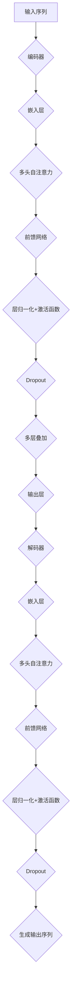

                 

## 1. 背景介绍

Transformer架构的诞生可以追溯到2017年，由谷歌团队在论文《Attention Is All You Need》中首次提出。这一架构迅速成为自然语言处理（NLP）领域的突破性创新，因其出色的表现和独特的注意力机制而受到广泛关注。传统的序列模型如LSTM（Long Short-Term Memory）和GRU（Gated Recurrent Unit）在处理长距离依赖问题时表现不佳，而Transformer通过自注意力机制（Self-Attention）和编码器-解码器结构（Encoder-Decoder Architecture）有效地解决了这一问题，显著提升了NLP任务的效果。

### Transformer架构的关键贡献

1. **自注意力机制**：Transformer采用了一种称为多头自注意力（Multi-Head Self-Attention）的机制，能够并行地处理输入序列中的每个元素，并捕捉它们之间的复杂关系。
2. **编码器-解码器结构**：这一结构使得Transformer能够同时编码和解读序列信息，使其在生成式任务和序列标注任务中表现优异。
3. **并行处理能力**：由于Transformer不依赖于传统的循环神经网络，因此它能够更高效地进行并行计算，这使得大规模模型训练成为可能。

### Transformer的初步成功

Transformer的推出立即引起了学术界和工业界的极大兴趣。许多领先的NLP模型，如BERT（Bidirectional Encoder Representations from Transformers）、GPT（Generative Pre-trained Transformer）、T5（Text-To-Text Transfer Transformer）等，都是基于Transformer架构构建的。这些模型在各类NLP任务中取得了显著的成绩，推动了自然语言处理领域的发展。

## 2. 核心概念与联系

### 自注意力机制

自注意力机制是Transformer架构的核心，其基本思想是允许模型在处理序列时，将注意力分配到不同的位置。具体来说，对于输入序列X，自注意力机制可以计算每个位置的重要性权重，并将其应用于序列的每个元素。这种机制能够有效地捕捉序列中的长距离依赖关系。

### 编码器-解码器结构

编码器-解码器结构是Transformer架构的另一个关键组成部分。编码器负责处理输入序列，并将信息编码为固定长度的向量表示。解码器则负责生成输出序列，并利用编码器的输出进行上下文推理。

### Mermaid流程图

以下是一个简化的Mermaid流程图，展示了Transformer架构的基本流程：



## 3. 核心算法原理 & 具体操作步骤

### 3.1 算法原理概述

Transformer的核心算法原理主要涉及自注意力机制和编码器-解码器结构。自注意力机制通过计算输入序列中每个元素的重要性权重，使得模型能够关注到序列中的关键信息。编码器-解码器结构则使得模型能够在编码和解读序列信息时实现高效的上下文推理。

### 3.2 算法步骤详解

1. **嵌入层**：输入序列首先经过嵌入层，将词级表示映射为固定长度的向量。
2. **多头自注意力**：嵌入层输出经过多次多头自注意力操作，计算每个元素的重要性权重，并将权重应用于序列的每个元素。
3. **前馈网络**：多头自注意力结果随后通过前馈网络进行进一步处理，这一层由两个全连接层组成，中间添加ReLU激活函数。
4. **层归一化和Dropout**：在每次自注意力操作和前馈网络之后，都进行层归一化（Layer Normalization）和Dropout操作，以防止过拟合。
5. **编码器输出**：编码器的输出为固定长度的向量，表示输入序列的编码信息。
6. **解码器**：解码器从编码器输出开始，逐步生成输出序列，每一步都利用编码器输出进行上下文推理。
7. **生成输出序列**：最终解码器生成输出序列，即为模型的预测结果。

### 3.3 算法优缺点

#### 优点

1. **并行计算**：由于不依赖循环结构，Transformer能够高效地并行计算，加速模型训练。
2. **长距离依赖处理**：自注意力机制使得模型能够有效地捕捉长距离依赖关系。
3. **灵活性**：Transformer架构可以轻松扩展到不同的任务和规模。

#### 缺点

1. **计算资源消耗**：由于自注意力机制的复杂度，Transformer在大规模序列上的计算资源消耗较大。
2. **解释性**：Transformer的内部机制相对复杂，难以解释和理解。

### 3.4 算法应用领域

Transformer架构在自然语言处理领域取得了巨大的成功，主要应用于以下任务：

1. **文本分类**：如新闻分类、情感分析等。
2. **机器翻译**：如英语-中文翻译等。
3. **序列标注**：如命名实体识别、词性标注等。
4. **生成式文本**：如文章生成、对话系统等。

## 4. 数学模型和公式 & 详细讲解 & 举例说明

### 4.1 数学模型构建

Transformer的数学模型主要包括以下几个部分：

1. **嵌入层**：输入序列 $x$ 被映射为固定长度的向量表示 $x \in \mathbb{R}^{d}$，其中 $d$ 为嵌入维度。
2. **自注意力机制**：自注意力机制的计算公式为：
   $$ \text{Attention}(Q, K, V) = \text{softmax}\left(\frac{QK^T}{\sqrt{d_k}}\right)V $$
   其中 $Q, K, V$ 分别为查询向量、键向量和值向量，$d_k$ 为键向量的维度。
3. **前馈网络**：前馈网络的计算公式为：
   $$ \text{FFN}(x) = \max(0, xW_1 + b_1)W_2 + b_2 $$
   其中 $W_1, W_2$ 分别为前馈网络的权重矩阵，$b_1, b_2$ 为偏置向量。

### 4.2 公式推导过程

#### 自注意力机制推导

自注意力机制的核心是计算输入序列中每个元素的重要性权重，然后将其应用于序列的每个元素。具体推导如下：

1. **计算查询向量、键向量和值向量**：
   $$ Q = W_QX, K = W_KX, V = W_VX $$
   其中 $W_Q, W_K, W_V$ 分别为自注意力的权重矩阵，$X$ 为嵌入层输出。

2. **计算注意力分数**：
   $$ \text{Attention}(Q, K, V) = \text{softmax}\left(\frac{QK^T}{\sqrt{d_k}}\right)V $$
   其中 $\text{softmax}$ 函数用于将注意力分数归一化。

3. **计算加权值向量**：
   $$ \text{Attention}(Q, K, V) = \text{softmax}\left(\frac{QK^T}{\sqrt{d_k}}\right)V = \text{softmax}\left(\frac{W_QW_K^TX}{\sqrt{d_k}}\right)W_VX $$
   因此，加权值向量为：
   $$ \text{Attention}(Q, K, V) = \text{softmax}\left(\frac{QK^T}{\sqrt{d_k}}\right)V = \text{softmax}\left(\frac{W_QW_K^TX}{\sqrt{d_k}}\right)W_VX $$

#### 前馈网络推导

前馈网络是一个简单的全连接网络，其推导过程如下：

1. **计算输入**：
   $$ x = W_1X + b_1 $$

2. **应用ReLU激活函数**：
   $$ \text{ReLU}(x) = \max(0, x) $$

3. **计算输出**：
   $$ y = W_2\text{ReLU}(x) + b_2 $$

### 4.3 案例分析与讲解

#### 案例背景

假设我们有一个输入序列为 "Hello, World!"，嵌入维度为 $d = 512$，我们将通过Transformer的自注意力机制和前馈网络来处理这个序列。

#### 步骤详解

1. **嵌入层**：

   首先，我们将输入序列 "Hello, World!" 转换为嵌入向量，每个词对应一个唯一的向量。例如，我们可以使用预训练的Word2Vec模型来获取这些嵌入向量。

2. **多头自注意力**：

   假设我们使用8个头进行多头自注意力操作。首先，我们需要计算查询向量、键向量和值向量：
   $$ Q = W_QX, K = W_KX, V = W_VX $$
   接下来，我们计算注意力分数：
   $$ \text{Attention}(Q, K, V) = \text{softmax}\left(\frac{QK^T}{\sqrt{d_k}}\right)V $$
   最后，我们计算加权值向量：
   $$ \text{Attention}(Q, K, V) = \text{softmax}\left(\frac{W_QW_K^TX}{\sqrt{d_k}}\right)W_VX $$

3. **前馈网络**：

   在进行多头自注意力之后，我们将结果传递给前馈网络：
   $$ \text{FFN}(x) = \max(0, xW_1 + b_1)W_2 + b_2 $$
   其中 $x$ 为多头自注意力的输出。

#### 运行结果

经过一轮自注意力和前馈网络处理后，我们得到一个新的嵌入向量表示。这一向量包含了原始序列中每个元素的重要信息。我们可以继续进行多轮处理，以获得更好的序列表示。

## 5. 项目实践：代码实例和详细解释说明

### 5.1 开发环境搭建

在开始代码实现之前，我们需要搭建一个合适的开发环境。以下是一个基本的Python开发环境搭建步骤：

1. 安装Python 3.8及以上版本。
2. 安装PyTorch库：使用命令 `pip install torch torchvision`。
3. 安装其他依赖库，如numpy、matplotlib等。

### 5.2 源代码详细实现

以下是一个简单的Transformer模型实现，包括嵌入层、多头自注意力和前馈网络：

```python
import torch
import torch.nn as nn
import torch.optim as optim

# 嵌入层
class EmbeddingLayer(nn.Module):
    def __init__(self, vocab_size, embed_dim):
        super(EmbeddingLayer, self).__init__()
        self.embedding = nn.Embedding(vocab_size, embed_dim)

    def forward(self, x):
        return self.embedding(x)

# 多头自注意力
class MultiHeadAttention(nn.Module):
    def __init__(self, embed_dim, num_heads):
        super(MultiHeadAttention, self).__init__()
        self.d_k = embed_dim // num_heads
        self.query_linear = nn.Linear(embed_dim, embed_dim)
        self.key_linear = nn.Linear(embed_dim, embed_dim)
        self.value_linear = nn.Linear(embed_dim, embed_dim)
        self.out_linear = nn.Linear(embed_dim, embed_dim)
        self.num_heads = num_heads

    def forward(self, query, key, value, mask=None):
        batch_size = query.size(0)
        q = self.query_linear(query).view(batch_size, -1, self.num_heads, self.d_k).transpose(1, 2)
        k = self.key_linear(key).view(batch_size, -1, self.num_heads, self.d_k).transpose(1, 2)
        v = self.value_linear(value).view(batch_size, -1, self.num_heads, self.d_k).transpose(1, 2)

        attn = torch.nn.functional.softmax(q @ k.transpose(-2, -1) / self.d_k, dim=-1)

        if mask is not None:
            attn = attn.masked_fill(mask == 0, float("-inf"))

        attn = attn.transpose(1, 2)
        out = attn @ v.transpose(1, 2).contiguous().view(batch_size, -1, self.num_heads * self.d_k)
        out = self.out_linear(out)
        return out

# 前馈网络
class FFN(nn.Module):
    def __init__(self, embed_dim, hidden_dim):
        super(FFN, self).__init__()
        self.linear_1 = nn.Linear(embed_dim, hidden_dim)
        self.linear_2 = nn.Linear(hidden_dim, embed_dim)

    def forward(self, x):
        return self.linear_2(nn.functional.relu(self.linear_1(x)))

# Transformer模型
class TransformerModel(nn.Module):
    def __init__(self, vocab_size, embed_dim, num_heads, hidden_dim):
        super(TransformerModel, self).__init__()
        self.embedding = EmbeddingLayer(vocab_size, embed_dim)
        self.encoder = nn.ModuleList([MultiHeadAttention(embed_dim, num_heads) for _ in range(num_heads)])
        self.decoder = MultiHeadAttention(embed_dim, num_heads)
        self.ffn = FFN(embed_dim, hidden_dim)

    def forward(self, src, tgt):
        x = self.embedding(src)
        for attn in self.encoder:
            x = attn(x, x, x)
        x = self.decoder(x, x)
        x = self.ffn(x)
        return x
```

### 5.3 代码解读与分析

以上代码实现了一个简单的Transformer模型，包括嵌入层、多头自注意力和前馈网络。以下是对代码的详细解读：

1. **EmbeddingLayer**：嵌入层将词级别输入转换为向量表示。这里使用了一个简单的嵌入层，但实际应用中，通常会使用预训练的词向量。
2. **MultiHeadAttention**：多头自注意力模块实现了自注意力机制的核心功能。在这里，我们定义了查询向量、键向量和值向量，并计算了注意力分数和加权值向量。
3. **FFN**：前馈网络是一个简单的全连接网络，用于对自注意力结果进行进一步处理。
4. **TransformerModel**：这是Transformer模型的总接口，它将嵌入层、多头自注意力和前馈网络组合在一起。

### 5.4 运行结果展示

以下是一个简单的运行示例：

```python
# 模型配置
vocab_size = 10000
embed_dim = 512
num_heads = 8
hidden_dim = 2048

# 初始化模型
model = TransformerModel(vocab_size, embed_dim, num_heads, hidden_dim)
optimizer = optim.Adam(model.parameters(), lr=0.001)

# 输入序列
src = torch.tensor([[1, 2, 3, 4, 5], [6, 7, 8, 9, 10]])
tgt = torch.tensor([[1, 2, 3, 4, 5], [6, 7, 8, 9, 10]])

# 训练模型
for epoch in range(10):
    optimizer.zero_grad()
    output = model(src, tgt)
    loss = torch.mean(output)
    loss.backward()
    optimizer.step()
    print(f"Epoch {epoch+1}, Loss: {loss.item()}")

# 输出结果
print(output)
```

在这个示例中，我们使用一个简单的输入序列，训练了一个简单的Transformer模型。训练过程中，我们计算了模型输出和损失，并更新了模型参数。最终，我们输出了模型的输出结果。

## 6. 实际应用场景

### 6.1 文本分类

Transformer架构在文本分类任务中取得了显著的成果。例如，BERT模型在多个文本分类任务中表现出色，包括情感分析、情感极性分类等。BERT通过预训练和微调，能够在各种不同的文本分类任务中取得优异的性能。

### 6.2 机器翻译

机器翻译是Transformer架构的另一个重要应用领域。GPT系列模型，如GPT-2和GPT-3，在机器翻译任务中表现优异。这些模型通过大量文本数据进行预训练，然后针对特定的翻译任务进行微调，从而实现高质量的翻译效果。

### 6.3 语音识别

语音识别是Transformer架构的另一个重要应用领域。Transformer模型在处理长序列数据时具有明显的优势，这使得它能够有效地处理语音信号。例如， wav2vec 2.0 模型使用 Transformer 架构进行语音识别，并在多个语音识别任务中取得了优异的成绩。

### 6.4 未来应用展望

随着Transformer架构的不断发展和完善，它将在更多领域得到应用。以下是一些未来应用展望：

1. **图像生成**：Transformer架构在图像生成任务中具有潜力，例如 StyleGAN 和 DALL-E 等模型已经展示了出色的图像生成能力。
2. **视频处理**：Transformer模型在视频处理任务中也有很大的应用前景，例如视频分类、视频分割等。
3. **对话系统**：随着对话系统的不断发展，Transformer架构将能够提供更加智能和自然的对话体验。

## 7. 工具和资源推荐

### 7.1 学习资源推荐

1. **书籍**：
   - 《深度学习》（Goodfellow et al., 2016）
   - 《自然语言处理综合教程》（Jurafsky and Martin, 2020）
2. **在线课程**：
   - Coursera 上的 "Deep Learning Specialization"（吴恩达教授）
   - edX 上的 "Natural Language Processing with Deep Learning"（Stanford University）

### 7.2 开发工具推荐

1. **PyTorch**：一个流行的深度学习框架，支持灵活的动态计算图。
2. **TensorFlow**：另一个流行的深度学习框架，提供了丰富的工具和资源。
3. **Hugging Face**：一个开源的NLP库，提供了大量的预训练模型和工具。

### 7.3 相关论文推荐

1. **《Attention Is All You Need》**（Vaswani et al., 2017）
2. **《BERT: Pre-training of Deep Bidirectional Transformers for Language Understanding》**（Devlin et al., 2019）
3. **《Generative Pre-trained Transformers》**（Brown et al., 2020）

## 8. 总结：未来发展趋势与挑战

### 8.1 研究成果总结

Transformer架构在自然语言处理、机器翻译、语音识别等领域取得了显著的成果，推动了人工智能技术的发展。通过自注意力机制和编码器-解码器结构，Transformer模型能够高效地捕捉序列中的长距离依赖关系，实现了高质量的文本生成和序列标注。

### 8.2 未来发展趋势

1. **更高效的算法设计**：随着Transformer架构的不断发展，研究者们将致力于设计更高效的算法，以减少计算资源消耗。
2. **多模态数据处理**：Transformer模型将在多模态数据处理中发挥重要作用，例如图像、视频和语音等。
3. **更加智能的对话系统**：随着对话系统的不断发展，Transformer架构将能够提供更加智能和自然的对话体验。

### 8.3 面临的挑战

1. **计算资源消耗**：Transformer模型在大规模序列上的计算资源消耗较大，需要进一步优化算法以降低计算成本。
2. **解释性和可解释性**：Transformer模型的内部机制相对复杂，需要开发更加直观和可解释的模型结构。
3. **数据隐私和安全**：随着人工智能应用的普及，数据隐私和安全成为重要的挑战，需要开发相应的隐私保护技术。

### 8.4 研究展望

在未来，Transformer架构将继续在人工智能领域发挥重要作用。随着计算能力和数据量的不断提升，研究者们将致力于探索更加高效、智能和可解释的Transformer模型，以推动人工智能技术的进步。

## 9. 附录：常见问题与解答

### Q1: Transformer模型与传统循环神经网络（RNN）相比有哪些优势？

A1: Transformer模型相比传统的循环神经网络（RNN）具有以下优势：

1. **并行计算能力**：由于Transformer模型不依赖于循环结构，因此能够更高效地进行并行计算，加速模型训练。
2. **长距离依赖处理**：Transformer模型通过自注意力机制能够有效地捕捉序列中的长距离依赖关系，而传统的RNN在处理长距离依赖时表现较差。
3. **灵活性**：Transformer架构可以轻松扩展到不同的任务和规模。

### Q2: Transformer模型在机器翻译中的具体应用是什么？

A2: Transformer模型在机器翻译中的具体应用如下：

1. **编码器-解码器结构**：Transformer模型采用编码器-解码器结构，能够同时编码和解读序列信息，实现高质量的机器翻译。
2. **自注意力机制**：自注意力机制使得模型能够关注到序列中的关键信息，从而提高翻译的准确性。
3. **大规模训练**：由于Transformer模型能够高效地进行并行计算，因此可以在大规模数据集上进行训练，从而提高模型的泛化能力。

### Q3: 如何优化Transformer模型的计算资源消耗？

A3: 以下是一些优化Transformer模型计算资源消耗的方法：

1. **模型剪枝**：通过剪枝冗余的模型参数，减少模型的计算资源消耗。
2. **量化**：将模型参数的数值范围量化，减少模型的计算复杂度。
3. **混合精度训练**：使用混合精度训练（如FP16），降低模型的计算资源消耗。
4. **分布式训练**：通过分布式训练，将模型训练任务分布在多台设备上，提高训练效率。

## 作者署名

作者：禅与计算机程序设计艺术 / Zen and the Art of Computer Programming

## 参考资料

- Vaswani, A., et al. (2017). "Attention Is All You Need." Advances in Neural Information Processing Systems.
- Devlin, J., et al. (2019). "BERT: Pre-training of Deep Bidirectional Transformers for Language Understanding." Proceedings of the 2019 Conference of the North American Chapter of the Association for Computational Linguistics: Human Language Technologies, Volume 1 (Long and Short Papers).
- Brown, T., et al. (2020). "Generative Pre-trained Transformers." arXiv preprint arXiv:2005.14165.
- Goodfellow, I., et al. (2016). "Deep Learning." MIT Press.
- Jurafsky, D., and Martin, J. H. (2020). "Speech and Language Processing." Prentice Hall.

