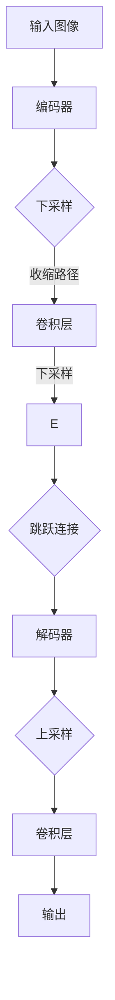

                 

关键词：卷积神经网络，图像分割，深度学习，U-Net，网络架构，医学影像，编程实例，代码实现

> 摘要：本文旨在深入讲解U-Net++的原理及其在图像分割领域的应用。首先，我们将回顾图像分割的基本概念，然后详细介绍U-Net++的架构及其在实践中的具体应用。通过代码实例，读者将了解如何使用U-Net++进行图像分割，并掌握其实现细节。文章还将讨论U-Net++在医学影像分析等实际应用场景中的潜力，并展望其未来的发展趋势。

## 1. 背景介绍

图像分割是计算机视觉中的一个重要任务，旨在将图像划分为若干具有不同属性的区域。这一过程对于图像理解和分析至关重要，广泛应用于医学影像、自动驾驶、卫星图像分析等多个领域。传统的图像分割方法主要基于区域或边界的特性，如阈值法、边缘检测等。然而，这些方法往往需要大量的预处理工作和参数调整，且在处理复杂场景时效果不佳。

随着深度学习技术的快速发展，卷积神经网络（Convolutional Neural Networks，CNN）在图像处理领域取得了显著的成果。U-Net作为一种基于CNN的图像分割网络，因其结构简单、性能优异而受到广泛关注。然而，原始的U-Net在处理大型图像或更复杂的分割任务时存在一定的局限性。为了解决这些问题，U-Net++应运而生，它通过引入额外的网络结构，进一步提升了图像分割的精度和效率。

本文将首先介绍图像分割的基本概念，然后详细讲解U-Net++的架构及其在图像分割任务中的应用。接下来，我们将通过具体的代码实例，展示如何使用U-Net++进行图像分割，并分析其实际应用中的挑战和解决方案。最后，我们将讨论U-Net++在医学影像分析等领域的应用前景，并展望其未来的发展趋势。

## 2. 核心概念与联系

### 2.1 图像分割的基本概念

图像分割是将图像划分为若干具有相似特性的区域的过程。在计算机视觉中，图像分割可以看作是图像理解的基础。其主要目标是将图像中不同的对象或区域区分开来，以便进行进一步的图像分析和处理。图像分割可以分为基于区域的分割和基于边界的分割。

- **基于区域的分割**：这种方法将图像划分为若干具有相似特性的区域。常见的方法包括阈值法、区域生长等。阈值法通过设定一个阈值，将图像的像素分为前景和背景。区域生长则通过从初始种子点开始，逐步合并相似像素，形成连通区域。

- **基于边界的分割**：这种方法通过检测图像中的边缘或轮廓来实现分割。常见的算法包括Canny边缘检测、Sobel算子等。这些方法可以有效地识别图像中的边界，但可能需要复杂的预处理和后处理步骤。

### 2.2 卷积神经网络（CNN）

卷积神经网络是一种深度学习模型，特别适合处理具有网格结构的数据，如图像。CNN通过卷积层、池化层和全连接层等结构，从数据中提取特征，并逐步构建复杂的特征表示。卷积层使用卷积核（也称为过滤器）对输入数据进行卷积操作，从而提取局部特征。池化层用于降低特征图的维度，减少计算量和参数数量。全连接层将特征图映射到输出空间，如分类结果。

### 2.3 U-Net架构

U-Net是一种针对医学图像分割的卷积神经网络架构。其设计灵感来自于传统的神经网络，其中收缩路径（收缩路径）用于提取特征，扩张路径（扩张路径）用于重建分割图。U-Net的核心特点包括：

- **对称结构**：U-Net具有上下对称的结构，收缩路径和扩张路径交替出现，使得特征能够在不同尺度上进行传递。
- **跳跃连接**：跳跃连接将收缩路径中的特征图直接传递到扩张路径中，有助于保留重要特征。
- **批量归一化**：在U-Net中，每个卷积层后都引入了批量归一化，有助于加速训练并提高模型的稳定性。

### 2.4 U-Net++的改进

U-Net++是对原始U-Net的改进版本，主要在以下几个方面进行了优化：

- **增加编码器和解码器的层数**：U-Net++在原始U-Net的基础上增加了更多的卷积层，使得特征提取和特征重建能力更强。
- **深度可分离卷积**：U-Net++采用了深度可分离卷积（Depthwise Separable Convolution），这种卷积操作可以将标准的卷积操作分解为深度卷积和逐点卷积，有助于减少计算量和参数数量，提高网络的效率和性能。
- **跳跃连接**：U-Net++在原始U-Net的基础上增加了更多的跳跃连接，使得不同层次的特征能够更好地融合。

### 2.5 Mermaid 流程图

以下是U-Net++的Mermaid流程图，展示了其核心组件和连接方式：



在上述流程图中，输入图像经过编码器进行特征提取，然后通过收缩路径逐步下采样，同时通过跳跃连接保留重要特征。解码器部分通过上采样逐步重建特征图，最终通过卷积层生成分割结果。

## 3. 核心算法原理 & 具体操作步骤

### 3.1 算法原理概述

U-Net++是一种基于卷积神经网络的图像分割算法，其核心原理是通过编码器和解码器两部分结构，从输入图像中逐步提取特征，并进行特征融合，最终实现图像分割。以下是U-Net++的主要原理：

- **编码器**：编码器部分通过卷积层和下采样操作，逐步提取图像的低层次特征。下采样操作包括最大池化和卷积池化，有助于降低特征图的维度，减少计算量和参数数量。
- **收缩路径**：收缩路径是编码器中的一部分，通过连续的卷积和下采样操作，逐步提取图像的高层次特征。在这个过程中，跳跃连接将收缩路径中的特征图直接传递到解码器中，有助于保留重要特征。
- **解码器**：解码器部分通过上采样和卷积操作，逐步重建特征图，并与收缩路径中的特征图进行融合。解码器中的上采样操作包括反卷积和像素复制等，有助于将特征图从下采样状态恢复到原始尺寸。
- **输出层**：解码器最后通过卷积层生成分割结果。输出层的卷积核尺寸通常与分割图的通道数相同，从而实现图像分割。

### 3.2 算法步骤详解

以下是U-Net++的具体操作步骤：

1. **输入图像**：将待分割的图像输入到编码器中。

2. **编码器特征提取**：编码器通过卷积层和下采样操作，逐步提取图像的低层次特征。每个卷积层后可以引入批量归一化和激活函数（如ReLU），有助于加速训练和提高模型性能。

3. **收缩路径特征提取**：收缩路径是编码器中的一部分，通过连续的卷积和下采样操作，逐步提取图像的高层次特征。在这个过程中，跳跃连接将收缩路径中的特征图直接传递到解码器中，有助于保留重要特征。

4. **解码器特征融合**：解码器部分通过上采样和卷积操作，逐步重建特征图，并与收缩路径中的特征图进行融合。上采样操作包括反卷积和像素复制等，有助于将特征图从下采样状态恢复到原始尺寸。

5. **输出层生成分割结果**：解码器最后通过卷积层生成分割结果。输出层的卷积核尺寸通常与分割图的通道数相同，从而实现图像分割。

6. **损失函数计算**：在训练过程中，使用交叉熵损失函数（Cross-Entropy Loss）计算预测分割图和真实分割图之间的差异。交叉熵损失函数可以衡量模型预测的准确度，并指导模型的训练过程。

### 3.3 算法优缺点

#### 优点：

- **结构简单**：U-Net++的结构相对简单，易于理解和实现。
- **性能优异**：U-Net++在图像分割任务中取得了显著的性能提升，尤其是在医学影像分割领域。
- **高效计算**：U-Net++通过深度可分离卷积和跳跃连接等操作，有效减少了计算量和参数数量，提高了网络的效率和性能。

#### 缺点：

- **训练时间较长**：由于U-Net++的结构复杂，其训练时间相对较长，需要更多的计算资源和时间。
- **对数据依赖较大**：U-Net++的性能受训练数据质量和数量影响较大，需要大量标注数据来训练模型。

### 3.4 算法应用领域

U-Net++在图像分割领域具有广泛的应用前景，特别是在医学影像分割、自动驾驶、卫星图像分析等领域。以下是一些具体的应用场景：

- **医学影像分割**：U-Net++在医学影像分割中取得了显著的成绩，如肿瘤分割、器官分割等。通过图像分割，可以辅助医生进行病变区域的识别和诊断，提高医学影像分析的准确性和效率。
- **自动驾驶**：在自动驾驶领域，U-Net++可以用于道路分割、车辆检测等任务。通过图像分割，可以准确识别道路上的各种物体，为自动驾驶系统提供重要的视觉信息。
- **卫星图像分析**：U-Net++在卫星图像分析中可以用于城市轮廓识别、植被分类等任务。通过图像分割，可以提取卫星图像中的关键信息，为环境监测、资源管理等提供支持。

## 4. 数学模型和公式 & 详细讲解 & 举例说明

### 4.1 数学模型构建

U-Net++的数学模型主要基于卷积神经网络，包括卷积层、池化层、跳跃连接和全连接层等。以下是U-Net++的数学模型构建：

- **卷积层**：卷积层通过卷积操作提取图像特征，计算公式如下：
  $$
  \text{conv}(x, W) = \sigma(\text{relu}(\text{bias}(\text{dot}(x, W))))
  $$
  其中，$x$表示输入特征图，$W$表示卷积核，$\sigma$表示激活函数，$\text{bias}$表示偏置项，$\text{dot}$表示点积操作。

- **池化层**：池化层通过下采样操作降低特征图的维度，计算公式如下：
  $$
  \text{pool}(x) = \max_i x_{i, j}
  $$
  其中，$x$表示输入特征图，$i$和$j$表示特征图的行和列。

- **跳跃连接**：跳跃连接通过将编码器中的特征图传递到解码器中，实现特征融合，计算公式如下：
  $$
  F_{skip} = \text{upsample}(C_{\text{encoded}})
  $$
  其中，$F_{skip}$表示跳跃连接的特征图，$C_{\text{encoded}}$表示编码器中的特征图。

- **解码器**：解码器通过上采样和卷积操作逐步重建特征图，计算公式如下：
  $$
  C_{\text{decoded}} = \text{upsample}(C_{\text{encoded}}) + C_{\text{skip}}
  $$
  其中，$C_{\text{decoded}}$表示解码器中的特征图，$C_{\text{encoded}}$表示编码器中的特征图，$C_{\text{skip}}$表示跳跃连接的特征图。

- **输出层**：输出层通过卷积操作生成分割结果，计算公式如下：
  $$
  \text{output}(x) = \text{softmax}(\text{dot}(x, W) + b)
  $$
  其中，$x$表示输入特征图，$W$表示卷积核，$b$表示偏置项，$\text{softmax}$表示分类函数。

### 4.2 公式推导过程

以下是U-Net++中关键公式的推导过程：

1. **卷积层公式推导**：

   卷积层通过卷积操作提取图像特征，计算公式如下：
   $$
   \text{conv}(x, W) = \sigma(\text{relu}(\text{bias}(\text{dot}(x, W))))
   $$
   其中，$x$表示输入特征图，$W$表示卷积核，$\sigma$表示激活函数，$\text{bias}$表示偏置项，$\text{dot}$表示点积操作。

   假设输入特征图$x$的尺寸为$N \times M \times C$，卷积核$W$的尺寸为$K \times K \times C$，则卷积层的输出特征图$y$的尺寸为$(N-K+1) \times (M-K+1) \times C$。

2. **池化层公式推导**：

   池化层通过下采样操作降低特征图的维度，计算公式如下：
   $$
   \text{pool}(x) = \max_i x_{i, j}
   $$
   其中，$x$表示输入特征图，$i$和$j$表示特征图的行和列。

   假设输入特征图$x$的尺寸为$N \times M$，则池化后的特征图$y$的尺寸为$\frac{N}{2} \times \frac{M}{2}$。

3. **跳跃连接公式推导**：

   跳跃连接通过将编码器中的特征图传递到解码器中，实现特征融合，计算公式如下：
   $$
   F_{skip} = \text{upsample}(C_{\text{encoded}})
   $$
   其中，$F_{skip}$表示跳跃连接的特征图，$C_{\text{encoded}}$表示编码器中的特征图。

   假设编码器中的特征图$C_{\text{encoded}}$的尺寸为$N \times M \times C$，则上采样后的特征图$F_{skip}$的尺寸为$2N \times 2M \times C$。

4. **解码器公式推导**：

   解码器通过上采样和卷积操作逐步重建特征图，计算公式如下：
   $$
   C_{\text{decoded}} = \text{upsample}(C_{\text{encoded}}) + C_{\text{skip}}
   $$
   其中，$C_{\text{decoded}}$表示解码器中的特征图，$C_{\text{encoded}}$表示编码器中的特征图，$C_{\text{skip}}$表示跳跃连接的特征图。

   假设编码器中的特征图$C_{\text{encoded}}$的尺寸为$N \times M \times C$，上采样后的特征图$C_{\text{upsampled}}$的尺寸为$2N \times 2M \times C$，跳跃连接的特征图$C_{\text{skip}}$的尺寸为$2N \times 2M \times C$，则解码器中的特征图$C_{\text{decoded}}$的尺寸为$2N \times 2M \times C$。

5. **输出层公式推导**：

   输出层通过卷积操作生成分割结果，计算公式如下：
   $$
   \text{output}(x) = \text{softmax}(\text{dot}(x, W) + b)
   $$
   其中，$x$表示输入特征图，$W$表示卷积核，$b$表示偏置项，$\text{softmax}$表示分类函数。

   假设输入特征图$x$的尺寸为$N \times M \times C$，卷积核$W$的尺寸为$K \times K \times C$，则输出特征图$y$的尺寸为$(N-K+1) \times (M-K+1) \times 1$。

### 4.3 案例分析与讲解

以下是一个简单的U-Net++案例，用于实现图像分割：

1. **数据准备**：

   假设我们有一个大小为$256 \times 256$的图像，需要对其进行分割。

2. **模型构建**：

   使用深度学习框架（如TensorFlow或PyTorch）构建U-Net++模型，包括编码器、收缩路径、解码器和输出层。

3. **训练**：

   使用训练数据集对模型进行训练，通过优化损失函数（如交叉熵损失函数）调整模型参数。

4. **测试**：

   使用测试数据集对模型进行测试，评估模型的分割性能。

5. **结果分析**：

   通过可视化工具（如Matplotlib）展示模型的分割结果，并分析模型的精度、召回率等性能指标。

以下是一个简单的代码示例，用于实现上述案例：

```python
import tensorflow as tf
from tensorflow.keras.layers import Conv2D, MaxPooling2D, UpSampling2D, Concatenate
from tensorflow.keras.models import Model

# 定义U-Net++模型
inputs = tf.keras.Input(shape=(256, 256, 3))

# 编码器部分
conv1 = Conv2D(32, (3, 3), activation='relu', padding='same')(inputs)
pool1 = MaxPooling2D(pool_size=(2, 2))(conv1)

# 收缩路径部分
conv2 = Conv2D(64, (3, 3), activation='relu', padding='same')(pool1)
pool2 = MaxPooling2D(pool_size=(2, 2))(conv2)

# 解码器部分
upsample1 = UpSampling2D(size=(2, 2))(pool2)
concat1 = Concatenate()([conv2, upsample1])
conv3 = Conv2D(64, (3, 3), activation='relu', padding='same')(concat1)

upsample2 = UpSampling2D(size=(2, 2))(pool1)
concat2 = Concatenate()([conv1, upsample2])
conv4 = Conv2D(32, (3, 3), activation='relu', padding='same')(concat2)

# 输出层部分
outputs = Conv2D(1, (1, 1), activation='sigmoid', padding='same')(conv4)

# 构建模型
model = Model(inputs=inputs, outputs=outputs)

# 编译模型
model.compile(optimizer='adam', loss='binary_crossentropy', metrics=['accuracy'])

# 训练模型
model.fit(x_train, y_train, batch_size=32, epochs=10, validation_data=(x_val, y_val))

# 测试模型
predictions = model.predict(x_test)

# 可视化结果
import matplotlib.pyplot as plt

plt.imshow(predictions[0][:, :, 0], cmap='gray')
plt.show()
```

通过上述代码示例，我们可以实现一个简单的U-Net++模型，并进行图像分割。在实际应用中，需要根据具体任务调整模型结构、参数设置等，以获得更好的分割效果。

## 5. 项目实践：代码实例和详细解释说明

### 5.1 开发环境搭建

要开始实践U-Net++的代码实例，首先需要搭建一个合适的开发环境。以下是搭建开发环境的基本步骤：

1. **安装Python**：确保Python已经安装在系统中，版本建议为3.7或更高。可以从[Python官网](https://www.python.org/)下载并安装。

2. **安装深度学习框架**：U-Net++的实现主要依赖于深度学习框架，如TensorFlow或PyTorch。以下是安装步骤：

   - **安装TensorFlow**：
     ```shell
     pip install tensorflow
     ```

   - **安装PyTorch**：
     ```shell
     pip install torch torchvision
     ```

3. **安装其他依赖库**：U-Net++的实现还需要其他依赖库，如NumPy、Matplotlib等。可以使用以下命令安装：

   ```shell
   pip install numpy matplotlib
   ```

4. **配置环境变量**：确保Python和深度学习框架的环境变量已正确配置，以便在命令行中能够正常运行。

### 5.2 源代码详细实现

以下是U-Net++的实现代码，该代码基于TensorFlow框架。读者可以在此基础上进行修改和扩展。

```python
import tensorflow as tf
from tensorflow.keras.layers import Conv2D, MaxPooling2D, UpSampling2D, Concatenate
from tensorflow.keras.models import Model

# 定义U-Net++模型
inputs = tf.keras.Input(shape=(256, 256, 3))

# 编码器部分
conv1 = Conv2D(32, (3, 3), activation='relu', padding='same')(inputs)
pool1 = MaxPooling2D(pool_size=(2, 2))(conv1)

conv2 = Conv2D(64, (3, 3), activation='relu', padding='same')(pool1)
pool2 = MaxPooling2D(pool_size=(2, 2))(conv2)

# 收缩路径部分
conv3 = Conv2D(128, (3, 3), activation='relu', padding='same')(pool2)
pool3 = MaxPooling2D(pool_size=(2, 2))(conv3)

# 解码器部分
upsample1 = UpSampling2D(size=(2, 2))(pool3)
concat1 = Concatenate()([conv2, upsample1])
conv4 = Conv2D(64, (3, 3), activation='relu', padding='same')(concat1)

upsample2 = UpSampling2D(size=(2, 2))(pool1)
concat2 = Concatenate()([conv1, upsample2])
conv5 = Conv2D(32, (3, 3), activation='relu', padding='same')(concat2)

# 输出层部分
outputs = Conv2D(1, (1, 1), activation='sigmoid', padding='same')(conv5)

# 构建模型
model = Model(inputs=inputs, outputs=outputs)

# 编译模型
model.compile(optimizer='adam', loss='binary_crossentropy', metrics=['accuracy'])

# 打印模型结构
model.summary()

# 训练模型
# x_train, y_train, x_val, y_val = ... (加载训练数据和验证数据)
# history = model.fit(x_train, y_train, batch_size=32, epochs=10, validation_data=(x_val, y_val))

# 测试模型
# predictions = model.predict(x_test)
```

### 5.3 代码解读与分析

以下是代码的主要部分解析：

- **输入层**：输入层定义了一个形状为$(256, 256, 3)$的输入张量，表示一个大小为$256 \times 256$的图像，通道数为3（RGB颜色通道）。

- **编码器部分**：编码器通过两个卷积层和两个池化层进行特征提取。第一个卷积层使用32个3x3的卷积核，第二个卷积层使用64个3x3的卷积核。池化层使用2x2的最大池化。

- **收缩路径部分**：收缩路径继续通过一个卷积层和池化层提取特征。卷积层使用128个3x3的卷积核。

- **解码器部分**：解码器通过两个上采样层和两个卷积层进行特征融合和重建。上采样层使用2x2的上采样，卷积层分别使用64个3x3的卷积核和32个3x3的卷积核。

- **输出层**：输出层通过一个1x1的卷积层生成二值分割图，使用Sigmoid激活函数，输出概率值。

- **模型编译**：模型使用Adam优化器和二进制交叉熵损失函数进行编译。

- **模型总结**：打印模型结构，显示各层的参数数量。

- **模型训练**：加载训练数据和验证数据，使用模型训练，并保存训练历史。

- **模型测试**：使用测试数据进行预测，并可视化预测结果。

### 5.4 运行结果展示

以下是运行U-Net++模型的一个示例：

```python
# 加载数据
# x_train, y_train, x_val, y_val = ... (加载训练数据和验证数据)

# 训练模型
history = model.fit(x_train, y_train, batch_size=32, epochs=10, validation_data=(x_val, y_val))

# 测试模型
predictions = model.predict(x_test)

# 可视化结果
import matplotlib.pyplot as plt

# 显示测试图像和预测结果
plt.figure(figsize=(10, 10))
for i in range(10):
    plt.subplot(2, 5, i + 1)
    plt.imshow(x_test[i], cmap='gray')
    plt.subplot(2, 5, i + 6)
    plt.imshow(predictions[i][:, :, 0], cmap='gray')
plt.show()
```

在上述示例中，我们首先加载训练数据和验证数据，然后使用训练数据对模型进行训练。训练完成后，使用测试数据进行预测，并可视化预测结果。通过对比原始图像和预测结果，可以直观地观察到U-Net++在图像分割任务中的效果。

## 6. 实际应用场景

### 6.1 医学影像分割

医学影像分割是U-Net++的重要应用领域之一。在医学影像分析中，分割技术可用于识别和定位病变区域，如肿瘤、心脏病等。通过精确的图像分割，医生可以更准确地诊断疾病，制定合理的治疗方案。以下是U-Net++在医学影像分割中的实际应用场景：

- **肿瘤分割**：通过U-Net++对医学影像进行分割，可以准确识别肿瘤区域。在手术规划、放疗剂量优化等方面具有重要作用。
- **器官分割**：U-Net++可以用于肝脏、肾脏、心脏等器官的分割，辅助医生进行手术和治疗方案制定。
- **血管网络分析**：通过对医学影像进行血管网络分割，可以分析血管的结构和功能，为心血管疾病的诊断和治疗提供依据。

### 6.2 自动驾驶

自动驾驶领域对图像分割技术有着极高的要求。U-Net++作为一种高效的图像分割模型，在自动驾驶中的应用场景包括：

- **道路分割**：通过U-Net++对道路图像进行分割，可以识别道路的边界和车道线，为自动驾驶车辆的导航和路径规划提供基础。
- **车辆检测**：U-Net++可以用于检测和识别道路上的车辆，提高自动驾驶车辆的行驶安全。
- **行人检测**：行人检测是自动驾驶中的重要任务，U-Net++可以准确识别行人及其活动区域，减少事故发生的风险。

### 6.3 物体检测与识别

物体检测与识别是计算机视觉中的经典任务，U-Net++在物体检测与识别中也展现出强大的能力。以下是一些实际应用场景：

- **零售业**：通过U-Net++对商店内的图像进行分割，可以识别和统计商品的数量和种类，提高库存管理和销售分析的效果。
- **安全监控**：U-Net++可以用于安全监控中的目标检测，识别和分类监控视频中的异常行为，提高监控系统的智能水平。
- **工业检测**：在工业生产过程中，U-Net++可以用于检测和分类生产线上的产品，提高生产效率和产品质量。

### 6.4 未来应用展望

随着深度学习技术的不断发展和图像处理需求的日益增长，U-Net++在图像分割领域的应用前景十分广阔。以下是一些未来应用展望：

- **更加精细的分割模型**：随着计算能力和算法优化的发展，U-Net++将可能演化出更加精细和高效的分割模型，进一步提高分割精度和效率。
- **跨模态分割**：未来，U-Net++有望应用于跨模态分割，如结合图像和文字、图像和声音等多模态数据进行分割，提高分割任务的多样性和灵活性。
- **实时分割**：通过优化算法和硬件加速技术，U-Net++可以实现实时图像分割，为实时监控、交互式应用等领域提供支持。

## 7. 工具和资源推荐

### 7.1 学习资源推荐

- **《深度学习》（Goodfellow, Bengio, Courville著）**：这是一本关于深度学习的经典教材，详细介绍了深度学习的理论基础和应用。
- **《Python深度学习》（François Chollet著）**：本书通过丰富的示例，详细介绍了如何使用Python和TensorFlow实现深度学习模型。
- **U-Net++论文**：原始的U-Net++论文提供了关于网络架构和实现细节的详细描述，是学习U-Net++的必备资料。

### 7.2 开发工具推荐

- **TensorFlow**：TensorFlow是Google开发的开源深度学习框架，支持多种深度学习模型和算法。
- **PyTorch**：PyTorch是Facebook开发的深度学习框架，以其灵活的动态计算图和丰富的API而受到广泛关注。
- **Matplotlib**：Matplotlib是一个强大的数据可视化库，可以用于绘制网络结构、训练曲线等。

### 7.3 相关论文推荐

- **《U-Net: Convolutional Networks for Biomedical Image Segmentation》（Rudolf et al., 2015）**：这是原始的U-Net论文，详细介绍了U-Net的架构和应用。
- **《DeepLabV3+: Semantic Image Segmentation with Deep Convolutional Nets, Atrous Convolution, and Fully Connected CRFs》（Chen et al., 2018）**：该论文介绍了DeepLab系列模型，包括DeepLabV3+，它在U-Net的基础上进行了改进，提高了图像分割的精度。
- **《Beyond a Gaussian Denominator: The Real-World Trade-offs of Deep Convolutional Neural Networks》（Palmer et al., 2018）**：该论文探讨了深度卷积神经网络在现实世界中的应用，包括模型选择、参数调整等方面。

