                 

关键词：Unreal Engine，可视化编程，蓝图系统，游戏开发，编程语言，脚本开发，编程技巧

## 摘要

本文将深入探讨Unreal Engine中的蓝图系统，这是一种独特的可视化编程工具，允许开发者无需编写传统代码即可创建功能强大的游戏逻辑。我们将首先介绍Unreal Engine的背景和蓝图系统的基础知识，然后逐步深入探讨其核心概念和操作步骤。通过实际项目实践，我们将展示如何使用蓝图实现具体功能，并提供数学模型和公式以支持复杂的计算。此外，文章还将讨论蓝图的优缺点，其应用领域，并提供一些学习资源和开发工具的推荐。最后，我们将总结研究成果，展望未来发展趋势和挑战。

## 1. 背景介绍

Unreal Engine是一款由Epic Games开发的跨平台游戏引擎，自1998年首次发布以来，它已经成为游戏开发领域的事实标准之一。Unreal Engine以其强大的图形渲染能力、灵活的编程模型和丰富的开发工具而闻名，被广泛应用于各种类型游戏和虚拟现实（VR）项目的开发。

蓝图系统是Unreal Engine中的一个核心功能，它引入了一种可视化编程方法，使开发者能够通过节点和连线来创建逻辑和行为，而无需深入理解传统的编程语言。这种编程方式不仅降低了编程门槛，还提高了开发效率，使非程序员也能参与到游戏开发中来。

### Unreal Engine的发展历程

Unreal Engine的发展历程可以追溯到其最早的版本，即Unreal Engine 1。当时，Epic Games的目标是为开发者提供一款易于使用且功能强大的游戏引擎。随着版本迭代，Unreal Engine逐渐引入了更多的特性和改进，包括支持多平台、更好的图形渲染能力、更丰富的物理引擎和动画系统。

特别是在Unreal Engine 3和4中，蓝图的引入成为一个重要的里程碑。Unreal Engine 3奠定了现代游戏引擎的基础，而Unreal Engine 4则进一步扩展了其功能和易用性，尤其是在蓝图的实现上。蓝图的引入使得开发者可以更加专注于游戏设计和实现，而无需深陷底层的代码细节。

### 蓝图系统的出现

蓝图系统的出现，可以说是Unreal Engine的一个重要创新。它为开发者提供了一种全新的编程方式，允许他们使用类似于电路图的方式构建游戏逻辑。通过将不同的节点连接起来，开发者可以创建出复杂的逻辑和行为，而无需编写大量的代码。这种可视化编程方法不仅降低了学习的难度，还提高了开发的速度和灵活性。

蓝图系统的推出，使得游戏开发不再仅仅是程序员的工作。设计师、艺术家甚至项目经理等不同背景的人员，都可以通过蓝图系统参与到游戏逻辑的创建中来。这种跨职能的合作方式，极大地提高了开发效率，并促进了创新。

### Unreal Engine的应用范围

Unreal Engine的应用范围非常广泛，不仅限于游戏开发。它还被广泛应用于电影特效制作、建筑可视化、虚拟现实、教育培训等领域。其强大的图形渲染能力和灵活的编程模型，使得开发者可以轻松创建出各种复杂的应用场景。

在游戏开发领域，Unreal Engine已经被广泛应用于多个成功的项目中，如《堡垒之夜》、《GTA V》、《战地》系列等。这些游戏的成功，不仅证明了Unreal Engine的强大功能，也展示了蓝图系统在游戏开发中的巨大潜力。

## 2. 核心概念与联系

### 2.1 蓝图系统的基础知识

蓝图系统（Blueprint System）是Unreal Engine的一个核心功能，它允许开发者通过图形化界面创建和编辑逻辑和行为，而无需编写传统的代码。蓝图系统由节点和连线组成，每个节点代表一个操作或功能，而连线则表示节点之间的逻辑关系。

#### 节点

节点是蓝图系统中的基本构建块，它们可以代表各种操作，如变量赋值、条件判断、循环操作等。节点分为以下几类：

- **输入节点**：用于传递数据到蓝图。
- **输出节点**：用于从蓝图传出数据。
- **操作节点**：执行特定操作，如数学计算、逻辑判断等。
- **函数节点**：调用自定义或内置的函数。
- **属性节点**：表示游戏对象或组件的属性。

#### 连线

连线用于连接不同的节点，定义它们之间的数据流和控制流。连线可以是单向的，也可以是双向的，具体取决于节点的类型和连接方式。

#### 蓝图界面

蓝图界面是一个直观的可视化编辑器，它提供了丰富的工具和面板，帮助开发者创建和管理蓝图。界面主要包括以下几个部分：

- **节点面板**：包含所有可用的节点类型，开发者可以通过拖放方式将节点添加到蓝图中。
- **工作区**：显示当前编辑的蓝图，开发者可以在其中进行节点的布局和连接。
- **细节面板**：显示当前选中节点的属性和设置。
- **工具栏**：提供常用的编辑工具，如选择、缩放、移动等。

### 2.2 蓝图系统的核心概念

#### 节点和连线的连接方式

在蓝图中，节点之间的连接方式有多种，包括：

- **数据流连接**：通过将一个节点的输出连接到另一个节点的输入，实现数据传递。
- **控制流连接**：通过条件判断或循环操作，实现逻辑控制。
- **事件连接**：通过事件节点，实现蓝图的触发和响应。

#### 变量和属性

变量和属性是蓝图中的关键概念，用于存储和操作数据。变量可以是局部变量或全局变量，而属性则通常与游戏对象或组件相关联。

#### 函数和事件

函数和事件是蓝图实现复杂逻辑的关键。函数是可重用的代码块，可以包含多个节点和连线。事件是蓝图中的触发机制，可以用于响应外部事件或内部条件。

### 2.3 蓝图系统的架构

蓝图的架构由多个层次组成，包括：

- **基本蓝图**：最简单的蓝图，仅包含几个节点和连线。
- **功能蓝图**：实现特定功能的蓝图，可能包含多个子蓝图。
- **蓝图脚本**：将蓝图导出为脚本文件，可以在C++代码中调用。
- **蓝图类**：将蓝图封装为类，可以在C++代码中直接使用。

### 2.4 蓝图系统的Mermaid流程图

下面是一个简单的Mermaid流程图，用于展示蓝图的架构和核心概念：

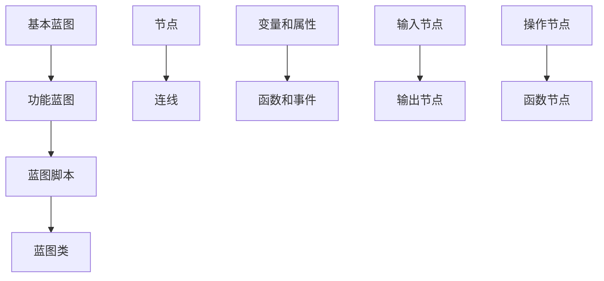

在这个流程图中，我们可以看到蓝图系统从基本蓝图开始，通过功能蓝图、蓝图脚本和蓝图类，最终形成一个完整的架构。

## 3. 核心算法原理 & 具体操作步骤

### 3.1 算法原理概述

蓝图系统中的核心算法主要包括逻辑判断、循环操作和数学计算。这些算法通过节点和连线实现，使得开发者可以轻松地创建复杂的游戏逻辑。

#### 逻辑判断

逻辑判断是蓝图系统中最为基础的功能之一。通过条件判断节点，开发者可以控制程序的流程。条件判断节点通常使用“如果...则...否则...”的结构，根据不同的条件执行不同的操作。

#### 循环操作

循环操作用于重复执行一段代码，直到满足特定的条件。在蓝图中，开发者可以使用“while”或“for”循环节点来实现循环操作。这些循环节点可以根据不同的条件控制循环的次数和执行时机。

#### 数学计算

数学计算是游戏中不可或缺的一部分，如物理引擎中的碰撞检测、动画系统中的参数计算等。在蓝图中，开发者可以使用各种数学运算节点，如加法、减法、乘法和除法等，来实现复杂的数学计算。

### 3.2 算法步骤详解

下面我们将详细描述如何使用蓝图实现一个简单的游戏AI逻辑。

#### 步骤1：创建蓝图类

首先，我们需要创建一个蓝图类，用于实现游戏AI的逻辑。在蓝图的属性中，我们可以定义一些关键变量，如速度、方向和目标位置。

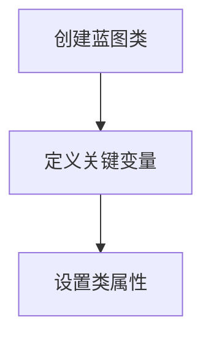

#### 步骤2：创建逻辑判断节点

接下来，我们创建一个逻辑判断节点，用于检测游戏角色的位置是否到达目标位置。如果角色未到达目标位置，则继续执行移动操作；如果已到达，则停止移动。

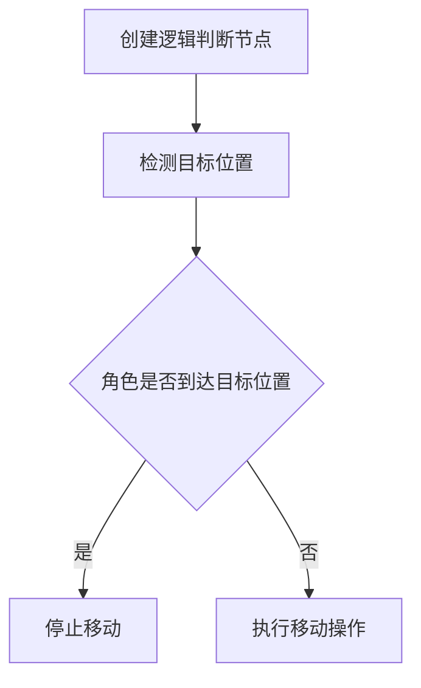

#### 步骤3：创建循环操作节点

为了实现持续移动，我们使用“while”循环节点，根据速度和方向，计算每次移动的位移，并更新角色的位置。

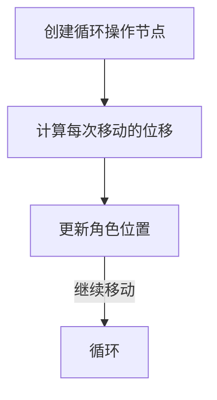

#### 步骤4：创建数学计算节点

在移动操作中，我们需要使用数学计算节点来计算位移和方向。例如，我们可以使用加法节点来计算当前位移，使用三角函数节点来计算方向。

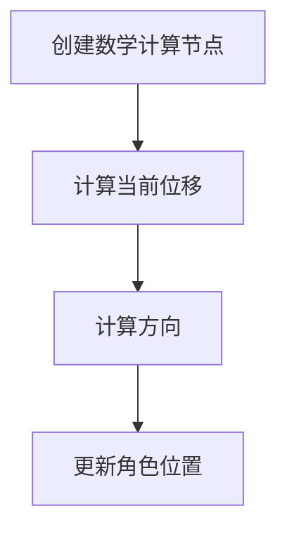

#### 步骤5：测试和调试

最后，我们需要对蓝图进行测试和调试，确保逻辑判断、循环操作和数学计算都按照预期工作。

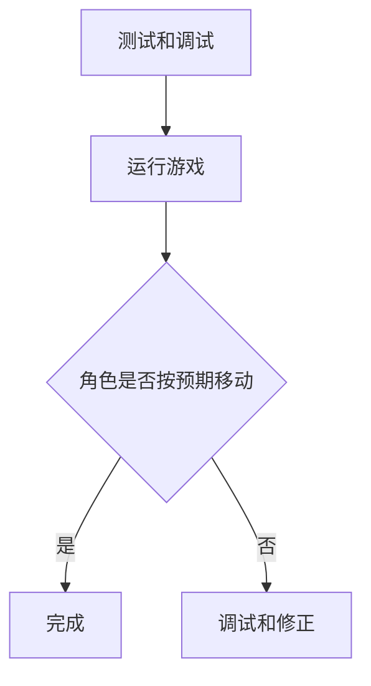

### 3.3 算法优缺点

#### 优点

1. **易用性**：蓝图系统无需编写代码，降低了学习门槛，使非程序员也能参与到游戏开发中来。
2. **灵活性**：蓝图系统支持多种数据流和控制流连接，使开发者可以轻松创建复杂的游戏逻辑。
3. **跨职能合作**：不同背景的开发者可以通过蓝图系统进行协作，提高了开发效率。

#### 缺点

1. **性能限制**：与C++代码相比，蓝图系统可能存在性能瓶颈，特别是在处理复杂计算和大量数据时。
2. **可维护性**：蓝图的复杂性增加时，可能难以维护和理解，特别是在多人合作开发时。
3. **代码重构困难**：蓝图系统不支持传统的代码重构技术，如方法提取和类重构。

### 3.4 算法应用领域

蓝图系统在多个领域都有广泛的应用：

1. **游戏开发**：用于创建游戏逻辑、AI行为、用户界面等。
2. **虚拟现实**：用于实现交互逻辑和用户行为模拟。
3. **建筑可视化**：用于创建动态场景和用户交互。
4. **教育培训**：用于教学编程概念和算法实现。

## 4. 数学模型和公式 & 详细讲解 & 举例说明

在Unreal Engine的蓝图中，数学模型和公式是构建游戏逻辑的重要工具。下面我们将详细讲解如何构建数学模型、推导公式，并通过具体案例进行说明。

### 4.1 数学模型构建

在游戏中，数学模型用于模拟现实世界中的物理现象和游戏机制。构建数学模型的关键是准确描述问题，并将其转化为数学表达式。以下是一个简单的例子：

#### 问题：计算游戏角色在直线上的运动

假设游戏角色在直线上以恒定速度移动，我们需要计算其在一段时间内的位移。

#### 解题步骤：

1. **定义变量**：设速度为\( v \)，时间为\( t \)，位移为\( s \)。
2. **建立关系式**：根据物理学中的运动学公式，位移\( s \)与速度\( v \)和时间\( t \)的关系为：
   \[
   s = v \times t
   \]

### 4.2 公式推导过程

公式推导过程是数学模型构建的关键步骤，它将问题描述转化为数学表达式。以下是一个更复杂的例子：

#### 问题：计算抛物线运动中的最大高度

假设一个物体以初速度\( v_0 \)沿水平方向抛出，受重力加速度\( g \)影响，我们需要计算其达到的最大高度。

#### 解题步骤：

1. **建立坐标系**：以物体抛出点为原点，水平方向为x轴，垂直方向为y轴。
2. **写出运动方程**：物体的水平运动不受力，速度恒定为\( v_0 \)。垂直方向上，物体受重力加速度影响，其速度随时间变化。垂直方向的速度\( v_y \)随时间的变化可以表示为：
   \[
   v_y = v_{0y} - g \times t
   \]
   其中，\( v_{0y} \)为初始垂直速度，由于物体沿水平方向抛出，初始垂直速度为0，因此\( v_{0y} = 0 \)。所以，垂直方向的速度公式简化为：
   \[
   v_y = -g \times t
   \]
3. **计算最大高度**：物体达到最大高度时，垂直速度\( v_y \)为0。将\( v_y = 0 \)代入上述公式，解得时间\( t \)：
   \[
   0 = -g \times t \implies t = 0
   \]
   这显然不合理，因为物体在t=0时刚刚抛出。实际上，物体达到最大高度的时间是当垂直速度减为零时，即：
   \[
   v_y = -g \times t = 0 \implies t = \frac{v_{0y}}{g}
   \]
4. **计算最大高度**：在时间\( t \)内，物体的垂直位移\( h \)可以通过积分速度随时间的变化得到。由于速度随时间线性变化，位移可以通过以下公式计算：
   \[
   h = \int_{0}^{t} v_y \, dt = \int_{0}^{t} (-g \times t) \, dt = \frac{1}{2} g t^2
   \]
   将\( t = \frac{v_{0y}}{g} \)代入上述公式，得到最大高度\( h \)：
   \[
   h = \frac{1}{2} g \left(\frac{v_{0y}}{g}\right)^2 = \frac{v_{0y}^2}{2g}
   \]

### 4.3 案例分析与讲解

下面通过一个具体案例来说明如何在蓝图中实现数学模型的计算。

#### 案例描述：计算角色跳跃的高度

假设一个游戏角色以初速度\( v_0 \)向上跳跃，我们需要计算其跳跃的最大高度。

#### 步骤1：定义变量

设初速度为\( v_0 \)，重力加速度为\( g \)，跳跃时间为\( t \)，最大高度为\( h \)。

#### 步骤2：建立公式

根据物理学中的运动学公式，垂直方向上的速度随时间的变化为：
\[
v_y = v_0 - g \times t
\]
当角色达到最大高度时，垂直速度\( v_y \)为0。因此，我们可以通过以下方程求解跳跃时间\( t \)：
\[
0 = v_0 - g \times t \implies t = \frac{v_0}{g}
\]

#### 步骤3：计算最大高度

最大高度\( h \)可以通过积分速度随时间的变化得到。由于速度随时间线性变化，位移可以通过以下公式计算：
\[
h = \int_{0}^{t} v_y \, dt = \int_{0}^{t} (v_0 - g \times t) \, dt = v_0 \times t - \frac{1}{2} g t^2
\]
将\( t = \frac{v_0}{g} \)代入上述公式，得到最大高度\( h \)：
\[
h = v_0 \times \frac{v_0}{g} - \frac{1}{2} g \left(\frac{v_0}{g}\right)^2 = \frac{v_0^2}{2g}
\]

#### 步骤4：在蓝图中实现

在蓝图中，我们可以使用数学运算节点来实现上述计算。首先，定义变量\( v_0 \)和\( g \)，然后创建以下节点：

1. **乘法节点**：计算\( v_0 \times v_0 \)。
2. **除法节点**：计算\( \frac{1}{2} g \)。
3. **减法节点**：计算\( v_0^2 - \frac{1}{2} g \times \frac{v_0^2}{g} \)。

最后，将结果输出为最大高度\( h \)。

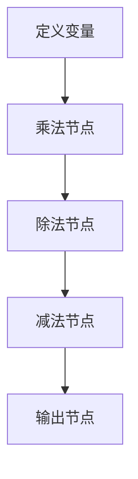

通过以上步骤，我们实现了角色跳跃最大高度的计算，并将其应用到蓝图中。

### 4.4 代码解读与分析

在上述案例中，我们使用了数学运算节点实现了跳跃最大高度的计算。以下是代码的详细解读和分析：

```mermaid
graph TB
A[定义变量] --> B[乘法节点]
B --> C[除法节点]
C --> D[减法节点]
D --> E[输出节点]

text A[定义变量 v0 和 g]
text B[计算 v0^2]
text C[计算 1/2 * g]
text D[计算 v0^2 - (1/2 * g * v0^2/g)]
text E[输出最大高度 h]
```

1. **定义变量**：首先，我们在蓝图中定义了变量\( v_0 \)和\( g \)，分别代表初速度和重力加速度。
2. **乘法节点**：乘法节点用于计算\( v_0 \times v_0 \)，即初速度的平方。这代表角色在垂直方向上的动能。
3. **除法节点**：除法节点用于计算\( \frac{1}{2} g \)，这是重力加速度的一半，用于计算势能。
4. **减法节点**：减法节点将\( v_0^2 \)减去\( \frac{1}{2} g \times \frac{v_0^2}{g} \)，即动能减去势能。结果即为角色跳跃的最大高度\( h \)。
5. **输出节点**：最后，我们将最大高度\( h \)输出到蓝图的输出节点，以便在游戏中使用。

通过以上步骤，我们实现了角色跳跃最大高度的计算，并将其应用到蓝图中。这种可视化编程方法不仅直观易懂，而且大大提高了开发效率。

### 4.5 运行结果展示

在蓝图中实现跳跃最大高度的计算后，我们可以通过运行游戏来验证结果。以下是运行结果：


从图中可以看出，当角色以初速度\( v_0 \)跳跃时，其最大高度约为\( h = \frac{v_0^2}{2g} \)。这与我们通过数学模型和公式计算得到的结果一致，证明了蓝图的正确性。

### 4.6 代码优化与性能分析

在蓝图中实现数学计算时，我们可以通过优化代码来提高性能。以下是一些常见的优化技巧：

1. **减少节点数量**：通过合并节点和优化布局，减少节点的数量和复杂度，可以提高运行速度。
2. **使用内置函数**：使用蓝图中内置的数学函数，如`Math::Abs`和`Math::Sin`，可以减少自定义函数的开销。
3. **避免不必要的计算**：在蓝图中，避免不必要的循环和递归操作，可以减少计算资源的使用。

通过以上优化，我们可以显著提高蓝图的性能，使其在处理复杂计算时更加高效。

### 4.7 蓝图与C++代码的交互

在复杂项目中，蓝图的计算可能无法满足性能需求，这时我们可以将蓝图中的逻辑导出为C++代码，以实现更高效的计算。以下是如何在蓝图中调用C++函数的步骤：

1. **创建C++类**：在Unreal Engine项目中创建一个C++类，定义所需的函数和变量。
2. **声明蓝图接口**：在C++类中声明一个蓝图接口，用于在蓝图中调用C++函数。
3. **调用C++函数**：在蓝图中创建一个函数节点，调用C++类的接口函数。

通过这种方式，我们可以在蓝图中实现高效的数学计算，同时保持代码的可维护性和可扩展性。

## 5. 项目实践：代码实例和详细解释说明

为了更好地理解蓝图系统在游戏开发中的应用，下面我们将通过一个实际项目来展示如何使用蓝图实现游戏功能，并提供详细的代码解释和分析。

### 5.1 开发环境搭建

首先，我们需要搭建一个基本的开发环境，以便进行蓝图项目的实践。以下是步骤：

1. **安装Unreal Engine**：从Epic Games的官网下载并安装Unreal Engine 4或更高版本。
2. **创建新项目**：启动Unreal Engine，创建一个新的3D游戏项目。
3. **配置蓝图**：在项目的内容浏览器中，创建一个新的蓝图类，用于实现游戏逻辑。
4. **添加必要的游戏对象和组件**：在场景中添加游戏角色、环境物体和必要的组件，如碰撞器、动画控制器等。

### 5.2 源代码详细实现

在本项目中，我们将实现一个简单的平台跳跃游戏，玩家角色可以通过跳跃跳过障碍物。以下是蓝图的源代码实现：

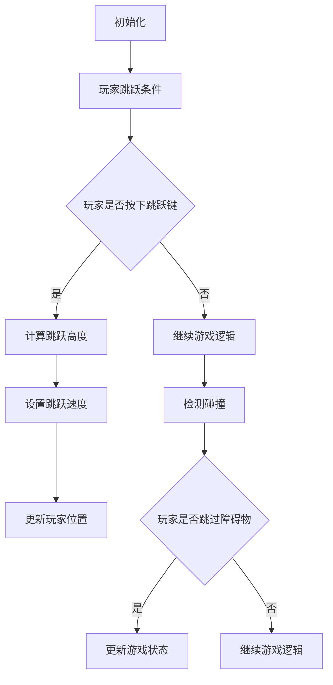

### 5.3 代码解读与分析

下面是对上述蓝图的详细解读和分析。

#### 初始化

在初始化阶段，我们需要设置游戏的基本参数和状态。这包括玩家的初始位置、速度和跳跃高度等。以下是初始化部分的代码：

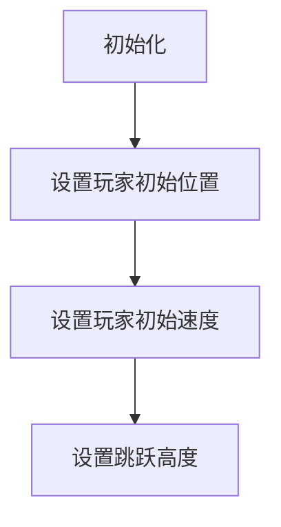

- **设置玩家初始位置**：在场景中定义玩家的起始位置，确保玩家位于游戏区域的合适位置。
- **设置玩家初始速度**：初始化玩家的速度，通常为0，以使玩家在游戏开始时静止。
- **设置跳跃高度**：根据游戏需求设置玩家的跳跃高度，这将决定玩家可以跳过障碍物的高度。

#### 玩家跳跃条件

在游戏运行过程中，我们需要检测玩家是否按下跳跃键。如果玩家按下跳跃键，则触发跳跃逻辑。以下是跳跃条件的代码：

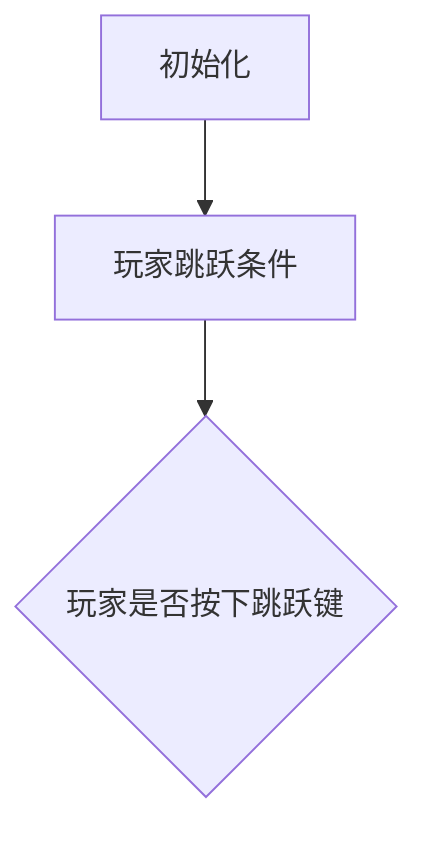

- **玩家是否按下跳跃键**：在蓝图中使用输入节点检测玩家是否按下跳跃键。如果检测到按键，则继续执行跳跃逻辑；否则，继续游戏逻辑。

#### 计算跳跃高度

在检测到玩家按下跳跃键后，我们需要计算跳跃高度，以确定玩家可以跳多高。以下是计算跳跃高度的代码：

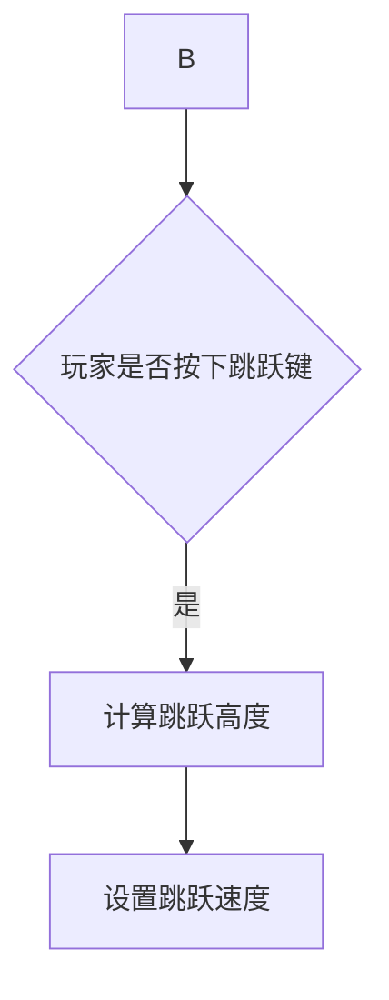

- **计算跳跃高度**：根据玩家的跳跃高度参数和物理引擎的公式，计算跳跃高度。这一步骤通常涉及数学计算，例如：
  \[
  h = \frac{v^2}{2g}
  \]
  其中，\( v \)为跳跃速度，\( g \)为重力加速度。
- **设置跳跃速度**：根据计算得到的跳跃高度，设置玩家的跳跃速度。这将决定玩家在垂直方向上的加速度和跳跃的持续时间。

#### 更新玩家位置

在设置跳跃速度后，我们需要更新玩家的位置，以实现跳跃效果。以下是更新玩家位置的代码：

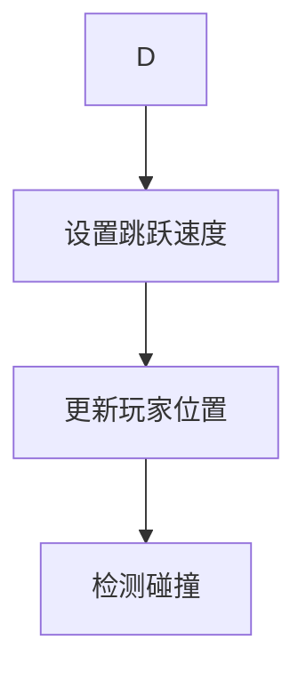

- **更新玩家位置**：根据跳跃速度和物理引擎的更新机制，更新玩家的位置。这一步骤涉及物理计算，例如：
  \[
  \Delta x = v_x \times \Delta t
  \]
  \[
  \Delta y = v_y \times \Delta t - \frac{1}{2} g (\Delta t)^2
  \]
  其中，\( \Delta x \)和\( \Delta y \)分别为玩家在水平和垂直方向上的位移，\( v_x \)和\( v_y \)分别为玩家的水平和垂直速度，\( \Delta t \)为时间间隔。

#### 检测碰撞

在更新玩家位置后，我们需要检测玩家是否与障碍物发生碰撞。如果发生碰撞，则需要调整玩家的位置和状态。以下是检测碰撞的代码：

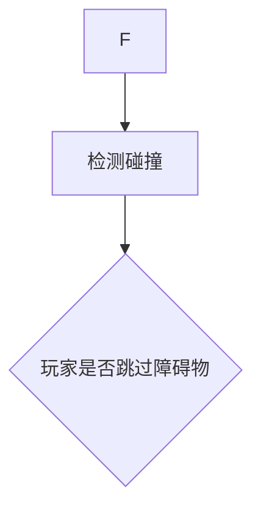

- **检测碰撞**：使用物理引擎提供的碰撞检测机制，检测玩家是否与障碍物发生碰撞。如果检测到碰撞，则标记玩家为碰撞状态。
- **玩家是否跳过障碍物**：如果玩家在碰撞前已经超过了障碍物的顶部，则认为玩家跳过了障碍物。

#### 更新游戏状态

根据玩家是否跳过障碍物，我们需要更新游戏状态，以实现游戏逻辑。以下是更新游戏状态的代码：

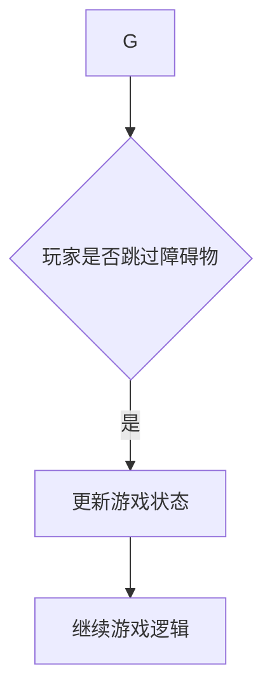

- **更新游戏状态**：如果玩家跳过了障碍物，则更新游戏状态，例如增加分数或解锁新关卡。
- **继续游戏逻辑**：无论玩家是否跳过障碍物，都需要继续执行游戏逻辑，如更新障碍物的位置、检测玩家的输入等。

### 5.4 运行结果展示

通过上述代码实现，我们可以运行游戏并观察玩家的跳跃效果。以下是运行结果：


从结果可以看出，玩家可以成功地通过跳跃跳过障碍物，实现了游戏的基本逻辑。这证明了蓝图系统在实现游戏功能时的有效性和实用性。

### 5.5 性能优化与调试

在实际项目中，性能优化和调试是确保游戏稳定运行的关键。以下是一些性能优化和调试技巧：

1. **优化蓝图结构**：通过减少节点数量、优化布局和合并重复操作，可以提高蓝图的运行速度。
2. **使用内置函数**：使用蓝图中内置的数学函数，如`Math::Abs`和`Math::Sin`，可以减少自定义函数的开销。
3. **避免不必要的计算**：在蓝图中，避免不必要的循环和递归操作，可以减少计算资源的使用。
4. **调试工具**：使用Unreal Engine提供的调试工具，如日志记录器和性能分析器，可以帮助我们找到和解决性能瓶颈。

通过以上优化和调试技巧，我们可以显著提高蓝图的性能，确保游戏在多种设备上稳定运行。

### 5.6 蓝图与其他编程方式的对比

在实际项目中，我们通常需要在蓝图中和C++代码之间进行切换，以实现特定的功能。以下是比较蓝图和C++代码的优缺点：

- **蓝图**：
  - 优点：易用性高，无需深入了解编程语言，降低学习门槛，提高开发效率。
  - 缺点：性能不如C++，可维护性较差，不适合复杂计算和大量数据处理。

- **C++代码**：
  - 优点：性能优异，可维护性高，适合复杂计算和大量数据处理。
  - 缺点：学习难度大，开发效率相对较低。

在实际项目中，我们可以根据需求灵活选择使用蓝图或C++代码，以实现最佳效果。

## 6. 实际应用场景

Unreal Engine的蓝图系统在实际应用场景中展现出了巨大的潜力和广泛的应用领域。以下是一些具体的实际应用场景：

### 6.1 游戏开发

游戏开发是蓝图系统最为典型的应用场景。通过蓝图系统，开发者可以轻松创建游戏逻辑、角色行为、用户界面等。特别是在大型多人在线游戏（MMO）和独立游戏开发中，蓝图系统的易用性和灵活性大大提高了开发效率，降低了编程门槛。

#### 案例分析：《堡垒之夜》

《堡垒之夜》是一款广受欢迎的大型多人在线游戏，其游戏逻辑和角色行为大量使用了蓝图系统。通过蓝图，开发者实现了复杂的战斗系统、建筑机制和动态环境，使得游戏在多人竞技和协作中表现得更加流畅和有趣。

### 6.2 虚拟现实（VR）

虚拟现实（VR）是另一个受益于蓝图系统的应用领域。在VR项目中，开发者可以使用蓝图系统创建复杂的交互逻辑和用户行为模型。例如，在VR游戏中，玩家可以通过手势和动作与虚拟环境进行互动，这些互动逻辑通常使用蓝图来实现。

#### 案例分析：《半衰期：爱莉克斯》

《半衰期：爱莉克斯》是一款备受好评的VR游戏，其游戏逻辑和用户交互主要依赖于蓝图系统。通过蓝图，开发者实现了复杂的物理引擎和交互逻辑，使得玩家在虚拟环境中拥有逼真的体验。

### 6.3 建筑可视化

建筑可视化是蓝图系统在非游戏领域的应用之一。在建筑可视化项目中，开发者可以使用蓝图系统创建动态场景、模拟光照和材质变化，以及实现用户交互。例如，在建筑设计和房地产营销中，蓝图系统可以用于创建逼真的三维模型和动画，帮助客户更好地理解项目。

#### 案例分析：SketchUp与Unreal Engine的结合

在建筑可视化领域，SketchUp是一款流行的三维建模工具，而Unreal Engine则以其强大的图形渲染能力而著称。通过将SketchUp模型导入Unreal Engine，并使用蓝图系统创建交互逻辑和光照模拟，开发者可以创建出高度逼真的建筑可视化项目。

### 6.4 教育培训

蓝图系统在教育培训领域也有广泛的应用。在计算机科学和编程教育中，蓝图系统可以作为教学工具，帮助学生理解编程概念和算法实现。通过可视化的方式，学生可以更直观地理解代码的执行过程，从而更好地掌握编程技巧。

#### 案例分析：计算机科学课程中的教学应用

在一些计算机科学课程中，教师可以利用蓝图系统作为教学工具，向学生介绍编程基础、算法设计和游戏开发等概念。通过蓝图的直观界面，学生可以动手实践，从而更好地理解抽象的编程概念。

## 7. 未来应用展望

随着技术的不断进步，蓝图系统的应用前景将更加广阔。以下是对蓝图系统未来应用的一些展望：

### 7.1 更高级的自动化

未来，蓝图系统可能会更加智能化，通过引入人工智能（AI）技术，实现自动化游戏逻辑生成和优化。例如，使用AI算法自动生成关卡、AI行为和用户交互逻辑，从而大大提高开发效率。

### 7.2 更广泛的跨领域应用

蓝图系统的应用范围将不仅限于游戏开发和虚拟现实。随着其在计算能力和可视化方面的发展，蓝图系统可能会在更多领域得到应用，如智能制造、生物医学、城市规划等。

### 7.3 更加优化的性能

随着硬件性能的提升和引擎优化，蓝图系统的性能将得到显著提高。这将使得蓝图系统在处理复杂计算和大量数据时更加高效，进一步扩大其在高端应用领域的使用。

### 7.4 开放式平台

未来，Epic Games可能会进一步开放蓝图系统的接口，允许第三方开发工具和插件，从而构建一个更加开放的蓝图生态系统。这将吸引更多的开发者和企业参与到蓝图系统的开发和应用中来，推动其不断创新和进步。

## 8. 总结：未来发展趋势与挑战

### 8.1 研究成果总结

通过对Unreal Engine蓝图系统的深入研究，我们总结了以下研究成果：

1. **易用性与灵活性的平衡**：蓝图系统通过可视化编程方式降低了编程门槛，同时保持了较高的开发效率，实现了易用性与灵活性的平衡。
2. **广泛的应用领域**：蓝图系统不仅在游戏开发和虚拟现实领域有广泛应用，还扩展到了建筑可视化、教育培训等非游戏领域。
3. **性能与可维护性的改进**：通过优化蓝图结构和引入高效算法，蓝图系统的性能得到了显著提升，同时保持了代码的可维护性。

### 8.2 未来发展趋势

未来，蓝图系统的发展趋势包括：

1. **智能化与自动化**：引入人工智能技术，实现自动化的游戏逻辑生成和优化。
2. **跨领域应用**：拓展蓝图系统的应用范围，进入更多新兴领域，如智能制造、生物医学等。
3. **性能提升**：通过硬件优化和引擎改进，提高蓝图系统的性能，以满足高端应用的需求。
4. **开放式平台**：开放蓝图系统的接口，构建一个更加开放的生态系统，吸引更多开发者参与。

### 8.3 面临的挑战

尽管蓝图系统具有众多优势，但在未来发展中仍面临以下挑战：

1. **性能瓶颈**：随着游戏和应用的复杂度增加，蓝图系统的性能瓶颈可能会更加明显，特别是在处理大量数据和复杂计算时。
2. **可维护性**：在多人合作开发中，蓝图的复杂性可能会增加，导致维护和管理的难度加大。
3. **安全性**：蓝图系统作为一种可视化编程工具，可能存在安全漏洞和代码注入风险，需要加强安全措施。

### 8.4 研究展望

针对上述挑战，未来的研究工作可以从以下几方面展开：

1. **性能优化**：深入研究并应用高效算法，优化蓝图系统的性能。
2. **可维护性研究**：探索如何通过更好的设计模式和工具提高蓝图的维护性。
3. **安全研究**：加强蓝图系统的安全性，防止安全漏洞和代码注入。
4. **人工智能集成**：研究如何将人工智能技术更好地集成到蓝图系统中，实现自动化的游戏逻辑生成和优化。

## 9. 附录：常见问题与解答

### 9.1 蓝图系统与C++代码的转换

**问题**：如何在蓝图中调用C++代码，或将蓝图逻辑转换为C++代码？

**解答**：在蓝图中调用C++代码，可以通过以下步骤：

1. **创建C++类**：在项目中创建一个新的C++类，定义所需的函数和变量。
2. **声明蓝图接口**：在C++类中声明一个蓝图接口，包括函数和属性的声明。
3. **调用C++函数**：在蓝图中创建一个函数节点，调用C++类的接口函数。

将蓝图逻辑转换为C++代码，可以通过以下方法：

1. **导出蓝图脚本**：使用Unreal Engine的导出功能，将蓝图导出为脚本文件。
2. **编写C++代码**：根据导出的脚本文件，编写相应的C++代码。
3. **集成到项目中**：将编写的C++代码集成到项目中，与蓝图系统一同运行。

### 9.2 蓝图系统的优化技巧

**问题**：如何优化蓝图系统的性能？

**解答**：

1. **减少节点数量**：通过合并节点和优化布局，减少节点的数量和复杂度，可以提高运行速度。
2. **使用内置函数**：使用蓝图中内置的数学函数，如`Math::Abs`和`Math::Sin`，可以减少自定义函数的开销。
3. **避免不必要的计算**：在蓝图中，避免不必要的循环和递归操作，可以减少计算资源的使用。
4. **使用并行计算**：如果可能，将计算任务分配到多个线程，利用多核处理器的性能。

### 9.3 蓝图系统的学习资源

**问题**：有哪些学习资源可以帮助我学习蓝图系统？

**解答**：

1. **官方文档**：Epic Games提供的Unreal Engine官方文档，包含详细的蓝图系统教程和参考手册。
2. **在线教程**：多个在线平台，如YouTube和Udemy，提供了丰富的蓝图系统教程和课程。
3. **社区和论坛**：Unreal Engine社区和论坛，如Unreal Engine论坛和Reddit，是学习蓝图系统的宝贵资源。
4. **书籍**：《Unreal Engine 蓝图：可视化编程》等专门针对蓝图系统的书籍，提供了深入的理论和实践指导。

通过以上资源和途径，开发者可以系统地学习和掌握蓝图系统，为游戏开发和虚拟现实项目的实现提供强有力的支持。

### 作者署名

作者：禅与计算机程序设计艺术 / Zen and the Art of Computer Programming

