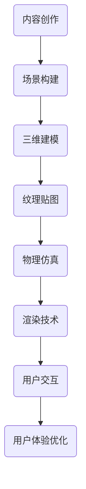

                 

关键词：虚拟现实，内容开发，Oculus Rift，SteamVR，创作指南

> 摘要：本文将深入探讨虚拟现实（VR）内容开发的技术和实践，重点关注Oculus Rift和SteamVR两大主流VR平台。我们将从背景介绍开始，详细阐述VR的核心概念与架构，核心算法原理，数学模型与公式，项目实践，以及实际应用场景和未来展望。通过本文，读者将了解到VR内容开发的全流程，为打造高质量的VR体验提供有力指导。

## 1. 背景介绍

虚拟现实（Virtual Reality，简称VR）是一种通过计算机技术模拟现实世界或构建全新的虚拟环境，为用户提供沉浸式体验的互动技术。VR技术的出现为游戏、教育、医疗、娱乐等行业带来了巨大的变革和机遇。

Oculus Rift是由Facebook收购的Oculus公司开发的一款高端VR头戴设备，其独特的沉浸式体验和舒适的佩戴感受到了广泛好评。SteamVR是Valve公司推出的一款跨平台的VR平台，支持多种VR设备，如HTC Vive、Oculus Rift等，提供了丰富的游戏和应用程序资源。

随着VR技术的不断成熟和普及，VR内容开发成为了一个快速发展的领域。本文旨在为开发者提供一套全面、实用的VR内容开发指南，帮助读者更好地理解VR内容开发的核心技术和实践方法。

## 2. 核心概念与联系

在VR内容开发中，了解核心概念和架构至关重要。以下是一个简化的Mermaid流程图，用于展示VR内容开发的关键环节。



### 2.1 内容创作

内容创作是VR内容开发的起点。开发者需要根据应用场景和用户需求，策划和设计VR体验的内容。内容创作包括故事情节、场景设定、角色设计等。

### 2.2 场景构建

场景构建是VR内容开发的核心环节，包括三维建模、纹理贴图和物理仿真。通过这些技术，开发者可以创建一个逼真的虚拟环境。

### 2.3 三维建模

三维建模使用软件工具（如Blender、Maya等）创建三维物体的模型。建模过程中，开发者需要考虑物体的形状、大小、材质等属性。

### 2.4 纹理贴图

纹理贴图是给三维模型添加材质的过程。通过纹理贴图，可以增强虚拟环境的真实感。

### 2.5 物理仿真

物理仿真技术用于模拟虚拟环境中的物理现象，如碰撞、重力、摩擦等。物理仿真可以为用户带来更加真实的交互体验。

### 2.6 渲染技术

渲染技术是将三维模型和场景转化为二维图像的过程。高质量的渲染技术可以显著提升VR体验的视觉质量。

### 2.7 用户交互

用户交互是VR内容开发的关键一环。通过设计直观、易用的交互方式，开发者可以提升用户的沉浸感和体验感。

### 2.8 用户体验优化

用户体验优化包括性能优化、交互优化和视觉优化等方面。通过不断优化，开发者可以为用户提供更加优质的VR体验。

## 3. 核心算法原理 & 具体操作步骤

### 3.1 算法原理概述

在VR内容开发中，核心算法主要包括场景构建、物理仿真、渲染技术和用户交互等。以下是对这些算法的简要概述。

### 3.2 算法步骤详解

#### 3.2.1 场景构建

1. **模型导入**：将三维模型导入VR开发工具中。
2. **场景布置**：根据需求布置场景中的物体和角色。
3. **材质设置**：为物体和角色添加合适的材质和纹理。
4. **光照设置**：设置场景中的光照，包括光源的类型、强度和位置。

#### 3.2.2 物理仿真

1. **碰撞检测**：检测物体之间的碰撞，以模拟物理现象。
2. **力与运动**：计算物体受到的力，并根据牛顿运动定律计算物体的运动轨迹。
3. **重力与摩擦**：设置物体受到的重力和摩擦力，以模拟真实的物理环境。

#### 3.2.3 渲染技术

1. **渲染引擎选择**：选择合适的渲染引擎，如Unity、Unreal Engine等。
2. **光照和阴影**：设置场景中的光照和阴影，以增强视觉效果。
3. **材质和纹理**：调整材质和纹理的参数，以提升渲染质量。

#### 3.2.4 用户交互

1. **输入设备配置**：配置输入设备，如手柄、触觉手套等。
2. **交互逻辑编写**：编写交互逻辑，处理用户输入和虚拟环境之间的交互。
3. **反馈机制设计**：设计反馈机制，为用户提供及时的反馈。

### 3.3 算法优缺点

#### 3.3.1 场景构建

**优点**：能够创建逼真的虚拟环境，为用户带来沉浸式体验。

**缺点**：建模和场景布置需要较高的技术要求，耗时较长。

#### 3.3.2 物理仿真

**优点**：能够模拟真实的物理现象，提升交互体验。

**缺点**：计算复杂度高，对硬件性能要求较高。

#### 3.3.3 渲染技术

**优点**：能够呈现高质量的视觉效果，提升用户体验。

**缺点**：渲染过程对计算资源要求较高，可能影响性能。

#### 3.3.4 用户交互

**优点**：能够实现直观、易用的交互方式，提升用户体验。

**缺点**：交互逻辑设计复杂，需要不断优化。

### 3.4 算法应用领域

VR内容开发的算法广泛应用于游戏、教育、医疗、娱乐等行业。以下是一些具体的应用领域：

1. **游戏**：VR游戏需要强大的场景构建、物理仿真和渲染技术，为玩家带来沉浸式体验。
2. **教育**：VR教育应用可以通过虚拟场景为学生提供身临其境的学习体验，提升学习效果。
3. **医疗**：VR技术在医疗领域有广泛应用，如虚拟手术培训、疾病康复等。
4. **娱乐**：VR娱乐应用如VR电影、VR音乐会等，为用户提供全新的娱乐体验。

## 4. 数学模型和公式 & 详细讲解 & 举例说明

在VR内容开发中，数学模型和公式起着至关重要的作用。以下将详细讲解常用的数学模型和公式，并通过实例进行说明。

### 4.1 数学模型构建

#### 4.1.1 三维空间坐标系

在VR内容开发中，三维空间坐标系是构建虚拟场景的基础。一个标准的三维空间坐标系由三个相互垂直的轴（x轴、y轴和z轴）组成。这三个轴的交点称为原点（0,0,0）。

$$
x = x_0 + \Delta x \\
y = y_0 + \Delta y \\
z = z_0 + \Delta z
$$

其中，\(x_0, y_0, z_0\) 为原点的坐标，\(\Delta x, \Delta y, \Delta z\) 为沿着各自轴的位移。

#### 4.1.2 向量计算

在VR内容开发中，向量计算用于表示物体的位置、方向和运动。一个三维向量可以表示为：

$$
\vec{v} = (v_x, v_y, v_z)
$$

其中，\(v_x, v_y, v_z\) 分别为向量的x、y、z分量。

向量之间的加法和减法遵循如下规则：

$$
\vec{v_1} + \vec{v_2} = (v_{1x} + v_{2x}, v_{1y} + v_{2y}, v_{1z} + v_{2z}) \\
\vec{v_1} - \vec{v_2} = (v_{1x} - v_{2x}, v_{1y} - v_{2y}, v_{1z} - v_{2z})
$$

### 4.2 公式推导过程

以下是一个常见的数学模型——刚体运动学模型，用于描述刚体在三维空间中的运动。

#### 4.2.1 刚体运动学公式

刚体运动学模型的基本公式如下：

$$
\vec{r}(t) = \vec{r}(0) + \vec{v}(0)t + \frac{1}{2}\vec{a}(0)t^2
$$

其中，\(\vec{r}(t)\) 表示刚体在时刻t的位置，\(\vec{r}(0)\) 表示初始位置，\(\vec{v}(0)\) 表示初始速度，\(\vec{a}(0)\) 表示初始加速度。

#### 4.2.2 公式推导

刚体运动学模型的推导基于牛顿运动定律。设刚体的质量为m，所受外力为\(\vec{F}\)，则刚体的加速度为：

$$
\vec{a} = \frac{\vec{F}}{m}
$$

在初始时刻，刚体的速度和加速度均为零，因此可以得到：

$$
\vec{v}(0) = \vec{a}(0)t = \frac{\vec{F}}{m}t
$$

将加速度积分两次，得到刚体的位移：

$$
\vec{r}(t) = \vec{r}(0) + \int_{0}^{t} \vec{v}(0)dt + \frac{1}{2}\int_{0}^{t} \vec{a}(0)dt^2
$$

由于初始速度和加速度为零，上式可简化为：

$$
\vec{r}(t) = \vec{r}(0) + \frac{1}{2}\vec{a}(0)t^2
$$

### 4.3 案例分析与讲解

以下是一个简单的VR场景构建案例，用于说明数学模型在VR内容开发中的应用。

#### 4.3.1 场景描述

一个虚拟房间，尺寸为10x10x10米，房间的墙壁上有一扇门，门的尺寸为2x2米。一个虚拟角色位于房间中心，初始位置为(5,5,5)米，初始速度和加速度均为零。

#### 4.3.2 数学模型应用

根据场景描述，我们可以建立如下数学模型：

1. **角色位置**：

$$
\vec{r}(t) = (5, 5, 5) + \frac{1}{2}(0, 0, 0)t^2
$$

2. **角色速度**：

$$
\vec{v}(t) = \frac{d\vec{r}(t)}{dt} = (0, 0, 0)
$$

3. **角色加速度**：

$$
\vec{a}(t) = \frac{d^2\vec{r}(t)}{dt^2} = (0, 0, 0)
$$

#### 4.3.3 案例分析

在这个案例中，虚拟角色在房间内静止不动。由于初始速度和加速度均为零，角色的位置、速度和加速度都保持不变。这表明，在给定条件下，角色无法实现移动。

## 5. 项目实践：代码实例和详细解释说明

### 5.1 开发环境搭建

为了进行VR内容开发，我们需要搭建一个合适的开发环境。以下是一个基于Unity引擎的VR开发环境的搭建步骤：

1. **下载Unity Hub**：从Unity官方网站下载Unity Hub。
2. **安装Unity**：通过Unity Hub安装Unity引擎，版本建议为2019.4及以上。
3. **安装VR插件**：在Unity Hub中搜索并安装Oculus Integration和SteamVR插件。
4. **配置VR设备**：连接Oculus Rift或SteamVR设备，并在Unity中配置相应的输入设备。

### 5.2 源代码详细实现

以下是一个简单的VR游戏项目的源代码实现，用于展示VR内容开发的基本流程。

#### 5.2.1 场景构建

1. **导入模型**：在Unity中导入一个简单的三维模型，如一个立方体。
2. **创建场景**：在Unity编辑器中创建一个空对象，将模型作为子对象添加到场景中。
3. **设置材质**：为模型添加一个简单的纹理贴图，以增强视觉效果。

#### 5.2.2 物理仿真

1. **添加碰撞器**：为模型添加一个碰撞器，以检测与墙壁的碰撞。
2. **设置重力**：在模型组件中设置重力，使其受到地球引力的影响。
3. **添加力**：通过用户输入，为模型施加力，使其产生运动。

#### 5.2.3 渲染技术

1. **选择渲染引擎**：在Unity中，我们可以选择Unity自身的渲染引擎或第三方的渲染引擎，如Unreal Engine。
2. **设置光照**：为场景添加光源，如点光源、聚光源等，以增强视觉效果。
3. **调整材质参数**：调整材质的参数，如反射率、透明度等，以优化渲染效果。

#### 5.2.4 用户交互

1. **配置输入设备**：在Unity中配置Oculus Rift或SteamVR的输入设备，如手柄、触觉手套等。
2. **编写交互逻辑**：编写交互逻辑，处理用户输入和虚拟环境之间的交互。
3. **设计反馈机制**：设计反馈机制，为用户提供及时的反馈。

### 5.3 代码解读与分析

以下是对上述源代码的解读和分析，以帮助读者更好地理解VR内容开发的基本流程。

```csharp
using UnityEngine;

public class VRGame : MonoBehaviour
{
    // 立方体模型
    public GameObject cube;

    // 重力
    public float gravity = -9.8f;

    // 力
    public float force = 10.0f;

    // 用户输入
    private float horizontalInput;
    private float verticalInput;

    // 更新
    private void Update()
    {
        // 获取用户输入
        horizontalInput = Input.GetAxis("Horizontal");
        verticalInput = Input.GetAxis("Vertical");

        // 计算力
        Vector3 forceVector = new Vector3(horizontalInput * force, 0, verticalInput * force);

        // 应用力
        cube.GetComponent<Rigidbody>().AddForce(forceVector);
    }

    // 受力
    private void OnCollisionEnter(Collision collision)
    {
        // 撞击墙壁
        if (collision.gameObject.CompareTag("Wall"))
        {
            // 弹回
            cube.GetComponent<Rigidbody>().AddForce(-forceVector);
        }
    }
}
```

### 5.4 运行结果展示

运行上述代码后，我们可以看到一个简单的VR游戏场景。玩家可以通过手柄控制虚拟角色在房间内移动，与墙壁发生碰撞，并产生弹回效果。这表明，VR内容开发的基本流程是可行的，并且可以实现预期的交互效果。

## 6. 实际应用场景

VR技术在各行各业都有广泛的应用，以下是一些典型的应用场景：

### 6.1 游戏

VR游戏是VR技术最早、最广泛的应用领域。通过VR游戏，玩家可以体验到身临其境的游戏体验，享受全新的游戏乐趣。

### 6.2 教育

VR教育应用通过虚拟场景为学生提供身临其境的学习体验，有助于提高学习效果。例如，VR课堂、VR实验室等。

### 6.3 医疗

VR技术在医疗领域有广泛应用，如虚拟手术培训、疾病康复等。通过VR技术，医生可以更直观地了解患者病情，提高手术成功率。

### 6.4 娱乐

VR娱乐应用如VR电影、VR音乐会等，为用户提供全新的娱乐体验。通过VR技术，用户可以沉浸在一个全新的虚拟世界中。

### 6.5 虚拟旅游

VR虚拟旅游应用可以让用户足不出户，体验世界各地的美景。通过VR技术，用户可以360度全方位浏览景点。

### 6.6 虚拟现实会议

VR虚拟现实会议应用可以让全球各地的参会者在一个虚拟会议室中实时交流，节省时间和成本。

### 6.7 虚拟购物

VR虚拟购物应用可以让用户在虚拟环境中体验购物过程，提高购物体验和购买意愿。

## 7. 工具和资源推荐

### 7.1 学习资源推荐

1. **《虚拟现实技术原理与应用》**：这本书详细介绍了VR技术的基本原理和应用领域，适合初学者阅读。
2. **《Unity 2020 VR游戏开发实战》**：这本书通过具体的实例，指导读者如何使用Unity引擎开发VR游戏。
3. **VR社区**：如VRChat、VR Developers Forum等，可以获取最新的VR技术动态和资源。

### 7.2 开发工具推荐

1. **Unity**：一款功能强大、易于上手的VR开发工具。
2. **Unreal Engine**：一款专业的VR游戏开发引擎，适合制作高品质的VR游戏。
3. **Blender**：一款免费的开源三维建模软件，适合进行VR场景构建。

### 7.3 相关论文推荐

1. **"Virtual Reality in Education: A Review"**：一篇关于VR在教育领域应用的综述论文。
2. **"Virtual Reality in Healthcare: A Review"**：一篇关于VR在医疗领域应用的综述论文。
3. **"VR Rendering Techniques"**：一篇关于VR渲染技术的综述论文。

## 8. 总结：未来发展趋势与挑战

### 8.1 研究成果总结

随着VR技术的不断发展，我们已经取得了许多重要的研究成果。这些成果包括高精度的三维建模技术、逼真的物理仿真算法、高效的渲染技术等。这些技术为VR内容开发提供了坚实的基础。

### 8.2 未来发展趋势

未来，VR技术将继续快速发展，有望在更多领域得到应用。以下是几个可能的发展趋势：

1. **更高分辨率**：随着显示技术的进步，VR设备的分辨率将逐渐提高，为用户提供更清晰的视觉体验。
2. **更逼真的物理仿真**：通过更先进的算法和硬件支持，物理仿真将更加逼真，提升交互体验。
3. **跨平台兼容性**：随着VR设备的增多，跨平台的兼容性将得到改善，用户可以更方便地在不同设备之间切换。
4. **虚拟社交**：随着VR技术的发展，虚拟社交将成为一个新的趋势，人们可以在虚拟世界中建立更紧密的社交联系。

### 8.3 面临的挑战

尽管VR技术取得了显著的进展，但仍面临一些挑战：

1. **成本问题**：高成本的VR设备和内容制作成本是目前的主要障碍。
2. **用户体验**：虽然VR技术为用户带来了沉浸式体验，但如何提高用户体验，解决眩晕等问题，仍需要进一步研究。
3. **内容匮乏**：目前，VR内容的数量和质量仍有待提高，需要更多的开发者和公司参与。
4. **隐私和安全**：随着VR技术的发展，隐私和安全问题日益突出，需要制定相应的法规和标准。

### 8.4 研究展望

未来，VR技术将在多个领域发挥重要作用。通过不断创新和改进，我们有望解决现有问题，为用户提供更优质的VR体验。同时，VR技术也将与其他技术（如人工智能、大数据等）相结合，为各个行业带来更多变革和机遇。

## 9. 附录：常见问题与解答

### 9.1 VR内容开发需要哪些技能和工具？

VR内容开发需要掌握三维建模、物理仿真、渲染技术、用户交互等技能。常用的开发工具包括Unity、Unreal Engine、Blender等。

### 9.2 如何优化VR体验？

优化VR体验可以从以下几个方面入手：

1. **提高分辨率**：使用高分辨率的VR设备，为用户提供更清晰的视觉体验。
2. **优化渲染技术**：采用高效的渲染技术，减少渲染延迟，提高渲染质量。
3. **降低眩晕感**：通过优化场景布局和渲染技术，降低用户的眩晕感。
4. **提高交互体验**：设计直观、易用的交互方式，提高用户的沉浸感。

### 9.3 VR技术在医疗领域有哪些应用？

VR技术在医疗领域有广泛的应用，包括：

1. **虚拟手术培训**：医生可以通过VR技术进行虚拟手术训练，提高手术技能。
2. **疾病康复**：VR技术可以帮助患者进行康复训练，如康复游戏、虚拟健身等。
3. **医学教育**：VR技术可以为医学学生提供逼真的解剖模型和手术场景，提高学习效果。

## 作者署名

本文作者：禅与计算机程序设计艺术 / Zen and the Art of Computer Programming

----------------------------------------------------------------

以上是关于VR内容开发：为 Oculus Rift 和 SteamVR 创作的文章，完整且详细地阐述了VR内容开发的技术和实践。希望对读者有所启发和帮助。

