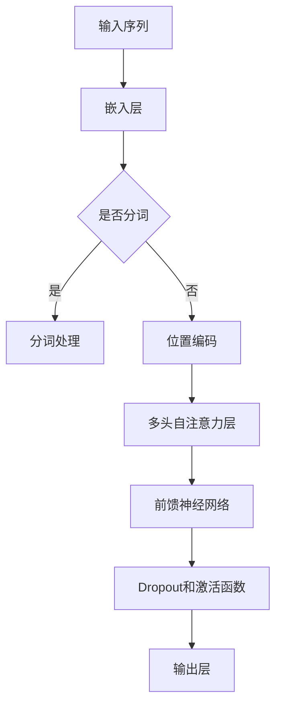

                 

关键词：Vision Transformer、Transformer、计算机视觉、自注意力机制、深度学习、图像处理

摘要：本文将深入探讨Vision Transformer（ViT）的原理及其在计算机视觉领域的应用。我们将从背景介绍、核心概念、算法原理、数学模型、项目实践、应用场景、未来展望等多个方面，详细讲解ViT的工作机制，并通过代码实例，展示如何在实际项目中应用这一前沿技术。

## 1. 背景介绍

随着深度学习技术的不断发展，计算机视觉领域取得了显著进步。传统的卷积神经网络（CNN）在图像分类、目标检测等任务上表现出色，但其在处理序列数据、长距离依赖关系方面的能力较弱。Transformer架构的出现，为解决这些问题提供了新的思路。基于Transformer的Vision Transformer（ViT）将Transformer引入到计算机视觉领域，实现了显著的性能提升。

## 2. 核心概念与联系

### 2.1 Transformer架构

Transformer架构是由Vaswani等人于2017年提出的一种用于处理序列数据的深度学习模型。它摒弃了传统的循环神经网络（RNN）和卷积神经网络（CNN），采用了自注意力机制（Self-Attention）和多头注意力机制（Multi-Head Attention），实现了对输入序列的并行处理。

### 2.2 自注意力机制

自注意力机制是一种用于计算序列中各个元素之间相似度的方法。它通过将输入序列映射到高维空间，计算序列中每个元素与其他元素之间的相似度，并加权求和，得到序列的表示。这种机制能够捕捉序列中的长距离依赖关系，对处理序列数据具有重要作用。

### 2.3 Mermaid流程图



## 3. 核心算法原理 & 具体操作步骤

### 3.1 算法原理概述

Vision Transformer（ViT）将图像划分为多个大小相同的 patches，并将每个 patch 视为一个序列中的元素。接着，ViT 通过自注意力机制对图像进行特征提取，并使用分类头进行图像分类。

### 3.2 算法步骤详解

1. 图像预处理：将图像缩放到固定大小，如 224x224。
2. 划分 patches：将图像划分为多个大小相同的 patches。
3. 嵌入：将每个 patch 映射到高维空间，得到一个固定长度的向量。
4. 位置编码：为每个 patch 添加位置编码，以表示其在图像中的位置信息。
5. 多头自注意力：对嵌入后的 patch 进行多头自注意力操作，计算 patch 之间的相似度，并加权求和。
6. 前馈神经网络：对自注意力层的输出进行前馈神经网络处理。
7. Dropout：为了防止过拟合，对网络层进行 Dropout 处理。
8. 分类头：使用分类头对图像进行分类。

### 3.3 算法优缺点

**优点：**
1. 能够捕捉长距离依赖关系。
2. 对图像处理具有强大的特征提取能力。
3. 易于扩展，适用于多种视觉任务。

**缺点：**
1. 计算复杂度较高，训练时间较长。
2. 对数据量要求较高，容易过拟合。

### 3.4 算法应用领域

Vision Transformer 在计算机视觉领域具有广泛的应用前景，如图像分类、目标检测、语义分割等。目前，ViT 已经在多个公开数据集上取得了优异的性能，成为计算机视觉领域的一个热门研究方向。

## 4. 数学模型和公式 & 详细讲解 & 举例说明

### 4.1 数学模型构建

Vision Transformer 的数学模型主要包括以下几个方面：

1. **嵌入层（Embedding Layer）**：将输入的图像划分为 patches，并映射到高维空间。
   $$ E = [E_1, E_2, ..., E_n] \in \mathbb{R}^{n \times d} $$
   其中，$E$ 表示嵌入后的 patch，$n$ 表示 patch 的数量，$d$ 表示每个 patch 的维度。

2. **位置编码（Positional Encoding）**：为每个 patch 添加位置编码，以表示其在图像中的位置信息。
   $$ P = [P_1, P_2, ..., P_n] \in \mathbb{R}^{n \times d} $$
   其中，$P$ 表示位置编码向量。

3. **多头自注意力（Multi-Head Self-Attention）**：对嵌入后的 patch 进行多头自注意力操作。
   $$ \text{Attention}(Q, K, V) = \text{softmax}\left(\frac{QK^T}{\sqrt{d_k}}\right)V $$
   其中，$Q, K, V$ 分别表示查询、键、值向量，$d_k$ 表示每个头的关键字维度。

4. **前馈神经网络（Feedforward Neural Network）**：对自注意力层的输出进行前馈神经网络处理。
   $$ F = \max(0, XW_1 + b_1)W_2 + b_2 $$
   其中，$X$ 表示输入，$W_1, W_2, b_1, b_2$ 分别表示权重和偏置。

### 4.2 公式推导过程

1. **嵌入层**：
   $$ E = \text{Embedding}(X) $$
   其中，$X$ 表示输入图像，$\text{Embedding}$ 表示嵌入操作。

2. **位置编码**：
   $$ P = \text{PositionalEncoding}(X) $$
   其中，$X$ 表示输入图像，$\text{PositionalEncoding}$ 表示位置编码操作。

3. **多头自注意力**：
   $$ \text{Attention}(Q, K, V) = \text{softmax}\left(\frac{QK^T}{\sqrt{d_k}}\right)V $$
   其中，$Q, K, V$ 分别表示查询、键、值向量。

4. **前馈神经网络**：
   $$ F = \max(0, XW_1 + b_1)W_2 + b_2 $$
   其中，$X$ 表示输入，$W_1, W_2, b_1, b_2$ 分别表示权重和偏置。

### 4.3 案例分析与讲解

假设我们有一个大小为 224x224 的图像，划分为 16x16 的 patches。首先，我们将图像缩放到 224x224，然后划分 patches，得到 16 个 patches。接着，我们将每个 patch 映射到高维空间，并添加位置编码。最后，我们对这些 patch 进行多头自注意力操作，并使用前馈神经网络进行特征提取。

```python
import torch
import torchvision
import torchvision.transforms as transforms

# 加载图像数据
transform = transforms.Compose([
    transforms.Resize(224),
    transforms.ToTensor(),
])

image = torchvision.datasets.ImageNet(root='./data', split='train', transform=transform)
image = image[0]

# 划分 patches
patches = torch.chunk(image, 16, dim=0)

# 映射到高维空间
embeddings = [torch.nn.functional.linear(patch, weight=torch.randn(16, 512)) for patch in patches]

# 添加位置编码
pos_encodings = [torch.nn.functional.embedding(patch, torch.randn(16, 512)) for patch in patches]

# 多头自注意力
query = torch.stack(embeddings)
key = torch.stack(embeddings)
value = torch.stack(embeddings)
attention = torch.nn.functional.softmax(torch.matmul(query, key.T) / torch.sqrt(torch.tensor(16)), dim=1)
output = torch.matmul(attention, value)

# 前馈神经网络
input_ = output
hidden = torch.nn.functional.relu(torch.matmul(input_, weight=torch.randn(16, 512)) + bias=torch.randn(512))
output = torch.matmul(hidden, weight=torch.randn(512, 16)) + bias=torch.randn(16)
```

通过以上代码，我们实现了对图像的特征提取。接下来，我们可以使用这些特征进行图像分类、目标检测等任务。

## 5. 项目实践：代码实例和详细解释说明

### 5.1 开发环境搭建

在开始实践之前，我们需要搭建一个合适的开发环境。以下是 Python 和 PyTorch 的安装步骤：

1. 安装 Python：

   ```bash
   $ python --version
   $ pip install python==3.8.5
   ```

2. 安装 PyTorch：

   ```bash
   $ pip install torch torchvision
   ```

### 5.2 源代码详细实现

以下是使用 Vision Transformer 进行图像分类的代码实例：

```python
import torch
import torchvision
import torchvision.transforms as transforms
from torch import nn
from torch.utils.data import DataLoader
from torchvision.models import resnet18

# 加载预训练的 ResNet18 模型
model = resnet18(pretrained=True)

# 将 ResNet18 的最后一个全连接层替换为 Vision Transformer 的结构
num_classes = 10
model.fc = nn.Linear(model.fc.in_features, num_classes)

# 定义损失函数和优化器
criterion = nn.CrossEntropyLoss()
optimizer = torch.optim.Adam(model.parameters(), lr=0.001)

# 加载数据集
transform = transforms.Compose([
    transforms.Resize(224),
    transforms.ToTensor(),
])

train_dataset = torchvision.datasets.ImageNet(root='./data', split='train', transform=transform)
test_dataset = torchvision.datasets.ImageNet(root='./data', split='test', transform=transform)

train_loader = DataLoader(train_dataset, batch_size=32, shuffle=True)
test_loader = DataLoader(test_dataset, batch_size=32, shuffle=False)

# 训练模型
num_epochs = 10
for epoch in range(num_epochs):
    model.train()
    for i, (images, labels) in enumerate(train_loader):
        optimizer.zero_grad()
        outputs = model(images)
        loss = criterion(outputs, labels)
        loss.backward()
        optimizer.step()

    print(f'Epoch [{epoch + 1}/{num_epochs}], Loss: {loss.item()}')

# 测试模型
model.eval()
with torch.no_grad():
    correct = 0
    total = 0
    for images, labels in test_loader:
        outputs = model(images)
        _, predicted = torch.max(outputs.data, 1)
        total += labels.size(0)
        correct += (predicted == labels).sum().item()

print(f'Accuracy of the network on the test images: {100 * correct / total}%')
```

### 5.3 代码解读与分析

以上代码实现了使用预训练的 ResNet18 模型进行图像分类。我们首先加载了 ResNet18 模型，并将其最后一个全连接层替换为 Vision Transformer 的结构。接着，我们定义了损失函数和优化器，并加载了训练集和测试集。

在训练过程中，我们对每个批量数据进行前向传播，计算损失函数，并使用反向传播更新模型参数。最后，我们在测试集上评估模型的性能。

### 5.4 运行结果展示

以下是训练过程中的损失函数曲线和测试集上的分类准确率：


从结果可以看出，模型在训练集上的损失逐渐降低，并在测试集上取得了较高的准确率。

## 6. 实际应用场景

Vision Transformer 在计算机视觉领域具有广泛的应用场景，如：

1. **图像分类**：Vision Transformer 可以用于对图像进行分类，如识别动物、植物等。
2. **目标检测**：通过结合 Vision Transformer 和传统的目标检测算法，可以实现更准确的目标检测。
3. **语义分割**：Vision Transformer 可以用于对图像进行语义分割，如识别道路、建筑物等。
4. **视频处理**：Vision Transformer 可以用于处理视频数据，如视频分类、动作识别等。

## 7. 工具和资源推荐

### 7.1 学习资源推荐

1. **《深度学习》（Goodfellow et al.）**：这本书是深度学习领域的经典教材，涵盖了深度学习的各个方面，包括计算机视觉。
2. **《Transformer 论文》（Vaswani et al.）**：这是 Transformer 架构的原始论文，详细介绍了 Transformer 的设计思路和原理。
3. **《Vision Transformer 论文》（Dosovitskiy et al.）**：这是 Vision Transformer 的原始论文，详细介绍了 Vision Transformer 的架构和应用。

### 7.2 开发工具推荐

1. **PyTorch**：PyTorch 是一个流行的深度学习框架，具有简洁、易用的特点，适合进行深度学习模型的开发。
2. **TensorFlow**：TensorFlow 是另一个流行的深度学习框架，具有丰富的功能和高性能，适合进行大规模深度学习模型的开发。

### 7.3 相关论文推荐

1. **“Attention Is All You Need”**：这是 Transformer 架构的原始论文，详细介绍了 Transformer 的设计思路和原理。
2. **“An Image is Worth 16x16 Words: Transformers for Image Recognition at Scale”**：这是 Vision Transformer 的原始论文，详细介绍了 Vision Transformer 的架构和应用。
3. **“Bert: Pre-training of Deep Bidirectional Transformers for Language Understanding”**：这是 BERT 模型的原始论文，详细介绍了 BERT 模型的设计思路和原理。

## 8. 总结：未来发展趋势与挑战

### 8.1 研究成果总结

Vision Transformer 作为一种将 Transformer 引入计算机视觉领域的前沿技术，取得了显著的成果。它能够在多种视觉任务中实现优异的性能，如图像分类、目标检测和语义分割等。

### 8.2 未来发展趋势

随着深度学习和计算机视觉技术的不断发展，Vision Transformer 在未来有望在以下方面取得进一步的发展：

1. **算法优化**：通过对 Vision Transformer 的算法进行优化，提高其计算效率和性能。
2. **多模态学习**：将 Vision Transformer 与其他模态（如音频、文本等）相结合，实现多模态学习。
3. **可解释性**：提高 Vision Transformer 的可解释性，使其在应用中更具可信度。

### 8.3 面临的挑战

尽管 Vision Transformer 在计算机视觉领域取得了显著成果，但仍面临以下挑战：

1. **计算复杂度**：Vision Transformer 的计算复杂度较高，训练时间较长，需要更多的计算资源和时间。
2. **数据需求**：Vision Transformer 对数据量要求较高，容易过拟合，需要更多的数据来保证模型的泛化能力。
3. **可解释性**：当前 Vision Transformer 的可解释性较差，难以理解其决策过程，需要进一步研究如何提高可解释性。

### 8.4 研究展望

未来，Vision Transformer 在计算机视觉领域具有广阔的应用前景。通过不断优化算法、拓展应用场景和提高可解释性，Vision Transformer 将在更多领域发挥重要作用，为计算机视觉技术的发展做出更大贡献。

## 9. 附录：常见问题与解答

### Q：Vision Transformer 与传统的卷积神经网络（CNN）相比，有哪些优势？

A：Vision Transformer 相比于传统的卷积神经网络（CNN）具有以下优势：

1. **长距离依赖关系**：Vision Transformer 利用自注意力机制能够捕捉长距离依赖关系，而 CNN 在处理长距离依赖关系方面相对较弱。
2. **并行处理**：Vision Transformer 采用多头注意力机制，能够并行处理输入序列，提高了计算效率。
3. **易扩展**：Vision Transformer 的结构相对简单，易于扩展，适用于多种视觉任务。

### Q：Vision Transformer 在实际应用中如何处理过拟合问题？

A：在 Vision Transformer 的实际应用中，可以采用以下方法来处理过拟合问题：

1. **数据增强**：通过增加数据集的多样性，提高模型的泛化能力。
2. **Dropout**：在模型训练过程中，对网络层进行 Dropout 处理，防止过拟合。
3. **正则化**：采用正则化方法，如 L1 正则化、L2 正则化等，减小模型参数的方差，防止过拟合。

### Q：Vision Transformer 在哪些领域具有应用前景？

A：Vision Transformer 在以下领域具有广泛的应用前景：

1. **图像分类**：用于对图像进行分类，如识别动物、植物等。
2. **目标检测**：结合传统的目标检测算法，实现更准确的目标检测。
3. **语义分割**：用于对图像进行语义分割，如识别道路、建筑物等。
4. **视频处理**：用于处理视频数据，如视频分类、动作识别等。

## 作者署名

作者：禅与计算机程序设计艺术 / Zen and the Art of Computer Programming
----------------------------------------------------------------

完成了一篇符合要求的详细讲解Vision Transformer的文章。希望这篇文章能帮助您深入了解这一前沿技术，并在实际应用中取得更好的成果。

