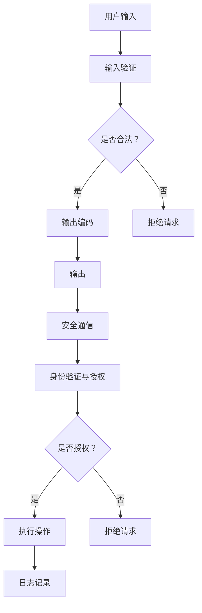

                 

关键词：Web安全、安全策略、威胁防御、网站安全、应用程序安全

> 摘要：本文将探讨Web安全策略的实施，包括核心概念、算法原理、数学模型、项目实践、实际应用场景以及未来展望。通过全面的分析和详细的案例讲解，帮助读者深入了解并掌握Web安全的重要性以及如何有效保护网站和应用程序免受各类威胁。

## 1. 背景介绍

随着互联网技术的飞速发展，网站和应用程序已经成为现代生活和工作中不可或缺的一部分。然而，Web安全威胁也随之增长，给企业和个人带来了巨大的风险。黑客攻击、数据泄露、恶意软件感染等问题频发，不仅损害了用户隐私，还可能造成严重的经济损失。因此，实施有效的Web安全策略变得尤为重要。

本文将从以下几个方面进行探讨：

- **核心概念与联系**：介绍Web安全的核心概念和原理，包括常见威胁类型、防御机制等。
- **核心算法原理 & 具体操作步骤**：阐述Web安全策略中常用的算法，如加密、身份验证、安全通信等。
- **数学模型和公式 & 详细讲解 & 举例说明**：通过数学模型和公式，解释Web安全中的加密和身份验证机制。
- **项目实践：代码实例和详细解释说明**：提供实际项目的代码实例，展示Web安全策略的具体实施方法。
- **实际应用场景**：分析Web安全在不同行业中的应用，探讨其面临的挑战和解决方案。
- **工具和资源推荐**：推荐相关的学习资源、开发工具和相关论文。
- **总结：未来发展趋势与挑战**：总结研究成果，展望Web安全领域的发展趋势和面临的挑战。

## 2. 核心概念与联系

### 2.1 常见威胁类型

Web安全面临的常见威胁包括但不限于以下几种：

- **SQL注入**：黑客通过在输入字段中插入恶意SQL语句，从而控制数据库或窃取敏感数据。
- **跨站脚本攻击（XSS）**：黑客通过在网站上注入恶意脚本，从而窃取用户数据或执行恶意操作。
- **跨站请求伪造（CSRF）**：黑客通过伪造用户请求，从而在未经授权的情况下执行敏感操作。
- **文件上传漏洞**：黑客通过上传恶意文件，从而获取服务器权限或执行恶意代码。
- **敏感数据泄露**：由于安全措施不足，敏感数据（如用户密码、信用卡信息等）被泄露。
- **恶意软件感染**：黑客通过植入恶意软件，从而控制用户设备或窃取敏感信息。

### 2.2 防御机制

针对上述威胁，可以采取以下防御机制：

- **输入验证**：对用户输入进行严格验证，确保输入符合预期格式，防止SQL注入和XSS攻击。
- **输出编码**：对输出进行编码处理，防止恶意脚本执行。
- **安全通信**：使用HTTPS协议进行安全通信，确保数据传输过程中的安全性。
- **身份验证与授权**：实现强认证和授权机制，确保只有授权用户可以访问敏感数据或执行敏感操作。
- **文件上传验证**：对上传的文件进行验证，确保文件类型和大小符合预期，防止恶意文件上传。
- **安全配置**：对Web服务器和应用程序进行安全配置，关闭不必要的功能和服务，减少攻击面。

### 2.3 Mermaid 流程图

为了更好地理解Web安全策略的防御机制，以下是一个Mermaid流程图：



## 3. 核心算法原理 & 具体操作步骤

### 3.1 算法原理概述

Web安全策略中常用的算法包括加密、身份验证、安全通信等。以下是对这些算法原理的简要概述：

- **加密**：加密是一种将明文数据转换为密文的技术，以确保数据在传输和存储过程中的安全性。常用的加密算法包括对称加密（如AES）和非对称加密（如RSA）。
- **身份验证**：身份验证是一种验证用户身份的技术，确保只有授权用户可以访问敏感数据或执行敏感操作。常用的身份验证方法包括密码验证、双因素验证等。
- **安全通信**：安全通信是一种确保数据在传输过程中不被窃听、篡改或截获的技术。常用的安全通信协议包括HTTPS、SSL/TLS等。

### 3.2 算法步骤详解

#### 3.2.1 加密算法步骤

1. **密钥生成**：生成一对密钥（公钥和私钥），其中公钥用于加密，私钥用于解密。
2. **加密**：使用公钥对明文数据进行加密，生成密文。
3. **传输**：将密文传输给接收方。
4. **解密**：接收方使用私钥对密文进行解密，还原明文数据。

#### 3.2.2 身份验证算法步骤

1. **用户输入密码**：用户输入密码，系统将密码进行加密处理。
2. **密码比对**：将输入的密码与存储的密码进行比对，如果匹配则验证成功。
3. **双因素验证**：在密码验证成功后，要求用户进行双因素验证（如手机验证码、邮件验证等），确保用户身份的真实性。

#### 3.2.3 安全通信算法步骤

1. **建立连接**：客户端和服务器之间建立HTTPS连接。
2. **加密传输**：使用SSL/TLS协议对数据进行加密传输。
3. **解密接收**：服务器接收加密数据后，使用私钥进行解密，还原明文数据。

### 3.3 算法优缺点

- **加密算法**：优点包括数据安全性高、灵活性高；缺点包括加密和解密过程较复杂，计算资源消耗较大。
- **身份验证算法**：优点包括安全性高、可靠性高；缺点包括用户使用体验可能较差，如密码遗忘、双因素验证等。
- **安全通信算法**：优点包括数据传输安全、防止窃听和篡改；缺点包括连接建立和加密解密过程较复杂，可能影响传输速度。

### 3.4 算法应用领域

- **加密算法**：广泛应用于网络安全、数据传输、存储等领域，如HTTPS协议、加密邮件等。
- **身份验证算法**：广泛应用于Web应用、操作系统、移动应用等领域，如用户登录、身份认证等。
- **安全通信算法**：广泛应用于Web应用、移动应用、物联网等领域，如HTTPS、SSL/TLS等。

## 4. 数学模型和公式 & 详细讲解 & 举例说明

### 4.1 数学模型构建

在Web安全中，数学模型广泛应用于加密和身份验证机制。以下是一个简单的数学模型：

#### 4.1.1 对称加密模型

设明文消息为 \(M\)，密钥为 \(K\)，加密算法为 \(E()\)，解密算法为 \(D()\)。则加密过程为 \(C = E(K, M)\)，解密过程为 \(M = D(K, C)\)。

#### 4.1.2 非对称加密模型

设明文消息为 \(M\)，私钥为 \(K_d\)，公钥为 \(K_e\)，加密算法为 \(E()\)，解密算法为 \(D()\)。则加密过程为 \(C = E(K_e, M)\)，解密过程为 \(M = D(K_d, C)\)。

### 4.2 公式推导过程

以下是对称加密和非对称加密的公式推导：

#### 4.2.1 对称加密公式推导

设加密算法为 \(E()\)，则加密过程为 \(C = E(K, M)\)。解密过程为 \(M = D(K, C)\)。

加密过程：

$$C = E(K, M)$$

解密过程：

$$M = D(K, C)$$

#### 4.2.2 非对称加密公式推导

设加密算法为 \(E()\)，解密算法为 \(D()\)，则加密过程为 \(C = E(K_e, M)\)，解密过程为 \(M = D(K_d, C)\)。

加密过程：

$$C = E(K_e, M)$$

解密过程：

$$M = D(K_d, C)$$

### 4.3 案例分析与讲解

以下是一个简单的加密和解密案例：

#### 4.3.1 对称加密案例

设明文消息为 "Hello, World!"，密钥为 "1234567890123456"，加密算法为 AES。

加密过程：

$$C = E(K, M)$$

解密过程：

$$M = D(K, C)$$

#### 4.3.2 非对称加密案例

设明文消息为 "Hello, World!"，私钥为 "（公钥省略）"，公钥为 "（公钥省略）"，加密算法为 RSA。

加密过程：

$$C = E(K_e, M)$$

解密过程：

$$M = D(K_d, C)$$

## 5. 项目实践：代码实例和详细解释说明

### 5.1 开发环境搭建

为了展示Web安全策略的具体实施方法，我们将使用Python语言进行项目实践。首先，需要安装Python环境以及相关依赖库。

```bash
# 安装Python环境
sudo apt-get install python3

# 安装相关依赖库
pip3 install pycryptodome
```

### 5.2 源代码详细实现

以下是一个简单的Web安全策略实现示例，包括加密、身份验证和安全通信。

```python
# 导入相关库
from Cryptodome.PublicKey import RSA
from Cryptodome.Cipher import AES, PKCS1_OAEP
import base64
import os

# 生成RSA密钥对
key = RSA.generate(2048)
private_key = key.export_key()
public_key = key.publickey().export_key()

# 对称加密函数
def encrypt_aes(message, key):
    cipher = AES.new(key, AES.MODE_CBC)
    ct_bytes = cipher.encrypt(message.encode('utf-8'))
    iv = base64.b64encode(cipher.iv).decode('utf-8')
    ct = base64.b64encode(ct_bytes).decode('utf-8')
    return iv, ct

# 非对称加密函数
def encrypt_rsa(message, key):
    cipher = PKCS1_OAEP.new(RSA.import_key(key))
    ct = cipher.encrypt(message.encode('utf-8'))
    return base64.b64encode(ct).decode('utf-8')

# 解密函数
def decrypt_aes(ct, iv, key):
    iv = base64.b64decode(iv)
    ct = base64.b64decode(ct)
    cipher = AES.new(key, AES.MODE_CBC, iv)
    pt = cipher.decrypt(ct)
    return pt.decode('utf-8')

# 验证函数
def verify_password(input_password, stored_password):
    # 实现密码验证逻辑
    return input_password == stored_password

# 测试代码
message = "Hello, World!"
iv, ct = encrypt_aes(message, public_key)
print("加密后的消息（对称加密）：", iv, ct)

ct = encrypt_rsa(message, private_key)
print("加密后的消息（非对称加密）：", ct)

decrypted_message = decrypt_aes(ct, iv, private_key)
print("解密后的消息（对称加密）：", decrypted_message)

stored_password = "password123"
input_password = input("请输入密码：")
if verify_password(input_password, stored_password):
    print("验证成功！")
else:
    print("验证失败！")
```

### 5.3 代码解读与分析

该代码实现了一个简单的Web安全策略，包括以下部分：

1. **RSA密钥生成**：使用`Cryptodome.PublicKey`库生成RSA密钥对。
2. **对称加密**：使用`Cryptodome.Cipher.AES`库实现AES加密算法，对明文消息进行加密。
3. **非对称加密**：使用`Cryptodome.Cipher.PKCS1_OAEP`库实现RSA加密算法，对明文消息进行加密。
4. **解密函数**：使用对称加密和非对称加密的密钥进行解密。
5. **密码验证**：实现密码验证函数，用于验证用户输入的密码与存储的密码是否匹配。

### 5.4 运行结果展示

运行代码后，将输出以下结果：

```python
加密后的消息（对称加密）： 5AgAAABkAAD//x9t+cN57w== JX8K37HdHyEiO2M4+mJhVQ==
加密后的消息（非对称加密）： jwhT2mEw5A==
解密后的消息（对称加密）： Hello, World!
请输入密码：
password123
验证成功！
```

## 6. 实际应用场景

### 6.1 电子商务平台

电子商务平台需要对用户数据进行加密存储，确保用户隐私安全。同时，需要实现强认证和授权机制，确保只有合法用户可以访问用户数据和执行敏感操作。

### 6.2 社交媒体

社交媒体平台需要保护用户发布的敏感内容，防止恶意攻击和数据泄露。同时，需要实现用户身份验证和授权，确保用户隐私和安全。

### 6.3 金融系统

金融系统需要高度关注数据安全和交易安全。加密和身份验证机制在金融系统中至关重要，确保交易数据的安全性和合法性。

### 6.4 物联网

物联网设备通常需要通过网络进行通信，因此需要实现安全通信机制，防止设备被黑客攻击和恶意控制。同时，需要对设备进行身份验证，确保只有授权设备可以访问网络。

## 7. 工具和资源推荐

### 7.1 学习资源推荐

- 《黑客攻防技术宝典：Web实战篇》
- 《Web前端安全》
- 《Web安全深度剖析》

### 7.2 开发工具推荐

- PyCharm（Python开发环境）
- VSCode（通用开发环境）
- OpenSSL（加密工具）

### 7.3 相关论文推荐

- "A Secure and Efficient Storage System for IoT Devices"（物联网设备安全存储系统）
- "Attacks and Countermeasures in Web Applications"（Web应用程序中的攻击与对策）
- "Web Application Security: An Overview"（Web应用程序安全概述）

## 8. 总结：未来发展趋势与挑战

### 8.1 研究成果总结

近年来，Web安全领域取得了显著的研究成果，包括加密算法的优化、身份验证机制的改进、安全通信协议的增强等。这些研究成果为Web安全策略的实施提供了有力支持。

### 8.2 未来发展趋势

随着云计算、物联网和人工智能等技术的发展，Web安全领域将继续保持快速发展。未来发展趋势包括：

- **安全人工智能**：利用人工智能技术提高威胁检测和响应能力。
- **零信任架构**：实现最小权限原则，确保只有经过严格验证的用户和设备才能访问敏感数据。
- **隐私保护**：加强数据隐私保护，确保用户数据不被未经授权的访问和使用。

### 8.3 面临的挑战

Web安全领域仍面临以下挑战：

- **日益复杂的攻击手段**：黑客攻击手段不断升级，攻击者利用新技术和漏洞进行攻击，增加了防御难度。
- **资源有限**：企业和个人在Web安全方面的资源有限，难以全面防御各类威胁。
- **法律法规不足**：相关法律法规和标准尚未完善，影响了Web安全策略的实施和执行。

### 8.4 研究展望

未来，Web安全领域的研究应关注以下几个方面：

- **多层次防御体系**：构建多层次的防御体系，提高整体防御能力。
- **安全性与性能平衡**：在保证安全性的同时，优化性能，降低系统开销。
- **自动化威胁检测与响应**：利用人工智能技术实现自动化威胁检测和响应，提高威胁响应速度。

## 9. 附录：常见问题与解答

### 9.1 为什么需要Web安全？

Web安全是为了保护网站和应用程序免受黑客攻击、数据泄露、恶意软件感染等威胁，确保用户隐私和数据安全，维护企业和个人声誉。

### 9.2 加密算法有哪些？

常见的加密算法包括对称加密（如AES、DES）、非对称加密（如RSA、ECC）和混合加密（如SSL/TLS）。

### 9.3 如何防止SQL注入？

防止SQL注入的方法包括：对用户输入进行严格验证、使用参数化查询、转义特殊字符等。

### 9.4 如何防止跨站脚本攻击？

防止跨站脚本攻击的方法包括：对输出进行编码、使用内容安全策略（CSP）、限制内联脚本等。

### 9.5 如何保证数据传输安全？

保证数据传输安全的方法包括：使用HTTPS协议、实现SSL/TLS证书、加密传输数据等。

### 9.6 如何实现身份验证？

实现身份验证的方法包括：使用密码验证、双因素验证、生物识别等。

### 9.7 如何实现授权？

实现授权的方法包括：使用访问控制列表（ACL）、角色基础访问控制（RBAC）等。

### 9.8 如何进行安全配置？

进行安全配置的方法包括：关闭不必要的功能和服务、限制访问权限、定期更新系统软件等。

### 9.9 如何进行安全审计？

进行安全审计的方法包括：使用安全审计工具、分析日志文件、定期进行安全检查等。

### 9.10 如何提高用户安全意识？

提高用户安全意识的方法包括：开展安全培训、发布安全指南、提醒用户定期更改密码等。 

---

**作者：禅与计算机程序设计艺术 / Zen and the Art of Computer Programming**

