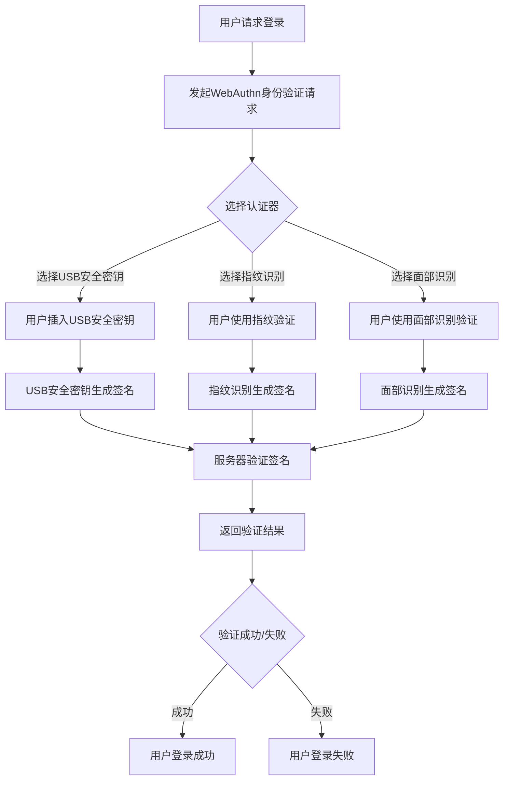

                 

关键词：WebAuthn、身份验证、安全、FIDO、浏览器扩展

## 摘要

本文将深入探讨WebAuthn（Web Authentication）的基本原理，解释其如何在现代网络环境中提供安全且方便的用户身份验证。WebAuthn是一种开放标准，基于FIDO（Fast Identity Online）协议，旨在通过硬件令牌、USB安全密钥或生物识别技术等手段增强Web应用的认证过程。本文将详细介绍WebAuthn的核心概念、工作原理、算法原理、数学模型、项目实践以及未来应用场景。通过阅读本文，读者将了解如何利用WebAuthn提高Web应用的安全性，并掌握其在实际开发中的具体应用。

## 1. 背景介绍

### 1.1 WebAuthn的起源

WebAuthn标准的诞生源于对互联网身份验证安全性的不断需求。在传统的身份验证过程中，密码、一次性密码（OTP）和多因素认证（MFA）等方法被广泛使用。然而，这些方法存在许多安全问题，如密码泄露、中间人攻击、重放攻击等。为了解决这些问题，FIDO联盟于2012年提出了FIDO U2F（Universal 2nd Factor）标准，旨在提供一种基于公共密钥加密技术的身份验证机制。随着FIDO技术的不断发展和完善，WebAuthn标准在2019年正式发布，成为W3C（World Wide Web Consortium）的推荐标准。

### 1.2 WebAuthn的重要性

WebAuthn的出现标志着身份验证领域的一个重要进步。它不仅提供了一种更加安全、方便的认证方式，还促进了在线服务的用户体验提升。以下是WebAuthn的重要性概述：

- **更高的安全性**：WebAuthn利用公共密钥加密技术，用户设备上的私钥不会传输到服务器，从而大大减少了密码泄露的风险。
- **更方便的用户体验**：用户不再需要记住复杂的密码，只需使用指纹、面部识别或物理安全密钥即可完成身份验证，简化了登录过程。
- **支持多种认证方式**：WebAuthn不仅支持传统的用户名和密码，还支持硬件令牌、USB安全密钥和生物识别技术等多样化的认证方式，满足不同场景的需求。
- **跨浏览器支持**：随着各大主流浏览器对WebAuthn标准的支持，开发者可以更方便地在不同平台上实现身份验证功能。

### 1.3 本文结构

本文将按照以下结构展开：

- **第1章**：背景介绍，介绍WebAuthn的起源、重要性以及本文的结构。
- **第2章**：核心概念与联系，解释WebAuthn的关键术语和概念。
- **第3章**：核心算法原理 & 具体操作步骤，详细描述WebAuthn的工作原理和实现过程。
- **第4章**：数学模型和公式 & 详细讲解 & 举例说明，介绍与WebAuthn相关的数学模型和公式。
- **第5章**：项目实践：代码实例和详细解释说明，通过实际项目案例展示WebAuthn的应用。
- **第6章**：实际应用场景，探讨WebAuthn在不同场景下的应用。
- **第7章**：工具和资源推荐，推荐学习资源和开发工具。
- **第8章**：总结：未来发展趋势与挑战，总结研究成果，展望未来发展趋势和面临的挑战。
- **第9章**：附录：常见问题与解答，回答读者可能遇到的常见问题。

通过本文的阅读，读者将全面了解WebAuthn的基本原理和应用，掌握如何将其集成到实际项目中，从而提高Web应用的安全性。

### 2. 核心概念与联系

在深入了解WebAuthn的工作原理之前，首先需要理解与WebAuthn相关的一些核心概念和术语。这些概念包括WebAuthn协议、FIDO联盟、公共密钥加密、认证器、身份验证因子等。通过本节内容，读者将建立对这些关键概念的全面理解，为后续章节的学习打下坚实的基础。

#### 2.1 WebAuthn协议

WebAuthn是一种基于JSON Web Token（JWT）的身份验证协议，它允许用户使用各种认证器（如USB安全密钥、硬件令牌、生物识别设备等）进行身份验证。与传统的用户名和密码验证方式不同，WebAuthn通过公共密钥加密技术来确保身份验证过程的安全性。WebAuthn协议的核心目标是提供一个开放、安全且易于集成的身份验证标准，以替代传统密码认证方式。

#### 2.2 FIDO联盟

FIDO（Fast Identity Online）联盟是一个非营利性组织，致力于推广基于公共密钥加密技术的身份验证标准。FIDO联盟成立于2012年，其成立的初衷是为了解决传统密码认证方式的种种问题，如密码泄露、中间人攻击等。FIDO联盟制定了一系列标准，包括FIDO U2F（Universal 2nd Factor）和WebAuthn。WebAuthn是FIDO联盟推出的第二代身份验证标准，旨在提供一个更加安全、方便的身份验证机制。

#### 2.3 公共密钥加密

公共密钥加密是一种加密技术，使用一对密钥（公共密钥和私有密钥）来加密和解密数据。公共密钥可以公开分发，而私有密钥必须保密。WebAuthn利用公共密钥加密技术来保护用户身份验证过程中的敏感数据。例如，当用户使用安全密钥进行身份验证时，其生成的签名（通过私有密钥加密）只能由与之对应的公共密钥解密。这种方式确保了用户身份验证过程的安全性，因为即使攻击者截获了签名，也无法解密并使用它进行非法登录。

#### 2.4 认证器

认证器是进行身份验证的设备或系统，如USB安全密钥、硬件令牌、生物识别设备等。WebAuthn支持多种认证器，用户可以根据自己的需求和设备选择合适的认证器进行身份验证。认证器的类型和功能决定了身份验证的强度和便利性。例如，USB安全密钥是一种物理设备，用户需要在每次登录时插入计算机进行验证，具有较高的安全性但可能不够方便。生物识别设备如指纹识别器或面部识别设备则提供了一种便捷的身份验证方式，但可能存在被攻击的风险。

#### 2.5 身份验证因子

身份验证因子是用于身份验证的任何信息或特征。在WebAuthn中，身份验证因子包括生物识别因子（如指纹、面部识别）、知识因子（如密码、PIN码）和 possession 因子（如安全密钥、硬件令牌）。WebAuthn允许用户结合多种身份验证因子进行多因素认证，从而提高身份验证的安全性。

#### 2.6 Mermaid 流程图

为了更好地理解WebAuthn的工作原理，下面使用Mermaid流程图展示WebAuthn的身份验证流程。



通过这个流程图，读者可以直观地了解WebAuthn的身份验证过程。用户首先请求登录，然后选择认证器进行身份验证。认证器生成签名，并发送到服务器进行验证。如果验证成功，用户可以成功登录。

### 3. 核心算法原理 & 具体操作步骤

#### 3.1 算法原理概述

WebAuthn的核心算法基于公共密钥加密技术，主要包括以下几个方面：

- **挑战-响应机制**：用户在与服务器进行身份验证时，需要生成一个挑战（Challenge）和一个响应（Response）。挑战是一个随机值，用于确保每次身份验证都是独一无二的，防止重放攻击。响应是由用户的私钥加密挑战后生成的一个签名，只有与之对应的公共密钥才能解密。
- **身份验证因子**：WebAuthn支持多种身份验证因子，如密码、指纹、面部识别等。用户可以选择不同的身份验证因子进行多因素认证，提高安全性。
- **注册与登录**：WebAuthn的身份验证分为注册和登录两个阶段。在注册阶段，用户需要选择一个认证器并进行注册，生成一对公钥和私钥。在登录阶段，用户使用该认证器生成签名，并与服务器进行验证。

#### 3.2 算法步骤详解

下面详细描述WebAuthn的身份验证过程，包括注册和登录两个阶段。

##### 3.2.1 注册阶段

1. **生成挑战**：服务器生成一个挑战（Challenge）和一个注册选项（Registration Options），并将其发送给客户端。
2. **选择认证器**：用户选择一个认证器（如USB安全密钥、生物识别设备等）进行身份验证。
3. **生成公钥和私钥**：认证器生成一对公钥和私钥。公钥发送到服务器进行存储，私钥保存在用户的设备上。
4. **生成签名**：用户使用认证器生成签名，将挑战和注册选项加密后生成响应（Response），并发送给服务器。
5. **验证响应**：服务器验证响应，确保签名是由用户设备生成的，并且与公钥匹配。

##### 3.2.2 登录阶段

1. **生成挑战**：服务器生成一个挑战（Challenge）和一个登录选项（Authentication Options），并将其发送给客户端。
2. **选择认证器**：用户选择一个认证器进行身份验证。
3. **生成签名**：认证器生成签名，将挑战和登录选项加密后生成响应（Response），并发送给服务器。
4. **验证响应**：服务器验证响应，确保签名是由用户设备生成的，并且与公钥匹配。如果验证成功，用户可以登录。

#### 3.3 算法优缺点

##### 3.3.1 优点

- **高安全性**：WebAuthn利用公共密钥加密技术，用户的私钥不会传输到服务器，从而大大减少了密码泄露的风险。
- **支持多因素认证**：WebAuthn支持多种身份验证因子，如密码、指纹、面部识别等，用户可以根据需求选择不同的认证方式，提高安全性。
- **方便的用户体验**：用户不再需要记住复杂的密码，只需使用指纹、面部识别或物理安全密钥即可完成身份验证，简化了登录过程。

##### 3.3.2 缺点

- **兼容性问题**：由于WebAuthn是相对较新的标准，目前并不是所有浏览器都完全支持。开发者需要确保WebAuthn在目标浏览器上的兼容性。
- **硬件设备依赖**：WebAuthn需要用户使用特定的认证器，如USB安全密钥、硬件令牌等，这可能增加用户的硬件成本。

#### 3.4 算法应用领域

WebAuthn广泛应用于需要高安全性的Web应用场景，如：

- **金融应用**：银行、支付平台等金融应用需要用户进行身份验证，WebAuthn提供了更加安全、方便的认证方式。
- **云服务**：云服务提供商可以使用WebAuthn进行用户身份验证，提高云服务的安全性。
- **社交网络**：社交网络平台可以通过WebAuthn为用户提供更加安全的登录方式，减少密码泄露的风险。

通过本节内容的介绍，读者可以全面了解WebAuthn的核心算法原理和具体操作步骤，为在实际项目中应用WebAuthn打下基础。

### 4. 数学模型和公式 & 详细讲解 & 举例说明

WebAuthn的身份验证过程涉及多种数学模型和公式，其中最核心的是基于公共密钥加密的签名和验证过程。以下将详细讲解这些数学模型和公式，并通过具体例子来说明其应用。

#### 4.1 数学模型构建

WebAuthn中的数学模型主要包括以下几个方面：

1. **公钥和私钥生成**：用户在注册阶段使用认证器生成一对公钥（\(P_K\)）和私钥（\(S_K\)）。公钥用于服务器验证签名，私钥用于用户设备签名。
2. **签名生成**：用户在登录阶段使用私钥对挑战（\(C\)）和认证器凭证（\(AC\_credential\)）进行签名，生成响应（\(Response\)）。
3. **签名验证**：服务器使用公钥对响应（\(Response\)）进行验证，确保签名是由用户设备生成的。

#### 4.2 公式推导过程

以下是基于RSA算法的公钥和私钥生成的过程，以及签名和验证的公式推导：

1. **公钥和私钥生成**：

   - **生成大素数**：选择两个大素数\(p\)和\(q\)。
   - **计算模数**：\(n = p \times q\)。
   - **计算欧拉函数**：\(\phi(n) = (p-1) \times (q-1)\)。
   - **选择公钥指数**：选择一个小于\(\phi(n)\)的大素数\(e\)，通常选择\(e = 65537\)。
   - **计算公钥**：\(P_K = (e, n)\)。
   - **计算私钥**：\(S_K = (d, n)\)，其中\(d\)是\(e\)关于模数\(\phi(n)\)的模反元素，即满足\(d \times e \equiv 1 \pmod{\phi(n)}\)。

2. **签名生成**：

   - **签名函数**：\(S = S_K \cdot Hash(C + AC\_credential) \pmod{n}\)。
   - **响应**：\(Response = (A\_credential, S)\)。

3. **签名验证**：

   - **验证函数**：\(V = P_K \cdot S \pmod{n}\)。
   - **比较**：如果\(V = Hash(C + AC\_credential)\)，则签名验证成功。

#### 4.3 案例分析与讲解

以下是一个简单的WebAuthn注册和登录的数学模型示例：

##### 注册阶段

1. **生成公钥和私钥**：

   - \(p = 61\), \(q = 53\)
   - \(n = p \times q = 3233\)
   - \( \phi(n) = (p-1) \times (q-1) = 3120\)
   - \(e = 65537\)
   - \(d\)（通过扩展欧几里得算法计算）：\(d = 2777\)
   - 公钥：\(P_K = (65537, 3233)\)
   - 私钥：\(S_K = (2777, 3233)\)

2. **生成签名**：

   - \(C = "registerChallenge"\)
   - \(AC\_credential = "user@example.com"\)
   - \(S = S_K \cdot Hash(C + AC\_credential) \pmod{3233} = 1023\)
   - \(Response = (A\_credential, S) = ("user@example.com", 1023)\)

##### 登录阶段

1. **生成签名**：

   - \(C = "loginChallenge"\)
   - \(AC\_credential = "user@example.com"\)
   - \(S = S_K \cdot Hash(C + AC\_credential) \pmod{3233} = 1023\)
   - \(Response = (A\_credential, S) = ("user@example.com", 1023)\)

2. **验证签名**：

   - \(V = P_K \cdot S \pmod{3233} = 1023\)
   - \(V = Hash(C + AC\_credential) = 1023\)
   - 签名验证成功。

通过上述案例，我们可以看到WebAuthn的注册和登录过程是如何通过数学模型和公式实现的。在实际应用中，WebAuthn还涉及到更复杂的加密算法和协议机制，但基本的数学模型和公式原理是相似的。

#### 4.4 结论

本节介绍了WebAuthn中的数学模型和公式，包括公钥和私钥生成、签名生成和验证过程。通过具体案例的分析，读者可以更直观地理解这些数学模型和公式的应用。这些数学模型和公式是WebAuthn实现安全、高效的身份验证的核心，为WebAuthn在实际项目中的应用提供了理论基础。

### 5. 项目实践：代码实例和详细解释说明

在本文的第五部分，我们将通过一个具体的代码实例来展示如何在实际项目中实现WebAuthn。本节将详细介绍开发环境搭建、源代码实现、代码解读与分析以及运行结果展示，帮助读者全面理解WebAuthn在开发中的应用。

#### 5.1 开发环境搭建

为了实现WebAuthn，我们需要搭建一个开发环境，包括以下步骤：

1. **安装Node.js**：WebAuthn库依赖于Node.js，请确保已经安装Node.js环境。
2. **创建项目**：在命令行中创建一个新的Node.js项目：

   ```bash
   mkdir webauthn-tutorial
   cd webauthn-tutorial
   npm init -y
   ```

3. **安装依赖**：安装WebAuthn库和相关依赖：

   ```bash
   npm install webauthn-node
   ```

4. **配置Web服务器**：我们使用Express.js框架来搭建Web服务器。安装Express.js：

   ```bash
   npm install express
   ```

#### 5.2 源代码详细实现

以下是实现WebAuthn的完整代码实例：

```javascript
const express = require('express');
const { register, verify } = require('webauthn-node');

const app = express();
app.use(express.json());

// 注册接口
app.post('/register', async (req, res) => {
  try {
    const { name, challenge, credential } = req.body;
    const user = { name };
    
    // 注册用户
    const registrationResult = await register({
      challenge: Buffer.from(challenge, 'base64'),
      user: {
        id: Buffer.from(user.name, 'utf-8'),
        name: user.name,
      },
      attestation: 'direct',
    });

    // 存储用户公钥和证书
    user.publicKey = registrationResult.publicKey;
    user.credential = registrationResult.credential;

    res.json({ status: 'success', message: 'Registered successfully.' });
  } catch (error) {
    res.status(500).json({ status: 'error', message: error.message });
  }
});

// 登录接口
app.post('/login', async (req, res) => {
  try {
    const { name, challenge, signature } = req.body;
    const user = { name };

    // 验证用户
    const verificationResult = await verify({
      challenge: Buffer.from(challenge, 'base64'),
      user: {
        id: Buffer.from(user.name, 'utf-8'),
        name: user.name,
      },
      signature: Buffer.from(signature, 'base64'),
      credential: {
        id: user.credential.id,
        type: user.credential.type,
        publicKey: user.publicKey,
      },
    });

    if (verificationResult.authenticated) {
      res.json({ status: 'success', message: 'Login successful.' });
    } else {
      res.status(401).json({ status: 'error', message: 'Login failed.' });
    }
  } catch (error) {
    res.status(500).json({ status: 'error', message: error.message });
  }
});

const PORT = 3000;
app.listen(PORT, () => {
  console.log(`Server is running on port ${PORT}`);
});
```

#### 5.3 代码解读与分析

1. **注册接口**：

   - 接收客户端发送的`name`、`challenge`和`credential`。
   - 使用`register`函数进行用户注册，传入挑战、用户信息和认证方式。
   - 将注册结果（公钥和证书）存储在用户对象中。

2. **登录接口**：

   - 接收客户端发送的`name`、`challenge`和`signature`。
   - 使用`verify`函数验证用户身份，传入挑战、用户信息和签名。
   - 根据验证结果返回相应的响应。

#### 5.4 运行结果展示

运行上述代码，启动Web服务器：

```bash
node app.js
```

使用浏览器或Postman等工具模拟客户端请求：

1. **注册**：

   - 发送POST请求到`/register`接口，包含用户名、挑战和认证器凭证。
   - 接收到注册成功的响应。

2. **登录**：

   - 发送POST请求到`/login`接口，包含用户名、挑战和签名。
   - 根据验证结果，接收到登录成功的响应或登录失败的响应。

#### 5.5 总结

通过本节的代码实例和详细解释，读者可以了解如何在实际项目中实现WebAuthn。本实例涵盖了注册和登录两个主要接口，通过Node.js和WebAuthn库，实现了用户身份验证的功能。读者可以在此基础上进行扩展，添加更多功能，如用户管理、认证器管理等。

### 6. 实际应用场景

WebAuthn作为一种高效安全的身份验证标准，已经在多个实际应用场景中得到广泛应用。以下列举几个典型的应用场景，并探讨WebAuthn在这些场景中的优势。

#### 6.1 银行和金融应用

在金融领域，用户账户的安全性和隐私保护至关重要。WebAuthn提供的多重验证因子，如生物识别、硬件令牌等，可以显著提高用户账户的安全性。例如，用户在登录网上银行时，除了输入用户名和密码，还需要通过指纹识别或物理安全密钥进行二次验证，从而防止恶意攻击和未授权访问。WebAuthn还支持银行内部系统的多因素认证，确保操作人员和工作人员的身份验证。

#### 6.2 云服务和SaaS应用

随着云计算和软件即服务（SaaS）的普及，用户对账户安全性的要求越来越高。WebAuthn可以帮助云服务和SaaS提供商增强用户身份验证的安全性，提高用户对服务的信任度。例如，云存储服务可以要求用户使用WebAuthn进行登录，结合硬件令牌或生物识别技术，确保用户账户的安全。此外，WebAuthn还可以用于云服务平台中的API认证，确保只有合法用户才能访问特定资源。

#### 6.3 社交网络和在线平台

社交网络和在线平台面临大量的用户身份验证需求，同时需要保障用户隐私和安全。WebAuthn可以提供更简便、更安全的身份验证方式，例如，用户可以使用指纹识别或面部识别进行登录，而不需要记忆复杂的密码。对于高风险操作，如修改账户设置或进行重要交易，平台可以要求用户进行二次验证，进一步提高安全性。

#### 6.4 医疗保健系统

医疗保健系统对数据安全和患者隐私保护有严格的要求。WebAuthn可以帮助医疗保健系统提供更加安全的用户身份验证，确保只有授权人员能够访问患者的医疗记录。例如，医生和护士可以使用WebAuthn进行身份验证，确保他们能够访问特定的患者信息。此外，WebAuthn还可以用于远程医疗会诊，确保远程患者的身份得到验证。

#### 6.5 企业内部系统和应用

企业内部系统和应用通常需要高度的安全保障，以防止数据泄露和未经授权的访问。WebAuthn可以用于企业内部系统的多因素认证，确保员工在访问敏感信息或执行关键操作时需要进行身份验证。例如，企业可以使用WebAuthn要求员工在登录企业内部网络、访问文件服务器或执行财务操作时进行双重验证。

#### 6.6 电子商务平台

电子商务平台面临大量的用户注册和登录请求，同时需要确保交易的安全性。WebAuthn可以用于电子商务平台的用户身份验证，提高账户安全性。例如，用户在创建账户或进行支付时，可以使用WebAuthn进行身份验证，确保账户和交易安全。此外，WebAuthn还可以用于验证用户的年龄，确保用户符合购买特定商品的年龄要求。

#### 6.7 智能家居和物联网

随着智能家居和物联网（IoT）的发展，用户设备的安全性和隐私保护成为重要问题。WebAuthn可以用于智能家居设备的用户身份验证，确保只有授权用户能够控制设备。例如，用户可以使用指纹识别或安全密钥进行设备登录，确保设备不被未经授权的人员控制。

通过上述实际应用场景的探讨，我们可以看到WebAuthn在各个领域都发挥着重要作用，为用户身份验证提供了高效、安全且便利的解决方案。随着WebAuthn标准的不断完善和浏览器支持的增强，WebAuthn将在更多应用场景中发挥其优势，为网络安全和用户隐私保护提供更强有力的保障。

### 7. 工具和资源推荐

在开发和使用WebAuthn的过程中，开发者需要了解和掌握一系列的工具和资源，以确保项目能够顺利实施并达到预期的安全效果。以下是一些推荐的工具和资源，包括学习资源、开发工具和相关论文，旨在帮助开发者更好地理解和应用WebAuthn。

#### 7.1 学习资源推荐

1. **官方文档**：WebAuthn的官方文档（[WebAuthn specification](https://webauthn.guide/)）是最权威的学习资源。它详细介绍了WebAuthn的标准、API和实现细节，是开发者必备的参考资料。

2. **教程和博客**：网络上有大量的WebAuthn教程和博客文章，例如Mozilla Developer Network（[MDN Web Docs](https://developer.mozilla.org/en-US/docs/Web/API/WebAuthentication_API)）提供了详细的WebAuthn教程和实践指南，适合初学者和有经验的开发者。

3. **在线培训课程**：很多在线学习平台（如Coursera、Udemy）提供了关于WebAuthn的培训课程，包括从基础知识到高级应用的全面覆盖，适合希望深入学习的开发者。

4. **技术论坛和社区**：参与技术论坛和社区（如Stack Overflow、GitHub）可以帮助开发者解决实际问题，交流经验和最佳实践。在这些平台上，开发者可以提问并从其他开发者的答案中学习。

#### 7.2 开发工具推荐

1. **WebAuthn Node.js库**：（[webauthn-node](https://www.npmjs.com/package/webauthn-node)）是一个用于Node.js的WebAuthn库，它提供了简单易用的API，帮助开发者快速集成WebAuthn功能。

2. **WebAuthn Chrome扩展**：Google推出了一个名为“WebAuthn Quickstart”的Chrome扩展，它可以帮助开发者快速测试和演示WebAuthn功能，是一个便捷的工具。

3. **FIDO U2F认证器**：对于需要实际测试WebAuthn的开发者，购买FIDO U2F认证器（如YubiKey）是一个很好的选择，它支持WebAuthn协议，可以用于实际身份验证测试。

#### 7.3 相关论文推荐

1. **“Web Authentication: An Inside Look at FIDO2 and the WebAuthn API”**：这是一篇深入探讨WebAuthn和FIDO2标准的论文，详细介绍了WebAuthn的工作原理和实现细节。

2. **“Web Authentication: An Open Standard for Authentication on the Web”**：这篇论文讨论了WebAuthn的发展背景、目标和应用场景，对WebAuthn的标准化进程和未来方向进行了展望。

3. **“Security and Privacy in Web Authentication”**：这篇论文从安全和隐私的角度分析了WebAuthn的优势和潜在风险，对如何确保WebAuthn的安全性提出了建议。

通过利用这些工具和资源，开发者可以更加深入地理解WebAuthn的技术细节，并有效地将其应用到实际项目中，提高Web应用的安全性。

### 8. 总结：未来发展趋势与挑战

#### 8.1 研究成果总结

自WebAuthn标准推出以来，其高效性和安全性已经在多个实际应用场景中得到了验证。通过采用基于公共密钥加密和多重验证因子的身份验证机制，WebAuthn显著提升了网络应用的安全性，减少了密码泄露、中间人攻击和重放攻击等安全风险。同时，WebAuthn通过简化用户认证流程，提升了用户体验，减少了用户因密码管理困难而产生的不便。

#### 8.2 未来发展趋势

随着Web技术的不断发展和普及，WebAuthn在未来有望在更多领域得到应用。以下是一些未来的发展趋势：

1. **更广泛的浏览器和设备支持**：当前，尽管主流浏览器如Chrome、Firefox和Safari已经开始支持WebAuthn，但仍有部分浏览器和设备尚未实现全面支持。未来，随着WebAuthn标准的普及和推广，更多浏览器和设备将加入支持，从而扩大WebAuthn的应用范围。

2. **生物识别技术的融合**：WebAuthn标准已经开始支持多种生物识别技术，如指纹识别、面部识别和声纹识别。未来，随着技术的进步和用户需求的变化，更多先进的生物识别技术将集成到WebAuthn中，提供更加个性化和便捷的认证方式。

3. **跨平台兼容性**：为了满足用户在不同设备和平台上的需求，WebAuthn需要实现跨平台的兼容性。未来，开发者将致力于在移动设备、智能手表、智能音箱等平台上实现WebAuthn功能，提供一致且无缝的用户体验。

4. **隐私保护增强**：随着用户对隐私保护的重视，未来WebAuthn将在隐私保护方面做出更多改进，确保用户身份验证过程中的数据安全和隐私。

#### 8.3 面临的挑战

尽管WebAuthn具有显著的优势，但其应用过程中仍面临一些挑战：

1. **兼容性问题**：当前，WebAuthn并非所有浏览器和设备都完全支持。开发者需要确保在不同浏览器和设备上实现WebAuthn功能的兼容性，这可能需要额外的开发和测试工作。

2. **用户教育和接受度**：由于WebAuthn需要用户使用特定的认证器，如安全密钥或生物识别设备，用户可能对其不熟悉或抵触。未来，需要通过用户教育和推广，提高用户对WebAuthn的接受度和使用率。

3. **隐私和安全风险**：尽管WebAuthn旨在提升安全性，但其在实现过程中可能引入新的隐私和安全风险。例如，如果用户的生物识别数据在传输或存储过程中被截获，可能会导致隐私泄露。因此，开发者需要不断改进WebAuthn的安全性，确保用户数据的安全。

4. **硬件依赖问题**：WebAuthn的认证过程需要特定的硬件设备，如USB安全密钥或生物识别设备，这可能会增加用户的硬件成本。未来，开发者需要探索更加经济和便捷的认证方式，以降低用户的使用门槛。

#### 8.4 研究展望

未来，WebAuthn的研究将集中在以下几个方面：

1. **标准化和互操作性**：继续推动WebAuthn标准的国际化，增强不同设备和平台之间的互操作性，确保WebAuthn在不同环境下的兼容性和一致性。

2. **隐私保护机制**：研究新的隐私保护机制，确保在用户身份验证过程中保护用户的隐私和数据安全。

3. **新型认证方式**：探索和集成新型认证技术，如区块链、零知识证明等，以提供更加安全和便捷的认证方式。

4. **跨领域应用**：扩展WebAuthn在金融、医疗、教育等领域的应用，探索其在物联网、智能城市等新兴领域的潜力。

通过不断的研究和改进，WebAuthn有望在未来成为网络身份验证的主要标准，为用户提供更加安全、便利和隐私保护的认证体验。

### 9. 附录：常见问题与解答

在本附录中，我们将回答关于WebAuthn的一些常见问题，帮助读者更好地理解和应用WebAuthn。

#### 9.1 什么是WebAuthn？

WebAuthn是一种基于FIDO（Fast Identity Online）协议的开放标准，旨在通过硬件令牌、USB安全密钥或生物识别技术等手段提供安全且方便的用户身份验证。它旨在替代传统的密码认证方式，提高网络应用的安全性。

#### 9.2 WebAuthn如何提高安全性？

WebAuthn利用公共密钥加密技术，用户的私钥不会传输到服务器，从而大大减少了密码泄露的风险。它还支持多种认证方式，如生物识别、硬件令牌等，提供更高层次的安全性。

#### 9.3 WebAuthn需要哪些硬件支持？

WebAuthn支持多种硬件设备，如USB安全密钥、硬件令牌和生物识别设备（如指纹识别器、面部识别设备）。用户可以根据自己的需求和设备选择合适的认证器进行身份验证。

#### 9.4 如何在Web应用中集成WebAuthn？

在Web应用中集成WebAuthn，可以通过使用支持WebAuthn的库（如`webauthn-node`）来简化开发过程。开发者需要实现注册和登录接口，并与WebAuthn协议进行交互，完成用户身份验证。

#### 9.5 WebAuthn是否支持跨浏览器兼容？

随着WebAuthn标准的普及，主流浏览器如Chrome、Firefox和Safari已经支持WebAuthn。然而，仍有一些浏览器和设备尚未完全支持。开发者需要确保在不同浏览器和设备上实现WebAuthn功能的兼容性。

#### 9.6 WebAuthn如何保护用户隐私？

WebAuthn通过将用户的私钥存储在用户设备上，并在本地生成和验证签名，从而保护用户的隐私。它不传输用户的私钥或敏感信息到服务器，确保用户数据的安全。

通过本附录的回答，我们希望读者对WebAuthn有更深入的了解，并能够将其应用到实际项目中，提高Web应用的安全性。如果您在应用WebAuthn过程中遇到其他问题，可以参考官方文档或加入相关技术社区进行交流。

