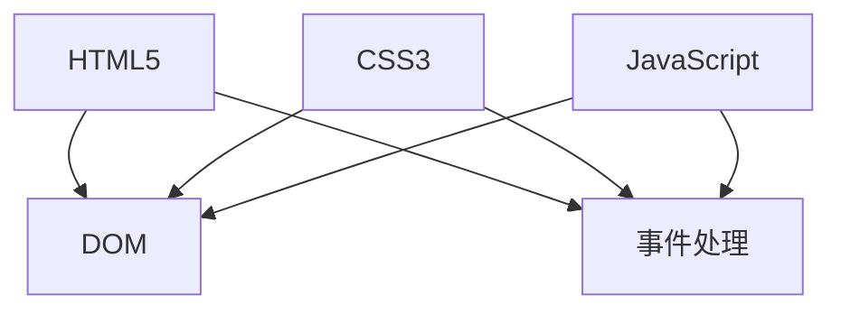

                 

关键词：Web前端、HTML5、CSS3、JavaScript、技术栈、开发工具、实际应用、未来展望

> 摘要：本文全面介绍了Web前端技术的核心组成部分——HTML5、CSS3和JavaScript，探讨了它们的基本概念、核心算法原理、数学模型和公式，并通过项目实践和实际应用场景展示了这些技术的实际应用效果。文章还对未来Web前端技术的发展趋势和面临的挑战进行了深入分析，为读者提供了丰富的学习资源和开发工具推荐。

## 1. 背景介绍

随着互联网的迅速发展，Web前端技术逐渐成为软件开发的重要组成部分。Web前端技术栈的核心组成部分包括HTML5、CSS3和JavaScript。这些技术不仅为用户提供了丰富的交互体验，还为开发人员提供了高效的工作方式。

HTML5是一种用于创建Web内容的语言，它是HTML的第五个版本，具有许多新特性和改进，如多媒体支持、本地存储和离线应用程序等。CSS3是一种用于描述Web页面样式和布局的语言，它提供了更多的样式和动画效果，使网页更加美观和动态。JavaScript是一种用于创建交互式Web页面的脚本语言，它使得网页具有响应性，并且可以实现复杂的逻辑和处理。

本文将深入探讨HTML5、CSS3和JavaScript的核心概念、算法原理、数学模型和公式，并通过实际项目实践和实际应用场景来展示这些技术的实际应用效果。最后，我们将分析未来Web前端技术的发展趋势和面临的挑战，为读者提供学习资源和开发工具推荐。

## 2. 核心概念与联系

### 2.1 HTML5

HTML5是HyperText Markup Language（超文本标记语言）的第五个版本，它于2014年正式发布。HTML5带来了许多新特性和改进，使Web开发更加便捷和高效。

**核心概念**：

- 标签：HTML5中引入了许多新标签，如`<article>`、`<section>`、`<nav>`、`<aside>`等，用于表示不同类型的文档内容。
- 媒体支持：HTML5支持嵌入音频和视频，无需使用Flash等第三方插件。
- 离线应用程序：HTML5提供了本地存储和离线应用程序功能，使得Web应用可以离线运行。
- 渲染引擎：HTML5使用了更先进的渲染引擎，如Webkit、Blink等，提高了网页的性能和兼容性。

**核心算法原理**：

HTML5的算法原理主要包括DOM（文档对象模型）和事件处理机制。DOM是一种将HTML文档表示为树形结构的模型，使得开发者可以方便地操作文档内容。事件处理机制使得Web页面具有交互性，如点击、滑动、拖动等操作。

### 2.2 CSS3

CSS3是Cascading Style Sheets（层叠样式表）的第三个版本，它为Web开发提供了更多的样式和动画效果。

**核心概念**：

- 选择器：CSS3引入了许多新选择器，如属性选择器、结构选择器、伪类选择器等，用于选择和样式化HTML元素。
- 动画：CSS3提供了CSS动画功能，使得网页元素可以实现平滑的动画效果。
- 响应式布局：CSS3提供了媒体查询功能，使得开发者可以根据不同设备尺寸和分辨率进行响应式布局设计。

**核心算法原理**：

CSS3的算法原理主要包括选择器匹配规则和样式规则应用。选择器匹配规则用于选择HTML元素，样式规则应用用于设置元素的样式属性。

### 2.3 JavaScript

JavaScript是一种用于创建交互式Web页面的脚本语言，它是Web前端开发的核心组成部分。

**核心概念**：

- 函数：JavaScript中的函数是一种可以重复使用的代码块，用于执行特定任务。
- 对象：JavaScript中的对象是一种包含属性和方法的实体，用于表示现实世界的实体和抽象概念。
- 事件处理：JavaScript的事件处理机制使得Web页面可以响应用户操作，如点击、按键等。

**核心算法原理**：

JavaScript的算法原理主要包括变量、数据类型、运算符、控制结构和函数。变量用于存储数据，数据类型用于定义数据的类型，运算符用于执行数学和逻辑运算，控制结构用于控制代码的执行顺序，函数用于封装和复用代码。

### 2.4 Mermaid 流程图

下面是HTML5、CSS3和JavaScript的核心概念和算法原理的Mermaid流程图：



## 3. 核心算法原理 & 具体操作步骤

### 3.1 算法原理概述

#### 3.1.1 HTML5

HTML5的核心算法原理主要包括DOM和事件处理机制。DOM将HTML文档表示为树形结构，使得开发者可以方便地操作文档内容。事件处理机制使得Web页面具有交互性，如点击、滑动、拖动等操作。

#### 3.1.2 CSS3

CSS3的核心算法原理主要包括选择器匹配规则和样式规则应用。选择器匹配规则用于选择HTML元素，样式规则应用用于设置元素的样式属性。

#### 3.1.3 JavaScript

JavaScript的核心算法原理主要包括变量、数据类型、运算符、控制结构和函数。变量用于存储数据，数据类型用于定义数据的类型，运算符用于执行数学和逻辑运算，控制结构用于控制代码的执行顺序，函数用于封装和复用代码。

### 3.2 算法步骤详解

#### 3.2.1 HTML5

1. 创建HTML文档结构。
2. 使用DOM操作文档内容。
3. 设置事件处理函数。

```javascript
// 创建HTML文档结构
const body = document.body;

// 使用DOM操作文档内容
const paragraph = document.createElement("p");
paragraph.textContent = "Hello, World!";
body.appendChild(paragraph);

// 设置事件处理函数
paragraph.addEventListener("click", function() {
    alert("Clicked!");
});
```

#### 3.2.2 CSS3

1. 编写CSS样式规则。
2. 应用样式规则到HTML元素。
3. 使用媒体查询进行响应式布局设计。

```css
/* 编写CSS样式规则 */
p {
    color: blue;
    font-size: 16px;
}

/* 应用样式规则到HTML元素 */
<p>Hello, CSS3!</p>

/* 使用媒体查询进行响应式布局设计 */
@media (max-width: 600px) {
    p {
        font-size: 12px;
    }
}
```

#### 3.2.3 JavaScript

1. 声明变量和数据类型。
2. 使用运算符进行数学和逻辑运算。
3. 编写控制结构和函数。

```javascript
// 声明变量和数据类型
let x = 5;
const y = 10;

// 使用运算符进行数学和逻辑运算
const sum = x + y;
const isEven = sum % 2 === 0;

// 编写控制结构和函数
if (isEven) {
    console.log("The sum is even.");
} else {
    console.log("The sum is odd.");
}

function greet(name) {
    console.log("Hello, " + name + "!");
}
```

### 3.3 算法优缺点

#### 3.3.1 HTML5

**优点**：

- 提供了更多的标签和功能，使得网页结构更加清晰。
- 改善了网页性能和兼容性。
- 支持离线应用程序和本地存储。

**缺点**：

- 学习曲线较陡峭，需要掌握更多的标签和属性。
- 旧版浏览器兼容性问题。

#### 3.3.2 CSS3

**优点**：

- 提供了更多的选择器和样式规则，使得网页样式更加丰富。
- 支持CSS动画和过渡效果，提高了网页的动态表现力。
- 改善了响应式布局设计。

**缺点**：

- CSS3动画和过渡效果可能对性能有影响。
- 旧版浏览器兼容性问题。

#### 3.3.3 JavaScript

**优点**：

- 提供了丰富的API和功能，使得网页交互性更强。
- 可以处理复杂的数据处理和逻辑处理。
- 支持模块化和组件化开发。

**缺点**：

- 学习曲线较陡峭，需要掌握语法和编程范式。
- 旧版浏览器兼容性问题。

### 3.4 算法应用领域

HTML5、CSS3和JavaScript广泛应用于各种Web前端开发领域，包括但不限于：

- 网站和网页设计。
- 交互式Web应用。
- 移动应用开发。
- 游戏开发。
- 数据可视化。

## 4. 数学模型和公式 & 详细讲解 & 举例说明

### 4.1 数学模型构建

在Web前端技术中，数学模型主要用于描述算法的性能和复杂性。以下是一个常见的数学模型——大O表示法（Big O notation）。

**大O表示法**：

大O表示法用于描述算法的时间复杂度和空间复杂度。它表示一个算法在最坏情况下的执行时间或内存占用与输入规模的关系。

**公式**：

\[ T(n) = O(f(n)) \]

其中，\( T(n) \) 表示算法的时间复杂度，\( f(n) \) 表示输入规模。

### 4.2 公式推导过程

以下是一个常见的算法——冒泡排序（Bubble Sort）的时间复杂度推导过程。

**冒泡排序算法**：

冒泡排序是一种简单的排序算法，它通过比较相邻元素的大小并进行交换，使较大的元素逐步移动到数组的末尾。

**推导过程**：

假设有数组 `arr`，包含 `n` 个元素。冒泡排序算法需要比较和交换 \( n-1 \) 次，每次比较的次数逐渐减少。

- 第1次比较：比较 \( n-1 \) 个元素。
- 第2次比较：比较 \( n-2 \) 个元素。
- ...
- 第\( n-1 \)次比较：比较 1 个元素。

总共比较次数为 \( (n-1) + (n-2) + ... + 1 \)，可以使用等差数列求和公式计算：

\[ \text{总比较次数} = \frac{(n-1)n}{2} \]

因此，冒泡排序算法的时间复杂度为：

\[ T(n) = O(\frac{n^2}{2}) = O(n^2) \]

### 4.3 案例分析与讲解

以下是一个使用冒泡排序算法对数组进行排序的示例。

```javascript
function bubbleSort(arr) {
    const n = arr.length;
    for (let i = 0; i < n - 1; i++) {
        for (let j = 0; j < n - 1 - i; j++) {
            if (arr[j] > arr[j + 1]) {
                [arr[j], arr[j + 1]] = [arr[j + 1], arr[j]];
            }
        }
    }
    return arr;
}

const arr = [5, 2, 9, 1, 5];
console.log("原始数组：", arr);
console.log("排序后数组：", bubbleSort(arr));
```

运行结果：

```
原始数组： [5, 2, 9, 1, 5]
排序后数组： [1, 2, 5, 5, 9]
```

## 5. 项目实践：代码实例和详细解释说明

### 5.1 开发环境搭建

为了实践HTML5、CSS3和JavaScript技术，我们需要搭建一个基本的开发环境。以下是一个简单的步骤：

1. 安装Node.js：从官方网站（https://nodejs.org/）下载并安装Node.js。
2. 安装代码编辑器：推荐使用Visual Studio Code（https://code.visualstudio.com/），可以从官方网站下载并安装。
3. 创建项目目录：在代码编辑器中创建一个名为 "web-frontend" 的项目目录。

### 5.2 源代码详细实现

以下是一个简单的Web前端项目，包括HTML、CSS和JavaScript文件。

**index.html**：

```html
<!DOCTYPE html>
<html lang="en">
<head>
    <meta charset="UTF-8">
    <meta name="viewport" content="width=device-width, initial-scale=1.0">
    <title>Web前端技术栈实践</title>
    <link rel="stylesheet" href="styles.css">
</head>
<body>
    <h1>Hello, Web前端!</h1>
    <p>这是一个简单的Web前端项目。</p>
    <button id="myButton">点击我</button>
    <script src="script.js"></script>
</body>
</html>
```

**styles.css**：

```css
/* 样式表 */
body {
    font-family: Arial, sans-serif;
    text-align: center;
}

h1 {
    color: blue;
}

p {
    color: green;
}

button {
    background-color: yellow;
    padding: 10px;
    font-size: 16px;
    cursor: pointer;
}

button:hover {
    background-color: orange;
}
```

**script.js**：

```javascript
// JavaScript脚本
document.addEventListener("DOMContentLoaded", function() {
    const button = document.getElementById("myButton");
    button.addEventListener("click", function() {
        alert("按钮被点击了！");
    });
});
```

### 5.3 代码解读与分析

#### 5.3.1 index.html

- `<!DOCTYPE html>`：声明文档类型和版本。
- `<html>`：定义HTML文档结构。
- `<head>`：包含文档的元数据，如字符集、标题和样式链接。
- `<title>`：定义文档的标题，显示在浏览器的标签栏中。
- `<link>`：链接外部样式表文件。
- `<body>`：包含文档的内容。
- `<h1>`：定义一级标题。
- `<p>`：定义段落。
- `<button>`：定义按钮元素。
- `<script>`：链接外部JavaScript文件。

#### 5.3.2 styles.css

- `body`：设置整个文档的样式。
- `h1`：设置一级标题的样式。
- `p`：设置段落的样式。
- `button`：设置按钮的样式。
- `button:hover`：设置鼠标悬停时按钮的样式。

#### 5.3.3 script.js

- `document.addEventListener("DOMContentLoaded", function() { ... })`：在文档加载完成后执行代码。
- `const button = document.getElementById("myButton")`：获取按钮元素。
- `button.addEventListener("click", function() { ... })`：为按钮添加点击事件处理函数。

### 5.4 运行结果展示

在浏览器中打开 "index.html" 文件，页面将显示一个标题 "Hello, Web前端!" 和一个按钮 "点击我"。点击按钮后，将弹出一个提示框显示 "按钮被点击了！"。

## 6. 实际应用场景

HTML5、CSS3和JavaScript在Web前端开发中具有广泛的应用场景。以下是一些典型的应用场景：

### 6.1 网站和网页设计

HTML5、CSS3和JavaScript可以用于创建各种类型的网站和网页，包括个人博客、企业网站、电子商务网站等。通过HTML5的标签和功能，可以构建清晰的网页结构；通过CSS3的样式规则和动画效果，可以设计出美观的网页样式；通过JavaScript的交互功能，可以增强网页的交互性和动态效果。

### 6.2 交互式Web应用

交互式Web应用（如在线办公软件、在线游戏、社交媒体等）需要丰富的交互功能和支持复杂逻辑处理。HTML5、CSS3和JavaScript提供了强大的功能，使得开发者可以轻松实现交互式功能，如拖放、表单验证、实时数据更新等。

### 6.3 移动应用开发

HTML5、CSS3和JavaScript可以用于开发移动应用，通过使用Web View组件，可以将Web页面嵌入移动应用中。开发者可以使用HTML5和CSS3构建响应式网页，使用JavaScript实现移动应用的交互逻辑，从而创建跨平台的移动应用。

### 6.4 游戏开发

HTML5和JavaScript可以用于开发Web游戏。通过使用HTML5的`<canvas>`标签，可以创建图形化的游戏场景，使用JavaScript实现游戏逻辑和交互功能。许多流行的Web游戏，如《Flappy Bird》和《2048》，都是使用HTML5和JavaScript开发的。

### 6.5 数据可视化

HTML5、CSS3和JavaScript可以用于创建数据可视化图表，如折线图、柱状图、饼图等。通过使用JavaScript库，如D3.js和Chart.js，可以方便地生成各种类型的图表，并将它们嵌入Web页面中，以便用户更好地理解和分析数据。

## 7. 工具和资源推荐

### 7.1 学习资源推荐

1. **MDN Web文档**（https://developer.mozilla.org/）：MDN提供了丰富的HTML5、CSS3和JavaScript文档，是学习Web前端技术的绝佳资源。
2. **W3Schools**（https://www.w3schools.com/）：W3Schools提供了详细的教程和示例代码，适合初学者入门。
3. **Egghead.io**（https://egghead.io/）：Egghead.io提供了高质量的免费视频教程，覆盖了Web前端技术的各个方面。

### 7.2 开发工具推荐

1. **Visual Studio Code**（https://code.visualstudio.com/）：Visual Studio Code是一个功能强大的代码编辑器，支持多种编程语言，适合Web前端开发。
2. **WebStorm**（https://www.jetbrains.com/webstorm/）：WebStorm是一个专业的Web前端开发工具，提供了丰富的功能，如代码智能提示、调试和自动化构建等。
3. **Webpack**（https://webpack.js.org/）：Webpack是一个模块打包工具，用于处理JavaScript、CSS和HTML文件，提高项目开发和部署的效率。

### 7.3 相关论文推荐

1. **"HTML5: A Standard for Web Applications"**：这篇论文详细介绍了HTML5的技术背景、核心特性和应用领域。
2. **"CSS3: Designing for the Modern Web"**：这篇论文探讨了CSS3的新特性和如何利用它们创建现代网页设计。
3. **"JavaScript: The Definitive Guide"**：这是一本关于JavaScript编程的经典书籍，涵盖了JavaScript的核心概念、语法和编程范式。

## 8. 总结：未来发展趋势与挑战

### 8.1 研究成果总结

HTML5、CSS3和JavaScript在Web前端技术领域取得了显著的成果。HTML5提供了更多的新标签和功能，使得网页结构更加清晰；CSS3提供了丰富的样式和动画效果，提高了网页的动态表现力；JavaScript提供了强大的交互功能和支持复杂逻辑处理，使得网页具有更高的交互性和动态效果。这些技术不仅推动了Web前端技术的发展，还为开发者提供了更加便捷和高效的工作方式。

### 8.2 未来发展趋势

未来Web前端技术的发展趋势包括：

1. **Web组件和微前端架构**：Web组件和微前端架构使得开发者可以构建更模块化和可重用的Web应用，提高开发效率和项目可维护性。
2. **WebAssembly**：WebAssembly是一种新的编程语言，它提供了更高效的代码执行和更低的延迟，有望在Web前端领域得到广泛应用。
3. **人工智能和机器学习**：人工智能和机器学习技术将逐步融入Web前端，为开发者提供更智能和个性化的交互体验。

### 8.3 面临的挑战

未来Web前端技术发展也面临一些挑战：

1. **性能优化**：随着网页功能越来越复杂，性能优化成为了一个重要的挑战。开发者需要关注网页的加载速度、响应时间和内存占用等问题。
2. **浏览器兼容性**：不同浏览器对Web前端技术的支持程度不同，开发者需要处理不同浏览器的兼容性问题，以确保网页在各种浏览器中都能正常运行。
3. **安全性和隐私保护**：随着网络安全问题的日益突出，Web前端开发者需要关注安全性和隐私保护，确保用户数据的安全。

### 8.4 研究展望

未来Web前端技术的研究重点包括：

1. **性能优化**：研究如何提高网页的加载速度、响应时间和内存占用，为用户提供更好的体验。
2. **Web组件和微前端架构**：研究如何构建更模块化和可重用的Web应用，提高开发效率和项目可维护性。
3. **人工智能和机器学习**：研究如何将人工智能和机器学习技术融入Web前端，为开发者提供更智能和个性化的交互体验。

## 9. 附录：常见问题与解答

### 9.1 什么是HTML5？

HTML5是一种用于创建Web内容的语言，它是HTML的第五个版本，具有许多新特性和改进，如多媒体支持、本地存储和离线应用程序等。

### 9.2 什么是CSS3？

CSS3是一种用于描述Web页面样式和布局的语言，它提供了更多的样式和动画效果，使网页更加美观和动态。

### 9.3 什么是JavaScript？

JavaScript是一种用于创建交互式Web页面的脚本语言，它使得网页具有响应性，并且可以实现复杂的逻辑和处理。

### 9.4 如何搭建Web前端开发环境？

搭建Web前端开发环境的步骤如下：

1. 安装Node.js。
2. 安装代码编辑器，如Visual Studio Code。
3. 创建项目目录。
4. 安装相关的开发工具和依赖，如Webpack。

### 9.5 如何实现响应式布局？

实现响应式布局的方法包括：

1. 使用媒体查询（`@media`）根据不同设备尺寸和分辨率应用不同的样式规则。
2. 使用灵活的布局模式，如Flexbox和Grid。
3. 使用百分比和相对单位（如px、em、rem）设置元素的尺寸。

### 9.6 如何处理浏览器兼容性问题？

处理浏览器兼容性问题的方法包括：

1. 使用CSS预处理工具，如Sass或Less。
2. 使用浏览器兼容性库，如Babel。
3. 使用Polyfill库，如Polyfill.io。
4. 使用浏览器的开发者工具进行测试和调试。

### 9.7 如何提高网页性能？

提高网页性能的方法包括：

1. 使用缓存机制，如浏览器缓存和CDN缓存。
2. 优化图片和媒体文件，如压缩和懒加载。
3. 使用异步加载和延迟加载。
4. 优化代码，如去除无用代码和压缩CSS和JavaScript文件。

### 9.8 什么是Web组件？

Web组件是一种用于构建可重用和模块化Web应用的组件化技术，包括HTML模板、样式和脚本。Web组件使得开发者可以轻松创建和复用UI组件，提高开发效率和项目可维护性。

