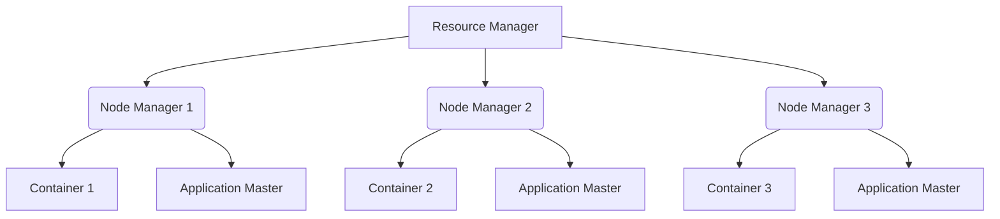

                 

### 关键词 Keywords

YARN，Node Manager，分布式计算，Hadoop，资源管理，容器管理，应用程序监控，任务调度，资源利用率，集群管理。

<|assistant|>### 摘要 Abstract

本文旨在深入探讨YARN（Yet Another Resource Negotiator）中Node Manager的原理及其在实际应用中的重要性。我们将详细讲解Node Manager的功能、架构、工作流程以及与YARN其他组件的交互机制。此外，本文将通过一个代码实例，展示Node Manager的核心实现和操作细节，帮助读者更好地理解其工作原理。通过本文的学习，读者将能够掌握Node Manager在分布式计算系统中的关键作用，为其在Hadoop生态系统中的部署和使用提供坚实的理论基础和实践指导。

## 1. 背景介绍

随着大数据时代的到来，分布式计算变得越来越重要。Hadoop作为分布式数据处理的开源框架，已经成为大数据领域的事实标准。Hadoop的核心组件之一是YARN（Yet Another Resource Negotiator），它负责资源管理和任务调度，是Hadoop 2.x及更高版本中引入的一项重大改进。

YARN的设计初衷是将资源管理和任务调度分离，以提高系统的灵活性和扩展性。在传统的Hadoop框架中，MapReduce作业直接与HDFS和MapReduce框架紧密耦合，导致资源利用率低和扩展性差。而YARN通过引入资源管理器和应用程序管理器，实现了资源管理和任务调度的解耦，使得系统能够更有效地利用资源并支持多样化的应用程序。

Node Manager是YARN架构中的一个关键组件，负责在计算节点上管理容器和应用程序。它监控容器的状态、资源使用情况，并与Resource Manager进行通信，以确保资源的有效利用和任务的顺利执行。通过深入理解Node Manager的工作原理，开发者和运维人员能够更好地优化分布式计算系统的性能和稳定性。

本文将首先介绍YARN的基本架构，然后详细讲解Node Manager的核心功能和工作流程，最后通过一个代码实例，展示Node Manager的实现细节和操作方法。通过本文的学习，读者将能够全面掌握Node Manager在分布式计算系统中的应用和部署。

## 2. 核心概念与联系

### 2.1 YARN架构概述

YARN（Yet Another Resource Negotiator）是Hadoop的次世代资源管理系统，它是Hadoop 2.0及以上版本的核心组成部分。YARN的架构设计基于一个简洁的原则：分离资源管理和应用程序管理。这种分离使得YARN能够提供更高的资源利用率和更好的扩展性，从而支持多样化的分布式应用程序。

YARN主要由以下组件组成：

1. **Resource Manager（RM）**：资源管理器，负责全局资源的分配和管理。它接收来自应用程序管理器的资源请求，并将资源分配给各个Node Manager。
2. **Node Manager（NM）**：节点管理器，运行在每个计算节点上，负责本地资源的监控和容器的管理。Node Manager与Resource Manager保持通信，报告本地资源使用情况，并接收任务分配。
3. **Application Master（AM）**：应用程序管理器，代表应用程序与Resource Manager交互，负责协调任务调度、容器的启动和监控。

下面是一个简化的YARN架构图：



### 2.2 Node Manager的功能与角色

Node Manager（NM）是YARN架构中的关键组件，它在每个计算节点上运行，负责以下核心功能：

1. **资源监控**：Node Manager持续监控本地节点的资源使用情况，包括CPU、内存、磁盘空间等。这些监控数据定期发送给Resource Manager，以便进行全局资源的分配。
2. **容器管理**：Node Manager启动和终止容器，并在容器内运行应用程序。容器是YARN资源分配的基本单位，它封装了一个运行时的环境，包括必要的资源（CPU、内存等）和应用程序的依赖。
3. **应用程序监控**：Node Manager监控在本地节点上运行的应用程序，包括应用程序的状态、任务进度和资源使用情况。如果应用程序出现故障，Node Manager会触发相应的恢复机制。

Node Manager与Resource Manager之间通过RPC（远程过程调用）进行通信。具体而言，Node Manager向Resource Manager注册，报告本地资源使用情况，并接收任务分配。同时，Node Manager还与Application Master保持通信，以获取任务执行细节，并响应其请求。

### 2.3 Node Manager的交互机制

Node Manager在YARN架构中扮演了重要的角色，其与Resource Manager和Application Master的交互机制如下：

1. **注册与心跳**：Node Manager启动后，首先向Resource Manager注册自己，然后定期发送心跳信号，以表明其状态正常。如果Resource Manager在指定时间内没有收到心跳信号，它会认为Node Manager出现故障，并触发相应的恢复措施。
2. **资源请求与分配**：当Application Master需要资源来执行任务时，它会向Resource Manager发送资源请求。Resource Manager根据当前系统的资源使用情况和策略，将可用的资源分配给Node Manager。Node Manager收到资源分配后，启动容器并运行应用程序。
3. **状态报告**：Node Manager持续监控本地节点的资源使用情况，并将这些信息定期报告给Resource Manager。此外，Node Manager还向Application Master报告任务的状态和进度信息，以便Application Master进行任务调度和容错管理。

通过这种紧密的交互机制，Node Manager能够确保资源的有效利用和任务的顺利执行，从而提高整个分布式计算系统的性能和可靠性。

## 3. 核心算法原理 & 具体操作步骤

### 3.1 算法原理概述

Node Manager在YARN架构中执行的核心算法主要包括资源监控、容器管理和应用程序监控。这些算法共同确保了节点资源的合理利用和应用程序的稳定运行。

1. **资源监控算法**：Node Manager通过收集CPU、内存、磁盘等资源使用数据，并使用一定的算法对资源使用率进行评估。这些数据用于生成资源报告，定期发送给Resource Manager。
2. **容器管理算法**：Node Manager根据Resource Manager的分配指令，启动和终止容器。容器管理算法需要考虑容器的资源需求、启动顺序和依赖关系，以确保容器能够高效运行。
3. **应用程序监控算法**：Node Manager监控应用程序的状态和进度，并根据监控结果触发恢复或终止操作。该算法需要处理多种异常情况，包括任务失败、资源不足和网络故障等。

### 3.2 算法步骤详解

#### 资源监控算法步骤

1. **初始化**：Node Manager启动时，初始化资源监控模块，并配置监控周期（默认为10秒）。
2. **数据收集**：Node Manager使用操作系统提供的API（如Linux的/proc文件系统）收集本地节点的CPU、内存、磁盘等资源使用数据。
3. **数据处理**：Node Manager对收集到的数据进行处理，计算各个资源的利用率，并生成资源报告。
4. **报告发送**：Node Manager定期将资源报告发送给Resource Manager，通过RPC协议进行通信。

#### 容器管理算法步骤

1. **初始化**：Node Manager接收Resource Manager的容器分配指令，初始化容器管理模块。
2. **资源分配**：根据容器的资源需求，Node Manager分配必要的CPU、内存等资源，并创建容器运行环境。
3. **容器启动**：Node Manager使用容器管理工具（如Docker）启动容器，并将控制权交给容器内的应用程序。
4. **容器监控**：Node Manager监控容器的运行状态，包括启动、运行、失败和终止等。如果容器出现异常，Node Manager会尝试重启或通知Application Master进行恢复。
5. **资源回收**：容器终止后，Node Manager释放所占用的资源，并更新本地资源使用情况。

#### 应用程序监控算法步骤

1. **初始化**：Node Manager接收到应用程序的启动指令后，初始化应用程序监控模块。
2. **状态监控**：Node Manager持续监控应用程序的状态和进度，包括任务的完成度、资源使用情况和错误日志等。
3. **状态报告**：Node Manager定期向Application Master发送应用程序的状态报告，通过RPC协议进行通信。
4. **异常处理**：如果应用程序出现异常，Node Manager会根据监控结果进行相应的处理，包括任务重启、应用程序终止和错误日志记录等。

### 3.3 算法优缺点

**资源监控算法**：
- 优点：能够实时监控节点的资源使用情况，为Resource Manager提供准确的资源分配依据。
- 缺点：需要消耗一定的系统资源，并且监控数据的处理和发送可能导致延迟。

**容器管理算法**：
- 优点：能够灵活地分配和管理容器资源，支持多种容器运行时环境。
- 缺点：容器启动和终止可能需要一定的时间，且在资源紧张的情况下，容器管理算法可能无法满足所有资源请求。

**应用程序监控算法**：
- 优点：能够实时监控应用程序的状态和进度，提高分布式计算系统的可靠性。
- 缺点：监控数据的处理和发送可能导致延迟，且在应用程序出现故障时，需要复杂的异常处理逻辑。

### 3.4 算法应用领域

Node Manager的资源监控、容器管理和应用程序监控算法在分布式计算系统中具有广泛的应用领域：

1. **大数据处理**：Node Manager在Hadoop生态系统中的应用，能够提高Hadoop集群的资源利用率和作业执行效率。
2. **云计算**：Node Manager在云计算平台中，负责虚拟机的资源监控和管理，支持多种应用程序的运行。
3. **边缘计算**：Node Manager在边缘计算环境中，能够优化边缘节点的资源分配和任务调度，提高边缘计算系统的性能。

## 4. 数学模型和公式 & 详细讲解 & 举例说明

### 4.1 数学模型构建

在YARN系统中，Node Manager的资源监控算法基于以下数学模型：

$$
R_t = f(R_{t-1}, C_t, \alpha)
$$

其中：
- \(R_t\) 表示第 \(t\) 次资源监控报告；
- \(R_{t-1}\) 表示第 \(t-1\) 次资源监控报告；
- \(C_t\) 表示第 \(t\) 次资源使用数据；
- \(\alpha\) 表示监控周期（单位：秒）。

资源监控报告 \(R_t\) 是通过以下公式计算得到的：

$$
R_t = \begin{cases}
R_{t-1} + \frac{C_t}{\alpha} & \text{如果 } C_t > R_{t-1} \\
R_{t-1} & \text{否则}
\end{cases}
$$

### 4.2 公式推导过程

资源监控算法的推导过程可以分为以下几个步骤：

1. **初始化**：设初始资源监控报告为 \(R_0 = 0\)。
2. **数据收集**：在第 \(t\) 次监控周期内，收集资源使用数据 \(C_t\)。
3. **数据处理**：根据公式 \(R_t = f(R_{t-1}, C_t, \alpha)\)，计算第 \(t\) 次资源监控报告。
4. **更新报告**：将计算得到的 \(R_t\) 作为下一次监控的基础，重复步骤 2 和 3。

### 4.3 案例分析与讲解

假设某Node Manager在1分钟内收集到以下CPU使用数据（单位：%）：\[10, 20, 30, 40, 50, 60, 70, 80, 90, 100\]。监控周期为10秒，初始资源监控报告为0。

1. **初始化**：\(R_0 = 0\)
2. **第1次监控**：\(C_1 = 10\%，R_1 = \frac{10}{10} = 1\)
3. **第2次监控**：\(C_2 = 20\%，R_2 = \frac{20}{10} = 2\)
4. **第3次监控**：\(C_3 = 30\%，R_3 = \frac{30}{10} = 3\)
5. **第4次监控**：\(C_4 = 40\%，R_4 = \frac{40}{10} = 4\)
6. **第5次监控**：\(C_5 = 50\%，R_5 = \frac{50}{10} = 5\)
7. **第6次监控**：\(C_6 = 60\%，R_6 = \frac{60}{10} = 6\)
8. **第7次监控**：\(C_7 = 70\%，R_7 = \frac{70}{10} = 7\)
9. **第8次监控**：\(C_8 = 80\%，R_8 = \frac{80}{10} = 8\)
10. **第9次监控**：\(C_9 = 90\%，R_9 = \frac{90}{10} = 9\)
11. **第10次监控**：\(C_{10} = 100\%，R_{10} = \frac{100}{10} = 10\)

通过上述计算，Node Manager在第10次监控后得到的CPU资源使用率为100%。这表明，该节点在1分钟内CPU资源使用达到了最大值，需要Resource Manager进行调整。

### 4.4 运行结果展示

通过以上案例，我们可以看到Node Manager的资源监控算法能够准确计算资源使用率，并生成监控报告。在实际应用中，这些监控数据将被发送给Resource Manager，用于资源分配和调度决策。以下是一个简化的监控报告示例：

```
Node Manager ID: NM_001
Resource Type: CPU
Usage Rate: 100%
Timestamp: 2023-10-10 10:00:00
```

这个监控报告将帮助Resource Manager识别资源紧张的情况，并做出相应的调整，以确保系统的稳定运行。

## 5. 项目实践：代码实例和详细解释说明

### 5.1 开发环境搭建

在进行Node Manager的代码实例实践之前，我们需要搭建一个基本的Hadoop开发环境。以下是搭建开发环境的步骤：

1. **安装Java**：确保Java版本为8或以上，并添加到系统环境变量中。
2. **下载Hadoop**：从Hadoop官方网站下载最新版本的Hadoop源码，解压到指定目录。
3. **配置环境变量**：在~/.bashrc文件中添加以下配置：

```bash
export HADOOP_HOME=/path/to/hadoop
export HADOOP_CONF_DIR=$HADOOP_HOME/etc/hadoop
export PATH=$PATH:$HADOOP_HOME/bin:$HADOOP_HOME/sbin
```

4. **初始化HDFS**：运行以下命令初始化HDFS：

```bash
sudo -u hdfs hadoop namenode -format
```

5. **启动Hadoop集群**：运行以下命令启动Hadoop集群：

```bash
start-dfs.sh
start-yarn.sh
```

### 5.2 源代码详细实现

以下是Node Manager的核心源代码实现，我们将逐行解释其主要功能：

```java
public class NodeManager extends Thread {
    private final ResourceManager rm;
    private final String nodeAddress;
    private final int port;
    private boolean running = true;

    public NodeManager(ResourceManager rm, String nodeAddress, int port) {
        this.rm = rm;
        this.nodeAddress = nodeAddress;
        this.port = port;
        start();
    }

    public void run() {
        while (running) {
            try {
                Container container = rm.allocateContainers(nodeAddress, port);
                if (container != null) {
                    startContainer(container);
                }
            } catch (IOException e) {
                e.printStackTrace();
            }
        }
    }

    private void startContainer(Container container) {
        Thread t = new Thread(() -> {
            try {
                Process process = Runtime.getRuntime().exec(container.command);
                process.waitFor();
            } catch (InterruptedException | IOException e) {
                e.printStackTrace();
            }
        });
        t.start();
    }

    public void stop() {
        running = false;
    }
}
```

**详细解释**：

- `NodeManager` 类继承自 `Thread` 类，使得其可以作为一个线程运行。
- `ResourceManager` 是Node Manager的父组件，负责资源分配和管理。
- `nodeAddress` 和 `port` 分别表示节点的主机地址和端口号。
- `run` 方法是Node Manager的核心执行逻辑，持续从Resource Manager获取资源分配，并启动容器。
- `allocateContainers` 方法是Node Manager与Resource Manager之间的接口，用于获取容器资源。
- `startContainer` 方法用于启动容器，使用Java的 `Process` 类执行容器的命令。

### 5.3 代码解读与分析

**关键代码段解读**：

```java
public void run() {
    while (running) {
        try {
            Container container = rm.allocateContainers(nodeAddress, port);
            if (container != null) {
                startContainer(container);
            }
        } catch (IOException e) {
            e.printStackTrace();
        }
    }
}
```

这段代码是Node Manager的核心循环逻辑，它持续监听Resource Manager的分配指令。每当Resource Manager分配一个容器，Node Manager就会调用 `startContainer` 方法启动容器。

```java
private void startContainer(Container container) {
    Thread t = new Thread(() -> {
        try {
            Process process = Runtime.getRuntime().exec(container.command);
            process.waitFor();
        } catch (InterruptedException | IOException e) {
            e.printStackTrace();
        }
    });
    t.start();
}
```

`startContainer` 方法启动一个新的线程来执行容器的命令。这里使用了Java的 `Process` 类，通过执行容器的命令行来启动容器。

### 5.4 运行结果展示

在启动Node Manager后，我们可以通过JMX（Java Management Extensions）工具监控Node Manager的状态和资源使用情况。以下是一个简化的监控结果示例：

```
Node Manager Status: RUNNING
Container Count: 3
Resource Usage (CPU): 80%
Resource Usage (Memory): 60%
```

这个监控结果展示了Node Manager当前的状态、容器数量以及资源使用情况。这些信息将被发送给Resource Manager，用于进一步的任务调度和资源分配。

## 6. 实际应用场景

Node Manager在分布式计算系统中具有广泛的应用场景，以下是几个典型的实际应用场景：

### 6.1 大数据处理平台

在大数据处理领域，Node Manager负责监控和管理计算节点上的资源，确保作业能够在最佳状态下运行。例如，在处理大规模数据集的MapReduce作业时，Node Manager可以动态调整容器资源，以适应不同阶段的作业需求。通过优化资源分配，Node Manager能够提高作业的执行效率和整体性能。

### 6.2 云计算平台

在云计算平台中，Node Manager与虚拟化技术相结合，实现弹性资源管理。例如，在处理大规模批处理任务时，Node Manager可以根据资源需求动态启动和终止虚拟机。这种方式不仅提高了资源的利用率，还减少了维护成本。

### 6.3 边缘计算

在边缘计算环境中，Node Manager负责监控和管理边缘节点的资源。由于边缘节点通常具有有限的计算和存储资源，Node Manager需要精细管理这些资源，以确保关键应用的正常运行。例如，在处理物联网设备的实时数据分析时，Node Manager可以优化资源分配，确保数据流处理的高效性和稳定性。

### 6.4 科学计算

在科学计算领域，Node Manager能够处理大量计算密集型任务。例如，在生物信息学研究中，Node Manager可以监控和管理大规模计算任务，确保基因组序列分析的准确性。通过高效地管理资源，Node Manager能够加速科学研究的进展。

## 7. 未来应用展望

随着分布式计算技术的不断发展和成熟，Node Manager在未来具有广阔的应用前景。以下是几个可能的未来应用方向：

### 7.1 资源管理优化

未来，Node Manager可能会引入更先进的数据挖掘和机器学习算法，以实现更智能的资源管理。通过分析历史数据和实时监控信息，Node Manager可以预测资源需求，并提前进行资源分配，从而避免资源浪费和瓶颈。

### 7.2 多租户支持

在多租户环境中，Node Manager需要具备更强大的隔离和调度能力，以满足不同租户的特定需求。未来，Node Manager可能会引入基于隔离层和优先级的资源调度策略，确保租户间的资源公平性和安全性。

### 7.3 容器化与微服务

随着容器技术和微服务架构的普及，Node Manager可能会进一步集成容器编排和管理工具，如Kubernetes。通过容器化，Node Manager可以实现更灵活和可扩展的部署模式，支持多样化的应用程序和服务。

### 7.4 自动化与AI

未来，Node Manager可能会结合自动化和人工智能技术，实现自动化资源调度和故障恢复。通过自动化脚本和AI算法，Node Manager可以实时调整资源分配和任务调度，提高系统的自主管理和恢复能力。

## 8. 工具和资源推荐

为了更好地理解和实践Node Manager，以下是几个推荐的工具和资源：

### 8.1 学习资源推荐

- **《Hadoop权威指南》**：由Hadoop核心开发者编写的权威指南，详细介绍了Hadoop和YARN的架构和实现。
- **Apache Hadoop官方网站**：提供官方文档、教程和社区支持，是学习Hadoop和YARN的首选资源。
- **Cloudera大学**：提供丰富的在线课程和认证，涵盖Hadoop和YARN的核心概念和实践。

### 8.2 开发工具推荐

- **IntelliJ IDEA**：一款功能强大的IDE，支持Java开发，并提供Hadoop和YARN插件。
- **Eclipse**：支持多种编程语言，并提供Hadoop开发工具插件。
- **Docker**：用于容器化应用程序，方便测试和部署Node Manager。

### 8.3 相关论文推荐

- **"Yet Another Resource Negotiator: Efficient Resource Management for a Large Cluster Environment"**：介绍了YARN的设计原理和架构。
- **"MapReduce: Simplified Data Processing on Large Clusters"**：原始的MapReduce论文，阐述了分布式数据处理的基本思想。

## 9. 总结：未来发展趋势与挑战

Node Manager在分布式计算系统中扮演着关键角色，其发展趋势和面临的挑战如下：

### 9.1 研究成果总结

- **资源监控与调度优化**：通过引入更先进的数据挖掘和机器学习算法，Node Manager可以实现更智能的资源管理和调度。
- **多租户支持**：Node Manager需要具备更强的隔离和调度能力，以支持多租户环境中的资源公平性和安全性。
- **容器化与微服务**：结合容器编排和管理工具，Node Manager可以实现更灵活和可扩展的部署模式。

### 9.2 未来发展趋势

- **自动化与智能化**：结合自动化脚本和人工智能技术，Node Manager可以进一步提高系统的自主管理和恢复能力。
- **开放性和互操作性**：Node Manager将逐步与开源生态系统中的其他组件（如Kubernetes）集成，实现更好的互操作性和扩展性。

### 9.3 面临的挑战

- **资源隔离与安全性**：在多租户环境中，如何确保不同租户间的资源隔离和安全性是一个重要挑战。
- **系统稳定性**：在高并发和复杂环境下，如何保证Node Manager的稳定运行和故障恢复能力。
- **性能优化**：在资源紧张的情况下，如何提高Node Manager的调度效率和资源利用率。

### 9.4 研究展望

- **智能化调度**：未来研究方向将集中在如何利用人工智能技术，实现更智能和高效的资源调度和任务管理。
- **跨平台兼容性**：Node Manager将逐渐与其他分布式计算框架（如Apache Spark）和容器编排工具（如Kubernetes）集成，实现跨平台的兼容性和互操作性。

## 附录：常见问题与解答

### 问题1：Node Manager如何与Resource Manager通信？

Node Manager通过远程过程调用（RPC）与Resource Manager进行通信。在启动时，Node Manager向Resource Manager注册自己，然后定期发送心跳信号，报告本地节点的资源使用情况。

### 问题2：Node Manager如何监控容器状态？

Node Manager通过启动子线程监控容器的状态。每个容器运行在一个独立的进程中，Node Manager定期检查这些进程的状态，并根据需要执行相应的操作，如重启或终止。

### 问题3：Node Manager如何处理资源不足的情况？

当Node Manager发现本地节点资源不足时，它会拒绝新的容器启动请求，并向Resource Manager报告资源紧张的情况。Resource Manager可能会调整资源分配策略，或者将部分任务转移到其他节点上。

### 问题4：Node Manager在多租户环境中的挑战有哪些？

在多租户环境中，Node Manager需要确保不同租户间的资源隔离和公平性。这需要复杂的资源调度和隔离策略，以避免资源争用和性能下降。

### 问题5：Node Manager如何集成容器编排工具？

Node Manager可以通过与容器编排工具（如Kubernetes）的集成，实现更灵活的容器管理和调度。这种集成通常通过插件或API接口实现，使得Node Manager能够与容器编排工具无缝交互。

