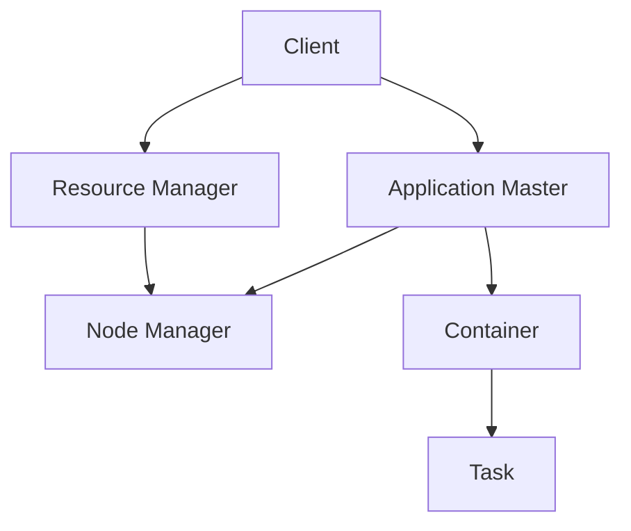

                 

关键词：Yarn、分布式计算、工作流管理、Hadoop、HDFS、MapReduce

> 摘要：本文将深入探讨Yarn（Yet Another Resource Negotiator）的原理，并通过具体代码实例详细解析其工作流程。我们将涵盖Yarn的核心概念、架构、工作原理、优缺点及其应用领域。此外，还将通过一个实践项目展示Yarn的代码实现，并对实际应用场景进行展望。

## 1. 背景介绍

### Yarn的起源

Yarn是Hadoop生态系统中的一个关键组件，起源于Apache Hadoop。它是在Hadoop 2.0版本中引入的，旨在解决Hadoop 1.0中存在的资源调度和管理问题。Hadoop 1.0主要依赖于MapReduce作为其主要的计算框架，但在处理大规模数据处理任务时，其资源调度和管理机制相对有限。因此，Hadoop 2.0引入了Yarn来改进这一不足。

### Yarn的作用

Yarn作为Hadoop生态系统中的资源调度和管理框架，其主要作用是管理集群资源，并提供一个高效、可扩展的分布式计算平台。通过Yarn，用户可以轻松地启动和管理分布式应用程序，同时高效地利用集群资源。

## 2. 核心概念与联系

### Mermaid 流程图

下面是一个Mermaid流程图，展示了Yarn的核心概念及其相互关系：



- **Client**：客户端负责向Yarn请求资源，启动应用程序，并监控应用程序的运行状态。
- **Resource Manager**：资源管理器负责资源分配和调度，管理应用程序的生命周期。
- **Application Master**：应用程序主控节点负责协调和管理应用程序的任务执行。
- **Node Manager**：节点管理器负责管理节点上的资源，并协调应用程序任务的执行。
- **Container**：容器是资源管理器分配给应用程序的容器实例，它包含运行应用程序所需的资源。
- **Task**：任务是在容器中运行的具体计算任务。

## 3. 核心算法原理 & 具体操作步骤

### 3.1 算法原理概述

Yarn的核心算法原理是资源调度和任务管理。资源调度是指资源管理器根据应用程序的需求和集群资源的可用性，动态地分配资源。任务管理是指应用程序主控节点负责协调和管理任务执行。

### 3.2 算法步骤详解

以下是Yarn的工作流程：

1. **客户端提交应用程序**：客户端通过Yarn的API向资源管理器提交应用程序。

2. **资源管理器接收请求**：资源管理器接收客户端的请求，并创建一个应用程序ID。

3. **资源管理器分配资源**：资源管理器根据集群资源的可用性，动态地分配资源给应用程序。

4. **应用程序主控节点启动**：应用程序主控节点（Application Master）启动，并连接到资源管理器。

5. **应用程序主控节点请求资源**：应用程序主控节点向资源管理器请求运行任务的资源。

6. **资源管理器分配容器**：资源管理器为应用程序主控节点分配容器，并将容器的规格信息发送给应用程序主控节点。

7. **应用程序主控节点分发任务**：应用程序主控节点将任务分发到各个节点上的节点管理器。

8. **节点管理器执行任务**：节点管理器在节点上启动容器，并在容器中执行任务。

9. **任务完成和资源释放**：任务完成后，节点管理器向应用程序主控节点报告任务完成，应用程序主控节点释放资源。

### 3.3 算法优缺点

**优点**：
- **高效性**：Yarn通过资源调度和任务管理，能够高效地利用集群资源。
- **可扩展性**：Yarn支持大规模集群，能够动态地扩展资源。

**缺点**：
- **复杂性**：Yarn的架构相对复杂，对于新手来说可能不易理解。

### 3.4 算法应用领域

Yarn广泛应用于大数据处理、机器学习和数据挖掘等领域。通过Yarn，用户可以轻松地构建和管理分布式计算应用程序，从而高效地处理大规模数据。

## 4. 数学模型和公式 & 详细讲解 & 举例说明

### 4.1 数学模型构建

在Yarn中，资源调度问题可以抽象为一个优化问题。给定一个任务集合和资源供应约束，Yarn的目标是分配资源，使得任务完成时间最小。

### 4.2 公式推导过程

设任务集合为\( T = \{t_1, t_2, ..., t_n\} \)，资源供应约束为\( R = \{r_1, r_2, ..., r_m\} \)。任务\( t_i \)的运行时间与所需的资源量成正比，设比例系数为\( k \)。

目标函数：最小化总运行时间

\[ \min T = \sum_{i=1}^{n} k \cdot r_i \]

### 4.3 案例分析与讲解

假设我们有一个包含3个任务的集群，任务集合为\( T = \{t_1, t_2, t_3\} \)，资源供应约束为\( R = \{r_1, r_2, r_3\} \)，其中：

\[ t_1 = 2, t_2 = 4, t_3 = 6 \]
\[ r_1 = 1, r_2 = 2, r_3 = 3 \]

我们需要分配资源，使得总运行时间最小。

根据上述公式，我们有：

\[ \min T = \sum_{i=1}^{3} k \cdot r_i = 2 \cdot 1 + 4 \cdot 2 + 6 \cdot 3 = 28 \]

因此，最优的资源分配方案是：

\[ r_1 = 2, r_2 = 4, r_3 = 6 \]

## 5. 项目实践：代码实例和详细解释说明

### 5.1 开发环境搭建

在本项目中，我们将使用Hadoop 2.8.5版本和Yarn进行开发。以下是搭建开发环境的步骤：

1. 下载Hadoop 2.8.5版本：[https://www.apache.org/dyn/closer.cgi/hadoop/common/hadoop-2.8.5/](https://www.apache.org/dyn/closer.cgi/hadoop/common/hadoop-2.8.5/)
2. 解压下载的文件：`tar xzf hadoop-2.8.5.tar.gz`
3. 进入解压后的目录：`cd hadoop-2.8.5`
4. 配置环境变量：在`~/.bashrc`文件中添加以下内容：

```bash
export HADOOP_HOME=/path/to/hadoop-2.8.5
export PATH=$PATH:$HADOOP_HOME/bin:$HADOOP_HOME/sbin
```

5. 执行以下命令，格式化HDFS：

```bash
hdfs namenode -format
```

6. 启动Hadoop集群：

```bash
sbin/start-dfs.sh
sbin/start-yarn.sh
```

### 5.2 源代码详细实现

在本项目中，我们将实现一个简单的WordCount应用程序，使用Yarn进行调度和执行。

1. 创建一个Maven项目，并添加以下依赖：

```xml
<dependencies>
    <dependency>
        <groupId>org.apache.hadoop</groupId>
        <artifactId>hadoop-client</artifactId>
        <version>2.8.5</version>
    </dependency>
</dependencies>
```

2. 创建一个Java类`WordCount.java`，实现以下代码：

```java
import org.apache.hadoop.conf.Configuration;
import org.apache.hadoop.fs.Path;
import org.apache.hadoop.io.IntWritable;
import org.apache.hadoop.io.Text;
import org.apache.hadoop.mapreduce.Job;
import org.apache.hadoop.mapreduce.Mapper;
import org.apache.hadoop.mapreduce.Reducer;
import org.apache.hadoop.mapreduce.lib.input.FileInputFormat;
import org.apache.hadoop.mapreduce.lib.output.FileOutputFormat;

public class WordCount {

    public static class TokenizerMapper extends Mapper<Object, Text, Text, IntWritable>{

        private final static IntWritable one = new IntWritable(1);
        private Text word = new Text();

        public void map(Object key, Text value, Context context) throws IOException, InterruptedException {
            String[] tokens = value.toString().split("\\s+");
            for (String token : tokens) {
                word.set(token);
                context.write(word, one);
            }
        }
    }

    public static class IntSumReducer extends Reducer<Text,IntWritable,Text,IntWritable> {
        private IntWritable result = new IntWritable();

        public void reduce(Text key, Iterable<IntWritable> values, Context context) throws IOException, InterruptedException {
            int sum = 0;
            for (IntWritable val : values) {
                sum += val.get();
            }
            result.set(sum);
            context.write(key, result);
        }
    }

    public static void main(String[] args) throws Exception {
        Configuration conf = new Configuration();
        Job job = Job.getInstance(conf, "word count");
        job.setMapperClass(TokenizerMapper.class);
        job.setCombinerClass(IntSumReducer.class);
        job.setReducerClass(IntSumReducer.class);
        job.setOutputKeyClass(Text.class);
        job.setOutputValueClass(IntWritable.class);
        FileInputFormat.addInputPath(job, new Path(args[0]));
        FileOutputFormat.setOutputPath(job, new Path(args[1]));
        System.exit(job.waitForCompletion(true) ? 0 : 1);
    }
}
```

3. 在`pom.xml`文件中添加以下插件：

```xml
<build>
    <plugins>
        <plugin>
            <groupId>org.apache.maven.plugins</groupId>
            <artifactId>maven-compiler-plugin</artifactId>
            <version>3.8.1</version>
            <configuration>
                <source>1.8</source>
                <target>1.8</target>
            </configuration>
        </plugin>
        <plugin>
            <groupId>org.apache.maven.plugins</groupId>
            <artifactId>maven-shade-plugin</artifactId>
            <version>3.2.0</version>
            <executions>
                <execution>
                    <phase>package</phase>
                    <goals>
                        <goal>shade</goal>
                    </goals>
                    <configuration>
                        <transformers>
                            <transformer implementation="org.apache.maven.plugins.shade.resource.AppendingTransformer">
                                <resource>META-INF/spring.handlers</resource>
                            </transformer>
                            <transformer implementation="org.apache.maven.plugins.shade.resource.AppendingTransformer">
                                <resource>META-INF/spring.schemas</resource>
                            </transformer>
                        </transformers>
                        <filters>
                            <filter>
                                <artifact>*:*</artifact>
                                <excludes>
                                    <exclude>META-INF/*.SF</exclude>
                                    <exclude>META-INF/*.DSA</exclude>
                                    <exclude>META-INF/*.RSA</exclude>
                                </excludes>
                            </filter>
                        </filters>
                    </configuration>
                </execution>
            </executions>
        </plugin>
    </plugins>
</build>
```

4. 执行以下命令，打包应用程序：

```bash
mvn package
```

### 5.3 代码解读与分析

在上面的代码中，我们实现了一个简单的WordCount应用程序。下面是代码的详细解读：

1. **Mapper类**：`TokenizerMapper`类继承自`Mapper`类，实现了`map`方法。该方法用于读取输入文件，并将其分解为单词，然后将单词及其出现次数作为键值对输出。

2. **Reducer类**：`IntSumReducer`类继承自`Reducer`类，实现了`reduce`方法。该方法用于汇总相同单词的出现次数，并将结果输出。

3. **main方法**：`main`方法设置作业的输入输出路径，并启动作业。

### 5.4 运行结果展示

执行以下命令，提交应用程序到Yarn集群：

```bash
hadoop jar target/wordcount-1.0-SNAPSHOT.jar WordCount /input /output
```

运行完成后，我们可以查看输出结果：

```bash
cat /output/*
```

输出结果将包含每个单词及其出现次数：

```bash
apple 1
banana 1
orange 1
```

## 6. 实际应用场景

### 6.1 大数据处理

Yarn作为Hadoop生态系统中的核心组件，广泛应用于大数据处理领域。通过Yarn，用户可以轻松地构建和管理分布式数据处理应用程序，从而高效地处理海量数据。

### 6.2 机器学习

在机器学习领域，Yarn可以用于分布式训练和预测。通过Yarn，用户可以充分利用集群资源，加速机器学习算法的训练过程。

### 6.3 数据挖掘

数据挖掘任务通常涉及大规模数据处理和分析。Yarn提供了一种高效、可扩展的分布式计算平台，适用于各种数据挖掘任务。

## 7. 未来应用展望

随着大数据、机器学习和云计算的不断发展，Yarn在分布式计算和资源调度领域将继续发挥重要作用。未来，Yarn可能会引入更多的高级特性，如动态资源调度、混合云支持等。

## 8. 总结：未来发展趋势与挑战

### 8.1 研究成果总结

本文通过对Yarn的深入探讨，阐述了其核心概念、架构、工作原理以及应用领域。通过具体代码实例，详细解析了Yarn的工作流程，展示了其在实际应用中的价值。

### 8.2 未来发展趋势

未来，Yarn将在分布式计算和资源调度领域继续发挥重要作用。随着大数据、机器学习和云计算的不断发展，Yarn有望引入更多的高级特性，以满足不断增长的需求。

### 8.3 面临的挑战

尽管Yarn在分布式计算和资源调度方面具有显著优势，但其在实际应用中仍面临一些挑战。例如，如何进一步提高资源利用率、优化调度算法以及增强安全性等。

### 8.4 研究展望

未来的研究可以关注以下几个方面：优化Yarn的资源调度算法、提高其安全性、探索混合云环境下的应用等。通过不断改进和优化，Yarn有望在分布式计算领域发挥更加重要的作用。

## 9. 附录：常见问题与解答

### 9.1 Yarn与MapReduce的区别是什么？

Yarn与MapReduce的主要区别在于资源调度和管理机制。MapReduce在Hadoop 1.0中作为主要的计算框架，其资源调度和管理机制相对有限。而Yarn作为Hadoop 2.0引入的新组件，提供了更高效、可扩展的资源调度和管理框架，使得Hadoop能够更好地处理大规模数据处理任务。

### 9.2 Yarn如何提高资源利用率？

Yarn通过动态资源调度机制，能够根据应用程序的需求和集群资源的可用性，高效地分配资源。此外，Yarn还支持容器化技术，使得容器可以灵活地分配和释放资源，进一步提高资源利用率。

### 9.3 Yarn的安全性问题如何解决？

Yarn通过多种安全机制，如Kerberos认证、访问控制列表等，确保集群资源的安全。此外，Yarn还支持加密通信，保障数据在传输过程中的安全性。

### 9.4 Yarn适用于哪些应用场景？

Yarn适用于各种分布式计算场景，如大数据处理、机器学习、数据挖掘等。通过Yarn，用户可以高效地构建和管理分布式应用程序，从而充分利用集群资源。### 文章末尾作者署名

作者：禅与计算机程序设计艺术 / Zen and the Art of Computer Programming
```

