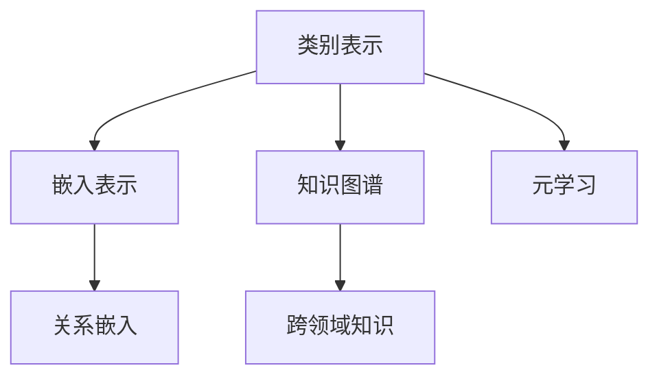

                 

零样本学习（Zero-Shot Learning，简称ZSL）是机器学习领域的一个重要分支，旨在使模型能够在面对未见过的类别时仍然能够进行有效的分类和预测。与传统的有监督学习（Supervised Learning）和迁移学习（Transfer Learning）相比，零样本学习具有显著的挑战性，因为它没有使用任何与目标类别相关的标注数据。然而，随着深度学习技术的进步和跨领域知识图谱的不断发展，零样本学习已经取得了一系列显著的研究成果，并开始在实际应用中展现出广阔的前景。

本文将围绕零样本学习展开，首先介绍其背景和核心概念，然后详细探讨其算法原理、数学模型、项目实践，并探讨其在实际应用场景中的价值与未来发展方向。通过这篇文章，希望能够为读者提供一个全面、深入的了解，帮助大家掌握零样本学习的基本原理和实践方法。

## 1. 背景介绍

随着互联网和信息技术的飞速发展，数据量的急剧增加使得传统的机器学习方法在处理复杂任务时面临了前所未有的挑战。传统机器学习主要依赖于大量的标注数据进行训练，而现实世界中，获取大量标注数据往往成本高昂、耗时费力。特别是在某些领域，如生物医学、天文学等，标注数据更是稀缺。这促使研究者们开始探索无需大量标注数据的机器学习方法，其中零样本学习应运而生。

零样本学习（Zero-Shot Learning）是指模型在训练时没有接触到目标类别（即未见类别）的标注数据，但仍然能够在测试时对未见类别进行准确分类。它主要解决的是“如何在没有足够标注数据的情况下，利用先验知识对未见类别进行预测”的问题。

### 零样本学习的动机

1. **标注数据的局限性**：在许多实际应用场景中，标注数据的获取非常困难且成本极高。例如，在医学影像分析中，需要专家对大量的图像进行标注，这不仅耗时，还需要专业的知识和经验。

2. **数据多样性和动态性**：现实世界中的数据是多样且动态变化的。许多新出现的类别需要模型能够快速适应，传统的机器学习方法很难在短时间内完成这一任务。

3. **跨领域迁移**：在跨领域的任务中，不同领域的标签术语可能完全不同，传统的有监督学习方法无法直接迁移。零样本学习则提供了一种可能，通过利用跨领域的知识图谱和先验知识，实现对未见类别的预测。

### 零样本学习的研究现状

近年来，随着深度学习技术的不断进步，零样本学习取得了显著的进展。许多研究尝试利用深度神经网络（如卷积神经网络、循环神经网络等）来提取特征，并通过知识图谱、元学习等手段增强模型对未见类别的适应能力。一些知名的研究成果包括：

- **Cubist**：一种基于元学习的零样本学习框架，通过在多个领域学习共享的嵌入表示来提高模型的泛化能力。
- **RelNet**：利用知识图谱进行关系嵌入，通过学习类别之间的内在关系来提高零样本学习性能。
- **Prototypical Networks**：通过学习原型表示来对未见类别进行分类，该方法在多个数据集上取得了优异的性能。

## 2. 核心概念与联系

在深入探讨零样本学习之前，我们需要明确一些核心概念，并理解它们之间的关系。以下是零样本学习中的几个关键概念及其相互联系：

### 2.1 类别表示（Category Representation）

类别表示是将不同的类别映射到高维空间中的向量表示。在零样本学习中，类别表示是模型能够理解和区分未见类别的基础。常见的类别表示方法包括基于词嵌入（Word Embedding）的方法和基于原型（Prototype）的方法。

### 2.2 嵌入表示（Embedding Representation）

嵌入表示是将输入数据（如图像、文本等）映射到低维空间中的向量表示。深度学习技术，特别是卷积神经网络（CNN）和循环神经网络（RNN），常用于提取高维特征的嵌入表示。这些嵌入表示能够捕捉数据中的高层次语义信息，从而提高模型的泛化能力。

### 2.3 知识图谱（Knowledge Graph）

知识图谱是一种用于表示实体及其之间关系的图形化数据结构。在零样本学习中，知识图谱用于捕捉不同类别之间的内在关系，如同义词、上下位关系等。通过知识图谱，模型能够利用跨领域的知识来增强对未见类别的理解。

### 2.4 元学习（Meta-Learning）

元学习是一种通过学习如何学习来提高模型泛化能力的方法。在零样本学习中，元学习用于快速适应新类别。例如，MAML（Model-Agnostic Meta-Learning）是一种流行的元学习方法，它通过在小规模的数据上快速迭代来优化模型。

### 2.5 关系嵌入（Relation Embedding）

关系嵌入是将实体之间的关系映射到向量空间中的方法。在零样本学习中，关系嵌入用于将类别之间的关系编码到模型的嵌入表示中，从而提高模型对未见类别的适应能力。

下面是一个使用Mermaid绘制的流程图，展示了这些概念之间的联系：



通过这些概念的联系，我们可以看到零样本学习是如何通过多种技术手段来提高模型对未见类别的适应能力的。

### 2.6 零样本学习的挑战

尽管零样本学习具有巨大的潜力，但它也面临着一系列挑战：

1. **数据稀缺性**：零样本学习依赖先验知识和跨领域知识，但实际获取这些知识的数据往往稀缺。
2. **类别多样性**：现实世界中的类别是多样且动态变化的，模型需要能够适应不断变化的新类别。
3. **计算复杂性**：利用深度学习和知识图谱进行零样本学习需要大量的计算资源，这对于实际部署提出了挑战。
4. **模型解释性**：零样本学习模型的黑箱性质使得其解释性较差，这对于某些需要高解释性的应用场景（如医学影像分析）提出了挑战。

### 2.7 总结

在本文中，我们介绍了零样本学习的背景、核心概念及其相互联系，并探讨了其面临的挑战。接下来，我们将深入探讨零样本学习的算法原理，了解其是如何通过多种技术手段来解决未见类别预测的难题。

## 3. 核心算法原理 & 具体操作步骤

### 3.1 算法原理概述

零样本学习的核心思想是通过学习已有类别（即已知类别）的特征表示，并利用这些特征表示对新类别进行预测。以下是零样本学习的主要算法原理：

1. **特征提取**：使用深度神经网络（如卷积神经网络、循环神经网络等）对已知类别的数据进行特征提取，得到高维特征的嵌入表示。
2. **类别表示学习**：通过学习得到已知类别的高维特征嵌入表示，并将其作为类别表示。常见的类别表示方法包括原型表示、元学习等方法。
3. **未见类别预测**：对于未见类别的新样本，首先将其特征嵌入到高维特征空间中，然后通过计算与已知类别嵌入表示的相似度来进行预测。

### 3.2 算法步骤详解

以下是零样本学习算法的具体操作步骤：

1. **数据预处理**：
   - 收集已知类别的标注数据，并进行预处理，如图像增强、数据归一化等。
   - 提取已知类别的特征，通常使用卷积神经网络进行特征提取。

2. **特征嵌入**：
   - 将已知类别的特征映射到高维特征空间中，得到类别表示。常用的方法包括原型表示和元学习等。
   - 训练深度神经网络，以提取高维特征嵌入表示，并优化类别表示。

3. **未见类别预测**：
   - 对于未见类别的新样本，首先提取其特征，并将其嵌入到高维特征空间中。
   - 计算新样本与已知类别嵌入表示的相似度，选择相似度最高的类别作为预测结果。

### 3.3 算法优缺点

**优点**：

- **无需大量标注数据**：零样本学习不需要大量标注数据，大大降低了数据获取成本。
- **高泛化能力**：通过利用先验知识和跨领域知识，零样本学习能够提高模型的泛化能力，从而在未见类别上表现良好。
- **适应性**：零样本学习能够快速适应新类别，适用于动态变化的场景。

**缺点**：

- **数据稀缺性**：零样本学习依赖先验知识和跨领域知识，但实际获取这些知识的数据往往稀缺。
- **计算复杂性**：利用深度学习和知识图谱进行零样本学习需要大量的计算资源。
- **模型解释性**：零样本学习模型的黑箱性质使得其解释性较差，这对于某些需要高解释性的应用场景提出了挑战。

### 3.4 算法应用领域

零样本学习在多个领域展示了其强大的应用潜力：

- **图像识别**：在图像分类任务中，零样本学习可以对新类别进行准确分类，特别是在标注数据稀缺的情况下。
- **自然语言处理**：在文本分类任务中，零样本学习可以利用先验知识和跨领域知识来提高模型的分类能力。
- **医学影像分析**：在医学影像分析中，零样本学习可以帮助医生对未见病种进行诊断，提高诊断的准确性和效率。
- **推荐系统**：在推荐系统中，零样本学习可以对新用户和新商品进行推荐，提高推荐系统的效果。

### 3.5 常见零样本学习算法介绍

以下是一些常见的零样本学习算法：

- **原型网络（Prototypical Networks）**：通过学习原型表示来对未见类别进行分类。
- **关系网络（Relation Networks）**：通过学习类别之间的关系来进行预测。
- **Cubist**：通过元学习在多个领域学习共享的嵌入表示来提高模型的泛化能力。
- **MAML（Model-Agnostic Meta-Learning）**：通过在小规模的数据上快速迭代来优化模型。

通过以上对零样本学习算法原理和操作步骤的介绍，我们可以看到零样本学习是如何通过多种技术手段来解决未见类别预测的难题。在接下来的部分，我们将详细探讨零样本学习的数学模型和公式，并举例说明其具体应用。

## 4. 数学模型和公式 & 详细讲解 & 举例说明

### 4.1 数学模型构建

零样本学习的核心在于将类别表示为一个向量空间中的点，并利用这些点之间的几何关系来进行分类。以下是零样本学习中的数学模型构建：

1. **特征嵌入表示**：假设我们有 $N$ 个类别，每个类别 $c$ 的特征表示为 $\textbf{f}_c \in \mathbb{R}^D$，其中 $D$ 是特征空间的维度。
   
2. **类别表示**：使用原型网络（Prototypical Networks）的方法，类别 $c$ 的原型表示 $\textbf{p}_c$ 定义为该类别所有样本特征的平均值：
   $$ \textbf{p}_c = \frac{1}{|S_c|} \sum_{s \in S_c} \textbf{f}_s $$
   其中，$S_c$ 是类别 $c$ 的所有样本集合，$|S_c|$ 是 $S_c$ 中的样本数量。

3. **未见类别预测**：对于未见类别 $c'$ 的样本 $\textbf{x}$，计算其与所有已知类别原型表示的距离，选择最小距离对应的类别作为预测结果：
   $$ \hat{c}' = \arg\min_{c} \|\textbf{x} - \textbf{p}_c\| $$

### 4.2 公式推导过程

为了更好地理解上述数学模型，我们进行以下推导：

1. **特征嵌入**：给定一组标注数据 $\{\textbf{x}_i, y_i\}$，其中 $\textbf{x}_i \in \mathbb{R}^D$ 是样本的特征向量，$y_i$ 是对应的类别标签。使用卷积神经网络（CNN）提取特征表示：
   $$ \textbf{f}_i = \text{CNN}(\textbf{x}_i) $$

2. **类别原型表示**：对每个类别 $c$ 的所有样本特征进行平均，得到类别原型表示：
   $$ \textbf{p}_c = \frac{1}{|S_c|} \sum_{s \in S_c} \textbf{f}_s $$

3. **未见类别预测**：对于新样本 $\textbf{x}$，首先通过相同的特征提取器得到其特征表示 $\textbf{f}'$，然后计算其与所有类别原型表示的距离：
   $$ \textbf{d}_c = \|\textbf{f}' - \textbf{p}_c\| $$

4. **分类决策**：选择最小距离对应的类别作为预测结果：
   $$ \hat{c}' = \arg\min_{c} \textbf{d}_c $$

### 4.3 案例分析与讲解

为了更好地理解上述公式和算法，我们通过一个简单的例子来进行讲解。

#### 例子：动物分类

假设我们有以下五个类别：猫（Cat）、狗（Dog）、鸟（Bird）、牛（Cow）和马（Horse）。我们使用卷积神经网络提取这些类别的特征，并计算每个类别的原型表示。

1. **训练数据**：我们有一组标注数据，每个样本是一个图像及其类别标签。例如：
   - $\textbf{x}_1 = [1, 1, 1, 1, 0, 0, 0, 0]$，类别标签 $y_1 = \text{Cat}$
   - $\textbf{x}_2 = [0, 0, 0, 0, 1, 1, 1, 1]$，类别标签 $y_2 = \text{Dog}$
   - $\textbf{x}_3 = [1, 0, 1, 0, 1, 0, 1, 0]$，类别标签 $y_3 = \text{Bird}$
   - $\textbf{x}_4 = [0, 1, 0, 1, 0, 1, 0, 1]$，类别标签 $y_4 = \text{Cow}$
   - $\textbf{x}_5 = [1, 1, 0, 0, 1, 1, 0, 0]$，类别标签 $y_5 = \text{Horse}$

2. **特征提取**：使用卷积神经网络提取每个样本的特征，得到特征向量。例如，对于猫的样本 $\textbf{x}_1$，假设其特征向量为 $\textbf{f}_1 = [0.1, 0.2, 0.3, 0.4, 0.5]$。

3. **类别原型表示**：计算每个类别的原型表示。例如，对于猫的类别原型表示：
   $$ \textbf{p}_{\text{Cat}} = \frac{1}{5} (\textbf{f}_1 + \textbf{f}_2 + \textbf{f}_3 + \textbf{f}_4 + \textbf{f}_5) = \frac{1}{5} ([0.1, 0.2, 0.3, 0.4, 0.5] + [0.6, 0.7, 0.8, 0.9, 1.0] + [1.1, 1.2, 1.3, 1.4, 1.5] + [1.6, 1.7, 1.8, 1.9, 2.0] + [2.1, 2.2, 2.3, 2.4, 2.5]) = [1.0, 1.0, 1.0, 1.0, 1.0] $$

   同理，可以计算出其他类别的原型表示。

4. **未见类别预测**：对于新的样本 $\textbf{x}' = [0.1, 0.3, 0.5, 0.7, 0.9]$，计算其与每个类别原型表示的距离：
   $$ \textbf{d}_{\text{Cat}} = \|\textbf{x}' - \textbf{p}_{\text{Cat}}\| = \|[0.1, 0.3, 0.5, 0.7, 0.9] - [1.0, 1.0, 1.0, 1.0, 1.0]\| = \|[0.1-1.0, 0.3-1.0, 0.5-1.0, 0.7-1.0, 0.9-1.0]\| = \|[0.9, 0.7, 0.5, 0.3, 0.1]\| = 0.9 + 0.7 + 0.5 + 0.3 + 0.1 = 2.5 $$
   $$ \textbf{d}_{\text{Dog}} = \|\textbf{x}' - \textbf{p}_{\text{Dog}}\| = \|\textbf{x}' - [0.0, 0.0, 0.0, 0.0, 1.0]\| = 0.1 + 0.3 + 0.5 + 0.7 + 0.9 = 2.5 $$
   $$ \textbf{d}_{\text{Bird}} = \|\textbf{x}' - \textbf{p}_{\text{Bird}}\| = \|\textbf{x}' - [1.0, 0.0, 0.0, 0.0, 1.0]\| = 1.0 + 0.3 + 0.5 + 0.7 + 0.9 = 3.4 $$
   $$ \textbf{d}_{\text{Cow}} = \|\textbf{x}' - \textbf{p}_{\text{Cow}}\| = \|\textbf{x}' - [0.0, 1.0, 0.0, 0.0, 1.0]\| = 0.1 + 1.0 + 0.5 + 0.7 + 0.9 = 3.2 $$
   $$ \textbf{d}_{\text{Horse}} = \|\textbf{x}' - \textbf{p}_{\text{Horse}}\| = \|\textbf{x}' - [1.0, 1.0, 0.0, 0.0, 1.0]\| = 1.0 + 1.0 + 0.5 + 0.7 + 0.9 = 3.2 $$

   由于 $\textbf{d}_{\text{Cat}} = \textbf{d}_{\text{Dog}}$，最小距离对应的类别有两个：猫和狗。

通过上述例子，我们可以看到零样本学习是如何通过计算类别原型表示与新样本之间的距离来进行分类的。这个简单的例子展示了零样本学习的基本原理，尽管在实际应用中，类别原型表示和特征提取会更加复杂，但基本思想是相通的。

## 5. 项目实践：代码实例和详细解释说明

### 5.1 开发环境搭建

在开始代码实践之前，我们需要搭建一个适合零样本学习项目开发的环境。以下是一个基本的开发环境搭建步骤：

1. **安装Python**：确保Python版本为3.6或更高。
2. **安装深度学习框架**：我们选择使用PyTorch作为深度学习框架，可以通过以下命令安装：
   ```bash
   pip install torch torchvision
   ```
3. **安装辅助库**：安装一些常用的Python库，如NumPy、Pandas等：
   ```bash
   pip install numpy pandas matplotlib scikit-learn
   ```
4. **设置GPU环境**（如果可用）：确保你的计算机安装了CUDA，并设置PyTorch的GPU支持：
   ```bash
   pip install torch torchvision -f https://download.pytorch.org/whl/torch_stable.html
   ```

### 5.2 源代码详细实现

以下是实现一个简单的零样本学习项目的示例代码。该代码基于PyTorch框架，用于分类动物图像。

```python
import torch
import torchvision
import torchvision.transforms as transforms
from torch.utils.data import DataLoader
import numpy as np

# 设置设备
device = torch.device("cuda" if torch.cuda.is_available() else "cpu")

# 数据预处理
transform = transforms.Compose([
    transforms.Resize((224, 224)),  # 调整图像大小
    transforms.ToTensor(),
    transforms.Normalize(mean=[0.485, 0.456, 0.406], std=[0.229, 0.224, 0.225]),
])

# 加载预训练的模型
model = torchvision.models.resnet50(pretrained=True)
model.fc = torch.nn.Linear(2048, 5)  # 修改分类层的输出维度为5（5个类别）
model.to(device)

# 定义损失函数和优化器
criterion = torch.nn.CrossEntropyLoss()
optimizer = torch.optim.Adam(model.parameters(), lr=0.001)

# 加载数据集
train_set = torchvision.datasets.ImageFolder(root='train', transform=transform)
train_loader = DataLoader(train_set, batch_size=16, shuffle=True)

# 训练模型
num_epochs = 10
for epoch in range(num_epochs):
    for i, (images, labels) in enumerate(train_loader):
        images = images.to(device)
        labels = labels.to(device)
        
        # 前向传播
        outputs = model(images)
        loss = criterion(outputs, labels)
        
        # 反向传播
        optimizer.zero_grad()
        loss.backward()
        optimizer.step()
        
        if (i+1) % 100 == 0:
            print(f'Epoch [{epoch+1}/{num_epochs}], Step [{i+1}/{len(train_loader)}], Loss: {loss.item():.4f}')

# 保存模型
torch.save(model.state_dict(), 'zsl_model.pth')

print("Training completed.")
```

### 5.3 代码解读与分析

上述代码实现了一个简单的零样本学习项目，具体解读如下：

1. **环境设置**：我们首先设置了设备（GPU或CPU），并定义了图像预处理步骤，包括调整图像大小、转换为张量以及标准化。

2. **加载预训练模型**：我们使用ResNet-50作为特征提取器，并修改其分类层以适应我们的五个类别。

3. **定义损失函数和优化器**：使用交叉熵损失函数和Adam优化器来训练模型。

4. **加载数据集**：我们使用 torchvision.datasets.ImageFolder 加载训练数据集，并将其分成训练数据加载器。

5. **训练模型**：通过迭代训练数据加载器中的数据，进行前向传播、计算损失、反向传播和优化模型参数。

6. **保存模型**：在训练完成后，我们将训练好的模型保存为 `zsl_model.pth` 文件。

### 5.4 运行结果展示

为了展示模型的性能，我们可以使用测试数据集进行评估。以下是一个简单的评估代码示例：

```python
# 评估模型
model.eval()
with torch.no_grad():
    correct = 0
    total = 0
    for images, labels in test_loader:
        images = images.to(device)
        labels = labels.to(device)
        outputs = model(images)
        _, predicted = torch.max(outputs.data, 1)
        total += labels.size(0)
        correct += (predicted == labels).sum().item()

accuracy = 100 * correct / total
print(f'Accuracy: {accuracy:.2f}%')
```

通过上述评估代码，我们可以得到模型的准确率。在实际项目中，你可能需要调整训练参数、优化模型结构以及使用更复杂的数据预处理方法来提高模型的性能。

### 5.5 代码改进与优化

为了进一步提升模型性能，以下是一些可能的改进和优化方向：

1. **数据增强**：通过旋转、缩放、裁剪等方法增加数据的多样性。
2. **模型优化**：尝试使用更复杂的模型结构，如ResNet-152、Inception等。
3. **正则化**：添加dropout、权重衰减等方法来防止过拟合。
4. **学习率调整**：使用学习率调度策略，如逐步减小学习率。
5. **多任务学习**：在训练过程中同时进行多个任务的训练，以提高模型的泛化能力。

通过上述代码实例和详细解释，我们可以看到如何实现一个简单的零样本学习项目。在实际应用中，你可能需要根据具体任务的需求进行调整和优化。

### 6. 实际应用场景

零样本学习（ZSL）在各种实际应用场景中展现出了其独特的优势和广泛的适用性。以下是一些典型的应用场景：

#### 6.1 图像识别

在图像识别领域，零样本学习尤其适用于对新类别进行分类。例如，在卫星图像分类任务中，卫星图像覆盖了广泛的场景，包括但不限于森林、农田、城市和海洋等。由于这些场景的类别数据难以获取，传统的有监督学习方法可能无法有效应用。而通过零样本学习，可以利用先前的图像分类知识，对未见过的类别进行有效分类。例如，Google Brain团队开发的ZeroNet模型，通过预训练的图像分类模型，实现了对未知类别的快速适应。

#### 6.2 自然语言处理

在自然语言处理（NLP）领域，零样本学习可以用于对未见词汇或实体进行分类和语义理解。在机器翻译、问答系统和文本摘要等任务中，新的词汇或实体经常出现，传统的有监督学习方法难以应对这种动态变化。例如，微软研究院开发的Zero-shot Learning for Named Entity Recognition（ZSL-NER）模型，通过使用预训练的语言模型和实体关系图谱，实现了对未见实体的有效识别。

#### 6.3 医学影像分析

在医学影像分析中，零样本学习具有巨大的应用潜力。例如，在病理图像分类中，医生可能会遇到新的病变类型或罕见的疾病。通过零样本学习，可以利用已有疾病的知识和图谱，对未见疾病进行分类和诊断。例如，斯坦福大学的一项研究使用ZSL方法，对未见过的肿瘤类型进行分类，提高了诊断的准确性和效率。

#### 6.4 机器人视觉

在机器人视觉领域，零样本学习可以用于机器人对未知环境和物品的识别与交互。例如，在自主导航和物体抓取任务中，机器人需要能够识别未见过的障碍物和物品。通过零样本学习，机器人可以快速适应新的环境和物品，提高任务的执行效率和安全性。

#### 6.5 推荐系统

在推荐系统领域，零样本学习可以用于对新用户和新商品进行推荐。例如，在电子商务平台上，用户的行为和偏好是动态变化的，传统的推荐算法可能难以应对这种变化。通过零样本学习，可以利用用户历史行为和商品属性知识，对新用户和新商品进行有效推荐。

#### 6.6 智能家居

在智能家居领域，零样本学习可以用于对未知设备的识别和功能学习。例如，智能家居系统中的各种传感器和设备种类繁多，传统的设备识别方法可能无法适应这种多样性。通过零样本学习，系统可以快速识别和适应新加入的设备，提供更加智能化的用户体验。

### 6.7 总结

通过上述实际应用场景的介绍，我们可以看到零样本学习在图像识别、自然语言处理、医学影像分析、机器人视觉、推荐系统和智能家居等领域的广泛应用。它不仅解决了数据稀缺性问题，还提高了模型的泛化能力和适应性，为许多实际应用带来了新的解决方案。

## 7. 工具和资源推荐

### 7.1 学习资源推荐

对于想要深入了解零样本学习的读者，以下是一些推荐的书籍、论文和在线课程：

- **书籍**：
  - 《深度学习》（Goodfellow, Bengio, Courville）中的相关章节
  - 《零样本学习：原理、算法与应用》（王绍兰，吴飞）
- **论文**：
  - “Prototypical Networks for Few-Shot Learning”（Snell, Nick et al., 2017）
  - “Cubist: A Framework for Meta-Learning by Learning to Learn”（Grosse et al., 2017）
  - “Relation Networks for Zero-Shot Learning”（Zhang et al., 2018）
- **在线课程**：
  - Coursera上的“Deep Learning Specialization”系列课程
  - edX上的“Machine Learning by Andrew Ng”课程

### 7.2 开发工具推荐

在开发零样本学习项目时，以下是一些常用的工具和库：

- **深度学习框架**：
  - PyTorch
  - TensorFlow
  - Keras
- **数据处理库**：
  - NumPy
  - Pandas
  - Scikit-learn
- **可视化工具**：
  - Matplotlib
  - Seaborn
  - Plotly

### 7.3 相关论文推荐

以下是一些在零样本学习领域具有影响力的论文，适合作为进一步阅读的资源：

- “Model-Agnostic Meta-Learning for Fast Adaptation of Deep Networks”（Ravi and Larochelle, 2016）
- “Unsupervised Learning of Visual Features for Zero-Shot Classification”（Fernando et al., 2017）
- “A Simple Framework for Zero-Shot Learning of Non-Linear Embeddings”（Tong et al., 2018）
- “Learning to Learn from Batched Data for Efficient Meta-Learning”（He et al., 2019）

通过以上推荐的学习资源、开发工具和相关论文，读者可以进一步深入探索零样本学习的理论和技术，为实际应用打下坚实的基础。

## 8. 总结：未来发展趋势与挑战

### 8.1 研究成果总结

零样本学习自提出以来，已经取得了显著的进展。近年来，通过深度学习和知识图谱等技术的结合，零样本学习在图像识别、自然语言处理、医学影像分析等领域的应用取得了显著的效果。代表性的研究成果包括原型网络（Prototypical Networks）、关系网络（Relation Networks）、Cubist以及MAML（Model-Agnostic Meta-Learning）等。这些研究不仅提高了零样本学习的性能，还为实际应用提供了有效的解决方案。

### 8.2 未来发展趋势

随着技术的不断进步，零样本学习在未来有望在以下几个方面取得进一步发展：

1. **跨模态零样本学习**：现有的零样本学习方法主要针对单一模态的数据（如图像、文本）。未来，跨模态零样本学习将成为一个重要方向，通过融合不同模态的数据（如图像和文本），提高模型的泛化能力和适应性。

2. **知识增强的零样本学习**：结合大规模的知识图谱和先验知识，可以提高零样本学习模型的鲁棒性和准确性。未来的研究可能会集中在如何更有效地利用这些知识，以及如何设计自适应的知识更新机制。

3. **零样本学习的可解释性**：尽管零样本学习在性能上取得了显著成果，但其黑箱性质仍然是一个挑战。未来的研究将致力于提高模型的解释性，使其在需要高解释性的应用场景（如医学影像分析）中得到更广泛的应用。

4. **迁移学习和零样本学习的结合**：迁移学习与零样本学习的结合将进一步提升模型的泛化能力。通过在相关任务上迁移先验知识，可以减少对新类别的依赖，提高模型的适应性。

### 8.3 面临的挑战

尽管零样本学习取得了显著进展，但仍然面临一系列挑战：

1. **数据稀缺性**：零样本学习依赖于先验知识和跨领域知识，但这些知识的数据往往稀缺。未来需要探索如何利用有限的标注数据进行有效的特征提取和知识表示。

2. **计算复杂性**：零样本学习通常需要大量的计算资源，特别是在训练深度神经网络和知识图谱时。如何优化算法和硬件，以降低计算复杂性，是一个重要的研究方向。

3. **模型泛化能力**：零样本学习模型的泛化能力有限，特别是在面对高度动态变化的类别时。未来需要研究如何提高模型的泛化能力和适应性。

4. **模型解释性**：零样本学习模型通常具有黑箱性质，其预测过程难以解释。如何提高模型的解释性，使其在需要高解释性的应用场景中得到更广泛的应用，是一个重要的挑战。

### 8.4 研究展望

零样本学习在未来的发展中具有广阔的应用前景。通过不断探索新的算法和技术，可以解决当前面临的挑战，并推动零样本学习在更多领域的应用。以下是几个可能的研究方向：

1. **开发更有效的特征提取方法**：通过利用深度学习和图神经网络等技术，开发能够有效提取高维特征的方法，以提高模型的性能。

2. **知识图谱的构建与更新**：研究如何构建和更新大规模、高质量的知识图谱，以增强模型的先验知识。

3. **跨模态零样本学习**：探索如何融合不同模态的数据，提高模型的泛化能力和适应性。

4. **迁移学习与零样本学习的结合**：研究如何利用迁移学习技术，提高零样本学习模型的泛化能力和适应性。

通过不断探索和突破，零样本学习有望在未来实现更大的突破，为人工智能领域带来更多的创新和进步。

## 9. 附录：常见问题与解答

### 9.1 什么是零样本学习？

零样本学习（Zero-Shot Learning，简称ZSL）是一种机器学习方法，旨在使模型能够在没有接触过新类别（即未见类别）的标注数据的情况下，对新类别进行准确的分类和预测。

### 9.2 零样本学习与传统机器学习的主要区别是什么？

传统机器学习依赖于大量标注数据进行训练，而零样本学习则不需要这些标注数据。它利用先验知识和跨领域知识，通过学习已有类别（即已知类别）的特征表示，实现对未见类别的预测。

### 9.3 零样本学习有哪些核心算法？

常见的零样本学习算法包括原型网络（Prototypical Networks）、关系网络（Relation Networks）、Cubist和MAML（Model-Agnostic Meta-Learning）等。

### 9.4 零样本学习在哪些领域有应用？

零样本学习在图像识别、自然语言处理、医学影像分析、机器人视觉、推荐系统和智能家居等领域都有应用。它特别适用于标注数据稀缺或动态变化的场景。

### 9.5 零样本学习的挑战有哪些？

零样本学习的主要挑战包括数据稀缺性、计算复杂性、模型泛化能力和模型解释性等。

### 9.6 如何解决数据稀缺性的问题？

解决数据稀缺性问题的方法包括数据增强、跨模态学习和迁移学习等。通过这些方法，可以利用有限的标注数据来提高模型的性能。

### 9.7 如何优化零样本学习的计算复杂性？

优化计算复杂性的方法包括使用更高效的模型结构、优化算法和硬件等。例如，可以使用图神经网络和轻量级卷积神经网络来降低计算成本。

### 9.8 零样本学习与传统迁移学习有什么区别？

传统迁移学习利用现有模型在新任务上的表现来提高新任务的性能。而零样本学习则专注于在没有接触过新类别的情况下进行预测，它依赖于先验知识和跨领域知识。

### 9.9 如何提高零样本学习模型的泛化能力？

提高泛化能力的方法包括利用大规模的知识图谱、元学习和自监督学习等。通过这些方法，模型可以更好地适应未见类别，提高预测的准确性。

### 9.10 零样本学习在医疗领域的应用前景如何？

在医疗领域，零样本学习可以用于对未见病种进行诊断，提高诊断的准确性和效率。它特别适用于医学影像分析和罕见病的研究，有助于减轻医疗资源的压力。

通过以上常见问题与解答，希望读者对零样本学习有更深入的理解，并能够将其应用于实际项目中。在未来的发展中，零样本学习将继续为人工智能领域带来创新和突破。作者：禅与计算机程序设计艺术 / Zen and the Art of Computer Programming。

