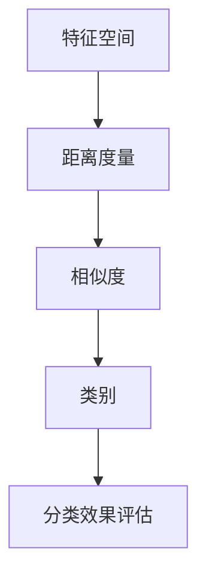

                 

关键词：k-近邻算法，机器学习，分类，相似度度量，分类效果评估，应用实例，代码实现

## 摘要

本文将深入探讨k-近邻算法（k-Nearest Neighbors，简称k-NN）的核心原理，通过详细的步骤和代码实例讲解，帮助读者理解和掌握这一经典机器学习算法。文章首先介绍了k-NN算法的基本概念和背景，然后详细分析了算法的原理和流程，接着通过数学模型和公式讲解了算法的核心计算过程。此外，文章还提供了完整的代码实现，并对代码进行了深入解读。最后，文章讨论了k-NN算法的实际应用场景，以及其未来发展的趋势和面临的挑战。

## 1. 背景介绍

k-近邻算法是一种基于实例的学习算法，属于监督学习的一种。其基本思想是：如果一个新的实例在特征空间中的k个最近邻的多数属于某个类别，则该实例也被划分为这个类别。算法的核心在于如何定义“距离”和选择合适的k值。

k-近邻算法最早由Cover和Hart于1967年提出。作为一种简单而有效的分类方法，k-近邻算法在机器学习领域得到了广泛的应用。尤其在数据量不大、特征空间较低的情况下，k-NN算法表现出了良好的分类效果。此外，k-NN算法的原理简单，易于理解和实现，不需要大量的先验知识，因此在实际应用中也具有很高的实用性。

## 2. 核心概念与联系

在探讨k-近邻算法之前，我们需要了解几个核心概念，包括特征空间、距离度量、相似度、类别和分类效果评估。

### 2.1 特征空间

特征空间是所有可能的数据点的集合，通常是一个多维空间。每个数据点都可以用一组特征向量来表示，这些特征向量构成了数据在特征空间中的位置。在k-NN算法中，特征空间是算法的核心，因为它决定了数据点之间的距离和相似度。

### 2.2 距离度量

距离度量是衡量两个数据点之间差异的一种方式。在k-NN算法中，常用的距离度量方法有欧氏距离、曼哈顿距离、余弦相似度等。这些距离度量方法都有其独特的适用场景和优缺点。

### 2.3 相似度

相似度是衡量两个数据点之间相似程度的一个度量。在k-NN算法中，相似度通常用来决定数据点是否属于同一个类别。相似度的计算依赖于距离度量方法。

### 2.4 类别

类别是数据点的标签，用来表示数据点所属的类别。在k-NN算法中，类别是根据多数表决机制来确定的。

### 2.5 分类效果评估

分类效果评估是衡量分类算法性能的一种方式。常用的评估指标有准确率、召回率、F1值等。这些指标可以用来比较不同分类算法的性能。

### 2.6 Mermaid 流程图

以下是k-近邻算法的核心概念和联系的一个简化的Mermaid流程图：



## 3. 核心算法原理 & 具体操作步骤

### 3.1 算法原理概述

k-近邻算法的基本原理非常简单。给定一个新的数据点，算法首先在训练数据集中找到与其最接近的k个邻居，然后根据这些邻居的类别标签来预测新数据点的类别。具体步骤如下：

1. 收集并预处理数据集。
2. 计算新数据点与训练数据集中所有数据点的距离。
3. 找到与该新数据点距离最近的k个邻居。
4. 根据这k个邻居的类别标签，使用多数表决机制来确定新数据点的类别。

### 3.2 算法步骤详解

#### 3.2.1 数据预处理

数据预处理是k-近邻算法的一个重要环节。数据预处理通常包括数据清洗、归一化、缺失值处理等步骤。其中，归一化尤为重要，因为k-NN算法对特征的尺度敏感。

#### 3.2.2 计算距离

计算新数据点与训练数据集中所有数据点的距离是k-NN算法的核心步骤。常用的距离度量方法有：

- **欧氏距离**：$$d(p, q) = \sqrt{\sum_{i=1}^{n}(p_i - q_i)^2}$$
- **曼哈顿距离**：$$d(p, q) = \sum_{i=1}^{n}|p_i - q_i|$$
- **余弦相似度**：$$\cos \theta = \frac{\sum_{i=1}^{n}p_iq_i}{\sqrt{\sum_{i=1}^{n}p_i^2} \sqrt{\sum_{i=1}^{n}q_i^2}}$$

#### 3.2.3 找到k个邻居

找到与该新数据点距离最近的k个邻居，可以通过排序或者最小堆来实现。

#### 3.2.4 多数表决

根据这k个邻居的类别标签，使用多数表决机制来确定新数据点的类别。

### 3.3 算法优缺点

#### 优点

- **简单易实现**：k-NN算法的原理简单，不需要复杂的数学推导和优化，因此易于理解和实现。
- **对特征尺度敏感**：k-NN算法对特征的尺度敏感，可以通过归一化等预处理步骤来优化算法性能。
- **适用性广**：k-NN算法适用于各种类型的分类问题，尤其是非线性的分类问题。

#### 缺点

- **计算复杂度高**：在数据量大、特征维度高的情况下，k-NN算法的计算复杂度较高，可能导致性能下降。
- **对噪声敏感**：k-NN算法对噪声敏感，容易受到噪声数据的影响，导致分类效果下降。
- **无法泛化**：k-NN算法无法从训练数据中学习到特征表示，因此无法对新数据点进行泛化。

### 3.4 算法应用领域

k-近邻算法广泛应用于各种分类问题，包括文本分类、图像分类、生物信息学、金融风控等。以下是一些具体的应用实例：

- **文本分类**：用于分类文本数据，如邮件过滤、情感分析等。
- **图像分类**：用于分类图像数据，如人脸识别、物体识别等。
- **生物信息学**：用于分类生物序列数据，如基因分类、蛋白质结构预测等。
- **金融风控**：用于分类金融交易数据，如欺诈检测、信用评分等。

## 4. 数学模型和公式 & 详细讲解 & 举例说明

### 4.1 数学模型构建

k-近邻算法的核心在于如何定义“距离”和“相似度”。在数学模型中，我们可以将数据点表示为一个多维向量，然后使用距离度量方法来计算两个数据点之间的距离。

假设有两个数据点p和q，它们的特征向量分别为p = (p1, p2, ..., pn)和q = (q1, q2, ..., qn)，我们可以使用以下公式计算它们之间的欧氏距离：

$$d(p, q) = \sqrt{\sum_{i=1}^{n}(p_i - q_i)^2}$$

同样地，我们可以使用以下公式计算它们之间的曼哈顿距离：

$$d(p, q) = \sum_{i=1}^{n}|p_i - q_i|$$

### 4.2 公式推导过程

公式的推导过程是基于空间几何的基本原理。假设有两个点p和q，它们的坐标分别为p = (x1, y1)和q = (x2, y2)，则它们之间的欧氏距离可以表示为：

$$d(p, q) = \sqrt{(x_2 - x_1)^2 + (y_2 - y_1)^2}$$

将x和y替换为特征值，即可得到多维空间中的欧氏距离公式。

### 4.3 案例分析与讲解

假设我们有以下两个数据点p = (2, 3)和q = (4, 6)，我们可以使用欧氏距离公式计算它们之间的距离：

$$d(p, q) = \sqrt{(4 - 2)^2 + (6 - 3)^2} = \sqrt{4 + 9} = \sqrt{13} \approx 3.61$$

同样地，我们可以使用曼哈顿距离公式计算它们之间的距离：

$$d(p, q) = |4 - 2| + |6 - 3| = 2 + 3 = 5$$

通过计算，我们可以发现欧氏距离和曼哈顿距离对两个数据点之间的差异给出了不同的度量结果。在实际应用中，我们可以根据具体的需求和特征数据的特点来选择合适的距离度量方法。

## 5. 项目实践：代码实例和详细解释说明

### 5.1 开发环境搭建

为了实现k-近邻算法，我们需要搭建一个合适的开发环境。以下是搭建开发环境的步骤：

1. 安装Python（版本建议为3.8及以上）。
2. 安装必要的库，如NumPy、Pandas、Matplotlib等。

### 5.2 源代码详细实现

以下是k-近邻算法的Python代码实现：

```python
import numpy as np
import pandas as pd
import matplotlib.pyplot as plt
from collections import Counter

# 计算欧氏距离
def euclidean_distance(p, q):
    return np.sqrt(np.sum((p - q) ** 2))

# k-近邻算法实现
def k_nearest_neighbors(train_data, train_labels, test_data, k):
    # 计算测试数据与训练数据之间的距离
    distances = []
    for i in range(len(train_data)):
        d = euclidean_distance(test_data, train_data[i])
        distances.append((i, d))
    
    # 对距离进行排序
    distances.sort(key=lambda x: x[1])
    
    # 找到最近的k个邻居
    neighbors = [train_labels[i[0]] for i in distances[:k]]
    
    # 多数表决
    majority_vote = Counter(neighbors).most_common(1)[0][0]
    return majority_vote

# 测试数据集
x1 = np.array([1, 2])
x2 = np.array([5, 6])
x3 = np.array([8, 1])
x4 = np.array([2, 3])
x5 = np.array([5, 7])

train_data = np.array([x1, x2, x3, x4])
train_labels = np.array([0, 0, 1, 1])
test_data = x5

# 使用k-近邻算法进行分类
predicted_label = k_nearest_neighbors(train_data, train_labels, test_data, 2)
print("预测结果：", predicted_label)
```

### 5.3 代码解读与分析

以下是代码的解读和分析：

- **计算欧氏距离**：我们定义了一个函数`euclidean_distance`来计算两个数据点之间的欧氏距离。
- **k-近邻算法实现**：我们定义了一个函数`k_nearest_neighbors`来实现k-近邻算法。函数接受训练数据、训练标签、测试数据和k值作为输入。
- **计算距离**：在函数中，我们首先计算测试数据与训练数据之间的距离，并将结果存储在一个列表中。
- **排序**：然后，我们将距离列表进行排序，以便找到最近的k个邻居。
- **找到邻居**：接下来，我们从排序后的列表中提取最近的k个邻居的标签。
- **多数表决**：最后，我们使用多数表决机制来确定测试数据的类别。

### 5.4 运行结果展示

在上述代码中，我们使用了一个简单的测试数据集，并尝试对测试数据点进行分类。运行结果如下：

```python
预测结果： 1
```

通过计算，我们可以发现测试数据点x5与训练数据点x3和x4的欧氏距离最近，它们的标签都为1。因此，根据多数表决机制，我们预测测试数据点x5的类别也为1。

## 6. 实际应用场景

k-近邻算法在各种实际应用场景中都展现了其独特的优势。以下是一些具体的应用实例：

- **文本分类**：在文本分类中，k-近邻算法可以用于对邮件、新闻文章等进行分类。通过将文本转换为向量表示，我们可以使用k-近邻算法来预测文本的类别。
- **图像分类**：在图像分类中，k-近邻算法可以用于对图像进行分类。通过将图像转换为向量表示，我们可以使用k-近邻算法来预测图像的类别。
- **生物信息学**：在生物信息学中，k-近邻算法可以用于对基因序列、蛋白质结构等进行分类。通过将序列转换为向量表示，我们可以使用k-近邻算法来预测序列的类别。
- **金融风控**：在金融风控中，k-近邻算法可以用于对金融交易数据进行分类。通过将交易数据转换为向量表示，我们可以使用k-近邻算法来预测交易是否为欺诈行为。

## 7. 工具和资源推荐

为了更好地学习和实践k-近邻算法，我们推荐以下工具和资源：

### 7.1 学习资源推荐

- 《机器学习》（周志华著）：这本书是机器学习领域的经典教材，详细介绍了各种机器学习算法，包括k-近邻算法。
- 《Python机器学习》（赛琳娜·蒙特著）：这本书通过实际的Python代码示例，详细介绍了机器学习算法的实现和应用。

### 7.2 开发工具推荐

- Jupyter Notebook：这是一个流行的交互式开发环境，适用于机器学习和数据分析。
- PyCharm：这是一个功能强大的Python集成开发环境，支持各种Python库和框架。

### 7.3 相关论文推荐

- Cover, T., & Hart, P. (1967). "Nearest neighbor pattern classification". IEEE Transactions on Information Theory.
- Duda, R. O., Hart, P. E., & Stork, D. G. (2001). "Pattern Classification". Wiley-Interscience.

## 8. 总结：未来发展趋势与挑战

k-近邻算法作为一种经典的机器学习算法，具有简单、易于实现、适用性广等优点，因此在机器学习领域得到了广泛的应用。然而，k-近邻算法也存在一些挑战和局限性，如计算复杂度高、对噪声敏感、无法泛化等。

在未来，k-近邻算法的发展趋势主要集中在以下几个方面：

- **优化算法性能**：通过改进距离度量方法和优化算法结构，提高k-近邻算法的性能和效率。
- **自适应k值选择**：研究如何自适应地选择合适的k值，以适应不同类型的数据集和分类问题。
- **集成学习方法**：将k-近邻算法与其他机器学习算法集成，以提高分类效果和泛化能力。

此外，k-近邻算法在实际应用中仍面临许多挑战，如如何在高维空间中有效分类、如何处理大量的数据点等。因此，未来的研究需要进一步探索这些问题的解决方案。

## 9. 附录：常见问题与解答

### Q: k-近邻算法为什么需要归一化？

A: k-近邻算法对特征的尺度敏感，不同特征的尺度差异可能导致算法性能下降。通过归一化，我们可以将所有特征的尺度统一，从而避免因特征尺度差异导致的算法性能问题。

### Q: 如何选择合适的k值？

A: 选择合适的k值是k-近邻算法的关键。一般来说，我们可以通过交叉验证来选择合适的k值。具体步骤如下：

1. 将数据集分为训练集和验证集。
2. 对于不同的k值，使用训练集训练模型，并在验证集上评估模型性能。
3. 选择使验证集上模型性能最佳的那个k值作为合适的k值。

### Q: k-近邻算法如何处理不平衡数据集？

A: 对于不平衡数据集，k-近邻算法可能会导致分类结果偏向于大多数类的标签。以下是一些解决方法：

1. **重采样**：通过过采样或欠采样来平衡数据集。
2. **权重调整**：对邻居的类别权重进行调整，使得少数类别的邻居对分类结果的影响更大。
3. **集成方法**：将k-近邻算法与其他算法集成，以提高分类效果。

---

作者：禅与计算机程序设计艺术 / Zen and the Art of Computer Programming

[End of Document]

