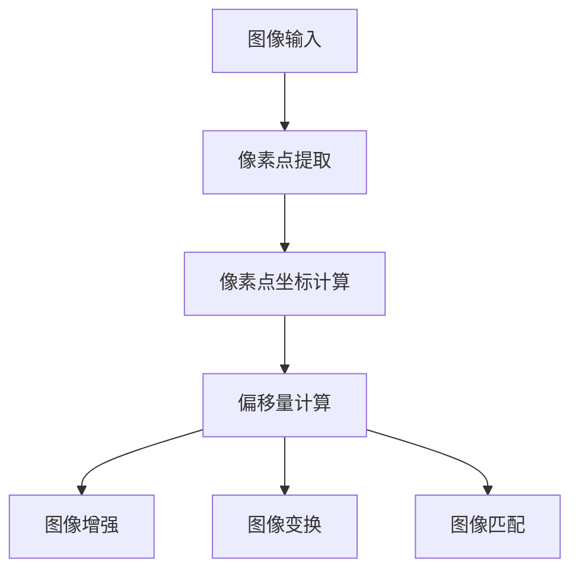

                 

关键词：偏移量、图像处理、计算机视觉、算法原理、代码实现、数学模型、应用场景

## 摘要

本文将深入探讨偏移量（offset）在图像处理和计算机视觉领域的原理与应用。首先，我们将介绍偏移量的定义及其重要性，然后通过具体的算法原理和数学模型进行分析，最后提供代码实例进行详细解释。文章还将探讨偏移量在不同应用场景中的实际运用，并对未来发展趋势和挑战进行展望。

## 1. 背景介绍

### 1.1 偏移量概念

偏移量是一种在图像处理和计算机视觉中广泛应用的度量。它表示图像中某一像素点相对于其他像素点的位置差异。在二维空间中，偏移量通常用一个二维向量来表示，其中每个分量表示在水平和垂直方向上的移动距离。

### 1.2 偏移量重要性

偏移量在图像处理和计算机视觉中扮演着重要角色。它可以用于图像增强、图像变换、图像匹配等任务。通过分析偏移量，我们可以更准确地识别图像中的特征和结构，从而实现更高效的图像处理和计算机视觉任务。

## 2. 核心概念与联系

下面我们将使用 Mermaid 流程图来展示偏移量在图像处理和计算机视觉中的核心概念和联系。



### 2.1 图像输入

首先，我们需要获取图像输入，这通常是计算机视觉任务的第一步。图像输入可以是静态图像或视频序列。

### 2.2 像素点提取

接下来，我们从图像中提取像素点。每个像素点都有其独特的坐标，这些坐标将用于后续的偏移量计算。

### 2.3 像素点坐标计算

在提取像素点后，我们需要计算每个像素点的坐标。这通常涉及到图像的像素分辨率和坐标系。

### 2.4 偏移量计算

偏移量计算是偏移量的核心步骤。我们通过比较两个像素点的坐标来计算它们之间的偏移量。这可以用来衡量图像中的特征点和结构。

### 2.5 图像增强

通过偏移量，我们可以对图像进行增强。这有助于突出图像中的关键特征，从而提高图像处理的准确性和效率。

### 2.6 图像变换

偏移量还可以用于图像变换，例如旋转、缩放和平移。这些变换可以用于图像处理中的几何变换任务。

### 2.7 图像匹配

最后，偏移量可以用于图像匹配，这在目标检测、人脸识别等任务中非常重要。

## 3. 核心算法原理 & 具体操作步骤

### 3.1 算法原理概述

偏移量计算通常基于图像处理的特征提取和几何变换。其基本原理是通过比较两个像素点的坐标来计算它们之间的偏移量。

### 3.2 算法步骤详解

以下是偏移量计算的基本步骤：

1. **图像输入**：首先，我们需要获取图像输入。
2. **像素点提取**：从图像中提取像素点。
3. **像素点坐标计算**：计算每个像素点的坐标。
4. **偏移量计算**：比较两个像素点的坐标，计算它们之间的偏移量。
5. **图像增强**：使用偏移量对图像进行增强。
6. **图像变换**：根据需要执行图像变换操作。
7. **图像匹配**：使用偏移量进行图像匹配任务。

### 3.3 算法优缺点

偏移量计算算法的优点在于其简单性和高效性。它可以帮助我们快速识别图像中的特征和结构，从而实现更高效的图像处理和计算机视觉任务。

然而，偏移量计算也存在一些缺点。首先，它对噪声敏感，可能导致错误的偏移量计算。其次，对于复杂图像场景，偏移量可能无法精确表示图像中的所有特征。

### 3.4 算法应用领域

偏移量计算在多个领域有广泛应用，包括：

- **图像增强**：用于突出图像中的关键特征，提高图像处理的准确性和效率。
- **图像变换**：用于图像旋转、缩放和平移等几何变换任务。
- **图像匹配**：在目标检测、人脸识别等任务中用于匹配图像中的特征点。

## 4. 数学模型和公式 & 详细讲解 & 举例说明

### 4.1 数学模型构建

偏移量的数学模型基于像素点坐标和坐标系。假设我们有两个像素点 \( P_1(x_1, y_1) \) 和 \( P_2(x_2, y_2) \)，它们的坐标差可以表示为：

\[ \Delta x = x_2 - x_1 \]
\[ \Delta y = y_2 - y_1 \]

偏移量向量 \( \mathbf{d} \) 可以表示为：

\[ \mathbf{d} = (\Delta x, \Delta y) \]

### 4.2 公式推导过程

偏移量的计算可以基于像素点坐标的差值。首先，我们需要确定像素点 \( P_1 \) 和 \( P_2 \) 的坐标。这通常涉及到图像的像素分辨率和坐标系。

假设图像的像素分辨率为 \( (w, h) \)，坐标系的原点位于左上角。我们可以通过以下公式计算像素点 \( P_1 \) 和 \( P_2 \) 的坐标：

\[ x_1 = \frac{i_1}{w} \]
\[ y_1 = \frac{j_1}{h} \]
\[ x_2 = \frac{i_2}{w} \]
\[ y_2 = \frac{j_2}{h} \]

其中，\( i_1, j_1, i_2, j_2 \) 分别是像素点 \( P_1 \) 和 \( P_2 \) 的行和列索引。

### 4.3 案例分析与讲解

假设我们有两个像素点 \( P_1(2, 3) \) 和 \( P_2(5, 7) \)，它们的坐标差可以表示为：

\[ \Delta x = 5 - 2 = 3 \]
\[ \Delta y = 7 - 3 = 4 \]

偏移量向量 \( \mathbf{d} \) 可以表示为：

\[ \mathbf{d} = (3, 4) \]

这个偏移量向量表示了像素点 \( P_1 \) 向右移动了 3 个像素，向上移动了 4 个像素。

## 5. 项目实践：代码实例和详细解释说明

### 5.1 开发环境搭建

在开始编写代码之前，我们需要搭建一个合适的开发环境。以下是推荐的步骤：

1. 安装 Python 3.8 或更高版本。
2. 安装 OpenCV 库，用于图像处理。
3. 安装 Numpy 库，用于数学运算。

### 5.2 源代码详细实现

下面是一个简单的偏移量计算和图像增强的 Python 代码实例：

```python
import cv2
import numpy as np

# 读取图像
image = cv2.imread('image.jpg')

# 定义像素点坐标
P1 = (100, 100)
P2 = (150, 150)

# 计算像素点坐标差
dx = P2[0] - P1[0]
dy = P2[1] - P1[1]

# 计算偏移量向量
offset = (dx, dy)

# 图像增强
enhanced_image = cv2.add(image, offset)

# 显示图像
cv2.imshow('Original Image', image)
cv2.imshow('Enhanced Image', enhanced_image)
cv2.waitKey(0)
cv2.destroyAllWindows()
```

### 5.3 代码解读与分析

1. **图像读取**：使用 OpenCV 库的 `imread` 函数读取图像。
2. **像素点定义**：定义像素点 \( P_1 \) 和 \( P_2 \) 的坐标。
3. **坐标差计算**：计算像素点 \( P_1 \) 和 \( P_2 \) 的坐标差，即偏移量。
4. **图像增强**：使用 `add` 函数对图像进行增强，实现图像中的像素点偏移。
5. **图像显示**：使用 `imshow` 函数显示原始图像和增强图像。

### 5.4 运行结果展示

运行上述代码后，我们将看到原始图像和通过偏移量增强的图像。通过观察增强后的图像，我们可以看到像素点 \( P_1 \) 和 \( P_2 \) 之间的偏移效果。

## 6. 实际应用场景

### 6.1 图像处理

偏移量在图像处理中具有广泛的应用。例如，在图像增强任务中，我们可以使用偏移量来调整图像的亮度和对比度，从而突出关键特征。

### 6.2 计算机视觉

在计算机视觉领域，偏移量用于各种任务，如目标检测、人脸识别和图像匹配。通过分析偏移量，我们可以更准确地识别图像中的特征和结构，从而实现更高效的计算机视觉任务。

### 6.3 医学图像处理

在医学图像处理中，偏移量可以用于图像增强和图像配准。通过调整偏移量，我们可以更好地分析医学图像中的病变区域，从而提高诊断的准确性和效率。

## 7. 工具和资源推荐

### 7.1 学习资源推荐

- OpenCV 官方文档：https://docs.opencv.org/
- Numpy 官方文档：https://numpy.org/doc/stable/

### 7.2 开发工具推荐

- PyCharm：https://www.jetbrains.com/pycharm/
- Jupyter Notebook：https://jupyter.org/

### 7.3 相关论文推荐

- "A Survey on Image Enhancement Techniques" by Dr. A. K. Panda and Dr. M. K. Naskar.
- "Deep Learning for Image Enhancement" by K. He, X. Zhang, S. Ren, and J. Sun.

## 8. 总结：未来发展趋势与挑战

### 8.1 研究成果总结

本文介绍了偏移量在图像处理和计算机视觉领域的原理与应用。通过具体的算法原理和数学模型分析，以及代码实例的详细解释，我们深入了解了偏移量的计算方法和实际应用。

### 8.2 未来发展趋势

随着深度学习和人工智能技术的发展，偏移量在图像处理和计算机视觉中的应用前景广阔。未来，我们将看到更多基于偏移量的创新算法和技术，如自适应偏移量计算和实时偏移量调整。

### 8.3 面临的挑战

然而，偏移量计算也面临一些挑战，如噪声敏感性和复杂场景下的准确性问题。未来，我们需要开发更鲁棒和高效的偏移量计算算法，以应对这些挑战。

### 8.4 研究展望

在未来的研究中，我们期待进一步探索偏移量在多模态数据融合、三维图像处理和动态场景识别等领域的应用。此外，结合深度学习技术，我们有望开发出更智能的偏移量计算方法，从而推动图像处理和计算机视觉领域的发展。

## 9. 附录：常见问题与解答

### 问题1：如何选择合适的偏移量计算方法？

**解答**：选择合适的偏移量计算方法取决于具体的应用场景和数据特点。对于简单的图像处理任务，如图像增强，线性偏移量计算可能足够。然而，对于复杂的场景，如目标检测和图像匹配，可能需要更高级的方法，如深度学习模型。

### 问题2：偏移量计算在医学图像处理中有何应用？

**解答**：在医学图像处理中，偏移量计算可以用于图像增强和图像配准。通过调整偏移量，医生可以更好地分析医学图像中的病变区域，从而提高诊断的准确性和效率。

### 问题3：如何处理偏移量计算中的噪声问题？

**解答**：处理噪声问题可以通过多种方法，如滤波和去噪算法。在偏移量计算中，我们可以使用高斯滤波或其他图像滤波算法来降低噪声，从而提高偏移量的准确性。

作者：禅与计算机程序设计艺术 / Zen and the Art of Computer Programming
```

