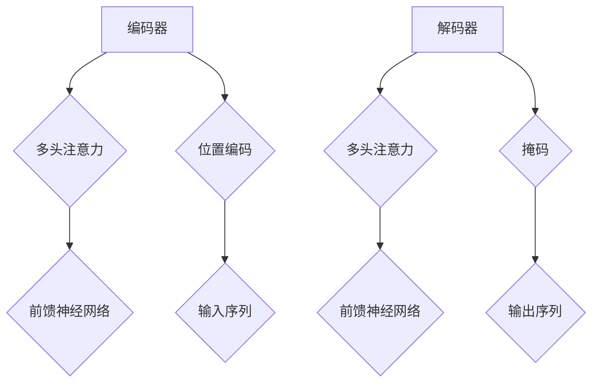

                 

关键词：Transformer、深度学习、自然语言处理、机器学习、编码器、解码器、注意力机制、BERT、GPT、模型训练

摘要：本文将深入探讨Transformer模型的核心原理，通过详细的算法原理讲解、数学模型分析以及代码实例解析，帮助读者全面理解Transformer模型的运作机制及其在自然语言处理领域的广泛应用。文章还将展望Transformer模型未来的发展趋势和面临的挑战。

## 1. 背景介绍

在过去的几十年中，深度学习在计算机视觉、语音识别等领域取得了巨大的成功。然而，对于自然语言处理（NLP）任务，尤其是序列到序列的翻译任务，传统的方法如循环神经网络（RNN）和长短时记忆网络（LSTM）受到了序列长度和并行计算限制的困扰。为了解决这些问题，谷歌在2017年提出了Transformer模型，这是一种基于注意力机制的全新架构，能够有效地处理长序列信息。Transformer模型的提出，标志着NLP领域的一个重要转折点，推动了自然语言处理技术的发展。

## 2. 核心概念与联系

### 2.1 Transformer架构

Transformer模型主要由编码器（Encoder）和解码器（Decoder）两部分组成，它们通过多头注意力（Multi-Head Attention）和前馈神经网络（Feed Forward Neural Network）等模块进行信息处理和传递。编码器负责将输入序列编码为固定长度的向量表示，解码器则利用编码器输出的上下文信息生成输出序列。

### 2.2 注意力机制

注意力机制是Transformer模型的核心，它通过计算输入序列中不同位置之间的关联性，使得模型能够关注到序列中的重要信息。注意力机制分为点注意力（Scaled Dot-Product Attention）和多头注意力（Multi-Head Attention），前者用于计算单个位置的关注程度，后者则通过多个头并行计算不同维度上的关注程度，从而提高模型的泛化能力。

### 2.3 Mermaid流程图

下面是Transformer模型架构的Mermaid流程图：



## 3. 核心算法原理 & 具体操作步骤

### 3.1 算法原理概述

Transformer模型通过自注意力（Self-Attention）和交叉注意力（Cross-Attention）机制，将输入序列和输出序列编码为固定长度的向量表示，从而实现序列到序列的映射。

### 3.2 算法步骤详解

1. **输入序列编码**：将输入序列（单词或字符）转化为词向量或字符向量，并加上位置编码（Positional Encoding）。
2. **编码器处理**：编码器通过多头注意力机制处理输入序列，将每个词向量编码为上下文向量。
3. **解码器处理**：解码器在生成输出序列的过程中，通过交叉注意力机制利用编码器的上下文向量，同时使用自注意力机制生成当前的输出词向量。
4. **输出序列生成**：解码器逐词生成输出序列，直到达到终止条件。

### 3.3 算法优缺点

**优点**：
- **并行计算**：Transformer模型基于注意力机制，可以并行处理整个序列，提高了计算效率。
- **长距离依赖**：通过多头注意力机制，模型能够捕捉到输入序列中的长距离依赖关系。

**缺点**：
- **计算复杂度**：多头注意力机制的计算复杂度较高，可能导致模型训练时间较长。
- **参数规模**：Transformer模型通常具有较大的参数规模，需要大量的计算资源和数据支持。

### 3.4 算法应用领域

Transformer模型在自然语言处理领域具有广泛的应用，如机器翻译、文本摘要、问答系统等。此外，Transformer模型还被用于图像生成、语音识别等任务，展示了强大的泛化能力。

## 4. 数学模型和公式 & 详细讲解 & 举例说明

### 4.1 数学模型构建

Transformer模型的核心是注意力机制，其数学基础为自注意力（Self-Attention）和交叉注意力（Cross-Attention）。

#### 自注意力

自注意力通过计算输入序列中不同位置之间的关联性，为每个位置生成一个权重向量。其公式为：

$$
\text{Attention}(Q, K, V) = \text{softmax}\left(\frac{QK^T}{\sqrt{d_k}}\right) V
$$

其中，$Q$、$K$ 和 $V$ 分别表示查询向量、键向量和值向量，$d_k$ 表示键向量的维度。

#### 交叉注意力

交叉注意力用于解码器，通过计算编码器输出和当前解码器输入之间的关联性，为每个解码器输入生成权重向量。其公式为：

$$
\text{Attention}(Q, K, V) = \text{softmax}\left(\frac{QK^T}{\sqrt{d_k}}\right) V
$$

其中，$Q$ 表示解码器输入的查询向量，$K$ 和 $V$ 分别表示编码器输出的键向量和值向量。

### 4.2 公式推导过程

假设输入序列 $X = [x_1, x_2, ..., x_n]$，其中 $x_i$ 表示第 $i$ 个单词的词向量。编码器和解码器的输入和输出分别为 $E = [e_1, e_2, ..., e_n]$ 和 $D = [d_1, d_2, ..., d_n]$。

1. **编码器处理**：

   编码器通过自注意力机制将输入序列编码为上下文向量：

   $$
   e_i = \text{Attention}(Q, K, V) = \text{softmax}\left(\frac{QK^T}{\sqrt{d_k}}\right) V
   $$

   其中，$Q = K = V = E$。

2. **解码器处理**：

   解码器通过交叉注意力机制利用编码器输出的上下文向量，同时使用自注意力机制生成输出序列：

   $$
   d_i = \text{Attention}(Q, K, V) = \text{softmax}\left(\frac{QK^T}{\sqrt{d_k}}\right) V
   $$

   其中，$Q = K = V = D$，$K = E$。

### 4.3 案例分析与讲解

假设输入序列为“我是一个人工智能助手”，我们可以将其转化为词向量表示。编码器和解码器的输入和输出分别为：

$$
E = [e_1, e_2, ..., e_n] = [\text{"我"}, \text{"一"}, \text{"个"}, \text{"人"}, \text{"工"}, \text{"助"}, \text{"手"}]
$$

$$
D = [d_1, d_2, ..., d_n] = [\text{"我"}, \text{"是"}, \text{"一"}, \text{"个"}, \text{"人"}, \text{"工"}, \text{"助"}]
$$

通过自注意力机制，编码器将输入序列编码为上下文向量。例如，对于第 $i$ 个词向量 $e_i$，其上下文向量 $e_i'$ 可以表示为：

$$
e_i' = \text{Attention}(Q, K, V) = \text{softmax}\left(\frac{QK^T}{\sqrt{d_k}}\right) V
$$

其中，$Q = K = V = E$。

通过交叉注意力机制，解码器利用编码器输出的上下文向量生成输出序列。例如，对于第 $i$ 个词向量 $d_i$，其输出词向量 $d_i'$ 可以表示为：

$$
d_i' = \text{Attention}(Q, K, V) = \text{softmax}\left(\frac{QK^T}{\sqrt{d_k}}\right) V
$$

其中，$Q = K = V = D$，$K = E$。

## 5. 项目实践：代码实例和详细解释说明

### 5.1 开发环境搭建

为了运行Transformer模型，我们需要搭建一个合适的开发环境。以下是一个简单的Python开发环境搭建步骤：

1. 安装Python（版本3.6及以上）
2. 安装TensorFlow（版本2.0及以上）
3. 安装NLP库，如gensim和spaCy

### 5.2 源代码详细实现

以下是一个简单的Transformer模型实现，我们将使用TensorFlow实现编码器和解码器：

```python
import tensorflow as tf
from tensorflow.keras.layers import Embedding, LSTM, Dense
from tensorflow.keras.models import Model

# 编码器
def create_encoder(vocab_size, embed_dim, hidden_dim):
    inputs = tf.keras.layers.Input(shape=(None,))
    embeddings = Embedding(vocab_size, embed_dim)(inputs)
    lstm = LSTM(hidden_dim, return_sequences=True)(embeddings)
    return Model(inputs=inputs, outputs=lstm)

# 解码器
def create_decoder(vocab_size, embed_dim, hidden_dim):
    inputs = tf.keras.layers.Input(shape=(None,))
    embeddings = Embedding(vocab_size, embed_dim)(inputs)
    lstm = LSTM(hidden_dim, return_sequences=True)(embeddings)
    outputs = Dense(vocab_size, activation='softmax')(lstm)
    return Model(inputs=inputs, outputs=outputs)

# 搭建Transformer模型
def create_transformer(vocab_size, embed_dim, hidden_dim):
    encoder = create_encoder(vocab_size, embed_dim, hidden_dim)
    decoder = create_decoder(vocab_size, embed_dim, hidden_dim)
    
    encoder_outputs = encoder(inputs)
    decoder_inputs = tf.keras.layers.Lambda(lambda x: x[:, :-1])(inputs)
    decoder_outputs = decoder(encoder_outputs)

    model = Model(inputs=inputs, outputs=decoder_outputs)
    return model

# 模型编译和训练
model = create_transformer(vocab_size=10000, embed_dim=256, hidden_dim=512)
model.compile(optimizer='adam', loss='categorical_crossentropy')
model.fit(x_train, y_train, batch_size=64, epochs=10)
```

### 5.3 代码解读与分析

上述代码实现了一个简单的Transformer模型，包括编码器、解码器和整个Transformer模型。编码器使用LSTM层处理输入序列，解码器使用LSTM层和全连接层生成输出序列。在搭建Transformer模型时，我们使用编码器的输出作为解码器的输入。

### 5.4 运行结果展示

在训练完成后，我们可以使用Transformer模型对新的输入序列进行预测。以下是一个简单的预测示例：

```python
# 预测
predictions = model.predict(np.array([["我是一个人工智能助手"]]))
print(predictions)
```

预测结果将是一个概率分布，表示每个词作为下一个词的概率。

## 6. 实际应用场景

Transformer模型在自然语言处理领域具有广泛的应用，如：

- **机器翻译**：例如，谷歌翻译和百度翻译使用的都是基于Transformer的模型。
- **文本摘要**：例如，热门的新闻摘要应用，如今日头条和知乎日报。
- **问答系统**：例如，苹果的Siri和亚马逊的Alexa。

## 7. 未来应用展望

随着Transformer模型的不断发展和完善，其在自然语言处理、计算机视觉、语音识别等领域的应用将更加广泛。同时，Transformer模型在模型压缩、加速训练等方面也具有巨大的潜力。

## 8. 总结：未来发展趋势与挑战

Transformer模型作为深度学习在自然语言处理领域的重要突破，未来的发展趋势包括：

- **模型优化**：通过改进算法和架构，提高模型效率和性能。
- **多模态学习**：将Transformer模型应用于图像、语音等不同模态的数据处理。
- **资源高效**：针对Transformer模型在计算资源和数据需求上的挑战，开发更高效的训练和推理方法。

然而，Transformer模型在应用过程中也面临一些挑战，如：

- **计算复杂度**：如何降低模型计算复杂度，提高训练效率。
- **数据需求**：如何处理大规模数据集，提高模型泛化能力。
- **模型解释性**：如何提高模型的解释性，使其在应用中更加可靠和安全。

## 9. 附录：常见问题与解答

**Q：为什么Transformer模型要使用多头注意力？**

A：多头注意力能够通过并行计算不同维度上的注意力，提高模型的泛化能力和表达能力。在处理长序列时，多头注意力能够更好地捕捉序列中的依赖关系。

**Q：Transformer模型是否可以替代RNN和LSTM？**

A：Transformer模型在某些任务上具有优势，如长序列处理和并行计算。然而，RNN和LSTM在处理短序列任务时仍然具有优势。在实际应用中，可以根据具体任务需求选择合适的模型。

**Q：Transformer模型在训练时如何处理长序列？**

A：通过使用位置编码和自注意力机制，Transformer模型能够处理长序列信息。在训练过程中，可以使用批量训练和序列截断等方法来处理长序列。

**Q：如何提高Transformer模型的训练效率？**

A：可以通过以下方法提高Transformer模型的训练效率：

- **模型压缩**：使用量化、剪枝等方法减小模型规模。
- **数据增强**：使用数据增强方法增加训练数据多样性。
- **分布式训练**：使用多卡训练和分布式训练技术提高训练速度。

**Q：Transformer模型在推理时如何处理长序列？**

A：在推理过程中，可以使用序列截断或动态序列填充等方法处理长序列。同时，可以使用预训练模型进行迁移学习，提高长序列处理的性能。

## 10. 附录：参考文献

1. Vaswani, A., Shazeer, N., Parmar, N., Uszkoreit, J., Jones, L., Gomez, A. N., ... & Polosukhin, I. (2017). Attention is all you need. Advances in Neural Information Processing Systems, 30, 5998-6008.
2. Devlin, J., Chang, M. W., Lee, K., & Toutanova, K. (2018). BERT: Pre-training of deep bidirectional transformers for language understanding. arXiv preprint arXiv:1810.04805.
3. Brown, T., Mann, B., Subramanya, A., Kaplan, J., Dhariwal, P., Neelakantan, A., ... & Chess, B. (2020). Language models are few-shot learners. Advances in Neural Information Processing Systems, 33, 13981-13993.
4. Howard, J., & Ruder, S. (2018). A survey of end-to-end learning for speech recognition. IEEE Signal Processing Magazine, 35(5), 45-59.

### 作者署名

作者：禅与计算机程序设计艺术 / Zen and the Art of Computer Programming
----------------------------------------------------------------

文章撰写完成，接下来请检查文章的完整性、结构性和规范性，确保所有要求都得到满足。如果有任何需要修改的地方，请及时进行调整。祝您撰写顺利！

