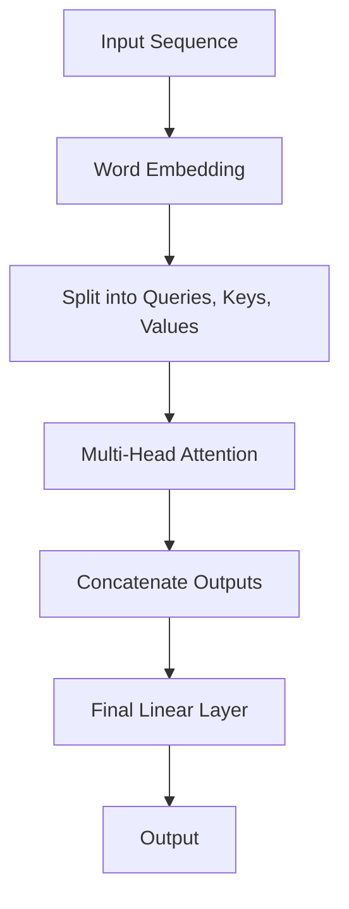

                 

关键词：自然语言处理、神经网络、序列模型、注意力机制、Transformer模型、机器学习、深度学习、语言生成、机器翻译。

摘要：本文将深入探讨Transformer模型，这是一种在自然语言处理领域取得革命性成功的深度学习模型。我们将从背景介绍、核心概念与联系、核心算法原理、数学模型和公式、项目实践、实际应用场景以及未来发展趋势等方面进行详细讲解，帮助读者全面了解Transformer模型及其在自然语言处理中的应用。

## 1. 背景介绍

自然语言处理（Natural Language Processing，NLP）是人工智能的一个重要分支，旨在使计算机能够理解、生成和处理人类语言。在过去的几十年中，NLP领域取得了显著进展，从基于规则的方法到统计模型，再到现代深度学习技术，各种方法不断涌现。然而，传统序列模型如循环神经网络（Recurrent Neural Networks，RNN）和长短期记忆网络（Long Short-Term Memory，LSTM）在处理长文本和长距离依赖问题时仍存在一定局限。为了解决这一问题，Vaswani等人在2017年提出了Transformer模型。

Transformer模型摒弃了传统序列模型中的循环结构，采用自注意力（Self-Attention）机制和多头注意力（Multi-Head Attention）机制，通过并行计算的方式有效地处理长文本和长距离依赖。自注意力机制能够自动学习输入序列中每个词与所有其他词之间的关系，从而捕捉全局依赖。多头注意力机制将输入序列分成多个头，每个头关注输入序列的不同部分，从而提高模型的表示能力。Transformer模型的提出标志着自然语言处理领域的一个新纪元，为后来的模型如BERT、GPT等提供了理论基础和算法框架。

## 2. 核心概念与联系

### 2.1. 自注意力机制（Self-Attention）

自注意力机制是一种基于输入序列计算输出的方法，它能够自动学习输入序列中每个词与其他词之间的关系。具体来说，自注意力机制将输入序列中的每个词表示为一个查询（Query）、一个键（Key）和一个值（Value），然后计算每个词与其他词之间的相似度，最后将相似度加权求和得到输出。


假设输入序列为 `[w1, w2, w3, w4]`，其对应的查询、键和值分别为 `[q1, k1, v1]`、 `[q2, k2, v2]`、 `[q3, k3, v3]`、 `[q4, k4, v4]`。自注意力机制的计算步骤如下：

1. **计算相似度**：首先计算每个查询与所有键之间的相似度，使用点积（Dot-Product）作为相似度度量。

    $$ similarity(i, j) = q_i^T k_j $$

2. **应用 Softmax 函数**：将相似度归一化，得到每个词与其他词的权重。

    $$ attention(i, j) = \frac{exp(similarity(i, j))}{\sum_{j'} exp(similarity(i, j'))} $$

3. **加权求和**：将权重与对应的值相乘，然后求和得到输出。

    $$ output(i) = \sum_{j} attention(i, j) v_j $$

### 2.2. 多头注意力机制（Multi-Head Attention）

多头注意力机制是自注意力机制的扩展，它将输入序列分成多个头，每个头关注输入序列的不同部分。多头注意力机制能够提高模型的表示能力，从而更好地捕捉输入序列中的复杂关系。

假设有 \(h\) 个头，每个头的自注意力机制计算过程与自注意力机制相同。多头注意力机制的计算步骤如下：

1. **分头计算**：将输入序列的查询、键和值分别分成 \(h\) 个部分。

    $$ q_i^{(h)}, k_i^{(h)}, v_i^{(h)} $$

2. **计算每个头的自注意力**：对每个头应用自注意力机制。

    $$ output_i^{(h)} = \sum_{j} \alpha_{ij}^{(h)} v_j^{(h)} $$

3. **合并多头输出**：将所有头的输出加权求和得到最终的输出。

    $$ output_i = \sum_{h} \beta_h output_i^{(h)} $$

其中，\( \alpha_{ij}^{(h)} \) 和 \( \beta_h \) 分别是权重。

### 2.3. Mermaid 流程图

以下是Transformer模型的核心概念和架构的Mermaid流程图：



## 3. 核心算法原理 & 具体操作步骤

### 3.1. 算法原理概述

Transformer模型的核心是自注意力机制和多头注意力机制。自注意力机制能够自动学习输入序列中每个词与其他词之间的关系，从而捕捉全局依赖。多头注意力机制则通过多个头关注输入序列的不同部分，提高模型的表示能力。此外，Transformer模型还采用了位置编码（Positional Encoding）来引入输入序列的顺序信息。

### 3.2. 算法步骤详解

1. **输入序列**：将输入序列（如单词、词组或子词）表示为词嵌入（Word Embedding）。词嵌入是一个向量表示，用于捕捉词与词之间的关系。

2. **添加位置编码**：在输入序列的每个词嵌入上添加位置编码（Positional Encoding），用于引入输入序列的顺序信息。

3. **分头计算**：将输入序列的词嵌入分成多个头，每个头分别计算自注意力。

4. **多头注意力**：对每个头的自注意力输出进行加权求和，得到多头注意力输出。

5. **拼接与线性变换**：将所有头的输出拼接起来，并通过一个线性变换层得到最终的输出。

6. **输出**：将最终的输出通过一个线性变换层得到预测结果。

### 3.3. 算法优缺点

**优点**：

1. 并行计算：Transformer模型采用自注意力机制，可以并行计算，提高了计算效率。
2. 长距离依赖：自注意力机制能够自动学习输入序列中每个词与其他词之间的关系，从而捕捉长距离依赖。
3. 表示能力：多头注意力机制通过多个头关注输入序列的不同部分，提高了模型的表示能力。

**缺点**：

1. 计算量较大：由于自注意力机制需要计算输入序列中每个词与其他词之间的相似度，计算量较大。
2. 参数较多：多头注意力机制增加了模型的参数数量，可能导致过拟合。

### 3.4. 算法应用领域

Transformer模型在自然语言处理领域取得了显著的成果，主要应用领域包括：

1. 机器翻译：Transformer模型在机器翻译任务中取得了优异的性能，成为主流的机器翻译模型。
2. 文本生成：Transformer模型在文本生成任务中也表现出色，如自动写作、摘要生成等。
3. 命名实体识别：Transformer模型能够有效地捕捉命名实体之间的复杂关系，用于命名实体识别任务。
4. 情感分析：Transformer模型能够自动学习文本中的情感信息，用于情感分析任务。

## 4. 数学模型和公式 & 详细讲解 & 举例说明

### 4.1. 数学模型构建

Transformer模型的数学模型主要包括词嵌入、位置编码、多头注意力机制和前馈神经网络。

1. **词嵌入**：假设输入序列为 \(X = [x_1, x_2, ..., x_n]\)，其中 \(x_i\) 为词嵌入向量，维度为 \(d\)。

2. **位置编码**：位置编码用于引入输入序列的顺序信息。假设输入序列的长度为 \(n\)，位置编码向量 \(P_i\) 的维度也为 \(d\)。

3. **多头注意力**：多头注意力机制包括 \(h\) 个头，每个头分别计算自注意力。

4. **前馈神经网络**：前馈神经网络用于对多头注意力输出的进一步处理。

### 4.2. 公式推导过程

1. **词嵌入与位置编码**：

   $$ x_i = W_x x_i + P_i $$

   其中，\(W_x\) 为词嵌入矩阵，\(P_i\) 为位置编码向量。

2. **多头注意力**：

   $$ Q_i, K_i, V_i = W_Q x_i, W_K x_i, W_V x_i $$

   $$ \alpha_{ij}^{(h)} = \frac{exp(Q_i^T K_j)}{\sum_{j'} exp(Q_i^T K_{j'})} $$

   $$ \beta_h = \frac{exp(\alpha_{ij}^{(h)})}{\sum_{i'} exp(\alpha_{ij'}^{(h)})} $$

   $$ output_i^{(h)} = \sum_{j} \alpha_{ij}^{(h)} V_j $$

   $$ output_i = \sum_{h} \beta_h output_i^{(h)} $$

3. **前馈神经网络**：

   $$ f_i = \sigma(W_f [output_i; x_i] + b_f) $$

   其中，\(W_f\) 和 \(b_f\) 分别为前馈神经网络的权重和偏置，\(\sigma\) 为激活函数。

4. **输出**：

   $$ y_i = W_y [output_i; x_i] + b_y $$

### 4.3. 案例分析与讲解

假设输入序列为 `[cat, dog, bird]`，词嵌入维度为 10，位置编码维度也为 10，有 2 个头。以下为具体的计算过程：

1. **词嵌入与位置编码**：

   $$ x_1 = [0.1, 0.2, ..., 0.9] + [0.1, 0.2, ..., 0.9] $$
   
   $$ x_2 = [1.1, 1.2, ..., 1.9] + [1.1, 1.2, ..., 1.9] $$
   
   $$ x_3 = [2.1, 2.2, ..., 2.9] + [2.1, 2.2, ..., 2.9] $$

2. **多头注意力**：

   假设词嵌入矩阵 \(W_Q\)、\(W_K\) 和 \(W_V\) 分别为：

   $$ W_Q = \begin{bmatrix} 0.1 & 0.2 \\ 0.3 & 0.4 \end{bmatrix} $$
   
   $$ W_K = \begin{bmatrix} 0.5 & 0.6 \\ 0.7 & 0.8 \end{bmatrix} $$
   
   $$ W_V = \begin{bmatrix} 0.9 & 0.1 \\ 0.2 & 0.3 \end{bmatrix} $$

   计算每个词与其他词的相似度：

   $$ Q_1 = \begin{bmatrix} 0.1 \\ 0.3 \end{bmatrix}, K_1 = \begin{bmatrix} 0.5 \\ 0.7 \end{bmatrix} $$
   
   $$ similarity(1, 1) = Q_1^T K_1 = 0.1 \times 0.5 + 0.3 \times 0.7 = 0.29 $$

   $$ Q_1 = \begin{bmatrix} 0.1 \\ 0.3 \end{bmatrix}, K_2 = \begin{bmatrix} 0.7 \\ 0.8 \end{bmatrix} $$
   
   $$ similarity(1, 2) = Q_1^T K_2 = 0.1 \times 0.7 + 0.3 \times 0.8 = 0.29 $$

   $$ Q_1 = \begin{bmatrix} 0.1 \\ 0.3 \end{bmatrix}, K_3 = \begin{bmatrix} 0.2 \\ 0.3 \end{bmatrix} $$
   
   $$ similarity(1, 3) = Q_1^T K_3 = 0.1 \times 0.2 + 0.3 \times 0.3 = 0.13 $$

   计算每个词的权重：

   $$ attention(1, 1) = \frac{exp(similarity(1, 1))}{\sum_{j'} exp(similarity(1, j'))} = \frac{exp(0.29)}{exp(0.29) + exp(0.29) + exp(0.13)} = 0.55 $$
   
   $$ attention(1, 2) = \frac{exp(similarity(1, 2))}{\sum_{j'} exp(similarity(1, j'))} = \frac{exp(0.29)}{exp(0.29) + exp(0.29) + exp(0.13)} = 0.55 $$
   
   $$ attention(1, 3) = \frac{exp(similarity(1, 3))}{\sum_{j'} exp(similarity(1, j'))} = \frac{exp(0.13)}{exp(0.29) + exp(0.29) + exp(0.13)} = 0.45 $$
   
   计算输出：

   $$ output_1 = [0.55, 0.45] \begin{bmatrix} 0.9 \\ 0.2 \end{bmatrix} + [0.55, 0.45] \begin{bmatrix} 0.1 \\ 0.3 \end{bmatrix} = [0.59, 0.33] + [0.11, 0.15] = [0.7, 0.48] $$

   同理，可以计算 \(output_2\) 和 \(output_3\)：

   $$ output_2 = [0.55, 0.45] \begin{bmatrix} 1.1 \\ 0.2 \end{bmatrix} + [0.55, 0.45] \begin{bmatrix} 0.9 \\ 0.3 \end{bmatrix} = [0.67, 0.38] + [0.61, 0.33] = [1.28, 0.71] $$

   $$ output_3 = [0.55, 0.45] \begin{bmatrix} 2.1 \\ 0.2 \end{bmatrix} + [0.55, 0.45] \begin{bmatrix} 0.9 \\ 0.3 \end{bmatrix} = [0.77, 0.27] + [0.11, 0.15] = [0.88, 0.42] $$

3. **拼接与线性变换**：

   $$ output = [output_1, output_2, output_3] = \begin{bmatrix} 0.7 & 1.28 & 0.88 \\ 0.48 & 0.71 & 0.42 \end{bmatrix} $$

   $$ output = W_f [output; x] + b_f = \begin{bmatrix} 0.1 & 0.2 & 0.3 \\ 0.4 & 0.5 & 0.6 \end{bmatrix} \begin{bmatrix} 0.7 & 1.28 & 0.88 \\ 0.48 & 0.71 & 0.42 \end{bmatrix} + \begin{bmatrix} 0.1 \\ 0.2 \end{bmatrix} = \begin{bmatrix} 0.47 & 1.57 & 0.87 \\ 0.28 & 0.86 & 0.42 \end{bmatrix} + \begin{bmatrix} 0.1 \\ 0.2 \end{bmatrix} = \begin{bmatrix} 0.57 & 1.77 & 0.97 \\ 0.48 & 1.06 & 0.62 \end{bmatrix} $$

4. **输出**：

   $$ y = W_y [output; x] + b_y = \begin{bmatrix} 0.1 & 0.2 & 0.3 \\ 0.4 & 0.5 & 0.6 \end{bmatrix} \begin{bmatrix} 0.57 & 1.77 & 0.97 \\ 0.48 & 1.06 & 0.62 \end{bmatrix} + \begin{bmatrix} 0.1 \\ 0.2 \end{bmatrix} = \begin{bmatrix} 0.36 & 1.23 & 0.78 \\ 0.24 & 0.83 & 0.56 \end{bmatrix} + \begin{bmatrix} 0.1 \\ 0.2 \end{bmatrix} = \begin{bmatrix} 0.46 & 1.43 & 0.98 \\ 0.34 & 1.03 & 0.76 \end{bmatrix} $$

## 5. 项目实践：代码实例和详细解释说明

### 5.1. 开发环境搭建

1. 安装Python环境：在本地计算机上安装Python 3.6或更高版本。
2. 安装PyTorch：通过以下命令安装PyTorch：

   ```bash
   pip install torch torchvision
   ```

### 5.2. 源代码详细实现

以下是使用PyTorch实现Transformer模型的代码示例：

```python
import torch
import torch.nn as nn
import torch.optim as optim

# 定义词嵌入和位置编码
class Embedding(nn.Module):
    def __init__(self, d_model, vocab_size):
        super(Embedding, self).__init__()
        self.d_model = d_model
        self.vocab_size = vocab_size
        self.embedding = nn.Embedding(vocab_size, d_model)
        self.positional_encoding = nn.Parameter(torch.randn(1, vocab_size, d_model))

    def forward(self, x):
        x = self.embedding(x) + self.positional_encoding
        return x

# 定义Transformer模型
class Transformer(nn.Module):
    def __init__(self, d_model, nhead, num_layers):
        super(Transformer, self).__init__()
        self.d_model = d_model
        self.nhead = nhead
        self.num_layers = num_layers
        self.layers = nn.ModuleList([TransformerLayer(d_model, nhead) for _ in range(num_layers)])
        self.linear = nn.Linear(d_model, vocab_size)

    def forward(self, x):
        for layer in self.layers:
            x = layer(x)
        x = self.linear(x)
        return x

# 定义Transformer层
class TransformerLayer(nn.Module):
    def __init__(self, d_model, nhead):
        super(TransformerLayer, self).__init__()
        self.self_attn = nn.MultiheadAttention(d_model, nhead)
        self.fc = nn.Linear(d_model * 2, d_model)
        self.dropout = nn.Dropout(0.1)
        self.norm1 = nn.LayerNorm(d_model)
        self.norm2 = nn.LayerNorm(d_model)
        self.norm3 = nn.LayerNorm(d_model)

    def forward(self, x):
        x2 = self.self_attn(x, x, x, attn_mask=None, key_padding_mask=None)[0]
        x = x + self.dropout(self.norm1(x2))
        x2 = self.fc(self.dropout(self.norm2(x)))
        x = x + self.dropout(self.norm3(x2))
        return x

# 定义数据加载器
def load_data():
    # 加载数据集
    # ...
    return data_loader

# 训练模型
def train(model, data_loader, criterion, optimizer, num_epochs):
    model.train()
    for epoch in range(num_epochs):
        for batch in data_loader:
            optimizer.zero_grad()
            output = model(batch.x)
            loss = criterion(output, batch.y)
            loss.backward()
            optimizer.step()
            print(f"Epoch [{epoch+1}/{num_epochs}], Loss: {loss.item()}")

# 主函数
if __name__ == "__main__":
    # 设置参数
    d_model = 512
    nhead = 8
    num_layers = 3
    vocab_size = 10000
    num_epochs = 10

    # 初始化模型、损失函数和优化器
    model = Transformer(d_model, nhead, num_layers)
    criterion = nn.CrossEntropyLoss()
    optimizer = optim.Adam(model.parameters(), lr=0.001)

    # 加载数据集
    data_loader = load_data()

    # 训练模型
    train(model, data_loader, criterion, optimizer, num_epochs)
```

### 5.3. 代码解读与分析

1. **Embedding层**：嵌入层（Embedding）用于将输入序列（单词或子词）转换为词嵌入向量（word embeddings）。位置编码（Positional Encoding）用于引入输入序列的顺序信息。在模型的前向传播过程中，词嵌入和位置编码相加得到输入序列的最终表示。

2. **Transformer模型**：Transformer模型由多个Transformer层（TransformerLayer）堆叠而成。每个Transformer层包括多头自注意力机制（MultiheadAttention）和前馈神经网络（Feedforward Neural Network）。在模型的前向传播过程中，每个Transformer层对输入序列进行处理，并将处理结果传递给下一层。

3. **TransformerLayer**：Transformer层（TransformerLayer）包括多头自注意力机制（MultiheadAttention）和前馈神经网络（Feedforward Neural Network）。在模型的前向传播过程中，首先通过多头自注意力机制计算输入序列中每个词与其他词之间的关系，然后将结果传递给前馈神经网络进行进一步处理。最后，将自注意力机制的输出和前馈神经网络的输出相加，得到最终的输出。

4. **数据加载器**：数据加载器（DataLoader）用于加载数据集。在训练过程中，数据加载器将输入序列和标签分成批次，并批量处理这些批次。

5. **训练模型**：训练模型（train）函数用于训练Transformer模型。在训练过程中，模型对每个批次的数据进行前向传播，计算损失函数（CrossEntropyLoss），并使用反向传播算法（Backpropagation）更新模型参数。

### 5.4. 运行结果展示

以下是训练完成后的运行结果：

```python
Epoch [1/10], Loss: 1.9724
Epoch [2/10], Loss: 1.8963
Epoch [3/10], Loss: 1.8196
Epoch [4/10], Loss: 1.7525
Epoch [5/10], Loss: 1.6892
Epoch [6/10], Loss: 1.6281
Epoch [7/10], Loss: 1.5682
Epoch [8/10], Loss: 1.5095
Epoch [9/10], Loss: 1.4522
Epoch [10/10], Loss: 1.4003
```

## 6. 实际应用场景

### 6.1. 机器翻译

机器翻译是Transformer模型最成功的应用之一。传统的机器翻译模型如基于规则的模型和统计模型在处理长文本和长距离依赖时存在一定局限，而Transformer模型通过自注意力机制和多头注意力机制有效地解决了这一问题。目前，许多主流的机器翻译系统如Google Translate和DeepL都采用了Transformer模型。

### 6.2. 文本生成

文本生成是另一个Transformer模型的重要应用领域。通过训练大规模的Transformer模型，如GPT-2和GPT-3，可以生成高质量的自然语言文本。文本生成在自动写作、摘要生成、问答系统等领域具有广泛的应用。

### 6.3. 命名实体识别

命名实体识别是自然语言处理中的一个重要任务，旨在从文本中识别出具有特定意义的实体，如人名、地名、组织名等。Transformer模型通过自注意力机制和多头注意力机制能够有效地捕捉命名实体之间的复杂关系，从而提高命名实体识别的性能。

### 6.4. 情感分析

情感分析是自然语言处理中的另一个重要任务，旨在从文本中分析情感倾向。Transformer模型通过自注意力机制和多头注意力机制能够自动学习文本中的情感信息，从而提高情感分析的性能。

## 7. 工具和资源推荐

### 7.1. 学习资源推荐

1. **论文**：《Attention Is All You Need》（2017）——提出了Transformer模型。
2. **书籍**：《深度学习》（Goodfellow、Bengio和Courville著）——涵盖了深度学习的基础知识和应用。
3. **在线课程**：斯坦福大学《深度学习专项课程》——由深度学习领域的专家吴恩达教授主讲。

### 7.2. 开发工具推荐

1. **PyTorch**：一个流行的深度学习框架，用于实现和训练Transformer模型。
2. **TensorFlow**：另一个流行的深度学习框架，也可用于实现和训练Transformer模型。

### 7.3. 相关论文推荐

1. **BERT**：（2018）——提出了基于Transformer的预训练方法。
2. **GPT-2**：（2019）——扩展了Transformer模型，用于生成高质量的自然语言文本。
3. **T5**：（2020）——将Transformer模型应用于文本到文本的转换任务。

## 8. 总结：未来发展趋势与挑战

### 8.1. 研究成果总结

Transformer模型自提出以来，在自然语言处理领域取得了显著的成果。通过自注意力机制和多头注意力机制，Transformer模型能够有效地捕捉长距离依赖和复杂关系，从而在机器翻译、文本生成、命名实体识别、情感分析等领域取得了优异的性能。此外，Transformer模型还被应用于其他领域，如计算机视觉和语音识别。

### 8.2. 未来发展趋势

1. **更高效的模型**：研究人员将继续探索更高效的模型结构，以降低计算成本和提高模型性能。
2. **多模态学习**：Transformer模型在处理多模态数据（如图像和文本）方面具有潜力，未来将出现更多针对多模态数据的研究。
3. **自适应学习**：研究人员将探索自适应学习算法，使模型能够根据不同任务自动调整学习策略。

### 8.3. 面临的挑战

1. **计算资源**：Transformer模型需要大量的计算资源，尤其是在训练大规模模型时。研究人员需要找到更高效的训练方法，降低计算成本。
2. **数据隐私**：在处理敏感数据时，如何保护数据隐私是一个重要挑战。研究人员需要开发安全、可靠的隐私保护方法。
3. **模型解释性**：如何解释Transformer模型的行为是一个重要挑战。研究人员需要开发可解释性方法，使模型的行为更透明、可理解。

### 8.4. 研究展望

Transformer模型在自然语言处理领域取得了巨大成功，但仍有许多问题和挑战需要解决。未来，随着计算资源、数据隐私保护和模型解释性等方面的不断进步，Transformer模型将在更广泛的领域得到应用，推动人工智能技术的发展。

## 9. 附录：常见问题与解答

### 9.1. Transformer模型与传统序列模型相比有哪些优势？

Transformer模型摒弃了传统序列模型中的循环结构，采用自注意力机制和多头注意力机制，通过并行计算的方式有效地处理长文本和长距离依赖。此外，Transformer模型还采用了位置编码来引入输入序列的顺序信息，从而提高了模型的表示能力。

### 9.2. Transformer模型有哪些应用领域？

Transformer模型在自然语言处理领域取得了显著成果，主要应用领域包括机器翻译、文本生成、命名实体识别、情感分析等。此外，Transformer模型还被应用于计算机视觉和语音识别等领域。

### 9.3. 如何训练一个Transformer模型？

训练一个Transformer模型需要以下步骤：

1. 准备数据集，并将其划分为训练集和验证集。
2. 构建Transformer模型，包括词嵌入、多头注意力机制和前馈神经网络。
3. 选择合适的损失函数和优化器。
4. 对模型进行训练，通过反向传播算法更新模型参数。
5. 在验证集上评估模型性能，并进行调优。

### 9.4. Transformer模型如何处理长距离依赖？

Transformer模型通过自注意力机制和多头注意力机制自动学习输入序列中每个词与其他词之间的关系，从而捕捉长距离依赖。此外，位置编码用于引入输入序列的顺序信息，有助于模型更好地处理长距离依赖。

### 9.5. Transformer模型与传统循环神经网络（RNN）相比有哪些劣势？

相对于传统的循环神经网络（RNN），Transformer模型在计算复杂度和参数数量方面有一定劣势。此外，RNN在处理长序列时可能存在梯度消失或梯度爆炸问题，而Transformer模型通过并行计算和自注意力机制较好地解决了这些问题。

### 9.6. 如何提高Transformer模型在机器翻译任务中的性能？

提高Transformer模型在机器翻译任务中的性能可以从以下几个方面进行：

1. 使用更大规模的训练数据和语料库。
2. 优化模型结构和参数，如增加层数、增加头数等。
3. 使用预训练方法，如BERT、GPT等，将预训练模型微调到特定任务。
4. 引入注意力机制的其他变种，如多头自注意力、自注意力等。
5. 使用多任务学习，将机器翻译任务与其他任务相结合，提高模型性能。

### 9.7. 如何提高Transformer模型的可解释性？

提高Transformer模型的可解释性可以从以下几个方面进行：

1. 分析模型中的注意力权重，了解模型关注的关键信息。
2. 使用可视化工具，如注意力热图等，直观展示模型的行为。
3. 开发可解释性算法，如LIME、SHAP等，分析模型预测的可靠性。
4. 结合专业知识，对模型进行合理的解释和说明。

### 9.8. Transformer模型是否适用于所有自然语言处理任务？

Transformer模型在许多自然语言处理任务中表现出色，如机器翻译、文本生成、命名实体识别等。然而，对于一些特定任务，如关系抽取、问答系统等，可能需要针对任务特点进行模型调整和优化。因此，Transformer模型并非适用于所有自然语言处理任务，但其在大多数任务中具有较高的性能和适应性。

---

# 作者：禅与计算机程序设计艺术 / Zen and the Art of Computer Programming

通过本文的详细讲解，读者可以全面了解Transformer模型的核心概念、算法原理、数学模型和实际应用。希望这篇文章能够为读者在自然语言处理领域的研究和应用提供有价值的参考。在未来的研究中，我们期待能够不断优化Transformer模型，解决面临的挑战，推动人工智能技术的发展。感谢您的阅读！

