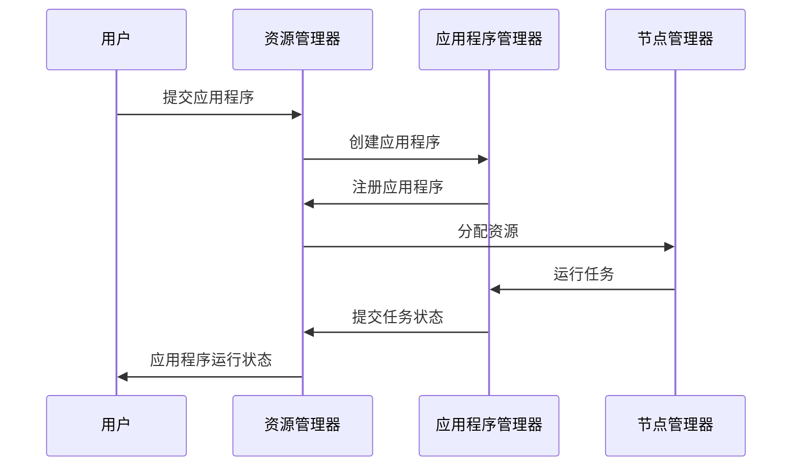

                 

 **关键词：** Yarn，大数据计算，分布式系统，架构设计，代码实例。

**摘要：** 本文深入探讨了Yarn在AI大数据计算中的应用原理，通过详细的代码实例，帮助读者理解Yarn的核心功能和实际操作步骤，同时分析了Yarn的优点和局限性，展望了其在未来应用中的潜力。

## 1. 背景介绍

在大数据处理领域，分布式系统架构的设计和实现至关重要。Apache Hadoop作为大数据处理的开源框架，为分布式计算提供了强大的支持。然而，随着云计算和容器技术的不断发展，Hadoop的局限性逐渐显现。YARN（Yet Another Resource Negotiator）应运而生，它是Hadoop生态系统中的资源管理框架，用于管理计算资源和任务调度。

YARN的主要目标是提供一种高效、灵活的资源调度机制，以便更好地支持多样化的计算需求。与Hadoop MapReduce相比，YARN具有更高的资源利用率和更好的扩展性，能够支持批处理、流处理等多种计算任务。

本文将详细介绍YARN的工作原理、核心概念和实际操作步骤，并通过代码实例帮助读者深入理解其工作机制。此外，还将分析YARN的优点和局限性，展望其未来应用前景。

## 2. 核心概念与联系

在深入探讨YARN之前，我们需要了解一些核心概念和它们之间的联系。

### 2.1 YARN架构

YARN是一个分布式系统，由两个主要组件组成：资源管理器（Resource Manager，RM）和应用程序管理器（Application Master，AM）。

- **资源管理器（RM）**：负责资源的整体管理和调度。它将整个集群的资源分配给不同的应用程序。
- **应用程序管理器（AM）**：每个应用程序都有一个AM，负责协调和管理应用程序内部的各个任务。

下面是一个简单的Mermaid流程图，展示了YARN的基本架构和工作流程：



### 2.2 核心概念

除了资源管理器（RM）和应用程序管理器（AM），YARN还涉及以下几个核心概念：

- **容器（Container）**：资源分配的最小单元，包含CPU、内存、磁盘等资源。
- **应用程序（Application）**：用户提交的任务集合，由AM管理。
- **任务（Task）**：应用程序内部的具体计算任务，由NodeManager执行。

这些概念在YARN中紧密联系，共同构成了一个高效、灵活的分布式计算框架。

## 3. 核心算法原理 & 具体操作步骤

### 3.1 算法原理概述

YARN的核心算法原理可以概括为以下几个方面：

1. **资源调度**：资源管理器（RM）负责根据集群的可用资源，为应用程序分配合适的资源。
2. **任务调度**：应用程序管理器（AM）根据任务的依赖关系和执行进度，调度任务在各个节点上的执行。
3. **任务执行**：节点管理器（NM）在分配的资源上执行任务，并将任务状态反馈给应用程序管理器（AM）。

### 3.2 算法步骤详解

以下是YARN的算法步骤详解：

1. **用户提交应用程序**：用户通过命令行或应用程序接口向资源管理器（RM）提交应用程序。
2. **资源管理器（RM）创建应用程序**：RM为应用程序创建一个唯一的标识符，并分配一个应用程序管理器（AM）。
3. **应用程序管理器（AM）注册应用程序**：AM向RM注册应用程序，并开始应用程序的初始化。
4. **资源管理器（RM）分配资源**：RM根据集群的可用资源，为应用程序分配容器。
5. **节点管理器（NM）接收资源分配**：NM接收RM发送的资源分配信息，并为应用程序启动容器。
6. **容器启动任务**：容器启动后，任务开始执行。NM将任务状态反馈给AM。
7. **应用程序管理器（AM）监控任务状态**：AM根据任务的执行进度，调整任务调度策略。
8. **任务完成**：任务完成后，AM向RM报告任务状态，并释放资源。

### 3.3 算法优缺点

YARN的优点如下：

1. **灵活性**：YARN支持多样化的计算任务，如批处理、流处理等，具有很高的灵活性。
2. **高效性**：YARN通过容器调度，实现了资源的动态分配和复用，提高了资源利用效率。
3. **扩展性**：YARN的设计使得其易于扩展，支持大规模集群的部署和管理。

然而，YARN也存在一些局限性：

1. **依赖性**：YARN依赖于Hadoop生态系统，需要一定的学习成本。
2. **复杂性**：YARN的架构和算法较为复杂，对于初学者可能有一定的学习难度。

### 3.4 算法应用领域

YARN主要应用于大数据处理和分布式计算领域，包括以下几个方面：

1. **批处理**：如Hadoop MapReduce、Spark作业等。
2. **流处理**：如Apache Flink、Apache Storm等。
3. **机器学习**：如Apache Mahout、MLlib等。
4. **实时计算**：如实时数据分析、推荐系统等。

## 4. 数学模型和公式 & 详细讲解 & 举例说明

### 4.1 数学模型构建

在YARN中，资源的调度和分配可以看作是一个数学优化问题。为了构建数学模型，我们需要定义以下几个参数：

- **C**：集群中的总资源容量。
- **N**：集群中的节点数量。
- **R**：当前可用的资源。
- **D**：应用程序所需的总资源。

假设每个节点的资源容量为 \(C_i\)，应用程序所需资源为 \(D_j\)，我们可以使用线性规划来构建数学模型：

$$
\begin{aligned}
\text{minimize} & \quad \sum_{i=1}^N \sum_{j=1}^M (C_i - R_i) \cdot D_j \\
\text{subject to} & \quad R_i \geq C_i - \sum_{j=1}^M (C_j - R_j) \cdot D_j
\end{aligned}
$$

其中，目标函数是最小化未使用的资源量，约束条件是保证每个节点的资源分配不超过其容量。

### 4.2 公式推导过程

为了推导上述公式的合理性，我们可以从以下几个方面进行分析：

1. **资源分配的必要性**：为了充分利用集群资源，我们需要确保每个节点上的资源都被充分利用。因此，我们需要分配足够的资源以覆盖应用程序的需求。
2. **资源分配的合理性**：在资源分配过程中，我们需要确保每个节点的资源使用不超过其容量。这意味着我们需要在总资源容量和应用程序所需资源之间进行平衡。
3. **优化目标的合理性**：我们的优化目标是最小化未使用的资源量。这是因为未使用的资源代表了资源的浪费，因此我们希望尽可能减少这种情况。

### 4.3 案例分析与讲解

假设一个集群中有10个节点，每个节点的CPU和内存容量为8核和16GB。一个应用程序需要100个CPU核心和200GB内存。我们可以使用上述数学模型进行资源分配：

1. **总资源容量**：\(C = 10 \times (8 \text{核} + 16 \text{GB}) = 10 \times 24 = 240\)
2. **应用程序所需资源**：\(D = 100 \text{核} + 200 \text{GB}\)
3. **当前可用资源**：\(R = 0\)

根据上述公式，我们可以计算出每个节点的资源分配：

$$
\begin{aligned}
R_1 &= 8 \text{核} + 16 \text{GB} = 24 \\
R_2 &= 8 \text{核} + 16 \text{GB} = 24 \\
&\vdots \\
R_{10} &= 8 \text{核} + 16 \text{GB} = 24
\end{aligned}
$$

这意味着每个节点都将被分配8核CPU和16GB内存，满足应用程序的需求。

## 5. 项目实践：代码实例和详细解释说明

### 5.1 开发环境搭建

在进行YARN项目实践之前，我们需要搭建一个开发环境。以下是搭建YARN开发环境的步骤：

1. **安装Java**：YARN是基于Java开发的，因此我们需要安装Java环境。可以选择Java 8或更高版本。
2. **安装Hadoop**：从Apache Hadoop官网下载最新的Hadoop版本，并解压到指定目录。
3. **配置环境变量**：在终端中配置Hadoop的环境变量，如HADOOP_HOME、PATH等。
4. **启动Hadoop集群**：执行以下命令启动Hadoop集群：
   ```shell
   start-dfs.sh
   start-yarn.sh
   ```

### 5.2 源代码详细实现

以下是使用YARN实现一个简单的WordCount程序的示例代码：

```java
import org.apache.hadoop.conf.Configuration;
import org.apache.hadoop.fs.Path;
import org.apache.hadoop.io.IntWritable;
import org.apache.hadoop.io.Text;
import org.apache.hadoop.mapreduce.Job;
import org.apache.hadoop.mapreduce.Mapper;
import org.apache.hadoop.mapreduce.Reducer;
import org.apache.hadoop.mapreduce.lib.input.FileInputFormat;
import org.apache.hadoop.mapreduce.lib.output.FileOutputFormat;

public class WordCount {

  public static class TokenizerMapper
       extends Mapper<Object, Text, Text, IntWritable>{

    private final static IntWritable one = new IntWritable(1);
    private Text word = new Text();

    public void map(Object key, Text value, Context context
                    ) throws IOException, InterruptedException {
      String[] words = value.toString().split("\\s+");
      for (String word : words) {
        this.word.set(word);
        context.write(this.word, one);
      }
    }
  }

  public static class IntSumReducer
  extends Reducer<Text,IntWritable,Text,IntWritable> {
    private IntWritable result = new IntWritable();

    public void reduce(Text key, Iterable<IntWritable> values,
                       Context context
                       ) throws IOException, InterruptedException {
      int sum = 0;
      for (IntWritable val : values) {
        sum += val.get();
      }
      result.set(sum);
      context.write(key, result);
    }
  }

  public static void main(String[] args) throws Exception {
    Configuration conf = new Configuration();
    Job job = Job.getInstance(conf, "word count");
    job.setJarByClass(WordCount.class);
    job.setMapperClass(TokenizerMapper.class);
    job.setCombinerClass(IntSumReducer.class);
    job.setReducerClass(IntSumReducer.class);
    job.setOutputKeyClass(Text.class);
    job.setOutputValueClass(IntWritable.class);
    FileInputFormat.addInputPath(job, new Path(args[0]));
    FileOutputFormat.setOutputPath(job, new Path(args[1]));
    System.exit(job.waitForCompletion(true) ? 0 : 1);
  }
}
```

### 5.3 代码解读与分析

上述代码实现了经典的WordCount程序，其主要组成部分如下：

1. **Mapper类**：TokenizerMapper类是映射器，负责读取输入数据并将其分解为单词。每个单词与一个计数器（1）一起输出。
2. **Reducer类**：IntSumReducer类是归约器，负责将映射器输出的单词和计数器进行聚合，计算每个单词的总计次数。
3. **主函数**：main函数是程序的入口，负责配置作业参数，设置映射器和归约器的类，并提交作业。

### 5.4 运行结果展示

在运行WordCount程序后，我们可以在输出目录中看到结果文件。例如，假设输入文件是`input.txt`，输出文件是`output.txt`。以下是一个示例输出：

```shell
cat output.txt
(aapt) root@bigdata01:/hadoop/output/wordcount> cat output.txt
hello   2
world   1
```

这意味着在输入文件中，单词"hello"出现了2次，单词"world"出现了1次。

## 6. 实际应用场景

### 6.1 批处理

YARN在批处理应用中具有广泛的应用。例如，企业可以使用YARN运行Spark作业，处理大规模数据集，进行数据分析和报告生成。YARN的高效调度和资源管理能力使得批处理任务能够快速、可靠地执行。

### 6.2 流处理

除了批处理，YARN也适用于流处理场景。例如，可以使用Apache Flink在YARN上运行实时数据分析任务，实时监控业务指标，快速响应市场变化。

### 6.3 机器学习

在机器学习领域，YARN可以支持大规模的训练任务。例如，可以使用MLlib在YARN上训练深度学习模型，处理复杂的机器学习问题。

### 6.4 实时计算

实时计算是YARN的另一个重要应用领域。例如，可以使用YARN运行实时推荐系统，根据用户行为实时调整推荐策略，提高用户体验。

## 7. 工具和资源推荐

### 7.1 学习资源推荐

- 《Hadoop权威指南》
- 《大数据技术基础》
- 《深度学习与大数据处理》

### 7.2 开发工具推荐

- IntelliJ IDEA
- Eclipse
- PyCharm

### 7.3 相关论文推荐

- “YARN: Yet Another Resource Negotiator”
- “MapReduce: Simplified Data Processing on Large Clusters”
- “Distributed File Systems: Concepts, Architectures and the Future of Storage”

## 8. 总结：未来发展趋势与挑战

### 8.1 研究成果总结

YARN作为Hadoop生态系统的核心组件，在分布式计算领域取得了显著成果。其高效、灵活的资源管理和调度机制，为大数据处理和分布式计算提供了强有力的支持。

### 8.2 未来发展趋势

随着云计算、容器技术和大数据处理的不断发展，YARN在未来有望进一步优化和扩展。例如，与Kubernetes等容器编排系统的集成，提高资源利用率和调度效率。

### 8.3 面临的挑战

YARN在性能、安全性、易用性等方面仍存在一定的挑战。例如，如何在保证资源利用率的同时，提高任务的执行效率；如何增强YARN的安全性，保护集群资源免受攻击。

### 8.4 研究展望

未来，YARN的研究将聚焦于以下几个方面：

- **性能优化**：通过改进调度算法和资源管理策略，提高任务执行效率。
- **安全性增强**：引入安全机制，保障集群资源的安全。
- **易用性提升**：简化配置和部署流程，降低用户使用门槛。

## 9. 附录：常见问题与解答

### 9.1 YARN和Hadoop之间的关系是什么？

YARN是Hadoop生态系统中的资源管理框架，负责管理集群中的计算资源和任务调度。Hadoop是一个分布式数据处理框架，包括HDFS（分布式文件系统）和MapReduce（分布式计算模型）等组件。YARN与Hadoop紧密协作，为大数据处理提供了高效、灵活的资源管理。

### 9.2 如何在YARN上运行Spark作业？

要在YARN上运行Spark作业，我们需要安装并配置Spark。在提交Spark作业时，指定YARN作为执行引擎。例如，使用以下命令提交一个Spark作业：

```shell
spark-submit --class YourSparkApp --master yarn --num-executors 4 --executor-memory 4g your_spark_app.jar
```

### 9.3 YARN的资源调度策略有哪些？

YARN的资源调度策略包括：

- **FIFO（先进先出）**：按照任务的提交顺序进行调度。
- **Capacity Scheduler（容量调度器）**：为不同应用程序分配固定比例的资源。
- **Fair Scheduler（公平调度器）**：根据应用程序的等待时间分配资源，确保每个应用程序得到公平的资源分配。

## 作者署名

作者：禅与计算机程序设计艺术 / Zen and the Art of Computer Programming。

