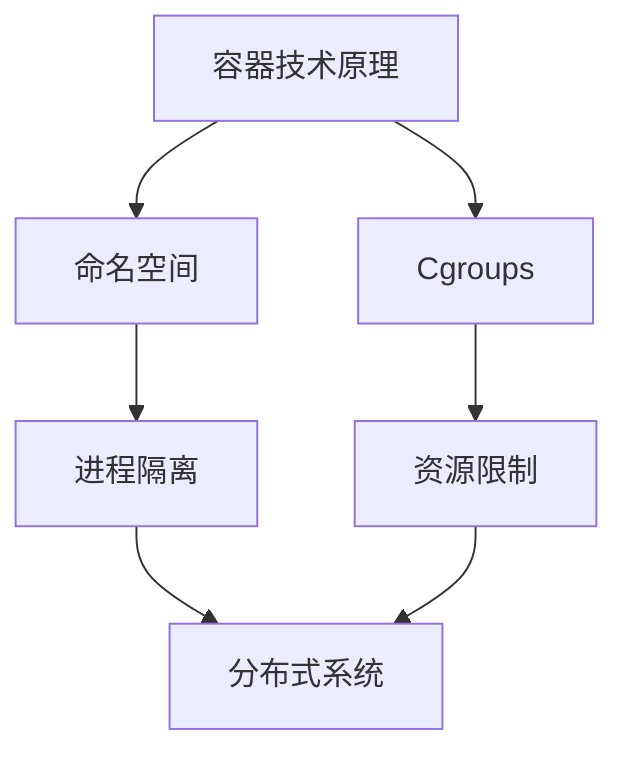

                 

关键词：AI、大数据计算、容器技术、分布式系统、代码实例

摘要：本文将深入探讨AI大数据计算中的容器技术，从背景介绍、核心概念与联系、核心算法原理与步骤、数学模型和公式、项目实践、实际应用场景、工具和资源推荐、总结与展望等多个方面，全面解析容器技术在AI大数据计算中的应用，帮助读者更好地理解和掌握这一关键技术。

## 1. 背景介绍

### 大数据计算的发展

随着互联网、物联网和社交网络的迅速发展，数据量呈现出爆炸式增长，大数据计算应运而生。大数据计算是指处理海量数据的一系列技术，包括数据采集、存储、处理、分析和可视化等。随着AI技术的崛起，大数据计算逐渐与AI技术深度融合，为AI应用提供了强大的数据支持。

### 容器技术的崛起

容器技术是一种轻量级的虚拟化技术，它通过在操作系统层面上创建独立的运行时环境，使得应用程序可以在不同的操作系统、硬件和云平台上运行。容器技术因其高效性、可移植性和灵活性，逐渐成为大数据计算和AI应用中的关键技术。

## 2. 核心概念与联系

### 容器技术原理

容器技术基于操作系统的命名空间（Namespace）和进程控制（Cgroups）两大机制。命名空间为进程提供独立的运行时环境，使得进程在容器内无法感知到外部环境；而Cgroups则通过资源隔离和限制，确保容器内的进程不会影响到其他容器和宿主机。

### 分布式系统的关联

容器技术在分布式系统中发挥着重要作用。分布式系统通过将任务分配到多个节点上执行，提高系统的整体性能和可扩展性。容器技术使得分布式系统中的节点可以更加灵活地部署、管理和调度。

### Mermaid 流程图

下面是一个简单的Mermaid流程图，展示了容器技术的基本原理和分布式系统的关联：



## 3. 核心算法原理 & 具体操作步骤

### 3.1 算法原理概述

容器技术的核心在于资源的隔离和调度。通过命名空间和Cgroups，容器技术实现了进程的独立运行和资源的限制。在分布式系统中，容器技术可以通过调度器（如Kubernetes）实现节点的动态分配和任务调度。

### 3.2 算法步骤详解

1. **容器创建**：用户通过Dockerfile或容器镜像创建容器。
2. **资源分配**：容器通过Cgroups进行资源限制和隔离。
3. **进程启动**：容器内启动应用程序进程。
4. **容器调度**：分布式系统通过调度器将容器分配到合适的节点上执行。
5. **容器监控**：监控系统对容器进行实时监控和管理。

### 3.3 算法优缺点

**优点**：
- 资源利用高效：容器技术可以在宿主机上运行多个容器，提高资源利用率。
- 部署灵活：容器技术支持跨平台部署，便于分布式系统的扩展和迁移。
- 运行速度快：容器技术相比虚拟机有更快的启动速度。

**缺点**：
- 安全性问题：容器技术存在一定的安全风险，如容器逃逸。
- 系统依赖复杂：容器技术需要依赖操作系统和容器运行时环境。

### 3.4 算法应用领域

容器技术在AI大数据计算中的应用十分广泛，包括但不限于以下领域：
- **分布式AI训练**：容器技术可以方便地部署和管理大规模的AI训练任务。
- **数据科学平台**：容器技术可以提供高效的数据处理和分析环境。
- **云计算服务**：容器技术是云计算服务提供商的核心技术之一。

## 4. 数学模型和公式 & 详细讲解 & 举例说明

### 4.1 数学模型构建

容器技术中的数学模型主要包括以下方面：

1. **资源分配模型**：通过Cgroups实现容器资源的限制和调度。
2. **调度模型**：分布式系统中的任务调度策略，如基于负载均衡、最小延迟等。

### 4.2 公式推导过程

资源分配模型可以表示为：

\[ R(c) = \sum_{i=1}^{n} r_i(c) \]

其中，\( R(c) \)表示容器\( c \)的总体资源占用，\( r_i(c) \)表示容器\( c \)在资源\( i \)上的占用。

调度模型可以表示为：

\[ T(s) = \min_{c \in C} \frac{C(s)}{R(c)} \]

其中，\( T(s) \)表示调度器在时刻\( s \)的调度时间，\( C(s) \)表示当前待调度任务数，\( R(c) \)表示容器\( c \)的总体资源占用。

### 4.3 案例分析与讲解

假设我们有一个包含5个容器的分布式系统，每个容器的资源占用如下表所示：

| 容器ID | CPU占用（核心） | 内存占用（GB） |
| :----: | :-------------: | :------------: |
|   1    |        2        |       4       |
|   2    |        1        |       2       |
|   3    |        3        |       6       |
|   4    |        1        |       1       |
|   5    |        2        |       3       |

根据资源分配模型，我们可以计算出每个容器的总体资源占用：

\[ R(1) = 2 + 4 = 6 \]
\[ R(2) = 1 + 2 = 3 \]
\[ R(3) = 3 + 6 = 9 \]
\[ R(4) = 1 + 1 = 2 \]
\[ R(5) = 2 + 3 = 5 \]

根据调度模型，我们可以在5个待调度任务中选择最优的容器进行调度。假设当前时刻有3个待调度任务，我们可以计算出每个容器的调度时间：

\[ T(1) = \frac{3}{6} = 0.5 \]
\[ T(2) = \frac{3}{3} = 1 \]
\[ T(3) = \frac{3}{9} = 0.33 \]
\[ T(4) = \frac{3}{2} = 1.5 \]
\[ T(5) = \frac{3}{5} = 0.6 \]

因此，最优的调度选择是容器3，其调度时间为0.33。

## 5. 项目实践：代码实例和详细解释说明

### 5.1 开发环境搭建

在开始实践之前，我们需要搭建一个包含Docker和Kubernetes的开发环境。以下是搭建步骤：

1. **安装Docker**：在宿主机上安装Docker，并确保Docker版本为19.03或更高。
2. **安装Kubernetes**：参考Kubernetes官方文档，安装Kubernetes集群。我们可以使用Minikube在本地环境中启动一个单节点集群。
3. **配置Kubernetes工具**：安装kubectl等Kubernetes命令行工具，以便进行集群管理和部署。

### 5.2 源代码详细实现

以下是一个简单的Dockerfile示例，用于创建一个基于Python的容器镜像：

```dockerfile
# 指定基础镜像
FROM python:3.8

# 设置工作目录
WORKDIR /app

# 复制应用程序代码
COPY . .

# 安装依赖
RUN pip install -r requirements.txt

# 暴露端口
EXPOSE 8000

# 运行应用程序
CMD ["python", "app.py"]
```

### 5.3 代码解读与分析

在这个Dockerfile中，我们首先指定了基础镜像为Python 3.8。然后，我们将应用程序代码复制到容器的工作目录中，并安装所需的依赖。接下来，我们暴露了容器的8000端口，以便外部访问应用程序。最后，我们设置了容器的启动命令，即运行应用程序的主进程。

### 5.4 运行结果展示

通过以下命令，我们将创建并启动一个容器：

```shell
$ docker build -t my-app .
$ docker run -d -p 8000:8000 my-app
```

在成功启动容器后，我们可以在宿主机上访问容器的8000端口，查看应用程序的运行结果。

## 6. 实际应用场景

容器技术在AI大数据计算中的实际应用场景包括但不限于以下方面：

- **分布式AI训练**：容器技术可以方便地部署和管理大规模的AI训练任务，提高训练效率和可扩展性。
- **数据科学平台**：容器技术可以为数据科学家提供高效的数据处理和分析环境，支持多种编程语言和工具。
- **云计算服务**：容器技术是云计算服务提供商的核心技术之一，可以实现资源的灵活调度和高效利用。

## 7. 工具和资源推荐

### 7.1 学习资源推荐

- **Docker官方文档**：https://docs.docker.com/
- **Kubernetes官方文档**：https://kubernetes.io/docs/
- **《容器实践》**：https://www.oreilly.com/library/view/容器实践/9781492033333/

### 7.2 开发工具推荐

- **Docker Desktop**：https://www.docker.com/products/docker-desktop
- **Kubectl**：https://kubernetes.io/docs/tasks/tools/install-kubectl/

### 7.3 相关论文推荐

- **"Docker: Lightweight Linux Containers for Developing, Shipping, and Running Applications"**：https://www.docker.com/sites/default/files/docker_1.0_research_report.pdf
- **"Kubernetes: Design and Implementation"**：https://www.usenix.org/system/files/conference/atc17/atc17_paper_jiang.pdf

## 8. 总结：未来发展趋势与挑战

### 8.1 研究成果总结

容器技术在AI大数据计算中取得了显著的成果，成为分布式系统和云计算服务的重要支撑。未来，容器技术将继续与AI技术、大数据技术深度融合，推动AI大数据计算领域的创新发展。

### 8.2 未来发展趋势

- **容器编排与调度优化**：优化容器编排和调度策略，提高资源利用效率和系统性能。
- **容器安全与隐私保护**：加强容器安全防护，确保容器运行的安全性。
- **容器技术与区块链技术融合**：探索容器技术在区块链领域的应用，实现更高效的分布式账本系统。

### 8.3 面临的挑战

- **跨平台兼容性**：解决容器在不同操作系统和硬件平台上的兼容性问题。
- **容器资源隔离与调度**：提高容器资源隔离性和调度效率，降低系统开销。
- **容器安全风险**：加强容器安全防护，防范容器逃逸等安全威胁。

### 8.4 研究展望

容器技术在AI大数据计算领域的未来发展前景广阔，但仍面临诸多挑战。我们需要在容器编排与调度、容器安全与隐私保护等方面进行深入研究，为AI大数据计算提供更加高效、安全和可靠的支撑。

## 9. 附录：常见问题与解答

### Q：容器技术与虚拟机技术有什么区别？

A：容器技术相比虚拟机技术有以下几个主要区别：

- **资源隔离**：容器技术通过命名空间和Cgroups实现进程和资源的隔离，而虚拟机技术通过硬件虚拟化实现完整的操作系统隔离。
- **性能开销**：容器技术相比虚拟机技术有更低的性能开销，因为容器不需要模拟完整的硬件环境。
- **部署与迁移**：容器技术支持跨平台部署和迁移，而虚拟机技术需要依赖于特定的硬件环境和操作系统。

----------------------------------------------------------------

作者：禅与计算机程序设计艺术 / Zen and the Art of Computer Programming

