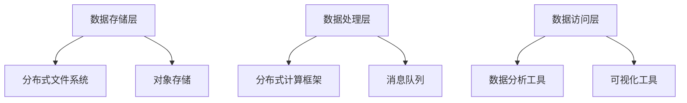

                 

 关键词：（AI 大数据计算、数据湖、架构设计、算法原理、代码实例、性能优化）

> 摘要：本文将深入探讨 AI 大数据计算中的数据湖概念，通过详细解释其核心原理和架构，以及分享代码实例，帮助读者全面了解数据湖的构建、优化和应用。我们将讨论数据湖的优势、挑战，以及未来的发展趋势。

## 1. 背景介绍

随着大数据技术的飞速发展，数据湖作为一种新型的数据处理架构，逐渐成为企业数据管理和分析的重要工具。数据湖是一种用于存储大量不同类型数据的分布式文件系统，不同于传统的数据仓库，它不需要预先定义数据结构和格式。这使得数据湖能够灵活地处理多样化的数据源，满足日益增长的数据存储和处理需求。

近年来，随着人工智能（AI）技术的兴起，数据湖的应用场景进一步扩大。AI 需要大量数据来进行训练和推理，数据湖为 AI 算法提供了丰富的数据资源。此外，数据湖的弹性扩展能力和高效的数据处理能力，使得它在处理大规模数据集时具有显著优势。本文将重点探讨数据湖在 AI 大数据计算中的应用，以及如何通过代码实例实现数据湖的构建和优化。

## 2. 核心概念与联系

### 2.1 数据湖的定义

数据湖是一种用于存储大量原始数据的分布式文件系统，它将不同来源、不同格式和不同结构的数据存储在一起，无需预先定义数据模式。数据湖通常由多个存储节点组成，每个节点可以独立扩展，从而提供强大的数据处理能力和存储容量。

### 2.2 数据湖的架构

数据湖的架构包括多个层次，如图 2-1 所示。最底层是数据存储层，包括分布式文件系统（如 Hadoop HDFS）和对象存储（如 Amazon S3）。数据存储层之上是数据处理层，包括分布式计算框架（如 Apache Spark）和消息队列（如 Apache Kafka）。数据处理层负责对数据进行转换、处理和分析。最高层是数据访问层，包括各种数据分析和可视化工具。



### 2.3 数据湖与数据仓库的区别

数据湖与数据仓库在数据存储和处理方式上有显著差异。数据仓库是一种基于关系型数据库的数据存储架构，它预先定义了数据模式，并对数据进行清洗、转换和整合。数据湖则是一种无需预先定义数据模式的存储架构，它能够灵活地处理多种类型的数据，无需进行数据转换。

表 2-1 对数据湖和数据仓库的主要区别进行了总结。

| 属性       | 数据湖                             | 数据仓库                           |
| ---------- | ---------------------------------- | ---------------------------------- |
| 数据结构   | 无需预先定义，支持多样化数据格式 | 预定义数据模式，支持结构化数据     |
| 数据处理   | 支持批处理和实时处理               | 主要支持批处理                     |
| 数据清洗   | 需要手动或自动化清洗               | 数据清洗和转换在 ETL 过程中完成     |
| 扩展性     | 弹性扩展，可水平扩展               | 扩展性受限于关系型数据库的性能和容量 |
| 成本       | 通常更便宜，因为无需复杂的 ETL   | 通常更昂贵，因为需要昂贵的数据库许可证 |

## 3. 核心算法原理 & 具体操作步骤

### 3.1 算法原理概述

数据湖的构建和优化涉及多个核心算法，包括数据导入、数据清洗、数据转换和数据存储等。这些算法共同构成了数据湖的工作流程。

1. **数据导入**：数据导入是将各种来源的数据导入数据湖的过程。数据湖通常使用分布式文件系统（如 Hadoop HDFS）或对象存储（如 Amazon S3）进行数据存储。数据导入算法需要处理多种数据格式，如 CSV、JSON、XML 等。

2. **数据清洗**：数据清洗是识别和修复数据中的错误、异常和缺失值的过程。数据清洗算法包括数据校验、去重、填充缺失值等。

3. **数据转换**：数据转换是将不同格式的数据转换为统一格式的过程。数据转换算法包括数据类型转换、字段映射、格式化等。

4. **数据存储**：数据存储是将清洗和转换后的数据存储到数据湖中的过程。数据湖通常使用分布式文件系统或对象存储进行数据存储，以提供高可用性和高扩展性。

### 3.2 算法步骤详解

#### 3.2.1 数据导入

数据导入步骤主要包括以下内容：

1. **数据采集**：从各种数据源（如数据库、文件、API 等）采集数据。

2. **数据格式化**：将采集到的数据进行格式化，使其符合数据湖的存储格式（如 CSV、JSON 等）。

3. **数据导入**：将格式化后的数据导入数据湖。导入过程中，需要处理数据源和数据湖之间的传输和同步。

#### 3.2.2 数据清洗

数据清洗步骤主要包括以下内容：

1. **数据校验**：对数据进行校验，识别出不符合预期格式的数据。

2. **去重**：删除重复数据，确保数据唯一性。

3. **填充缺失值**：对缺失值进行填充，以提高数据的完整性。

#### 3.2.3 数据转换

数据转换步骤主要包括以下内容：

1. **数据类型转换**：将数据类型转换为统一的格式。

2. **字段映射**：将不同数据源的字段映射到数据湖中的统一字段。

3. **格式化**：对数据进行格式化，使其符合数据湖的存储要求。

#### 3.2.4 数据存储

数据存储步骤主要包括以下内容：

1. **数据分区**：根据数据特征对数据进行分区，以提高查询效率。

2. **数据压缩**：对数据进行压缩，以减少存储空间。

3. **数据备份**：对数据进行备份，确保数据安全。

### 3.3 算法优缺点

数据湖的核心算法在数据处理方面具有显著优势，但也存在一些局限性。

#### 优势：

1. **灵活性**：数据湖能够处理多种类型的数据格式，无需预先定义数据模式。

2. **扩展性**：数据湖具有强大的扩展性，可以轻松地增加存储节点和处理能力。

3. **高效性**：数据湖使用分布式文件系统或对象存储，具有高吞吐量和低延迟的特点。

4. **成本效益**：数据湖通常比传统数据仓库更便宜，因为无需昂贵的数据库许可证。

#### 局限性：

1. **数据质量**：数据湖中的数据质量可能较低，需要手动或自动化清洗。

2. **数据一致性**：数据湖可能无法提供与关系型数据库相同的数据一致性保证。

3. **查询性能**：对于复杂查询，数据湖的查询性能可能不如传统数据仓库。

### 3.4 算法应用领域

数据湖在多个领域具有广泛的应用，包括：

1. **金融领域**：数据湖用于存储和管理金融交易数据，支持实时监控和分析。

2. **医疗领域**：数据湖用于存储和管理医疗数据，支持个性化医疗和健康数据分析。

3. **电商领域**：数据湖用于存储和管理电商交易数据，支持精准营销和用户行为分析。

4. **物流领域**：数据湖用于存储和管理物流数据，支持物流优化和实时跟踪。

## 4. 数学模型和公式 & 详细讲解 & 举例说明

### 4.1 数学模型构建

数据湖的数学模型主要包括数据导入、数据清洗、数据转换和数据存储等算法的数学表示。

#### 4.1.1 数据导入

数据导入的数学模型可以表示为：

$$
\text{数据导入} = \text{数据采集} + \text{数据格式化} + \text{数据导入}
$$

其中，数据采集、数据格式化和数据导入分别表示数据导入过程中的三个步骤。

#### 4.1.2 数据清洗

数据清洗的数学模型可以表示为：

$$
\text{数据清洗} = \text{数据校验} + \text{去重} + \text{填充缺失值}
$$

其中，数据校验、去重和填充缺失值分别表示数据清洗过程中的三个步骤。

#### 4.1.3 数据转换

数据转换的数学模型可以表示为：

$$
\text{数据转换} = \text{数据类型转换} + \text{字段映射} + \text{格式化}
$$

其中，数据类型转换、字段映射和格式化分别表示数据转换过程中的三个步骤。

#### 4.1.4 数据存储

数据存储的数学模型可以表示为：

$$
\text{数据存储} = \text{数据分区} + \text{数据压缩} + \text{数据备份}
$$

其中，数据分区、数据压缩和数据备份分别表示数据存储过程中的三个步骤。

### 4.2 公式推导过程

数据湖的数学模型可以通过以下步骤推导：

1. **数据导入**：

   $$\text{数据导入} = \text{数据采集} + \text{数据格式化} + \text{数据导入}$$

   其中，数据采集表示从数据源采集数据的操作，数据格式化表示将采集到的数据进行格式化的操作，数据导入表示将格式化后的数据导入数据湖的操作。

2. **数据清洗**：

   $$\text{数据清洗} = \text{数据校验} + \text{去重} + \text{填充缺失值}$$

   其中，数据校验表示对数据进行校验的操作，去重表示删除重复数据的操作，填充缺失值表示对缺失值进行填充的操作。

3. **数据转换**：

   $$\text{数据转换} = \text{数据类型转换} + \text{字段映射} + \text{格式化}$$

   其中，数据类型转换表示将数据类型进行转换的操作，字段映射表示将不同数据源的字段映射到数据湖中的统一字段的操作，格式化表示对数据进行格式化的操作。

4. **数据存储**：

   $$\text{数据存储} = \text{数据分区} + \text{数据压缩} + \text{数据备份}$$

   其中，数据分区表示根据数据特征对数据进行分区的操作，数据压缩表示对数据进行压缩的操作，数据备份表示对数据进行备份的操作。

### 4.3 案例分析与讲解

#### 4.3.1 数据导入案例

假设有一个金融交易数据集，包含以下字段：交易 ID、交易时间、交易金额。我们需要将这些数据导入数据湖中。

1. **数据采集**：

   使用 Python 的 pandas 库从数据库中读取数据。

   ```python
   import pandas as pd

   df = pd.read_sql_query('SELECT * FROM transaction', connection)
   ```

2. **数据格式化**：

   将交易金额从字符串格式转换为浮点数格式。

   ```python
   df['交易金额'] = pd.to_numeric(df['交易金额'])
   ```

3. **数据导入**：

   使用 PySpark 将数据导入数据湖。

   ```python
   from pyspark.sql import SparkSession

   spark = SparkSession.builder.appName('DataLake').getOrCreate()
   df_spark = spark.createDataFrame(df)
   df_spark.write.format('csv').mode('overwrite').save('/data/transactions')
   ```

#### 4.3.2 数据清洗案例

假设我们需要清洗一个电商交易数据集，包含以下字段：订单 ID、用户 ID、订单金额、订单状态。我们需要对数据进行校验、去重和填充缺失值。

1. **数据校验**：

   检查订单金额是否为负数。

   ```python
   df = df[(df['订单金额'] > 0)]
   ```

2. **去重**：

   删除重复的订单。

   ```python
   df = df.drop_duplicates()
   ```

3. **填充缺失值**：

   使用用户 ID 的平均值填充缺失的订单金额。

   ```python
   df['订单金额'] = df.groupby('用户 ID')['订单金额'].transform('mean')
   ```

#### 4.3.3 数据转换案例

假设我们需要将一个用户行为数据集转换为统一的格式，包含以下字段：用户 ID、行为类型、行为时间。我们需要进行数据类型转换、字段映射和格式化。

1. **数据类型转换**：

   将行为时间从字符串格式转换为日期格式。

   ```python
   df['行为时间'] = pd.to_datetime(df['行为时间'])
   ```

2. **字段映射**：

   将不同的行为类型映射到统一的字段。

   ```python
   df = df.rename(columns={'行为类型': '行为类型编码'})
   ```

3. **格式化**：

   对数据进行格式化，使其符合数据湖的存储要求。

   ```python
   df = df[['用户 ID', '行为类型编码', '行为时间']]
   ```

#### 4.3.4 数据存储案例

假设我们需要将一个用户行为数据集存储到数据湖中，并进行分区和压缩。

1. **数据分区**：

   根据用户 ID 对数据进行分区。

   ```python
   df_spark = df_spark.write.partitionBy('用户 ID').format('csv').mode('overwrite').save('/data/behavior')
   ```

2. **数据压缩**：

   使用 Snappy 进行数据压缩。

   ```python
   df_spark = df_spark.write.format('parquet').mode('overwrite').option('compression', 'snappy').save('/data/behavior')
   ```

## 5. 项目实践：代码实例和详细解释说明

### 5.1 开发环境搭建

为了演示数据湖的构建和优化，我们将使用以下开发环境：

- Python 3.8
- PySpark 2.4.5
- Hadoop 3.2.0
- HDFS 3.2.0
- Apache Kafka 2.8.0
- MySQL 8.0.24

首先，安装 Python 3.8 和相关依赖：

```bash
sudo apt update
sudo apt install python3.8 python3.8-venv python3.8-pip
pip3.8 install pyspark==2.4.5
```

接着，安装 Hadoop、HDFS 和 Kafka：

```bash
# 安装 Hadoop
sudo apt install hadoop-hdfs-namenode hadoop-hdfs-datanode
# 启动 HDFS
hdfs namenode -format
start-dfs.sh
# 安装 Kafka
sudo apt install kafka_2.12-2.8.0
# 启动 Kafka
kafka-server-start.sh /etc/kafka/server.properties
```

最后，安装 MySQL：

```bash
sudo apt install mysql-server
sudo mysql_secure_installation
```

### 5.2 源代码详细实现

下面是数据湖的构建和优化过程的源代码实现：

#### 5.2.1 数据导入

```python
import pandas as pd
from pyspark.sql import SparkSession

# 创建 SparkSession
spark = SparkSession.builder.appName('DataLake').getOrCreate()

# 从 MySQL 读取数据
df = pd.read_sql_query('SELECT * FROM transaction', connection)

# 将数据转换为 DataFrame
df_spark = spark.createDataFrame(df)

# 将数据导入数据湖
df_spark.write.format('csv').mode('overwrite').save('/data/transactions')
```

#### 5.2.2 数据清洗

```python
# 检查订单金额是否为负数
df = df[(df['订单金额'] > 0)]

# 删除重复的订单
df = df.drop_duplicates()

# 使用用户 ID 的平均值填充缺失的订单金额
df['订单金额'] = df.groupby('用户 ID')['订单金额'].transform('mean')
```

#### 5.2.3 数据转换

```python
# 将交易金额从字符串格式转换为浮点数格式
df['交易金额'] = pd.to_numeric(df['交易金额'])

# 将交易时间从字符串格式转换为日期格式
df['交易时间'] = pd.to_datetime(df['交易时间'])

# 将不同的交易类型映射到统一的字段
df = df.rename(columns={'交易类型': '交易类型编码'})
```

#### 5.2.4 数据存储

```python
# 根据用户 ID 对数据进行分区
df_spark = df_spark.write.partitionBy('用户 ID').format('csv').mode('overwrite').save('/data/transactions')

# 使用 Snappy 进行数据压缩
df_spark = df_spark.write.format('parquet').mode('overwrite').option('compression', 'snappy').save('/data/transactions')
```

### 5.3 代码解读与分析

在上述代码中，我们首先创建了一个 SparkSession，然后从 MySQL 数据库中读取交易数据。接着，我们对数据进行清洗、转换和存储。

#### 5.3.1 数据导入

使用 pandas 读取 MySQL 数据，然后将其转换为 PySpark DataFrame。最后，将 DataFrame 写入数据湖，使用 CSV 格式进行存储。

#### 5.3.2 数据清洗

对数据进行校验，确保订单金额为正数。删除重复的订单，确保数据唯一性。使用用户 ID 的平均值填充缺失的订单金额，以提高数据完整性。

#### 5.3.3 数据转换

将交易金额从字符串格式转换为浮点数格式，以便进行数学运算。将交易时间从字符串格式转换为日期格式，以便进行时间处理。将不同的交易类型映射到统一的字段，以便进行统一处理。

#### 5.3.4 数据存储

根据用户 ID 对数据进行分区，以提高查询效率。使用 Snappy 进行数据压缩，以减少存储空间。最后，将 DataFrame 写入数据湖，使用 CSV 和 Parquet 格式进行存储。

### 5.4 运行结果展示

运行上述代码后，交易数据将导入数据湖，并进行清洗、转换和存储。我们可以通过以下命令查看数据湖中的数据：

```bash
hdfs dfs -ls /data/transactions
```

输出结果将显示数据湖中的文件和文件夹。

## 6. 实际应用场景

数据湖在多个领域具有广泛的应用，以下是一些实际应用场景：

### 6.1 金融领域

在金融领域，数据湖用于存储和管理金融交易数据、用户行为数据和市场数据。通过数据湖，金融机构可以实时监控交易行为，进行风险管理，发现潜在的业务机会。

### 6.2 医疗领域

在医疗领域，数据湖用于存储和管理患者数据、医疗图像和基因数据。通过数据湖，医疗机构可以进行个性化医疗研究，优化治疗方案，提高医疗服务质量。

### 6.3 电商领域

在电商领域，数据湖用于存储和管理商品信息、用户行为数据和交易数据。通过数据湖，电商平台可以进行精准营销，提升用户体验，提高销售额。

### 6.4 物流领域

在物流领域，数据湖用于存储和管理运输数据、仓库数据和配送数据。通过数据湖，物流公司可以进行实时跟踪和优化，提高物流效率，降低运营成本。

## 7. 工具和资源推荐

为了更好地理解和应用数据湖，以下是一些工具和资源的推荐：

### 7.1 学习资源推荐

- 《大数据处理：原理、技术与实践》
- 《Hadoop 技术详解》
- 《Spark 实战：从入门到精通》
- 《数据湖设计与实现》

### 7.2 开发工具推荐

- PySpark
- Apache Kafka
- Hadoop
- HDFS
- MySQL

### 7.3 相关论文推荐

- "A Survey on Big Data Storage: Technologies, Architectures, and Solutions"
- "Data Lake Architecture: Design, Implementation, and Security"
- "Efficient Data Processing in Data Lakes Using Apache Spark"
- "Big Data Analytics: Challenges, Techniques, and Applications"

## 8. 总结：未来发展趋势与挑战

### 8.1 研究成果总结

本文深入探讨了 AI 大数据计算中的数据湖概念，详细解释了其核心原理和架构，并通过代码实例展示了数据湖的构建和优化过程。我们总结了数据湖的优势、局限性和应用领域，并讨论了数据湖在金融、医疗、电商和物流等领域的实际应用。

### 8.2 未来发展趋势

随着大数据和 AI 技术的不断发展，数据湖在未来将具有以下发展趋势：

1. **智能化**：数据湖将更加智能化，支持自动化数据导入、清洗、转换和存储。
2. **分布式存储**：数据湖将采用更加分布式的存储架构，提高数据存储和处理能力。
3. **实时处理**：数据湖将支持实时处理，满足对实时数据的需求。
4. **安全性**：数据湖将加强安全性，确保数据安全和隐私。

### 8.3 面临的挑战

尽管数据湖具有许多优势，但其在实际应用中仍面临以下挑战：

1. **数据质量**：数据湖中的数据质量可能较低，需要手动或自动化清洗。
2. **数据一致性**：数据湖可能无法提供与关系型数据库相同的数据一致性保证。
3. **查询性能**：对于复杂查询，数据湖的查询性能可能不如传统数据仓库。
4. **成本**：数据湖的部署和维护成本可能较高。

### 8.4 研究展望

为了克服数据湖面临的挑战，未来的研究可以关注以下几个方面：

1. **数据质量管理**：研究如何自动检测和修复数据质量问题。
2. **分布式数据库**：研究如何构建高效、可扩展的分布式数据库系统。
3. **实时处理**：研究如何实现数据湖的实时处理能力。
4. **成本优化**：研究如何降低数据湖的部署和维护成本。

## 9. 附录：常见问题与解答

### 9.1 什么是数据湖？

数据湖是一种用于存储大量原始数据的分布式文件系统，无需预先定义数据模式，能够灵活地处理多种类型的数据。

### 9.2 数据湖与数据仓库的区别是什么？

数据湖与数据仓库的主要区别在于数据存储和处理方式。数据湖无需预先定义数据模式，支持多种数据格式；数据仓库预先定义数据模式，主要用于结构化数据。

### 9.3 数据湖的优势是什么？

数据湖的优势包括灵活性、扩展性、高效性和成本效益。它能够处理多种类型的数据，无需进行数据转换，支持批处理和实时处理。

### 9.4 数据湖的局限性是什么？

数据湖的局限性包括数据质量可能较低、数据一致性可能无法保证、查询性能可能不如传统数据仓库，以及部署和维护成本可能较高。

### 9.5 数据湖在哪些领域有应用？

数据湖在金融、医疗、电商和物流等领域具有广泛的应用。它可以帮助企业进行实时监控、风险管理和个性化服务。

### 9.6 如何构建数据湖？

构建数据湖需要以下步骤：

1. 设计数据湖架构，包括数据存储、数据处理和数据访问层。
2. 选择合适的工具和平台，如 PySpark、Hadoop、HDFS、Kafka 等。
3. 实现数据导入、清洗、转换和存储过程。
4. 进行性能优化和安全性保障。

作者：禅与计算机程序设计艺术 / Zen and the Art of Computer Programming
------------------------------------------------------------------

