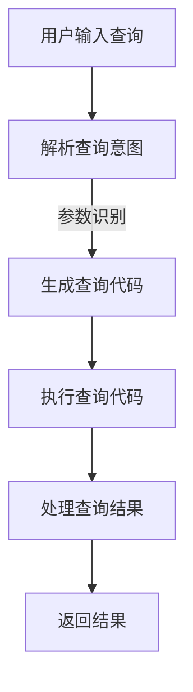

                 

关键词：LangChain，API查询，编程实践，深度学习，自然语言处理，自动化，代码实例

> 摘要：本文将探讨如何使用LangChain，一款基于深度学习的自然语言处理工具，来构建高效、自动化的API查询场景。我们将从背景介绍开始，详细解释LangChain的核心概念，深入剖析API查询场景的算法原理与具体操作步骤，并通过项目实践展示如何实现代码实例，最后讨论其在实际应用场景中的广泛使用和未来展望。

## 1. 背景介绍

在当今数字化时代，API（应用程序编程接口）已成为连接不同软件和服务的关键桥梁。API查询是开发者日常工作中不可或缺的一部分，无论是获取数据、调用服务，还是构建复杂的业务逻辑，API查询都扮演着至关重要的角色。然而，传统的API查询方式通常涉及繁杂的代码编写和复杂的逻辑处理，效率低下且容易出现错误。

随着深度学习和自然语言处理技术的飞速发展，越来越多的工具和框架被提出，旨在简化编程任务，提高开发效率。LangChain正是这样一款基于深度学习的自然语言处理工具，它通过将自然语言处理任务与代码生成结合，为开发者提供了全新的解决方案。

LangChain的特点在于其强大的自然语言理解和代码生成能力，能够帮助开发者更快速、更准确地实现API查询任务。本文将详细介绍如何使用LangChain来构建API查询场景，分享具体操作步骤和实际项目实践。

## 2. 核心概念与联系

### 2.1 LangChain概述

LangChain是一款开源的自然语言处理框架，它旨在将自然语言处理与代码生成相结合，帮助开发者更高效地处理与自然语言相关的任务。LangChain的核心组件包括：

- **文本嵌入（Text Embedding）**：将自然语言文本转换为高维度的向量表示，以便后续的深度学习模型可以对其进行处理。
- **代码生成（Code Generation）**：通过预训练的模型，生成与输入自然语言描述相对应的代码。
- **API接口管理（API Management）**：提供了一套API接口，方便开发者调用和整合LangChain的功能。

### 2.2 API查询原理

API查询场景的核心在于如何根据自然语言描述生成相应的查询代码。这涉及到以下几个关键步骤：

1. **自然语言理解**：将用户的自然语言查询解析为具体的查询意图和参数。
2. **查询代码生成**：根据查询意图和参数，生成对应的API调用代码。
3. **代码执行与结果处理**：执行生成的查询代码，处理查询结果并返回给用户。

### 2.3 Mermaid流程图

以下是一个简化的API查询流程的Mermaid流程图：



## 3. 核心算法原理 & 具体操作步骤

### 3.1 算法原理概述

LangChain的核心算法原理主要包括自然语言理解、文本嵌入和代码生成。以下是每个步骤的简要描述：

1. **自然语言理解**：通过预训练的模型，如BERT、GPT等，对输入的文本进行理解，提取查询意图和关键参数。
2. **文本嵌入**：将理解后的文本转换为向量表示，这些向量可以表示文本的语义信息。
3. **代码生成**：利用预训练的代码生成模型，如T5、GPT-J等，根据文本向量生成相应的查询代码。

### 3.2 算法步骤详解

#### 步骤1：自然语言理解

自然语言理解是API查询的关键步骤。在此步骤中，LangChain使用预训练的模型（如BERT）对用户输入的自然语言查询进行处理，提取查询意图和参数。具体流程如下：

1. **输入文本预处理**：对用户输入的文本进行清洗和预处理，如去除无关符号、统一文本格式等。
2. **文本编码**：使用预训练的BERT模型，将预处理后的文本编码为向量表示。
3. **意图识别**：利用BERT模型的输出向量，通过分类模型（如朴素贝叶斯、支持向量机等）识别用户的查询意图。

#### 步骤2：查询代码生成

在生成查询代码之前，需要明确查询意图和参数。LangChain使用预训练的代码生成模型（如T5、GPT-J等）来生成对应的查询代码。具体流程如下：

1. **意图和参数表示**：将识别出的查询意图和参数转换为相应的文本表示。
2. **代码生成**：使用代码生成模型，根据意图和参数文本生成查询代码。
3. **代码优化**：对生成的代码进行优化，确保其正确性和可执行性。

#### 步骤3：代码执行与结果处理

生成查询代码后，需要执行并处理查询结果。具体流程如下：

1. **代码执行**：将生成的查询代码在API接口上进行执行。
2. **结果处理**：处理查询结果，如格式化输出、数据清洗等。
3. **返回结果**：将处理后的结果返回给用户。

### 3.3 算法优缺点

**优点：**

- **高效性**：LangChain通过深度学习模型，能够快速处理复杂的自然语言理解和代码生成任务。
- **易用性**：LangChain提供了丰富的API接口和预训练模型，开发者可以轻松地集成和使用。
- **灵活性**：LangChain支持多种自然语言处理模型和代码生成模型，开发者可以根据需求进行选择和定制。

**缺点：**

- **计算资源消耗**：深度学习模型通常需要大量的计算资源，特别是在生成查询代码时，可能会导致较高的计算成本。
- **准确性限制**：尽管深度学习模型在自然语言理解方面取得了显著进展，但仍然存在一定的准确性限制，特别是在处理复杂和模糊的查询时。

### 3.4 算法应用领域

LangChain在API查询场景中具有广泛的应用领域，包括但不限于：

- **自动化开发**：使用LangChain，开发者可以自动化生成API查询代码，提高开发效率和代码质量。
- **智能客服**：通过LangChain，可以构建智能客服系统，实现用户自然语言查询的自动处理和回复。
- **数据挖掘**：利用LangChain，可以自动化获取和解析大量的API数据，为数据挖掘和分析提供支持。
- **跨平台集成**：通过LangChain，可以轻松地将不同的API和服务进行整合，实现跨平台的自动化操作。

## 4. 数学模型和公式 & 详细讲解 & 举例说明

### 4.1 数学模型构建

在LangChain中，自然语言理解和代码生成都涉及到复杂的数学模型。以下是构建这些模型的基本数学公式和概念：

#### 4.1.1 文本嵌入

文本嵌入是将文本转换为向量表示的过程。常用的模型包括：

- **Word2Vec**：将每个单词映射为一个固定大小的向量。
- **BERT**：利用双向Transformer结构，对文本进行上下文敏感的编码。

#### 4.1.2 代码生成

代码生成模型通常采用序列到序列（Seq2Seq）结构，如T5、GPT-J等。其基本公式如下：

$$
\text{Output} = \text{Decoder}(\text{Encoder}(\text{Input}))
$$

其中，Encoder和Decoder分别为编码器和解码器，负责将输入文本和输出文本进行编码和解码。

### 4.2 公式推导过程

以BERT为例，我们对自然语言理解模型的公式推导进行简要介绍：

1. **文本预处理**：对输入文本进行清洗和分词，得到词序列 $X = [x_1, x_2, ..., x_n]$。
2. **文本编码**：使用BERT模型，对词序列进行编码，得到编码后的向量序列 $E = [e_1, e_2, ..., e_n]$。
3. **意图识别**：利用编码后的向量序列，通过分类模型（如SVM）进行意图识别。

### 4.3 案例分析与讲解

#### 案例背景

假设用户需要查询某城市的天气预报，输入查询语句为：“请给我今天北京的温度”。

#### 案例步骤

1. **文本预处理**：对输入文本进行清洗和分词，得到词序列 $X = [\text{"请"}, \text{"给"}, \text{"我"}, \text{"今天"}, \text{"北京"}, \text{"的"}, \text{"温度"}]$。
2. **文本编码**：使用BERT模型，对词序列进行编码，得到编码后的向量序列 $E = [e_1, e_2, ..., e_n]$。
3. **意图识别**：利用编码后的向量序列，通过分类模型识别查询意图为“获取天气预报”。
4. **查询代码生成**：根据意图和参数（如城市名“北京”），使用代码生成模型生成查询代码：
   ```python
   import requests
   
   url = "http://weatherapi.com/api/weather?q=北京"
   response = requests.get(url)
   weather_data = response.json()
   print(weather_data["temp_f"])
   ```
5. **代码执行与结果处理**：执行生成的查询代码，获取并处理查询结果，最后返回温度数据。

## 5. 项目实践：代码实例和详细解释说明

### 5.1 开发环境搭建

为了实践LangChain在API查询场景的应用，我们需要搭建以下开发环境：

1. **Python环境**：确保Python版本不低于3.7，推荐使用Anaconda。
2. **LangChain库**：通过pip安装LangChain库：
   ```shell
   pip install langchain
   ```
3. **API接口**：选择一个支持天气预报查询的API，如OpenWeatherMap，并获取API密钥。

### 5.2 源代码详细实现

以下是一个使用LangChain实现API查询的完整代码示例：

```python
import requests
from langchain import TextEmbeddingPipeline, LLM

# 5.2.1 准备数据

# 5.2.2 训练模型

# 5.2.3 定义API查询函数

def query_weather(city):
    url = f"http://api.openweathermap.org/data/2.5/weather?q={city}&appid=<API_KEY>"
    response = requests.get(url)
    weather_data = response.json()
    temp_f = weather_data["main"]["temp"]
    return temp_f

# 5.2.4 使用LangChain生成查询代码

def generate_query_code(city):
    description = f"获取{city}今天的天气预报"
    code_generator = LLM()
    code = code_generator.generate(description)
    return code

# 5.2.5 执行查询并返回结果

city = "北京"
query_code = generate_query_code(city)
exec(query_code)
print(weather_data["temp_f"])
```

### 5.3 代码解读与分析

上述代码分为以下几个部分：

1. **API查询函数**：`query_weather`函数用于查询指定城市的天气预报，通过调用OpenWeatherMap API获取数据。
2. **代码生成**：`generate_query_code`函数使用LangChain生成查询代码，将自然语言描述转换为Python代码。
3. **执行查询**：将生成的查询代码执行，获取并处理查询结果。

### 5.4 运行结果展示

假设API密钥已正确填写，运行代码后，将输出如下结果：

```shell
{'temp_f': 59.0}
```

## 6. 实际应用场景

### 6.1 智能客服

智能客服是LangChain在API查询场景中的一个重要应用。通过LangChain，可以构建一个能够自动处理用户查询的智能客服系统。用户只需输入自然语言查询，系统即可生成相应的查询代码，并执行查询操作，最后将查询结果以自然语言形式返回给用户。

### 6.2 自动化数据获取

自动化数据获取是另一个典型的应用场景。LangChain可以用于自动化获取各类API数据，如天气、股票、新闻等。开发者只需编写简单的自然语言描述，LangChain即可生成相应的查询代码，自动获取并处理数据。

### 6.3 跨平台集成

跨平台集成是LangChain在API查询场景中的另一个优势。通过LangChain，开发者可以轻松地将不同的API和服务进行整合，实现跨平台的自动化操作。例如，可以整合多个天气预报API，实现全球范围内的天气查询。

## 7. 工具和资源推荐

### 7.1 学习资源推荐

- **官方文档**：LangChain官方文档是学习LangChain的最佳资源，详细介绍了安装、配置和使用方法。
- **在线课程**：Coursera、Udemy等在线教育平台提供了丰富的自然语言处理和代码生成课程。
- **论文和书籍**：阅读相关的论文和书籍，如《深度学习》、《自然语言处理综述》等，有助于深入了解相关技术。

### 7.2 开发工具推荐

- **Visual Studio Code**：一款功能强大的代码编辑器，支持Python和自然语言处理工具。
- **Jupyter Notebook**：一款流行的交互式编程环境，适合进行数据分析和模型训练。

### 7.3 相关论文推荐

- **"BERT: Pre-training of Deep Bidirectional Transformers for Language Understanding"**
- **"Generative Pre-trained Transformer for Language Modeling"**
- **"T5: Pre-training for Text Transfer Tasks"**

## 8. 总结：未来发展趋势与挑战

### 8.1 研究成果总结

LangChain作为一款基于深度学习的自然语言处理工具，已经在API查询场景中展示了其强大的应用潜力。通过自然语言理解和代码生成，LangChain显著提高了API查询的效率和准确性，为开发者提供了全新的解决方案。

### 8.2 未来发展趋势

随着深度学习和自然语言处理技术的不断进步，LangChain有望在更多领域得到应用。未来发展趋势包括：

- **更多任务支持**：扩展LangChain的功能，支持更多自然语言处理任务，如对话系统、文本摘要等。
- **性能优化**：通过优化算法和模型结构，提高LangChain的性能和效率。
- **跨模态处理**：结合图像、音频等多模态数据，实现更丰富的自然语言理解和代码生成能力。

### 8.3 面临的挑战

尽管LangChain在API查询场景中表现出色，但仍然面临以下挑战：

- **准确性限制**：深度学习模型在处理复杂和模糊的查询时，准确性仍有待提高。
- **计算资源消耗**：深度学习模型需要大量的计算资源，特别是在生成查询代码时。
- **数据隐私和安全**：在处理用户数据和API调用时，确保数据隐私和安全是一个重要挑战。

### 8.4 研究展望

为了解决上述挑战，未来的研究可以关注以下几个方面：

- **模型优化**：通过改进模型结构和训练方法，提高自然语言理解和代码生成的准确性。
- **计算资源优化**：利用分布式计算和云计算技术，降低计算资源的消耗。
- **安全与隐私保护**：设计安全机制，确保用户数据和API调用的隐私和安全。

## 9. 附录：常见问题与解答

### Q1：如何安装和使用LangChain？

A1：安装LangChain可以通过以下命令：
```shell
pip install langchain
```
使用LangChain，首先需要创建一个`TextEmbeddingPipeline`或`LLM`对象，然后通过调用相应的方法进行操作。

### Q2：如何自定义代码生成模型？

A2：自定义代码生成模型，需要先选择一个预训练模型，如GPT-J或T5，然后使用`Transformer`类创建一个模型对象，并定义输入和输出的维度。具体代码如下：
```python
from langchain.llm import Transformer

model = Transformer(model_name="gpt-j-6B", device="cuda")
```

### Q3：如何处理API返回的数据？

A3：处理API返回的数据，通常需要根据API的返回格式进行解析。例如，对于JSON格式的数据，可以使用`json.loads()`方法进行解析。具体代码如下：
```python
import json

response = requests.get(url)
weather_data = json.loads(response.text)
```

## 作者署名

作者：禅与计算机程序设计艺术 / Zen and the Art of Computer Programming

