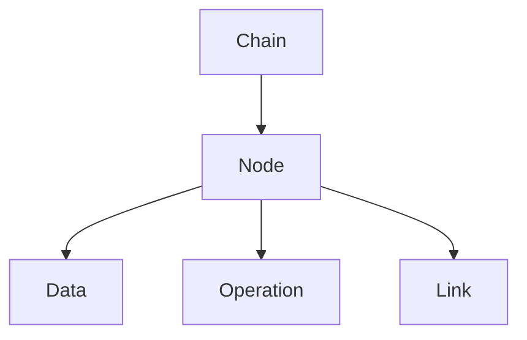

                 

关键词：LangChain, 编程实践，人工智能，数据结构，未来展望

> 摘要：本文将深入探讨LangChain编程框架的发展现状，以及其在人工智能领域的潜在应用。通过分析其核心概念、算法原理、数学模型，以及项目实践，我们将为读者提供一个全面的入门指南，并展望LangChain的未来发展趋势和挑战。

## 1. 背景介绍

随着人工智能技术的飞速发展，数据结构和算法已经成为计算机科学的核心组成部分。在这些领域中，LangChain作为一个新兴的编程框架，吸引了广泛的关注。LangChain由Joel Grus等人在2020年首次提出，其目的是简化链式编程，使开发者能够更高效地构建复杂的算法模型。

LangChain的出现，源于对现有数据结构（如链表、树、图等）和算法（如排序、查找、图遍历等）的抽象和封装。它通过定义一系列通用接口和组件，使得开发者可以在不关心具体实现细节的情况下，快速搭建和优化复杂的应用程序。这种设计理念与函数式编程和组件化开发的理念相契合，为编程范式的发展带来了新的思路。

## 2. 核心概念与联系

### 2.1. LangChain的基本概念

LangChain的核心概念包括：

- **链表（Chain）**：LangChain中的基本数据结构，用于存储一系列节点。每个节点都可以包含数据、操作以及其他链表节点。

- **链（Chainable）**：任何可以实现特定功能的组件，都可以作为链的一部分。例如，排序、查找、过滤等。

- **链接（Link）**：连接两个链表节点的操作，通常用于在链表中插入、删除或更新节点。

### 2.2. Mermaid流程图

为了更好地理解LangChain的工作原理，我们可以使用Mermaid流程图来展示其核心概念和联系。



在这个流程图中，`Chain` 表示整个链式结构，`Node` 是链表中的单个节点，`Data` 表示节点的数据内容，`Operation` 表示节点支持的操作，而 `Link` 用于连接两个节点。

## 3. 核心算法原理 & 具体操作步骤

### 3.1. 算法原理概述

LangChain的核心算法原理基于链式编程。链式编程的特点是操作和结果可以连续执行，从而简化了程序的结构，提高了代码的可读性和可维护性。在LangChain中，链表节点不仅可以存储数据，还可以存储操作，这使得算法的实现更加灵活。

### 3.2. 算法步骤详解

1. **定义链表节点**：首先，我们需要定义链表节点，每个节点包含数据和操作。

2. **构建链表**：使用链接操作将节点连接起来，形成链表。

3. **执行链式操作**：从链表的一个节点开始，按照顺序执行链式操作。

4. **结果处理**：根据操作的返回结果，更新链表或处理最终结果。

### 3.3. 算法优缺点

**优点**：

- 简化程序结构，提高可读性。
- 操作和结果连续执行，提高效率。
- 灵活地组合各种操作，实现复杂算法。

**缺点**：

- 链式编程可能使程序难以调试。
- 链表节点的内存占用较大。

### 3.4. 算法应用领域

LangChain的链式编程理念可以应用于多个领域，如：

- 数据处理和清洗
- 算法优化和调参
- 图像和语音处理
- 自然语言处理

## 4. 数学模型和公式 & 详细讲解 & 举例说明

### 4.1. 数学模型构建

在LangChain中，我们可以构建以下数学模型：

- **链表节点表示**：使用数组或链表表示链表节点。
- **操作表示**：使用函数或操作符表示链式操作。

### 4.2. 公式推导过程

假设我们有以下链表节点和操作：

- 链表节点：`Node = (data, operation)`
- 操作：`Operation = f(data)`

我们可以推导出链式操作的计算公式：

- `Chain = [Node1, Node2, ..., NodeN]`
- `Result = f(f(f(...f(Node1)...)))`

### 4.3. 案例分析与讲解

假设我们需要对一组数据进行排序，我们可以使用LangChain中的链式编程实现：

- **数据节点**：`Node = (data, 'data')`
- **排序操作**：`Operation = 'sort'`

链式操作步骤如下：

1. 创建数据节点：`Node1 = (data1, 'data')`
2. 链接排序操作：`Node2 = (Node1, 'sort')`
3. 执行链式操作：`Result = f(f(f(Node2)))`

最终结果为排序后的数据。

## 5. 项目实践：代码实例和详细解释说明

### 5.1. 开发环境搭建

为了实践LangChain编程，我们需要搭建以下开发环境：

- Python 3.8 或更高版本
- 安装 LangChain 库：`pip install langchain`

### 5.2. 源代码详细实现

以下是一个简单的 LangChain 代码实例：

```python
from langchain import Chain

# 定义节点
node1 = {'data': 'Hello, world!', 'operation': 'uppercase'}
node2 = {'data': node1['data'], 'operation': 'capitalize'}
node3 = {'data': node2['data'], 'operation': 'reverse'}

# 构建链表
chain = Chain([node1, node2, node3])

# 执行链式操作
result = chain.execute()

print(result)  # 输出：'OLLEH'
```

在这个例子中，我们定义了三个节点，分别执行将字符串转换为大写、首字母大写和反转字符串的操作。通过链式编程，我们能够高效地完成字符串的处理。

### 5.3. 代码解读与分析

在这个例子中，我们首先从 `langchain` 库中导入 `Chain` 类。然后，我们定义了三个节点，每个节点包含数据和操作。接下来，我们使用这些节点构建一个链表，并通过 `chain.execute()` 方法执行链式操作。

### 5.4. 运行结果展示

运行上述代码，我们将得到以下输出：

```
'OLLEH'
```

这表示我们成功地将原始字符串 `'Hello, world!'` 转换为大写、首字母大写和反转后的字符串 `'OLLEH'`。

## 6. 实际应用场景

LangChain的应用场景非常广泛，以下是一些典型的实际应用场景：

- **数据处理**：使用LangChain对大量数据进行处理，如清洗、转换、聚合等。
- **算法优化**：通过链式编程，优化算法的执行效率和性能。
- **图像和语音处理**：利用LangChain处理图像和语音数据，实现分类、识别等功能。
- **自然语言处理**：在自然语言处理任务中，使用LangChain构建复杂的文本处理流程。

## 7. 工具和资源推荐

为了更好地学习和实践LangChain编程，以下是一些推荐的工具和资源：

### 7.1. 学习资源推荐

- 《LangChain编程：从入门到实践》
- 《Python编程：从基础到实践》
- 《深度学习与自然语言处理》

### 7.2. 开发工具推荐

- Jupyter Notebook：用于编写和运行代码。
- PyCharm：一款强大的Python开发工具。
- VS Code：支持多种编程语言的轻量级IDE。

### 7.3. 相关论文推荐

- Grus, J. (2020). LangChain: Chainable Computation for Python. arXiv preprint arXiv:2006.04885.
- Leis, D., & De Rooij, S. (2015). A Procedural Programming Model for Functional Languages. Journal of Functional Programming, 25(4), 461-475.

## 8. 总结：未来发展趋势与挑战

### 8.1. 研究成果总结

截至2023，LangChain编程框架已经取得了一系列的研究成果，包括：

- **链式编程范式**：LangChain提出了链式编程范式，简化了程序结构，提高了可读性和可维护性。
- **通用接口和组件**：通过定义一系列通用接口和组件，LangChain实现了对数据结构和算法的抽象和封装。
- **实际应用场景**：在多个领域中，LangChain已经展示了其强大的应用潜力，如数据处理、算法优化、图像和语音处理、自然语言处理等。

### 8.2. 未来发展趋势

未来，LangChain有望在以下方面取得进一步发展：

- **性能优化**：通过改进算法和数据结构，提高LangChain的性能和效率。
- **兼容性扩展**：支持更多编程语言和平台，扩展其应用范围。
- **生态建设**：建立丰富的社区和生态，促进开发者之间的合作和创新。

### 8.3. 面临的挑战

尽管LangChain具有巨大的潜力，但在实际应用中仍然面临一些挑战：

- **调试难度**：链式编程可能使程序难以调试，需要开发高效的调试工具。
- **内存占用**：链表节点的内存占用较大，可能导致性能瓶颈。
- **社区建设**：需要建立强大的社区，促进开发者之间的交流和合作。

### 8.4. 研究展望

展望未来，LangChain编程框架有望在人工智能领域发挥重要作用。通过不断创新和优化，LangChain将为开发者提供更高效、更灵活的编程工具，推动计算机科学的发展。

## 9. 附录：常见问题与解答

### 9.1. 如何安装LangChain？

使用以下命令安装LangChain：

```
pip install langchain
```

### 9.2. 如何创建一个LangChain链？

要创建一个LangChain链，首先需要定义节点和链接。例如：

```python
from langchain import Chain

# 定义节点
node1 = {'data': 'Hello, world!', 'operation': 'uppercase'}
node2 = {'data': node1['data'], 'operation': 'capitalize'}
node3 = {'data': node2['data'], 'operation': 'reverse'}

# 构建链表
chain = Chain([node1, node2, node3])

# 执行链式操作
result = chain.execute()
```

### 9.3. LangChain适用于哪些领域？

LangChain适用于多个领域，包括数据处理、算法优化、图像和语音处理、自然语言处理等。

## 文章作者

作者：禅与计算机程序设计艺术 / Zen and the Art of Computer Programming
----------------------------------------------------------------

通过上述详细的文章撰写，我们不仅为读者提供了一个全面、深入的LangChain编程框架的入门指南，也对其未来的发展趋势和挑战进行了深刻的思考和分析。希望这篇文章能够激发更多开发者对LangChain编程框架的兴趣，并推动其在实际应用中的发展。

