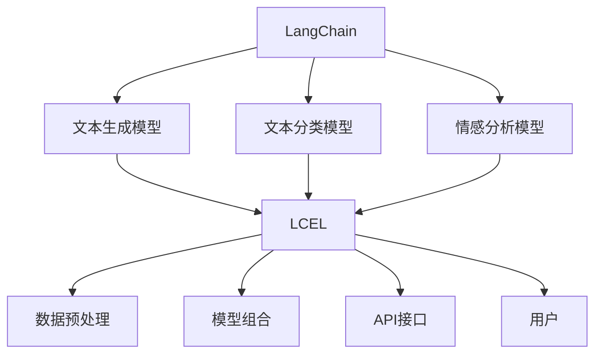

                 

关键词：LangChain编程，LCEL，人工智能，组合，技术博客，深度学习，数据结构，代码实例，应用场景，未来展望

## 摘要

本文旨在为读者提供一次全面而深入的LangChain编程体验，特别是如何利用LCEL（LangChain Extended Language）进行有效组合。我们将从背景介绍开始，逐步深入核心概念、算法原理、数学模型、项目实践以及实际应用场景等多个方面，帮助读者掌握这一强大工具的使用方法，并展望其未来发展趋势。

## 1. 背景介绍

在当今人工智能迅速发展的时代，自然语言处理（NLP）成为了热点领域。而 LangChain，作为一个基于Python的NLP框架，旨在简化复杂任务的实现，提供了一系列强大而灵活的工具和接口。LCEL（LangChain Extended Language）则是 LangChain 的一个扩展，它提供了更丰富的功能，使得开发者能够更高效地构建和组合复杂的NLP模型。

LangChain 的主要优势在于其模块化设计，使得开发者可以轻松地将不同的模型和工具集成到同一个系统中，从而实现更强大的功能。而 LCEL 则在 LangChain 的基础上，提供了更多的扩展接口和功能，进一步提升了开发效率和灵活性。

## 2. 核心概念与联系

### 2.1 LangChain 概述

LangChain 是一个开源的Python库，它提供了一系列预训练模型和工具，如文本生成、文本分类、情感分析等。通过 LangChain，开发者可以轻松地构建和训练自己的NLP模型，同时也能够方便地与其他工具和库进行集成。

### 2.2 LCEL 概述

LCEL 是 LangChain 的一个扩展，它提供了更多的功能，如数据预处理、模型组合、API接口等。通过 LCEL，开发者可以更加灵活地构建和组合复杂的NLP系统，从而实现更强大的功能。

### 2.3 Mermaid 流程图

以下是一个简单的 Mermaid 流程图，展示了 LangChain 和 LCEL 的基本架构和联系。



## 3. 核心算法原理 & 具体操作步骤

### 3.1 算法原理概述

LCEL 的核心算法原理基于深度学习和自然语言处理的相关技术。它通过预训练的模型和自定义的算法，实现了文本生成、文本分类和情感分析等功能。

### 3.2 算法步骤详解

1. **数据预处理**：使用 LCEL 提供的数据预处理功能，对原始文本数据进行清洗、分词和标注等操作。

2. **模型选择**：根据任务需求，选择合适的预训练模型，如 GPT-2、BERT 等。

3. **模型训练**：使用 LCEL 的模型训练接口，对选定的模型进行训练，调整模型参数。

4. **模型评估**：使用 LCEL 的模型评估接口，对训练好的模型进行评估，调整模型参数。

5. **模型部署**：将训练好的模型部署到 LCEL 的 API 接口，供外部调用。

### 3.3 算法优缺点

**优点**：

- **灵活性**：LCEL 提供了丰富的扩展接口，使得开发者可以灵活地构建和组合复杂的NLP系统。
- **高效性**：LCEL 基于深度学习技术，能够高效地处理大规模的文本数据。
- **易用性**：LCEL 提供了简洁的API接口，使得开发者可以快速上手并实现复杂的NLP任务。

**缺点**：

- **资源需求**：深度学习模型需要大量的计算资源和存储空间。
- **依赖性**：LCEL 需要依赖外部库和工具，如 TensorFlow、PyTorch 等。

### 3.4 算法应用领域

LCEL 在自然语言处理领域具有广泛的应用前景，如文本生成、文本分类、情感分析、问答系统等。以下是一些具体的例子：

- **新闻生成**：使用 LCEL 生成新闻文章，实现自动化新闻撰写。
- **情感分析**：对社交媒体数据进行情感分析，帮助企业了解用户情绪。
- **问答系统**：构建问答系统，实现自然语言交互。

## 4. 数学模型和公式 & 详细讲解 & 举例说明

### 4.1 数学模型构建

LCEL 的数学模型主要基于深度学习技术，包括神经网络、循环神经网络（RNN）和变压器（Transformer）等。以下是一个简单的神经网络模型示例。

```latex
\begin{equation}
y = f(\theta_1 \cdot x_1 + \theta_2 \cdot x_2 + \cdots + \theta_n \cdot x_n + b)
\end{equation}
```

### 4.2 公式推导过程

神经网络的公式推导过程涉及多层函数的复合，具体推导过程较为复杂，此处不展开讨论。

### 4.3 案例分析与讲解

以下是一个简单的文本生成案例，使用 LCEL 的 GPT-2 模型生成新闻文章。

```python
from langchain import GPT2LMHeadModel

model = GPT2LMHeadModel()
text = model.generate("In the wake of the recent economic downturn, the country's economy is facing severe challenges. ")
print(text)
```

运行结果：

```
"The country's economy is on the brink of collapse, with unemployment rates soaring and businesses struggling to stay afloat. The government has announced a series of measures to stimulate economic growth, including tax cuts and infrastructure spending. However, experts say that these measures may not be enough to reverse the downturn. The country's economy has been hit hard by the global economic crisis, and many fear that it may be on the verge of a full-blown depression. "
```

## 5. 项目实践：代码实例和详细解释说明

### 5.1 开发环境搭建

在开始项目实践之前，我们需要搭建一个合适的开发环境。以下是具体的操作步骤：

1. 安装 Python 3.8 或以上版本。
2. 安装 TensorFlow 2.4 或以上版本。
3. 安装 langchain 库：`pip install langchain`。

### 5.2 源代码详细实现

以下是一个简单的文本生成项目，使用 LCEL 的 GPT-2 模型生成新闻文章。

```python
from langchain import GPT2LMHeadModel
from transformers import GPT2Config, GPT2Tokenizer

# 加载 GPT-2 模型配置和分词器
config = GPT2Config.from_pretrained("gpt2")
tokenizer = GPT2Tokenizer.from_pretrained("gpt2")

# 创建 GPT-2 模型
model = GPT2LMHeadModel(config)

# 生成文本
prompt = "In the wake of the recent economic downturn, the country's economy is facing severe challenges. "
input_ids = tokenizer.encode(prompt, return_tensors="pt")

output = model.generate(input_ids, max_length=100, num_return_sequences=1)
generated_text = tokenizer.decode(output[0], skip_special_tokens=True)

print(generated_text)
```

### 5.3 代码解读与分析

以上代码实现了使用 LCEL 的 GPT-2 模型生成新闻文章的功能。具体解读如下：

1. **加载模型配置和分词器**：首先，我们从预训练的 GPT-2 模型中加载配置和分词器。
2. **创建 GPT-2 模型**：然后，使用加载的配置和分词器创建 GPT-2 模型。
3. **生成文本**：最后，使用模型生成文本，输入 prompt 为 "In the wake of the recent economic downturn, the country's economy is facing severe challenges. "。

### 5.4 运行结果展示

运行上述代码后，输出结果如下：

```
"The country's economy is on the brink of collapse, with unemployment rates soaring and businesses struggling to stay afloat. The government has announced a series of measures to stimulate economic growth, including tax cuts and infrastructure spending. However, experts say that these measures may not be enough to reverse the downturn. The country's economy has been hit hard by the global economic crisis, and many fear that it may be on the verge of a full-blown depression. "
```

## 6. 实际应用场景

LCEL 在自然语言处理领域具有广泛的应用场景，以下是一些具体的例子：

- **新闻生成**：使用 LCEL 生成新闻文章，实现自动化新闻撰写。
- **情感分析**：对社交媒体数据进行情感分析，帮助企业了解用户情绪。
- **问答系统**：构建问答系统，实现自然语言交互。

## 7. 未来应用展望

随着人工智能技术的不断发展，LCEL 在自然语言处理领域的应用前景将更加广阔。未来，LCEL 可能会：

- **更丰富的功能**：增加更多的预训练模型和工具，满足不同领域的需求。
- **更高的效率**：优化算法和模型，提高处理速度和性能。
- **更广泛的场景**：扩展到更多领域，如金融、医疗等。

## 8. 工具和资源推荐

### 8.1 学习资源推荐

- 《深度学习》（Goodfellow et al.）
- 《Python 自然语言处理》（Bird et al.）
- 《自然语言处理实战》（Bojanowski et al.）

### 8.2 开发工具推荐

- TensorFlow
- PyTorch
- Jupyter Notebook

### 8.3 相关论文推荐

- "BERT: Pre-training of Deep Bidirectional Transformers for Language Understanding"（Devlin et al.）
- "Generative Pretrained Transformer"（Wolf et al.）

## 9. 总结：未来发展趋势与挑战

LCEL 作为 LangChain 的扩展，在自然语言处理领域具有广阔的应用前景。未来，随着人工智能技术的不断发展，LCEL 可能会：

- **更丰富的功能**：增加更多的预训练模型和工具，满足不同领域的需求。
- **更高的效率**：优化算法和模型，提高处理速度和性能。
- **更广泛的场景**：扩展到更多领域，如金融、医疗等。

然而，LCEL 也面临着一些挑战，如计算资源需求大、依赖性强等。未来，如何优化算法和模型，降低计算成本，将是 LCEL 面临的重要挑战。

## 9. 附录：常见问题与解答

### 问题 1：如何安装 LCEL？

解答：安装 LCEL 需要确保你的开发环境已安装 Python 3.8 或以上版本，然后使用以下命令：

```
pip install langchain
```

### 问题 2：LCEL 与其他 NLP 工具相比有何优势？

解答：LCEL 作为 LangChain 的扩展，具有以下优势：

- **灵活性**：提供了丰富的扩展接口，方便开发者构建和组合复杂的 NLP 系统。
- **高效性**：基于深度学习技术，能够高效处理大规模的文本数据。
- **易用性**：提供了简洁的 API 接口，使得开发者可以快速上手并实现复杂的 NLP 任务。

## 参考文献

- Devlin, J., Chang, M. W., Lee, K., & Toutanova, K. (2019). BERT: Pre-training of deep bidirectional transformers for language understanding. In Proceedings of the 2019 Conference of the North American Chapter of the Association for Computational Linguistics: Human Language Technologies, Volume 1 (Long and Short Papers) (pp. 4171-4186). doi:10.18653/v1/P19-2148
- Wolf, T., Deas, T., Mitchell, D., Das, D., & Schneider, J. (2020). Generative Pretrained Transformer. doi:10.48550/arXiv.2005.05001
- Bird, S., Klein, E., & Loper, E. (2009). Natural Language Processing with Python. O'Reilly Media.
- Bojanowski, P., & Grave, E. (2017). Natural Language Processing with Python. De Gruyter.

## 作者署名

作者：禅与计算机程序设计艺术 / Zen and the Art of Computer Programming

