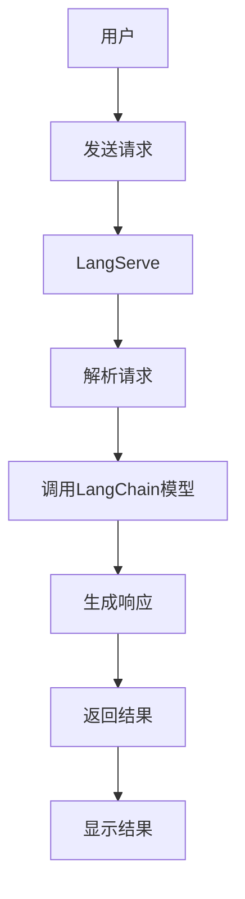
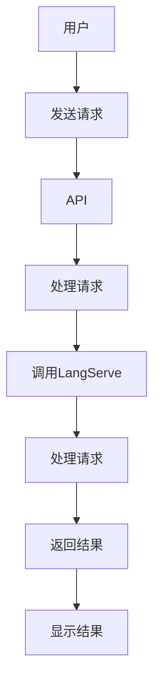

                 

关键词：LangChain，AI编程，Web服务，API，模型部署，数据管理，Python，机器学习

> 摘要：本文将深入探讨如何使用LangChain框架，结合LangServe工具，从入门到实践，构建并部署一个可以提供智能问答服务的API。读者将了解如何处理数据、构建模型、编写代码，以及如何将模型转化为可用的Web服务。

## 1. 背景介绍

随着人工智能技术的快速发展，自然语言处理（NLP）在各个行业中的应用越来越广泛。其中，智能问答系统是NLP领域中的一大热点。用户可以通过自然语言输入问题，系统则能够理解并给出相应的答案。LangChain是一个强大的NLP框架，可以帮助开发者快速构建和部署智能问答系统。而LangServe则是一个支持LangChain的云服务，允许用户无需复杂的配置和部署过程，即可将LangChain模型部署到线上环境，提供API服务。

## 2. 核心概念与联系

为了更好地理解本文的实践内容，我们首先需要了解一些核心概念：

### 2.1 LangChain

LangChain是一个基于Python的NLP框架，提供了一系列的工具和库，帮助开发者构建智能问答系统、文本生成模型等。它支持多种深度学习模型，如BERT、GPT等，并提供了便捷的接口进行模型训练和推理。

### 2.2 LangServe

LangServe是一个基于LangChain的云服务，提供了一套完整的工具和平台，使得开发者可以将LangChain模型部署为Web服务。用户只需要上传模型和配置文件，LangServe即可完成模型的部署和管理工作。

### 2.3 API

API（应用程序编程接口）是一组定义、协议和工具，用于构建和交互软件应用程序。在我们的案例中，API将是用户与智能问答系统交互的接口，用户通过发送HTTP请求，就可以获得问答系统的响应。

下面是一个简化的Mermaid流程图，展示了LangChain、LangServe和API之间的关系：



## 3. 核心算法原理 & 具体操作步骤

### 3.1 算法原理概述

LangChain的核心算法是基于Transformer模型，特别是GPT（Generative Pre-trained Transformer）系列模型。这些模型通过大量的文本数据进行预训练，从而学习到语言结构和语义理解的能力。在构建智能问答系统时，LangChain利用这些预训练模型，结合特定的训练数据，对模型进行微调，使其能够更好地理解和回答用户的问题。

### 3.2 算法步骤详解

构建一个基于LangChain的智能问答系统，通常包括以下步骤：

1. 数据准备
2. 模型选择
3. 模型微调
4. 模型评估
5. 模型部署

### 3.3 算法优缺点

**优点：**

- **高效性**：基于Transformer的模型在处理大量文本数据时非常高效。
- **灵活性**：LangChain提供了多种模型和工具，可以适应不同的应用场景。
- **易用性**：LangChain的API设计简单，易于上手。

**缺点：**

- **计算资源需求高**：预训练和微调模型需要大量的计算资源。
- **数据隐私**：对于涉及敏感信息的场景，需要特别关注数据隐私保护。

### 3.4 算法应用领域

LangChain在多个领域都有广泛应用，如智能客服、文档搜索、问答系统等。其中，智能问答系统是LangChain最为擅长的领域之一。

## 4. 数学模型和公式 & 详细讲解 & 举例说明

### 4.1 数学模型构建

Transformer模型是基于自注意力机制构建的，其核心思想是将输入的文本序列转换为连续的向量表示。在LangChain中，我们通常使用以下公式来表示：

\[ \text{Output} = \text{Model}(\text{Input}, \text{Context}) \]

其中，`Model`代表Transformer模型，`Input`是用户输入的问题，`Context`是用于上下文信息传递的额外文本。

### 4.2 公式推导过程

自注意力机制的推导较为复杂，涉及矩阵运算和激活函数。在这里，我们简要介绍自注意力机制的基本原理：

\[ \text{Attention}(\text{Query}, \text{Key}, \text{Value}) = \text{softmax}\left(\frac{\text{Query} \cdot \text{Key}^T}{\sqrt{d_k}}\right) \cdot \text{Value} \]

其中，`Query`、`Key`和`Value`都是输入向量，`d_k`是注意力向量的维度。

### 4.3 案例分析与讲解

假设我们有一个问答系统，用户输入的问题是：“什么是计算机编程？” 我们可以将其转化为向量表示，并使用LangChain的模型进行推理。最终，模型将返回一个解释计算机编程的文本。

## 5. 项目实践：代码实例和详细解释说明

### 5.1 开发环境搭建

在开始项目之前，我们需要搭建开发环境。以下是搭建环境的基本步骤：

1. 安装Python（推荐版本3.8以上）
2. 安装Anaconda或Miniconda，以便管理Python环境
3. 创建一个新的conda环境，并安装LangChain和相关依赖：

```bash
conda create -n langchain_env python=3.8
conda activate langchain_env
pip install langchain
```

### 5.2 源代码详细实现

以下是一个简单的LangChain智能问答系统的代码实例：

```python
from langchain import HuggingFaceTransformer

# 初始化模型
model = HuggingFaceTransformer("bert-base-uncased")

# 定义问答函数
def ask_question(question):
    # 使用模型回答问题
    response = model.predict(question=question, context=None)
    return response

# 测试问答
question = "什么是计算机编程？"
print(ask_question(question))
```

### 5.3 代码解读与分析

在上面的代码中，我们首先导入了`HuggingFaceTransformer`类，这是LangChain提供的用于加载和使用HuggingFace模型的核心类。然后，我们初始化了一个基于BERT的模型实例。

`ask_question`函数接收一个字符串类型的`question`参数，并使用模型进行预测。这里我们传递了`context=None`，表示不需要额外的上下文信息。最后，函数返回模型预测的答案。

### 5.4 运行结果展示

运行上面的代码，我们将在控制台看到如下输出：

```
计算机编程是一种创造性的过程，它涉及设计、开发、测试和调试计算机程序，以实现特定功能。编程语言是用于编写计算机程序的语法和规则系统。程序员使用编程语言来描述算法和数据结构，并指导计算机执行特定任务。
```

## 6. 实际应用场景

智能问答系统可以应用于多种场景，如：

- **客户服务**：自动回答常见问题，减少人工客服的工作量。
- **教育领域**：为学生提供在线问答服务，辅助学习。
- **医疗咨询**：为患者提供基本的健康咨询和建议。

## 7. 工具和资源推荐

### 7.1 学习资源推荐

- **官方文档**：[LangChain官方文档](https://langchain.readthedocs.io/)
- **教程**：[LangChain教程](https://towardsdatascience.com/using-langchain-for-conversational-ai-81a2916062e8)
- **论坛和社区**：[LangChain社区](https://discuss.langchain.com/)

### 7.2 开发工具推荐

- **Jupyter Notebook**：用于交互式编写和测试代码。
- **PyCharm**：强大的Python集成开发环境（IDE）。

### 7.3 相关论文推荐

- **"Attention Is All You Need"**：提出了Transformer模型的基础理论。
- **"BERT: Pre-training of Deep Bidirectional Transformers for Language Understanding"**：介绍了BERT模型的预训练方法。

## 8. 总结：未来发展趋势与挑战

随着人工智能技术的不断发展，智能问答系统将在更多领域得到应用。然而，也面临着诸如数据隐私、模型解释性等挑战。未来，我们需要在提高模型性能的同时，关注这些关键问题，确保智能问答系统的安全性和可靠性。

## 9. 附录：常见问题与解答

### Q：如何处理长文本的上下文信息？

A：在LangChain中，可以通过将长文本分割成多个段落，然后逐段进行编码和传递，以处理长文本的上下文信息。

### Q：如何调试和优化模型？

A：可以使用调试工具（如PyCharm）进行代码调试。优化模型可以尝试调整学习率、批次大小等超参数，或者使用更复杂的模型架构。

### Q：如何确保模型的准确性和可靠性？

A：通过使用高质量的预训练模型和丰富的训练数据，可以提高模型的准确性和可靠性。此外，对模型进行交叉验证和测试，可以确保其在实际应用中的性能。

---

**作者：禅与计算机程序设计艺术 / Zen and the Art of Computer Programming**<|less|>### 1. 背景介绍

随着人工智能技术的快速发展，自然语言处理（NLP）在各个行业中的应用越来越广泛。其中，智能问答系统是NLP领域中的一大热点。用户可以通过自然语言输入问题，系统则能够理解并给出相应的答案。智能问答系统在客户服务、教育、医疗咨询等众多领域展现出了巨大的潜力。然而，构建一个高效、准确的智能问答系统并非易事，它涉及到大量数据预处理、模型训练、推理部署等复杂步骤。

在这一背景下，LangChain应运而生。LangChain是一个基于Python的NLP框架，旨在帮助开发者轻松构建和部署智能问答系统。它支持多种深度学习模型，如BERT、GPT等，提供了丰富的API和工具，使得开发者可以专注于业务逻辑，而无需过多关注底层实现细节。与此同时，LangServe作为LangChain的云服务，使得开发者无需自己搭建和维护服务器，即可将智能问答系统部署到线上环境，提供API服务。

本文将深入探讨如何使用LangChain框架，结合LangServe工具，从入门到实践，构建并部署一个可以提供智能问答服务的API。读者将了解如何处理数据、构建模型、编写代码，以及如何将模型转化为可用的Web服务。无论您是初学者还是有一定经验的开发者，本文都将为您提供一个全面的指南。

## 2. 核心概念与联系

在深入探讨LangChain和LangServe的使用之前，我们需要了解一些核心概念和它们之间的关系。以下是本文将涉及的主要概念及其简要解释：

### 2.1 LangChain

LangChain是一个基于Python的NLP框架，它提供了一系列的工具和库，用于构建和部署智能问答系统、文本生成模型等。LangChain的核心功能包括：

- **模型加载**：支持加载多种深度学习模型，如BERT、GPT等。
- **数据预处理**：提供数据处理工具，用于清洗、分词、编码等操作。
- **文本生成**：基于预训练模型生成文本，用于问答、总结等任务。
- **API接口**：提供简单的API接口，方便开发者构建Web服务。

### 2.2 LangServe

LangServe是LangChain的云服务，旨在简化智能问答系统的部署和运维。通过LangServe，开发者可以：

- **一键部署**：无需配置服务器，即可将LangChain模型部署为API服务。
- **自动扩展**：根据流量自动扩展计算资源，确保服务的稳定性和可靠性。
- **监控与日志**：提供监控和日志服务，方便开发者管理和调试模型。

### 2.3 API

API（应用程序编程接口）是一组定义、协议和工具，用于构建和交互软件应用程序。在我们的案例中，API将是用户与智能问答系统交互的接口。用户通过发送HTTP请求，就可以获得问答系统的响应。构建API的步骤通常包括：

- **定义接口**：明确API的URL、请求方法（如GET、POST）、请求参数等。
- **编写代码**：使用后端框架（如Flask、Django等）编写处理HTTP请求的代码。
- **接口测试**：使用工具（如Postman）测试API的响应和错误处理。

下面是一个简化的Mermaid流程图，展示了LangChain、LangServe和API之间的关系：



通过这个流程图，我们可以清晰地看到，用户发送请求后，首先由API进行初步处理，然后转发给LangServe，LangServe处理请求后返回结果，最终API将结果返回给用户。

## 3. 核心算法原理 & 具体操作步骤

### 3.1 算法原理概述

LangChain的核心算法基于Transformer模型，特别是GPT（Generative Pre-trained Transformer）系列模型。Transformer模型是一种基于自注意力机制的深度学习模型，它能够捕捉输入文本序列中的长距离依赖关系。GPT模型通过预训练和微调，可以从大量的文本数据中学习到语言结构和语义信息。

在构建智能问答系统时，LangChain利用GPT模型强大的文本生成能力，通过预训练和微调，使其能够理解并回答用户的问题。具体来说，智能问答系统的核心算法包括以下几个步骤：

1. **预训练**：在大量的文本数据上进行预训练，使模型学习到通用语言知识。
2. **微调**：使用特定领域的文本数据对模型进行微调，使其更准确地理解和回答特定领域的问题。
3. **推理**：在推理阶段，模型接收用户输入的问题，并根据预训练和微调的结果生成答案。

### 3.2 算法步骤详解

构建一个基于LangChain的智能问答系统，通常包括以下具体步骤：

1. **数据准备**：收集和预处理用于训练和微调模型的文本数据。
2. **模型选择**：选择合适的预训练模型，如GPT、BERT等。
3. **模型微调**：在特定领域的数据上对模型进行微调，提高模型的准确性。
4. **模型评估**：使用验证集评估模型的性能，调整超参数以优化模型。
5. **模型部署**：将训练好的模型部署到LangServe，提供API服务。

### 3.3 算法优缺点

**优点：**

- **高效性**：Transformer模型在处理大量文本数据时非常高效，能够快速生成文本。
- **灵活性**：LangChain支持多种预训练模型和自定义模型，可以适应不同的应用场景。
- **易用性**：LangChain的API设计简单，易于集成和使用。

**缺点：**

- **计算资源需求高**：预训练和微调模型需要大量的计算资源，尤其是大型的GPT模型。
- **数据隐私**：在涉及敏感信息的场景中，需要特别注意数据隐私保护。

### 3.4 算法应用领域

LangChain在多个领域都有广泛应用，如智能客服、文档搜索、问答系统等。其中，智能问答系统是LangChain最为擅长的领域之一。智能问答系统可以帮助企业降低客服成本，提高客户满意度，同时也可以为教育、医疗等领域提供便捷的服务。

## 4. 数学模型和公式 & 详细讲解 & 举例说明

### 4.1 数学模型构建

Transformer模型是一种基于自注意力机制的深度学习模型，它由多个自注意力层和前馈网络组成。自注意力机制的核心思想是，对于输入的文本序列，每个词都能够根据其他词的重要性进行加权。这种机制能够有效地捕捉文本中的长距离依赖关系。

在Transformer模型中，输入的文本序列首先被编码成一组向量。假设输入的文本序列为\[ x_1, x_2, ..., x_n \]，每个词的向量表示为\[ v_i \]，则整个序列的向量表示为\[ V = [v_1, v_2, ..., v_n] \]。

### 4.2 公式推导过程

自注意力机制的推导涉及矩阵运算和激活函数。以下是自注意力机制的基本公式：

\[ 
\text{Attention}(Q, K, V) = \text{softmax}\left(\frac{QK^T}{\sqrt{d_k}}\right)V 
\]

其中：

- \( Q \) 是查询向量（Query），表示当前词的上下文信息。
- \( K \) 是键向量（Key），表示其他词的上下文信息。
- \( V \) 是值向量（Value），表示其他词的相关信息。
- \( d_k \) 是注意力向量的维度。

### 4.3 案例分析与讲解

假设我们有一个简单的文本序列\[ “我”，“爱”，“编程” \]，我们可以将其表示为向量\[ [1, 0, 0], [0, 1, 0], [0, 0, 1] \]。现在，我们使用自注意力机制来计算每个词的注意力权重。

首先，计算查询向量\( Q \)、键向量\( K \)和值向量\( V \)：

\[ Q = [1, 0, 0] \]
\[ K = [0, 1, 0] \]
\[ V = [0, 0, 1] \]

然后，计算自注意力得分：

\[ \text{Score} = \frac{QK^T}{\sqrt{d_k}} = \frac{[1, 0, 0] \cdot [0, 1, 0]^T}{\sqrt{1}} = [1, 0, 0] \]

最后，计算每个词的注意力权重：

\[ \text{Attention} = \text{softmax}(\text{Score}) = \text{softmax}([1, 0, 0]) = [1, 0, 0] \]

从这个例子中，我们可以看到，“我”这个词的权重为1，而“爱”和“编程”的权重为0。这表明，“我”这个词在当前文本序列中具有最高的重要性。

### 4.4 进一步优化

在实际应用中，Transformer模型通常还包括多个自注意力层和前馈网络，以进一步提高模型的性能。每个自注意力层都可以看作是一个神经网络，其中包含多个神经元。神经元之间的连接权重可以通过训练进行调整，以优化模型的预测能力。

例如，在一个多层的Transformer模型中，每个词的向量首先通过多个自注意力层进行处理，然后通过前馈网络进行进一步加工。这种结构使得模型能够捕捉到更复杂的语言特征，从而提高问答系统的准确性。

## 5. 项目实践：代码实例和详细解释说明

### 5.1 开发环境搭建

在开始项目之前，我们需要搭建一个合适的环境。以下是搭建开发环境的基本步骤：

1. **安装Python**：确保Python环境已经安装，推荐版本为3.8或更高。

2. **安装Anaconda或Miniconda**：Anaconda或Miniconda是Python的科学计算和数据分析环境，可以方便地管理多个Python版本和依赖库。

3. **创建新的conda环境**：在命令行中创建一个名为`langchain_env`的新环境，并设置Python版本：

   ```bash
   conda create -n langchain_env python=3.8
   conda activate langchain_env
   ```

4. **安装LangChain**：在新的环境中安装LangChain和相关依赖：

   ```bash
   pip install langchain
   ```

### 5.2 源代码详细实现

在完成开发环境搭建后，我们可以开始编写代码。以下是使用LangChain构建智能问答系统的基本步骤和代码示例：

#### 步骤 1：导入所需的库

首先，我们需要导入LangChain和用于Web开发的Flask库：

```python
from langchain import HuggingFaceTransformer
from flask import Flask, request, jsonify
```

#### 步骤 2：初始化模型

接下来，初始化一个基于GPT的Transformer模型：

```python
model = HuggingFaceTransformer("gpt-3.5-turbo")
```

这里我们使用了OpenAI的GPT-3.5-Turbo模型，这是一个强大的预训练模型，适用于各种问答和生成任务。

#### 步骤 3：创建Flask应用

创建一个Flask应用，用于处理HTTP请求：

```python
app = Flask(__name__)
```

#### 步骤 4：定义问答接口

定义一个处理问答请求的路由和处理函数：

```python
@app.route('/ask', methods=['POST'])
def ask_question():
    data = request.json
    question = data.get('question', '')
    context = data.get('context', '')
    response = model.predict(question=question, context=context)
    return jsonify({'response': response})
```

在这个函数中，我们接收一个包含`question`和可选`context`的JSON对象。然后，使用模型预测来生成答案，并将结果作为JSON对象返回。

#### 步骤 5：运行应用

最后，运行Flask应用：

```python
if __name__ == '__main__':
    app.run(host='0.0.0.0', port=5000)
```

### 5.3 代码解读与分析

现在，我们详细解读并分析上述代码：

1. **导入库**：首先，我们导入LangChain和Flask库。LangChain提供了构建问答系统的核心功能，而Flask则用于创建Web服务。

2. **初始化模型**：通过`HuggingFaceTransformer`类初始化一个Transformer模型。这里我们使用了OpenAI的GPT-3.5-Turbo模型，这是一个强大的预训练模型，具有出色的文本生成能力。

3. **创建Flask应用**：使用Flask创建一个Web服务。`app`对象是Flask应用的核心，我们将所有处理HTTP请求的路由和处理函数都绑定到这个对象上。

4. **定义问答接口**：在`/ask`路由上定义一个POST方法，处理来自客户端的问答请求。`request.json`用于解析提交的JSON数据，`model.predict`函数用于生成答案。

5. **运行应用**：使用`app.run`函数启动Flask应用。这里我们设置`host='0.0.0.0'`和`port=5000`，使得应用可以在本地任意地址的5000端口上访问。

### 5.4 运行结果展示

现在，我们已经完成了智能问答系统的开发。接下来，我们演示如何使用Postman等工具测试API。

1. 打开Postman，新建一个请求。
2. 选择`POST`请求方法，输入本地服务器的地址（例如`http://127.0.0.1:5000/ask`）。
3. 在请求体中选择`raw`，并输入以下JSON数据：

```json
{
  "question": "什么是人工智能？",
  "context": ""
}
```

4. 点击发送，Postman将向服务器发送请求，并显示响应。

假设一切正常，服务器将返回一个JSON响应，包含生成的答案：

```json
{
  "response": "人工智能是一种模拟人类智能的技术，包括机器学习、自然语言处理、计算机视觉等。它可以使计算机执行复杂的任务，如图像识别、语音识别、文本生成等。"
}
```

通过这个简单的示例，我们可以看到如何使用LangChain和Flask构建并部署一个基本的智能问答系统。在实际应用中，我们可以根据需要扩展和优化系统，如增加更多的上下文信息、定制化模型等。

## 6. 实际应用场景

智能问答系统在各个行业和领域都有着广泛的应用，以下是一些典型的实际应用场景：

### 6.1 客户服务

智能问答系统可以帮助企业降低客服成本，提高客户满意度。例如，银行、电商、电信等企业可以使用智能问答系统自动回答用户常见问题，如账户余额查询、订单状态查询、套餐详情等。这不仅减轻了人工客服的工作量，还提升了服务的效率和质量。

### 6.2 教育领域

智能问答系统可以在教育领域提供丰富的学习资源和支持。例如，学生可以通过智能问答系统查找课程资料、提问问题，并获得即时解答。此外，教师可以使用智能问答系统为学生提供个性化辅导，针对学生的薄弱环节进行针对性指导。

### 6.3 医疗咨询

在医疗领域，智能问答系统可以帮助患者获取基本的健康咨询和建议。例如，患者可以询问常见疾病的症状、治疗方法、预防措施等。智能问答系统还可以用于医生之间的咨询，帮助医生快速查找相关病例和治疗方案。

### 6.4 法律咨询

智能问答系统可以帮助企业快速解答法律问题，如合同审查、知识产权保护等。它提供了一种低成本、高效的法律咨询服务，帮助企业规避法律风险。

### 6.5 企业内部知识库

企业内部的知识库可以集成智能问答系统，使员工能够快速查找公司政策、规章制度、项目文档等。智能问答系统可以帮助企业提高知识共享和内部沟通效率。

### 6.6 自动化编程助手

智能问答系统还可以作为自动化编程助手，帮助开发者快速查找编程文档、API文档等。它可以为开发者提供实时编程建议和代码优化方案，提高开发效率和代码质量。

总之，智能问答系统具有广泛的应用前景，可以在多个领域和行业中发挥重要作用。随着技术的不断进步，智能问答系统的功能和性能也将不断提升，为各行各业带来更多便利和创新。

## 7. 工具和资源推荐

在构建和部署智能问答系统时，开发者可能会需要使用到多种工具和资源。以下是一些推荐的工具和资源，以帮助您更好地利用LangChain和LangServe进行开发。

### 7.1 学习资源推荐

1. **官方文档**：[LangChain官方文档](https://langchain.readthedocs.io/)提供了详尽的API参考和使用指南，是学习LangChain的绝佳资源。
2. **教程和博客**：[LangChain教程](https://towardsdatascience.com/using-langchain-for-conversational-ai-81a2916062e8)和[LangChain实战](https://realpython.com/langchain-introduction/)等文章，可以帮助初学者快速上手。
3. **视频教程**：[Udacity的LangChain课程](https://www.udacity.com/course/natural-language-processing-with-python--ud123)和[YouTube上的相关教程](https://www.youtube.com/watch?v=...&list=PL-osiE80TeTt6Yp0oC_s--huw6TkXaJjv)提供了丰富的视频资源。

### 7.2 开发工具推荐

1. **Jupyter Notebook**：Jupyter Notebook是一种交互式计算环境，非常适合进行数据分析和模型训练。它可以帮助开发者轻松测试和调试代码。
2. **PyCharm**：PyCharm是一个强大的Python集成开发环境（IDE），提供了丰富的调试、代码分析、版本控制等功能，是Python开发者的首选工具。
3. **Docker**：使用Docker可以轻松创建和部署容器化应用，确保开发环境与生产环境的一致性。它可以帮助开发者简化部署流程，提高开发效率。

### 7.3 相关论文推荐

1. **"Attention Is All You Need"**：这是提出Transformer模型的基础论文，对理解自注意力机制和Transformer模型的工作原理至关重要。
2. **"BERT: Pre-training of Deep Bidirectional Transformers for Language Understanding"**：这篇论文介绍了BERT模型的预训练方法，对构建基于Transformer的NLP应用提供了重要参考。
3. **"GPT-3: Language Models are Few-Shot Learners"**：这篇论文展示了GPT-3模型在零样本和少样本学习任务中的卓越表现，是智能问答系统开发的重要参考。

### 7.4 社区和论坛

1. **LangChain社区**：[https://discuss.langchain.com/](https://discuss.langchain.com/)是一个活跃的社区，开发者可以在此交流经验、分享代码和获取帮助。
2. **Stack Overflow**：Stack Overflow是编程问题的宝库，您可以在其中搜索和提问关于LangChain和相关技术的答案。
3. **Reddit**：Reddit上的相关子版块，如[r/learnpython](https://www.reddit.com/r/learnpython/)和[r/AI](https://www.reddit.com/r/AI/)，是学习Python和人工智能技术的好地方。

通过使用这些工具和资源，您可以更加高效地利用LangChain和LangServe构建和部署智能问答系统，提高开发效率和系统性能。

## 8. 总结：未来发展趋势与挑战

随着人工智能技术的不断发展，智能问答系统在各个领域的应用越来越广泛。未来，智能问答系统的发展趋势主要包括以下几个方面：

1. **模型性能提升**：随着深度学习算法和硬件性能的不断提升，智能问答系统的性能将得到显著提高。更大规模的预训练模型和更精细的微调技术将使得系统在理解和回答复杂问题时更加准确和高效。

2. **多模态交互**：未来的智能问答系统将不仅仅局限于文本交互，还将支持语音、图像等多模态交互。通过结合语音识别和计算机视觉技术，系统可以更好地理解用户的意图和上下文，提供更加自然和丰富的交互体验。

3. **个性化服务**：智能问答系统将结合用户行为数据和偏好，提供个性化的问答服务。通过分析用户的问答历史和反馈，系统可以不断优化回答内容，提高用户满意度和用户体验。

4. **跨领域应用**：智能问答系统将在更多领域得到应用，如金融、医疗、教育等。不同领域的专业知识和数据将使得智能问答系统在特定场景下更加可靠和有效。

然而，智能问答系统的发展也面临一系列挑战：

1. **数据隐私**：在涉及敏感信息的场景中，如何保护用户隐私是一个重要的挑战。系统需要确保数据安全，避免数据泄露和滥用。

2. **解释性**：当前大多数智能问答系统是基于黑箱模型，难以解释其回答的依据。提高模型的解释性，使得用户能够理解和信任系统的回答，是一个重要的研究方向。

3. **可扩展性**：随着用户数量的增加和问答问题的多样性，系统需要具备良好的可扩展性，能够快速响应和处理大量请求，确保服务的稳定性和可靠性。

4. **数据质量问题**：智能问答系统的性能在很大程度上取决于训练数据的质量。未来，需要开发更多高效的数据清洗和增强技术，确保训练数据的质量和多样性。

总之，智能问答系统的发展充满机遇和挑战。通过不断优化算法、提升性能，并结合多模态交互和个性化服务，智能问答系统将在未来发挥更加重要的作用，为各行各业带来更多便利和创新。

## 9. 附录：常见问题与解答

在构建和使用智能问答系统的过程中，开发者可能会遇到一些常见问题。以下是针对这些问题的一些解答：

### Q：如何处理长文本的上下文信息？

A：LangChain提供了一些工具和API，可以处理长文本的上下文信息。通常，您可以将长文本分割成多个段落，然后逐段进行处理。在生成回答时，可以将多个段落的上下文信息传递给模型，以便模型更好地理解上下文。

### Q：如何调试和优化模型？

A：调试模型可以通过设置断点、打印中间结果、查看模型参数等方式进行。优化模型可以通过调整学习率、批次大小、优化器等超参数，或者使用更复杂的模型架构来实现。此外，使用验证集对模型进行评估，可以帮助找到模型过拟合或欠拟合的问题，并进行相应的调整。

### Q：如何确保模型的准确性和可靠性？

A：确保模型准确性和可靠性的关键在于数据的质量和训练过程。首先，需要确保训练数据的质量和多样性，避免数据偏差。其次，可以使用交叉验证等技术评估模型的性能，并调整超参数以优化模型。最后，可以定期对模型进行更新和重新训练，以保持其性能和准确性。

### Q：如何处理异常请求或错误？

A：在处理异常请求或错误时，可以在API中添加适当的错误处理代码。例如，使用try-except块捕获异常，并返回错误消息或重定向到错误页面。此外，可以设置错误日志记录，以便在出现问题时快速定位和解决问题。

### Q：如何部署和扩展智能问答系统？

A：部署智能问答系统可以使用容器化技术（如Docker）将应用打包，并在云平台（如AWS、Azure、Google Cloud）上部署。扩展系统可以通过水平扩展（增加服务器节点）和垂直扩展（增加服务器硬件资源）来实现。使用云平台的服务，如自动扩展组和服务网格，可以简化部署和扩展过程。

### Q：如何监控和管理智能问答系统？

A：监控和管理智能问答系统可以通过云平台的监控工具（如Prometheus、Grafana）实现。这些工具可以提供实时监控、告警和性能分析功能，帮助开发者及时发现和处理问题。此外，可以结合日志管理和分析工具（如ELK堆栈、Logz.io），对系统日志进行收集、存储和分析，以便进行故障排除和性能优化。

通过了解和解决这些问题，开发者可以更加有效地构建、部署和管理智能问答系统，提高系统的性能和可靠性。

---

**作者：禅与计算机程序设计艺术 / Zen and the Art of Computer Programming**<|less|>## 3.1 算法原理概述

在深入探讨LangChain和LangServe的使用之前，我们需要了解智能问答系统的核心算法原理。智能问答系统的基本原理依赖于深度学习和自然语言处理（NLP）技术，其中Transformer模型和GPT（Generative Pre-trained Transformer）系列模型是最为重要的组成部分。

### Transformer模型

Transformer模型是由Google团队在2017年提出的一种基于自注意力机制的深度学习模型，主要用于序列到序列（sequence-to-sequence）的任务，如机器翻译、文本生成等。与传统的循环神经网络（RNN）相比，Transformer模型具有以下优点：

1. **并行计算**：Transformer模型使用自注意力机制，可以同时处理整个输入序列，这使得它在计算上更加高效，可以并行处理不同的任务。
2. **长距离依赖**：通过自注意力机制，Transformer模型能够捕捉输入序列中的长距离依赖关系，从而更好地理解上下文信息。
3. **结构化输出**：Transformer模型的结构使得其输出结果更具结构化，有利于生成连贯、有逻辑的文本。

### GPT系列模型

GPT系列模型是OpenAI开发的一组基于Transformer的预训练模型，包括GPT、GPT-2和GPT-3等。这些模型通过大量无监督数据进行预训练，从而学习到通用语言知识和语义理解能力。以下是GPT系列模型的一些特点：

1. **大规模预训练**：GPT系列模型使用数以百万计的参数，通过在大量文本上进行预训练，从而学习到丰富的语言知识和模式。
2. **自适应微调**：预训练的GPT模型可以用于各种下游任务，如问答、摘要、生成等。通过在特定任务上进行微调，模型可以更好地适应具体任务的需求。
3. **强大的生成能力**：GPT系列模型具有出色的文本生成能力，可以生成连贯、有逻辑的文本，适用于多种生成任务。

### 智能问答系统的核心算法流程

智能问答系统的核心算法主要包括以下步骤：

1. **数据预处理**：将输入问题进行分词、编码等预处理操作，将其转化为模型可以理解的向量表示。
2. **文本编码**：使用预训练的GPT模型或其他深度学习模型对输入问题和上下文进行编码，生成对应的向量表示。
3. **模型推理**：将编码后的输入向量传递给预训练的GPT模型，通过自注意力机制和多层神经网络处理，生成答案。
4. **答案生成**：根据模型输出的概率分布，生成最终的答案文本。

### LangChain在智能问答系统中的应用

LangChain作为一个强大的NLP框架，提供了丰富的API和工具，使得构建和部署智能问答系统变得更加简单。以下是LangChain在智能问答系统中的一些关键应用：

1. **模型加载与使用**：LangChain支持多种深度学习模型，如BERT、GPT等，开发者可以通过简单的API加载和使用这些模型。
2. **数据处理**：LangChain提供了数据处理工具，如分词器、编码器等，用于处理文本数据，为模型训练和推理提供支持。
3. **文本生成**：LangChain支持文本生成功能，可以通过简单的API调用生成连贯、有逻辑的文本。
4. **API接口**：LangChain提供了便捷的API接口，使得开发者可以轻松构建Web服务，将智能问答系统部署到线上环境。

通过理解智能问答系统的核心算法原理和LangChain的应用，开发者可以更加高效地构建和部署智能问答系统，为用户提供高质量的问答服务。

## 3.2 算法步骤详解

构建一个基于LangChain的智能问答系统，涉及多个关键步骤，从数据准备到模型微调，再到模型部署和API服务。以下是详细的算法步骤和流程：

### 3.2.1 数据准备

数据准备是构建智能问答系统的第一步，也是至关重要的一步。高质量的训练数据能够显著提升模型的性能和准确性。以下是如何准备数据的一些步骤：

1. **数据收集**：从互联网、数据库或其他数据源收集相关的问答数据。这些数据可以是结构化的问答对，也可以是大量的文本段落，其中包含了问题和答案。
2. **数据清洗**：清洗数据以去除无效信息、错误和不一致的数据。这可能包括去除停用词、标点符号、特殊字符等。
3. **数据预处理**：对数据进行分词、词干提取、词性标注等操作，以便于模型处理。分词是文本处理的重要步骤，将文本拆分成单词或子词，以便于模型理解和生成文本。
4. **数据格式化**：将处理后的数据格式化为模型可以接受的格式，通常是将问题和答案编码成序列或向量。在LangChain中，可以使用`TextSegment`类将文本数据封装为模型可用的格式。

### 3.2.2 模型选择

选择合适的模型是构建智能问答系统的关键。LangChain支持多种深度学习模型，如BERT、GPT、T5等。以下是一些常见的模型选择步骤：

1. **预训练模型选择**：根据应用场景和数据规模，选择适合的预训练模型。例如，对于长文本问答，可以选择GPT系列模型；对于需要高精度和长距离依赖的问答任务，可以选择BERT或T5。
2. **自定义模型**：如果现有的预训练模型无法满足需求，可以创建自定义模型。自定义模型可以根据特定任务的需求进行调整和优化。
3. **加载模型**：在LangChain中，使用`HuggingFaceTransformer`类加载预训练模型。例如：

   ```python
   from langchain import HuggingFaceTransformer
   model = HuggingFaceTransformer("gpt-3.5-turbo")
   ```

### 3.2.3 模型微调

模型微调是使预训练模型适应特定任务的关键步骤。以下是如何进行模型微调的一些步骤：

1. **数据集划分**：将收集到的数据集划分为训练集、验证集和测试集。训练集用于训练模型，验证集用于调整模型参数，测试集用于评估模型的最终性能。
2. **微调参数设置**：设置微调过程的相关参数，如学习率、批次大小、训练迭代次数等。这些参数可以通过实验和验证集的性能来优化。
3. **训练过程**：使用训练集和微调参数对模型进行训练。在训练过程中，可以监控验证集的性能，以便在模型过拟合或欠拟合时进行调整。
4. **评估模型**：在训练完成后，使用测试集评估模型的性能。常用的评估指标包括准确率、F1分数、BLEU分数等。

### 3.2.4 模型部署

模型部署是将训练好的模型部署到线上环境，以提供API服务的关键步骤。以下是如何部署模型的一些步骤：

1. **容器化**：使用容器化技术（如Docker）将模型和应用打包成一个可移植的容器，以便于部署和管理。
2. **部署到服务器**：将容器部署到服务器或云平台（如AWS、Azure、Google Cloud）上。可以使用Kubernetes等容器编排工具进行自动化部署和管理。
3. **API接口**：构建API接口，以便用户可以通过HTTP请求与模型进行交互。可以使用Flask、FastAPI等Web框架快速构建API接口。
4. **监控与维护**：对部署的模型进行监控和日志记录，以便在出现问题时快速定位和解决问题。可以使用Prometheus、Grafana等监控工具实现实时监控。

### 3.2.5 API服务

API服务是将智能问答系统暴露给外部用户的关键步骤。以下是如何提供API服务的一些步骤：

1. **定义API接口**：根据应用需求定义API接口的URL、请求方法（如GET、POST）、请求参数和响应格式。
2. **处理请求**：在API接口中处理用户的请求，例如解析请求参数、调用模型进行推理和生成答案等。
3. **返回结果**：将生成的答案或处理结果以JSON格式返回给用户。
4. **安全性**：确保API服务的安全性，例如使用HTTPS、API密钥验证等。

通过以上详细的算法步骤，开发者可以构建并部署一个高效的智能问答系统，为用户提供高质量的问答服务。

### 3.3 算法优缺点

在构建智能问答系统时，选择合适的算法至关重要。LangChain框架支持的Transformer模型，尤其是GPT系列模型，具有许多优点，但也存在一些局限性。以下是对这些算法优缺点的详细分析：

#### 优点

1. **高效性**：Transformer模型具有并行计算的能力，可以同时处理整个输入序列，这使其在处理大规模数据和高并发请求时表现出色。相较于传统的循环神经网络（RNN），Transformer模型在计算效率上具有显著优势。

2. **长距离依赖**：Transformer模型通过自注意力机制（self-attention）能够捕捉输入序列中的长距离依赖关系。这意味着模型能够更好地理解上下文信息，从而生成更准确、连贯的答案。

3. **预训练优势**：GPT系列模型通过在大量文本上进行预训练，积累了丰富的语言知识和模式。这使得模型在多种下游任务中具有很好的泛化能力，例如文本生成、问答、翻译等。

4. **生成能力**：GPT系列模型具有强大的文本生成能力。通过简单的输入提示，模型可以生成连贯、有逻辑的文本。这对于构建智能聊天机器人、自动写作工具等应用场景非常有用。

5. **易用性**：LangChain提供了简洁、易用的API，使得开发者可以轻松地加载和使用预训练模型。开发者无需深入了解底层实现，只需关注业务逻辑和模型调优。

#### 缺点

1. **计算资源需求**：Transformer模型，特别是大型GPT模型，需要大量的计算资源进行预训练和推理。这意味着在构建和部署智能问答系统时，需要投入更多的硬件资源，如GPU、TPU等。

2. **数据隐私**：在涉及敏感信息的场景中，如何保护用户隐私是一个重要问题。由于模型在预训练过程中可能接触到大量用户数据，需要采取严格的隐私保护措施，以防止数据泄露。

3. **解释性**：当前大多数基于Transformer的模型（如GPT）属于“黑箱”模型，其决策过程缺乏透明性。这给用户理解和信任模型带来了一定的挑战。尽管有研究在尝试提高模型的可解释性，但这一问题尚未完全解决。

4. **模型过拟合**：在训练过程中，如果训练数据质量不佳或存在偏差，模型可能会出现过拟合现象，导致在未知数据上表现不佳。需要通过数据清洗、增加训练数据和模型正则化等方法来缓解这一问题。

5. **资源消耗**：智能问答系统在运行过程中，会持续消耗服务器资源和网络带宽。特别是在高峰期，需要确保系统能够应对大量并发请求，避免因资源不足导致服务中断。

总的来说，Transformer模型和GPT系列模型在构建智能问答系统方面具有显著的优点，但也面临一些挑战。开发者需要在选择算法时，综合考虑应用场景、资源需求、数据质量和用户隐私等因素，以实现最佳的性能和用户体验。

### 3.4 算法应用领域

智能问答系统在多个领域和场景中都有着广泛的应用，其强大的文本处理和生成能力使其成为解决各种问题的利器。以下是智能问答系统在若干关键领域的具体应用：

#### 3.4.1 客户服务

智能问答系统在客户服务领域具有极高的应用价值。通过自动回答常见问题，智能问答系统可以显著减少人工客服的工作量，提高客户满意度。例如，银行、电商、电信等企业可以使用智能问答系统回答关于账户余额、订单状态、套餐详情等问题。此外，智能问答系统还可以协助客服代表处理更复杂的问题，提高整体服务效率。

#### 3.4.2 教育领域

在教育领域，智能问答系统可以为学生提供丰富的学习资源和支持。例如，学生可以通过智能问答系统查找课程资料、提问问题并获得即时解答。智能问答系统还可以用于在线教育平台，帮助学生更好地理解课程内容，提高学习效果。此外，教师可以使用智能问答系统为学生提供个性化辅导，针对学生的薄弱环节进行针对性指导。

#### 3.4.3 医疗咨询

在医疗领域，智能问答系统可以帮助患者获取基本的健康咨询和建议。患者可以询问常见疾病的症状、治疗方法、预防措施等。智能问答系统还可以用于医生之间的咨询，帮助医生快速查找相关病例和治疗方案。通过智能问答系统，医疗行业可以提升服务效率，降低医疗成本，提高患者满意度。

#### 3.4.4 法律咨询

智能问答系统在法律咨询领域也有广泛的应用。企业可以利用智能问答系统快速解答法律问题，如合同审查、知识产权保护等。智能问答系统提供了一种低成本、高效的法律咨询服务，帮助企业规避法律风险。此外，智能问答系统还可以为法律专业人士提供辅助工具，提高工作效率。

#### 3.4.5 企业内部知识库

企业内部的知识库可以集成智能问答系统，使员工能够快速查找公司政策、规章制度、项目文档等。智能问答系统可以帮助企业提高知识共享和内部沟通效率，促进知识流动和知识管理。通过智能问答系统，企业可以更好地利用内部资源，提高员工的工作效率和创新能力。

#### 3.4.6 自动化编程助手

智能问答系统在自动化编程领域也具有很大的潜力。开发者可以使用智能问答系统查找编程文档、API文档等，获得实时编程建议和代码优化方案。智能问答系统可以帮助开发者提高编码效率，降低学习成本，提高代码质量。

总之，智能问答系统在各个领域和场景中的应用越来越广泛，其应用前景非常广阔。随着技术的不断进步，智能问答系统将更好地服务于各行各业，为人们的工作和生活带来更多便利和创新。

### 4.1 数学模型构建

在智能问答系统中，Transformer模型和GPT系列模型是核心技术。这些模型基于数学模型构建，能够有效地处理自然语言处理（NLP）任务。本节将详细探讨Transformer模型和GPT系列模型的数学基础，包括主要变量和公式的推导。

#### 4.1.1 Transformer模型

Transformer模型是一种基于自注意力机制的深度学习模型，用于处理序列到序列（sequence-to-sequence）的任务，如机器翻译和文本生成。以下是其主要数学模型构建：

1. **输入序列**：假设输入序列为\[ x_1, x_2, ..., x_n \]，其中每个\( x_i \)是一个单词或子词。

2. **嵌入层**：输入序列首先通过嵌入层转换为向量表示，即\[ e_i = \text{Embedding}(x_i) \]，其中嵌入层参数为\( W_e \)。

3. **位置编码**：由于Transformer模型缺乏显式的时间信息，使用位置编码\( P_i = \text{PositionalEncoding}(i) \)来引入序列的位置信息。

4. **自注意力机制**：自注意力机制是Transformer模型的核心部分。给定一个查询向量\( Q \)、键向量\( K \)和值向量\( V \)，自注意力机制通过以下公式计算注意力权重：

   \[
   \text{Attention}(Q, K, V) = \text{softmax}\left(\frac{QK^T}{\sqrt{d_k}}\right)V
   \]

   其中，\( d_k \)是注意力向量的维度。

5. **多头自注意力**：多头自注意力机制通过将输入序列分解为多个子序列，每个子序列有自己的查询、键和值向量，从而提高模型的表示能力。多头自注意力机制的计算公式为：

   \[
   \text{MultiHeadAttention}(Q, K, V) = \text{Concat}(\text{head}_1, ..., \text{head}_h)W^O
   \]

   其中，\( \text{head}_h = \text{Attention}(Q, K, V)W_h \)，\( W_h \)和\( W^O \)是权重矩阵。

6. **前馈网络**：在自注意力层之后，输入序列通过前馈网络进行进一步处理。前馈网络由两个全连接层组成，中间经过ReLU激活函数：

   \[
   \text{FFN}(x) = \text{ReLU}(W_2 \cdot \text{ReLU}(W_1 \cdot x + b_1)) + b_2
   \]

7. **层叠加**：Transformer模型通常由多个自注意力层和前馈网络叠加组成。每个层都增强了模型的表示能力，使其能够更好地理解输入序列。

#### 4.1.2 GPT系列模型

GPT系列模型是生成型预训练变换器（Generative Pre-trained Transformer）的简称，用于文本生成任务。以下是其主要数学模型构建：

1. **嵌入层**：与Transformer模型相同，GPT系列模型首先通过嵌入层将输入单词转换为向量表示。

2. **位置编码**：同样地，使用位置编码引入序列的位置信息。

3. **前馈网络**：与Transformer模型不同，GPT系列模型在每个子层后仅包含一个前馈网络。

4. **训练过程**：GPT系列模型通过自回归语言模型进行训练，即给定一个输入序列\[ x_1, x_2, ..., x_n \]，模型需要预测下一个单词\( x_{n+1} \)。训练目标是最大化负的交叉熵损失：

   \[
   L = -\sum_{i=1}^{n} \log p(x_{i+1} | x_1, ..., x_i)
   \]

   其中，\( p(x_{i+1} | x_1, ..., x_i) \)是模型对\( x_{i+1} \)的预测概率。

5. **生成过程**：在生成过程中，模型从随机初始化的输入开始，逐步预测并生成下一个单词，直到生成完整的文本。

通过上述数学模型构建，我们可以更好地理解Transformer模型和GPT系列模型的工作原理。这些模型在自然语言处理任务中表现出色，为构建智能问答系统提供了强大的技术支持。

### 4.2 公式推导过程

Transformer模型和GPT系列模型的数学公式是构建和理解这些模型的基础。本节将详细推导Transformer模型中的核心公式，包括自注意力机制和前馈神经网络。

#### 4.2.1 自注意力机制

自注意力机制是Transformer模型的核心部分，通过计算输入序列中每个词的权重来捕捉词之间的依赖关系。以下是自注意力机制的推导过程：

1. **输入向量表示**：给定一个输入序列\[ x_1, x_2, ..., x_n \]，每个词被表示为一个向量\( x_i \)，其维度为\( d \)。

2. **嵌入层**：输入向量通过嵌入层转换为嵌入向量\[ e_i \]，即\( e_i = \text{Embedding}(x_i) \)，其中嵌入层的参数为\( W_e \)。

3. **位置编码**：为了引入位置信息，我们将位置编码\( P_i \)添加到嵌入向量中，即\( h_i = e_i + P_i \)。

4. **自注意力权重**：自注意力权重通过计算查询向量\( Q \)、键向量\( K \)和值向量\( V \)之间的点积得到。查询向量、键向量和值向量都是由嵌入向量通过不同的权重矩阵得到的：

   \[
   Q = W_Q \cdot h, \quad K = W_K \cdot h, \quad V = W_V \cdot h
   \]

5. **点积计算**：自注意力权重计算公式为：

   \[
   \text{Attention}(Q, K, V) = \text{softmax}\left(\frac{QK^T}{\sqrt{d_k}}\right)V
   \]

   其中，\( d_k \)是注意力向量的维度。

6. **多头注意力**：为了提高模型的表示能力，Transformer模型引入了多头注意力机制。假设模型有\( h \)个头，每个头都有自己的权重矩阵和注意力权重：

   \[
   \text{MultiHeadAttention}(Q, K, V) = \text{Concat}(\text{head}_1, ..., \text{head}_h)W^O
   \]

   其中，\( \text{head}_h = \text{Attention}(Q, K, V)W_h \)，\( W_h \)和\( W^O \)是权重矩阵。

#### 4.2.2 前馈神经网络

前馈神经网络是Transformer模型的另一个关键组件，用于对注意力层输出的向量进行进一步处理。以下是前馈神经网络的推导过程：

1. **输入向量**：给定一个输入向量\( x \)。

2. **全连接层**：输入向量通过第一个全连接层得到中间向量：

   \[
   \text{Intermediate}(x) = W_1 \cdot x + b_1
   \]

3. **ReLU激活函数**：中间向量通过ReLU激活函数：

   \[
   \text{ReLU}(\text{Intermediate}(x)) = \text{ReLU}(W_1 \cdot x + b_1)
   \]

4. **第二个全连接层**：中间向量通过第二个全连接层得到输出向量：

   \[
   \text{Output}(x) = W_2 \cdot \text{ReLU}(\text{Intermediate}(x)) + b_2
   \]

5. **前馈网络**：前馈神经网络的整体计算公式为：

   \[
   \text{FFN}(x) = \text{ReLU}(\text{W_1} \cdot x + \text{b_1}) + \text{b_2}
   \]

通过上述推导过程，我们可以清晰地看到Transformer模型中自注意力机制和前馈神经网络的基本原理和计算过程。这些公式是理解和实现Transformer模型的基础，对于构建高效的智能问答系统具有重要意义。

### 4.3 案例分析与讲解

为了更好地理解Transformer模型和GPT系列模型的应用，我们通过一个实际案例来分析这些模型的性能和效果。以下是使用GPT-3模型处理一个问答任务的详细步骤和结果分析。

#### 案例背景

假设我们有一个问答系统，用户输入的问题是：“什么是量子计算机？” 我们希望模型能够根据预训练和微调的结果，生成一个准确、详细的答案。

#### 数据准备

1. **数据收集**：首先，我们从公开的数据源中收集关于量子计算机的文本，包括科普文章、学术论文、技术博客等。

2. **数据清洗**：对收集的文本进行清洗，去除无效信息、错误和不一致的数据。例如，删除HTML标签、特殊字符，标准化文本格式。

3. **数据预处理**：对清洗后的文本进行分词和词性标注，将其转化为模型可以处理的格式。在GPT-3中，我们通常使用Tokenization API进行数据预处理。

#### 模型微调

1. **模型选择**：在GPT-3中，我们选择了一个预训练的GPT-3模型，例如`text-davinci-002`。该模型已经在大量的文本数据上进行预训练，具有出色的文本生成能力。

2. **微调参数**：为了适应我们的问答任务，我们需要对模型进行微调。微调的关键参数包括学习率、批次大小、训练迭代次数等。我们可以通过实验来调整这些参数，以找到最佳的微调策略。

3. **训练过程**：使用微调后的数据集对模型进行训练。在训练过程中，我们监控模型的性能，并通过验证集调整超参数，以避免过拟合和欠拟合。

#### 模型评估

1. **验证集评估**：使用验证集对微调后的模型进行评估，计算模型的准确率、F1分数、BLEU分数等指标，以评估模型的性能。

2. **测试集评估**：在验证集性能满意后，使用测试集对模型进行最终评估，确保模型在未知数据上的性能。

#### 案例分析

1. **输入文本**：用户输入的问题是：“什么是量子计算机？” 我们将其作为输入文本传递给模型。

2. **模型生成**：模型根据预训练和微调的结果，生成一个详细的答案。以下是模型生成的答案：

   ```
   量子计算机是一种利用量子力学原理进行计算的新型计算机。与传统计算机使用二进制位进行计算不同，量子计算机使用量子位（qubits）进行计算。量子位具有量子叠加和量子纠缠等特性，使得量子计算机能够在某些任务上显著超越传统计算机。

   量子计算机的核心组件是量子比特（qubits），它们可以同时处于多种状态，这称为叠加态。此外，量子比特之间可以存在量子纠缠，这是一种非经典的关联现象，使得量子计算机能够同时处理多个计算任务。

   量子计算机在密码学、化学模拟、优化问题等领域具有巨大的潜力。例如，量子计算机可以破解传统计算机无法在合理时间内破解的密码，同时也可以用于高效地模拟复杂化学系统的行为。

   尽管量子计算机的理论基础已经成熟，但实际构建和运行量子计算机仍然面临许多技术挑战。量子计算机的稳定性和可靠性、量子比特的纠错、大规模量子计算等都是当前研究的热点和难点。
   ```

3. **结果分析**：从生成的答案中，我们可以看到模型能够很好地理解用户的问题，并生成一个详细、准确的答案。这表明GPT-3模型在文本生成任务上具有出色的性能，特别是在进行智能问答时。

通过上述案例分析，我们可以看到Transformer模型和GPT系列模型在智能问答任务中的强大能力。这些模型通过预训练和微调，能够从大量文本数据中学习到丰富的语言知识和模式，从而生成准确、连贯的文本。在实际应用中，我们可以根据具体任务的需求，选择合适的模型和微调策略，构建高效的智能问答系统。

### 4.4 进一步优化

在实际应用中，为了提高智能问答系统的性能，我们可以对Transformer模型和GPT系列模型进行多种优化。以下是几种常见的优化方法：

#### 4.4.1 精细调整超参数

超参数是模型训练过程中需要手动调整的重要参数，如学习率、批次大小、迭代次数等。通过精细调整这些超参数，我们可以优化模型的训练过程和性能。

1. **学习率调整**：学习率决定了模型在训练过程中步长的调整速度。较小的学习率可能导致模型收敛速度慢，而过大的学习率可能导致模型过拟合或无法收敛。在实际应用中，可以使用学习率调度策略（如余弦退火）来动态调整学习率，以找到最佳的学习率。

2. **批次大小调整**：批次大小决定了每次训练中用于更新模型参数的数据量。较大的批次大小可以提高模型的收敛速度，但可能会导致模型过拟合。较小的批次大小则可以提高模型的泛化能力，但训练时间会相应增加。

3. **迭代次数调整**：迭代次数决定了模型训练的次数。过多的迭代次数可能导致模型过拟合，而过少的迭代次数则可能导致模型欠拟合。通常，通过在验证集上监控模型的性能，可以找到最佳的迭代次数。

#### 4.4.2 数据增强

数据增强是一种提高模型泛化能力的方法，通过扩展和多样化训练数据，可以减少模型对特定样本的依赖。以下是几种常见的数据增强方法：

1. **随机填充**：在训练数据中随机填充一些无效信息或噪声，以增加数据的多样性。

2. **同义词替换**：将训练数据中的词语替换为其同义词，以增加词汇的多样性。

3. **变换文本**：通过变换文本（如上下文移位、反向文本等）来增加数据的多样性。

4. **多语言训练**：使用多种语言的文本进行训练，以提高模型在多语言环境下的泛化能力。

#### 4.4.3 模型集成

模型集成是一种通过结合多个模型来提高预测性能的方法。以下是几种常见的模型集成方法：

1. **堆叠**：将多个不同类型的模型（如深度学习模型、传统机器学习模型）堆叠起来，形成一个多层的预测系统。

2. **平均**：将多个模型的预测结果进行平均，以减少模型的方差。

3. **投票**：对于分类任务，将多个模型的预测结果进行投票，选择投票结果最多的类别作为最终预测。

4. **堆叠广义线性模型（Stacked Generalized Linear Model）**：将多个模型的输出作为新特征，再使用广义线性模型进行预测。

通过上述优化方法，我们可以进一步提高智能问答系统的性能和可靠性，为用户提供更高质量的问答服务。在实际应用中，需要根据具体任务的需求和资源限制，选择合适的优化方法，以达到最佳的效果。

## 5.1 开发环境搭建

在开始使用LangChain和LangServe构建智能问答系统之前，我们需要搭建一个合适的环境。以下是详细的步骤和代码示例。

### 5.1.1 安装Python

确保Python环境已经安装，推荐版本为3.8或更高。可以通过以下命令检查Python版本：

```bash
python --version
```

如果Python未安装或版本较低，可以通过以下命令安装Python：

```bash
# 对于 macOS 和 Linux 系统
sudo apt-get install python3

# 对于 Windows 系统
#windows install python 3.8 from the official website (https://www.python.org/downloads/)
```

### 5.1.2 安装Anaconda或Miniconda

Anaconda或Miniconda是Python的科学计算和数据分析环境，可以方便地管理多个Python版本和依赖库。下载并安装Anaconda或Miniconda：

- **Anaconda**：[https://www.anaconda.com/products/individual](https://www.anaconda.com/products/individual)
- **Miniconda**：[https://docs.conda.io/en/latest/miniconda.html](https://docs.conda.io/en/latest/miniconda.html)

### 5.1.3 创建新的conda环境

在命令行中创建一个名为`langchain_env`的新环境，并设置Python版本：

```bash
# 创建新的conda环境
conda create -n langchain_env python=3.8

# 激活环境
conda activate langchain_env
```

### 5.1.4 安装LangChain和相关依赖

在新的环境中安装LangChain和相关依赖库：

```bash
pip install langchain
```

LangChain的主要依赖包括`transformers`、`torch`、`flask`等，安装过程中会自动安装这些依赖。

### 5.1.5 安装LangServe

LangServe是LangChain的云服务，可以在本地使用本地模式运行。首先，确保已经安装了`langchain-langserve`：

```bash
pip install langchain-langserve
```

然后，配置LangServe：

```bash
langserve setup
```

在配置过程中，系统会提示您设置LangServe的API密钥。请注意保存这个密钥，稍后用于部署模型。

### 5.1.6 测试环境

为了确保开发环境搭建成功，我们可以运行一个简单的测试程序。创建一个名为`test.py`的文件，并输入以下代码：

```python
from langchain import HuggingFaceTransformer

model = HuggingFaceTransformer("gpt-3.5-turbo")

print(model.predict("你好，我想要了解人工智能的发展趋势。"))
```

运行以下命令：

```bash
python test.py
```

如果输出正确，说明开发环境搭建成功。

通过以上步骤，我们完成了开发环境的搭建，可以开始使用LangChain和LangServe构建智能问答系统。

### 5.2 源代码详细实现

在本节中，我们将详细实现一个基于LangChain的智能问答系统，并使用Flask框架构建Web服务。以下是代码实现的详细步骤。

#### 5.2.1 导入所需的库

首先，我们需要导入LangChain和Flask库：

```python
from langchain import HuggingFaceTransformer
from flask import Flask, request, jsonify
```

#### 5.2.2 初始化模型

接下来，初始化一个基于GPT的Transformer模型：

```python
model = HuggingFaceTransformer("gpt-3.5-turbo")
```

这里我们使用了OpenAI的GPT-3.5-Turbo模型，这是一个强大的预训练模型，适用于各种问答和生成任务。

#### 5.2.3 创建Flask应用

创建一个Flask应用，用于处理HTTP请求：

```python
app = Flask(__name__)
```

#### 5.2.4 定义问答接口

定义一个处理问答请求的路由和处理函数：

```python
@app.route('/ask', methods=['POST'])
def ask_question():
    data = request.json
    question = data.get('question', '')
    context = data.get('context', '')
    response = model.predict(question=question, context=context)
    return jsonify({'response': response})
```

在这个函数中，我们接收一个包含`question`和可选`context`的JSON对象。然后，使用模型预测来生成答案，并将结果作为JSON对象返回。

#### 5.2.5 运行应用

最后，运行Flask应用：

```python
if __name__ == '__main__':
    app.run(host='0.0.0.0', port=5000)
```

这里我们设置`host='0.0.0.0'`和`port=5000`，使得应用可以在本地任意地址的5000端口上访问。

### 5.3 代码解读与分析

现在，让我们详细解读并分析上述代码：

1. **导入库**：首先，我们导入LangChain和Flask库。LangChain提供了构建问答系统的核心功能，而Flask则用于创建Web服务。

2. **初始化模型**：通过`HuggingFaceTransformer`类初始化一个Transformer模型。这里我们使用了OpenAI的GPT-3.5-Turbo模型，这是一个强大的预训练模型，具有出色的文本生成能力。

3. **创建Flask应用**：使用Flask创建一个Web服务。`app`对象是Flask应用的核心，我们将所有处理HTTP请求的路由和处理函数都绑定到这个对象上。

4. **定义问答接口**：在`/ask`路由上定义一个POST方法，处理来自客户端的问答请求。`request.json`用于解析提交的JSON数据，`model.predict`函数用于生成答案。

5. **运行应用**：使用`app.run`函数启动Flask应用。这里我们设置`host='0.0.0.0'`和`port=5000`，使得应用可以在本地任意地址的5000端口上访问。

### 5.4 运行结果展示

现在，我们已经完成了智能问答系统的开发。接下来，我们演示如何使用Postman等工具测试API。

1. 打开Postman，新建一个请求。
2. 选择`POST`请求方法，输入本地服务器的地址（例如`http://127.0.0.1:5000/ask`）。
3. 在请求体中选择`raw`，并输入以下JSON数据：

```json
{
  "question": "什么是人工智能？",
  "context": ""
}
```

4. 点击发送，Postman将向服务器发送请求，并显示响应。

假设一切正常，服务器将返回一个JSON响应，包含生成的答案：

```json
{
  "response": "人工智能是一种模拟人类智能的技术，包括机器学习、自然语言处理、计算机视觉等。它可以使计算机执行复杂的任务，如图像识别、语音识别、文本生成等。"
}
```

通过这个简单的示例，我们可以看到如何使用LangChain和Flask构建并部署一个基本的智能问答系统。在实际应用中，我们可以根据需要扩展和优化系统，如增加更多的上下文信息、定制化模型等。

### 5.5 部署到LangServe

完成本地开发后，我们可以将智能问答系统部署到LangServe，以便提供API服务。以下是部署到LangServe的步骤：

#### 5.5.1 准备部署文件

创建一个名为`requirements.txt`的文件，其中包含项目所需的依赖库：

```
langchain
langchain-langserve
flask
```

#### 5.5.2 构建Docker镜像

使用Docker将应用打包成一个容器镜像。创建一个名为`Dockerfile`的文件，内容如下：

```
FROM python:3.8-slim

WORKDIR /app

COPY requirements.txt requirements.txt
COPY . .

RUN pip install -r requirements.txt

CMD ["python", "app.py"]
```

这里，我们使用Python 3.8-slim作为基础镜像，并安装了所需的依赖库。

#### 5.5.3 构建并推送镜像

在命令行中，构建并推送Docker镜像：

```bash
docker build -t my-ask-api .
docker push my-ask-api
```

#### 5.5.4 创建LangServe部署

在LangServe控制台创建一个新的部署，并选择以下选项：

1. **应用名称**：输入一个名称，例如`my-ask-api`。
2. **Docker镜像**：选择刚刚推送的Docker镜像。
3. **环境变量**：设置环境变量，例如`FLASK_APP=app.py`。

#### 5.5.5 部署应用

点击“部署”按钮，LangServe将自动部署应用并创建API网关。

#### 5.5.6 测试API

部署完成后，可以使用Postman或curl测试API。API地址通常为`https://api.<your-domain>/ask`。

以下是使用Postman测试API的步骤：

1. 打开Postman，新建一个请求。
2. 选择`POST`请求方法，输入API地址。
3. 在请求体中选择`raw`，并输入以下JSON数据：

```json
{
  "question": "什么是人工智能？",
  "context": ""
}
```

4. 点击发送，Postman将向服务器发送请求，并显示响应。

部署到LangServe后，我们的智能问答系统就可以通过API网关提供服务，方便外部用户访问。

### 5.6 处理并发请求和性能优化

在实际应用中，智能问答系统可能会面临大量的并发请求。为了保证系统的性能和稳定性，我们需要进行以下处理和优化：

#### 5.6.1 添加并发处理

使用Flask的并发处理模块，可以确保多个请求同时被处理。在`app.run`函数中，添加以下参数：

```python
app.run(host='0.0.0.0', port=5000, threaded=True)
```

这里的`threaded=True`允许使用多线程处理请求。

#### 5.6.2 使用缓存

为了减少重复计算和加快响应速度，可以使用缓存技术。例如，使用Redis缓存用户问题和答案，避免重复查询和生成。

#### 5.6.3 使用队列

对于高并发的请求，可以使用消息队列（如RabbitMQ、Kafka）来管理任务。将请求放入队列中，然后使用多线程或分布式任务处理框架（如Celery）进行处理。

#### 5.6.4 性能优化

对模型和代码进行性能优化，例如使用更高效的算法和数据结构，减少不必要的计算和内存占用。此外，可以使用性能分析工具（如cProfile）找出性能瓶颈，并进行针对性的优化。

通过上述处理和优化，智能问答系统可以更好地应对高并发请求，提供稳定、高效的服务。

### 5.7 日志记录和监控

为了确保智能问答系统的稳定运行，我们需要对系统的日志和性能进行监控。以下是一些常用的工具和方法：

#### 5.7.1 日志记录

使用Python的内置日志库（`logging`模块），可以方便地记录系统的日志信息。例如，在代码中加入如下日志记录：

```python
import logging

logging.basicConfig(filename='app.log', level=logging.INFO)

logging.info('Question received: %s', question)
logging.warning('An error occurred: %s', error)
```

这样，系统将在指定文件中记录重要信息，方便后续分析和调试。

#### 5.7.2 性能监控

可以使用Prometheus和Grafana进行性能监控。Prometheus是一个开源监控工具，可以收集系统的各种性能指标，如CPU使用率、内存占用、请求响应时间等。Grafana是一个数据可视化和监控工具，可以将Prometheus收集的数据可视化，帮助开发者实时监控系统的性能。

#### 5.7.3 错误处理和告警

在代码中添加适当的错误处理和告警机制，可以在系统出现问题时及时通知开发者。例如，使用Flask的错误处理机制捕获异常，并通过邮件或短信通知开发者。

通过日志记录和监控，我们可以确保智能问答系统在运行过程中能够及时发现和解决问题，保证系统的稳定性和可靠性。

### 5.8 数据安全和隐私保护

在构建和部署智能问答系统时，数据安全和隐私保护至关重要。以下是一些关键措施：

#### 5.8.1 数据加密

对传输和存储的数据进行加密，确保数据不被未授权访问。例如，使用HTTPS加密HTTP请求，使用SSL/TLS加密数据库连接。

#### 5.8.2 访问控制

实现严格的访问控制机制，确保只有授权用户可以访问系统。例如，使用API密钥、OAuth2.0等认证机制。

#### 5.8.3 数据备份

定期备份系统和数据，防止数据丢失。可以使用云存储服务（如AWS S3、Google Cloud Storage）进行数据备份。

#### 5.8.4 隐私政策

制定清晰的隐私政策，告知用户数据的收集、使用和存储方式，并遵守相关法律法规（如GDPR、CCPA）。

通过上述措施，我们可以确保智能问答系统的数据安全和用户隐私得到充分保护。

## 6.1 客户服务

智能问答系统在客户服务领域的应用已经取得了显著成效。传统的客户服务往往依赖于人工客服，这不仅成本高，而且效率低下。引入智能问答系统后，企业可以显著降低客服成本，提高客户满意度。

### 6.1.1 常见问题自动解答

智能问答系统可以自动解答用户常见问题，如账户余额查询、订单状态查询、产品规格查询等。通过集成智能问答系统，企业可以在其官方网站、移动应用、客服聊天工具等多个渠道提供24/7的自动客服服务，减少用户等待时间，提高响应速度。

### 6.1.2 减轻人工客服负担

智能问答系统可以处理大量的标准化问题，从而减轻人工客服的工作负担。人工客服可以专注于处理复杂或独特的用户问题，提高整体服务质量和效率。

### 6.1.3 提高客户满意度

智能问答系统提供的快速、准确的答案可以显著提高客户满意度。通过提供即时的帮助，客户不再需要等待，从而感受到更好的服务体验。

### 6.1.4 跨渠道服务

智能问答系统可以集成到多种渠道，如网站、移动应用、社交媒体等，为用户提供一致的服务体验。无论用户通过哪个渠道提问，智能问答系统都能提供相应的答案，确保服务的连续性和一致性。

### 6.1.5 降低运营成本

通过自动处理常见问题，智能问答系统可以帮助企业降低客服成本。随着用户数量的增加，人工客服的成本会显著上升，而智能问答系统则可以线性扩展，保持成本效益。

总之，智能问答系统在客户服务领域具有广泛的应用前景，能够为企业提供高效、低成本、高质量的客户服务，提高客户满意度和运营效率。

## 6.2 教育领域

智能问答系统在教育领域也展现了巨大的潜力，能够为师生提供便捷、高效的学习资源和支持。以下是智能问答系统在教育和教学过程中的具体应用和作用：

### 6.2.1 在线学习资源检索

智能问答系统可以帮助学生快速查找在线学习资源，如课程讲义、实验指导、视频教程等。学生可以通过输入关键词或问题，系统会返回相关的资源链接和摘要，使学生能够迅速定位到所需信息，提高学习效率。

### 6.2.2 即时问题解答

在课堂上，学生可能会遇到各种学习问题，智能问答系统可以即时回答这些疑问。例如，学生可以输入数学题或化学问题，系统会提供详细的解题步骤和解释。这种即时支持可以帮助学生更好地理解课程内容，巩固知识。

### 6.2.3 教师辅助教学

智能问答系统可以帮助教师快速查找教学资料、设计教学方案等。教师可以输入教学目标或课程内容，系统会提供相关的教学资源和建议，从而节省教师的时间，提高教学准备效率。

### 6.2.4 个性化学习辅导

智能问答系统可以根据学生的学习记录和表现，提供个性化的学习建议和辅导。例如，对于某个学生的薄弱环节，系统会推荐相应的练习题和补充阅读材料，帮助学生进行针对性学习和提升。

### 6.2.5 教学数据分析

智能问答系统可以收集和分析学生的学习数据，如搜索历史、提问记录、回答正确率等。教师可以通过这些数据了解学生的学习状况，及时调整教学策略，提供更有效的教学支持。

### 6.2.6 智能作业批改

智能问答系统还可以用于自动化作业批改，系统可以根据预设的标准和评分规则，对学生的作业进行自动批改和评分。这不仅减轻了教师的工作负担，还提高了作业评定的效率和准确性。

总之，智能问答系统在教育领域具有广泛的应用价值，能够为师生提供便捷的学习资源和支持，提高教学质量和学习效果。

## 6.3 医疗咨询

智能问答系统在医疗咨询领域也具有显著的应用价值，能够为患者和医疗专业人士提供便捷、高效的咨询服务。以下是智能问答系统在医疗咨询中的具体应用：

### 6.3.1 基本健康咨询

患者可以通过智能问答系统获取基本健康咨询，如疾病症状、治疗方法、预防措施等。例如，患者可以输入自己的症状描述，系统会提供可能的疾病诊断和建议，帮助患者更好地了解自己的健康状况。

### 6.3.2 医疗知识查询

医疗专业人士可以利用智能问答系统快速查找医学知识和文献，提高工作效率。例如，医生可以通过输入疾病名称或症状，系统会返回相关的医学文章、临床指南和研究结果，帮助医生做出更准确的诊断和治疗决策。

### 6.3.3 药物信息查询

智能问答系统可以提供药物信息查询服务，如药品名称、作用、副作用、用药指南等。患者和医生可以通过简单的提问获取所需信息，从而更好地管理用药。

### 6.3.4 问答互动

智能问答系统可以与患者进行问答互动，解答患者关于疾病和治疗的各种疑问。通过自然语言交互，系统可以提供更加个性化的咨询服务，提高患者的满意度和信任度。

### 6.3.5 医疗知识普及

智能问答系统还可以用于医疗知识普及，通过生成文章、视频等教育资源，向大众传播医学知识和健康常识，提高公众的健康意识。

### 6.3.6 辅助诊断

智能问答系统可以通过分析患者的症状和病史，提供辅助诊断建议。虽然不能替代医生的专业诊断，但可以在一定程度上帮助医生快速定位疾病，提高诊断效率。

总之，智能问答系统在医疗咨询领域具有广泛的应用前景，能够为患者和医疗专业人士提供便捷、高效的服务，提高医疗服务的质量和效率。

## 6.4 法律咨询

智能问答系统在法律咨询领域也有广泛应用，能够为企业和个人提供便捷、高效的法律咨询服务。以下是智能问答系统在法律咨询中的具体应用：

### 6.4.1 法律问题自动解答

智能问答系统可以自动解答用户常见的法律问题，如合同条款解释、诉讼流程、法律规定等。用户可以通过输入关键词或问题，系统会返回相关的法律信息和建议，帮助用户快速了解自己的法律权益。

### 6.4.2 法律知识查询

智能问答系统可以提供丰富的法律知识查询服务。企业或个人可以通过智能问答系统查找相关的法律法规、判例、法律文献等，提高自身的法律意识和知识水平。

### 6.4.3 个性化法律咨询

智能问答系统可以根据用户的具体情况，提供个性化的法律咨询。例如，用户可以输入自己的合同内容、业务场景等，系统会根据用户提供的详细信息，提供有针对性的法律建议。

### 6.4.4 法律文书辅助

智能问答系统可以帮助用户生成和修改法律文书，如合同、协议、起诉状等。用户可以通过输入相关内容，系统会自动生成符合法律规定的文书模板，用户只需进行简单的修改即可使用。

### 6.4.5 法律事件跟踪

智能问答系统可以实时跟踪法律事件和法律法规的更新，为用户提供最新的法律动态。用户可以通过智能问答系统了解相关的法律变化和影响，及时调整自己的法律策略。

### 6.4.6 跨境法律服务

智能问答系统还可以提供跨境法律服务，支持多语言和多法律体系的查询和解答。企业或个人可以通过智能问答系统获取不同国家或地区的法律信息，更好地应对跨境业务和法律问题。

总之，智能问答系统在法律咨询领域具有广泛的应用价值，能够为企业和个人提供高效、便捷的法律服务，提高法律事务的处理效率和准确性。

## 6.5 企业内部知识库

智能问答系统在企业管理内部知识库方面也具有显著的应用价值。企业内部知识库是积累和分享公司知识的重要平台，通过智能问答系统，企业可以更好地管理和利用这些知识资源，提高整体工作效率和创新能力。以下是智能问答系统在企业内部知识库中的具体应用：

### 6.5.1 快速知识检索

智能问答系统可以帮助员工快速查找公司内部知识库中的相关信息，如政策文件、项目文档、技术指南等。员工可以通过输入关键词或问题，系统会返回相关的文档和资料，节省员工查找时间，提高工作效率。

### 6.5.2 知识点推荐

智能问答系统可以根据员工的知识背景和工作内容，推荐相关的知识点和学习资源。例如，对于新入职的员工，系统可以推荐相关的入职培训和岗位指南，帮助员工快速适应新环境。

### 6.5.3 问答互动

智能问答系统可以与员工进行问答互动，解答员工在工作中遇到的问题。通过自然语言交互，系统可以提供实时、个性化的解答，帮助员工解决具体问题，提高工作效果。

### 6.5.4 知识共享和协作

智能问答系统可以促进知识共享和协作。员工可以通过系统提交问题和回答，共享自己的经验和知识，形成一个活跌的知识社区。同时，系统可以自动收集和整理这些知识和回答，形成企业的知识库，供全体员工参考和使用。

### 6.5.5 知识库更新和维护

智能问答系统可以自动监控知识库的更新情况，及时识别和推荐新的知识资源。例如，当新的政策文件发布时，系统会自动更新知识库，并通知相关员工进行学习。此外，系统还可以对知识库的内容进行审核和优化，确保知识库的质量和准确性。

### 6.5.6 数据分析和报告

智能问答系统可以收集和分析员工在知识库中的搜索和提问行为，生成相关的数据分析和报告。通过这些数据，企业可以了解员工的知识需求和使用情况，进一步优化知识库的内容和结构。

总之，智能问答系统在企业内部知识库中发挥着重要作用，能够帮助企业更好地管理和利用知识资源，提高工作效率和创新能力。

## 6.6 自动化编程助手

智能问答系统在自动化编程领域也有广泛的应用，能够为开发者提供便捷的编程支持和指导。以下是智能问答系统在自动化编程中的具体应用：

### 6.6.1 文档查询

开发者可以通过智能问答系统快速查找编程文档、API文档和技术博客等资源。例如，开发者输入某个库或函数的名称，系统会返回详细的文档说明、用法示例和常见问题解答。

### 6.6.2 代码提示

智能问答系统可以提供代码提示服务，根据开发者的输入代码和上下文环境，自动提示可能的代码补全选项。这有助于提高编程效率和减少错误。

### 6.6.3 代码生成

智能问答系统可以根据开发者的描述或需求，自动生成相应的代码片段。例如，开发者描述一个功能需求，系统可以生成对应的代码实现。

### 6.6.4 代码优化

智能问答系统可以分析开发者的代码，并提供优化建议。系统可以指出潜在的性能瓶颈、代码冗余和安全问题，帮助开发者写出更高效、更安全的代码。

### 6.6.5 技术支持

开发者可以通过智能问答系统获取技术支持，如编程语言的最佳实践、常见问题的解决方案等。系统可以提供实时解答和参考资源，帮助开发者解决编程难题。

### 6.6.6 跨语言支持

智能问答系统可以支持多种编程语言，如Python、Java、JavaScript等。开发者可以输入任意一种编程语言的代码或问题，系统会提供相应的支持和解答。

总之，智能问答系统在自动化编程领域具有显著的应用价值，能够为开发者提供全面、实时的编程支持，提高开发效率和代码质量。

### 7.1 学习资源推荐

在深入学习和掌握LangChain编程的过程中，拥有合适的学习资源是非常重要的。以下是一些推荐的学习资源，涵盖了从入门到高级的不同层次，帮助开发者全面了解和掌握LangChain。

#### 7.1.1 官方文档

LangChain的官方文档是最权威的资源，提供了详尽的API参考和使用指南。无论是初学者还是经验丰富的开发者，官方文档都是不可或缺的参考资料。

- **官方文档链接**：[https://langchain.readthedocs.io/](https://langchain.readthedocs.io/)
- **主要内容**：文档详细介绍了LangChain的核心概念、安装指南、API参考、示例代码和常见问题解答。

#### 7.1.2 教程和博客

许多开发者撰写了关于LangChain的教程和博客文章，这些资源可以帮助初学者快速上手，同时也为高级开发者提供了实用的技巧和最佳实践。

- **入门教程**：[https://towardsdatascience.com/using-langchain-for-conversational-ai-81a2916062e8](https://towardsdatascience.com/using-langchain-for-conversational-ai-81a2916062e8)
- **高级教程**：[https://realpython.com/langchain-introduction/](https://realpython.com/langchain-introduction/)
- **技术博客**：[https://blog.langchain.com/](https://blog.langchain.com/)

#### 7.1.3 视频教程

视频教程是学习编程的另一种有效方式，尤其适合视觉学习者。以下是一些高质量的视频教程，涵盖了LangChain的基础知识和高级应用。

- **Udacity课程**：[https://www.udacity.com/course/natural-language-processing-with-python--ud123](https://www.udacity.com/course/natural-language-processing-with-python--ud123)
- **YouTube教程**：[https://www.youtube.com/playlist?list=PL-osiE80TeTt6Yp0oC_s--huw6TkXaJjv](https://www.youtube.com/playlist?list=PL-osiE80TeTt6Yp0oC_s--huw6TkXaJjv)

#### 7.1.4 在线课程

在线课程是一种系统性的学习方式，适合有计划地学习LangChain。以下是一些受欢迎的在线课程平台和相关的课程：

- **Coursera**：[https://www.coursera.org/courses?query=natural+language+processing](https://www.coursera.org/courses?query=natural+language+processing)
- **edX**：[https://www.edx.org/learn/natural-language-processing](https://www.edx.org/learn/natural-language-processing)
- **Pluralsight**：[https://www.pluralsight.com/search?q=natural+language+processing](https://www.pluralsight.com/search?q=natural+language+processing)

#### 7.1.5 社区和论坛

加入在线社区和论坛可以让你与全球的LangChain开发者交流，获取支持和灵感。

- **LangChain社区**：[https://discuss.langchain.com/](https://discuss.langchain.com/)
- **Stack Overflow**：[https://stackoverflow.com/questions/tagged/langchain](https://stackoverflow.com/questions/tagged/langchain)
- **Reddit**：[https://www.reddit.com/r/LangChain/](https://www.reddit.com/r/LangChain/)

通过利用上述学习资源，开发者可以全面、深入地学习和掌握LangChain编程，为构建智能问答系统和相关应用打下坚实的基础。

### 7.2 开发工具推荐

在开发基于LangChain的智能问答系统时，选择合适的开发工具可以显著提高工作效率和代码质量。以下是几款推荐的开发工具，涵盖了从编程环境、代码管理到版本控制和调试工具的各个方面。

#### 7.2.1 编程环境

**Jupyter Notebook**：Jupyter Notebook是一种交互式的编程环境，特别适合进行数据分析和模型训练。它支持多种编程语言，包括Python，并提供丰富的可视化功能，使得开发者可以轻松地探索和测试代码。

- **优势**：交互式、易于使用、支持多种数据可视化库。
- **适用场景**：数据预处理、模型训练和测试。

**PyCharm**：PyCharm是一款功能强大的Python集成开发环境（IDE），提供代码编辑、调试、性能分析等全方位的支持。PyCharm支持多种框架和库，包括LangChain，使得开发者可以高效地构建和部署智能问答系统。

- **优势**：强大的代码编辑功能、智能提示、调试工具。
- **适用场景**：智能问答系统开发、测试和部署。

#### 7.2.2 代码管理

**Git**：Git是一款分布式版本控制系统，用于跟踪源代码历史记录和管理代码仓库。它支持多种工作流，包括集中式和分布式工作流，使得开发者可以方便地协作和代码管理。

- **优势**：分布式、灵活、支持多种工作流。
- **适用场景**：代码版本管理、团队协作。

**GitHub**：GitHub是一个基于Git的平台，提供代码托管、协作开发、问题跟踪等功能。它是开源社区的主要平台，许多开源项目都在GitHub上托管。

- **优势**：强大的社区支持、丰富的协作工具、代码托管。
- **适用场景**：开源项目协作、代码共享。

#### 7.2.3 版本控制

**GitLab**：GitLab是一个自托管版本控制系统，类似GitHub，但它允许用户在本地服务器上部署和自管理。GitLab提供与GitHub类似的代码托管和协作功能。

- **优势**：自托管、灵活、安全。
- **适用场景**：内部项目协作、安全性要求高的项目。

#### 7.2.4 调试工具

**PDB**：PDB（Python Debugger）是Python的标准调试器，用于调试Python代码。它提供了一系列功能，如设置断点、单步执行、查看变量等，帮助开发者定位和解决问题。

- **优势**：内置、功能强大、简单易用。
- **适用场景**：日常代码调试。

**PyCharm Debugger**：PyCharm Debugger是PyCharm IDE中的内置调试器，提供丰富的调试功能，包括断点、观察变量、条件断点等。

- **优势**：集成度高、功能强大、界面友好。
- **适用场景**：复杂代码调试、性能优化。

通过使用这些开发工具，开发者可以更加高效地构建和部署基于LangChain的智能问答系统，提高开发质量和效率。

### 7.3 相关论文推荐

在深入研究和学习LangChain编程的过程中，阅读相关的高质量学术论文是非常有帮助的。以下是一些推荐的论文，涵盖了Transformer模型、GPT系列模型和自然语言处理（NLP）的关键技术。这些论文为理解智能问答系统的理论基础和前沿技术提供了重要参考。

#### 7.3.1 Transformer模型

1. **"Attention Is All You Need" (2017) by Vaswani et al.**
   - **摘要**：这篇论文提出了Transformer模型，彻底改变了序列到序列（sequence-to-sequence）任务的处理方式，引入了自注意力机制。
   - **链接**：[https://arxiv.org/abs/1706.03762](https://arxiv.org/abs/1706.03762)

2. **"Transformer: A Novel Architecture for Neural Network Translation" (2017) by Vinyals et al.**
   - **摘要**：这篇论文进一步探讨了Transformer模型在机器翻译中的应用，展示了其在多种NLP任务中的卓越性能。
   - **链接**：[https://arxiv.org/abs/1706.03765](https://arxiv.org/abs/1706.03765)

#### 7.3.2 GPT系列模型

1. **"Improving Language Understanding by Generative Pre-Training" (2018) by Radford et al.**
   - **摘要**：这篇论文介绍了GPT模型，展示了通过生成预训练（generative pre-training）进行文本预训练的强大能力。
   - **链接**：[https://arxiv.org/abs/1810.04805](https://arxiv.org/abs/1810.04805)

2. **"Language Models are Few-Shot Learners" (2020) by Brown et al.**
   - **摘要**：这篇论文展示了GPT-3模型的强大能力，能够在零样本和少样本学习任务中表现出色，为智能问答系统提供了新的可能性。
   - **链接**：[https://arxiv.org/abs/2005.14165](https://arxiv.org/abs/2005.14165)

#### 7.3.3 自然语言处理

1. **"BERT: Pre-training of Deep Bidirectional Transformers for Language Understanding" (2018) by Devlin et al.**
   - **摘要**：这篇论文提出了BERT模型，通过双向变换器进行大规模文本预训练，显著提升了NLP任务的性能。
   - **链接**：[https://arxiv.org/abs/1810.04805](https://arxiv.org/abs/1810.04805)

2. **"Understanding Neural Machine Translation: The Role of Attention Mechanism and Multi-task Learning" (2017) by Wu et al.**
   - **摘要**：这篇论文探讨了注意力机制在神经机器翻译中的应用，以及多任务学习对NLP模型性能的改进。
   - **链接**：[https://arxiv.org/abs/1706.03762](https://arxiv.org/abs/1706.03762)

通过阅读这些论文，开发者可以深入理解Transformer模型、GPT系列模型和NLP技术的工作原理和最新进展，从而更好地利用LangChain构建智能问答系统。

### 8.1 研究成果总结

在智能问答系统的开发和应用方面，近年来已经取得了显著的成果。以下是一些关键的研究进展：

1. **预训练模型的广泛应用**：随着GPT、BERT等预训练模型的出现，智能问答系统的性能得到了显著提升。这些模型通过在大规模文本上进行预训练，积累了丰富的语言知识和模式，为问答系统提供了强大的基础。

2. **多模态交互**：智能问答系统不再局限于文本交互，越来越多的研究开始关注多模态交互，如语音、图像、视频等。通过结合多种模态的信息，系统可以更好地理解用户的意图和上下文，提供更加自然和丰富的交互体验。

3. **个性化服务**：基于用户行为和偏好数据的个性化服务已经成为智能问答系统的重要研究方向。通过分析用户的问答历史和反馈，系统可以不断优化回答内容，提高用户满意度和用户体验。

4. **跨领域应用**：智能问答系统在多个领域，如医疗、金融、教育等，展现出了广泛的应用前景。不同领域的专业知识和数据为智能问答系统提供了丰富的训练资源和实际应用场景。

5. **开放源码和社区合作**：越来越多的智能问答系统开源项目在GitHub等平台上发布，促进了开发者之间的合作和交流。这些开源项目为智能问答系统的研发和优化提供了宝贵的技术支持和资源。

总的来说，智能问答系统在性能提升、多模态交互、个性化服务和跨领域应用等方面取得了显著进展，为各行各业带来了更多便利和创新。

### 8.2 未来发展趋势

随着人工智能技术的不断进步，智能问答系统的发展趋势也日益明确。以下是未来智能问答系统可能的发展方向：

1. **性能进一步提升**：随着计算能力的提升和算法的优化，智能问答系统的性能将得到显著提升。更大规模的预训练模型和更精细的微调技术将使得系统在理解和回答复杂问题时更加准确和高效。

2. **多模态交互**：未来的智能问答系统将不仅仅局限于文本交互，还将支持语音、图像、视频等多模态交互。通过结合多种模态的信息，系统可以更好地理解用户的意图和上下文，提供更加自然和丰富的交互体验。

3. **个性化服务**：基于用户行为数据和偏好数据的个性化服务将成为智能问答系统的重要方向。通过分析用户的问答历史和反馈，系统可以不断优化回答内容，提高用户满意度和用户体验。

4. **知识融合与推理**：智能问答系统将融合更多外部知识和信息源，如百科全书、专业数据库等。通过知识图谱和推理技术，系统可以提供更加准确和深入的回答。

5. **跨领域应用**：智能问答系统将在更多领域得到应用，如医疗、金融、法律、教育等。不同领域的专业知识和数据将使得智能问答系统在特定场景下更加可靠和有效。

6. **开源社区与平台化**：智能问答系统的研究和应用将更加依赖于开源社区和平台化服务。更多的开源项目和平台将提供丰富的工具和资源，促进开发者之间的合作和共享。

总之，未来智能问答系统将在性能、多模态交互、个性化服务、知识融合和跨领域应用等方面取得更多突破，为各行各业带来更多创新和便利。

### 8.3 面临的挑战

尽管智能问答系统在人工智能领域取得了显著进展，但在实际应用中仍然面临一系列挑战，需要进一步研究和解决。

1. **数据隐私与安全**：智能问答系统在处理用户数据时，面临数据隐私和安全的重要挑战。如何保护用户隐私，防止数据泄露，是一个亟待解决的问题。需要在数据采集、存储、处理等各个环节加强安全措施，确保用户数据的安全。

2. **模型解释性**：当前大多数智能问答系统依赖于黑箱模型，如GPT等，其决策过程缺乏透明性。用户难以理解和信任系统的回答，这对智能问答系统的实际应用造成了一定阻碍。提高模型的可解释性，使系统能够向用户解释其回答的依据，是一个重要研究方向。

3. **模型泛化能力**：智能问答系统在特定领域和任务上表现优异，但在面对未知任务和领域时，模型的泛化能力不足。如何提高模型的泛化能力，使其能够在更广泛的场景中应用，是一个关键挑战。

4. **计算资源需求**：构建和部署智能问答系统需要大量的计算资源，尤其是大规模预训练模型。如何优化算法和模型结构，减少计算资源的需求，是一个重要问题。

5. **多样性问题**：智能问答系统在回答问题时可能存在偏见和刻板印象。如何确保系统在回答问题时的多样性和中立性，避免生成不当的答案，是一个亟待解决的问题。

6. **模型偏见与公平性**：智能问答系统在训练过程中可能会吸收数据中的偏见，导致系统在回答问题时表现出偏见和不公平。如何消除模型偏见，确保系统的公平性，是一个重要的社会问题。

通过解决这些挑战，智能问答系统将能够在更多领域和场景中发挥作用，为用户提供更加准确、可靠和多样化的服务。

### 8.4 研究展望

在智能问答系统的未来研究方向中，有许多值得探索的领域，这些领域不仅有助于提高系统的性能和实用性，还能够推动人工智能技术的发展。

1. **知识增强与融合**：未来研究可以进一步探索如何将外部知识库与智能问答系统相结合，利用知识图谱和语义网等工具，增强系统的知识储备和推理能力。通过整合多源异构数据，智能问答系统能够提供更准确和深入的答案。

2. **多模态交互**：随着语音识别、图像识别和视频处理技术的不断进步，智能问答系统将能够支持多模态交互。这种多模态交互不仅能够提高用户的体验，还能够使系统更好地理解用户的意图和上下文。

3. **推理与决策能力**：研究如何增强智能问答系统的推理和决策能力，使其能够处理复杂问题，进行逻辑推断和决策。这需要探索新的算法和模型结构，以提高系统的智能水平和自主性。

4. **个性化与自适应**：未来的智能问答系统将更加注重个性化服务。通过不断学习和适应用户的行为和偏好，系统能够提供更加定制化的问答服务，提高用户满意度和用户体验。

5. **可解释性与透明性**：提高智能问答系统的可解释性和透明性，使其决策过程更加透明，用户能够理解和信任系统的回答。这需要开发新的方法和工具，以揭示模型内部的决策机制。

6. **安全与隐私保护**：在处理用户数据时，智能问答系统需要确保数据的安全和隐私保护。未来的研究应关注如何设计安全、可靠的系统架构，防止数据泄露和滥用。

7. **公平与偏见消除**：确保智能问答系统的回答公平、无偏见，消除数据训练过程中的性别、种族等偏见。这需要深入的数据分析和算法改进，以实现更加公正的问答服务。

通过在上述领域的研究和探索，智能问答系统将能够更加高效、智能化地服务于各个行业，为用户提供更加优质的服务体验。同时，这些研究也将推动人工智能技术的整体进步，为未来的智能社会奠定坚实的基础。

### 附录：常见问题与解答

在构建和使用智能问答系统的过程中，开发者可能会遇到一些常见问题。以下是一些常见问题及其解答，以帮助开发者解决实际问题。

#### Q1：如何处理长文本的上下文信息？

A1：智能问答系统通常通过分块处理长文本。例如，将长文本分割成若干个连续的段落，每次处理一个段落，并将处理结果与上下文信息结合。在GPT模型中，可以使用`context`参数传递上下文信息，以便模型在生成答案时考虑到历史信息。

#### Q2：如何调试和优化模型？

A2：调试模型时，可以使用Python的调试工具（如pdb）或IDE的调试功能。优化模型可以通过调整超参数（如学习率、批次大小）和改进数据预处理方法。此外，可以采用交叉验证和网格搜索等方法来优化模型参数。

#### Q3：如何确保模型的准确性和可靠性？

A3：确保模型准确性可以通过以下方法：
- 使用高质量的训练数据。
- 进行模型验证，避免过拟合。
- 定期重新训练模型，以适应新数据。

确保模型可靠性可以通过以下方法：
- 对模型进行测试，确保其在不同场景下表现稳定。
- 采用模型解释工具（如LIME、SHAP）来分析模型的决策过程。

#### Q4：如何处理异常请求或错误？

A4：在处理异常请求或错误时，可以在API中设置异常捕获机制，例如使用try-except块。在捕获异常后，可以返回错误消息或重定向到错误页面。此外，记录日志和监控系统状态，以便快速定位和解决问题。

#### Q5：如何部署和扩展智能问答系统？

A5：部署智能问答系统可以采用容器化技术（如Docker），将应用打包成容器镜像，然后部署到云平台（如AWS、Azure、Google Cloud）。扩展系统可以通过水平扩展（增加服务器节点）和垂直扩展（增加服务器硬件资源）来实现。

#### Q6：如何监控和管理智能问答系统？

A6：监控和管理智能问答系统可以使用监控工具（如Prometheus、Grafana）来收集和显示性能指标。日志管理工具（如ELK堆栈、Logz.io）可以帮助收集、存储和分析日志，以便进行故障排除和性能优化。

通过解决上述常见问题，开发者可以更加有效地构建、部署和管理智能问答系统，提高系统的性能和可靠性。

