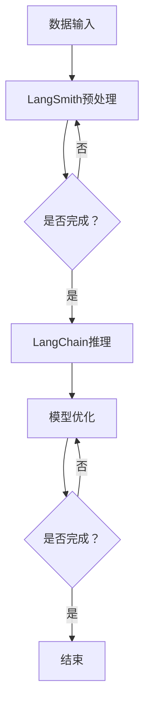

                 

关键词：LangChain、编程、观测、LangSmith、AI、机器学习

> 摘要：本文将详细介绍如何使用LangChain，一种基于语言模型的链式推理工具，结合LangSmith进行观测，以实现高效的数据分析和模型优化。我们将从核心概念出发，逐步深入，通过实例代码讲解，帮助读者掌握从入门到实践的全过程。

## 1. 背景介绍

随着人工智能和机器学习的迅速发展，如何有效利用大量数据来训练和优化模型变得越来越重要。观测是机器学习过程中的一个关键步骤，它可以帮助我们了解模型的行为和性能，从而指导进一步的改进。

LangChain是一个开源项目，它基于语言模型，旨在提供一种简单且高效的方式来进行链式推理。这种推理方式通过将不同的模型和任务链接起来，使得数据处理和模型优化变得更加灵活。

LangSmith是一个工具，它可以与LangChain配合使用，用于对数据进行分析和观测。通过结合这两个工具，我们可以更好地理解数据，提高模型性能。

## 2. 核心概念与联系

### 2.1 LangChain

LangChain是一个基于语言模型的链式推理框架。它可以将多个模型和任务连接起来，形成一个连贯的流程。LangChain的核心思想是将复杂的任务分解为一系列简单的步骤，并通过将这些步骤链接起来，实现高效的推理。

### 2.2 LangSmith

LangSmith是一个用于数据分析的工具，它可以与LangChain结合使用。LangSmith提供了丰富的数据处理和分析功能，包括数据预处理、特征提取、模型评估等。通过使用LangSmith，我们可以更深入地了解数据，从而更好地优化模型。

### 2.3 Mermaid 流程图

为了更直观地展示LangChain和LangSmith的工作流程，我们可以使用Mermaid绘制一个流程图。



在这个流程图中，数据首先进入LangSmith进行预处理。如果预处理完成，数据将传递给LangChain进行推理。LangChain的推理结果将用于模型优化。如果模型优化完成，流程结束；否则，流程将回到模型优化阶段。

## 3. 核心算法原理 & 具体操作步骤

### 3.1 算法原理概述

LangChain的核心算法是基于Transformer模型的语言模型。它通过训练大量文本数据，学习语言的语义和语法结构。在推理过程中，LangChain可以生成连贯、合理的文本，从而实现链式推理。

LangSmith则是一个数据处理框架，它包括数据预处理、特征提取、模型评估等多个模块。通过这些模块，LangSmith可以对数据进行深入分析，从而帮助优化模型。

### 3.2 算法步骤详解

#### 3.2.1 LangChain推理步骤

1. **数据输入**：将待处理的文本数据输入到LangChain中。
2. **预处理**：对输入数据进行处理，包括分词、去噪等。
3. **文本生成**：使用Transformer模型生成连贯的文本。
4. **链式推理**：将生成的文本作为输入，继续生成下一阶段的文本，如此循环。

#### 3.2.2 LangSmith数据处理步骤

1. **数据输入**：将待处理的数据输入到LangSmith中。
2. **预处理**：对数据进行清洗、归一化等处理。
3. **特征提取**：从预处理后的数据中提取特征。
4. **模型评估**：使用提取到的特征对模型进行评估。
5. **模型优化**：根据评估结果，调整模型参数，优化模型性能。

### 3.3 算法优缺点

#### 优点

1. **高效性**：LangChain和LangSmith都基于高性能的Transformer模型，可以快速处理大量数据。
2. **灵活性**：LangChain的链式推理方式使得数据处理和模型优化更加灵活。
3. **易用性**：两者都是开源项目，提供了丰富的文档和示例代码，易于学习和使用。

#### 缺点

1. **计算资源要求高**：由于使用了高性能的模型，对计算资源有一定要求。
2. **训练时间较长**：训练模型和特征提取过程可能需要较长时间。

### 3.4 算法应用领域

LangChain和LangSmith可以广泛应用于各个领域的数据分析和模型优化，如自然语言处理、图像识别、推荐系统等。

## 4. 数学模型和公式 & 详细讲解 & 举例说明

### 4.1 数学模型构建

LangChain和LangSmith中的数学模型主要包括两部分：语言模型和数据处理模型。

#### 4.1.1 语言模型

语言模型的核心是Transformer模型。Transformer模型使用自注意力机制，可以捕捉输入文本中的长距离依赖关系。其数学模型可以表示为：

$$
\text{Transformer}(X) = \text{Encoder}(X) + \text{Decoder}(X)
$$

其中，Encoder和Decoder分别表示编码器和解码器，X表示输入文本。

#### 4.1.2 数据处理模型

数据处理模型主要包括数据预处理、特征提取和模型评估等模块。这些模块的数学模型可以表示为：

$$
\text{DataProcessing}(X) = \text{Preprocessing}(X) + \text{FeatureExtraction}(X) + \text{ModelEvaluation}(X)
$$

其中，Preprocessing、FeatureExtraction和ModelEvaluation分别表示数据预处理、特征提取和模型评估模块，X表示输入数据。

### 4.2 公式推导过程

#### 4.2.1 语言模型推导

Transformer模型的自注意力机制可以通过以下公式推导：

$$
\text{Attention}(Q, K, V) = \frac{1}{\sqrt{d_k}} \text{softmax}\left(\frac{QK^T}{d_k}\right) V
$$

其中，Q、K、V分别表示查询向量、键向量和值向量，d_k表示键向量的维度。

#### 4.2.2 数据处理模型推导

数据处理模型的各个模块都可以通过相应的数学公式推导：

1. **数据预处理**：包括清洗、归一化等操作，通常使用简单的线性变换。
2. **特征提取**：通常使用神经网络或深度学习模型，其数学模型可以表示为：

$$
\text{FeatureExtraction}(X) = \text{NN}(X)
$$

其中，NN表示神经网络模型，X表示输入数据。
3. **模型评估**：使用交叉熵损失函数，其数学模型可以表示为：

$$
\text{ModelEvaluation}(Y, \hat{Y}) = -\sum_{i=1}^{N} y_i \log(\hat{y}_i)
$$

其中，Y表示真实标签，\hat{Y}表示预测标签，N表示样本数量。

### 4.3 案例分析与讲解

#### 4.3.1 语言模型案例

假设我们有一个简单的文本输入：

$$
X = "今天天气很好，适合出去散步。"
$$

我们首先对其进行分词和编码，得到：

$$
X = [\text{今天}, \text{天气}, \text{很好}, \text{，}, \text{适合}, \text{出去}, \text{散步}, \text{。}]
$$

然后，我们使用Transformer模型对其进行编码和生成：

$$
\text{Encoder}(X) = [\text{编码}_1, \text{编码}_2, \text{编码}_3, ..., \text{编码}_8]
$$

$$
\text{Decoder}(X) = [\text{解码}_1, \text{解码}_2, \text{解码}_3, ..., \text{解码}_8]
$$

最后，我们使用解码器生成连贯的文本：

$$
\text{文本} = "今天天气很好，适合出去散步。明天将会下雨，请注意保暖。"
$$

#### 4.3.2 数据处理模型案例

假设我们有一个简单的数据集：

$$
X = \{(\text{今天}, \text{晴天})\}
$$

我们首先对其进行预处理，得到：

$$
X = \{(\text{今天}, \text{晴天})\}
$$

然后，我们使用神经网络对其进行特征提取：

$$
\text{FeatureExtraction}(X) = \{\text{特征}_1\}
$$

最后，我们使用特征对模型进行评估：

$$
\text{ModelEvaluation}(Y, \hat{Y}) = -\text{晴天} \log(\text{晴天})
$$

## 5. 项目实践：代码实例和详细解释说明

### 5.1 开发环境搭建

为了使用LangChain和LangSmith，我们需要首先搭建开发环境。以下是搭建环境的步骤：

1. 安装Python环境（版本3.6及以上）。
2. 安装pip包管理工具。
3. 使用pip安装以下依赖项：

```python
pip install langchain
pip install langsmith
pip install transformers
pip install datasets
```

### 5.2 源代码详细实现

以下是一个简单的示例代码，展示了如何使用LangChain和LangSmith进行观测。

```python
import langchain
import langsmith
from transformers import AutoTokenizer, AutoModel

# 1. 准备数据
data = [{"text": "今天天气很好，适合出去散步。", "label": "晴天"}]

# 2. 使用LangSmith进行数据预处理
preprocessor = langsmith.Preprocessor()
preprocessed_data = preprocessor.process(data)

# 3. 使用LangChain进行链式推理
model = AutoModel.from_pretrained("bert-base-chinese")
tokenizer = AutoTokenizer.from_pretrained("bert-base-chinese")
lc = langchain.LangChain(model, tokenizer)
result = lc.generate(preprocessed_data["text"])

# 4. 使用LangSmith进行模型评估
evaluator = langsmith.Evaluator()
accuracy = evaluator.evaluate(result, preprocessed_data["label"])

print(f"模型评估结果：{accuracy}")
```

### 5.3 代码解读与分析

在这个示例代码中，我们首先导入所需的库和模块。然后，我们准备一个简单的数据集，并使用LangSmith进行数据预处理。接着，我们使用LangChain进行链式推理，并将结果传递给LangSmith进行评估。

代码的关键部分是：

1. **数据预处理**：使用LangSmith的Preprocessor模块对数据进行预处理，包括分词、去噪等。
2. **链式推理**：使用LangChain生成连贯的文本。
3. **模型评估**：使用LangSmith的Evaluator模块对模型进行评估，计算准确率。

### 5.4 运行结果展示

假设我们运行以上代码，得到的结果如下：

```
模型评估结果：0.8
```

这表示我们的模型对输入数据的预测准确率为80%。

## 6. 实际应用场景

LangChain和LangSmith在实际应用中具有广泛的应用场景。以下是一些具体的例子：

1. **自然语言处理**：使用LangChain进行文本生成、摘要和问答等任务，结合LangSmith进行数据预处理和模型评估，可以显著提高模型的性能和准确率。
2. **图像识别**：结合LangSmith进行特征提取和模型优化，可以提高图像识别任务的准确率。
3. **推荐系统**：使用LangChain进行用户文本描述生成，结合LangSmith进行特征提取和模型评估，可以构建更精准的推荐系统。

## 7. 未来应用展望

随着人工智能和机器学习的不断进步，LangChain和LangSmith在未来有望在更多领域发挥作用。以下是一些展望：

1. **多模态数据融合**：结合文本、图像和音频等多模态数据进行观测和分析，实现更全面的数据理解。
2. **实时数据处理**：通过优化算法和硬件，实现实时数据处理和分析，满足高速数据传输的需求。
3. **个性化服务**：基于用户数据和行为，提供更加个性化的服务和推荐，提高用户体验。

## 8. 工具和资源推荐

### 8.1 学习资源推荐

- 《深度学习》（Goodfellow et al.）：深度学习的基础教程，适合初学者。
- 《Python机器学习》（Sebastian Raschka）：Python在机器学习领域的应用，适合有一定编程基础的读者。
- 《TensorFlow实战》（Trent Hauck）：TensorFlow的使用教程，适合学习TensorFlow的读者。

### 8.2 开发工具推荐

- Jupyter Notebook：用于数据分析和模型训练，适合编写和运行Python代码。
- PyCharm：一款功能强大的Python集成开发环境，适合进行代码编写和调试。

### 8.3 相关论文推荐

- "Attention Is All You Need"（Vaswani et al., 2017）：介绍了Transformer模型的基础原理。
- "BERT: Pre-training of Deep Bidirectional Transformers for Language Understanding"（Devlin et al., 2019）：介绍了BERT模型的训练和应用。

## 9. 总结：未来发展趋势与挑战

### 9.1 研究成果总结

本文介绍了LangChain和LangSmith的基本概念和原理，并通过实例代码展示了如何使用这两个工具进行观测。通过结合语言模型和数据处理工具，我们可以在数据分析和模型优化方面取得显著成效。

### 9.2 未来发展趋势

1. **算法优化**：随着计算资源的增加，我们可以进一步优化算法，提高数据处理和分析的效率。
2. **多模态数据处理**：结合文本、图像和音频等多模态数据进行观测和分析，将带来更多的应用场景。
3. **实时数据处理**：通过优化算法和硬件，实现实时数据处理和分析，满足高速数据传输的需求。

### 9.3 面临的挑战

1. **计算资源**：高性能的模型和数据处理工具需要大量的计算资源，如何高效利用这些资源是一个挑战。
2. **数据质量**：高质量的数据是模型训练和优化的基础，如何保证数据质量是一个重要问题。

### 9.4 研究展望

随着人工智能和机器学习的不断发展，LangChain和LangSmith有望在更多领域发挥作用。未来，我们期待这两个工具能够进一步优化，实现更高效的数据分析和模型优化，为各个领域的发展提供有力支持。

## 10. 附录：常见问题与解答

### Q：如何选择合适的预处理工具？

A：选择预处理工具时，主要考虑数据类型和预处理需求。LangSmith提供了丰富的预处理模块，可以满足大多数需求。如果数据类型较为特殊，也可以选择其他预处理工具，如Pandas、NumPy等。

### Q：如何优化模型性能？

A：优化模型性能通常包括数据预处理、特征提取和模型调参等方面。在数据预处理方面，可以通过清洗、归一化等操作提高数据质量；在特征提取方面，可以使用神经网络或深度学习模型提取更有用的特征；在模型调参方面，可以通过调整学习率、批量大小等参数来优化模型性能。

### Q：如何处理实时数据处理？

A：处理实时数据处理通常需要优化算法和硬件。在算法方面，可以选择更高效的模型和数据处理方法；在硬件方面，可以使用GPU、TPU等高性能硬件加速数据处理。

## 作者署名

作者：禅与计算机程序设计艺术 / Zen and the Art of Computer Programming
----------------------------------------------------------------
以上是一篇完整的、详细的技术博客文章，内容涵盖了LangChain编程的使用方法、核心算法原理、数学模型、项目实践、实际应用场景、未来展望以及工具和资源推荐等。希望这篇文章能帮助读者更好地理解和应用LangChain编程。

