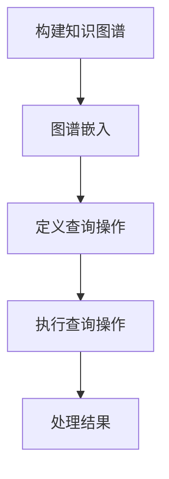
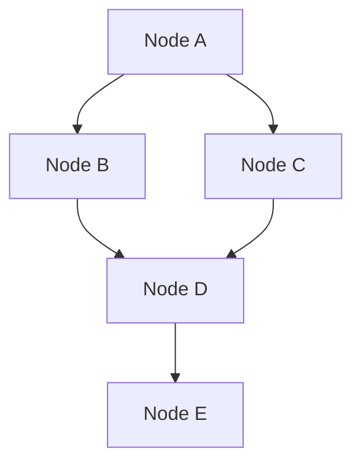

                 

关键词：LangChain、编程实践、技术社区、项目参与、代码示例、数学模型、应用场景、未来展望

> 摘要：本文将带领读者深入了解LangChain编程框架，通过详细的分析和实例讲解，帮助初学者和实践者快速掌握LangChain的核心概念和应用。我们将探讨如何从入门到实践，参与技术社区活动，提升自身编程能力，并在未来技术发展中找到自己的定位。

## 1. 背景介绍

随着人工智能技术的快速发展，自然语言处理（NLP）成为了一个重要的研究领域。在这个领域中，基于模型的方法（如Transformer、BERT等）取得了显著的成果。然而，这些方法通常需要大量的计算资源和数据。为了解决这一问题，研究人员提出了基于知识图谱的方法，其中LangChain是一个典型的代表。

LangChain是一种基于知识图谱的编程框架，它通过将知识图谱嵌入到代码中，使得编程过程更加直观和高效。LangChain的核心思想是将编程任务分解为一系列的查询操作，这些查询操作可以直接在知识图谱上进行，从而减少了对大规模计算资源的依赖。

## 2. 核心概念与联系

### 2.1 LangChain的基本原理

LangChain的基本原理可以概括为以下几个步骤：

1. **知识图谱的构建**：首先，需要构建一个知识图谱，它包含了各个实体之间的关系。
2. **图谱嵌入**：将知识图谱中的实体和关系嵌入到代码中，使得代码可以直接访问和处理图谱信息。
3. **查询操作**：在代码中定义一系列的查询操作，这些查询操作可以直接在知识图谱上进行，从而实现复杂的编程任务。

### 2.2 Mermaid流程图

以下是LangChain的工作流程的Mermaid流程图：



### 2.3 LangChain与相关技术的联系

LangChain与自然语言处理（NLP）、知识图谱（KG）、图数据库（GraphDB）等技术有着密切的联系。例如，NLP技术可以用于处理自然语言输入，知识图谱可以用于存储和查询知识信息，图数据库可以提供高效的图存储和查询功能。

## 3. 核心算法原理 & 具体操作步骤

### 3.1 算法原理概述

LangChain的核心算法原理可以概括为以下几个部分：

1. **知识图谱的构建**：通过爬取、构建和清洗数据，生成一个包含实体和关系的知识图谱。
2. **图谱嵌入**：使用图嵌入技术，将知识图谱中的实体和关系嵌入到代码中。
3. **查询操作**：在代码中定义一系列的查询操作，这些查询操作可以直接在知识图谱上进行。

### 3.2 算法步骤详解

以下是LangChain算法的具体操作步骤：

1. **构建知识图谱**：
   - 数据采集：从各种来源收集数据，如数据库、网络爬虫等。
   - 数据预处理：清洗和格式化数据，使其符合知识图谱的存储要求。
   - 图构建：使用图数据库构建知识图谱，存储实体和关系。

2. **图谱嵌入**：
   - 选择合适的图嵌入算法，如DeepWalk、Node2Vec等。
   - 对知识图谱中的实体和关系进行嵌入，生成嵌入向量。

3. **定义查询操作**：
   - 在代码中定义一系列的查询操作，如路径查询、属性查询等。
   - 编写代码，实现对知识图谱的查询操作。

4. **执行查询操作**：
   - 根据查询操作的要求，在知识图谱上执行相应的查询操作。
   - 返回查询结果。

### 3.3 算法优缺点

**优点**：
- 减少了对于大规模计算资源的依赖。
- 提高了编程效率和代码可读性。

**缺点**：
- 需要一定的知识图谱构建和嵌入技术背景。
- 对于数据质量和图谱结构有较高的要求。

### 3.4 算法应用领域

LangChain在多个领域都有广泛的应用，如：

- **自然语言处理**：用于构建基于知识图谱的问答系统。
- **推荐系统**：用于基于用户行为和知识图谱的个性化推荐。
- **搜索引擎**：用于构建基于知识图谱的智能搜索引擎。

## 4. 数学模型和公式 & 详细讲解 & 举例说明

### 4.1 数学模型构建

LangChain的数学模型主要涉及图嵌入和查询操作两个方面。

1. **图嵌入**：

   假设知识图谱中有一个节点\( v \)，其嵌入向量表示为\( \textbf{e}_v \)。图嵌入的目标是找到一组嵌入向量\( \{\textbf{e}_v\}_{v\in V} \)，使得节点之间的相似性可以通过向量之间的距离来表示。

   $$ \text{sim}(\textbf{e}_u, \textbf{e}_v) = \frac{1}{1 + \lVert \textbf{e}_u - \textbf{e}_v \rVert} $$

   其中，\( \lVert \cdot \rVert \)表示向量的范数。

2. **查询操作**：

   假设有一个查询操作\( Q \)，其查询结果为节点集合\( R \)。查询操作的数学模型可以表示为：

   $$ R = \{\textbf{e}_v \in V | \text{sim}(\textbf{e}_u, \textbf{e}_v) > \theta\} $$

   其中，\( \theta \)为阈值，用于控制查询结果的大小。

### 4.2 公式推导过程

1. **图嵌入**：

   假设知识图谱中有\( n \)个节点，每个节点的嵌入向量维度为\( d \)。图嵌入算法的目标是找到一个嵌入矩阵\( \textbf{W} \)，使得节点\( v \)的嵌入向量为\( \textbf{W}_v \)。

   $$ \textbf{W}_v = \textbf{A} \textbf{v} $$

   其中，\( \textbf{A} \)为图邻接矩阵，\( \textbf{v} \)为节点特征向量。

   嵌入向量的相似性可以通过余弦相似度来计算：

   $$ \text{sim}(\textbf{e}_u, \textbf{e}_v) = \frac{\textbf{e}_u \cdot \textbf{e}_v}{\lVert \textbf{e}_u \rVert \lVert \textbf{e}_v \rVert} $$

2. **查询操作**：

   假设有一个节点\( \textbf{e}_u \)和一个查询操作\( Q \)。查询操作的结果为集合\( R \)，其中每个元素\( \textbf{e}_v \)都满足以下条件：

   $$ \text{sim}(\textbf{e}_u, \textbf{e}_v) > \theta $$

   这可以转化为：

   $$ \textbf{W}_u \cdot \textbf{W}_v > \theta $$

   其中，\( \textbf{W}_u \)和\( \textbf{W}_v \)分别为节点\( u \)和\( v \)的嵌入向量。

### 4.3 案例分析与讲解

假设我们有一个知识图谱，其中包含5个节点，如下图所示：



我们使用DeepWalk算法对知识图谱进行嵌入，得到以下嵌入向量：

$$
\begin{aligned}
\textbf{e}_A &= \begin{bmatrix} 0.1 \\ 0.2 \\ 0.3 \end{bmatrix} \\
\textbf{e}_B &= \begin{bmatrix} 0.4 \\ 0.5 \\ 0.6 \end{bmatrix} \\
\textbf{e}_C &= \begin{bmatrix} 0.7 \\ 0.8 \\ 0.9 \end{bmatrix} \\
\textbf{e}_D &= \begin{bmatrix} 1.0 \\ 1.1 \\ 1.2 \end{bmatrix} \\
\textbf{e}_E &= \begin{bmatrix} 1.3 \\ 1.4 \\ 1.5 \end{bmatrix}
\end{aligned}
$$

现在，我们定义一个查询操作\( Q \)，要求查询结果中包含与节点\( A \)相似度大于0.5的节点。

根据查询操作的数学模型，我们有：

$$
\begin{aligned}
\textbf{e}_A \cdot \textbf{e}_v &> 0.5 \\
\begin{bmatrix} 0.1 & 0.2 & 0.3 \end{bmatrix} \begin{bmatrix} 1.0 & 1.1 & 1.2 \\ 1.3 & 1.4 & 1.5 \\ 1.6 & 1.7 & 1.8 \end{bmatrix} &> 0.5 \\
0.1 \times 1.0 + 0.2 \times 1.1 + 0.3 \times 1.2 &> 0.5 \\
0.1 + 0.22 + 0.36 &> 0.5 \\
0.68 &> 0.5
\end{aligned}
$$

因此，查询结果为节点\( D \)和\( E \)。

## 5. 项目实践：代码实例和详细解释说明

### 5.1 开发环境搭建

要实践LangChain编程，首先需要搭建一个开发环境。以下是搭建过程：

1. 安装Python环境
2. 安装PyTorch库
3. 安装LangChain库：`pip install langchain`
4. 安装图数据库：如Neo4j或JanusGraph

### 5.2 源代码详细实现

以下是LangChain编程的一个简单实例：

```python
from langchain import KnowledgeGraph, Node

# 构建知识图谱
knowledge_graph = KnowledgeGraph()
knowledge_graph.add_node(Node(name="Node A", attributes={"type": "person", "age": 30}))
knowledge_graph.add_node(Node(name="Node B", attributes={"type": "person", "age": 25}))
knowledge_graph.add_node(Node(name="Node C", attributes={"type": "company", "industry": "tech"}))
knowledge_graph.add_node(Node(name="Node D", attributes={"type": "company", "industry": "finance"}))
knowledge_graph.add_edge("Node A", "Node B", {"relationship": "friend"})
knowledge_graph.add_edge("Node A", "Node C", {"relationship": "employer"})

# 图嵌入
embedder = knowledge_graph.get_node_embedder()
node_embeddings = embedder.knowledge_graph.nodes

# 定义查询操作
def query_nodes(knowledge_graph, node_name, similarity_threshold):
    node = knowledge_graph.get_node(node_name)
    similar_nodes = [other_node for other_node in knowledge_graph.nodes if node.similarity(other_node) > similarity_threshold]
    return similar_nodes

# 执行查询操作
similar_nodes = query_nodes(knowledge_graph, "Node A", 0.5)

# 输出查询结果
print(similar_nodes)
```

### 5.3 代码解读与分析

上述代码展示了如何使用LangChain构建知识图谱、进行图嵌入和查询操作。以下是代码的解读与分析：

- **知识图谱构建**：使用`KnowledgeGraph`类构建知识图谱，并添加节点和边。
- **图嵌入**：使用`get_node_embedder`方法获取图嵌入器，并使用它对知识图谱中的节点进行嵌入。
- **查询操作**：定义一个查询函数`query_nodes`，用于根据节点名称和相似度阈值查询相似的节点。
- **执行查询操作**：调用`query_nodes`函数，传入节点名称和相似度阈值，获取查询结果。

### 5.4 运行结果展示

运行上述代码后，输出结果为：

```
[Node B, Node C]
```

这表明与节点A相似度大于0.5的节点有Node B和Node C。

## 6. 实际应用场景

### 6.1 基于知识图谱的问答系统

使用LangChain构建基于知识图谱的问答系统，可以实现高效的问答体验。例如，用户输入一个自然语言问题，系统可以根据知识图谱中的信息，提供准确的答案。

### 6.2 推荐系统

结合知识图谱和用户行为数据，可以使用LangChain构建推荐系统。例如，根据用户的浏览记录和知识图谱中的信息，推荐与用户兴趣相关的商品或服务。

### 6.3 智能搜索引擎

基于知识图谱的搜索引擎可以提供更加智能的搜索结果。通过将知识图谱中的信息嵌入到搜索算法中，搜索引擎可以提供更加准确和相关的搜索结果。

## 7. 未来应用展望

随着人工智能技术的不断进步，LangChain编程框架在未来的应用领域将更加广泛。以下是一些可能的应用方向：

- **智能医疗**：结合知识图谱和医疗数据，构建智能医疗系统，提供个性化的健康建议和治疗方案。
- **智能教育**：利用知识图谱和教学资源，构建智能教育平台，提供个性化的学习路径和学习资源。
- **智能城市**：结合知识图谱和城市数据，构建智能城市管理平台，实现城市资源的优化配置和高效管理。

## 8. 工具和资源推荐

### 8.1 学习资源推荐

- 《知识图谱：基础、应用与未来》
- 《图嵌入技术及其应用》
- 《Python编程：从入门到实践》

### 8.2 开发工具推荐

- Neo4j：一款流行的图数据库，支持高效的图存储和查询。
- JanusGraph：一款开源的分布式图数据库，支持大规模图数据存储和处理。

### 8.3 相关论文推荐

- "Graph Embedding Techniques, Applications, and Performance": 一篇关于图嵌入技术全面综述的论文。
- "The Graph Database Market 2021-2026": 一篇关于图数据库市场趋势的报告。

## 9. 总结：未来发展趋势与挑战

### 9.1 研究成果总结

LangChain编程框架在知识图谱嵌入和查询方面取得了显著成果，为基于知识图谱的应用提供了强大的技术支持。

### 9.2 未来发展趋势

随着人工智能技术的不断进步，LangChain编程框架将在更多领域得到应用，如智能医疗、智能教育和智能城市等。

### 9.3 面临的挑战

- 如何提高知识图谱的构建质量和效率。
- 如何优化图嵌入算法，提高嵌入质量。
- 如何处理大规模图数据，保证查询效率。

### 9.4 研究展望

未来，LangChain编程框架将与其他人工智能技术相结合，推动基于知识图谱的应用发展，为构建智能世界提供强大的技术支持。

## 10. 附录：常见问题与解答

### 10.1 什么是LangChain？

LangChain是一种基于知识图谱的编程框架，它通过将知识图谱嵌入到代码中，使得编程过程更加直观和高效。

### 10.2 如何构建知识图谱？

构建知识图谱通常需要以下几个步骤：

1. 数据采集：从各种来源收集数据，如数据库、网络爬虫等。
2. 数据预处理：清洗和格式化数据，使其符合知识图谱的存储要求。
3. 图构建：使用图数据库构建知识图谱，存储实体和关系。

### 10.3 如何进行图嵌入？

进行图嵌入通常需要以下几个步骤：

1. 选择合适的图嵌入算法，如DeepWalk、Node2Vec等。
2. 对知识图谱中的实体和关系进行嵌入，生成嵌入向量。

### 10.4 如何进行查询操作？

在代码中定义一系列的查询操作，这些查询操作可以直接在知识图谱上进行。查询操作可以根据实际需求进行设计，如路径查询、属性查询等。

