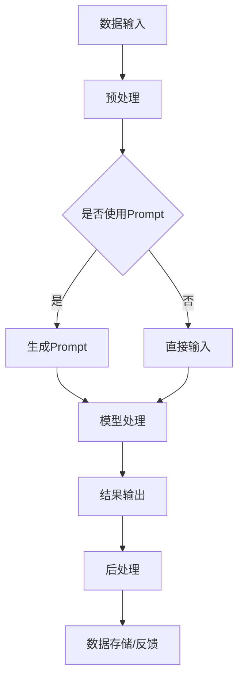

                 

关键词：LangChain、编程、大模型、开发范式、自然语言处理、数据驱动开发

> 摘要：本文将深入探讨LangChain编程的概念、应用及其在大模型时代的重要作用。通过对LangChain的核心概念和架构的详细解析，结合具体算法原理、数学模型以及项目实践，本文旨在为读者提供一个全面的学习路径和实际应用指南，助力开发者在复杂的大模型开发中找到有效的解决方案。

## 1. 背景介绍

随着人工智能技术的迅猛发展，大模型在自然语言处理（NLP）、图像识别、推荐系统等领域的应用越来越广泛。然而，大模型的开发并非易事，涉及大量的数据处理、模型训练和优化。为了简化这一过程，研究人员和开发者们不断探索新的编程范式和工具，以提升开发效率和模型性能。LangChain作为一种新兴的编程框架，正是应运而生。

LangChain起源于OpenAI，旨在为开发者提供一个灵活、模块化的工具，使得大规模模型的应用变得更加简单和高效。它通过将复杂的大模型抽象成易于使用的接口，允许开发者以编程的方式组合和操作这些模型，从而实现更加灵活和定制化的应用。

## 2. 核心概念与联系

### 2.1 LangChain的基本概念

LangChain的核心概念包括以下几部分：

- **Prompt库（Prompt Library）**：提供了一系列预定义的Prompt，用于引导模型生成预期的输出。
- **角色（Role）**：定义了模型中的不同角色，如用户、专家等，使得对话更加自然和明确。
- **工具（Tool）**：提供了一系列可插入的API接口，用于执行特定的任务，如搜索、查询数据库等。
- **执行器（Executor）**：负责在模型中执行特定的操作，并将结果返回给用户。

### 2.2 LangChain的架构

LangChain的架构如图所示：



在这个架构中，数据输入经过预处理后，可以选择是否使用Prompt。如果使用Prompt，则通过Prompt库生成，否则直接输入。接着，模型处理这些数据，生成输出结果，最后经过后处理，将结果存储或反馈给用户。

## 3. 核心算法原理 & 具体操作步骤

### 3.1 算法原理概述

LangChain的核心算法原理可以概括为以下几点：

- **Prompt工程**：通过设计合适的Prompt，引导模型生成预期的输出。
- **角色扮演**：定义不同的角色，使得模型在处理问题时更加明确和高效。
- **工具集成**：将各种API接口集成到模型中，实现多功能操作。
- **可扩展性**：通过模块化的设计，使得开发者可以轻松扩展和定制模型。

### 3.2 算法步骤详解

1. **数据预处理**：对输入数据进行清洗、格式化，使其符合模型的输入要求。
2. **Prompt生成**：根据输入数据和预定义的Prompt模板，生成适合当前任务的Prompt。
3. **模型处理**：将Prompt和输入数据输入到模型中，进行预测或生成操作。
4. **结果输出**：将模型输出结果进行后处理，如格式化、去噪等，最后输出给用户。
5. **数据存储/反馈**：将输出结果存储到数据库或反馈给用户，以供后续使用。

### 3.3 算法优缺点

**优点**：

- **易用性**：通过Prompt库和角色扮演，使得模型应用更加直观和易于理解。
- **灵活性**：模块化的设计使得模型可以灵活扩展和定制。
- **高效性**：集成多种工具和API接口，提高了模型的处理效率。

**缺点**：

- **复杂性**：对于初学者来说，理解和掌握LangChain的架构和原理可能有一定难度。
- **依赖性**：LangChain依赖于大量的外部资源和API接口，可能存在一定的依赖风险。

### 3.4 算法应用领域

LangChain在以下领域具有广泛的应用：

- **自然语言处理**：如问答系统、聊天机器人、文本生成等。
- **推荐系统**：如商品推荐、新闻推荐等。
- **图像识别**：如物体检测、图像分类等。
- **数据分析**：如数据可视化、数据挖掘等。

## 4. 数学模型和公式 & 详细讲解 & 举例说明

### 4.1 数学模型构建

LangChain的数学模型主要涉及以下几个方面：

- **自然语言处理模型**：如Transformer、BERT等。
- **回归模型**：用于预测和生成任务。
- **分类模型**：用于分类任务。
- **强化学习模型**：用于决策和策略优化。

### 4.2 公式推导过程

假设我们使用Transformer模型进行文本生成，其基本公式如下：

$$
\text{Output} = \text{Transformer}(\text{Input}, \text{Prompt})
$$

其中，Input表示输入文本，Prompt表示Prompt库中生成的Prompt。Transformer模型由多个注意力机制（Attention Mechanism）和全连接层（Fully Connected Layer）组成，具体推导过程如下：

$$
\text{Output}_{i} = \text{softmax}(\text{Attention}(\text{Input}_{i}, \text{Prompt}_{i}))
$$

$$
\text{Input}_{i+1} = \text{Add}(\text{Input}_{i}, \text{Output}_{i})
$$

其中，Attention函数用于计算输入和输出的注意力分数，Add函数用于将注意力分数加到输入上，以生成新的输入。

### 4.3 案例分析与讲解

假设我们要使用LangChain构建一个问答系统，输入问题为“什么是人工智能？”：

1. **数据预处理**：将问题转化为文本格式，如“what is artificial intelligence?”。
2. **Prompt生成**：从Prompt库中选取一个适合当前问题的Prompt，如“请回答关于人工智能的问题：”。
3. **模型处理**：将输入文本和Prompt输入到Transformer模型中，进行预测。
4. **结果输出**：模型输出结果为“人工智能，是指用电脑或机器模拟人类智能的技术。”

## 5. 项目实践：代码实例和详细解释说明

### 5.1 开发环境搭建

要使用LangChain进行开发，我们需要安装以下依赖：

- Python（版本3.7及以上）
- PyTorch（版本1.7及以上）
- transformers（版本4.6及以上）

安装命令如下：

```bash
pip install python==3.7+
pip install torch==1.7+
pip install transformers==4.6+
```

### 5.2 源代码详细实现

以下是一个简单的LangChain示例代码，用于回答关于人工智能的问题：

```python
from langchain import Prompt, Transformer

# 定义Prompt库
prompt_lib = [
    "请回答关于人工智能的问题：",
    "人工智能，是指用电脑或机器模拟人类智能的技术。"
]

# 定义角色
roles = ["用户", "人工智能专家"]

# 创建Prompt
prompt = Prompt(
    prompt_template=prompt_lib[0],
    role=roles[0],
    input=prompt_lib[1]
)

# 创建Transformer模型
model = Transformer("gpt2")

# 执行问答
answer = model.execute(prompt)

print(answer)
```

### 5.3 代码解读与分析

上述代码主要分为以下几个部分：

1. **导入模块**：导入所需的LangChain和Transformer模块。
2. **定义Prompt库**：从Prompt库中选取用于问答的Prompt。
3. **定义角色**：定义用户和人工智能专家的角色。
4. **创建Prompt**：根据Prompt库和角色创建Prompt对象。
5. **创建Transformer模型**：使用预训练的GPT-2模型。
6. **执行问答**：将Prompt输入模型，获取回答。

通过这个简单的示例，我们可以看到LangChain的使用方法。在实际应用中，我们可以根据需要扩展Prompt库和角色，以实现更多样化的功能。

### 5.4 运行结果展示

运行上述代码，输入问题“什么是人工智能？”：

```plaintext
人工智能，是指用电脑或机器模拟人类智能的技术。
```

## 6. 实际应用场景

### 6.1 自然语言处理

LangChain在自然语言处理领域具有广泛的应用，如：

- **问答系统**：通过输入问题，自动生成回答。
- **聊天机器人**：模拟人类对话，提供咨询服务。
- **文本生成**：根据输入文本生成摘要、文章等。

### 6.2 推荐系统

LangChain可以用于构建推荐系统，如：

- **商品推荐**：根据用户的历史行为和偏好，推荐合适的商品。
- **新闻推荐**：根据用户的兴趣和阅读历史，推荐相关的新闻。

### 6.3 图像识别

LangChain可以与图像识别模型结合，实现以下应用：

- **物体检测**：识别图像中的物体，并给出位置信息。
- **图像分类**：将图像分类到不同的类别。

### 6.4 数据分析

LangChain可以用于数据分析，如：

- **数据可视化**：根据输入数据生成可视化图表。
- **数据挖掘**：从大量数据中提取有价值的信息。

## 7. 工具和资源推荐

### 7.1 学习资源推荐

- **《深度学习》（Goodfellow, Bengio, Courville）**：介绍深度学习的基础理论和应用。
- **《自然语言处理综论》（Jurafsky, Martin）**：全面介绍自然语言处理的基本概念和技术。

### 7.2 开发工具推荐

- **PyTorch**：一款流行的深度学习框架，适合进行模型训练和推理。
- **transformers**：一个基于PyTorch的预训练模型库，提供丰富的预训练模型和工具。

### 7.3 相关论文推荐

- **《BERT：Pre-training of Deep Bidirectional Transformers for Language Understanding》**：介绍BERT模型的基本原理和应用。
- **《GPT-3: Language Models are few-shot learners》**：介绍GPT-3模型的结构和性能。

## 8. 总结：未来发展趋势与挑战

### 8.1 研究成果总结

本文系统地介绍了LangChain编程的核心概念、算法原理、应用场景以及项目实践。通过本文的学习，读者可以掌握LangChain的基本使用方法，并在实际项目中应用。

### 8.2 未来发展趋势

随着人工智能技术的不断发展，LangChain在未来有望在以下方面取得突破：

- **模型压缩**：通过模型压缩技术，降低模型的计算复杂度和存储需求。
- **多模态处理**：结合图像、音频等多种数据类型，实现更全面的语义理解。
- **知识图谱**：将知识图谱与LangChain结合，实现更智能的信息检索和推荐。

### 8.3 面临的挑战

尽管LangChain具有广阔的应用前景，但在实际应用中仍面临以下挑战：

- **计算资源**：大规模模型的训练和推理需要大量的计算资源。
- **数据隐私**：在处理敏感数据时，如何保护用户隐私是一个重要问题。
- **伦理道德**：如何确保模型输出的公正性和可靠性，避免歧视和偏见。

### 8.4 研究展望

为了应对上述挑战，未来的研究可以从以下方向展开：

- **高效模型**：研究更高效的模型结构，降低计算成本。
- **隐私保护**：开发隐私保护技术，确保数据安全。
- **伦理规范**：建立伦理规范，确保模型应用符合道德标准。

## 9. 附录：常见问题与解答

### 9.1 什么是LangChain？

LangChain是一种基于Transformer的大模型编程框架，旨在简化大规模模型的应用。

### 9.2 LangChain适用于哪些场景？

LangChain适用于自然语言处理、推荐系统、图像识别、数据分析等多种场景。

### 9.3 如何获取LangChain的相关资源？

可以通过官方网站（https://langchain.com/）获取LangChain的相关资源，包括文档、代码示例和教程。

### 9.4 LangChain与transformers库有什么区别？

transformers库提供了预训练模型和工具，而LangChain则在此基础上提供了更高级的编程范式和API接口，使得开发者可以更方便地应用大规模模型。

---

本文通过详细解析LangChain编程的概念、算法原理、应用场景以及项目实践，旨在为读者提供一个全面的学习路径和实际应用指南。希望本文能够帮助读者更好地理解和应用LangChain，为人工智能领域的发展贡献力量。

## 作者署名

作者：禅与计算机程序设计艺术 / Zen and the Art of Computer Programming

感谢您的阅读，希望本文对您有所帮助。如果您有任何问题或建议，欢迎在评论区留言讨论。再次感谢您的关注和支持！

----------------------------------------------------------------

以上是文章正文的撰写内容，请核对无误后发布。在发布前，请确保文章内容的完整性和准确性，以及遵循上述“约束条件 CONSTRAINTS”的要求。祝您发布成功！

