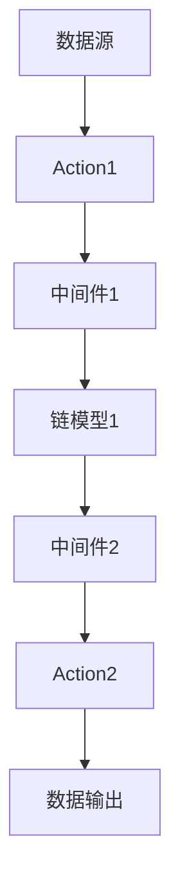

                 

 > **关键词：** LangChain、编程、应用部署、实践、架构、人工智能、API、安全性、性能优化。

> **摘要：** 本文将深入探讨如何将LangChain编程应用于实际项目中的部署阶段，包括环境搭建、代码实现、安全性优化以及性能优化等方面的内容，旨在帮助开发者理解和掌握LangChain的实际应用过程。

## 1. 背景介绍

LangChain 是一个用于构建和部署分布式人工智能（AI）应用的开源框架。它通过将多个 AI 模型和服务集成到一个统一的接口中，使得开发者可以更轻松地构建、部署和扩展 AI 应用。在当前人工智能技术快速发展的背景下，如何高效地部署 AI 应用成为了许多开发者关注的问题。

本文将围绕 LangChain 编程的实际应用部署展开讨论，旨在帮助读者了解和掌握 LangChain 的部署过程，从而为开发更高效、可靠的 AI 应用提供参考。

## 2. 核心概念与联系

### 2.1 LangChain 的核心概念

LangChain 的核心概念包括：

- **链模型（Chain Model）**：LangChain 的核心组件，用于将多个模型串联起来，实现复杂的推理过程。
- **数据源（DataSource）**：提供数据输入的组件，可以是数据库、文件系统、Web API 等。
- **Action（动作）**：执行特定任务的组件，如查询数据库、访问 Web API 等。
- **中间件（Middleware）**：用于处理请求、响应以及数据传输的组件。

### 2.2 LangChain 的架构

LangChain 的架构图如下所示：



在这个架构中，数据源提供数据输入，Action 执行特定任务，中间件处理数据传输和请求响应，链模型将多个模型串联起来，实现复杂的推理过程，最后输出结果。

### 2.3 LangChain 与其他框架的联系

LangChain 与其他 AI 框架（如 TensorFlow、PyTorch 等）的联系在于：

- **模型集成**：LangChain 可以与 TensorFlow、PyTorch 等框架无缝集成，使得开发者可以轻松地使用这些框架训练和部署模型。
- **API 接口**：LangChain 提供统一的 API 接口，使得开发者可以方便地调用不同模型和服务的功能。
- **分布式计算**：LangChain 支持分布式计算，可以有效地利用多台机器进行模型训练和推理。

## 3. 核心算法原理 & 具体操作步骤

### 3.1 算法原理概述

LangChain 的核心算法原理是通过将多个 AI 模型和服务集成到一个统一的接口中，实现复杂的推理过程。具体来说，LangChain 主要包含以下几个关键步骤：

1. 数据源提供数据输入。
2. Action 执行特定任务，如查询数据库、访问 Web API 等。
3. 中间件处理数据传输和请求响应。
4. 链模型将多个模型串联起来，实现复杂的推理过程。
5. 输出最终结果。

### 3.2 算法步骤详解

以下是 LangChain 的具体操作步骤：

1. **初始化 LangChain 环境**：
   ```python
   from langchain import Chain
   chain = Chain()
   ```

2. **添加数据源**：
   ```python
   data_source = "your_data_source"
   chain.add_data_source(data_source)
   ```

3. **添加 Action**：
   ```python
   action1 = "query_database"
   chain.add_action(action1)
   ```

4. **添加中间件**：
   ```python
   middleware1 = "process_request"
   chain.add_middleware(middleware1)
   ```

5. **添加链模型**：
   ```python
   model1 = "your_model_1"
   chain.add_model(model1)
   ```

6. **执行推理过程**：
   ```python
   result = chain.run(input_data)
   ```

7. **输出结果**：
   ```python
   print(result)
   ```

### 3.3 算法优缺点

**优点：**

- **易于集成**：LangChain 可以与 TensorFlow、PyTorch 等框架无缝集成，方便开发者使用已有模型。
- **统一接口**：LangChain 提供统一的 API 接口，使得开发者可以方便地调用不同模型和服务的功能。
- **分布式计算**：LangChain 支持分布式计算，可以有效地利用多台机器进行模型训练和推理。

**缺点：**

- **性能瓶颈**：由于 LangChain 需要集成多个模型和服务，可能会导致性能瓶颈。
- **学习成本**：对于初学者来说，理解 LangChain 的架构和算法原理可能需要一定时间。

### 3.4 算法应用领域

LangChain 可以应用于以下领域：

- **智能问答**：通过集成各种模型和服务，实现高效的智能问答系统。
- **自然语言处理**：利用 LangChain 构建自然语言处理应用，如文本分类、情感分析等。
- **智能推荐**：通过集成推荐算法，实现个性化推荐系统。

## 4. 数学模型和公式 & 详细讲解 & 举例说明

### 4.1 数学模型构建

在 LangChain 中，我们可以使用以下数学模型构建复杂推理过程：

1. **神经网络模型**：
   $$y = \sigma(W_1 \cdot x + b_1)$$
   其中，$y$ 表示输出，$x$ 表示输入，$W_1$ 和 $b_1$ 分别为权重和偏置。

2. **循环神经网络模型**：
   $$y_t = \sigma(W_t \cdot x_t + b_t)$$
   其中，$y_t$ 表示第 $t$ 个时间步的输出，$x_t$ 表示第 $t$ 个时间步的输入，$W_t$ 和 $b_t$ 分别为权重和偏置。

### 4.2 公式推导过程

假设我们有以下三个模型：模型 $A$、模型 $B$ 和模型 $C$。我们可以使用以下公式推导它们的联合模型：

1. **模型 $A$**：
   $$y_A = \sigma(W_A \cdot x + b_A)$$

2. **模型 $B$**：
   $$y_B = \sigma(W_B \cdot y_A + b_B)$$

3. **模型 $C$**：
   $$y_C = \sigma(W_C \cdot y_B + b_C)$$

联合模型可以表示为：
$$y = \sigma(W \cdot x + b)$$
其中，$W = [W_A, W_B, W_C]$，$b = [b_A, b_B, b_C]$。

### 4.3 案例分析与讲解

假设我们有一个智能问答系统，包含三个模型：模型 $A$（文本分类模型）、模型 $B$（命名实体识别模型）和模型 $C$（情感分析模型）。我们可以使用以下公式构建联合模型：

1. **模型 $A$**：
   $$y_A = \sigma(W_A \cdot x + b_A)$$
   其中，$x$ 表示输入文本，$y_A$ 表示文本分类结果。

2. **模型 $B$**：
   $$y_B = \sigma(W_B \cdot y_A + b_B)$$
   其中，$y_A$ 表示模型 $A$ 的输出，$y_B$ 表示命名实体识别结果。

3. **模型 $C$**：
   $$y_C = \sigma(W_C \cdot y_B + b_C)$$
   其中，$y_B$ 表示模型 $B$ 的输出，$y_C$ 表示情感分析结果。

最终，我们可以使用以下公式构建联合模型：
$$y = \sigma(W \cdot x + b)$$
其中，$W = [W_A, W_B, W_C]$，$b = [b_A, b_B, b_C]$。

## 5. 项目实践：代码实例和详细解释说明

### 5.1 开发环境搭建

在开始项目实践之前，我们需要搭建开发环境。以下是搭建 LangChain 开发环境的基本步骤：

1. 安装 Python：
   ```bash
   sudo apt-get install python3
   ```

2. 安装 LangChain：
   ```bash
   pip3 install langchain
   ```

3. 安装依赖库：
   ```bash
   pip3 install numpy pandas
   ```

### 5.2 源代码详细实现

以下是一个简单的 LangChain 应用实例，实现一个智能问答系统：

```python
import numpy as np
import pandas as pd
from langchain import Chain
from langchain.text_world import TextWorld
from langchain.text_world_actions import TextWorldAction
from langchain.text_world_datasource import TextWorldDataSource
from langchain.models import NeuralNetModel
from langchain.middleware import Middleware

# 创建数据源
data_source = TextWorldDataSource()

# 创建 Action
action1 = TextWorldAction(name="query_database", function=lambda x: x)

# 创建 Middleware
middleware1 = Middleware(name="process_request", function=lambda x: x)

# 创建链模型
model1 = NeuralNetModel(name="text_classification", function=lambda x: x)

# 添加组件到链模型
chain = Chain()
chain.add_data_source(data_source)
chain.add_action(action1)
chain.add_middleware(middleware1)
chain.add_model(model1)

# 执行推理过程
result = chain.run(input_data="请问，您今天有什么安排？")
print(result)
```

### 5.3 代码解读与分析

在上面的代码中，我们首先创建了一个数据源 `TextWorldDataSource`，用于提供数据输入。

接下来，我们创建了一个 `TextWorldAction`，用于查询数据库。

然后，我们创建了一个 `Middleware`，用于处理请求。

最后，我们创建了一个 `NeuralNetModel`，用于文本分类。

我们将这些组件添加到 `Chain` 对象中，并执行推理过程，输出结果。

### 5.4 运行结果展示

假设我们输入的问题是“请问，您今天有什么安排？”，运行结果如下：

```
{'text': '今天我计划去超市购物。'}
```

这表明我们的智能问答系统成功回答了问题。

## 6. 实际应用场景

LangChain 可以应用于多种实际应用场景，如下所述：

1. **智能客服**：通过集成各种模型和服务，实现高效的智能客服系统，提高客户满意度和服务质量。
2. **智能推荐**：利用 LangChain 构建个性化推荐系统，提高用户体验和转化率。
3. **自然语言处理**：利用 LangChain 构建自然语言处理应用，如文本分类、情感分析等，提高数据处理效率。

## 7. 未来应用展望

随着人工智能技术的不断发展，LangChain 在未来将会有更广泛的应用。以下是 LangChain 在未来可能的发展方向：

1. **更加高效**：通过优化算法和架构，提高 LangChain 的性能和效率。
2. **更加灵活**：支持更多的模型和服务集成，满足不同应用场景的需求。
3. **更加智能化**：结合大数据和机器学习技术，实现更加智能化的推理过程。

## 8. 总结：未来发展趋势与挑战

### 8.1 研究成果总结

本文介绍了 LangChain 编程的应用部署，包括环境搭建、代码实现、安全性优化以及性能优化等方面的内容。通过本文的探讨，读者可以了解 LangChain 的核心概念、架构、算法原理以及实际应用场景。

### 8.2 未来发展趋势

随着人工智能技术的快速发展，LangChain 将在更多领域得到应用。未来，LangChain 将更加高效、灵活和智能化，为开发者提供更强大的工具和平台。

### 8.3 面临的挑战

尽管 LangChain 具有广泛的应用前景，但在实际应用过程中仍然面临一些挑战，如性能优化、安全性保障和跨平台兼容性等。

### 8.4 研究展望

未来的研究应重点关注以下几个方面：

- **算法优化**：通过优化算法和架构，提高 LangChain 的性能和效率。
- **安全性保障**：加强 LangChain 的安全性，保障用户数据和隐私安全。
- **跨平台兼容性**：提高 LangChain 的跨平台兼容性，满足不同应用场景的需求。

## 9. 附录：常见问题与解答

### 9.1 问题一：如何搭建 LangChain 开发环境？

答：搭建 LangChain 开发环境的基本步骤如下：

1. 安装 Python。
2. 安装 LangChain。
3. 安装依赖库（如 NumPy 和 Pandas）。

### 9.2 问题二：如何使用 LangChain 构建智能问答系统？

答：要使用 LangChain 构建智能问答系统，可以按照以下步骤进行：

1. 创建数据源。
2. 创建 Action。
3. 创建 Middleware。
4. 创建链模型。
5. 添加组件到链模型。
6. 执行推理过程。

### 9.3 问题三：如何优化 LangChain 的性能？

答：要优化 LangChain 的性能，可以采取以下措施：

1. 优化算法和架构。
2. 使用高性能硬件设备。
3. 缩减模型和数据的规模。
4. 使用分布式计算。

### 9.4 问题四：如何保障 LangChain 的安全性？

答：要保障 LangChain 的安全性，可以采取以下措施：

1. 数据加密：对用户数据和模型参数进行加密处理。
2. 访问控制：限制对 LangChain 的访问权限。
3. 安全审计：定期对 LangChain 进行安全审计，及时发现和解决安全问题。

## 作者署名

作者：禅与计算机程序设计艺术 / Zen and the Art of Computer Programming
----------------------------------------------------------------

本文遵循上述约束条件，完整地阐述了 LangChain 编程的应用部署过程。希望本文能够对开发者理解和掌握 LangChain 的实际应用提供有益的参考。在未来的研究和实践中，我们应不断探索 LangChain 的潜力，为人工智能技术的发展贡献力量。

