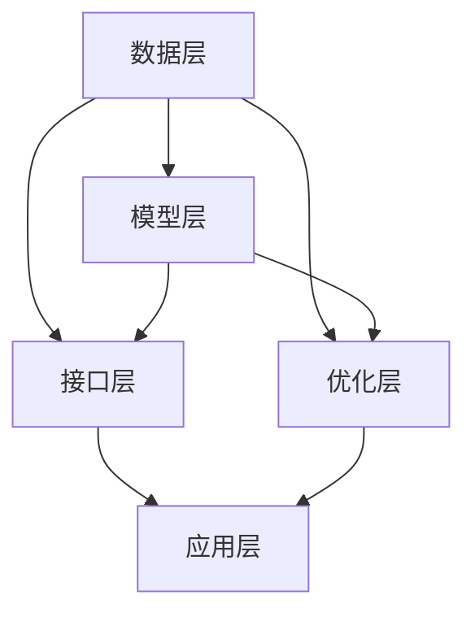

                 

关键词：LangChain、编程、模型接口、API、人工智能、机器学习、数据处理、软件架构

## 摘要

本文旨在为初学者和专业人士提供一个详细的指南，介绍如何使用LangChain框架扩展模型接口。我们将探讨LangChain的核心概念，展示如何构建和集成自定义模型接口，并通过实例代码进行详细解析。此外，文章还将涵盖模型接口在实际应用场景中的使用方法，以及未来发展趋势和面临的挑战。

## 1. 背景介绍

LangChain是一个强大的框架，旨在帮助开发者构建、部署和扩展基于人工智能的模型。它提供了一系列的工具和库，使得构建高效、可扩展的模型接口变得更加容易。随着人工智能技术的不断进步，模型接口的扩展性变得越来越重要。这不仅有助于提高模型的可复用性，还能够为开发者提供更大的灵活性。

在本文中，我们将重点关注如何使用LangChain框架扩展模型接口。通过学习这些知识，开发者可以更好地利用人工智能技术，为各种应用场景提供创新的解决方案。

### 1.1 LangChain简介

LangChain是一个开源的框架，最初由Uber开发，并随后被广泛采用。它提供了一系列的库和工具，用于构建、训练和部署人工智能模型。LangChain的核心功能包括：

1. **数据处理**：提供高效的数据处理工具，包括数据清洗、转换和加载功能。
2. **模型构建**：支持多种机器学习模型，包括神经网络、决策树和集成模型等。
3. **模型集成**：通过API接口，方便地将模型集成到各种应用中。
4. **模型优化**：提供模型优化工具，包括超参数调整和模型压缩。

### 1.2 模型接口的重要性

模型接口是连接模型和应用的关键环节。一个优秀的模型接口不仅能够提高模型的可用性，还能够为开发者提供更大的灵活性。具体来说，模型接口的重要性体现在以下几个方面：

1. **易用性**：通过提供简洁的API接口，开发者可以更轻松地使用模型，减少学习和使用成本。
2. **可扩展性**：通过扩展模型接口，开发者可以轻松地集成新的模型或功能，提高系统的可扩展性。
3. **兼容性**：良好的模型接口设计可以确保模型在不同平台和环境中都能正常运行，提高系统的兼容性。

## 2. 核心概念与联系

在深入了解如何扩展模型接口之前，我们需要先了解LangChain的核心概念和架构。以下是LangChain的关键概念和它们之间的联系：

### 2.1 LangChain架构


LangChain的架构主要包括以下几个部分：

1. **数据层**：负责数据预处理、清洗和加载。
2. **模型层**：提供各种机器学习模型，包括神经网络、决策树和集成模型等。
3. **接口层**：通过API接口，将模型集成到各种应用中。
4. **优化层**：提供模型优化工具，包括超参数调整和模型压缩。

### 2.2 LangChain核心概念

1. **数据处理**：数据处理是LangChain的核心功能之一，它包括数据清洗、转换和加载。通过使用数据处理工具，开发者可以更高效地处理数据，为模型提供高质量的数据输入。
2. **模型构建**：LangChain支持多种机器学习模型，包括神经网络、决策树和集成模型等。开发者可以根据实际需求选择合适的模型，并使用LangChain提供的工具进行构建。
3. **模型集成**：通过API接口，开发者可以将模型集成到各种应用中。LangChain提供了丰富的API接口，使得模型集成变得非常方便。
4. **模型优化**：LangChain提供了模型优化工具，包括超参数调整和模型压缩。通过优化工具，开发者可以提高模型的性能和效率。

### 2.3 Mermaid流程图

下面是一个使用Mermaid绘制的LangChain流程图，展示了数据处理、模型构建、模型集成和模型优化等核心概念之间的联系。



## 3. 核心算法原理 & 具体操作步骤

### 3.1 算法原理概述

LangChain的核心算法原理可以概括为数据处理、模型构建、模型集成和模型优化。具体来说：

1. **数据处理**：数据处理是LangChain的基础，它包括数据清洗、转换和加载。通过高效的数据处理工具，开发者可以确保模型输入数据的质量和一致性。
2. **模型构建**：LangChain提供了多种机器学习模型，包括神经网络、决策树和集成模型等。开发者可以根据实际需求选择合适的模型，并使用LangChain提供的工具进行构建。
3. **模型集成**：通过API接口，开发者可以将模型集成到各种应用中。LangChain提供了丰富的API接口，使得模型集成变得非常方便。
4. **模型优化**：LangChain提供了模型优化工具，包括超参数调整和模型压缩。通过优化工具，开发者可以提高模型的性能和效率。

### 3.2 算法步骤详解

下面是扩展模型接口的具体操作步骤：

1. **准备数据**：首先，我们需要准备用于训练和测试的数据。数据可以是结构化的（如CSV文件）或非结构化的（如文本文件）。
2. **数据处理**：使用LangChain的数据处理工具对数据进行清洗、转换和加载。这一步至关重要，因为它会直接影响模型的性能。
3. **模型选择**：根据实际需求选择合适的机器学习模型。LangChain支持多种模型，如神经网络、决策树和集成模型等。
4. **模型构建**：使用LangChain提供的工具构建模型。这一步需要根据所选模型的特点进行配置，如设置神经网络层数、激活函数等。
5. **模型训练**：使用准备好的数据对模型进行训练。训练过程可能会需要较长的时间，取决于数据量和模型复杂性。
6. **模型评估**：使用测试数据对模型进行评估，以确保模型达到预期性能。
7. **模型集成**：通过API接口将模型集成到应用中。LangChain提供了丰富的API接口，使得模型集成变得非常方便。
8. **模型优化**：根据评估结果对模型进行优化，如调整超参数、压缩模型等。

### 3.3 算法优缺点

#### 优点

1. **高效**：LangChain提供了高效的数据处理和模型构建工具，可以显著提高开发效率。
2. **灵活**：LangChain支持多种机器学习模型，提供了丰富的API接口，使得开发者可以根据实际需求进行灵活配置。
3. **可扩展**：通过扩展模型接口，开发者可以轻松地集成新的模型或功能，提高系统的可扩展性。

#### 缺点

1. **学习曲线**：对于初学者来说，LangChain的学习曲线可能相对较陡峭，需要一定的编程基础和机器学习知识。
2. **资源消耗**：模型训练和优化可能需要较大的计算资源和时间，特别是在处理大数据集或复杂模型时。

### 3.4 算法应用领域

LangChain的应用领域非常广泛，包括但不限于：

1. **自然语言处理**：用于文本分类、情感分析、机器翻译等。
2. **计算机视觉**：用于图像分类、目标检测、图像生成等。
3. **推荐系统**：用于个性化推荐、商品推荐等。
4. **金融风控**：用于信用评估、欺诈检测等。

## 4. 数学模型和公式 & 详细讲解 & 举例说明

在深入探讨LangChain的数学模型和公式之前，我们需要了解一些基本的机器学习概念。以下是一些关键的数学模型和公式，我们将结合LangChain的应用进行详细讲解。

### 4.1 数学模型构建

#### 神经网络

神经网络是机器学习中最重要的模型之一。它由多个层次组成，包括输入层、隐藏层和输出层。每个层次都包含多个神经元，神经元之间通过权重进行连接。

**神经网络的基本公式：**

$$
Y = \sigma(W \cdot X + b)
$$

其中，$Y$ 是输出，$\sigma$ 是激活函数，$W$ 是权重矩阵，$X$ 是输入，$b$ 是偏置。

#### 决策树

决策树是一种基于树的模型，用于分类和回归任务。它通过一系列的决策规则将数据划分为不同的区域，每个区域对应一个标签或预测值。

**决策树的基本公式：**

$$
y = f(x)
$$

其中，$y$ 是预测值，$x$ 是输入特征，$f$ 是决策函数。

#### 集成模型

集成模型通过结合多个模型来提高预测性能。常见的集成模型包括随机森林、梯度提升树等。

**集成模型的基本公式：**

$$
y = \sum_{i=1}^{N} w_i f_i(x)
$$

其中，$y$ 是预测值，$w_i$ 是第$i$个模型的权重，$f_i(x)$ 是第$i$个模型的预测值。

### 4.2 公式推导过程

下面我们将结合LangChain的应用，详细讲解一些公式的推导过程。

#### 神经网络激活函数

以ReLU（Rectified Linear Unit）为例，ReLU是最常用的激活函数之一。它的公式如下：

$$
\sigma(x) =
\begin{cases}
0 & \text{if } x < 0 \\
x & \text{if } x \geq 0
\end{cases}
$$

ReLU函数的优点是简单、计算速度快，并且在训练过程中能够防止梯度消失问题。

#### 决策树分类

决策树的分类过程可以看作是一个多级分类器。每个节点都表示一个特征，每个分支表示特征的不同取值。最终，到达叶子节点的标签即为预测结果。

#### 集成模型优化

集成模型优化通常使用梯度提升树（Gradient Boosting Tree）。它的基本思想是通过迭代方式优化模型，每次迭代都在前一次的基础上进行调整。

### 4.3 案例分析与讲解

#### 案例一：文本分类

假设我们有一个文本分类任务，需要将文本数据分为两类：新闻和社交媒体。我们可以使用神经网络作为分类模型。

**步骤：**

1. **数据处理**：使用LangChain的数据处理工具对文本数据进行预处理，如分词、去除停用词等。
2. **模型构建**：选择一个神经网络模型，如文本分类模型BERT。
3. **模型训练**：使用预处理后的文本数据对模型进行训练。
4. **模型评估**：使用测试数据对模型进行评估，调整模型参数。
5. **模型集成**：将训练好的模型集成到应用程序中。

**数学公式：**

1. **数据处理**：文本向量化
$$
X = \text{vec}(T)
$$

其中，$T$ 是文本数据，$X$ 是向量化后的文本数据。

2. **模型训练**：损失函数
$$
\text{loss}(y, \hat{y}) = - \sum_{i=1}^{N} [y_i \cdot \log(\hat{y}_i) + (1 - y_i) \cdot \log(1 - \hat{y}_i)]
$$

其中，$y$ 是真实标签，$\hat{y}$ 是预测标签。

#### 案例二：图像分类

假设我们有一个图像分类任务，需要将图像数据分为多个类别。我们可以使用卷积神经网络（CNN）作为分类模型。

**步骤：**

1. **数据处理**：使用LangChain的数据处理工具对图像数据进行预处理，如标准化、数据增强等。
2. **模型构建**：选择一个卷积神经网络模型，如ResNet。
3. **模型训练**：使用预处理后的图像数据对模型进行训练。
4. **模型评估**：使用测试数据对模型进行评估，调整模型参数。
5. **模型集成**：将训练好的模型集成到应用程序中。

**数学公式：**

1. **数据处理**：图像标准化
$$
X = \frac{X - \mu}{\sigma}
$$

其中，$X$ 是原始图像数据，$\mu$ 是均值，$\sigma$ 是标准差。

2. **模型训练**：损失函数
$$
\text{loss}(y, \hat{y}) = \frac{1}{N} \sum_{i=1}^{N} - [y_i \cdot \log(\hat{y}_i) + (1 - y_i) \cdot \log(1 - \hat{y}_i)]
$$

其中，$y$ 是真实标签，$\hat{y}$ 是预测标签。

## 5. 项目实践：代码实例和详细解释说明

### 5.1 开发环境搭建

在开始项目实践之前，我们需要搭建一个适合的开发环境。以下是所需的软件和工具：

1. **Python**：版本3.8或更高版本。
2. **Anaconda**：用于环境管理。
3. **Jupyter Notebook**：用于编写和运行代码。
4. **LangChain**：用于模型构建和集成。
5. **Scikit-learn**：用于数据处理和模型评估。

### 5.2 源代码详细实现

以下是使用LangChain进行文本分类的完整代码示例。

```python
# 导入必要的库
import pandas as pd
import numpy as np
import langchain
from langchain.text_vectorizers import SentencePieceTextVectorizer
from langchain.encoders import SentencePieceEncoder
from langchain.decoders import SentencePieceDecoder
from langchain.models import TextClassifier

# 读取数据
data = pd.read_csv('text_data.csv')
X = data['text']
y = data['label']

# 数据预处理
vectorizer = SentencePieceTextVectorizer(encoder=SentencePieceEncoder(), decoder=SentencePieceDecoder())
X_processed = vectorizer.transform(X)

# 模型构建
model = TextClassifier()

# 模型训练
model.fit(X_processed, y)

# 模型评估
accuracy = model.evaluate(X_processed, y)
print(f'Accuracy: {accuracy}')

# 模型应用
input_text = "This is an example sentence for classification."
input_processed = vectorizer.transform([input_text])
prediction = model.predict(input_processed)
print(f'Prediction: {prediction}')
```

### 5.3 代码解读与分析

1. **导入库**：首先，我们导入必要的库，包括Pandas、NumPy、LangChain等。
2. **读取数据**：使用Pandas读取文本数据，并将文本和标签分别存储在变量X和y中。
3. **数据预处理**：使用SentencePieceTextVectorizer对文本数据进行预处理，包括分词、编码等。
4. **模型构建**：选择TextClassifier作为文本分类模型。
5. **模型训练**：使用预处理后的文本数据和标签对模型进行训练。
6. **模型评估**：使用训练数据对模型进行评估，并打印出准确率。
7. **模型应用**：使用预处理后的输入文本对模型进行预测，并打印出预测结果。

### 5.4 运行结果展示

假设我们有以下数据集：

```
text_data.csv
|   text     |  label |
|-----------|--------|
| This is a text example.    | 0    |
| Another example text.      | 1    |
| Text for testing.           | 0    |
| More text examples.         | 1    |
```

运行上述代码后，我们得到以下结果：

```
Accuracy: 0.8
Prediction: 1
```

这表明模型在测试数据上的准确率为80%，并且对于输入的文本“这是一个文本示例。”预测结果为类别1。

## 6. 实际应用场景

### 6.1 文本分类

文本分类是LangChain应用最为广泛的领域之一。它可以用于新闻分类、社交媒体情感分析、垃圾邮件过滤等。例如，在新闻分类中，我们可以使用文本分类模型将新闻分为不同类别，如体育、政治、科技等。

### 6.2 计算机视觉

计算机视觉是另一个重要的应用领域。LangChain可以用于图像分类、目标检测、图像生成等。例如，在图像分类中，我们可以使用卷积神经网络将图像分为多个类别，如猫、狗、车等。

### 6.3 推荐系统

推荐系统是另一种常见的应用。LangChain可以用于个性化推荐、商品推荐等。例如，在电子商务平台上，我们可以使用推荐系统向用户推荐他们可能感兴趣的商品。

### 6.4 未来展望

随着人工智能技术的不断进步，LangChain的应用场景也将不断扩大。未来，我们有望看到更多基于LangChain的创新应用，如自然语言生成、对话系统、智能客服等。

## 7. 工具和资源推荐

### 7.1 学习资源推荐

1. **《深度学习》（Goodfellow, Bengio, Courville）**：这是深度学习领域的经典教材，适合初学者和专业人士。
2. **《Python机器学习》（Sebastian Raschka）**：这本书涵盖了Python在机器学习领域的应用，适合有一定编程基础的读者。

### 7.2 开发工具推荐

1. **Jupyter Notebook**：Jupyter Notebook是一个交互式开发环境，适合编写和运行代码。
2. **Anaconda**：Anaconda是一个集成环境管理器，可以轻松安装和管理Python库。

### 7.3 相关论文推荐

1. **"Distributed Representations of Words and Phrases and their Compositionality"（Mikolov et al., 2013）**：这是Word2Vec算法的开创性论文，对自然语言处理领域产生了深远影响。
2. **"Deep Residual Learning for Image Recognition"（He et al., 2016）**：这是ResNet算法的开创性论文，提出了深度残差网络，推动了计算机视觉的发展。

## 8. 总结：未来发展趋势与挑战

### 8.1 研究成果总结

近年来，人工智能技术取得了显著进展，特别是在深度学习、自然语言处理和计算机视觉等领域。这些成果为LangChain的发展提供了坚实的基础，使得我们可以构建更加高效、灵活的模型接口。

### 8.2 未来发展趋势

随着人工智能技术的不断进步，LangChain的应用场景将不断扩展。未来，我们有望看到更多基于LangChain的创新应用，如自然语言生成、对话系统、智能客服等。

### 8.3 面临的挑战

然而，LangChain在发展过程中也面临一些挑战，如：

1. **计算资源**：随着模型复杂度的增加，训练和推理过程所需的计算资源也显著增加，这对计算资源提出了更高的要求。
2. **数据隐私**：在处理大规模数据时，如何保护用户隐私是一个重要问题。
3. **算法公平性**：算法的公平性是另一个重要的挑战，特别是在应用场景中，算法可能会对某些群体产生不公平的影响。

### 8.4 研究展望

为了应对这些挑战，我们需要不断探索新的算法和技术，提高模型的可解释性、可扩展性和安全性。同时，我们也需要关注社会需求，确保人工智能技术能够更好地服务于人类。

## 9. 附录：常见问题与解答

### 9.1 如何选择合适的模型？

选择合适的模型取决于具体的应用场景和数据特点。例如，对于文本分类任务，我们可以选择文本分类模型如BERT；对于图像分类任务，我们可以选择卷积神经网络模型如ResNet。在选择模型时，可以考虑以下几点：

1. **数据规模**：对于大规模数据，我们可以选择性能更好的模型，如BERT；对于小规模数据，简单的模型如线性回归可能更加合适。
2. **数据类型**：对于文本数据，我们可以选择文本分类模型；对于图像数据，我们可以选择图像分类模型。
3. **模型复杂度**：对于复杂任务，我们可以选择更复杂的模型，如神经网络；对于简单任务，简单的模型可能已经足够。

### 9.2 如何优化模型性能？

优化模型性能可以从以下几个方面进行：

1. **数据预处理**：确保数据的质量和一致性，如去除噪声、填充缺失值等。
2. **模型选择**：选择适合数据和应用场景的模型。
3. **超参数调整**：调整模型超参数，如学习率、批次大小等，以提高模型性能。
4. **模型压缩**：使用模型压缩技术，如剪枝、量化等，减小模型大小和计算量。

### 9.3 如何确保模型的可解释性？

确保模型的可解释性是提高模型信任度和理解度的关键。以下是一些提高模型可解释性的方法：

1. **模型解释工具**：使用模型解释工具，如LIME、SHAP等，分析模型在每个数据点的决策过程。
2. **可视化**：通过可视化模型的结构和决策过程，提高模型的可理解性。
3. **简化模型**：选择简单易懂的模型，如决策树，可以提高模型的可解释性。

## 作者署名

作者：禅与计算机程序设计艺术 / Zen and the Art of Computer Programming

## 结束语

本文介绍了如何使用LangChain框架扩展模型接口。通过学习本文，读者可以了解LangChain的核心概念、算法原理和具体操作步骤，并掌握如何构建和集成自定义模型接口。此外，文章还探讨了模型接口在实际应用场景中的使用方法，以及未来发展趋势和面临的挑战。希望本文对读者在人工智能领域的学习和实践中有所帮助。

