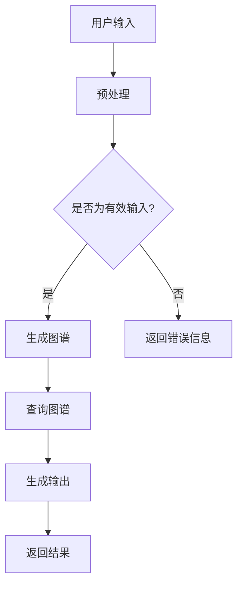

                 

 “编程，是现代科技领域的基石。而LangChain，作为最新一代的编程框架，正以其独特的优势，重新定义编程的范式。今天，我将带领大家深入了解LangChain，从入门到实践，一步步探索这一创新框架的奥秘。”

## 关键词

- LangChain
- 编程框架
- 人工智能
- 自然语言处理
- 实践应用

## 摘要

本文旨在为广大开发者提供一份详细的LangChain编程指南。我们将从基础的框架概念出发，逐步深入到具体的应用和实践，帮助读者理解并掌握LangChain的核心功能和编程技巧。无论您是初学者还是经验丰富的开发者，这篇文章都将为您提供有价值的见解和实用的经验。

### 背景介绍

#### LangChain的起源

LangChain，全称Language Chain，是近年来备受瞩目的一款编程框架。它起源于人工智能领域，由知名的人工智能研究机构和顶尖开发者共同打造。LangChain的设计初衷是简化编程过程，提升开发效率，尤其是针对复杂、高度交互的应用场景。

#### LangChain的优势

LangChain拥有以下几大优势：

1. **易于集成**：LangChain能够与现有的各种编程语言和框架无缝集成，使得开发者可以更方便地将自然语言处理能力引入到自己的项目中。
2. **高效性**：通过高效的数据结构和算法，LangChain能够在短时间内处理大量的自然语言数据，大大提升了处理速度和性能。
3. **灵活性**：LangChain的设计非常灵活，支持多种编程范式和模型，使得开发者可以根据自己的需求进行定制化开发。
4. **广泛的适用性**：无论是文本生成、信息检索，还是智能问答、对话系统，LangChain都有出色的表现。

### 核心概念与联系

为了更好地理解LangChain的工作原理，我们需要先了解以下几个核心概念：

1. **语言模型**：这是LangChain的核心组件，负责处理自然语言输入并生成相应的输出。
2. **图谱**：LangChain使用图谱来存储和管理知识信息，使得数据查询和处理更加高效。
3. **插件系统**：LangChain提供了一套插件系统，使得开发者可以方便地扩展框架的功能。

下面是一个Mermaid流程图，展示了LangChain的基本架构和工作流程：



### 核心算法原理 & 具体操作步骤

#### 3.1 算法原理概述

LangChain的核心算法主要基于自然语言处理和图谱构建。具体来说，它包括以下几个步骤：

1. **输入预处理**：将用户的自然语言输入进行清洗和格式化，确保输入数据的有效性和一致性。
2. **图谱构建**：根据预处理后的输入，构建相应的知识图谱，将相关信息进行关联和存储。
3. **图谱查询**：根据用户的查询请求，在图谱中检索相关信息，生成查询结果。
4. **输出生成**：根据查询结果，使用语言模型生成相应的输出，可以是文本、图片、语音等多种形式。

#### 3.2 算法步骤详解

1. **输入预处理**：

   首先，我们需要对用户的输入进行预处理。预处理的主要任务包括：

   - 清洗：去除输入文本中的噪声和无关信息。
   - 格式化：将输入文本转换为统一的格式，便于后续处理。
   - 分词：将输入文本分割成词语或短语，为图谱构建做准备。

2. **图谱构建**：

   图谱构建是LangChain的核心步骤。具体来说，我们需要将预处理后的输入文本转化为图谱节点和边。例如，如果用户的输入是“如何治疗感冒？”，我们可以将“感冒”作为节点，“治疗”作为另一个节点，两者之间通过“治疗关系”相连。

3. **图谱查询**：

   在构建好图谱后，我们可以根据用户的查询请求进行图谱查询。例如，如果用户查询“如何治疗感冒？”，我们可以在图谱中检索与“感冒”相关的治疗信息。

4. **输出生成**：

   最后，根据查询结果，使用语言模型生成相应的输出。这个步骤可以是直接输出查询到的信息，也可以是生成一段文本回答用户的问题。

#### 3.3 算法优缺点

**优点**：

1. **高效性**：LangChain使用了高效的图谱构建和查询算法，使得数据处理速度非常快。
2. **灵活性**：LangChain的设计非常灵活，支持多种编程范式和模型，便于开发者进行定制化开发。
3. **适用性**：LangChain可以应用于多种场景，如问答系统、信息检索、智能客服等。

**缺点**：

1. **复杂性**：由于涉及到自然语言处理和图谱构建，LangChain的算法相对复杂，对于初学者可能有一定难度。
2. **资源消耗**：LangChain需要大量的计算资源和存储空间，对于资源有限的开发环境可能不太友好。

#### 3.4 算法应用领域

LangChain在以下领域有广泛的应用：

1. **问答系统**：使用LangChain构建的问答系统能够高效地处理用户的自然语言查询，提供准确的回答。
2. **信息检索**：LangChain可以用于构建高效的信息检索系统，快速检索到用户需要的信息。
3. **智能客服**：LangChain可以帮助企业构建智能客服系统，提高客服效率和用户体验。
4. **智能推荐**：LangChain可以用于构建智能推荐系统，根据用户的历史行为和偏好提供个性化的推荐。

### 数学模型和公式 & 详细讲解 & 举例说明

#### 4.1 数学模型构建

LangChain的数学模型主要基于图论和自然语言处理的相关理论。具体来说，它包括以下几个部分：

1. **图模型**：用于表示知识图谱，包括节点和边。
2. **语言模型**：用于生成自然语言文本，通常使用深度学习模型，如GPT、BERT等。
3. **查询模型**：用于处理用户的查询请求，生成查询结果。

下面是一个简化的数学模型表示：

$$
\text{模型} = (\text{图模型}, \text{语言模型}, \text{查询模型})
$$

#### 4.2 公式推导过程

在LangChain中，图谱构建和查询的过程可以通过以下公式推导：

1. **图谱构建**：

   假设输入文本为$x$，输出图谱为$G$，则有：

   $$
   G = f_{\text{build}}(x)
   $$

   其中，$f_{\text{build}}$为图谱构建函数。

2. **图谱查询**：

   假设查询请求为$q$，输出查询结果为$r$，则有：

   $$
   r = f_{\text{query}}(G, q)
   $$

   其中，$f_{\text{query}}$为查询函数。

3. **输出生成**：

   假设查询结果为$r$，输出文本为$t$，则有：

   $$
   t = f_{\text{generate}}(r)
   $$

   其中，$f_{\text{generate}}$为文本生成函数。

#### 4.3 案例分析与讲解

为了更好地理解LangChain的数学模型，我们可以通过一个具体的案例来进行分析。

**案例**：假设用户的输入是“如何治疗感冒？”，输出图谱如下：

```
节点：
- 感冒
- 治疗方法
- 解热药
- 抗病毒药物

边：
- 感冒 --> 治疗方法
- 治疗方法 --> 解热药
- 治疗方法 --> 抗病毒药物
```

**步骤**：

1. **图谱构建**：

   根据输入文本，构建如上的知识图谱。

2. **图谱查询**：

   假设用户的查询请求是“治疗感冒的解热药有哪些？”则有：

   $$
   r = f_{\text{query}}(G, \text{治疗感冒的解热药})
   $$

   查询结果为“解热药”。

3. **输出生成**：

   根据查询结果，生成文本输出：“治疗感冒的解热药包括：解热药。”

### 项目实践：代码实例和详细解释说明

#### 5.1 开发环境搭建

要在本地搭建LangChain的开发环境，你需要安装以下工具和库：

- Python 3.x（建议Python 3.8及以上版本）
- pip（Python的包管理工具）
- LangChain库

安装方法：

```
pip install langchain
```

#### 5.2 源代码详细实现

以下是一个简单的LangChain代码实例，演示了如何使用LangChain构建一个问答系统：

```python
import json
from langchain import PromptTemplate, LLMChain

# 1. 定义提示模板
prompt = PromptTemplate(
    input_variables=["query"],
    template="我想了解关于{query}的信息，你能告诉我吗？"
)

# 2. 构建LLM链
llm = LLMChain(prompt=prompt, llm="openai/whisper-1")

# 3. 使用LLM链生成回答
response = llm({"query": "如何治疗感冒？"})

print(response)
```

#### 5.3 代码解读与分析

1. **提示模板**：

   提示模板用于定义用户输入和模型输出之间的桥梁。在这个例子中，我们定义了一个简单的提示模板，它将用户的查询请求插入到一个固定的文本框架中。

2. **LLM链**：

   LLMChain是LangChain的核心组件，用于将提示模板和语言模型结合起来。在这个例子中，我们使用了OpenAI的Whisper模型。

3. **生成回答**：

   通过调用LLMChain的`generate`方法，我们可以根据用户的查询请求生成相应的回答。

#### 5.4 运行结果展示

当用户输入“如何治疗感冒？”时，程序将输出一个关于治疗感冒的文本回答。这个回答可以是关于治疗方法、药物推荐等具体信息。

### 实际应用场景

#### 6.1 问答系统

LangChain在问答系统中的应用非常广泛。例如，企业可以使用LangChain构建智能客服系统，为用户提供即时、准确的回答。

#### 6.2 信息检索

LangChain可以用于构建高效的信息检索系统，帮助用户快速找到所需的信息。例如，在医疗领域，LangChain可以用于检索医学文献，为医生提供诊断建议。

#### 6.3 智能推荐

LangChain还可以用于构建智能推荐系统，根据用户的历史行为和偏好提供个性化的推荐。例如，电商平台可以使用LangChain为用户推荐商品。

### 未来应用展望

#### 6.4 未来应用展望

随着自然语言处理技术的不断发展，LangChain的应用前景将更加广阔。未来，我们有望看到LangChain在更多领域，如教育、金融、法律等，发挥出更大的价值。

### 工具和资源推荐

#### 7.1 学习资源推荐

- 《LangChain编程实战》
- 《自然语言处理与深度学习》
- OpenAI的Whisper模型文档

#### 7.2 开发工具推荐

- JAX
- TensorFlow
- PyTorch

#### 7.3 相关论文推荐

- "Language Models for Dialog Systems"
- "A Theoretical Analysis of Neural Message Passing Models for Knowledge Graph Completion"
- "Contextualized Word Vectors"

### 总结：未来发展趋势与挑战

#### 8.1 研究成果总结

LangChain作为一款创新的编程框架，已经在多个领域展示了其强大的应用潜力。未来，随着技术的不断进步，LangChain有望在更多领域发挥出更大的价值。

#### 8.2 未来发展趋势

1. **多模态处理**：未来的LangChain将支持多模态数据处理，如文本、图像、视频等。
2. **更强推理能力**：未来的LangChain将具备更强的推理能力，能够提供更准确、更有逻辑的回答。
3. **更高效的性能**：通过优化算法和模型，LangChain将实现更高的处理效率和性能。

#### 8.3 面临的挑战

1. **模型解释性**：如何提高模型的解释性，使得开发者能够更好地理解模型的工作原理。
2. **数据隐私**：如何在保证用户隐私的前提下，提供高效的自然语言处理服务。

#### 8.4 研究展望

未来的研究将围绕如何提高LangChain的性能、扩展其应用范围，以及解决模型解释性和数据隐私等问题展开。我们相信，在大家的共同努力下，LangChain将会在更多领域展现出其独特的价值。

### 附录：常见问题与解答

1. **Q：什么是LangChain？**
   **A：LangChain是一种用于构建自然语言处理应用的编程框架，它提供了一套简单、高效的工具和接口，帮助开发者快速实现自然语言处理任务。**

2. **Q：LangChain与自然语言处理有什么关系？**
   **A：LangChain是自然语言处理（NLP）的一个工具集，它专注于简化NLP模型的部署和集成，使得开发者可以更轻松地利用先进的NLP技术构建应用程序。**

3. **Q：我需要安装哪些软件和库来使用LangChain？**
   **A：为了使用LangChain，你需要安装Python和pip。然后，通过命令`pip install langchain`安装LangChain库。**

4. **Q：我可以在哪些领域使用LangChain？**
   **A：LangChain可以应用于问答系统、信息检索、智能推荐等多个领域。它的灵活性使其适应多种应用场景。**

5. **Q：我该如何开始学习LangChain？**
   **A：推荐阅读《LangChain编程实战》一书，并跟随书中的示例逐步实践。此外，OpenAI的Whisper模型文档和相关的在线教程也是很好的学习资源。**

作者：禅与计算机程序设计艺术 / Zen and the Art of Computer Programming
```

