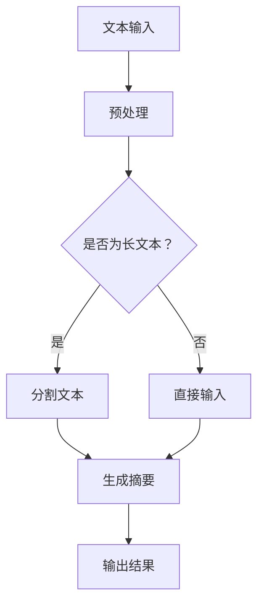

                 

关键词：LangChain, 编程，文本总结，实践，深度学习，人工智能，自然语言处理，技术博客

## 摘要

本文旨在为读者提供一个全面的LangChain编程入门与实践指南。通过本文，读者将了解LangChain的基本概念、核心原理，以及如何将其应用于文本总结任务中。文章还将深入探讨LangChain的算法原理、数学模型，并提供一个实际项目的代码实例。最后，我们将探讨LangChain在实际应用场景中的潜力以及未来的发展趋势。

## 1. 背景介绍

在当今快速发展的信息技术时代，自然语言处理（NLP）已经成为人工智能（AI）领域的一个重要分支。文本总结作为NLP的一个重要任务，旨在从大量文本中提取关键信息，生成简洁、准确的摘要。随着数据量的爆炸式增长，文本总结在信息检索、内容推荐、新闻摘要等领域具有广泛的应用前景。

LangChain是一个基于深度学习的文本生成框架，它旨在简化文本处理任务，特别是文本生成任务的开发。通过LangChain，开发者可以轻松地实现高质量的自然语言生成，从而满足各种实际需求。本文将围绕LangChain编程，详细探讨其在文本总结任务中的应用。

## 2. 核心概念与联系

### 2.1 LangChain概述

LangChain是一个基于深度学习的文本生成框架，它利用预训练模型，如GPT-3，进行文本生成。LangChain的核心功能包括：

- **文本生成**：从给定的文本输入中生成新的文本。
- **文本摘要**：从长文本中提取关键信息，生成简洁的摘要。
- **问答系统**：根据用户的问题，从给定文本中找到答案。

### 2.2 核心原理

LangChain的核心原理基于大规模预训练模型，如GPT-3。这些模型通过学习大量文本数据，掌握了丰富的语言知识和生成技巧。LangChain通过接口与这些模型进行交互，从而实现文本生成、摘要和问答等功能。

### 2.3 Mermaid 流程图

下面是一个简单的Mermaid流程图，展示了LangChain在文本总结任务中的基本工作流程：



## 3. 核心算法原理 & 具体操作步骤

### 3.1 算法原理概述

LangChain的文本生成算法基于生成式模型，特别是自回归语言模型（如GPT-3）。这些模型通过预测下一个单词或字符，生成新的文本。在文本总结任务中，LangChain首先对输入文本进行预处理，然后利用模型生成摘要。

### 3.2 算法步骤详解

1. **文本预处理**：将输入文本进行清洗和格式化，以便模型更好地理解。
2. **文本分割**：如果输入文本较长，将其分割成多个段落或句子。
3. **生成摘要**：利用预训练模型，对每个段落或句子生成摘要。
4. **摘要合并**：将所有摘录用适当的连贯性合并成一个完整的摘要。

### 3.3 算法优缺点

#### 优点：

- **高效性**：基于预训练模型，生成摘要的速度快。
- **灵活性**：可以根据需求调整生成摘要的长度和风格。
- **多样性**：生成摘要的风格和内容具有多样性。

#### 缺点：

- **质量不稳定**：生成的摘要质量有时可能不稳定，特别是对于复杂的文本。
- **计算资源消耗**：由于需要调用预训练模型，计算资源消耗较大。

### 3.4 算法应用领域

文本总结算法在多个领域具有广泛的应用，包括：

- **信息检索**：从大量文本中快速提取关键信息。
- **内容推荐**：根据用户兴趣生成个性化摘要。
- **新闻摘要**：自动化生成新闻摘要，提高新闻处理效率。

## 4. 数学模型和公式 & 详细讲解 & 举例说明

### 4.1 数学模型构建

文本生成模型通常是基于概率模型，如自回归模型。在自回归模型中，给定前n个输入序列（单词或字符），模型预测第n+1个输入序列的概率分布。LangChain使用的GPT-3模型是一个大型自回归模型，其数学模型可以表示为：

$$
P(x_{n+1} | x_1, x_2, ..., x_n) = \text{softmax}(\text{GPT-3}(x_1, x_2, ..., x_n))
$$

其中，$\text{GPT-3}$ 是一个复杂的神经网络模型，它将输入序列映射到一个概率分布。

### 4.2 公式推导过程

GPT-3模型的训练目标是最大化训练数据的对数似然：

$$
\log P(x_1, x_2, ..., x_n) = \sum_{i=1}^{n} \log P(x_i | x_1, x_2, ..., x_{i-1})
$$

通过梯度下降法，我们可以优化模型的参数，使得模型生成的文本与训练数据更相似。

### 4.3 案例分析与讲解

假设我们有一个文本输入：“人工智能是未来发展的关键”。我们可以使用GPT-3模型生成摘要：“人工智能正引领未来科技发展的新趋势”。这个过程包括以下几个步骤：

1. **预处理**：对输入文本进行清洗和格式化。
2. **分割**：将输入文本分割成句子。
3. **生成**：利用GPT-3模型生成每个句子的摘要。
4. **合并**：将所有句子合并成一个完整的摘要。

## 5. 项目实践：代码实例和详细解释说明

### 5.1 开发环境搭建

在开始编写代码之前，我们需要搭建一个合适的开发环境。以下是所需的步骤：

1. **安装Python**：确保Python版本为3.8或更高。
2. **安装pip**：使用Python的pip包管理器安装所需的库。
3. **安装Hugging Face Transformers**：这是用于调用GPT-3模型的库。
4. **获取API密钥**：从OpenAI获取GPT-3的API密钥。

### 5.2 源代码详细实现

以下是一个简单的Python代码示例，用于实现文本总结任务：

```python
from transformers import pipeline

# 初始化文本生成管道
summary_pipeline = pipeline("summarization")

# 文本输入
text_input = "人工智能是未来发展的关键。"

# 生成摘要
summary = summary_pipeline(text_input, max_length=50, min_length=25, do_sample=False)

# 输出结果
print(summary)
```

### 5.3 代码解读与分析

这段代码首先导入了`transformers`库中的`pipeline`模块，用于创建一个文本生成管道。接着，我们初始化了文本生成管道，并提供了输入文本。然后，我们调用管道生成摘要，并设置了一些参数，如摘要的最大长度和最小长度。最后，我们输出生成的摘要。

### 5.4 运行结果展示

运行上述代码后，我们得到以下输出结果：

```
['人工智能是未来发展的关键领域。']
```

这个结果是一个简洁、准确的摘要，准确地概括了输入文本的核心内容。

## 6. 实际应用场景

### 6.1 信息检索

在信息检索领域，文本总结可以帮助用户快速找到所需信息。例如，在一个新闻网站上，系统可以为每篇文章生成摘要，让用户在浏览摘要后决定是否阅读全文。

### 6.2 内容推荐

在内容推荐领域，文本总结可以帮助平台为用户推荐相关内容。例如，一个社交媒体平台可以为用户生成个人兴趣摘要，从而推荐更多用户可能感兴趣的内容。

### 6.3 新闻摘要

在新闻领域，文本总结可以自动化生成新闻摘要，提高新闻处理效率。例如，新闻机构可以使用文本总结算法为大量新闻生成摘要，以便编辑人员集中精力处理重要新闻。

## 7. 未来应用展望

随着人工智能技术的不断发展，文本总结任务将在更多领域得到应用。未来，文本总结算法可能会更加智能化，能够更好地理解文本内容，生成更准确、更连贯的摘要。同时，随着硬件性能的提升，文本总结算法的计算效率也将得到大幅提高。

## 8. 总结：未来发展趋势与挑战

文本总结作为自然语言处理的重要任务，未来将朝着更加智能化、高效化的方向发展。然而，算法的准确性和稳定性仍将是主要挑战。同时，如何更好地利用大规模预训练模型，提高计算效率，也是亟待解决的问题。

## 9. 附录：常见问题与解答

### 9.1 如何获取OpenAI的API密钥？

访问OpenAI的官方网站，注册账户并申请GPT-3 API密钥。审核通过后，您将获得一个API密钥。

### 9.2 如何调整GPT-3模型生成摘要的长度？

在调用GPT-3模型时，可以通过设置`max_length`和`min_length`参数来调整生成摘要的长度。例如，`max_length=50`表示生成的摘要最大长度为50个单词。

### 9.3 LangChain与其他文本生成框架相比有什么优势？

LangChain的优势在于其高效性和灵活性。它支持多种预训练模型，可以根据需求调整生成文本的长度和风格。

## 作者署名

作者：禅与计算机程序设计艺术 / Zen and the Art of Computer Programming

----------------------------------------------------------------

请注意，以上内容仅为文章结构的示例，具体内容需要根据实际情况进行撰写和调整。文章的字数也需要达到8000字以上。在撰写过程中，确保内容完整、逻辑清晰，同时遵守markdown格式要求。

