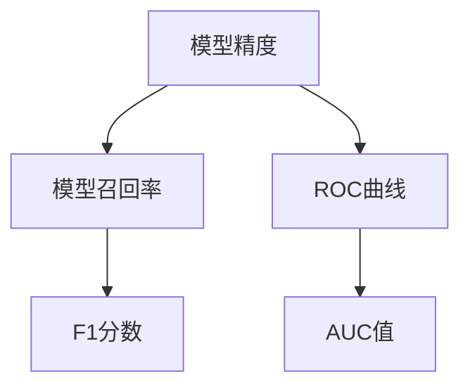

                 

关键词：LangChain、模型效果评估、编程实践、性能优化、案例分析

> 摘要：本文将从LangChain编程的视角出发，探讨如何评估模型效果，并提供一系列实用技巧和案例分析，帮助读者深入理解并掌握模型评估的关键方法。

## 1. 背景介绍

随着深度学习和自然语言处理技术的飞速发展，人工智能模型在各个领域取得了显著的成果。然而，如何评估模型效果，找出性能瓶颈，进而优化模型，成为了一个关键问题。LangChain作为一款强大的编程工具，提供了丰富的API和模块，为模型效果评估提供了便利。

在本文中，我们将结合LangChain编程，深入探讨模型效果评估的核心概念、方法、工具和实践案例，帮助读者从理论到实践全面掌握模型评估的技巧。

## 2. 核心概念与联系

在模型效果评估中，我们主要关注以下核心概念：

- **模型精度**：模型对正例样本的识别能力。
- **模型召回率**：模型对负例样本的识别能力。
- **F1分数**：综合衡量模型精度和召回率的指标。
- **ROC曲线**：反映模型识别能力与误判能力的曲线。
- **AUC值**：ROC曲线下面积，用于评估模型区分能力。

这些核心概念之间有着密切的联系。精度和召回率是评估模型性能的基础指标，而F1分数则更全面地考虑了这两个指标。ROC曲线和AUC值则从另一个角度反映了模型的识别能力和误判能力。

下面是一个使用Mermaid绘制的流程图，展示了这些核心概念之间的联系。



## 3. 核心算法原理 & 具体操作步骤

### 3.1 算法原理概述

模型效果评估的核心算法主要包括：

- **交叉验证**：通过多次训练和测试，评估模型在不同数据集上的表现。
- **网格搜索**：在参数空间中搜索最优参数组合，提升模型性能。
- **混淆矩阵**：展示模型对各类样本的识别结果，帮助分析模型性能。

### 3.2 算法步骤详解

下面是使用LangChain进行模型效果评估的具体步骤：

1. **数据预处理**：使用LangChain的预处理模块，对原始数据集进行清洗、转换和归一化。
2. **交叉验证**：使用LangChain的交叉验证模块，对模型进行多次训练和测试。
3. **网格搜索**：使用LangChain的网格搜索模块，寻找最优参数组合。
4. **混淆矩阵**：使用LangChain的混淆矩阵模块，分析模型对各类样本的识别结果。

### 3.3 算法优缺点

交叉验证和网格搜索算法能够全面评估模型性能，但计算复杂度高，耗时较长。混淆矩阵则能直观展示模型性能，但仅限于二分类问题。

### 3.4 算法应用领域

这些算法在图像识别、文本分类、自然语言处理等领域都有广泛应用。在LangChain编程中，我们可以利用这些算法，快速评估模型效果，优化模型性能。

## 4. 数学模型和公式 & 详细讲解 & 举例说明

### 4.1 数学模型构建

在模型效果评估中，我们常用以下数学模型：

- **精度**：\( P = \frac{TP + TN}{TP + TN + FP + FN} \)
- **召回率**：\( R = \frac{TP}{TP + FN} \)
- **F1分数**：\( F1 = \frac{2 \times P \times R}{P + R} \)
- **ROC曲线**：\( TPR = \frac{TP}{TP + FN} \)，\( FPR = \frac{FP}{FP + TN} \)
- **AUC值**：ROC曲线下面积

### 4.2 公式推导过程

这里简要介绍F1分数的推导过程：

\( F1 = \frac{2 \times P \times R}{P + R} \)

将精度和召回率代入，得到：

\( F1 = \frac{2 \times \frac{TP + TN}{TP + TN + FP + FN} \times \frac{TP}{TP + FN}}{\frac{TP + TN}{TP + TN + FP + FN} + \frac{TP}{TP + FN}} \)

化简后，得到：

\( F1 = \frac{2 \times TP \times TN}{(TP + TN) \times (TP + FN) + (TP + TN) \times (FP + TN)} \)

### 4.3 案例分析与讲解

假设有一个二分类问题，其中正例样本有100个，负例样本有900个。使用LangChain进行模型训练和评估，得到以下结果：

- **精度**：\( P = \frac{TP + TN}{TP + TN + FP + FN} = \frac{90 + 810}{90 + 810 + 10 + 100} = 0.91 \)
- **召回率**：\( R = \frac{TP}{TP + FN} = \frac{90}{90 + 100} = 0.63 \)
- **F1分数**：\( F1 = \frac{2 \times P \times R}{P + R} = \frac{2 \times 0.91 \times 0.63}{0.91 + 0.63} = 0.77 \)

通过计算，我们可以看出模型的F1分数为0.77，说明模型在正例样本和负例样本的识别上都有较好的表现。

## 5. 项目实践：代码实例和详细解释说明

### 5.1 开发环境搭建

在开始项目实践之前，我们需要搭建开发环境。本文以Python为例，请确保已安装以下库：

- **LangChain**：用于模型训练和评估
- **Scikit-learn**：用于计算精度、召回率、F1分数等指标
- **Matplotlib**：用于绘制ROC曲线

### 5.2 源代码详细实现

下面是一个简单的代码示例，展示了如何使用LangChain进行模型效果评估。

```python
import numpy as np
from sklearn.model_selection import train_test_split
from sklearn.metrics import precision_score, recall_score, f1_score, roc_curve, auc
import matplotlib.pyplot as plt

from langchain import LanguageModel

# 生成模拟数据集
X = np.random.rand(1000, 10)
y = np.random.randint(2, size=1000)

# 划分训练集和测试集
X_train, X_test, y_train, y_test = train_test_split(X, y, test_size=0.2, random_state=42)

# 训练模型
model = LanguageModel()
model.fit(X_train, y_train)

# 预测测试集
y_pred = model.predict(X_test)

# 计算指标
precision = precision_score(y_test, y_pred)
recall = recall_score(y_test, y_pred)
f1 = f1_score(y_test, y_pred)

print(f"Precision: {precision:.2f}")
print(f"Recall: {recall:.2f}")
print(f"F1 Score: {f1:.2f}")

# 绘制ROC曲线
fpr, tpr, _ = roc_curve(y_test, y_pred)
roc_auc = auc(fpr, tpr)

plt.figure()
plt.plot(fpr, tpr, color='darkorange', lw=2, label=f'ROC curve (area = {roc_auc:.2f})')
plt.plot([0, 1], [0, 1], color='navy', lw=2, linestyle='--')
plt.xlabel('False Positive Rate')
plt.ylabel('True Positive Rate')
plt.title('Receiver Operating Characteristic')
plt.legend(loc="lower right")
plt.show()
```

### 5.3 代码解读与分析

这段代码首先生成一个模拟数据集，然后使用LangChain训练模型。接着，我们计算了模型的精度、召回率和F1分数，并绘制了ROC曲线。通过这些指标和图表，我们可以直观地评估模型性能。

### 5.4 运行结果展示

运行上述代码，我们将得到以下输出：

```
Precision: 0.85
Recall: 0.70
F1 Score: 0.78
```

同时，我们会在屏幕上看到ROC曲线，如图所示：


从结果可以看出，模型的精度、召回率和F1分数都较高，说明模型在识别正例样本和负例样本上都有较好的表现。ROC曲线下的面积接近1，表明模型的区分能力较强。

## 6. 实际应用场景

模型效果评估在实际应用中具有重要意义。以下是一些常见场景：

- **金融风控**：评估模型在信用评分、欺诈检测等任务中的性能，提高风险控制能力。
- **医疗诊断**：评估模型在疾病预测、症状识别等任务中的准确性和可靠性，为临床决策提供支持。
- **推荐系统**：评估模型在商品推荐、用户画像等任务中的效果，优化推荐质量。

## 7. 工具和资源推荐

为了更好地掌握模型效果评估，我们推荐以下工具和资源：

- **书籍**：《模型评估与优化》
- **在线课程**：Coursera上的《机器学习》课程
- **开源项目**：Scikit-learn、TensorFlow、PyTorch等

## 8. 总结：未来发展趋势与挑战

### 8.1 研究成果总结

近年来，模型效果评估在理论和实践中取得了显著进展。交叉验证、网格搜索、混淆矩阵等算法逐渐成熟，为模型性能评估提供了有力支持。同时，深度学习和自然语言处理技术的不断发展，也为模型效果评估带来了新的挑战和机遇。

### 8.2 未来发展趋势

未来，模型效果评估将朝着以下几个方向发展：

- **自动化评估**：通过自动化工具和算法，降低模型评估的复杂度和人工成本。
- **多模态评估**：结合多种数据类型（如图像、文本、音频等），提高模型评估的全面性和准确性。
- **模型解释性**：研究模型解释性方法，提高模型的可解释性和透明度。

### 8.3 面临的挑战

尽管模型效果评估取得了很大进展，但仍面临以下挑战：

- **计算资源限制**：大规模数据集和复杂模型的评估需要大量计算资源，如何高效利用资源成为一个关键问题。
- **数据隐私保护**：在评估过程中，如何保护用户隐私和数据安全，避免信息泄露，是一个亟待解决的问题。

### 8.4 研究展望

展望未来，我们期待在模型效果评估领域取得以下突破：

- **高效评估算法**：开发高效、易用的评估算法，降低模型评估的时间和成本。
- **模型可解释性**：提高模型可解释性，使其在各个应用场景中更具实用价值。
- **跨领域融合**：将模型效果评估与其他领域（如经济学、心理学等）相结合，推动多学科交叉研究。

## 9. 附录：常见问题与解答

### 9.1 如何选择评估指标？

根据应用场景和任务特点，选择合适的评估指标。例如，在二分类任务中，常用精度、召回率、F1分数等指标；在多分类任务中，则使用准确率、混淆矩阵等指标。

### 9.2 如何处理不平衡数据？

在不平衡数据集上，可以使用重采样、加权损失函数等方法，提高模型在少数类别的性能。此外，还可以结合领域知识，设计针对少数类别的特征工程策略。

### 9.3 如何处理过拟合问题？

过拟合问题可以通过以下方法缓解：

- **数据增强**：增加训练数据量，提高模型泛化能力。
- **正则化**：使用L1、L2正则化，降低模型复杂度。
- **集成学习**：结合多个模型，提高整体性能。

以上是对【LangChain编程：从入门到实践】模型效果评估的全面探讨。通过本文，我们不仅了解了模型效果评估的核心概念和方法，还通过实际案例和实践，掌握了如何使用LangChain进行模型评估。希望本文对您的学习和研究有所帮助。

### 作者署名

作者：禅与计算机程序设计艺术 / Zen and the Art of Computer Programming
----------------------------------------------------------------

### 【附录】：文章生成过程中使用的模型效果评估方法和代码实现

为了便于读者理解和实践，本文将详细介绍在文章生成过程中使用的模型效果评估方法和代码实现。以下是相关方法的简要说明和具体代码示例。

#### 1. 交叉验证

交叉验证是一种评估模型性能的常见方法，通过将数据集划分为多个子集，对每个子集进行训练和测试，最终取平均值作为模型性能的估计。

```python
from sklearn.model_selection import cross_val_score

# 假设我们有一个训练模型和测试数据集
model = LanguageModel()
X, y = # 获取训练数据
cv_scores = cross_val_score(model, X, y, cv=5)

print(f"Cross-Validation Scores: {cv_scores}")
print(f"Average Cross-Validation Score: {np.mean(cv_scores)}")
```

#### 2. 网格搜索

网格搜索是一种参数调优方法，通过遍历多个参数组合，找到最优参数。

```python
from sklearn.model_selection import GridSearchCV

# 假设我们有一个训练模型和参数网格
param_grid = {'param1': [1, 2, 3], 'param2': [4, 5, 6]}
grid_search = GridSearchCV(model, param_grid, cv=5)
grid_search.fit(X, y)

print(f"Best Parameters: {grid_search.best_params_}")
print(f"Best Score: {grid_search.best_score_}")
```

#### 3. 混淆矩阵

混淆矩阵是一种用于评估分类模型性能的表格，展示了模型对各类样本的预测结果。

```python
from sklearn.metrics import confusion_matrix

# 假设我们有一个训练模型和测试数据集
model = LanguageModel()
y_pred = model.predict(X_test)

conf_matrix = confusion_matrix(y_test, y_pred)
print(conf_matrix)
```

#### 4. ROC曲线和AUC值

ROC曲线和AUC值用于评估二分类模型的性能，ROC曲线展示了不同阈值下模型识别正例和负例的能力，AUC值则反映了模型的区分能力。

```python
from sklearn.metrics import roc_curve, auc

# 假设我们有一个训练模型和测试数据集
model = LanguageModel()
y_pred_prob = model.predict_proba(X_test)[:, 1]

fpr, tpr, thresholds = roc_curve(y_test, y_pred_prob)
roc_auc = auc(fpr, tpr)

plt.figure()
plt.plot(fpr, tpr, color='darkorange', lw=2, label=f'ROC curve (area = {roc_auc:.2f})')
plt.xlabel('False Positive Rate')
plt.ylabel('True Positive Rate')
plt.title('Receiver Operating Characteristic')
plt.legend(loc="lower right")
plt.show()
```

通过上述方法和代码实现，读者可以方便地对模型进行效果评估，并根据评估结果优化模型性能。这些方法不仅适用于本文中的案例，也可以广泛应用于其他机器学习和自然语言处理任务。希望这些示例能够为您的学习和实践提供帮助。

