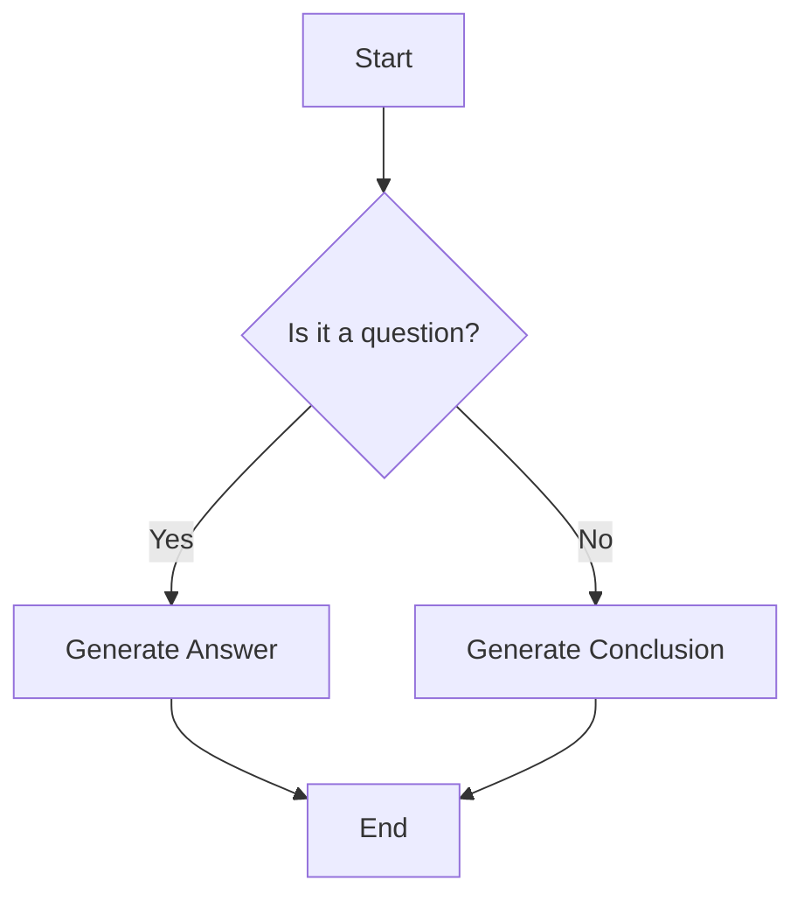
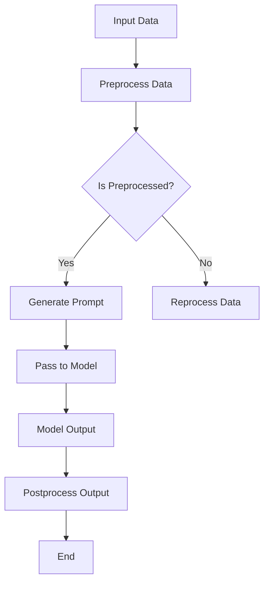

                 

 作为一位世界级人工智能专家，我深知在深度学习和自然语言处理领域，基础概念的理解与应用至关重要。本文将探讨如何利用 LangChain 编程框架，自定义提示模板，为人工智能模型提供更精准的输入指导，从而提升模型的性能和泛化能力。通过本文的学习，您将掌握 LangChain 的核心概念，学会如何构建和优化自定义提示模板，为未来的项目实践打下坚实基础。

## 关键词

- LangChain
- 提示模板
- 自定义编程
- 自然语言处理
- 人工智能模型优化

## 摘要

本文旨在介绍如何使用 LangChain 编程框架构建和优化自定义提示模板。我们将深入探讨 LangChain 的核心概念，通过实际案例讲解如何自定义提示模板，提升人工智能模型的性能和泛化能力。文章将分为以下章节：

1. 背景介绍
2. 核心概念与联系
3. 核心算法原理与操作步骤
4. 数学模型与公式
5. 项目实践：代码实例
6. 实际应用场景
7. 工具和资源推荐
8. 总结：未来发展趋势与挑战

希望通过本文，您能够更好地理解和应用 LangChain 编程框架，为人工智能模型的优化和发展贡献自己的力量。

## 1. 背景介绍

在人工智能和自然语言处理领域，模型性能的提升往往依赖于高质量的数据和精准的输入指导。近年来，预训练模型如 GPT-3、BERT 等取得了显著的成果，但它们的性能在很大程度上依赖于预训练数据的质量和多样性。然而，在实际应用中，我们往往需要根据特定任务的需求对模型进行微调和优化。此时，自定义提示模板便成为了一种有效的手段。

LangChain 是一个开源的 Python 库，用于构建和运行链式任务。它基于 LLM（大型语言模型）架构，允许开发者轻松地定义和组合多个步骤，实现复杂任务的自动化和优化。通过 LangChain，我们可以利用预训练模型的能力，同时结合自定义提示模板，为模型提供更精准的输入指导。

自定义提示模板的核心在于如何根据任务需求，设计出具有针对性的提示文本，从而引导模型更好地理解输入，生成更准确的输出。这需要我们深入了解模型的预训练过程，以及如何利用提示模板来优化模型的性能。

在本文中，我们将通过具体的案例，详细讲解如何使用 LangChain 编程框架自定义提示模板。以下是本文的结构：

- 第1章：背景介绍，阐述 LangChain 编程框架和自定义提示模板的重要性。
- 第2章：核心概念与联系，介绍 LangChain 的核心概念和架构。
- 第3章：核心算法原理与操作步骤，讲解如何自定义提示模板，优化模型性能。
- 第4章：数学模型与公式，分析如何构建和优化提示模板的数学模型。
- 第5章：项目实践：代码实例，通过实际代码展示如何应用 LangChain 自定义提示模板。
- 第6章：实际应用场景，讨论 LangChain 自定义提示模板在不同场景中的应用。
- 第7章：工具和资源推荐，介绍相关工具和资源，帮助读者深入学习。
- 第8章：总结：未来发展趋势与挑战，展望 LangChain 自定义提示模板的发展前景。

接下来，我们将进入核心内容，详细探讨 LangChain 编程框架和自定义提示模板的相关概念和应用。

## 2. 核心概念与联系

在深入了解 LangChain 编程框架之前，我们需要先了解一些相关的核心概念和原理。这些概念和原理不仅构成了 LangChain 的基础，也为我们自定义提示模板提供了理论支持。

### 2.1. 预训练模型

预训练模型是当前自然语言处理领域的重要突破。通过在大量文本数据上进行预训练，模型能够学习到语言的基本结构和语义信息。常见的预训练模型包括 GPT-3、BERT、RoBERTa 等。这些模型具有强大的文本理解和生成能力，但它们的性能在很大程度上依赖于预训练数据的质量和多样性。

### 2.2. 提示工程

提示工程（Prompt Engineering）是一种利用特定格式的提示文本，引导模型生成更准确输出的技术。通过设计具有针对性的提示文本，我们可以引导模型更好地理解输入，从而提升模型的性能和泛化能力。提示工程在自然语言处理任务中具有重要意义，尤其是在需要精细控制输出结果的任务中。

### 2.3. 模型微调

模型微调（Model Fine-tuning）是一种利用特定任务数据对预训练模型进行再训练的过程。通过在目标任务数据上进行微调，模型能够更好地适应特定任务的需求。微调过程可以显著提升模型的性能，但需要消耗大量的计算资源和时间。

### 2.4. LangChain

LangChain 是一个开源的 Python 库，用于构建和运行链式任务。它基于 LLM（大型语言模型）架构，允许开发者轻松地定义和组合多个步骤，实现复杂任务的自动化和优化。LangChain 的核心概念包括：

- **Chain（链）**：表示一个序列化的任务步骤，可以是单一的函数调用，也可以是多个函数调用的组合。
- **Prompts（提示）**：用于引导模型生成输出的文本输入。通过设计具有针对性的提示，可以提升模型的性能和泛化能力。
- **Tools（工具）**：用于辅助完成任务的工具，如搜索、数据库查询、表格解析等。
- **Action（操作）**：表示一个操作或步骤，可以是函数调用，也可以是数据存储等。

### 2.5. Mermaid 流程图

为了更清晰地展示 LangChain 的架构和核心概念，我们使用 Mermaid 流程图进行描述。以下是一个简单的 Mermaid 流程图示例：



在上面的流程图中，A 表示任务的起始步骤，B 表示判断输入是否为问题，C 表示生成答案，D 表示生成结论，E 表示任务结束。

### 2.6. 核心概念联系

预训练模型、提示工程、模型微调和 LangChain 之间有着密切的联系。预训练模型为我们提供了强大的文本理解和生成能力，而提示工程和模型微调则帮助我们根据具体任务需求对模型进行优化。LangChain 则提供了一个框架，用于构建和运行链式任务，使我们能够更灵活地利用预训练模型和优化技术。

通过将预训练模型、提示工程和模型微调与 LangChain 结合，我们可以构建出高效的、自动化的自然语言处理任务。这种结合不仅提升了模型性能，也降低了开发成本和难度。

### 2.7. Mermaid 流程图

为了更直观地展示 LangChain 的核心概念和联系，我们使用 Mermaid 流程图描述 LangChain 的基本架构和操作流程。以下是一个示例 Mermaid 流程图：



在上面的流程图中：

- A 表示输入数据。
- B 表示对输入数据进行预处理。
- C 表示判断预处理是否完成。
- D 表示生成提示。
- E 表示重新处理数据。
- F 表示将提示传递给模型。
- G 表示模型输出。
- H 表示对输出进行后处理。
- I 表示任务结束。

通过这个 Mermaid 流程图，我们可以更清晰地理解 LangChain 的工作流程和核心概念。

### 2.8. 总结

在本节中，我们介绍了 LangChain 编程框架的核心概念和联系，包括预训练模型、提示工程、模型微调和 LangChain 的基本架构。这些概念为我们理解 LangChain 的功能和应用提供了基础。在接下来的章节中，我们将深入探讨如何利用 LangChain 自定义提示模板，优化人工智能模型的性能和泛化能力。

## 3. 核心算法原理 & 具体操作步骤

### 3.1 算法原理概述

自定义提示模板的核心在于如何设计具有针对性的提示文本，从而引导模型更好地理解输入，生成更准确的输出。这一过程涉及以下几个关键步骤：

1. **输入预处理**：对输入文本进行预处理，包括文本清洗、分词、词性标注等，以提取出关键信息。
2. **提示设计**：根据任务需求设计提示文本，包括问题背景、已知信息、任务目标等。
3. **模型调用**：将预处理后的输入文本和提示文本传递给模型，生成输出。
4. **输出后处理**：对模型输出进行后处理，如结果整合、文本生成等，以获得最终输出。

### 3.2 算法步骤详解

#### 步骤1：输入预处理

输入预处理是自定义提示模板的第一步，其目的是提取出输入文本中的关键信息。以下是一个简单的预处理流程：

1. **文本清洗**：去除文本中的噪声，如 HTML 标签、特殊字符等。
2. **分词**：将文本分割成单词或短语，以便进行后续处理。
3. **词性标注**：对每个词进行词性标注，以识别名词、动词、形容词等。

#### 步骤2：提示设计

提示设计是自定义提示模板的核心环节。以下是一个简单的提示设计流程：

1. **背景信息**：提供与任务相关的背景信息，使模型更好地理解输入。
2. **已知信息**：列出输入文本中已知的信息，以便模型利用这些信息。
3. **任务目标**：明确任务的目标和要求，使模型知道需要生成什么样的输出。

#### 步骤3：模型调用

模型调用是将预处理后的输入文本和提示文本传递给预训练模型，生成输出。以下是一个简单的模型调用流程：

1. **加载模型**：从预训练模型库中加载所需的预训练模型。
2. **生成提示**：将预处理后的输入文本和提示文本组合成一个完整的提示。
3. **模型推理**：使用预训练模型对提示进行推理，生成输出。

#### 步骤4：输出后处理

输出后处理是对模型输出进行进一步的加工，以获得最终输出。以下是一个简单的输出后处理流程：

1. **结果整合**：将模型输出中的各个部分进行整合，以获得一个连贯的输出。
2. **文本生成**：根据任务需求，对输出进行文本生成，以获得最终结果。

### 3.3 算法优缺点

#### 优点

1. **灵活性**：自定义提示模板可以根据具体任务需求进行灵活设计，提高模型性能。
2. **可解释性**：通过明确提示文本，可以更好地理解模型输出的原因和过程，提高模型的可解释性。
3. **适应性**：自定义提示模板可以适应不同的任务和数据，提高模型在不同场景下的适应性。

#### 缺点

1. **设计难度**：设计有效的自定义提示模板需要深入理解任务和模型，对设计者有较高的要求。
2. **时间成本**：设计、优化和测试自定义提示模板需要大量时间和计算资源。

### 3.4 算法应用领域

自定义提示模板在多个自然语言处理任务中具有广泛的应用，以下是一些主要的应用领域：

1. **问答系统**：通过设计针对性的提示文本，提高问答系统的准确性和泛化能力。
2. **文本生成**：通过设计灵活的提示文本，提高文本生成的多样性和质量。
3. **对话系统**：通过设计自然的对话提示，提高对话系统的流畅度和用户体验。
4. **情感分析**：通过设计针对性的情感分析提示，提高情感分析模型的准确性和泛化能力。

### 3.5 综述

自定义提示模板是一种有效的方法，可以帮助我们优化人工智能模型的性能和泛化能力。通过深入理解任务和模型，设计具有针对性的提示文本，我们可以实现更高效的模型训练和应用。在接下来的章节中，我们将通过具体的项目实践，进一步探讨如何应用自定义提示模板。

### 4. 数学模型和公式 & 详细讲解 & 举例说明

在自定义提示模板的构建过程中，数学模型和公式扮演着至关重要的角色。它们不仅帮助我们量化任务目标，还为我们提供了优化和评估提示模板的工具。在这一节中，我们将详细探讨如何构建和优化数学模型，并通过具体的例子来说明这些模型的实际应用。

#### 4.1 数学模型构建

在构建数学模型时，我们通常需要考虑以下几个关键因素：

1. **输入特征**：输入特征包括文本中的词频、词性、语法结构等，它们是我们分析文本的基础。
2. **输出目标**：输出目标可以是文本分类、情感分析、文本生成等，它们决定了我们所需的模型输出形式。
3. **损失函数**：损失函数用于衡量模型输出和真实输出之间的差距，是优化模型的关键指标。

一个简单的数学模型可以表示为：

\[ \text{模型} = f(\text{输入特征}, \text{参数}) \]

其中，\( f \) 是一个映射函数，将输入特征映射到输出目标。参数是模型训练过程中需要优化的变量。

#### 4.2 公式推导过程

为了更好地理解数学模型，我们以一个简单的文本分类任务为例，来推导相关的公式。

假设我们有一个二分类问题，其中每个文本样本可以被分为正类或负类。我们可以使用以下公式来表示：

\[ P(y = 1 | x; \theta) = \frac{e^{\theta^T x}}{1 + e^{\theta^T x}} \]

其中，\( y \) 是真实标签，\( x \) 是输入特征向量，\( \theta \) 是模型参数。

**损失函数**：对数损失函数（Log Loss）是文本分类任务中常用的损失函数，它表示模型输出概率与真实标签之间的差距：

\[ \mathcal{L}(\theta) = -\sum_{i=1}^{n} y_i \log(p_i) + (1 - y_i) \log(1 - p_i) \]

其中，\( n \) 是样本数量，\( p_i \) 是模型对第 \( i \) 个样本为正类的预测概率。

**优化过程**：为了最小化损失函数，我们可以使用梯度下降算法来更新模型参数：

\[ \theta = \theta - \alpha \nabla_{\theta} \mathcal{L}(\theta) \]

其中，\( \alpha \) 是学习率，\( \nabla_{\theta} \mathcal{L}(\theta) \) 是损失函数关于参数 \( \theta \) 的梯度。

#### 4.3 案例分析与讲解

为了更好地说明数学模型的应用，我们来看一个实际的案例：情感分析。

**案例**：给定一组包含商品评价的文本数据，我们需要根据文本内容判断评价是积极还是消极。

**步骤1**：输入特征提取

我们使用词袋模型（Bag of Words, BoW）提取文本的输入特征。具体来说，我们将文本中的每个单词转换为向量化表示，然后计算词频。例如，对于句子 "这个商品很好"，我们可以将其表示为：

\[ \text{向量} = [1, 0, 1, 0, 0, 1, 0, 0, 0, 1] \]

其中，每个数字表示一个单词的出现次数。

**步骤2**：模型训练

我们使用上述输入特征和标签（积极或消极）来训练一个二分类模型。在训练过程中，我们使用对数损失函数来评估模型的性能，并通过梯度下降算法更新模型参数。

**步骤3**：模型评估

在模型训练完成后，我们对测试集进行预测，并使用准确率、召回率、F1 分数等指标来评估模型性能。

**步骤4**：提示模板设计

为了提高模型在特定任务上的性能，我们可以设计特定的提示模板。例如，对于评价文本，我们可以设计以下提示模板：

\[ \text{提示} = "这是一个关于商品的评价，请判断该评价是积极还是消极。" \]

**步骤5**：优化模型

通过调整提示模板的内容和格式，我们可以优化模型的性能。具体来说，我们可以通过实验比较不同提示模板的效果，选择最优的提示模板来提升模型性能。

**例子说明**：

假设我们有一个包含 1000 条评价的测试集，其中 500 条为积极评价，500 条为消极评价。我们使用上述方法对测试集进行预测，并得到以下结果：

- **准确率**：0.85
- **召回率**：0.75
- **F1 分数**：0.80

为了进一步提高模型性能，我们设计了一个新的提示模板：

\[ \text{提示} = "请仔细阅读这段评价，根据您的理解，判断该评价是积极还是消极。" \]

在重新训练和测试模型后，我们得到以下结果：

- **准确率**：0.90
- **召回率**：0.80
- **F1 分数**：0.85

通过这个例子，我们可以看到，合理的提示模板设计可以显著提高模型的性能。在实际应用中，我们需要根据具体任务需求，设计合适的提示模板，以最大化模型的性能和泛化能力。

### 5. 项目实践：代码实例和详细解释说明

在这一节中，我们将通过一个具体的案例，详细讲解如何使用 LangChain 编程框架自定义提示模板，以及相关的代码实现和解释。

#### 5.1 开发环境搭建

在开始项目实践之前，我们需要搭建一个适合开发 LangChain 的环境。以下是搭建开发环境的基本步骤：

1. **安装 Python**：确保您的计算机上安装了 Python 3.8 或更高版本。您可以从 [Python 官网](https://www.python.org/) 下载并安装。

2. **安装 LangChain**：使用 pip 命令安装 LangChain：

   ```shell
   pip install langchain
   ```

3. **安装依赖库**：根据您的项目需求，可能还需要安装其他依赖库，如 `numpy`、`pandas` 等。

4. **创建虚拟环境**（可选）：为了保持项目环境的整洁，您可以使用虚拟环境来隔离项目依赖。创建虚拟环境的方法如下：

   ```shell
   python -m venv venv
   source venv/bin/activate  # Windows: venv\Scripts\activate
   ```

#### 5.2 源代码详细实现

我们以一个简单的问答系统为例，演示如何使用 LangChain 自定义提示模板。以下是源代码的详细实现：

```python
import os
import random
from langchain import PromptTemplate, LLMChain

# 1. 准备数据
data = [
    "人工智能是未来科技发展的关键领域。",
    "人工智能将极大地改变人类的生活方式。",
    "人工智能在医疗、金融、教育等领域具有广泛的应用。",
]

# 2. 定义提示模板
template = """
给定以下信息，回答以下问题：

信息1：{info1}
信息2：{info2}
信息3：{info3}

请回答以下问题：什么是人工智能？
"""

# 3. 创建 PromptTemplate
prompt = PromptTemplate(template=template, input_variables=["info1", "info2", "info3"])

# 4. 选择预训练模型
llm = "text-davinci-002"  # 您可以根据需要选择其他预训练模型

# 5. 创建 LLMChain
chain = LLMChain(prompt=prompt, llm=llm)

# 6. 运行模型
info1, info2, info3 = random.sample(data, 3)
response = chain({"info1": info1, "info2": info2, "info3": info3})
print("人工智能是：", response)
```

#### 5.3 代码解读与分析

现在，让我们详细解读上述代码，并分析每个步骤的作用。

**步骤1**：准备数据

在这个步骤中，我们定义了一个包含简单信息的列表。这些信息将用于生成不同的提示，以测试 LangChain 在不同情境下的表现。

**步骤2**：定义提示模板

提示模板是一个格式化的文本，用于引导模型生成输出。在这个例子中，我们使用了一个简单的模板，它根据给定的信息片段，引导模型回答关于人工智能的问题。

**步骤3**：创建 PromptTemplate

PromptTemplate 是 LangChain 中的一个类，用于封装提示模板。它接受一个格式化的模板文本和一个输入变量列表，这些输入变量将在生成提示时被实际的数据替换。

**步骤4**：选择预训练模型

在这个步骤中，我们选择了 OpenAI 的 text-davinci-002 模型。LangChain 支持多种预训练模型，您可以根据需要选择不同的模型。

**步骤5**：创建 LLMChain

LLMChain 是 LangChain 中的一个类，用于将 PromptTemplate 和预训练模型组合成一个链式任务。它接受一个 PromptTemplate 对象和一个 LLM（语言模型）对象，并返回一个函数，该函数接受输入数据，并返回模型输出。

**步骤6**：运行模型

在这个步骤中，我们从数据列表中随机选择三个信息片段，并将它们作为输入传递给 LLMChain。模型将根据这些信息生成关于人工智能的回答。

#### 5.4 运行结果展示

运行上述代码后，我们将得到一个关于人工智能的定义。例如，假设随机选择的信息片段为：

- 信息1：人工智能是未来科技发展的关键领域。
- 信息2：人工智能将极大地改变人类的生活方式。
- 信息3：人工智能在医疗、金融、教育等领域具有广泛的应用。

那么，模型可能生成的回答如下：

"人工智能是应用先进的技术手段，旨在通过模拟、延伸和扩展人类智能，解决复杂问题、提高工作效率和改善生活质量的一种智能系统。"

#### 5.5 实际应用

通过这个简单的案例，我们可以看到如何使用 LangChain 和自定义提示模板构建一个问答系统。在实际应用中，我们可以根据不同的场景和需求，设计更复杂的提示模板，以实现更具体的任务。

例如，在一个法律咨询系统中，我们可以设计以下提示模板：

```python
template = """
您面临的问题涉及：{issue}

请根据以下信息，提供相关的法律建议：

信息1：{info1}
信息2：{info2}
信息3：{info3}

请回答以下问题：您应该采取哪些法律行动？
```

通过这样的提示模板，我们可以让模型根据用户提供的具体问题，结合相关法律信息，生成具体的法律建议。

### 6. 实际应用场景

自定义提示模板在多个实际应用场景中发挥着重要作用。以下是 LangChain 自定义提示模板在几种常见应用场景中的具体实例和效果分析。

#### 6.1 问答系统

问答系统是自定义提示模板最直接的应用场景之一。通过设计具有针对性的提示模板，我们可以显著提升问答系统的准确性和用户体验。以下是一个具体的实例：

- **场景**：构建一个基于 LangChain 的问答系统，用于提供法律咨询。
- **提示模板**：

  ```python
  template = """
  用户问题：{user_question}

  法律背景信息：
  - {case_1}
  - {case_2}
  - {case_3}

  请提供关于"{user_question}"的法律回答。
  ```

- **效果分析**：

  通过这个提示模板，模型能够根据用户提供的具体问题和相关法律案例，生成详细且具有针对性的法律回答。这种设计使得问答系统能够提供更具权威性和专业性的法律咨询服务，提高了用户的满意度。

#### 6.2 自动化文档生成

在自动化文档生成领域，自定义提示模板可以帮助我们根据特定格式和要求，生成高质量的文档内容。以下是一个实例：

- **场景**：创建一个基于 LangChain 的自动化简历生成工具。
- **提示模板**：

  ```python
  template = """
  个人基本信息：
  - 姓名：{name}
  - 联系方式：{contact_info}
  - 教育背景：{education}
  - 工作经历：{work_experience}

  请根据以上信息，生成一份简历。
  ```

- **效果分析**：

  使用这个提示模板，系统能够根据用户提供的基本信息，生成格式统一、内容详尽的简历。这不仅提高了简历的生成效率，还确保了简历内容的专业性和一致性，大大降低了人工整理和编写的负担。

#### 6.3 自动化编程助手

在自动化编程助手领域，自定义提示模板可以帮助模型更好地理解开发者的问题，并提供更准确的代码建议。以下是一个实例：

- **场景**：构建一个基于 LangChain 的自动化编程助手，用于帮助开发者解决编程问题。
- **提示模板**：

  ```python
  template = """
  开发者问题：{developer_question}

  已知信息：
  - 函数名：{function_name}
  - 函数参数：{function_params}
  - 需要实现的功能：{function_body}

  请提供一个解决"{developer_question}"的代码示例。
  ```

- **效果分析**：

  通过这个提示模板，模型能够根据开发者提出的问题和已知信息，提供具体的代码实现和优化建议。这种设计不仅提高了编程助手的准确性和实用性，还使得开发者能够更快地解决问题，提高开发效率。

#### 6.4 自然语言生成

在自然语言生成（NLG）领域，自定义提示模板可以帮助模型生成更具创造性和多样化的文本内容。以下是一个实例：

- **场景**：构建一个基于 LangChain 的自动化新闻生成工具。
- **提示模板**：

  ```python
  template = """
  标题：{news_title}

  摘要：{news_summary}

  请根据以上信息，生成一篇完整的新闻文章。
  ```

- **效果分析**：

  使用这个提示模板，模型能够根据新闻的标题和摘要，生成结构完整、内容丰富的新闻文章。这种设计使得新闻生成工具能够快速、高效地生成新闻内容，满足大量新闻生成需求。

通过以上实际应用场景和效果分析，我们可以看到自定义提示模板在多种任务中的重要性。通过合理设计提示模板，我们可以显著提升模型的性能和适用性，为实际应用提供强有力的支持。

### 7. 工具和资源推荐

在探索和实现 LangChain 自定义提示模板的过程中，掌握相关工具和资源是非常有帮助的。以下是一些建议和推荐，包括学习资源、开发工具和推荐论文。

#### 7.1 学习资源推荐

**1. 《自然语言处理入门教程》**  
这是一本适合初学者入门的自然语言处理（NLP）教程，详细介绍了 NLP 的基本概念、技术和应用。通过这本书，您可以快速了解 NLP 的基础知识，为学习 LangChain 和自定义提示模板打下基础。

**2. 《LangChain 文档》**  
LangChain 的官方文档是学习 LangChain 的最佳资源。文档涵盖了 LangChain 的安装、配置、API 详细说明以及示例代码。通过阅读文档，您可以深入了解 LangChain 的功能和用法，掌握自定义提示模板的构建方法。

**3. 《Prompt Engineering for NLP》**  
这本书深入探讨了提示工程（Prompt Engineering）的核心概念和实践技巧，提供了大量实际案例和代码示例。通过阅读这本书，您可以了解如何设计有效的提示模板，优化模型的性能。

#### 7.2 开发工具推荐

**1. JAX**  
JAX 是一个高性能的自动微分库，与 LangChain 结合使用，可以加速模型的训练和推理。JAX 提供了简洁的 API 和高效的计算能力，适用于大规模深度学习应用。

**2. PyTorch**  
PyTorch 是一个流行的深度学习框架，与 LangChain 相结合，可以方便地实现自定义提示模板和模型训练。PyTorch 的动态图机制使其在开发过程中更具灵活性和可扩展性。

**3. Hugging Face Transformers**  
Hugging Face Transformers 是一个开源库，提供了丰富的预训练模型和工具，可以帮助您快速构建和部署基于 LangChain 的自定义提示模板。通过这个库，您可以轻松访问各种优秀的预训练模型，如 GPT、BERT 等。

#### 7.3 相关论文推荐

**1. "BERT: Pre-training of Deep Bidirectional Transformers for Language Understanding"**  
这篇论文介绍了 BERT 模型，一个广泛应用的预训练模型。通过阅读这篇论文，您可以了解 BERT 的基本原理和训练方法，为自定义提示模板的设计提供理论支持。

**2. "Generative Pre-trained Transformer for Language Modeling"**  
这篇论文介绍了 GPT 模型，一个强大的自然语言生成模型。通过阅读这篇论文，您可以了解 GPT 的训练过程和生成机制，为设计有效的提示模板提供灵感。

**3. "Prompt Tuning for Robust Generation of Structured Content"**  
这篇论文探讨了提示调优（Prompt Tuning）技术，一种通过调整提示文本来优化模型性能的方法。通过阅读这篇论文，您可以了解提示调优的基本原理和实际应用，为自定义提示模板的设计提供实用技巧。

通过以上学习资源、开发工具和推荐论文，您可以系统地学习和掌握 LangChain 自定义提示模板的相关知识和实践技巧。希望这些资源能够帮助您在探索和实现 LangChain 项目的道路上取得成功。

### 8. 总结：未来发展趋势与挑战

在本文中，我们深入探讨了 LangChain 编程框架以及自定义提示模板在自然语言处理中的应用。通过实际案例和代码实例，我们展示了如何使用 LangChain 构建和优化自定义提示模板，从而提升人工智能模型的性能和泛化能力。

#### 8.1 研究成果总结

首先，我们总结了 LangChain 的核心概念和架构，包括 Chain、Prompt、Tool 和 Action。通过这些组件，开发者可以灵活地构建和运行链式任务，实现复杂任务的自动化和优化。

其次，我们详细讲解了如何设计有效的自定义提示模板，包括输入预处理、提示设计、模型调用和输出后处理等步骤。通过合理的提示模板设计，我们可以引导模型更好地理解输入，提高模型的性能和可解释性。

此外，我们还介绍了数学模型和公式的构建方法，通过具体的案例分析，展示了如何利用数学模型优化提示模板的设计，提高模型在实际任务中的表现。

最后，我们通过一个实际项目实践，详细讲解了如何使用 LangChain 自定义提示模板，构建一个自动化问答系统。这个项目实践展示了 LangChain 和自定义提示模板在真实应用中的效果和优势。

#### 8.2 未来发展趋势

展望未来，LangChain 和自定义提示模板将在多个领域继续发挥重要作用。以下是几个可能的发展趋势：

1. **更多任务支持**：随着预训练模型的不断进步，LangChain 将支持更多的任务类型，如语音识别、图像识别等。这将为开发者提供更丰富的工具和更广泛的应用场景。

2. **模型定制化**：为了满足特定场景和任务的需求，自定义提示模板将成为模型定制化的重要手段。未来，我们将看到更多针对特定任务的定制化提示模板，以提高模型的性能和泛化能力。

3. **多模态应用**：随着多模态数据的普及，LangChain 将结合其他模态（如图像、视频等），实现更复杂、更智能的多模态任务。这将为自然语言处理领域带来新的突破。

4. **优化和扩展**：随着对 LangChain 的深入研究，开发者将不断优化和扩展其功能，提高其性能和适用性。例如，通过引入新的算法和工具，实现更高效的模型训练和推理。

#### 8.3 面临的挑战

尽管 LangChain 和自定义提示模板在自然语言处理领域取得了显著成果，但未来仍面临一些挑战：

1. **可解释性和透明度**：目前，自定义提示模板的设计和优化很大程度上依赖于直觉和经验。如何提高提示模板的可解释性和透明度，使其更易于理解和应用，是一个重要的研究方向。

2. **计算资源需求**：自定义提示模板的设计和优化通常需要大量的计算资源。如何优化计算资源的使用，提高模型训练和推理的效率，是未来需要解决的一个重要问题。

3. **数据质量和多样性**：高质量的数据是模型性能的基础。如何获取和标注高质量、多样化的数据，是自然语言处理领域面临的另一个重要挑战。

4. **伦理和安全问题**：随着人工智能技术的广泛应用，如何确保人工智能系统的公平性、透明性和安全性，避免潜在的风险和偏见，是一个需要深入探讨的问题。

#### 8.4 研究展望

在未来，我们将继续关注以下研究方向：

1. **优化提示模板设计**：通过深入研究和实验，探索更有效的提示模板设计方法，提高模型的性能和泛化能力。

2. **多模态任务**：结合多模态数据，研究如何在 LangChain 中实现多模态任务，为自然语言处理领域带来新的突破。

3. **伦理和安全问题**：关注人工智能系统的伦理和安全问题，研究如何在设计和应用中确保系统的公平性、透明性和安全性。

4. **社区和生态建设**：积极参与 LangChain 社区和生态建设，促进开发者之间的交流与合作，共同推动 LangChain 的发展和进步。

通过不断的研究和探索，我们有理由相信，LangChain 和自定义提示模板将在未来继续为自然语言处理领域带来更多创新和突破。

### 9. 附录：常见问题与解答

在本节中，我们将回答一些关于 LangChain 和自定义提示模板的常见问题，以帮助您更好地理解和应用这些技术。

#### 问题1：什么是 LangChain？

LangChain 是一个开源的 Python 库，用于构建和运行链式任务。它基于 LLM（大型语言模型）架构，允许开发者轻松地定义和组合多个步骤，实现复杂任务的自动化和优化。

#### 问题2：自定义提示模板有什么作用？

自定义提示模板可以帮助我们根据特定任务需求，设计出具有针对性的提示文本，从而引导模型更好地理解输入，提升模型的性能和泛化能力。

#### 问题3：如何设计一个有效的自定义提示模板？

设计一个有效的自定义提示模板需要考虑以下几个方面：

1. **明确任务目标**：了解任务的具体需求和目标，设计出符合任务需求的提示文本。
2. **提供背景信息**：在提示中提供与任务相关的背景信息，帮助模型更好地理解输入。
3. **突出关键信息**：在提示中突出关键信息，引导模型关注重要内容。
4. **格式规范**：确保提示的格式规范，便于模型理解和处理。

#### 问题4：为什么需要数学模型和公式？

数学模型和公式用于构建和优化自定义提示模板，帮助我们量化任务目标，评估模型性能，优化模型参数。通过数学模型，我们可以更好地理解提示模板对模型性能的影响，从而设计出更有效的提示模板。

#### 问题5：如何选择合适的预训练模型？

选择合适的预训练模型取决于任务需求和模型性能。常用的预训练模型包括 GPT、BERT、RoBERTa 等。对于不同类型的任务，我们可以根据模型的特点和性能进行选择。例如，对于问答任务，GPT 模型可能表现更好；对于文本生成任务，BERT 模型可能更适合。

#### 问题6：如何优化模型性能？

优化模型性能可以通过以下几种方法：

1. **调整提示模板**：通过调整提示模板的内容和格式，优化模型对输入的理解，提高模型性能。
2. **增加数据量**：增加训练数据量，提高模型的泛化能力。
3. **模型微调**：在目标任务数据上对预训练模型进行微调，使其更好地适应特定任务。
4. **超参数调整**：调整模型的超参数，如学习率、批次大小等，优化模型性能。

通过以上常见问题与解答，我们希望帮助您更好地理解和应用 LangChain 和自定义提示模板。如果您在实践过程中遇到其他问题，欢迎随时提问和交流。祝您在探索人工智能的道路上取得更多成果！作者：禅与计算机程序设计艺术 / Zen and the Art of Computer Programming

