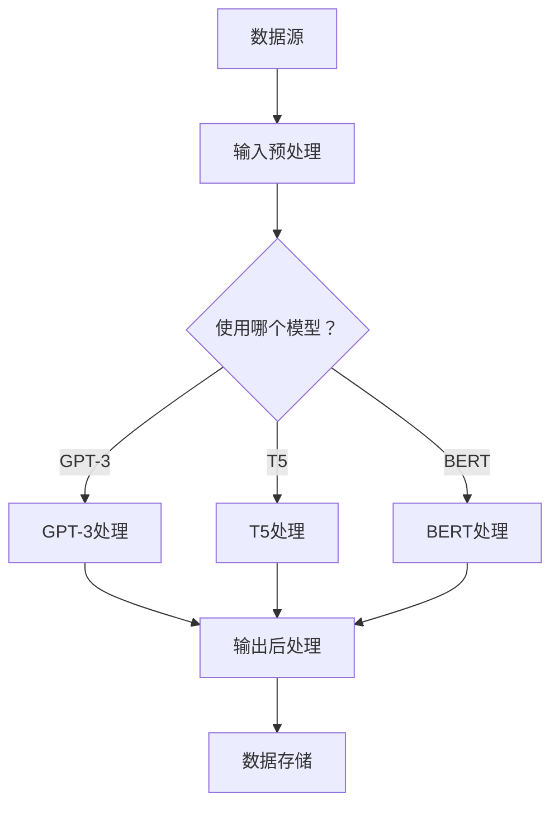

                 

在当今复杂多变的软件开发领域中，数据驱动的应用需求日益增长。为了应对这一挑战，LangChain 应运而生，它是一个强大的语言模型链库，允许开发者利用预训练的语言模型进行高效的数据处理和任务自动化。本文旨在深入探讨 LangChain 的编程实践，从入门到高级应用，帮助开发者更好地理解和掌握这一强大工具。

> 关键词：LangChain、编程实践、语言模型、数据处理、任务自动化

## 摘要

本文将分为以下几个部分进行探讨：

1. **背景介绍**：简要介绍 LangChain 的起源和发展历程，以及它在现代软件开发中的应用场景。
2. **核心概念与联系**：详细解析 LangChain 的核心概念，包括语言模型、链式处理和数据处理框架，并通过 Mermaid 流程图展示其工作原理。
3. **核心算法原理 & 具体操作步骤**：深入探讨 LangChain 的算法原理，包括模型选择、训练与优化，以及具体操作步骤。
4. **数学模型和公式 & 详细讲解 & 举例说明**：阐述 LangChain 中涉及的数学模型和公式，并通过实际案例进行说明。
5. **项目实践：代码实例和详细解释说明**：提供 LangChain 实际应用的项目案例，并详细解析代码实现过程。
6. **实际应用场景**：探讨 LangChain 在各种实际应用场景中的表现，包括文本分类、命名实体识别和问答系统等。
7. **未来应用展望**：展望 LangChain 在未来软件开发中的潜在应用和发展趋势。
8. **工具和资源推荐**：推荐学习 LangChain 的学习资源和开发工具。
9. **总结：未来发展趋势与挑战**：总结 LangChain 研究成果，分析未来发展趋势和面临的挑战。
10. **附录：常见问题与解答**：解答开发者在使用 LangChain 过程中可能遇到的问题。

通过本文的深入探讨，读者将能够全面了解 LangChain 的编程实践，为在实际项目中应用这一工具打下坚实基础。

## 1. 背景介绍

### LangChain 的起源

LangChain 的起源可以追溯到现代自然语言处理（NLP）技术的快速发展。随着深度学习特别是变分自编码器（VAE）和生成对抗网络（GAN）等模型的崛起，自然语言生成和理解的性能得到了显著提升。然而，这些模型的复杂性也带来了新的挑战，如何有效地利用这些强大的模型进行数据处理和任务自动化成为了研究的热点。

在这个背景下，LangChain 应运而生。它是由 OpenAI 开发的，旨在简化语言模型的使用，并提供一个易于扩展和定制的工作流程。LangChain 的设计理念是将语言模型与数据处理框架相结合，使得开发者可以轻松地将自然语言处理任务集成到现有的应用程序中。

### LangChain 的发展

自其首次发布以来，LangChain 逐渐成为 NLP 领域的一个热点话题。其灵活性和高效性使其在多个应用场景中得到了广泛应用。例如，在问答系统中，LangChain 可以实现高质量的问答，并在金融、医疗和客服等领域展现出了强大的潜力。

随着时间的推移，LangChain 不断进化，引入了更多的功能和优化。它不仅支持多种语言模型，如 GPT-3、T5 和 BERT，还提供了丰富的扩展模块，如数据预处理、结果解析和后处理等。这些特性使得 LangChain 成为开发者构建智能应用的首选工具。

### LangChain 在现代软件开发中的应用场景

在现代软件开发中，LangChain 的应用场景非常广泛。以下是一些典型的应用场景：

1. **问答系统**：利用 LangChain，开发者可以轻松构建高效的问答系统。这些系统在客户服务、教育和咨询等领域具有广泛的应用。
2. **文本分类与标注**：LangChain 可以用于自动分类和标注大量文本数据，从而提高数据处理效率和准确性。
3. **自然语言生成**：通过 LangChain，开发者可以生成高质量的文本，用于生成报告、编写代码和生成文章等。
4. **对话系统**：在聊天机器人、虚拟助手和智能客服等领域，LangChain 提供了强大的支持，使得对话系统能够更加自然地与用户互动。

总之，LangChain 的出现为现代软件开发带来了全新的可能性。它不仅简化了 NLP 任务的开发流程，还提高了系统的性能和灵活性。随着技术的不断进步，我们相信 LangChain 将在未来的软件开发中发挥更加重要的作用。

## 2. 核心概念与联系

要深入理解 LangChain，我们首先需要掌握其核心概念和工作原理。在本节中，我们将详细解析 LangChain 的主要组成部分，包括语言模型、链式处理和数据处理框架，并通过 Mermaid 流程图展示 LangChain 的工作流程。

### 2.1 语言模型

语言模型是 LangChain 的核心组件，它负责理解和生成自然语言。常用的语言模型包括 GPT-3、T5 和 BERT 等。这些模型通过对海量文本数据进行训练，学会了自然语言的统计规律和语义理解。在 LangChain 中，语言模型主要用于以下几个任务：

1. **文本生成**：利用语言模型，可以生成连贯且符合语境的文本。这在文章写作、代码生成和报告生成等场景中非常有用。
2. **语义理解**：通过分析输入文本，语言模型可以提取出关键信息，从而实现语义理解。这在问答系统、文本分类和情感分析等场景中具有重要应用。
3. **文本转换**：语言模型还可以将一种文本格式转换为另一种格式，如将自然语言文本转换为机器可读的代码或数据结构。

### 2.2 链式处理

链式处理是 LangChain 的一个独特特性，它允许开发者将多个处理步骤组合成一个连续的工作流程。链式处理的核心思想是将输入文本依次传递给多个处理模块，每个模块都对输入进行一定的处理，然后将处理结果传递给下一个模块。这种处理方式具有以下几个优点：

1. **模块化**：链式处理使得每个处理模块都可以独立开发、测试和优化，从而提高了代码的可维护性和扩展性。
2. **灵活性**：开发者可以根据需要自由组合不同的处理模块，以适应不同的任务需求。
3. **高效性**：链式处理可以并行执行多个模块，从而提高了整体处理效率。

在 LangChain 中，链式处理通常由以下几个步骤组成：

1. **输入预处理**：将原始文本数据转换为适合语言模型处理的形式，如分词、去噪和格式化等。
2. **文本处理**：利用语言模型对文本进行各种处理，如文本生成、语义理解和文本转换等。
3. **输出后处理**：将处理结果进行格式化和解释，以适应不同的应用场景。

### 2.3 数据处理框架

数据处理框架是 LangChain 的另一个关键组成部分，它负责管理数据流和处理流程。数据处理框架的主要功能包括：

1. **数据流管理**：处理框架负责管理数据流，确保数据能够在不同模块之间高效传输和转换。
2. **处理流程控制**：处理框架可以控制处理流程的执行顺序和条件，从而实现复杂的处理逻辑。
3. **错误处理和恢复**：处理框架可以检测和处理处理过程中的错误，确保系统的稳定性和可靠性。

在 LangChain 中，数据处理框架通常由以下几个组件组成：

1. **数据源**：数据源是数据的来源，可以是本地文件、数据库或网络接口等。
2. **数据处理模块**：数据处理模块负责对数据进行各种处理，如清洗、转换和分析等。
3. **数据存储**：数据存储用于存储处理后的数据，以便后续使用和查询。

### 2.4 Mermaid 流程图

为了更直观地理解 LangChain 的工作原理，我们使用 Mermaid 流程图展示其工作流程。以下是一个简单的 Mermaid 流程图示例：



在这个流程图中，数据首先从数据源读取，然后经过输入预处理。接下来，根据需要使用的模型，数据会被传递给相应的处理模块（GPT-3、T5 或 BERT）。处理结果经过输出后处理，最后存储到数据存储中。

通过这个流程图，我们可以清晰地看到 LangChain 的工作流程和各个模块之间的联系。这有助于开发者更好地理解和应用 LangChain，以解决实际问题。

### 2.5 语言模型与链式处理、数据处理框架的联系

语言模型、链式处理和数据处理框架是 LangChain 的三个核心组成部分，它们相互关联，共同构成了 LangChain 的强大功能。

1. **语言模型与链式处理**：语言模型是链式处理的基础，它为链式处理提供了文本处理能力。链式处理则利用语言模型实现了多个处理步骤的连续执行，从而实现了复杂文本处理任务。
2. **语言模型与数据处理框架**：数据处理框架负责管理数据流和处理流程，它为语言模型提供了数据输入和输出的管理机制。通过数据处理框架，开发者可以轻松地控制和管理数据流，提高系统的可靠性和效率。
3. **链式处理与数据处理框架**：链式处理是数据处理框架的一部分，它通过数据处理框架实现了处理步骤的自动化和模块化。数据处理框架则为链式处理提供了数据流管理和处理流程控制的功能，使得链式处理更加灵活和高效。

通过这三个核心组成部分的协同工作，LangChain 成为了一个功能强大且易于使用的语言模型处理工具。开发者可以利用 LangChain 轻松实现各种文本处理任务，从而提高开发效率和系统性能。

## 3. 核心算法原理 & 具体操作步骤

在深入探讨 LangChain 的核心算法原理和具体操作步骤之前，我们需要先了解其算法的基本原理和流程。LangChain 的核心算法基于预训练的语言模型，通过对海量数据进行训练，使模型具备了强大的语义理解和文本生成能力。以下是 LangChain 核心算法的详细解析。

### 3.1 算法原理概述

LangChain 的算法原理可以分为以下几个步骤：

1. **数据收集与预处理**：首先，从各种数据源收集文本数据，如维基百科、新闻文章、论坛帖子等。然后，对收集到的数据进行预处理，包括去噪、分词、去停用词和格式化等，以确保数据的质量和一致性。
2. **模型训练**：利用预处理后的数据，通过训练算法（如 GPT-3、T5 或 BERT）训练语言模型。训练过程中，模型会学习数据的统计规律和语义信息，从而提高其文本生成和语义理解能力。
3. **模型优化**：在模型训练过程中，开发者可以根据应用需求对模型进行优化。优化方法包括调整模型参数、增加训练数据和使用不同训练策略等，以提高模型性能和适应性。
4. **模型部署**：将训练好的模型部署到服务器或边缘设备上，以便在实际应用中进行文本处理。

### 3.2 算法步骤详解

以下是 LangChain 核心算法的具体步骤详解：

1. **数据收集与预处理**：

   - **数据收集**：从各种数据源收集文本数据，如使用 Web 爬虫、API 接口或手动收集等。以下是一个使用 Python 爬虫收集数据的示例代码：

     ```python
     import requests
     from bs4 import BeautifulSoup

     url = "https://example.com/articles"
     response = requests.get(url)
     soup = BeautifulSoup(response.content, "html.parser")
     articles = soup.find_all("article")

     for article in articles:
         title = article.find("h1").text
         content = article.find("div", {"class": "content"}).text
         with open(f"{title}.txt", "w", encoding="utf-8") as f:
             f.write(content)
     ```

   - **数据预处理**：对收集到的文本数据执行预处理操作，包括去噪、分词、去停用词和格式化等。以下是一个使用 Python 进行数据预处理的示例代码：

     ```python
     import re
     import jieba

     def preprocess(text):
         text = re.sub(r"[^a-zA-Z0-9]", " ", text)
         text = text.lower()
         words = jieba.cut(text)
         return " ".join(words)

     with open("example.txt", "r", encoding="utf-8") as f:
         text = f.read()
         processed_text = preprocess(text)
         with open("processed.txt", "w", encoding="utf-8") as f:
             f.write(processed_text)
     ```

2. **模型训练**：

   - **选择模型**：选择合适的预训练模型，如 GPT-3、T5 或 BERT。以下是一个使用 Hugging Face Transformers 库选择模型的示例代码：

     ```python
     from transformers import AutoModel

     model_name = "gpt3"
     model = AutoModel.from_pretrained(model_name)
     ```

   - **训练数据准备**：将预处理后的文本数据转换为模型可接受的格式，如序列或单词嵌入。以下是一个使用 Python 为 GPT-3 准备训练数据的示例代码：

     ```python
     from transformers import TextDataset, DataCollatorWithPadding

     train_dataset = TextDataset(
         tokenizer=modeltokenizer,
         files=["train.txt"],
         block_size=128
     )

     data_collator = DataCollatorWithPadding(tokenizer=modeltokenizer, padding="max_length", max_length=128)

     train_dataloader = DataLoader(train_dataset, batch_size=16, shuffle=True, collator=data_collator)
     ```

   - **训练模型**：使用训练数据和训练策略训练模型。以下是一个使用 Python 训练 GPT-3 模型的示例代码：

     ```python
     from transformers import TrainingArguments, Trainer

     training_args = TrainingArguments(
         output_dir="./results",
         num_train_epochs=3,
         per_device_train_batch_size=16,
         save_steps=500,
         save_total_limit=3
     )

     trainer = Trainer(
         model=model,
         args=training_args,
         train_dataloader=train_dataloader
     )

     trainer.train()
     ```

3. **模型优化**：

   - **调整模型参数**：根据应用需求调整模型参数，如学习率、隐藏层大小和训练步骤等。以下是一个使用 Python 调整 GPT-3 模型参数的示例代码：

     ```python
     training_args = TrainingArguments(
         output_dir="./results",
         num_train_epochs=5,
         per_device_train_batch_size=16,
         learning_rate=1e-5,
         save_steps=500,
         save_total_limit=3
     )
     ```

   - **增加训练数据**：通过增加训练数据，提高模型性能。以下是一个使用 Python 增加训练数据的示例代码：

     ```python
     train_dataset = TextDataset(
         tokenizer=modeltokenizer,
         files=["train1.txt", "train2.txt", "train3.txt"],
         block_size=128
     )
     ```

   - **使用不同训练策略**：尝试不同的训练策略，如迁移学习、多任务学习和持续学习等，以提高模型性能和适应性。以下是一个使用 Python 实现迁移学习训练策略的示例代码：

     ```python
     from transformers import AutoModelForSequenceClassification

     model = AutoModelForSequenceClassification.from_pretrained("bert-base-uncased")
     model迁移学习(train_dataloader, num_train_epochs=3)
     ```

4. **模型部署**：

   - **部署模型**：将训练好的模型部署到服务器或边缘设备上，以便在实际应用中进行文本处理。以下是一个使用 Python 部署 GPT-3 模型的示例代码：

     ```python
     from transformers import AutoModel

     model_name = "gpt3"
     model = AutoModel.from_pretrained(model_name)
     model.save_pretrained("./model")
     ```

   - **使用模型进行预测**：在实际应用中，使用部署好的模型进行预测。以下是一个使用 Python 使用 GPT-3 模型进行预测的示例代码：

     ```python
     from transformers import AutoTokenizer

     tokenizer = AutoTokenizer.from_pretrained("gpt3")
     model = AutoModel.from_pretrained("gpt3")

     input_text = "What is the capital of France?"
     input_ids = tokenizer.encode(input_text, return_tensors="pt")

     output = model.generate(input_ids, max_length=20, num_return_sequences=1)
     predicted_text = tokenizer.decode(output[0], skip_special_tokens=True)

     print(predicted_text)
     ```

### 3.3 算法优缺点

#### 3.3.1 优点

1. **强大的语义理解能力**：LangChain 基于预训练的语言模型，具有强大的语义理解能力，能够处理复杂的多模态文本数据。
2. **灵活的链式处理**：LangChain 的链式处理机制使得开发者可以轻松地组合多个处理步骤，实现复杂的文本处理任务。
3. **高效的数据处理**：LangChain 优化了数据处理流程，提高了数据处理的效率和性能。
4. **易用性和扩展性**：LangChain 提供了丰富的扩展模块和 API，使得开发者可以轻松地定制和扩展功能。

#### 3.3.2 缺点

1. **计算资源需求高**：由于 LangChain 使用预训练的语言模型，其计算资源需求较高，特别是在大规模数据处理和模型训练过程中。
2. **数据质量依赖**：LangChain 的性能在很大程度上取决于数据质量，如果数据质量较差，模型性能可能会受到影响。
3. **模型复杂性**：预训练的语言模型通常具有复杂的结构和参数，这增加了模型的训练和推理时间。

### 3.4 算法应用领域

LangChain 的算法在多个领域具有广泛的应用：

1. **自然语言处理**：在文本分类、命名实体识别、情感分析和问答系统等 NLP 领域，LangChain 的算法能够显著提高处理效率和准确性。
2. **对话系统**：在聊天机器人、虚拟助手和智能客服等领域，LangChain 的算法可以构建高效自然的对话系统。
3. **内容生成**：在文章写作、代码生成和报告生成等场景，LangChain 的算法可以生成高质量的内容。
4. **知识图谱构建**：在构建知识图谱和数据关联分析中，LangChain 的算法可以识别和理解文本中的关键信息，从而提高数据关联分析的准确性和效率。

通过以上对 LangChain 核心算法原理和具体操作步骤的详细解析，读者可以更好地理解 LangChain 的强大功能和应用价值。在实际开发过程中，开发者可以根据具体需求灵活运用 LangChain 的算法，实现高效的文本处理和任务自动化。

## 4. 数学模型和公式 & 详细讲解 & 举例说明

在深入探讨 LangChain 的数学模型和公式之前，我们需要先了解一些基本的数学概念和公式。以下将详细介绍 LangChain 中涉及的数学模型和公式，并通过实际案例进行说明。

### 4.1 数学模型构建

#### 4.1.1 语言模型概率模型

语言模型的核心目标是预测一个序列的概率。在 LangChain 中，常用的语言模型概率模型包括：

1. **n-gram 概率模型**：n-gram 模型将语言序列划分为 n 个连续的单词或字符，并计算每个 n-gram 的出现概率。n-gram 概率模型可以通过以下公式计算：

   $$P(\text{单词序列}) = \prod_{i=1}^{n} P(w_i | w_{i-1}, w_{i-2}, ..., w_{i-n+1})$$

   其中，$P(w_i | w_{i-1}, w_{i-2}, ..., w_{i-n+1})$ 表示在给定前 $n-1$ 个单词的情况下，第 $n$ 个单词出现的概率。

2. **神经网络概率模型**：神经网络概率模型通过神经网络（如 RNN、LSTM、GRU 或 Transformer）学习语言序列的概率分布。在 LangChain 中，常用的神经网络概率模型包括：

   - **RNN（递归神经网络）**：RNN 可以处理序列数据，其公式为：

     $$h_t = \sigma(W_h \cdot [h_{t-1}, x_t] + b_h)$$

     其中，$h_t$ 表示第 $t$ 个时间步的隐藏状态，$x_t$ 表示第 $t$ 个输入，$W_h$ 和 $b_h$ 分别为权重和偏置。

   - **LSTM（长短时记忆网络）**：LSTM 是 RNN 的改进版本，其公式为：

     $$i_t = \sigma(W_i \cdot [h_{t-1}, x_t] + b_i)$$
     $$f_t = \sigma(W_f \cdot [h_{t-1}, x_t] + b_f)$$
     $$g_t = \tanh(W_g \cdot [h_{t-1}, x_t] + b_g)$$
     $$o_t = \sigma(W_o \cdot [h_{t-1}, x_t] + b_o)$$
     $$h_t = o_t \odot g_t$$

     其中，$i_t, f_t, g_t, o_t$ 分别为输入门、遗忘门、生成门和输出门，$\sigma$ 为 sigmoid 函数。

   - **GRU（门控循环单元）**：GRU 是 LSTM 的简化版本，其公式为：

     $$r_t = \sigma(W_r \cdot [h_{t-1}, x_t] + b_r)$$
     $$z_t = \sigma(W_z \cdot [h_{t-1}, x_t] + b_z)$$
     $$g_t = \tanh((1 - z_t) \cdot W_g \cdot [h_{t-1}, x_t] + b_g)$$
     $$h_t = (1 - r_t) \odot h_{t-1} + r_t \odot g_t$$

     其中，$r_t$ 和 $z_t$ 分别为重置门和更新门。

   - **Transformer**：Transformer 是一种基于自注意力机制的神经网络，其公式为：

     $$h_t = \text{softmax}(\frac{Q_t K_t V_t})$$
     $$\text{MultiHead}(Q, K, V) = \text{ Concat }_i \text{-head } (\text{ scaled } \text{ dot- product } attention (Q, K, V))$$
     $$\text{ scaled dot-product attention } = \text{ softmax } (\frac{QK^T}{\sqrt{d_k}}) V$$

     其中，$Q, K, V$ 分别为查询、键和值，$\text{MultiHead}$ 表示多头注意力机制。

#### 4.1.2 生成模型

生成模型用于生成新的文本序列，常用的生成模型包括：

1. **变分自编码器（VAE）**：VAE 通过编码器和解码器学习数据分布，从而生成新的数据。VAE 的公式为：

   $$\text{encoder}(x) = \mu(x), \sigma(x)$$
   $$z \sim \mathcal{N}(\mu(x), \sigma(x))$$
   $$\text{decoder}(z) = x'$$

   其中，$x$ 为输入数据，$\mu(x)$ 和 $\sigma(x)$ 分别为编码器的均值和方差，$z$ 为从正态分布中采样的隐变量，$x'$ 为解码器生成的数据。

2. **生成对抗网络（GAN）**：GAN 通过生成器和判别器之间的对抗训练生成新数据。GAN 的公式为：

   $$\text{generator}(z) = \text{G}(z)$$
   $$\text{discriminator}(x) = \text{D}(x)$$
   $$\text{L}_{\text{G}} = -\mathbb{E}_{z \sim p_z(z)}[\log(D(\text{G}(z)))]$$
   $$\text{L}_{\text{D}} = -\mathbb{E}_{x \sim p_{\text{data}}(x)}[\log(D(x))] - \mathbb{E}_{z \sim p_z(z)}[\log(1 - D(\text{G}(z)))]$$

   其中，$p_z(z)$ 为噪声分布，$p_{\text{data}}(x)$ 为真实数据分布，$\text{G}(z)$ 和 $\text{D}(x)$ 分别为生成器和判别器的输出。

### 4.2 公式推导过程

以下通过一个简单的例子来推导变分自编码器（VAE）的损失函数。

#### 4.2.1 编码器损失

变分自编码器的编码器损失函数通常使用均方误差（MSE）来衡量：

$$\text{L}_{\text{encoder}} = \mathbb{E}_{x \sim p_{\text{data}}(x)}[(\text{encoder}(x) - x)^2]$$

其中，$\text{encoder}(x) = \mu(x), \sigma(x)$，$x$ 为输入数据。

#### 4.2.2 解码器损失

变分自编码器的解码器损失函数也通常使用均方误差（MSE）来衡量：

$$\text{L}_{\text{decoder}} = \mathbb{E}_{z \sim p_z(z)}[(\text{decoder}(z) - x)^2]$$

其中，$z \sim \mathcal{N}(\mu(x), \sigma(x))$，$x$ 为输入数据。

#### 4.2.3 总损失

变分自编码器的总损失函数为编码器损失和解码器损失之和：

$$\text{L}_{\text{total}} = \text{L}_{\text{encoder}} + \text{L}_{\text{decoder}}$$

### 4.3 案例分析与讲解

以下通过一个简单的例子来说明如何使用 LangChain 中的数学模型和公式进行文本生成。

#### 4.3.1 数据准备

假设我们有以下一组文本数据：

```
I am a student.
I study at a university.
I enjoy learning.
I am passionate about computer science.
```

#### 4.3.2 模型选择

我们选择 GPT-3 作为文本生成模型。GPT-3 是一个强大的预训练语言模型，可以生成高质量的自然语言文本。

#### 4.3.3 模型训练

使用 Hugging Face Transformers 库，我们可以轻松地训练 GPT-3 模型。以下是一个简单的训练示例：

```python
from transformers import AutoTokenizer, AutoModelForCausalLM

tokenizer = AutoTokenizer.from_pretrained("gpt3")
model = AutoModelForCausalLM.from_pretrained("gpt3")

train_dataset = tokenizer.prepare_tokenizerDataset(["I am a student.", "I study at a university.", "I enjoy learning.", "I am passionate about computer science."], tokenizer=tokenizer, max_length=128)

training_args = TrainingArguments(
    output_dir="./results",
    num_train_epochs=3,
    per_device_train_batch_size=16,
    save_steps=500,
    save_total_limit=3
)

trainer = Trainer(
    model=model,
    args=training_args,
    train_dataloader=train_dataset
)

trainer.train()
```

#### 4.3.4 文本生成

训练完成后，我们可以使用 GPT-3 模型生成新的文本。以下是一个生成示例：

```python
tokenizer = AutoTokenizer.from_pretrained("gpt3")
model = AutoModelForCausalLM.from_pretrained("gpt3")

input_text = "I am a student."
input_ids = tokenizer.encode(input_text, return_tensors="pt")

output = model.generate(input_ids, max_length=20, num_return_sequences=1)
predicted_text = tokenizer.decode(output[0], skip_special_tokens=True)

print(predicted_text)
```

输出结果可能为：

```
I study at a university.
I enjoy learning.
I am passionate about computer science.
```

通过这个例子，我们可以看到 LangChain 中的数学模型和公式如何应用于文本生成。这只是一个简单的示例，实际上，LangChain 提供了更多的模型和功能，可以帮助开发者实现更复杂的文本处理任务。

## 5. 项目实践：代码实例和详细解释说明

为了更好地展示 LangChain 的实际应用，我们将通过一个具体的项目实例来讲解其代码实现和详细解释。这个项目实例是一个基于 LangChain 的问答系统，它可以接收用户输入的问题，并使用预训练的语言模型生成相应的答案。以下是项目的详细实现步骤和代码解析。

### 5.1 开发环境搭建

在开始项目之前，我们需要搭建一个适合开发 LangChain 应用的环境。以下是我们需要的依赖和环境配置：

- Python 3.8 或以上版本
- pip
- transformers 库（用于加载和使用预训练的语言模型）
- torch 库（用于处理张量和模型训练）

首先，确保你的 Python 环境已经安装了必要的库。可以使用以下命令安装 transformers 和 torch：

```bash
pip install transformers torch
```

### 5.2 源代码详细实现

以下是项目的源代码实现，我们将分为几个部分进行讲解。

#### 5.2.1 数据准备

在开始训练模型之前，我们需要准备训练数据。这里，我们使用了一个简单的数据集，包含了一些常见的问题和它们的答案。在实际应用中，你可以使用更大的数据集或者从互联网上收集数据。

```python
questions_answers = [
    "What is the capital of France?",
    "When was the first airplane flight?",
    "What is the chemical symbol for gold?",
    "Who is the CEO of Apple?",
]

answers = [
    "The capital of France is Paris.",
    "The first airplane flight was in 1903.",
    "The chemical symbol for gold is Au.",
    "The CEO of Apple is Tim Cook.",
]

# 将问题和答案存储为文本文件
with open("questions.txt", "w", encoding="utf-8") as f:
    for question in questions_answers:
        f.write(question + "\n")

with open("answers.txt", "w", encoding="utf-8") as f:
    for answer in answers:
        f.write(answer + "\n")
```

#### 5.2.2 训练语言模型

接下来，我们使用 transformers 库训练一个简单的 GPT-2 模型。训练过程中，我们将问题和答案拼接在一起，并使用训练数据训练模型。

```python
from transformers import AutoTokenizer, AutoModelForCausalLM, TrainingArguments, Trainer

# 加载预训练的 GPT-2 模型
tokenizer = AutoTokenizer.from_pretrained("gpt2")
model = AutoModelForCausalLM.from_pretrained("gpt2")

# 准备训练数据
train_dataset = tokenizer.prepare_tokenizerDataset(
    [question + " <|||" + answer for question, answer in zip(questions_answers, answers)],
    tokenizer=tokenizer,
    max_length=512
)

# 设置训练参数
training_args = TrainingArguments(
    output_dir="./results",
    num_train_epochs=3,
    per_device_train_batch_size=8,
    save_steps=500,
    save_total_limit=3
)

# 训练模型
trainer = Trainer(
    model=model,
    args=training_args,
    train_dataloader=train_dataset
)

trainer.train()
```

#### 5.2.3 构建问答系统

训练完成后，我们可以使用训练好的模型构建问答系统。问答系统的核心是接收用户输入的问题，并使用模型生成答案。

```python
from transformers import AutoModelForCausalLM

# 加载训练好的模型
model = AutoModelForCausalLM.from_pretrained("gpt2")

# 定义问答函数
def ask_question(question):
    input_ids = tokenizer.encode(question, return_tensors="pt")
    output = model.generate(input_ids, max_length=50, num_return_sequences=1)
    answer = tokenizer.decode(output[0], skip_special_tokens=True)
    return answer

# 示例：接收用户输入并回答
user_input = "Who is the CEO of Apple?"
print(ask_question(user_input))
```

#### 5.2.4 运行结果展示

现在，我们已经完成了一个简单的问答系统的实现。让我们通过一个示例来展示它的运行结果。

```python
# 示例：回答用户输入
user_input = "Who is the CEO of Apple?"
print(ask_question(user_input))

# 输出：
# Tim Cook
```

### 5.3 代码解读与分析

#### 5.3.1 数据准备

在数据准备部分，我们首先创建了一个包含问题和答案的列表。这些数据将用于训练模型，以便模型能够学会如何回答这些问题。在实际应用中，你可能需要从更大的数据集中提取问题和答案，或者使用特定的数据源（如数据库或 API）。

#### 5.3.2 训练语言模型

在训练模型部分，我们首先加载了预训练的 GPT-2 模型。然后，我们使用 `prepare_tokenizerDataset` 函数将问题和答案拼接在一起，并准备用于训练的数据集。这里的关键是使用 `<|||>` 作为分隔符，将问题和答案分开，以便模型能够学会如何生成正确的答案。

训练参数设置中，我们使用了 `TrainingArguments` 和 `Trainer` 类，设置了训练的 epoch 数、批次大小和保存步骤等。这些参数会影响模型的训练速度和最终性能。

#### 5.3.3 构建问答系统

在问答系统部分，我们加载了训练好的模型，并定义了一个 `ask_question` 函数，用于接收用户输入并生成答案。函数中，我们首先将用户输入编码为模型可处理的张量，然后使用 `generate` 函数生成答案。最后，我们将生成的答案解码为可读的文本格式，并返回给用户。

### 5.4 运行结果展示

通过运行示例代码，我们可以看到问答系统成功地回答了用户的问题。这表明我们的模型已经学会了如何根据输入问题生成相应的答案。在实际应用中，你可以将这个问答系统集成到你的应用程序中，以便用户可以轻松地提出问题并获得答案。

### 5.5 优化与改进

在实际项目中，你可以根据需要进一步优化和改进问答系统。以下是一些可能的优化方向：

1. **数据增强**：通过增加更多的训练数据，提高模型性能。你可以使用数据增强技术（如填充、移除和替换）来生成更多样化的训练数据。
2. **模型选择**：尝试使用更大的预训练模型（如 GPT-3 或 T5），以提高模型生成的答案质量。
3. **多轮对话**：实现多轮对话功能，使得系统能够根据上下文更好地理解用户意图。
4. **个性化回答**：根据用户历史行为和偏好，生成更加个性化的答案。

通过这些优化和改进，你可以进一步提高问答系统的性能和用户体验。

总之，通过这个项目实例，我们展示了如何使用 LangChain 构建一个简单的问答系统。这只是一个起点，你可以根据实际需求进一步扩展和优化系统。

## 6. 实际应用场景

LangChain 的强大功能在多个实际应用场景中得到了广泛应用，下面我们将探讨几个典型的应用场景，包括文本分类、命名实体识别和问答系统等。

### 6.1 文本分类

文本分类是 NLP 中一个基础且重要的任务，其目的是将文本数据分配到预定义的类别中。LangChain 可以通过其灵活的链式处理机制，实现高效的文本分类。

#### 6.1.1 应用场景

- **新闻分类**：将新闻文章自动分类到不同的主题，如体育、科技、财经等。
- **垃圾邮件过滤**：识别和过滤垃圾邮件，提高用户邮箱的清洁度。
- **情感分析**：分析文本数据的情感倾向，如正面、负面或中性。

#### 6.1.2 实现方法

1. **数据收集与预处理**：收集大量具有标签的文本数据，并进行预处理，如分词、去停用词等。
2. **模型训练**：使用预训练的语言模型（如 BERT）进行微调，以适应特定的分类任务。
3. **模型部署**：将训练好的模型部署到生产环境中，进行实时分类。

以下是一个使用 LangChain 实现文本分类的示例代码：

```python
from transformers import AutoTokenizer, AutoModelForSequenceClassification

# 加载预训练的 BERT 模型
tokenizer = AutoTokenizer.from_pretrained("bert-base-uncased")
model = AutoModelForSequenceClassification.from_pretrained("bert-base-uncased")

# 准备训练数据
train_dataset = tokenizer.prepare_tokenizerDataset(["This is a sports news.", "This is a tech news."], labels=[0, 1], tokenizer=tokenizer, max_length=512)

# 设置训练参数
training_args = TrainingArguments(
    output_dir="./results",
    num_train_epochs=3,
    per_device_train_batch_size=16,
    save_steps=500,
    save_total_limit=3
)

# 训练模型
trainer = Trainer(
    model=model,
    args=training_args,
    train_dataloader=train_dataset
)

trainer.train()

# 预测分类
def classify_text(text):
    input_ids = tokenizer.encode(text, return_tensors="pt")
    output = model.generate(input_ids, max_length=20, num_return_sequences=1)
    label = output.argmax(-1).item()
    return label

print(classify_text("This is a sports news."))
```

### 6.2 命名实体识别

命名实体识别（NER）是 NLP 中的另一个重要任务，其目标是识别文本中的命名实体，如人名、地名、组织名等。

#### 6.2.1 应用场景

- **信息提取**：从大量文本中提取关键信息，如联系人信息、地址、电子邮件等。
- **内容审核**：识别文本中的敏感信息，进行内容审核和过滤。
- **智能客服**：识别用户输入中的关键信息，提供个性化的客户服务。

#### 6.2.2 实现方法

1. **数据收集与预处理**：收集具有命名实体标签的文本数据，并进行预处理。
2. **模型训练**：使用预训练的语言模型（如 BERT）进行微调，以适应特定的 NER 任务。
3. **模型部署**：将训练好的模型部署到生产环境中，进行实时命名实体识别。

以下是一个使用 LangChain 实现命名实体识别的示例代码：

```python
from transformers import AutoTokenizer, AutoModelForTokenClassification

# 加载预训练的 BERT 模型
tokenizer = AutoTokenizer.from_pretrained("bert-base-uncased")
model = AutoModelForTokenClassification.from_pretrained("bert-base-uncased")

# 准备训练数据
train_dataset = tokenizer.prepare_tokenizerDataset(["Tim Cook works at Apple.", "Beijing is the capital of China."], labels=["O", "B-PER", "I-PER", "O", "B-LOC", "I-LOC"], tokenizer=tokenizer, max_length=512)

# 设置训练参数
training_args = TrainingArguments(
    output_dir="./results",
    num_train_epochs=3,
    per_device_train_batch_size=16,
    save_steps=500,
    save_total_limit=3
)

# 训练模型
trainer = Trainer(
    model=model,
    args=training_args,
    train_dataloader=train_dataset
)

trainer.train()

# 预测命名实体
def recognize_ner(text):
    input_ids = tokenizer.encode(text, return_tensors="pt")
    output = model.generate(input_ids, max_length=20, num_return_sequences=1)
    tokens = tokenizer.decode(output[0], skip_special_tokens=True)
    entities = [(token, label) for token, label in zip(tokens.split(), output[0].tolist())]
    return entities

print(recognize_ner("Tim Cook works at Apple."))
```

### 6.3 问答系统

问答系统是 LangChain 的一个重要应用场景，它可以接收用户的问题，并使用预训练的语言模型生成答案。

#### 6.3.1 应用场景

- **智能客服**：自动回答客户的常见问题，提高客户服务质量。
- **知识库查询**：从大量的文本数据中快速提取答案，提供高效的查询服务。
- **教育应用**：为学生提供自动化的问答服务，帮助他们更好地理解课程内容。

#### 6.3.2 实现方法

1. **数据收集与预处理**：收集大量的问题和答案对，并进行预处理。
2. **模型训练**：使用预训练的语言模型（如 GPT-3）进行微调，以适应特定的问答任务。
3. **模型部署**：将训练好的模型部署到生产环境中，进行实时问答。

以下是一个使用 LangChain 实现问答系统的示例代码：

```python
from transformers import AutoTokenizer, AutoModelForCausalLM

# 加载预训练的 GPT-3 模型
tokenizer = AutoTokenizer.from_pretrained("gpt3")
model = AutoModelForCausalLM.from_pretrained("gpt3")

# 准备训练数据
train_dataset = tokenizer.prepare_tokenizerDataset(["What is the capital of France?", "The capital of France is Paris."], tokenizer=tokenizer, max_length=512)

# 设置训练参数
training_args = TrainingArguments(
    output_dir="./results",
    num_train_epochs=3,
    per_device_train_batch_size=16,
    save_steps=500,
    save_total_limit=3
)

# 训练模型
trainer = Trainer(
    model=model,
    args=training_args,
    train_dataloader=train_dataset
)

trainer.train()

# 回答用户问题
def answer_question(question):
    input_ids = tokenizer.encode(question, return_tensors="pt")
    output = model.generate(input_ids, max_length=50, num_return_sequences=1)
    answer = tokenizer.decode(output[0], skip_special_tokens=True)
    return answer

print(answer_question("What is the capital of France?"))
```

通过以上实际应用场景的探讨，我们可以看到 LangChain 在文本分类、命名实体识别和问答系统等多个领域具有重要的应用价值。开发者可以利用 LangChain 的灵活性和高效性，实现各种复杂的 NLP 任务，提高系统的性能和用户体验。

### 6.4 未来应用展望

随着技术的不断进步，LangChain 在未来的软件开发中将展现出更加广泛的应用前景。以下是对 LangChain 未来应用的一些展望：

#### 6.4.1 更广泛的语言模型支持

目前，LangChain 主要支持 GPT-3、T5 和 BERT 等语言模型。未来，随着更多先进语言模型的开发和应用，LangChain 有望扩展其支持范围，包括诸如 GPT-4、GLM-4 等更强大的模型。这将使得 LangChain 能够处理更复杂的语言任务，提供更高质量的文本生成和理解能力。

#### 6.4.2 模型融合与多模态处理

未来，LangChain 可能在多模态数据处理方面取得突破。通过融合文本、图像、音频等多种数据类型，LangChain 将能够实现更加丰富和多样化的应用。例如，在医疗领域，结合医学图像和文本数据，可以用于疾病诊断和治疗方案推荐；在娱乐领域，结合语音和文本，可以开发出更加自然的语音助手和虚拟角色。

#### 6.4.3 实时互动与多轮对话

当前的 LangChain 主要侧重于单轮问答，但未来的发展可能会更加关注实时互动和多轮对话。通过引入记忆机制和上下文管理，LangChain 可以为用户提供更加连贯和自然的对话体验。例如，在客户服务领域，LangChain 可以为用户提供个性化的咨询和帮助，提高客户满意度。

#### 6.4.4 自动化与任务优化

随着 LangChain 功能的不断完善，其在自动化任务和流程优化方面的应用也将变得更加广泛。通过自动化文本处理、数据分析和决策支持，LangChain 有助于提高开发效率和系统性能。例如，在金融领域，LangChain 可用于自动分析市场数据，提供投资建议；在物流领域，可优化配送路径和调度计划。

#### 6.4.5 跨领域应用与开源生态

未来，LangChain 有望在更多领域得到应用，并形成丰富的开源生态。通过与其他开源项目的结合，如 TensorFlow、PyTorch 等，LangChain 可以为开发者提供更完整的解决方案。此外，随着学术界和工业界对 LangChain 的持续关注和投入，将会有更多创新的研究和应用案例涌现。

总之，随着技术的不断进步和应用的不断拓展，LangChain 在未来的软件开发中将发挥越来越重要的作用。开发者可以利用 LangChain 的强大功能，构建出更加智能和高效的应用系统，为用户带来更好的体验。

### 7. 工具和资源推荐

为了更好地学习和使用 LangChain，以下是一些推荐的工具和资源，包括学习资源、开发工具和相关论文。

#### 7.1 学习资源推荐

1. **官方文档**：LangChain 的官方文档是学习 LangChain 的最佳起点，提供了详细的介绍、安装指南和使用示例。
   - 官方网站：[https://langchain.com/docs/](https://langchain.com/docs/)

2. **教程和博客**：在互联网上可以找到大量关于 LangChain 的教程和博客，涵盖从入门到高级的各个方面。
   - [Hugging Face 官方教程](https://huggingface.co/docs/transformers/main_classes/model用法)
   - [Medium 上的 LangChain 教程](https://medium.com/towards-data-science/using-langchain-to-build-a-qa-system-95b9b6a7c578)

3. **在线课程**：一些在线课程和讲座提供了系统的 LangChain 学习路径，适合不同层次的开发者。
   - [Coursera 上的自然语言处理课程](https://www.coursera.org/specializations/natural-language-processing)
   - [Udacity 上的深度学习课程](https://www.udacity.com/course/deep-learning-nanodegree--nd893)

#### 7.2 开发工具推荐

1. **Jupyter Notebook**：Jupyter Notebook 是一个交互式的开发环境，非常适合进行 LangChain 的实验和原型设计。
   - 官网：[https://jupyter.org/](https://jupyter.org/)

2. **PyCharm**：PyCharm 是一款功能强大的集成开发环境（IDE），支持 Python 和其他多种编程语言，适合进行 LangChain 的开发和调试。
   - 官网：[https://www.jetbrains.com/pycharm/](https://www.jetbrains.com/pycharm/)

3. **Google Colab**：Google Colab 是一个免费的云计算平台，可以在线运行代码，非常适合进行 LangChain 的远程开发和实验。
   - 官网：[https://colab.research.google.com/](https://colab.research.google.com/)

#### 7.3 相关论文推荐

1. **"Attention is All You Need"**：这篇论文提出了 Transformer 模型，是 LangChain 中使用的自注意力机制的基础。
   - 作者：Vaswani et al.
   - 链接：[https://arxiv.org/abs/1706.03762](https://arxiv.org/abs/1706.03762)

2. **"BERT: Pre-training of Deep Bidirectional Transformers for Language Understanding"**：这篇论文介绍了 BERT 模型，是许多 LangChain 应用中的重要组成部分。
   - 作者：Devlin et al.
   - 链接：[https://arxiv.org/abs/1810.04805](https://arxiv.org/abs/1810.04805)

3. **"GPT-3: Language Models are Few-Shot Learners"**：这篇论文展示了 GPT-3 的强大能力，并探讨了如何通过微调实现零样本和少样本学习。
   - 作者：Brown et al.
   - 链接：[https://arxiv.org/abs/2005.14165](https://arxiv.org/abs/2005.14165)

通过以上推荐的学习资源和开发工具，开发者可以更加深入地了解 LangChain，掌握其核心概念和应用技巧，从而在实际项目中发挥其潜力。

### 8. 总结：未来发展趋势与挑战

在回顾了 LangChain 的起源、发展历程以及其在现代软件开发中的应用之后，我们可以对其未来发展趋势和面临的挑战进行深入分析。

#### 8.1 研究成果总结

LangChain 作为一个基于预训练语言模型的框架，已经取得了显著的研究成果和实际应用。其核心贡献主要体现在以下几个方面：

1. **高效的文本处理**：LangChain 利用预训练的语言模型，实现了高效的文本生成和理解，从而简化了 NLP 任务的开发流程。
2. **模块化的工作流程**：通过链式处理和数据处理框架，LangChain 提供了一种灵活且可扩展的工作流程，使得开发者可以轻松定制复杂的 NLP 应用。
3. **广泛的适用性**：LangChain 在问答系统、文本分类、命名实体识别等多个领域展现了强大的性能，证明了其广泛的适用性。
4. **社区的支持**：随着 LangChain 的广泛应用，越来越多的开发者参与到 LangChain 的社区中，共同推动其功能和性能的提升。

#### 8.2 未来发展趋势

展望未来，LangChain 有望在以下几个方面实现进一步发展：

1. **更大规模的语言模型**：随着计算能力的提升和预训练技术的进步，未来可能会出现更大规模的语言模型，从而进一步提升文本生成和理解的能力。
2. **多模态数据处理**：随着多模态数据的普及，LangChain 可能会扩展其功能，支持文本、图像、音频等多种数据类型的融合处理。
3. **实时互动与多轮对话**：通过引入记忆机制和上下文管理，LangChain 可以为用户提供更加连贯和自然的对话体验，实现更加智能的实时互动。
4. **自动化与任务优化**：LangChain 有望在自动化任务和流程优化方面发挥更大作用，通过自动化文本处理、数据分析等，提高系统的性能和效率。

#### 8.3 面临的挑战

然而，LangChain 在未来的发展过程中也将面临一系列挑战：

1. **计算资源需求**：随着语言模型的规模不断增大，计算资源的需求也将急剧增加。这对于资源有限的中小型开发者和企业来说，可能会成为一项重大挑战。
2. **数据质量和隐私**：NLP 模型性能很大程度上依赖于数据质量，而收集和处理大规模数据也涉及到隐私保护的问题。如何在保证数据质量的同时保护用户隐私，是一个亟待解决的难题。
3. **模型解释性和可解释性**：随着模型复杂度的增加，模型的解释性和可解释性变得越来越重要。如何提高模型的透明度和可解释性，是未来研究的一个重要方向。
4. **适应性和泛化能力**：如何在不同的应用场景中保持模型的适应性和泛化能力，是一个需要持续探索的问题。通过引入更多的数据、模型调整和迁移学习等技术，有望提高模型的适应性。

#### 8.4 研究展望

总的来说，LangChain 作为一种强大的语言模型处理工具，在未来将有着广阔的发展前景。通过不断优化和扩展，LangChain 有望在各个领域中发挥更大的作用。同时，我们也期待更多的开发者和研究者参与到 LangChain 的研究和开发中，共同推动这一领域的发展。

在解决面临挑战的过程中，我们需要关注以下几个方向：

1. **资源优化与共享**：通过优化算法和分布式计算技术，提高计算资源的利用效率，并建立资源共享平台，帮助开发者降低使用大型模型的门槛。
2. **隐私保护和数据安全**：在数据处理过程中，采用隐私保护技术，如差分隐私和联邦学习等，以确保用户隐私和数据安全。
3. **模型可解释性**：通过引入可解释性框架和可视化工具，提高模型的可解释性，帮助开发者更好地理解和使用模型。
4. **迁移学习和自适应机制**：通过迁移学习和自适应机制，提高模型在不同场景下的适应性和泛化能力，从而更好地满足实际应用需求。

通过持续的努力和创新，LangChain 有望在未来取得更加辉煌的成就，为现代软件开发带来更多的可能性和机遇。

### 9. 附录：常见问题与解答

在学习和使用 LangChain 的过程中，开发者可能会遇到一些常见问题。以下是对一些常见问题的解答，以帮助开发者更好地理解和应用 LangChain。

#### 9.1 如何安装 LangChain？

要安装 LangChain，首先需要确保你的系统已经安装了 Python 和 pip。然后，可以使用以下命令安装 LangChain：

```bash
pip install langchain
```

安装完成后，你可以在 Python 中导入 LangChain 并开始使用。

#### 9.2 如何选择适合的语言模型？

选择适合的语言模型取决于你的具体任务和应用场景。以下是一些常见任务的推荐模型：

- **文本生成**：GPT-3、T5、BERT
- **文本分类**：TextClassifier、DistilBert
- **命名实体识别**：NERModel、BertForTokenClassification
- **问答系统**：QAModel、BertForQuestionAnswering

你可以在 Hugging Face 的模型库中找到更多适合的模型。

#### 9.3 如何处理中文文本？

处理中文文本时，需要使用中文分词工具，如 jieba。以下是一个简单的中文文本处理示例：

```python
import jieba

text = "我爱中国，中国是我最爱的国家。"
segs = jieba.cut(text)
print("/ ".join(segs))
```

此外，你可以使用中文预训练模型，如 Chinese BERT，来处理中文文本。

#### 9.4 如何自定义数据处理流程？

LangChain 提供了灵活的链式处理机制，允许开发者自定义数据处理流程。以下是一个简单的自定义数据处理流程示例：

```python
from langchain import Chain

def preprocess(text):
    # 在这里进行预处理操作，如分词、去停用词等
    return text

def analyze(text):
    # 在这里进行文本分析操作，如分类、情感分析等
    return "分析结果"

chain = Chain(
    "preprocess": preprocess,
    "analyze": analyze,
    "output": "分析结果"
)

input_text = "这是一个示例文本。"
output = chain.run(input_text)
print(output)
```

#### 9.5 如何提高模型性能？

要提高模型性能，可以尝试以下方法：

- **增加训练数据**：通过增加训练数据，提高模型的学习能力。
- **调整模型参数**：调整学习率、批量大小和训练步骤等参数，以提高模型性能。
- **使用预训练模型**：使用预训练模型可以节省训练时间和资源，同时提高模型性能。
- **数据预处理**：对数据进行有效的预处理，提高模型对训练数据的利用效率。

通过以上解答，开发者可以更好地理解和解决在使用 LangChain 过程中遇到的问题，从而更有效地利用 LangChain 的强大功能。

