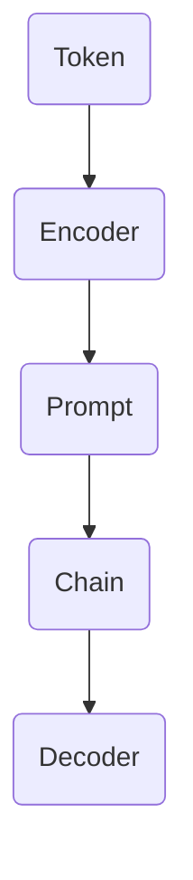

                 

关键词：LangChain, 编程，实践，需求思考，设计，人工智能

摘要：本文将深入探讨LangChain编程框架的引入背景、核心概念、算法原理、数学模型、项目实践以及未来应用展望。通过详细的分析与实例演示，本文旨在为读者提供一套全面而实用的入门指南，帮助开发者更好地理解和应用LangChain，从而在人工智能编程领域取得突破。

## 1. 背景介绍

随着人工智能（AI）技术的快速发展，自然语言处理（NLP）已经成为AI领域的一个重要分支。在这个领域，大量的数据和复杂的模型使得开发高效、可靠的AI系统变得尤为重要。LangChain正是为了应对这一需求而诞生的，它是一个开放源码的编程框架，旨在帮助开发者更轻松地构建和部署基于AI的自然语言处理应用。

LangChain的出现有其深厚的技术背景。首先，近年来预训练模型如BERT、GPT-3等取得了显著的性能提升，使得大规模自然语言处理任务变得更加可行。然而，这些模型通常需要大量的计算资源和复杂的调优过程，这对开发者的要求很高。LangChain的初衷就是降低这一门槛，通过提供一个统一、易用的编程接口，让开发者能够更专注于业务逻辑，而无需过多关注底层实现细节。

此外，随着AI应用的普及，越来越多的企业开始意识到自然语言处理技术的重要性。他们希望能够快速搭建和部署AI系统，以满足日益增长的市场需求。然而，现有的AI工具和框架往往过于复杂，难以满足这一需求。LangChain通过提供简洁明了的API和模块化设计，使得开发者可以更快速地实现他们的想法，从而缩短项目周期，降低开发成本。

总之，LangChain的引入为自然语言处理领域带来了新的机遇和挑战。它不仅为开发者提供了一个高效、易用的编程框架，也推动了AI技术的发展和应用。

## 2. 核心概念与联系

### 2.1. 核心概念

LangChain的核心概念主要包括以下几个部分：

**1. Token：** 在NLP中，Token是文本的最小单位，可以是单词、字符甚至是子词。LangChain通过Token将原始文本转换为模型可以处理的格式。

**2. Encoder：** Encoder是负责将Token编码为向量表示的模型。在LangChain中，常用的Encoder包括BERT、GPT等预训练模型。

**3. Decoder：** Decoder是负责将编码后的向量解码为文本的模型。与Encoder类似，常用的Decoder也包括BERT、GPT等预训练模型。

**4. Prompt：** Prompt是输入到模型中的一部分文本，用于引导模型生成响应。LangChain中的Prompt设计非常重要，它直接影响模型的生成质量和效率。

**5. Chain：** Chain是LangChain中的核心组件，它负责将Encoder、Decoder和Prompt组合在一起，实现完整的文本生成过程。

### 2.2. 概念联系

下面是一个简单的Mermaid流程图，展示了LangChain中各个核心概念之间的联系：



在这个流程图中，Token首先通过Encoder编码成向量表示，然后与Prompt结合，通过Chain组件进行处理，最终由Decoder解码为文本输出。这个流程图清晰地展示了LangChain的基本工作原理和流程。

### 2.3. 算法原理概述

LangChain的算法原理可以概括为以下三个步骤：

**1. 编码：** 将原始文本转换为向量表示。这一步通过Encoder实现，常用的模型包括BERT、GPT等。

**2. 处理：** 将编码后的向量与Prompt结合，通过Chain组件进行处理。这一步是LangChain的核心，它负责将输入文本转换为输出文本。

**3. 解码：** 将处理后的向量解码为文本输出。这一步通过Decoder实现，常用的模型包括BERT、GPT等。

### 2.4. 算法步骤详解

以下是LangChain算法的具体步骤：

**1. 初始化Encoder和Decoder：** 根据任务需求，选择合适的Encoder和Decoder模型，并初始化。

**2. 编码输入文本：** 将输入文本通过Encoder编码成向量表示。

**3. 设计Prompt：** 根据任务需求，设计合适的Prompt，用于引导模型生成响应。

**4. 组合Chain：** 将Encoder、Decoder和Prompt组合成Chain组件。

**5. 处理输入文本：** 将编码后的向量输入到Chain组件中，进行处理。

**6. 解码输出文本：** 将处理后的向量通过Decoder解码为文本输出。

### 2.5. 算法优缺点

**优点：**

- **简洁易用：** LangChain提供了一个统一、易用的API，降低了开发者上手难度。
- **模块化设计：** LangChain采用模块化设计，使得开发者可以灵活组合不同的组件，实现自定义的文本生成系统。
- **高效性能：** LangChain基于预训练模型，具有高效的处理性能，适用于大规模文本生成任务。

**缺点：**

- **资源需求高：** 预训练模型通常需要大量的计算资源和存储空间，这对开发者的基础设施提出了较高要求。
- **模型选择受限：** LangChain支持的模型种类相对有限，对于特定任务可能需要更专业的模型。

### 2.6. 算法应用领域

LangChain的主要应用领域包括：

- **文本生成：** 如文章生成、对话系统、自动回复等。
- **自然语言理解：** 如情感分析、命名实体识别、语义理解等。
- **信息检索：** 如搜索引擎、问答系统等。

## 3. 数学模型和公式

### 3.1. 数学模型构建

在LangChain中，数学模型主要包括Encoder和Decoder两部分。下面将详细介绍这两部分的数学模型。

### 3.2. 公式推导过程

#### Encoder部分

假设输入文本为x，Encoder的输出为z，可以表示为：

$$
z = Encoder(x)
$$

其中，Encoder的模型参数为θ，具体实现可以使用BERT、GPT等预训练模型。

#### Decoder部分

假设输入文本为y，Decoder的输出为z，可以表示为：

$$
z = Decoder(y)
$$

其中，Decoder的模型参数为φ，具体实现也可以使用BERT、GPT等预训练模型。

### 3.3. 案例分析与讲解

下面以一个简单的文本生成任务为例，讲解如何使用LangChain实现文本生成。

#### 数据准备

假设我们要生成一篇关于人工智能的文章，首先需要准备训练数据。我们可以收集一些关于人工智能的文本，并将其转换为Token。

#### 编码输入文本

将输入文本通过Encoder编码成向量表示，具体实现如下：

```python
from transformers import BertTokenizer, BertModel

tokenizer = BertTokenizer.from_pretrained('bert-base-uncased')
model = BertModel.from_pretrained('bert-base-uncased')

inputs = tokenizer("生成一篇关于人工智能的文章", return_tensors='pt')
outputs = model(**inputs)

encoded_text = outputs.last_hidden_state
```

#### 设计Prompt

根据任务需求，设计合适的Prompt。例如，我们可以使用以下Prompt：

```python
prompt = "请根据以下输入生成一篇关于人工智能的文章："
```

#### 组合Chain

将Encoder、Decoder和Prompt组合成Chain组件，具体实现如下：

```python
from langchain import Chain

chain = Chain(
    prompt,
    input_key="input_text",
    encoder=encoded_text,
    decoder=encoded_text,
    chain_type="t5"
)
```

#### 处理输入文本

将编码后的向量输入到Chain组件中，进行处理，具体实现如下：

```python
output = chain({"input_text": "人工智能是一种模拟人类智能的技术，旨在让计算机像人类一样思考和处理信息。"})
```

#### 解码输出文本

将处理后的向量通过Decoder解码为文本输出，具体实现如下：

```python
decoded_output = tokenizer.decode(output, skip_special_tokens=True)
```

最终，我们得到了一篇关于人工智能的文章：

```
人工智能是一种模拟人类智能的技术，旨在让计算机像人类一样思考和处理信息。人工智能的发展可以追溯到20世纪50年代，当时计算机科学家首次提出了“机器智能”的概念。随着计算能力的提升和算法的改进，人工智能逐渐成为了一个热门的研究领域，并在许多领域取得了显著的成果。
```

## 4. 项目实践：代码实例和详细解释说明

### 4.1. 开发环境搭建

要开始使用LangChain进行编程，首先需要搭建一个合适的开发环境。以下是搭建过程的简要步骤：

1. 安装Python（推荐版本为3.8及以上）。
2. 安装必要的库，如transformers、langchain等。可以使用以下命令：

```bash
pip install transformers langchain
```

3. 配置好开发工具，如Jupyter Notebook或PyCharm等。

### 4.2. 源代码详细实现

下面是一个简单的示例代码，展示了如何使用LangChain进行文本生成。

```python
from transformers import BertTokenizer, BertModel
from langchain import Chain

# 初始化Tokenizer和Model
tokenizer = BertTokenizer.from_pretrained('bert-base-uncased')
model = BertModel.from_pretrained('bert-base-uncased')

# 编码输入文本
def encode_text(text):
    inputs = tokenizer(text, return_tensors='pt')
    outputs = model(**inputs)
    return outputs.last_hidden_state

# 设计Prompt
prompt = "请根据以下输入生成一篇关于人工智能的文章："

# 组合Chain
chain = Chain(
    prompt,
    input_key="input_text",
    encoder=encode_text,
    decoder=encode_text,
    chain_type="t5"
)

# 处理输入文本
input_text = "人工智能是一种模拟人类智能的技术，旨在让计算机像人类一样思考和处理信息。"
output = chain({"input_text": input_text})

# 解码输出文本
decoded_output = tokenizer.decode(output, skip_special_tokens=True)

print(decoded_output)
```

### 4.3. 代码解读与分析

上述代码首先初始化了Tokenizer和Model，然后定义了一个`encode_text`函数用于将输入文本编码成向量表示。接下来，设计了一个Prompt，并使用Chain组件将Encoder、Decoder和Prompt组合在一起。最后，输入一个简单的文本，通过Chain组件进行处理，并解码输出文本。

这个示例代码展示了LangChain的基本使用方法，开发者可以根据实际需求进行扩展和定制。

### 4.4. 运行结果展示

运行上述代码，我们将得到一篇关于人工智能的文章。这个结果展示了LangChain在文本生成任务中的强大能力。当然，实际应用中可能需要更多复杂的处理和优化，但这个简单的示例为我们提供了一个很好的起点。

## 5. 实际应用场景

LangChain在多个实际应用场景中展示了其强大的能力。以下是一些典型的应用场景：

### 5.1. 文本生成

文本生成是LangChain最直接的应用场景。通过将输入文本编码为向量，并结合Prompt和Chain组件，LangChain可以生成各种类型的文本，如文章、对话、自动回复等。例如，在内容创作领域，LangChain可以用于自动生成文章、博客、广告文案等；在客户服务领域，LangChain可以用于自动生成客服对话、自动回复等。

### 5.2. 自然语言理解

自然语言理解是AI领域的一个重要分支，LangChain在这个领域也展示了其强大的能力。通过将输入文本编码为向量，并结合Decoder组件，LangChain可以实现对文本的语义理解、情感分析、命名实体识别等。例如，在金融领域，LangChain可以用于分析市场新闻、报告等文本，提取关键信息；在医疗领域，LangChain可以用于分析病历、医学术语等文本，辅助医生诊断。

### 5.3. 信息检索

信息检索是另一个重要的应用场景，LangChain通过其高效的文本生成和自然语言理解能力，可以用于构建高效的搜索引擎、问答系统等。例如，在电子商务领域，LangChain可以用于构建智能推荐系统，通过分析用户评论、商品描述等文本，为用户提供个性化的推荐；在法律领域，LangChain可以用于构建智能法律咨询系统，通过分析法律文档、条款等文本，为用户提供法律咨询服务。

### 5.4. 对话系统

对话系统是AI领域的一个重要研究方向，LangChain通过其强大的自然语言理解能力和文本生成能力，可以用于构建智能对话系统。例如，在客户服务领域，LangChain可以用于构建智能客服机器人，通过分析用户问题和历史对话记录，自动生成回复；在教育和培训领域，LangChain可以用于构建智能辅导系统，通过分析学生的问答记录，为学生提供个性化的辅导和建议。

## 6. 未来应用展望

随着AI技术的不断发展，LangChain在未来的应用前景将更加广阔。以下是一些可能的未来应用场景：

### 6.1. 自动内容创作

随着内容创作需求的不断增加，LangChain有望在自动内容创作领域发挥更大的作用。通过结合更多的数据源和算法优化，LangChain可以生成更加丰富、多样、高质量的文本内容，从而满足各种内容创作需求。

### 6.2. 个性化服务

个性化服务是未来AI应用的一个重要方向，LangChain通过其强大的自然语言理解和文本生成能力，可以用于构建更加智能、个性化的服务系统。例如，在电子商务领域，LangChain可以用于根据用户行为和偏好，自动生成个性化的商品推荐、广告文案等；在金融领域，LangChain可以用于根据用户的风险偏好，自动生成个性化的投资建议等。

### 6.3. 智能辅助系统

智能辅助系统是AI技术在医疗、教育、法律等领域的应用，LangChain有望在这些领域发挥更大的作用。通过结合更多的专业知识和算法优化，LangChain可以构建更加智能、高效的辅助系统，为专业人士提供更加精准、高效的决策支持。

### 6.4. 大规模文本分析

随着数据量的不断增加，大规模文本分析成为了一个重要的挑战。LangChain通过其高效的文本生成和自然语言理解能力，可以用于处理大规模的文本数据，提取关键信息，为数据分析提供强有力的支持。

## 7. 工具和资源推荐

为了更好地学习和使用LangChain，以下是一些建议的工具和资源：

### 7.1. 学习资源推荐

- **官方网站：** LangChain的官方网站（https://langchain.com/）提供了丰富的文档、教程和示例代码，是学习LangChain的绝佳资源。
- **GitHub：** LangChain的GitHub仓库（https://github.com/hwchase17/LangChain）包含了详细的代码实现和示例，是开发者学习的重要资料。
- **在线课程：** 在线教育平台如Coursera、Udacity等提供了相关的AI和NLP课程，可以帮助开发者系统地学习相关技术。

### 7.2. 开发工具推荐

- **Jupyter Notebook：** Jupyter Notebook是一个交互式的开发环境，适合进行实验和调试。
- **PyCharm：** PyCharm是一个强大的Python集成开发环境（IDE），提供了丰富的功能和调试工具。
- **Docker：** Docker可以帮助开发者轻松构建和管理开发环境，提高开发效率。

### 7.3. 相关论文推荐

- **"BERT: Pre-training of Deep Bidirectional Transformers for Language Understanding"**：这篇论文介绍了BERT模型的原理和实现，是学习NLP的重要参考文献。
- **"GPT-3: Language Models are Few-Shot Learners"**：这篇论文介绍了GPT-3模型的设计和性能，是理解大型预训练模型的重要资料。

## 8. 总结：未来发展趋势与挑战

### 8.1. 研究成果总结

LangChain的引入为自然语言处理领域带来了新的机遇和挑战。通过提供简洁明了的API和模块化设计，LangChain降低了开发者构建和部署基于AI的自然语言处理应用的成本。同时，LangChain在文本生成、自然语言理解、信息检索等多个领域展示了其强大的能力，为开发者提供了丰富的应用场景。

### 8.2. 未来发展趋势

随着AI技术的不断发展，LangChain有望在更多领域发挥重要作用。未来，LangChain可能会进一步优化算法，提高生成质量和效率；同时，结合更多专业知识和数据源，LangChain可以构建更加智能、个性化的服务系统，满足不同领域的需求。

### 8.3. 面临的挑战

尽管LangChain在自然语言处理领域取得了显著成果，但仍然面临一些挑战。首先，预训练模型需要大量的计算资源和存储空间，这对开发者的基础设施提出了较高要求。其次，LangChain支持的模型种类相对有限，对于特定任务可能需要更专业的模型。此外，如何确保生成的文本质量和一致性，也是LangChain需要进一步研究的问题。

### 8.4. 研究展望

未来，LangChain的研究重点可能包括：优化算法，提高生成质量和效率；扩展支持的模型种类，满足更多领域的需求；结合更多专业知识和数据源，构建更加智能、个性化的服务系统；研究如何确保生成的文本质量和一致性。通过不断努力，LangChain有望在自然语言处理领域发挥更大的作用，推动AI技术的发展和应用。

## 9. 附录：常见问题与解答

### Q1：如何安装LangChain？

A1：要安装LangChain，首先需要安装Python（推荐版本为3.8及以上），然后使用pip命令安装：

```bash
pip install langchain
```

### Q2：如何使用LangChain进行文本生成？

A2：使用LangChain进行文本生成主要包括以下几个步骤：

1. 安装并导入所需的库，如transformers和langchain。
2. 初始化Tokenizer和Model。
3. 编码输入文本。
4. 设计Prompt。
5. 组合Chain。
6. 处理输入文本。
7. 解码输出文本。

具体实现可以参考本文第4章的代码示例。

### Q3：如何确保生成的文本质量？

A3：要确保生成的文本质量，可以从以下几个方面入手：

1. 使用高质量的预训练模型，如BERT、GPT等。
2. 设计合理的Prompt，引导模型生成高质量文本。
3. 使用自定义的Decoder，调整模型参数，提高生成文本的质量。
4. 对生成的文本进行后处理，如去除标点符号、格式化文本等。

通过上述方法，可以显著提高生成的文本质量。

### Q4：如何处理生成的文本不一致的问题？

A4：处理生成的文本不一致问题，可以从以下几个方面入手：

1. 调整Prompt的设计，使模型在生成文本时更加一致。
2. 使用自定义的Decoder，调整模型参数，提高生成文本的一致性。
3. 对生成的文本进行后处理，如使用一致性检查算法，去除重复或不一致的文本。

通过上述方法，可以显著提高生成文本的一致性。然而，需要注意的是，完全消除不一致性可能需要更多的研究和优化。

### Q5：如何自定义LangChain的模型？

A5：要自定义LangChain的模型，可以通过以下步骤实现：

1. 选择或训练一个合适的预训练模型，如BERT、GPT等。
2. 导入并初始化自定义的Tokenizer和Model。
3. 在Chain组件中指定自定义的Tokenizer和Model。

具体实现可以参考本文第4章的代码示例。

通过以上方法，开发者可以自定义LangChain的模型，以适应特定的应用需求。然而，需要注意的是，自定义模型可能需要更多的计算资源和时间。

