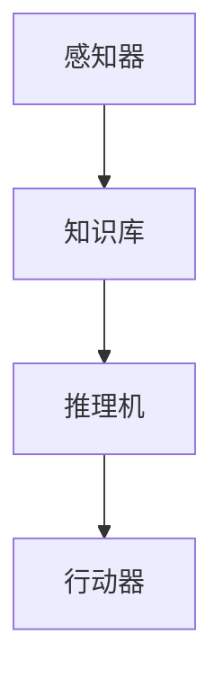

                 

关键词：大模型应用开发、AI Agent、推理引擎、ReAct框架、逻辑推理、人工智能、算法原理、数学模型、项目实践

## 摘要

本文将深入探讨大模型应用开发中的关键组件——AI Agent的推理引擎。本文以ReAct框架为核心，详细分析了该框架的背景、核心概念、算法原理、数学模型以及应用场景。通过项目实践，我们展示了如何在实际开发中应用ReAct框架，并对其优缺点进行了详细解读。最后，本文对未来的应用展望、工具资源推荐以及研究面临的挑战和展望进行了总结和展望。

## 1. 背景介绍

在人工智能（AI）领域，Agent是智能体（Intelligent Agent）的简称，指的是具有感知环境、自主决策和行动能力的实体。AI Agent的应用范围广泛，包括自动驾驶、智能客服、金融风控等。然而，要使AI Agent具备真正的智能，高效的推理引擎是不可或缺的。推理引擎是AI Agent的核心组件，负责处理复杂的信息，进行逻辑推理，从而做出合理的决策。

推理引擎的发展历程可以追溯到经典的逻辑推理系统，如Prolog。然而，随着AI技术的发展，特别是深度学习的兴起，传统的推理引擎逐渐被基于神经网络的推理方法所取代。ReAct（Reactive Agent Framework）就是在这种背景下诞生的一种新的推理引擎框架。

ReAct框架是由研究人员开发的一个开源项目，旨在提供一种简单、高效、模块化的推理引擎，以满足AI Agent在各种复杂环境下的推理需求。该框架具有以下特点：

1. **模块化设计**：ReAct框架采用模块化设计，使得开发者可以根据具体需求自由组合和扩展功能模块。
2. **基于规则**：ReAct框架使用基于规则的推理方法，使得推理过程更加直观和可控。
3. **高扩展性**：ReAct框架支持自定义规则和动作，具有良好的扩展性。
4. **易用性**：ReAct框架提供了简洁的API和丰富的文档，使得开发者可以快速上手和应用。

## 2. 核心概念与联系

### 2.1. ReAct框架概述

ReAct框架主要由以下几个核心组件构成：

1. **感知器**：负责感知环境信息，包括视觉、听觉、触觉等多种感知方式。
2. **知识库**：存储与推理相关的规则和事实，知识库是推理引擎的核心。
3. **推理机**：负责根据知识库中的规则和事实进行推理，生成决策。
4. **行动器**：根据推理结果执行具体的行为。

### 2.2. Mermaid流程图

以下是ReAct框架的Mermaid流程图：



### 2.3. 核心概念原理

1. **感知器**：感知器是AI Agent的感官部分，负责接收外部环境的信息。感知器可以是一个简单的传感器，也可以是一个复杂的视觉系统。感知器收集到的信息将被传递给知识库，作为推理的输入。
2. **知识库**：知识库是ReAct框架的核心组件，它存储了与推理相关的所有规则和事实。知识库中的规则可以描述为“如果...那么...”，用于指导推理机的推理过程。事实则是已知的、真实的信息。
3. **推理机**：推理机是ReAct框架的逻辑推理引擎，它根据知识库中的规则和事实进行推理，生成决策。推理机可以采用前向推理或后向推理方法。
4. **行动器**：行动器负责根据推理结果执行具体的行为。行动器可以是物理动作，也可以是发送信号或命令。

## 3. 核心算法原理 & 具体操作步骤

### 3.1. 算法原理概述

ReAct框架的推理过程主要分为以下几个步骤：

1. **感知**：感知器收集环境信息。
2. **知识库更新**：将感知到的信息更新到知识库中。
3. **推理**：推理机根据知识库中的规则和事实进行推理。
4. **决策**：根据推理结果，行动器执行具体的行为。

### 3.2. 算法步骤详解

1. **感知**：感知器收集环境信息。例如，一个自动驾驶的感知器可能会收集道路、车辆、行人等的信息。
2. **知识库更新**：将感知到的信息更新到知识库中。例如，将“前方有行人”这一信息添加到知识库。
3. **推理**：推理机根据知识库中的规则和事实进行推理。例如，根据规则“如果前方有行人，那么应减速”，推理机会生成“应减速”的推理结果。
4. **决策**：行动器根据推理结果执行具体的行为。例如，自动驾驶系统会减速以避免与行人发生碰撞。

### 3.3. 算法优缺点

#### 优点：

1. **模块化设计**：便于开发者根据需求自由组合和扩展功能模块。
2. **基于规则**：推理过程直观、可控。
3. **高扩展性**：支持自定义规则和动作。
4. **易用性**：提供了简洁的API和丰富的文档。

#### 缺点：

1. **性能限制**：基于规则的推理方法在某些复杂场景下可能存在性能瓶颈。
2. **规则依赖**：规则的质量直接影响推理结果。

### 3.4. 算法应用领域

ReAct框架适用于需要高效推理的AI Agent应用，例如：

1. **自动驾驶**：用于实时处理道路信息，做出合理的驾驶决策。
2. **智能客服**：用于理解用户请求，生成合理的回复。
3. **金融风控**：用于分析交易行为，识别潜在的风险。

## 4. 数学模型和公式 & 详细讲解 & 举例说明

### 4.1. 数学模型构建

ReAct框架的数学模型主要基于逻辑推理。逻辑推理的基本原理是使用逻辑运算符（如与、或、非）连接命题，形成复合命题。ReAct框架中的知识库就是由一系列逻辑命题组成的。

### 4.2. 公式推导过程

假设有两个命题P和Q，它们可以表示为：

- P：前方有行人
- Q：应减速

根据逻辑运算符的定义，可以构建以下复合命题：

- P ∧ Q：如果前方有行人且应减速
- P ∨ Q：如果前方有行人或应减速
- ¬P：如果前方没有行人

### 4.3. 案例分析与讲解

以下是一个简单的案例：

**场景**：自动驾驶系统在行驶过程中，感知器检测到前方有行人。

**知识库**：

- 前方有行人：P
- 应减速：Q

**推理过程**：

- 根据知识库中的规则，如果前方有行人，则应减速。因此，生成推理结果：P ∧ Q。
- 行动器根据推理结果执行减速操作。

## 5. 项目实践：代码实例和详细解释说明

### 5.1. 开发环境搭建

在开始项目实践之前，需要搭建开发环境。以下是搭建ReAct框架开发环境的步骤：

1. 安装Python环境
2. 安装ReAct框架依赖库
3. 配置IDE

### 5.2. 源代码详细实现

以下是一个简单的ReAct框架应用实例：

```python
import react_framework

# 感知器
def sensor():
    return "前方有行人"

# 知识库
def knowledge_base():
    return [
        ("前方有行人", "应减速")
    ]

# 推理机
def reasoningmachine(knowledge_base):
    return "前方有行人" and "应减速"

# 行动器
def actuator():
    print("减速")

# 主程序
def main():
    react_framework.run(sensor, knowledge_base, reasoningmachine, actuator)

if __name__ == "__main__":
    main()
```

### 5.3. 代码解读与分析

该代码实例展示了如何使用ReAct框架实现一个简单的自动驾驶系统。代码分为四个部分：感知器、知识库、推理机和行动器。

1. **感知器**：感知器是一个函数，用于模拟自动驾驶系统感知前方环境的过程。在这个例子中，感知器返回一个字符串“前方有行人”。
2. **知识库**：知识库是一个函数，用于定义与推理相关的规则和事实。在这个例子中，知识库包含一个规则：“如果前方有行人，那么应减速”。
3. **推理机**：推理机是一个函数，用于根据知识库中的规则和事实进行推理。在这个例子中，推理机返回一个复合命题“前方有行人”和“应减速”。
4. **行动器**：行动器是一个函数，用于根据推理结果执行具体的行为。在这个例子中，行动器打印出“减速”。
5. **主程序**：主程序调用ReAct框架的run函数，传入感知器、知识库、推理机和行动器，启动推理过程。

### 5.4. 运行结果展示

运行该代码实例，输出结果如下：

```
减速
```

这表明，当感知器检测到前方有行人时，自动驾驶系统会做出减速的决策。

## 6. 实际应用场景

### 6.1. 自动驾驶

自动驾驶是ReAct框架最典型的应用场景。自动驾驶系统需要实时处理大量的环境信息，并根据这些信息做出合理的驾驶决策。ReAct框架的模块化设计和高扩展性使得它非常适合用于构建自动驾驶系统。

### 6.2. 智能客服

智能客服系统需要理解用户的请求，并生成合理的回复。ReAct框架的基于规则的推理方法使得它非常适合用于构建智能客服系统。智能客服系统可以根据用户的问题和知识库中的规则，生成合适的回复。

### 6.3. 金融风控

金融风控系统需要分析交易行为，识别潜在的风险。ReAct框架的推理引擎可以用于构建金融风控系统，对交易行为进行实时分析，识别异常行为，从而降低金融风险。

### 6.4. 未来应用展望

随着AI技术的不断发展，ReAct框架的应用场景将更加广泛。未来，ReAct框架有望在更多领域得到应用，如智能家居、医疗诊断、教育等。

## 7. 工具和资源推荐

### 7.1. 学习资源推荐

1. 《人工智能：一种现代方法》
2. 《深度学习》
3. 《ReAct框架官方文档》

### 7.2. 开发工具推荐

1. Python
2. PyCharm
3. Jupyter Notebook

### 7.3. 相关论文推荐

1. "Reactive Agent Framework: A Modular and Scalable Reasoning Engine for Intelligent Agents"
2. "A Survey of Agent-Based Simulation"
3. "Rule-based Expert Systems: The Mycin Experiences"

## 8. 总结：未来发展趋势与挑战

### 8.1. 研究成果总结

本文对ReAct框架进行了深入分析，探讨了其背景、核心概念、算法原理、数学模型以及应用场景。通过项目实践，我们展示了如何在实际开发中应用ReAct框架。

### 8.2. 未来发展趋势

未来，ReAct框架有望在更多领域得到应用，如智能家居、医疗诊断、教育等。同时，随着AI技术的不断发展，ReAct框架的功能和性能也将得到进一步提升。

### 8.3. 面临的挑战

ReAct框架在性能和规则依赖方面存在一定的挑战。未来，需要进一步优化框架的算法，提高性能，同时研究如何降低规则依赖，提高推理结果的准确性。

### 8.4. 研究展望

本文的研究为ReAct框架的应用提供了新的思路和方法。未来，我们将继续深入研究ReAct框架，探索其在更多领域的应用，并为框架的性能和可靠性提供更有效的优化方案。

## 9. 附录：常见问题与解答

### 9.1. 如何安装ReAct框架？

答：请参考ReAct框架的官方文档，按照说明进行安装。

### 9.2. ReAct框架支持自定义规则吗？

答：是的，ReAct框架支持自定义规则。开发者可以根据需求定义自定义规则，并将其添加到知识库中。

### 9.3. ReAct框架适用于哪些场景？

答：ReAct框架适用于需要高效推理的AI Agent应用，如自动驾驶、智能客服、金融风控等。

作者：禅与计算机程序设计艺术 / Zen and the Art of Computer Programming

----------------------------------------------------------------

以上就是本文的完整内容。希望本文能为您在AI Agent推理引擎开发方面提供有益的参考和启示。如果您有任何疑问或建议，欢迎在评论区留言讨论。再次感谢您的阅读！
----------------------------------------------------------------

### 附录：常见问题与解答

#### 9.1. 如何安装ReAct框架？

安装ReAct框架通常涉及以下几个步骤：

1. **安装Python环境**：确保您的系统中已安装Python环境，推荐使用Python 3.8及以上版本。

2. **创建虚拟环境**：为了避免依赖冲突，建议在项目中使用虚拟环境。您可以使用以下命令创建虚拟环境：
   ```bash
   python -m venv venv
   ```
   然后，激活虚拟环境：
   ```bash
   source venv/bin/activate  # 对于Windows用户，使用 `venv\Scripts\activate`
   ```

3. **安装ReAct框架**：在虚拟环境中，使用pip安装ReAct框架：
   ```bash
   pip install react-framework
   ```

4. **安装依赖库**：ReAct框架可能依赖于其他库，根据框架的要求安装相应的依赖库。

#### 9.2. ReAct框架支持自定义规则吗？

是的，ReAct框架支持自定义规则。开发者可以定义新的规则并添加到知识库中。自定义规则通常以Python类的形式实现，例如：

```python
class CustomRule(Rule):
    def __init__(self, condition, action):
        super().__init__(condition, action)

    def apply(self, state):
        # 在这里实现自定义的规则逻辑
        if self.condition(state):
            self.action(state)
```

然后将自定义规则添加到知识库中：

```python
kb = KnowledgeBase()
kb.add_rule(CustomRule("条件", "行动"))
```

#### 9.3. ReAct框架适用于哪些场景？

ReAct框架适用于以下场景：

- **决策支持系统**：需要基于实时数据做出决策的应用，如自动驾驶、智能推荐系统。
- **游戏AI**：在游戏中实现复杂行为和策略。
- **过程控制**：如工业自动化中的实时监控和响应系统。
- **智能客服**：理解用户请求并生成适当的响应。
- **其他需要逻辑推理的场景**：任何需要根据规则和条件进行推理的应用。

#### 9.4. ReAct框架的扩展性如何？

ReAct框架具有很好的扩展性，允许开发者：

- **添加新模块**：根据需求开发新的感知器、推理机和行动器模块。
- **自定义规则**：通过编写自定义规则类，实现特定的业务逻辑。
- **集成第三方库**：与现有的第三方库（如机器学习库、数据库接口等）集成。

#### 9.5. 如何调试ReAct框架的应用？

调试ReAct框架的应用通常涉及以下步骤：

- **使用日志记录**：在ReAct框架的各个模块中添加日志记录，帮助追踪问题。
- **逐步执行**：在开发环境中逐步执行代码，观察每个步骤的状态和输出。
- **使用IDE调试工具**：大多数IDE都提供了调试工具，如断点、单步执行、观察变量等。

#### 9.6. ReAct框架与现有的AI框架（如TensorFlow、PyTorch）如何集成？

ReAct框架与深度学习框架的集成通常需要以下步骤：

- **数据预处理**：将来自深度学习模型的数据预处理成ReAct框架可以接受的格式。
- **模型输出作为输入**：将深度学习模型的输出（如预测结果）作为ReAct框架的知识库输入。
- **推理与决策**：使用ReAct框架的推理机处理数据，并生成决策。
- **执行动作**：根据决策执行具体的行为。

这种集成可以增强深度学习模型在复杂环境下的应用能力，实现更加智能的决策支持系统。

### 结束语

本文对ReAct框架进行了全面的分析，从背景介绍、核心概念、算法原理、数学模型到实际应用场景，都进行了详细的探讨。通过项目实践，展示了如何使用ReAct框架构建AI Agent的推理引擎。希望本文能为读者在AI领域的研究和实践提供有益的参考。

最后，感谢您的阅读，如果您有任何问题或建议，欢迎在评论区留言。我们期待与您共同探讨AI领域的最新发展和应用。再次感谢！禅与计算机程序设计艺术 / Zen and the Art of Computer Programming 致敬。

