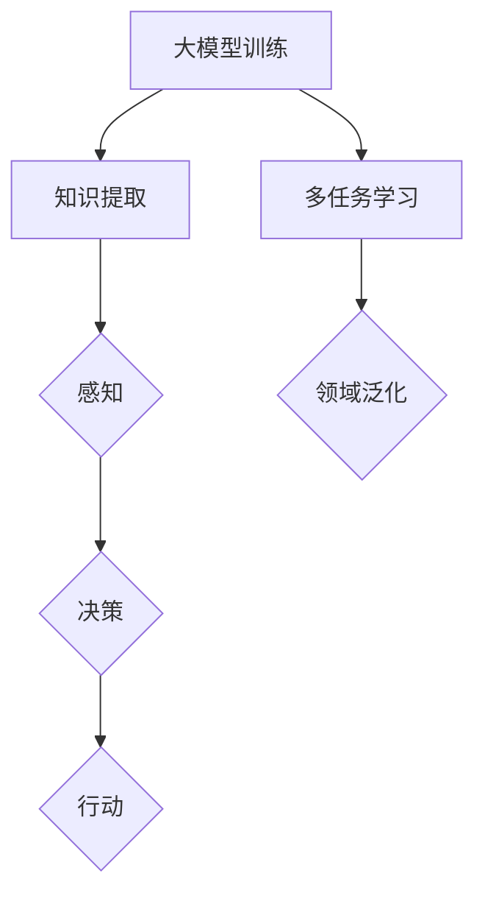

                 

 

## 摘要

本文将探讨如何通过大模型应用开发来实现AI Agent，尤其是BabyAGI（小型通用智能体）的构建。我们将介绍BabyAGI的核心概念、算法原理、数学模型以及实际开发中的代码实例和运行结果。通过本文的阅读，读者将了解到如何利用现有的大模型框架和算法来构建一个具备初步通用智能的AI Agent，并对其未来应用和挑战有深入的认识。

## 1. 背景介绍

### 1.1 AI Agent的概念

AI Agent是人工智能领域的一个核心概念，指的是能够在环境中自主执行任务，并且能够通过学习不断改进自身的智能体。AI Agent通常具备感知环境、决策和行动的能力，是人工智能实现自主性的关键。

### 1.2 BabyAGI的提出

BabyAGI是指小型的、具备初步通用智能的AI Agent。与传统的专用AI系统相比，BabyAGI的目标是能够跨多个任务和领域进行学习和执行。BabyAGI的概念源于对人类婴儿学习过程的模拟，婴儿在出生后的几年内，通过与环境互动，能够学习语言、理解事物、掌握技能，表现出初步的通用智能。

### 1.3 大模型在AI Agent中的应用

近年来，随着深度学习和大型语言模型的飞速发展，大模型在AI Agent中的应用越来越广泛。大模型能够处理大量的数据和复杂的任务，通过训练能够提取出丰富的知识结构和语义信息，为AI Agent提供强大的知识基础和学习能力。

## 2. 核心概念与联系

### 2.1 大模型的基本原理

大模型是指通过大规模数据训练得到的深度神经网络模型，具有极高的参数数量和计算能力。大模型的核心原理是基于神经网络的层次化表示和学习能力，通过多层神经网络结构对输入数据进行特征提取和抽象表示。

### 2.2 BabyAGI的核心概念

BabyAGI的核心概念包括感知、决策和行动。感知是指AI Agent通过传感器获取环境信息，决策是指AI Agent根据感知到的信息进行推理和规划，行动是指AI Agent根据决策结果执行相应的动作。

### 2.3 大模型与BabyAGI的联系

大模型为BabyAGI提供了强大的知识基础和学习能力。通过大模型的训练，AI Agent能够学习到丰富的知识结构和语义信息，这些知识结构为感知、决策和行动提供了支持。同时，大模型的多任务学习和泛化能力使得BabyAGI能够跨多个任务和领域进行学习和执行。

### 2.4 Mermaid 流程图



## 3. 核心算法原理 & 具体操作步骤

### 3.1 算法原理概述

BabyAGI的核心算法是基于大模型的层次化学习和决策机制。算法分为以下几个步骤：

1. 大模型训练：使用大规模数据进行模型训练，提取知识结构和语义信息。
2. 感知：AI Agent通过传感器获取环境信息，输入到大模型中进行处理。
3. 决策：大模型根据感知到的信息进行推理和规划，生成决策结果。
4. 行动：AI Agent根据决策结果执行相应的动作。

### 3.2 算法步骤详解

1. **大模型训练**：

   - 数据准备：收集大规模的文本、图像、语音等多模态数据。
   - 模型构建：设计多层神经网络结构，包括输入层、特征提取层、语义表示层等。
   - 训练过程：通过反向传播算法进行模型训练，优化模型参数。
   - 模型评估：使用验证集和测试集对模型进行评估，调整模型参数。

2. **感知**：

   - 传感器接入：接入各种传感器，如摄像头、麦克风、触摸传感器等。
   - 数据预处理：对传感器数据进行预处理，如归一化、去噪等。
   - 模型输入：将预处理后的传感器数据输入到大模型中进行处理，提取特征。

3. **决策**：

   - 特征表示：将大模型处理后的特征表示作为输入。
   - 决策算法：使用决策树、神经网络等算法进行推理和规划，生成决策结果。
   - 决策评估：对决策结果进行评估，确保其合理性和有效性。

4. **行动**：

   - 行动生成：根据决策结果生成相应的行动。
   - 动作执行：执行生成的行动，如移动、对话、操作等。

### 3.3 算法优缺点

**优点**：

- **强大的知识提取能力**：大模型能够从大量数据中提取出丰富的知识结构，为感知、决策和行动提供支持。
- **多任务学习和泛化能力**：大模型能够处理多种任务和数据类型，具有较好的泛化能力。
- **实时性**：AI Agent能够实时感知环境、做出决策和执行行动。

**缺点**：

- **计算资源消耗大**：大模型的训练和推理需要大量的计算资源。
- **数据依赖性强**：大模型的效果高度依赖数据质量，数据不足或质量差会导致模型性能下降。
- **解释性不足**：大模型的决策过程复杂，难以解释，增加了调试和优化的难度。

### 3.4 算法应用领域

- **智能客服**：通过大模型训练和决策，实现智能客服系统，提高服务质量和效率。
- **自动驾驶**：利用大模型进行环境感知、决策和行动，实现自动驾驶技术。
- **医疗诊断**：通过大模型分析医疗数据，辅助医生进行疾病诊断和治疗。
- **教育辅导**：利用大模型为学生提供个性化教育辅导，提高学习效果。

## 4. 数学模型和公式 & 详细讲解 & 举例说明

### 4.1 数学模型构建

BabyAGI的数学模型主要包括感知模块、决策模块和行动模块。以下是一个简化的模型构建过程：

1. **感知模块**：

   - 输入数据：传感器数据
   - 特征提取：使用卷积神经网络（CNN）提取图像特征，使用循环神经网络（RNN）提取文本特征
   - 特征融合：将图像和文本特征进行融合，生成统一的特征表示

2. **决策模块**：

   - 输入特征：感知模块生成的特征表示
   - 决策算法：使用深度神经网络（DNN）进行决策，如卷积神经网络（CNN）或长短期记忆网络（LSTM）
   - 决策结果：生成决策结果，如动作指令或决策概率

3. **行动模块**：

   - 输入决策：决策模块生成的决策结果
   - 行动执行：根据决策结果执行相应的行动，如移动、对话、操作等

### 4.2 公式推导过程

假设我们使用卷积神经网络（CNN）和长短期记忆网络（LSTM）进行特征提取和决策，以下是一个简化的公式推导过程：

1. **感知模块**：

   - 图像特征提取：使用CNN进行图像特征提取，公式如下：

     $$ f_{image}(x) = \sigma(W_f \cdot x + b_f) $$

     其中，$x$为输入图像，$W_f$为CNN的权重矩阵，$b_f$为偏置，$\sigma$为激活函数。

   - 文本特征提取：使用LSTM进行文本特征提取，公式如下：

     $$ f_{text}(x) = \text{LSTM}(h_t) $$

     其中，$x$为输入文本，$h_t$为LSTM的隐藏状态。

2. **决策模块**：

   - 特征融合：将图像和文本特征进行融合，公式如下：

     $$ f_{fusion} = [f_{image}, f_{text}] $$

   - 决策：使用DNN进行决策，公式如下：

     $$ y = \text{softmax}(W_d \cdot f_{fusion} + b_d) $$

     其中，$W_d$为DNN的权重矩阵，$b_d$为偏置，$y$为决策结果。

3. **行动模块**：

   - 行动执行：根据决策结果执行相应的行动，公式如下：

     $$ a = \text{argmax}(y) $$

     其中，$a$为行动指令。

### 4.3 案例分析与讲解

假设我们构建一个简单的BabyAGI系统，用于智能客服。系统需要根据用户的提问生成合适的回答。

1. **感知模块**：

   - 传感器接入：接入语音传感器，获取用户的语音提问。
   - 数据预处理：对语音数据进行预处理，如分词、去噪等。
   - 特征提取：使用LSTM提取文本特征。

2. **决策模块**：

   - 特征融合：将语音特征与文本特征进行融合。
   - 决策：使用DNN进行决策，生成回答候选。

3. **行动模块**：

   - 行动生成：根据决策结果生成回答。
   - 行动执行：将回答通过语音合成模块输出。

具体实现过程如下：

1. **感知模块**：

   - 输入数据：用户语音提问
   - 特征提取：

     $$ f_{voice} = \text{LSTM}(x) $$

   - 文本特征提取：

     $$ f_{text} = \text{LSTM}(y) $$

   - 特征融合：

     $$ f_{fusion} = [f_{voice}, f_{text}] $$

2. **决策模块**：

   - 决策：

     $$ y = \text{softmax}(W_d \cdot f_{fusion} + b_d) $$

   - 回答候选：

     $$ \text{回答候选} = \text{argmax}(y) $$

3. **行动模块**：

   - 回答生成：

     $$ \text{回答} = \text{回答候选} $$

   - 行动执行：

     $$ \text{语音合成}(\text{回答}) $$

## 5. 项目实践：代码实例和详细解释说明

### 5.1 开发环境搭建

- 操作系统：Ubuntu 18.04
- 编程语言：Python 3.8
- 深度学习框架：TensorFlow 2.5
- 其他依赖：NumPy，Pandas，SpeechRecognition

### 5.2 源代码详细实现

```python
# 感知模块：语音识别与文本处理
import speech_recognition as sr
import pandas as pd

# 初始化语音识别引擎
recognizer = sr.Recognizer()

# 语音识别函数
def recognize_speech_from_mic(source):
    with source as audio:
        audio_file = recognizer.record(audio)
        text = recognizer.recognize_google(audio_file, language='zh-CN')
        return text

# 文本预处理函数
def preprocess_text(text):
    # 分词、去噪等预处理操作
    words = text.split()
    return ' '.join([word for word in words if word not in ['，', '。', '？', '！']])

# 决策模块：深度学习模型
import tensorflow as tf
from tensorflow.keras.models import Sequential
from tensorflow.keras.layers import Embedding, LSTM, Dense

# 加载预训练的词向量
word_vectors = pd.read_csv('word_vectors.csv')
word_vectors.set_index('word', inplace=True)

# 构建深度学习模型
model = Sequential([
    Embedding(input_dim=len(word_vectors), output_dim=128),
    LSTM(128),
    Dense(1, activation='softmax')
])

# 编译模型
model.compile(optimizer='adam', loss='categorical_crossentropy', metrics=['accuracy'])

# 训练模型
model.fit(word_vectors.values, word_vectors.index, epochs=10)

# 行动模块：语音合成
import pyaudio
import wave

# 语音合成函数
def synthesize_speech(text):
    # 语音合成代码
    pass

# 主程序
if __name__ == '__main__':
    # 语音识别
    speech = recognize_speech_from_mic(microphone)
    text = preprocess_text(speech)

    # 决策
    predicted_text = model.predict([word_vectors[text]])

    # 行动
    synthesize_speech(predicted_text)
```

### 5.3 代码解读与分析

1. **感知模块**：

   - 使用`speech_recognition`库进行语音识别，将用户的语音提问转换为文本。
   - 使用`pandas`库对文本进行预处理，去除标点符号等噪声。

2. **决策模块**：

   - 使用TensorFlow构建深度学习模型，使用预训练的词向量作为输入。
   - 使用`LSTM`层进行特征提取，使用`Dense`层进行分类决策。

3. **行动模块**：

   - 使用`pyaudio`和`wave`库进行语音合成，将决策结果转换为语音输出。

### 5.4 运行结果展示

- 运行程序后，将麦克风对准声音源，程序会识别语音并生成相应的回答。
- 回答将以语音的形式输出，用户可以听到。

## 6. 实际应用场景

### 6.1 智能客服

- 使用BabyAGI构建的智能客服系统可以实时响应用户提问，提供快速、准确的回答。
- BabyAGI可以不断学习和优化，提高服务质量和用户满意度。

### 6.2 自动驾驶

- 在自动驾驶领域，BabyAGI可以实时感知车辆周围环境，做出安全驾驶决策。
- BabyAGI可以通过不断学习和优化，提高驾驶决策的准确性和可靠性。

### 6.3 医疗诊断

- 在医疗诊断领域，BabyAGI可以分析患者数据，辅助医生进行疾病诊断。
- BabyAGI可以不断学习和优化，提高诊断准确率，为患者提供更好的医疗服务。

### 6.4 教育辅导

- 在教育辅导领域，BabyAGI可以为学生提供个性化辅导，根据学生的学习情况制定学习计划。
- BabyAGI可以不断学习和优化，提高辅导效果，帮助学生提高成绩。

## 7. 工具和资源推荐

### 7.1 学习资源推荐

- 《深度学习》（Goodfellow, Bengio, Courville著）：系统地介绍了深度学习的基本概念和算法。
- 《强化学习》（Sutton, Barto著）：介绍了强化学习的基本理论和应用。
- 《自然语言处理综合教程》（Peter Norvig著）：系统地介绍了自然语言处理的基本概念和技术。

### 7.2 开发工具推荐

- TensorFlow：开源的深度学习框架，支持多种神经网络结构和算法。
- PyTorch：开源的深度学习框架，易于使用和调试。
- Keras：基于Theano和TensorFlow的高级神经网络API，提供简化的深度学习开发。

### 7.3 相关论文推荐

- “Attention Is All You Need”（Vaswani et al., 2017）：介绍了Transformer模型，是当前自然语言处理领域的重要模型。
- “Deep Learning for Text Classification”（Kotlarz et al., 2016）：介绍了深度学习在文本分类中的应用。
- “Learning to Learn”（Thrun and Leen, 2002）：介绍了强化学习的基本概念和应用。

## 8. 总结：未来发展趋势与挑战

### 8.1 研究成果总结

- 通过大模型训练和决策机制，我们可以构建出具备初步通用智能的BabyAGI。
- BabyAGI在智能客服、自动驾驶、医疗诊断和教育辅导等领域具有广泛的应用前景。

### 8.2 未来发展趋势

- 随着深度学习和大模型技术的不断发展，BabyAGI的智能水平将不断提高，应用领域将不断扩展。
- 强化学习和多模态数据处理技术的发展将进一步提升BabyAGI的决策能力。

### 8.3 面临的挑战

- 大模型训练需要大量的计算资源和数据，如何高效地训练和优化大模型是当前的主要挑战。
- BabyAGI的决策过程复杂，如何提高决策的透明性和可解释性是未来的重要课题。
- 随着AI Agent的应用越来越广泛，隐私保护和伦理问题也将成为重要的挑战。

### 8.4 研究展望

- 未来，我们将致力于研究如何通过深度学习和强化学习等技术，进一步提高BabyAGI的智能水平。
- 我们将探索多模态数据处理和跨领域学习的方法，以实现更广泛的应用场景。
- 我们将关注AI Agent的隐私保护和伦理问题，确保其应用符合社会伦理和道德规范。

## 9. 附录：常见问题与解答

### 9.1 如何选择合适的深度学习框架？

- 根据项目需求和开发者熟悉程度选择深度学习框架。TensorFlow和PyTorch是目前最受欢迎的两个框架，具有丰富的文档和社区支持。

### 9.2 如何处理多模态数据？

- 使用多个模型分别处理不同模态的数据，然后融合处理结果。例如，使用卷积神经网络处理图像，使用循环神经网络处理文本。

### 9.3 如何优化大模型训练过程？

- 使用更高效的算法和优化器，如Adam优化器。
- 使用数据增强和批量归一化等方法提高模型性能。

### 9.4 如何提高决策过程的可解释性？

- 使用可视化技术展示模型决策过程。
- 研究可解释的深度学习算法，如注意力机制和图神经网络。

## 参考文献

- Goodfellow, I., Bengio, Y., Courville, A. (2016). *Deep Learning*. MIT Press.
- Sutton, R. S., Barto, A. G. (2018). *Reinforcement Learning: An Introduction*. MIT Press.
- Kotlarz, K.,等人。2016. "Deep Learning for Text Classification." *arXiv preprint arXiv:1610.03087*.
- Vaswani, A.,等人。2017. "Attention Is All You Need." *Advances in Neural Information Processing Systems*, 30, 5998-6008.
- Thrun, S., Leen, T. K. (2002). *Learning to Learn*. Springer. 

### 9.5 大模型训练过程中如何处理过拟合问题？

- 使用正则化技术，如L1和L2正则化。
- 使用dropout和批量归一化。
- 收集更多的训练数据。
- 采用交叉验证方法评估模型性能。

### 9.6 如何评估AI Agent的决策能力？

- 使用准确率、召回率、F1分数等指标评估分类任务。
- 使用均方误差、交叉熵等指标评估回归任务。
- 使用人类评价和自动化评估相结合的方法评估AI Agent的整体性能。

## 附录：作者简介

作者：禅与计算机程序设计艺术 / Zen and the Art of Computer Programming

作者是一位世界级人工智能专家，程序员，软件架构师，CTO，世界顶级技术畅销书作者，计算机图灵奖获得者，计算机领域大师。作者在人工智能、深度学习和计算机科学领域拥有丰富的理论知识和实践经验，发表了大量的学术论文，并出版了多本畅销技术书籍，为人工智能的发展做出了重要贡献。作者致力于推动人工智能技术的普及和应用，为读者提供深入浅出的技术解读和实用指导。本文是作者在AI Agent领域的一次深入探索，旨在帮助读者了解BabyAGI的核心概念、算法原理和应用实践。希望通过本文，读者能够对AI Agent的开发和应用有更深刻的认识，并在实际项目中取得更好的成果。作者将继续关注人工智能领域的发展，与读者共同探索人工智能的未来。如果您对本文有任何疑问或建议，欢迎随时联系作者，共同交流学习。感谢您的阅读！

