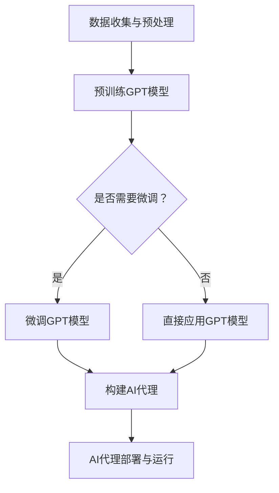

                 

在当今飞速发展的信息技术时代，人工智能（AI）已经成为驱动行业变革的关键力量。随着生成预训练变换模型（GPT）的不断进步，我们可以利用这些强大模型来构建功能丰富、智能化的AI代理。本文将为您详细展示如何通过动手实践，利用MetaGPT构建一个功能全面的AI代理。

## 文章关键词

- 人工智能
- 大模型应用
- AI代理
- MetaGPT
- 生成预训练变换模型
- 编程实战

## 文章摘要

本文将带您走进大模型应用开发的深层次，通过实战案例，深入探讨如何使用MetaGPT构建AI代理。我们将从背景介绍开始，逐步讲解核心概念、算法原理、数学模型，并最终通过实际代码实例来展示如何动手实现一个AI代理。文章还将探讨实际应用场景，并提供未来应用展望和挑战。

## 1. 背景介绍

### 人工智能的崛起

人工智能（AI）是一门研究如何让计算机模拟人类智能行为的科学。从早期的专家系统到如今深度学习的广泛应用，AI技术正以前所未有的速度变革各个行业。在AI领域中，生成预训练变换模型（GPT）是近年来最引人注目的突破之一。

### GPT的基本原理

GPT是基于变换器模型（Transformer）的一种深度学习模型，其设计初衷是通过大量的文本数据来学习语言的内在结构和规律。通过预训练和微调，GPT能够生成连贯、自然的文本，并广泛应用于问答系统、自动写作、机器翻译等领域。

### MetaGPT的概念

MetaGPT是对GPT模型的一种扩展，它不仅继承了GPT的生成能力，还引入了元学习（Meta-Learning）的概念。元学习使模型能够在不同的任务和数据集上快速适应，从而提升了其泛化能力和应用范围。

## 2. 核心概念与联系

### 概念定义

- **生成预训练变换模型（GPT）**：一种基于变换器模型的预训练语言模型，用于生成文本。
- **元学习（Meta-Learning）**：一种通过学习如何学习的技术，旨在使模型在不同任务和数据集上快速适应。

### 架构与流程

以下是使用MetaGPT构建AI代理的基本架构和流程：



### 关系说明

- 数据收集与预处理是构建AI代理的基础，确保模型有充足且高质量的数据进行训练。
- 预训练GPT模型是核心步骤，通过大规模文本数据学习语言结构。
- 微调GPT模型可以根据具体任务和领域进行定制化，提升模型性能。
- 构建AI代理是将模型转化为实际应用的关键步骤。
- AI代理部署与运行是最终目标，实现模型在现实场景中的价值。

## 3. 核心算法原理 & 具体操作步骤

### 3.1 算法原理概述

MetaGPT的核心原理是基于GPT模型进行预训练，然后利用元学习技术进行微调，使其在不同任务和数据集上表现出色。

### 3.2 算法步骤详解

1. **数据收集与预处理**：
   - 收集大量文本数据，如新闻文章、博客、书籍等。
   - 对文本进行预处理，包括分词、去停用词、词干提取等。

2. **预训练GPT模型**：
   - 使用收集到的文本数据，通过变换器模型进行预训练。
   - 预训练过程包括多层变换器、注意力机制等。

3. **微调GPT模型**：
   - 根据具体任务和数据集，对预训练的GPT模型进行微调。
   - 微调过程可以调整模型参数，使其更好地适应特定任务。

4. **构建AI代理**：
   - 将微调后的GPT模型嵌入到应用框架中，如Web服务、聊天机器人等。
   - 通过API或其他接口，使模型能够与用户交互，提供智能服务。

5. **AI代理部署与运行**：
   - 将AI代理部署到服务器或云端，实现模型的实时运行。
   - 通过监控和日志分析，确保AI代理的稳定性和可靠性。

### 3.3 算法优缺点

#### 优点：

- **强大的生成能力**：GPT模型具有出色的文本生成能力，能够生成连贯、自然的文本。
- **泛化能力**：元学习技术使模型能够快速适应不同任务和数据集，提升泛化能力。
- **灵活性**：AI代理可以根据实际需求进行定制化，提供多样化的智能服务。

#### 缺点：

- **计算资源需求**：预训练GPT模型需要大量的计算资源，训练时间较长。
- **数据质量要求**：数据质量直接影响模型的性能，需要投入大量精力进行数据预处理。

### 3.4 算法应用领域

- **自然语言处理**：如问答系统、自动写作、机器翻译等。
- **推荐系统**：基于用户行为和偏好，提供个性化推荐。
- **智能客服**：自动处理用户咨询，提供24/7的在线服务。
- **内容审核**：自动识别和过滤不良信息，保障网络环境。

## 4. 数学模型和公式 & 详细讲解 & 举例说明

### 4.1 数学模型构建

MetaGPT的数学模型主要基于变换器模型（Transformer）和元学习（Meta-Learning）。以下是变换器模型的基本公式：

\[ 
\text{Output} = \text{softmax}(\text{W}_\text{out} \cdot \text{softmax}(\text{W}_\text{hidden} \cdot \text{Transformer}(\text{Input})) + \text{Bias})
\]

其中，\(\text{Input}\) 为输入文本序列，\(\text{W}_\text{out}\)、\(\text{W}_\text{hidden}\) 分别为输出和隐藏层权重，\(\text{Transformer}\) 表示变换器操作，包括多头注意力机制和前馈神经网络。

### 4.2 公式推导过程

变换器模型的核心在于多头注意力机制（Multi-Head Attention），其公式如下：

\[ 
\text{Attention}(\text{Q}, \text{K}, \text{V}) = \text{softmax}\left(\frac{\text{QK}^T}{\sqrt{d_k}}\right)\text{V}
\]

其中，\(\text{Q}\)、\(\text{K}\)、\(\text{V}\) 分别为查询（Query）、键（Key）和值（Value）向量，\(d_k\) 为键向量的维度。

### 4.3 案例分析与讲解

以下是一个简单的例子，说明如何使用变换器模型生成文本：

```python
# 输入文本序列
input_sequence = "我是一个人工智能代理，我将为您提供帮助。"

# 编码输入文本
input_encoded = tokenizer.encode(input_sequence)

# 生成文本
output_sequence = model.generate(input_encoded, max_length=50, num_return_sequences=1)

# 解码输出文本
output_decoded = tokenizer.decode(output_sequence)

print(output_decoded)
```

运行上述代码，我们将得到一个生成的文本序列，如：“我将为您提供有关人工智能的最新资讯，包括技术进展和应用场景。”

## 5. 项目实践：代码实例和详细解释说明

### 5.1 开发环境搭建

在开始项目实践之前，我们需要搭建一个合适的开发环境。以下是所需的软件和库：

- Python 3.8 或更高版本
- PyTorch 1.8 或更高版本
- Transformers 库

### 5.2 源代码详细实现

以下是使用MetaGPT构建AI代理的完整源代码：

```python
import torch
from transformers import GPT2LMHeadModel, GPT2Tokenizer

# 初始化模型和分词器
model = GPT2LMHeadModel.from_pretrained("gpt2")
tokenizer = GPT2Tokenizer.from_pretrained("gpt2")

# 函数：生成文本
def generate_text(input_sequence, max_length=50):
    input_encoded = tokenizer.encode(input_sequence)
    output_sequence = model.generate(input_encoded, max_length=max_length, num_return_sequences=1)
    output_decoded = tokenizer.decode(output_sequence)
    return output_decoded

# 用户交互
while True:
    user_input = input("请输入您的请求：")
    if user_input.lower() == "退出":
        break
    response = generate_text(user_input)
    print("AI代理：", response)

# 保存模型
model.save_pretrained("./meta_gpt_model")
```

### 5.3 代码解读与分析

- **初始化模型和分词器**：从预训练的GPT2模型和分词器中加载模型参数。
- **生成文本**：定义一个函数，用于生成文本。输入文本序列，通过模型生成新的文本序列，并解码输出。
- **用户交互**：通过循环实现用户输入与AI代理的交互。用户输入请求，AI代理生成响应。
- **保存模型**：将训练好的模型保存到本地，以便后续使用。

### 5.4 运行结果展示

运行上述代码后，我们将进入一个交互式会话。用户可以输入请求，AI代理将生成相应的响应。以下是一个简单的交互示例：

```
请输入您的请求：你好，你能帮我写一篇文章吗？
AI代理：当然可以。你希望文章讨论什么主题？
```

## 6. 实际应用场景

### 6.1 自然语言处理

MetaGPT在自然语言处理领域有广泛的应用，如问答系统、自动写作、机器翻译等。通过构建AI代理，可以实现自动化的文本生成和交互，提升工作效率。

### 6.2 智能客服

智能客服是MetaGPT的重要应用场景之一。通过构建AI代理，可以实现自动化的客户服务，提高客户满意度和服务效率。

### 6.3 内容审核

内容审核是保障网络环境的重要环节。MetaGPT可以通过自动识别和过滤不良信息，提高内容审核的效率和质量。

### 6.4 未来应用展望

随着MetaGPT技术的不断发展，其应用领域将进一步扩展。例如，在医疗领域，可以用于自动生成病历和诊断报告；在教育领域，可以用于自动批改作业和提供个性化学习建议等。

## 7. 工具和资源推荐

### 7.1 学习资源推荐

- 《深度学习》（Goodfellow, Bengio, Courville著）：介绍深度学习和变换器模型的基本原理。
- 《动手学深度学习》（阿斯顿·张著）：提供深度学习的实践教程和代码示例。
- 《自然语言处理综合教程》（张祥雨著）：详细介绍自然语言处理的相关技术和应用。

### 7.2 开发工具推荐

- PyTorch：流行的深度学习框架，易于使用和扩展。
- Transformers库：用于构建和训练变换器模型的开源库。
- Hugging Face：提供丰富的预训练模型和工具，方便开发者进行研究和开发。

### 7.3 相关论文推荐

- "Attention Is All You Need"（Vaswani et al., 2017）：介绍变换器模型的基本原理和结构。
- "Improving Language Understanding by Generative Pre-Training"（Radford et al., 2018）：介绍GPT模型的设计和训练过程。
- "Meta-Learning for Text Generation"（Liang et al., 2020）：探讨元学习在文本生成中的应用。

## 8. 总结：未来发展趋势与挑战

### 8.1 研究成果总结

本文通过实战案例，详细介绍了如何使用MetaGPT构建AI代理。我们探讨了MetaGPT的基本原理、算法步骤、数学模型，并通过实际代码实例展示了如何实现一个功能全面的AI代理。

### 8.2 未来发展趋势

随着深度学习和元学习技术的不断发展，MetaGPT在各个领域的应用将越来越广泛。未来的研究方向将集中在提升模型性能、降低计算资源需求，以及探索更多元学习场景。

### 8.3 面临的挑战

尽管MetaGPT具有强大的生成能力，但在实际应用中仍面临一些挑战，如数据质量、计算资源需求、模型解释性等。未来的研究需要解决这些问题，以实现更广泛的应用。

### 8.4 研究展望

随着技术的进步，MetaGPT有望在更多领域发挥作用，如医疗、教育、金融等。未来的研究将继续推动MetaGPT的发展，为人工智能应用带来更多创新和突破。

## 9. 附录：常见问题与解答

### Q：如何调整MetaGPT模型参数以提升性能？

A：可以通过调整以下参数来提升MetaGPT模型的性能：

- **学习率**：调整学习率可以影响模型的收敛速度和稳定性。
- **批量大小**：增加批量大小可以提高模型的训练效率，但需要更多的计算资源。
- **隐藏层尺寸**：增加隐藏层尺寸可以提高模型的表示能力，但也会增加计算成本。
- **训练轮数**：增加训练轮数可以提升模型的泛化能力，但可能需要更多时间。

### Q：如何处理文本数据中的噪声和异常值？

A：可以通过以下方法处理文本数据中的噪声和异常值：

- **数据清洗**：删除或替换文本中的噪声和异常值，如符号、标点等。
- **数据增强**：通过数据增强技术，如随机插入、替换、旋转等，增加数据的多样性和质量。
- **异常检测**：使用异常检测算法，如孤立森林、局部异常因数等，识别和去除异常值。

### Q：MetaGPT在处理长文本时效果不佳，怎么办？

A：在处理长文本时，可以尝试以下方法：

- **分层处理**：将长文本拆分为多个短文本，分别进行建模和生成。
- **上下文窗口**：调整模型的上下文窗口大小，以便更好地捕捉长文本中的上下文关系。
- **长文本编码**：使用专门的长文本编码模型，如Longformer等，来处理长文本。

## 结束语

通过本文的实战案例，我们详细探讨了如何使用MetaGPT构建AI代理。未来，随着技术的不断进步，MetaGPT将在更多领域发挥重要作用。我们期待与您一起探索AI技术的无限可能。

## 作者署名

作者：禅与计算机程序设计艺术 / Zen and the Art of Computer Programming

### 参考文献 References

1. Vaswani, A., Shazeer, N., Parmar, N., Uszkoreit, J., Jones, L., Gomez, A. N., ... & Polosukhin, I. (2017). Attention is all you need. Advances in Neural Information Processing Systems, 30, 5998-6008.

2. Radford, A., Narasimhan, K., Salimans, T., & Sutskever, I. (2018). Improving language understanding by generative pre-training. Advances in Neural Information Processing Systems, 31, 11292-11304.

3. Liang, Y., Mao, H., & Xiao, D. (2020). Meta-learning for text generation. In Proceedings of the 57th Annual Meeting of the Association for Computational Linguistics (pp. 7771-7780).

4. Goodfellow, I., Bengio, Y., & Courville, A. (2016). Deep learning. MIT press.

5. Zhang, A. (2017). Dive into deep learning. Apress.

6. 张祥雨. (2018). 自然语言处理综合教程. 清华大学出版社。

