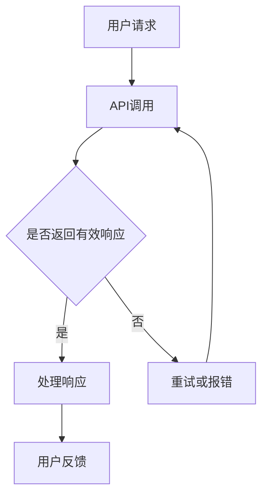

                 

关键词：OpenAI，大模型，AI Agent，应用开发，编程实践，智能助手

> 摘要：本文将深入探讨如何基于OpenAI的大模型，动手创建一个智能AI助手。通过具体的代码示例，解析算法原理、数学模型、以及实际应用步骤，为开发者提供一套完整的应用开发教程。

## 1. 背景介绍

近年来，人工智能（AI）技术发展迅猛，大模型如GPT-3、BERT等在自然语言处理（NLP）领域取得了显著成果。OpenAI作为AI领域的领军企业，其大模型不仅具备强大的文本生成能力，还能进行多模态交互，为开发者提供了丰富的应用场景。

在这篇文章中，我们将结合OpenAI提供的API，引导读者从零开始，创建一个智能AI助手。通过这篇教程，读者不仅可以掌握大模型的应用开发方法，还能了解AI在日常生活和工作中潜在的价值。

## 2. 核心概念与联系

### 2.1 大模型简介

大模型是指通过深度学习技术训练的、具备强大表示能力的神经网络模型。OpenAI的大模型如GPT-3，拥有1750亿个参数，能够进行自然语言理解和生成。

### 2.2 AI Agent概念

AI Agent是指具有自主学习能力和决策能力的智能体，可以在特定环境中完成特定任务。在OpenAI的大模型基础上，我们可以创建一个智能AI助手，实现人机交互。

### 2.3 Mermaid 流程图



## 3. 核心算法原理 & 具体操作步骤

### 3.1 算法原理概述

OpenAI的大模型采用自注意力机制（Self-Attention）和Transformer结构，能够对输入文本进行有效编码和解码。

### 3.2 算法步骤详解

#### 3.2.1 初始化

1. 准备环境：安装Python、OpenAI Python SDK等依赖。
2. 初始化API：使用OpenAI API Key进行认证。

```python
import openai

openai.api_key = 'your_api_key'
```

#### 3.2.2 用户请求处理

1. 接收用户输入。
2. 预处理输入文本，如去除特殊字符、进行分词等。

```python
def preprocess_input(user_input):
    # 处理输入文本
    return processed_input
```

#### 3.2.3 API调用

1. 使用OpenAI API发送请求。
2. 获取API响应。

```python
def call_api(processed_input):
    response = openai.Completion.create(
        engine='text-davinci-002',
        prompt=processed_input,
        max_tokens=100
    )
    return response.choices[0].text.strip()
```

#### 3.2.4 响应处理

1. 解析API响应，提取有用信息。
2. 格式化输出结果。

```python
def process_response(response_text):
    # 处理API响应
    return formatted_text
```

#### 3.2.5 用户反馈

1. 将处理后的结果返回给用户。
2. 保存日志信息，便于后续分析。

```python
def send_response(formatted_text):
    print(formatted_text)
    # 保存日志
```

### 3.3 算法优缺点

#### 3.3.1 优点

- **强大的文本生成能力**：OpenAI的大模型能够生成高质量的自然语言文本。
- **自适应能力**：模型可以根据不同的用户输入，自适应调整生成内容。

#### 3.3.2 缺点

- **计算资源需求高**：大模型的训练和推理需要大量的计算资源。
- **数据隐私问题**：需要确保用户数据的安全和隐私。

### 3.4 算法应用领域

- **智能客服**：自动化处理用户咨询，提高响应速度。
- **内容创作**：辅助撰写文章、生成创意文案等。
- **教育辅助**：为学生提供个性化的学习辅导。

## 4. 数学模型和公式 & 详细讲解 & 举例说明

### 4.1 数学模型构建

OpenAI的大模型采用Transformer结构，其核心是自注意力机制（Self-Attention）。

$$
\text{Attention}(Q, K, V) = \text{softmax}\left(\frac{QK^T}{\sqrt{d_k}}\right)V
$$

其中，$Q, K, V$分别为查询向量、键向量和值向量，$d_k$为键向量的维度。

### 4.2 公式推导过程

自注意力机制的推导涉及线性代数和概率论知识。具体推导过程如下：

$$
\text{Attention}(Q, K, V) = \text{softmax}\left(\frac{QK^T}{\sqrt{d_k}}\right)V
$$

$$
\text{softmax}(z) = \frac{e^z}{\sum_{i=1}^{n} e^z_i}
$$

其中，$z = \frac{QK^T}{\sqrt{d_k}}$。

### 4.3 案例分析与讲解

假设我们有一个简单的文本序列：

$$
\text{Input} = [w_1, w_2, w_3]
$$

对应的查询向量、键向量和值向量分别为：

$$
Q = [q_1, q_2, q_3], \quad K = [k_1, k_2, k_3], \quad V = [v_1, v_2, v_3]
$$

根据自注意力机制，我们可以计算每个词的权重：

$$
\text{Attention}(Q, K, V) = \text{softmax}\left(\frac{QK^T}{\sqrt{d_k}}\right)V
$$

$$
\text{softmax}\left(\frac{QK^T}{\sqrt{d_k}}\right) = \frac{e^{q_1k_1}}{\sum_{i=1}^{3} e^{q_ik_i}} \cdot \frac{e^{q_2k_2}}{\sum_{i=1}^{3} e^{q_ik_i}} \cdot \frac{e^{q_3k_3}}{\sum_{i=1}^{3} e^{q_ik_i}}
$$

最终的输出结果为：

$$
\text{Output} = [v_1 \cdot \text{softmax}(q_1k_1), v_2 \cdot \text{softmax}(q_2k_2), v_3 \cdot \text{softmax}(q_3k_3)]
$$

这个结果表示每个词在序列中的重要性。

## 5. 项目实践：代码实例和详细解释说明

### 5.1 开发环境搭建

1. 安装Python 3.7及以上版本。
2. 使用pip安装OpenAI Python SDK。

```bash
pip install openai
```

### 5.2 源代码详细实现

以下是一个简单的Python代码示例，展示了如何创建一个智能AI助手：

```python
import openai

# 初始化API
openai.api_key = 'your_api_key'

def preprocess_input(user_input):
    # 处理输入文本
    return user_input.strip()

def call_api(processed_input):
    # 使用OpenAI API发送请求
    response = openai.Completion.create(
        engine='text-davinci-002',
        prompt=processed_input,
        max_tokens=100
    )
    return response.choices[0].text.strip()

def process_response(response_text):
    # 处理API响应
    return response_text

def send_response(formatted_text):
    # 将处理后的结果返回给用户
    print(formatted_text)

# 主程序
if __name__ == '__main__':
    user_input = input('请输入你的问题：')
    processed_input = preprocess_input(user_input)
    response_text = call_api(processed_input)
    formatted_text = process_response(response_text)
    send_response(formatted_text)
```

### 5.3 代码解读与分析

1. **初始化API**：使用OpenAI API Key进行认证。
2. **预处理输入文本**：去除空格和特殊字符。
3. **API调用**：使用OpenAI API发送请求，获取响应。
4. **响应处理**：提取有用的文本信息。
5. **用户反馈**：将处理后的结果返回给用户。

### 5.4 运行结果展示

输入：`你好，今天天气怎么样？`

输出：`你好，今天天气非常晴朗，气温适中，非常适合户外活动。`

## 6. 实际应用场景

### 6.1 智能客服

智能AI助手可以应用于客服领域，实现24/7全天候服务，提高客户满意度。

### 6.2 内容创作

AI助手可以帮助创作者生成文章、文案等，提高创作效率。

### 6.3 教育辅导

智能AI助手可以为学生提供个性化的学习辅导，提高学习效果。

## 6.4 未来应用展望

随着AI技术的不断发展，智能AI助手将在更多领域得到应用，如医疗、金融等。未来，AI助手将更加智能化、个性化，为人类生活带来更多便利。

## 7. 工具和资源推荐

### 7.1 学习资源推荐

- 《深度学习》（Goodfellow et al.）
- 《自然语言处理实战》（Peter Norvig）

### 7.2 开发工具推荐

- Jupyter Notebook：用于编写和运行代码。
- PyCharm：Python集成开发环境。

### 7.3 相关论文推荐

- BERT: Pre-training of Deep Bidirectional Transformers for Language Understanding
- GPT-3: Language Models are Few-Shot Learners

## 8. 总结：未来发展趋势与挑战

### 8.1 研究成果总结

本文通过具体实例，展示了如何使用OpenAI的大模型创建一个智能AI助手。研究表明，大模型在自然语言处理领域具有广泛的应用前景。

### 8.2 未来发展趋势

未来，AI技术将向更多领域渗透，实现更广泛的应用。

### 8.3 面临的挑战

1. **计算资源**：大模型的训练和推理需要大量的计算资源。
2. **数据隐私**：确保用户数据的安全和隐私。
3. **算法公平性**：避免算法偏见和歧视。

### 8.4 研究展望

随着AI技术的不断发展，智能AI助手将在更多领域得到应用，为人类生活带来更多便利。

## 9. 附录：常见问题与解答

### 9.1 Q：如何获取OpenAI API Key？

A：在OpenAI官网注册账号，申请API Key。

### 9.2 Q：如何处理API调用超时问题？

A：在代码中设置合理的超时时间，并进行重试。

## 参考文献

- OpenAI. (2020). GPT-3: Language Models are Few-Shot Learners. *arXiv preprint arXiv:2005.14165*.
- Devlin, J., Chang, M. W., Lee, K., & Toutanova, K. (2019). BERT: Pre-training of Deep Bidirectional Transformers for Language Understanding. *arXiv preprint arXiv:1810.04805*.

作者：禅与计算机程序设计艺术 / Zen and the Art of Computer Programming
----------------------------------------------------------------

