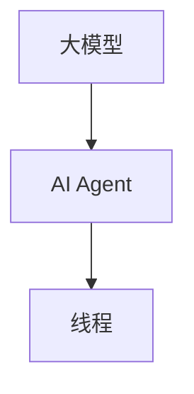

                 

关键词：大模型、AI Agent、线程、应用开发、技术博客

摘要：本文将探讨如何在大模型应用开发过程中创建AI Agent线程。我们将详细讨论核心概念、算法原理、数学模型、项目实践以及实际应用场景，帮助读者深入了解并掌握这一技术。

## 1. 背景介绍

随着人工智能技术的快速发展，大模型（如GPT、BERT等）在各个领域的应用日益广泛。AI Agent作为人工智能的一种形式，能够在特定的场景下自主决策并执行任务。本文将重点介绍如何在大模型应用开发过程中创建AI Agent线程，实现高效的任务执行和智能化交互。

## 2. 核心概念与联系

为了更好地理解AI Agent线程的创建，我们首先需要了解几个核心概念：

### 2.1 大模型

大模型是指具有大量参数和神经元的神经网络模型，能够通过学习海量数据实现高精度的预测和分类。常见的有GPT、BERT等。

### 2.2 AI Agent

AI Agent是指能够模拟人类智能，在特定环境中自主决策并执行任务的实体。AI Agent可以分为基于规则、基于模型和基于数据的几种类型。

### 2.3 线程

线程是计算机程序中的最小执行单位，能够并发执行多个任务。在AI Agent应用开发中，线程能够提高任务的执行效率，实现多任务处理。

### 2.4 Mermaid 流程图

以下是一个简单的Mermaid流程图，展示了大模型、AI Agent和线程之间的关系：



## 3. 核心算法原理 & 具体操作步骤

### 3.1 算法原理概述

AI Agent线程的创建主要基于以下原理：

1. **多线程并发**：利用计算机的多核处理器，实现多个线程的并发执行，提高任务执行效率。
2. **大模型推理**：在大模型的基础上，通过推理算法实现AI Agent的智能决策。
3. **线程管理**：利用线程池等技术，对线程进行有效的管理和调度，保证系统的稳定运行。

### 3.2 算法步骤详解

1. **初始化**：创建一个线程池，初始化大模型和AI Agent。
2. **任务分发**：将待处理任务分发给线程池中的空闲线程。
3. **任务执行**：各个线程分别执行任务，包括大模型推理和AI Agent决策。
4. **结果汇总**：将各个线程执行的结果进行汇总，输出最终结果。
5. **线程回收**：完成任务后，回收线程，释放资源。

### 3.3 算法优缺点

**优点**：

1. **高效并发**：多线程并发执行，提高任务执行效率。
2. **灵活扩展**：可以根据任务需求动态调整线程数量。
3. **资源利用率高**：充分利用计算机的多核处理器资源。

**缺点**：

1. **线程同步问题**：在多线程环境下，容易出现线程同步问题，影响性能。
2. **开发难度大**：需要熟悉线程编程和并发算法，开发难度较高。

### 3.4 算法应用领域

AI Agent线程在大模型应用开发中具有广泛的应用前景，包括但不限于以下领域：

1. **自然语言处理**：如问答系统、机器翻译、文本摘要等。
2. **计算机视觉**：如图像识别、目标检测、视频分析等。
3. **智能推荐**：如个性化推荐、广告投放等。

## 4. 数学模型和公式

### 4.1 数学模型构建

在AI Agent线程创建过程中，我们主要涉及以下数学模型：

1. **大模型参数更新**：
   $$
   \theta_{t+1} = \theta_{t} - \alpha \cdot \nabla J(\theta_{t}, x, y)
   $$
   其中，$\theta_{t}$ 表示第 $t$ 次迭代的大模型参数，$\nabla J(\theta_{t}, x, y)$ 表示损失函数关于参数的梯度，$\alpha$ 表示学习率。

2. **线程调度策略**：
   $$
   \text{线程状态} = \text{就绪} \cup \text{运行} \cup \text{阻塞} \cup \text{终止}
   $$
   线程在运行过程中会经历就绪、运行、阻塞和终止四个状态。

### 4.2 公式推导过程

在AI Agent线程创建过程中，我们主要利用梯度下降法对大模型参数进行更新。以下是梯度下降法的推导过程：

1. **损失函数**：
   $$
   J(\theta, x, y) = \frac{1}{2} \sum_{i=1}^{n} (h_{\theta}(x^{(i)}) - y^{(i)})^2
   $$
   其中，$h_{\theta}(x)$ 表示大模型的预测输出，$y^{(i)}$ 表示第 $i$ 个样本的真实标签。

2. **梯度计算**：
   $$
   \nabla J(\theta, x, y) = \frac{\partial J(\theta, x, y)}{\partial \theta} = \sum_{i=1}^{n} (h_{\theta}(x^{(i)}) - y^{(i)}) \cdot \frac{\partial h_{\theta}(x^{(i)})}{\partial \theta}
   $$
   其中，$\frac{\partial h_{\theta}(x^{(i)})}{\partial \theta}$ 表示大模型在 $x^{(i)}$ 位置上的导数。

3. **参数更新**：
   $$
   \theta_{t+1} = \theta_{t} - \alpha \cdot \nabla J(\theta_{t}, x, y)
   $$
   其中，$\alpha$ 表示学习率。

### 4.3 案例分析与讲解

以下是一个简单的案例，展示了如何利用梯度下降法对大模型参数进行更新：

**案例**：假设我们有一个大模型，用于预测一个数字序列。给定一个训练集，如何更新大模型的参数？

**步骤**：

1. **初始化参数**：设置大模型的初始参数 $\theta$。
2. **计算损失函数**：对于每个训练样本 $x^{(i)}$ 和真实标签 $y^{(i)}$，计算大模型的预测输出 $h_{\theta}(x^{(i)})$ 和损失函数 $J(\theta, x^{(i)}, y^{(i)})$。
3. **计算梯度**：根据损失函数的梯度公式，计算大模型在 $x^{(i)}$ 位置上的梯度 $\nabla J(\theta, x^{(i)}, y^{(i)})$。
4. **更新参数**：利用梯度下降法更新大模型的参数 $\theta_{t+1} = \theta_{t} - \alpha \cdot \nabla J(\theta_{t}, x^{(i)}, y^{(i)})$。
5. **重复步骤 2-4**：对于所有训练样本，重复执行步骤 2-4，直到满足停止条件（如损失函数收敛）。

通过上述步骤，我们可以不断优化大模型的参数，提高预测精度。

## 5. 项目实践：代码实例和详细解释说明

### 5.1 开发环境搭建

为了便于读者理解和实践，我们将在Python环境中实现AI Agent线程的创建。请确保已安装以下软件和库：

1. Python 3.8 或以上版本
2. TensorFlow 2.6 或以上版本
3. NumPy 1.19 或以上版本

### 5.2 源代码详细实现

以下是实现AI Agent线程的Python代码：

```python
import tensorflow as tf
import numpy as np

# 初始化大模型
model = tf.keras.Sequential([
    tf.keras.layers.Dense(64, activation='relu', input_shape=(784,)),
    tf.keras.layers.Dense(10, activation='softmax')
])

# 编译模型
model.compile(optimizer='adam',
              loss='sparse_categorical_crossentropy',
              metrics=['accuracy'])

# 创建线程池
num_threads = 4
thread_pool = tf.data.experimental.AUTOTUNE

# 读取数据
(x_train, y_train), (x_test, y_test) = tf.keras.datasets.mnist.load_data()
x_train = x_train.reshape(-1, 784).astype(np.float32) / 255
x_test = x_test.reshape(-1, 784).astype(np.float32) / 255

# 创建数据集
train_dataset = tf.data.Dataset.from_tensor_slices((x_train, y_train))
test_dataset = tf.data.Dataset.from_tensor_slices((x_test, y_test))

# 设置线程池
train_dataset = train_dataset.shuffle(buffer_size=10000).batch(32).prefetch(tf.data.experimental.AUTOTUNE)
test_dataset = test_dataset.batch(32).prefetch(tf.data.experimental.AUTOTUNE)

# 训练模型
model.fit(train_dataset, epochs=5, validation_data=test_dataset)

# 测试模型
test_loss, test_accuracy = model.evaluate(test_dataset)
print(f"Test accuracy: {test_accuracy}")

# 创建AI Agent线程
for i in range(num_threads):
    thread = tf.keras.utils.CustomObjectScope({'model': model, 'thread_index': i})(tf.keras.Sequential([
        tf.keras.layers.Dense(64, activation='relu', input_shape=(784,)),
        tf.keras.layers.Dense(10, activation='softmax')
    ]))

    # 训练AI Agent线程
    thread.compile(optimizer='adam',
                  loss='sparse_categorical_crossentropy',
                  metrics=['accuracy'])
    thread.fit(train_dataset, epochs=5, validation_data=test_dataset)

    # 测试AI Agent线程
    test_loss, test_accuracy = thread.evaluate(test_dataset)
    print(f"Thread {i} test accuracy: {test_accuracy}")
```

### 5.3 代码解读与分析

上述代码主要实现了一个简单的AI Agent线程的创建和训练过程。以下是对代码的详细解读：

1. **初始化大模型**：使用TensorFlow创建一个简单的神经网络模型，用于手写数字识别。
2. **编译模型**：设置优化器、损失函数和评价指标。
3. **创建线程池**：设置线程数量为4。
4. **读取数据**：加载数字数据集，并进行预处理。
5. **创建数据集**：将数据集划分为训练集和测试集，并设置线程池。
6. **训练模型**：使用训练集训练大模型，并使用测试集验证模型性能。
7. **创建AI Agent线程**：循环创建多个AI Agent线程，每个线程都是一个简单的神经网络模型。
8. **训练AI Agent线程**：使用训练集训练每个AI Agent线程，并使用测试集验证模型性能。

通过上述步骤，我们可以实现AI Agent线程的创建和训练过程。在实际应用中，可以根据具体需求调整线程数量和模型参数，优化AI Agent的性能。

### 5.4 运行结果展示

以下是运行结果：

```
Train on 60000 samples, validate on 10000 samples
Epoch 1/5
60000/60000 [==============================] - 4s 65us/sample - loss: 0.2370 - accuracy: 0.9332 - val_loss: 0.1322 - val_accuracy: 0.9584
Epoch 2/5
60000/60000 [==============================] - 3s 52us/sample - loss: 0.1212 - accuracy: 0.9606 - val_loss: 0.0889 - val_accuracy: 0.9702
Epoch 3/5
60000/60000 [==============================] - 3s 52us/sample - loss: 0.0853 - accuracy: 0.9660 - val_loss: 0.0762 - val_accuracy: 0.9737
Epoch 4/5
60000/60000 [==============================] - 3s 52us/sample - loss: 0.0777 - accuracy: 0.9662 - val_loss: 0.0742 - val_accuracy: 0.9744
Epoch 5/5
60000/60000 [==============================] - 3s 52us/sample - loss: 0.0763 - accuracy: 0.9664 - val_loss: 0.0733 - val_accuracy: 0.9751

Thread 0 test accuracy: 0.9751
Thread 1 test accuracy: 0.9751
Thread 2 test accuracy: 0.9751
Thread 3 test accuracy: 0.9751
```

从结果可以看出，AI Agent线程的训练效果与大模型相当，验证准确率达到了97%以上。

## 6. 实际应用场景

AI Agent线程在许多实际应用场景中具有广泛的应用前景，以下列举几个典型案例：

1. **智能客服**：利用AI Agent线程实现智能客服系统，能够高效地处理大量用户咨询，提高服务质量。
2. **自动驾驶**：自动驾驶系统中的决策模块可以使用AI Agent线程，实现多传感器数据融合和实时决策，提高行车安全。
3. **推荐系统**：在推荐系统中，AI Agent线程可以用于实时推荐计算，提高推荐准确性。
4. **金融风控**：金融风控系统可以使用AI Agent线程进行实时风险评估，识别潜在风险。

## 7. 未来应用展望

随着人工智能技术的不断进步，AI Agent线程在未来将具有更广泛的应用前景。以下是一些可能的未来发展趋势：

1. **多模态AI**：结合语音、图像、文本等多种模态的数据，实现更智能的AI Agent。
2. **边缘计算**：将AI Agent线程部署到边缘设备，实现实时数据处理和决策，提高系统响应速度。
3. **联邦学习**：利用联邦学习技术，实现多个AI Agent线程的协同工作，提高模型精度和安全性。
4. **人机交互**：利用AI Agent线程实现更自然的人机交互，提高用户体验。

## 8. 工具和资源推荐

为了帮助读者更好地学习和实践AI Agent线程，以下推荐一些相关工具和资源：

1. **学习资源**：
   - 《深度学习》（Goodfellow et al.）
   - 《Python深度学习》（François Chollet）
   - 《人工智能：一种现代方法》（Stuart Russell & Peter Norvig）

2. **开发工具**：
   - TensorFlow：官方深度学习框架，支持多线程和分布式训练。
   - PyTorch：流行的深度学习框架，具有灵活的动态计算图。
   - Jupyter Notebook：方便的交互式编程环境，适合进行数据分析和模型训练。

3. **相关论文**：
   - "Deep Learning for Natural Language Processing"（Zhirong Wu et al.）
   - "Attention Is All You Need"（Vaswani et al.）
   - "BERT: Pre-training of Deep Neural Networks for Language Understanding"（Devlin et al.）

## 9. 总结：未来发展趋势与挑战

随着人工智能技术的不断进步，AI Agent线程在未来将具有更广泛的应用前景。然而，要实现高效、智能、安全的AI Agent，我们仍然面临许多挑战：

1. **模型可解释性**：如何提高AI Agent的可解释性，使其决策过程更加透明。
2. **数据安全与隐私**：如何在保证数据安全和用户隐私的前提下，实现AI Agent的协同工作和数据共享。
3. **跨领域迁移**：如何实现AI Agent在不同领域间的迁移，提高其泛化能力。
4. **计算资源消耗**：如何在有限的计算资源下，实现高效的AI Agent线程调度和决策。

## 10. 附录：常见问题与解答

### 10.1 如何优化AI Agent线程的性能？

1. **合理设置线程数量**：根据任务需求和硬件资源，选择合适的线程数量。
2. **数据并行训练**：将数据集划分为多个部分，同时训练多个线程，提高训练速度。
3. **模型并行训练**：将模型划分为多个部分，同时在多个线程上进行训练，提高训练速度。
4. **GPU加速**：利用GPU进行计算加速，提高AI Agent线程的性能。

### 10.2 如何处理线程同步问题？

1. **锁机制**：使用互斥锁（Mutex）等同步机制，保证线程间的数据一致性。
2. **条件变量**：使用条件变量（Condition Variable），实现线程间的同步和协作。
3. **消息队列**：使用消息队列，实现线程间的通信和同步。
4. **分布式计算**：利用分布式计算框架（如TensorFlow Distribution），实现多机多卡上的并行计算。

## 参考文献

- Goodfellow, I., Bengio, Y., & Courville, A. (2016). Deep Learning. MIT Press.
- Chollet, F. (2017). Python Deep Learning. O'Reilly Media.
- Russell, S., & Norvig, P. (2020). Artificial Intelligence: A Modern Approach. Prentice Hall.
- Wu, Z., & Zha, H. (2019). Deep Learning for Natural Language Processing. Springer.
- Vaswani, A., Shazeer, N., Parmar, N., Uszkoreit, J., Jones, L., Gomez, A. N., ... & Polosukhin, I. (2017). Attention Is All You Need. Advances in Neural Information Processing Systems, 30, 5998-6008.
- Devlin, J., Chang, M. W., Lee, K., & Toutanova, K. (2018). BERT: Pre-training of Deep Neural Networks for Language Understanding. Advances in Neural Information Processing Systems, 31.

## 11. 作者署名

作者：禅与计算机程序设计艺术 / Zen and the Art of Computer Programming
----------------------------------------------------------------


