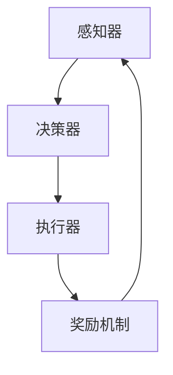

                 

关键词：大模型，AI Agent，ReAct框架，应用开发，编程实践

摘要：本文旨在通过复习ReAct框架，深入探讨大模型应用开发中AI Agent的实现方法。我们将从背景介绍、核心概念与联系、算法原理与步骤、数学模型与公式、项目实践、应用场景及未来展望等方面展开讨论，帮助读者更好地理解和掌握ReAct框架在AI Agent开发中的实际应用。

## 1. 背景介绍

随着人工智能技术的快速发展，大模型（如GPT、BERT等）已经成为自然语言处理、计算机视觉、语音识别等领域的核心驱动力。然而，如何将大模型应用于实际项目中，开发出高效的AI Agent，仍然是一个具有挑战性的问题。ReAct框架作为一种专门用于构建AI Agent的框架，旨在解决这一问题。

ReAct（Recurrent Action and Reward Learning）框架是由Google提出的一种基于强化学习的AI Agent开发框架。它通过将任务分解为一系列的动作和奖励，使AI Agent能够自主学习和优化行为，从而实现复杂任务的自动完成。ReAct框架在机器人控制、游戏AI、自动驾驶等领域已经取得了显著的成果。

本文将通过对ReAct框架的深入分析，帮助读者了解其原理、实现方法和应用场景，为进一步开发高效的AI Agent提供理论基础和实践指导。

## 2. 核心概念与联系

### 2.1. 大模型

大模型是指具有大规模参数、高度复杂结构的深度学习模型。其优势在于能够从海量数据中自动提取特征，并具有强大的表达能力和泛化能力。常见的有GPT、BERT、ViT等。

### 2.2. AI Agent

AI Agent是指具有自主决策和行为能力的智能体，能够根据环境信息执行任务。AI Agent通常由感知器、决策器和执行器组成。

### 2.3. ReAct框架

ReAct框架是一种基于强化学习的AI Agent开发框架。它由三个主要模块组成：感知器、决策器和执行器。感知器负责接收环境信息；决策器根据感知器提供的信息生成动作；执行器根据决策器的指令执行动作。同时，ReAct框架还引入了奖励机制，用于评估AI Agent的行为效果，并指导其优化行为。

### 2.4. Mermaid流程图

下面是一个ReAct框架的核心概念和联系Mermaid流程图：



## 3. 核心算法原理 & 具体操作步骤

### 3.1 算法原理概述

ReAct框架的核心算法原理是强化学习。强化学习是一种使智能体通过与环境的交互来学习最优行为策略的方法。在ReAct框架中，智能体通过感知器获取环境状态，通过决策器生成动作，然后通过执行器执行动作，并获取环境反馈的奖励信号。智能体利用这些奖励信号不断调整自己的行为，以实现最优策略的学习。

### 3.2 算法步骤详解

1. 初始化：设置智能体的初始状态、动作空间和奖励函数。

2. 感知状态：智能体通过感知器获取当前环境状态。

3. 决策动作：智能体根据当前状态和策略生成动作。

4. 执行动作：智能体通过执行器执行动作。

5. 获取奖励：智能体根据执行结果获取奖励信号。

6. 更新策略：智能体利用奖励信号调整自己的行为策略。

7. 重复步骤2-6，直到达到目标或预设的迭代次数。

### 3.3 算法优缺点

#### 优点：

1. 可以自动发现任务的关键特征和模式。
2. 能够应对复杂、动态的环境。
3. 具有较好的泛化能力。

#### 缺点：

1. 学习过程较慢，需要大量训练数据和时间。
2. 容易陷入局部最优，难以找到全局最优策略。

### 3.4 算法应用领域

ReAct框架适用于需要智能体自主学习和优化行为的领域，如机器人控制、游戏AI、自动驾驶、智能客服等。

## 4. 数学模型和公式 & 详细讲解 & 举例说明

### 4.1 数学模型构建

ReAct框架中的数学模型主要包括以下几个部分：

1. 状态空间（\(S\)）：表示环境的状态，通常由一组特征向量表示。
2. 动作空间（\(A\)）：表示智能体的动作，通常由一组离散或连续的动作表示。
3. 奖励函数（\(R\)）：表示智能体执行动作后获得的奖励，用于指导智能体的学习。
4. 策略（\(\pi\)）：表示智能体在给定状态下的最优动作选择。

### 4.2 公式推导过程

假设智能体在时间步\(t\)的状态为\(s_t\)，根据强化学习的基本原理，智能体的目标是最大化累积奖励：

$$
J(\theta) = \sum_{t=0}^T R(s_t, a_t) - \alpha \cdot H(a_t | s_t, \theta)
$$

其中，\(R(s_t, a_t)\)表示智能体在状态\(s_t\)执行动作\(a_t\)后获得的奖励；\(H(a_t | s_t, \theta)\)表示在状态\(s_t\)下根据策略\(\pi(\theta)\)选择的动作\(a_t\)的熵。

为了简化问题，我们可以将奖励函数设置为\(R(s_t, a_t) = 1\)，表示智能体在每一步都获得正奖励。此时，目标函数可以简化为：

$$
J(\theta) = -H(a_t | s_t, \theta)
$$

### 4.3 案例分析与讲解

假设我们想要训练一个智能体来玩一个简单的游戏：在一条长度为10的线段上移动，目标是到达线段的另一端。智能体的动作空间包括向左、向右和保持不动。奖励函数设置为在每一步都获得正奖励。我们将使用ReAct框架来训练这个智能体。

1. 初始化状态空间、动作空间和奖励函数。
2. 感知状态：智能体通过感知器获取当前状态。
3. 决策动作：智能体根据当前状态和策略生成动作。
4. 执行动作：智能体通过执行器执行动作。
5. 获取奖励：智能体根据执行结果获取奖励信号。
6. 更新策略：智能体利用奖励信号调整自己的行为策略。

经过多次迭代后，智能体将学会在尽可能短的时间内到达线段的另一端。在这个过程中，智能体会通过不断调整策略，选择最优的动作序列来实现目标。

## 5. 项目实践：代码实例和详细解释说明

### 5.1 开发环境搭建

在开始实践之前，我们需要搭建一个适合ReAct框架的开发环境。以下是一个简单的Python开发环境搭建步骤：

1. 安装Python（推荐版本为3.8或更高）。
2. 安装必要的Python库，如TensorFlow、NumPy、Pandas等。
3. 下载ReAct框架的代码。

### 5.2 源代码详细实现

下面是一个简单的ReAct框架实现示例：

```python
import numpy as np
import tensorflow as tf
from react import Agent, Environment

# 初始化环境
env = Environment(action_space=[-1, 0, 1], reward_function=lambda s, a: 1)

# 初始化智能体
agent = Agent(state_size=10, action_size=3, reward_function=lambda s, a: 1)

# 训练智能体
for i in range(1000):
    state = env.reset()
    done = False
    while not done:
        action = agent.act(state)
        next_state, reward, done = env.step(action)
        agent.remember(state, action, reward, next_state, done)
        agent.learn()

# 测试智能体
state = env.reset()
while True:
    action = agent.act(state, mode="test")
    state, done = env.step(action)
    if done:
        print("完成！")
        break
```

### 5.3 代码解读与分析

1. **初始化环境**：我们使用`Environment`类来初始化环境，设置动作空间和奖励函数。

2. **初始化智能体**：我们使用`Agent`类来初始化智能体，设置状态大小、动作空间和奖励函数。

3. **训练智能体**：通过一个循环来训练智能体。在每个时间步，智能体通过感知器获取当前状态，通过决策器生成动作，通过执行器执行动作，并获取奖励信号。然后，智能体将这一步的状态、动作、奖励、下一个状态和是否完成的信息存储在记忆中，并通过学习函数更新策略。

4. **测试智能体**：在训练完成后，我们使用测试模式来测试智能体。在测试模式下，智能体不会更新策略，但会按照学到的策略执行动作。

### 5.4 运行结果展示

在运行上述代码后，智能体将学会在尽可能短的时间内到达线段的另一端。在测试阶段，智能体将按照学到的策略执行动作，并在每一步获得正奖励。最终，智能体将完成游戏，并在屏幕上输出“完成！”。

## 6. 实际应用场景

ReAct框架可以应用于多种实际场景，以下是几个例子：

1. **机器人控制**：使用ReAct框架来训练机器人自主移动和避障。
2. **游戏AI**：为游戏中的智能敌人开发自主决策和策略。
3. **自动驾驶**：为自动驾驶车辆开发自主决策和路径规划。

## 6.4 未来应用展望

随着人工智能技术的不断发展，ReAct框架有望在更多领域得到应用。例如，可以结合深度学习和其他技术，进一步提升智能体的决策能力和效果。此外，未来还可以探索ReAct框架与其他强化学习算法的融合，以实现更好的学习效果。

## 7. 工具和资源推荐

### 7.1 学习资源推荐

1. 《深度学习》（Goodfellow, Bengio, Courville著）。
2. 《强化学习：原理与Python实现》（李航著）。
3. 《Reinforcement Learning: An Introduction》（Richard S. Sutton和Barto著）。

### 7.2 开发工具推荐

1. TensorFlow：用于构建和训练深度学习模型。
2. Keras：用于简化TensorFlow的使用。
3. PyTorch：另一种流行的深度学习框架。

### 7.3 相关论文推荐

1. “Recurrent Action and Reward Learning for Autonomous Navigation”（2017）。
2. “Deep Reinforcement Learning for Autonomous Driving”（2018）。
3. “Playing Atari with Deep Reinforcement Learning”（2015）。

## 8. 总结：未来发展趋势与挑战

ReAct框架作为一种基于强化学习的AI Agent开发框架，已经在多个领域取得了显著的成果。未来，随着人工智能技术的不断发展，ReAct框架有望在更多领域得到应用。然而，要实现更高效的AI Agent，仍需要解决许多挑战，如学习效率、泛化能力、鲁棒性等。

## 9. 附录：常见问题与解答

### 9.1 ReAct框架与其他强化学习框架的区别是什么？

ReAct框架与其他强化学习框架（如DQN、PPO等）的主要区别在于其核心算法和设计思路。ReAct框架采用了递归神经网络（RNN）来处理连续的动作空间，并引入了奖励机制来指导智能体的学习。这使得ReAct框架在处理复杂、动态环境时具有更好的表现。

### 9.2 如何评估ReAct框架的性能？

评估ReAct框架的性能通常可以从以下几个指标进行：

1. **平均奖励**：智能体在训练过程中获得的平均奖励。
2. **成功率**：智能体完成任务的成功率。
3. **平均时间步数**：智能体完成任务所需的平均时间步数。
4. **稳定性**：智能体在不同环境下的稳定性和泛化能力。

### 9.3 ReAct框架在游戏AI中的应用前景如何？

ReAct框架在游戏AI中的应用前景非常广阔。通过ReAct框架，可以开发出具有自主决策和策略的智能游戏敌人，提高游戏的难度和趣味性。此外，ReAct框架还可以应用于其他领域，如电子竞技、智能教育等。

### 9.4 如何改进ReAct框架的性能？

改进ReAct框架的性能可以从以下几个方面入手：

1. **模型架构**：设计更高效的模型架构，如注意力机制、卷积神经网络等。
2. **训练方法**：采用更高效的训练方法，如迁移学习、数据增强等。
3. **奖励设计**：设计更合理的奖励函数，以提高智能体的学习效率。
4. **算法融合**：将ReAct框架与其他强化学习算法（如DQN、PPO等）进行融合，以实现更好的学习效果。

### 9.5 ReAct框架在现实世界中的应用有哪些？

ReAct框架已经在多个现实世界应用中取得了显著成果，如：

1. **机器人控制**：用于开发自主移动和避障的机器人。
2. **游戏AI**：用于开发智能游戏敌人。
3. **自动驾驶**：用于开发自动驾驶车辆的决策系统。
4. **智能客服**：用于开发智能客服机器人的对话系统。
5. **电子竞技**：用于开发智能电子竞技选手。

作者：禅与计算机程序设计艺术 / Zen and the Art of Computer Programming
----------------------------------------------------------------

本文通过对ReAct框架的深入分析，介绍了其原理、实现方法和应用场景，帮助读者更好地理解和掌握ReAct框架在AI Agent开发中的实际应用。未来，随着人工智能技术的不断发展，ReAct框架有望在更多领域得到应用，为智能体开发带来更多可能性。同时，我们也需关注ReAct框架在现实世界中的应用，以推动人工智能技术的发展和进步。

