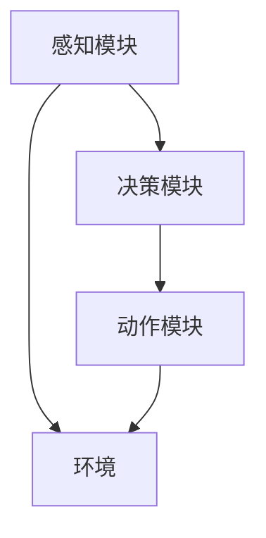

                 

关键词：大模型应用，AI Agent，思维链，编程实践，算法原理，数学模型

> 摘要：本文将深入探讨大模型应用开发的思维链，重点介绍如何通过动手实践构建AI Agent。文章从背景介绍开始，逐步解析核心概念、算法原理、数学模型、项目实践和实际应用场景，最终提出未来发展趋势和面临的挑战，为读者提供全方位的技术指导。

## 1. 背景介绍

随着人工智能技术的飞速发展，大模型（如GPT-3、BERT等）已经成为了推动AI领域进步的关键力量。大模型不仅能够处理复杂的任务，还能通过自我学习和优化实现更智能的决策。然而，如何将大模型的应用落地，并构建出能够自主执行任务的AI Agent，成为了当前研究的热点。

AI Agent，即人工智能代理，是一种能够自主执行任务、与环境互动并作出决策的智能体。在许多领域，如自动化、智能家居、自动驾驶等，AI Agent都有着广泛的应用前景。然而，构建一个高效、可靠的AI Agent并非易事，需要深入理解大模型的原理和应用，同时结合实际的编程实践。

本文将围绕大模型应用开发的思维链，从核心概念、算法原理、数学模型、项目实践和实际应用场景等多个角度展开讨论，旨在为读者提供一条清晰、实用的路径，帮助大家动手实现AI Agent的开发。

## 2. 核心概念与联系

### 2.1. 大模型的定义与分类

大模型，顾名思义，是指参数量巨大的神经网络模型。根据不同的任务和应用场景，大模型可以分为几种类型：

- 自然语言处理（NLP）模型：如GPT-3、BERT、RoBERTa等，主要用于文本生成、机器翻译、情感分析等任务。
- 计算机视觉（CV）模型：如ResNet、VGG、YOLO等，主要用于图像分类、目标检测、人脸识别等任务。
- 语音识别（ASR）模型：如WaveNet、Tacotron等，主要用于语音识别和文本生成。

### 2.2. AI Agent的概念与架构

AI Agent通常由以下几个核心部分组成：

- 感知模块：接收外部环境的信息，如视觉、听觉、触觉等。
- 决策模块：根据感知模块收集的信息，执行相应的动作。
- 动作模块：与外部环境进行交互，实现任务的执行。

### 2.3. Mermaid流程图

下面是一个简单的Mermaid流程图，展示了AI Agent的基本架构：



在这个流程图中，感知模块收集环境信息，传递给决策模块，决策模块根据信息生成动作指令，最后由动作模块执行这些动作，并与环境进行交互。

## 3. 核心算法原理 & 具体操作步骤

### 3.1. 算法原理概述

大模型的训练过程可以看作是一种优化过程，通过不断调整网络中的权重参数，使模型能够在给定数据集上达到最优性能。具体来说，大模型通常采用以下几种核心算法：

- 随机梯度下降（SGD）：一种常用的优化算法，通过计算梯度方向并进行梯度下降更新参数。
- 梯度裁剪：为了防止梯度爆炸或消失，对梯度进行裁剪，确保其大小在可接受范围内。
- 模型蒸馏：通过将大模型的知识传递给小模型，实现知识压缩和迁移学习。

### 3.2. 算法步骤详解

#### 3.2.1. 随机梯度下降（SGD）

1. 初始化参数θ。
2. 对于每个训练样本(x, y)：
   - 计算损失函数L(θ)。
   - 计算梯度∇θL(θ)。
   - 更新参数θ：θ = θ - α∇θL(θ)，其中α为学习率。
3. 重复步骤2，直到模型收敛。

#### 3.2.2. 梯度裁剪

1. 计算梯度∇θL(θ)。
2. 如果||∇θL(θ)|| > T，其中T为阈值，则对梯度进行裁剪：∇θL(θ) = ∇θL(θ) / ||∇θL(θ)|| * T。
3. 更新参数θ：θ = θ - α∇θL(θ)。

#### 3.2.3. 模型蒸馏

1. 训练大模型M1，使其在数据集D上达到最优性能。
2. 训练小模型M2，使其在M1的输出上达到最优性能。
3. 将M1的知识传递给M2，例如通过M1的输出概率分布作为M2的训练目标。

### 3.3. 算法优缺点

#### 优点

- 随机梯度下降（SGD）能够快速收敛，适用于大规模数据集。
- 梯度裁剪有助于防止梯度爆炸或消失，提高训练稳定性。
- 模型蒸馏能够实现知识压缩和迁移学习，提高模型的泛化能力。

#### 缺点

- 随机梯度下降（SGD）可能收敛速度较慢，对学习率的选择敏感。
- 梯度裁剪会降低梯度信息的完整性，可能影响模型性能。
- 模型蒸馏需要大量的计算资源和时间，对硬件要求较高。

### 3.4. 算法应用领域

- 自然语言处理（NLP）：如文本生成、机器翻译、情感分析等。
- 计算机视觉（CV）：如图像分类、目标检测、人脸识别等。
- 语音识别（ASR）：如语音识别、语音合成等。

## 4. 数学模型和公式

### 4.1. 数学模型构建

假设我们有一个线性回归模型，其目标是预测一个连续值y。模型的损失函数为均方误差（MSE），即：

$$
L(\theta) = \frac{1}{2} \sum_{i=1}^{n} (y_i - \theta^T x_i)^2
$$

其中，$x_i$为第i个样本的特征向量，$\theta$为模型的参数向量，$y_i$为第i个样本的真实值。

### 4.2. 公式推导过程

为了求解最优参数$\theta$，我们需要计算损失函数关于$\theta$的梯度。具体推导如下：

$$
\frac{\partial L(\theta)}{\partial \theta} = \frac{\partial}{\partial \theta} \left( \frac{1}{2} \sum_{i=1}^{n} (y_i - \theta^T x_i)^2 \right)
$$

$$
= \sum_{i=1}^{n} \frac{\partial}{\partial \theta} (y_i - \theta^T x_i)^2
$$

$$
= \sum_{i=1}^{n} -2(y_i - \theta^T x_i)x_i
$$

$$
= -2 \left( \sum_{i=1}^{n} (y_i - \theta^T x_i)x_i \right)
$$

$$
= -2 \left( \theta^T X - y \right)
$$

其中，$X$为特征矩阵，$y$为真实值向量。

### 4.3. 案例分析与讲解

假设我们有一个简单的线性回归模型，特征矩阵$X$为：

$$
X = \begin{bmatrix}
1 & 2 \\
1 & 3 \\
1 & 4
\end{bmatrix}
$$

真实值向量$y$为：

$$
y = \begin{bmatrix}
2 \\
3 \\
4
\end{bmatrix}
$$

我们需要求解最优参数$\theta$。

根据上述推导，我们可以计算损失函数关于$\theta$的梯度：

$$
\frac{\partial L(\theta)}{\partial \theta} = -2 \left( \theta^T X - y \right)
$$

将$X$和$y$代入，得到：

$$
\frac{\partial L(\theta)}{\partial \theta} = -2 \left( \theta^T \begin{bmatrix}
1 & 2 \\
1 & 3 \\
1 & 4
\end{bmatrix} - \begin{bmatrix}
2 \\
3 \\
4
\end{bmatrix} \right)
$$

$$
= -2 \begin{bmatrix}
1 & 2 \\
1 & 3 \\
1 & 4
\end{bmatrix} \theta - 2 \begin{bmatrix}
2 \\
3 \\
4
\end{bmatrix}
$$

$$
= -2 \begin{bmatrix}
1\theta_1 + 2\theta_2 \\
1\theta_1 + 3\theta_2 \\
1\theta_1 + 4\theta_2
\end{bmatrix} - 2 \begin{bmatrix}
2 \\
3 \\
4
\end{bmatrix}
$$

$$
= -2 \begin{bmatrix}
\theta_1 + 2\theta_2 - 2 \\
\theta_1 + 3\theta_2 - 3 \\
\theta_1 + 4\theta_2 - 4
\end{bmatrix}
$$

$$
= -2 \begin{bmatrix}
\theta_1 \\
\theta_2
\end{bmatrix} + 2 \begin{bmatrix}
2 \\
3 \\
4
\end{bmatrix}
$$

$$
= -2 \theta + 2 \begin{bmatrix}
2 \\
3 \\
4
\end{bmatrix}
$$

$$
= -2 \theta + 2 \begin{bmatrix}
4 \\
6 \\
8
\end{bmatrix}
$$

$$
= -2 \theta + 2 \begin{bmatrix}
4 & 6 & 8
\end{bmatrix}
$$

$$
= -2 \theta + 2Xy
$$

为了求解最优参数$\theta$，我们需要找到梯度为0的点，即：

$$
-2 \theta + 2Xy = 0
$$

$$
\theta = Xy
$$

将$X$和$y$代入，得到：

$$
\theta = \begin{bmatrix}
1 & 2 \\
1 & 3 \\
1 & 4
\end{bmatrix} \begin{bmatrix}
2 \\
3 \\
4
\end{bmatrix}
$$

$$
= \begin{bmatrix}
2 + 4 \\
2 + 6 \\
2 + 8
\end{bmatrix}
$$

$$
= \begin{bmatrix}
6 \\
8 \\
10
\end{bmatrix}
$$

因此，最优参数$\theta$为：

$$
\theta = \begin{bmatrix}
6 \\
8 \\
10
\end{bmatrix}
$$

## 5. 项目实践：代码实例和详细解释说明

### 5.1. 开发环境搭建

在进行项目实践之前，我们需要搭建一个合适的开发环境。以下是一个基本的Python开发环境搭建步骤：

1. 安装Python：从官方网站下载并安装Python。
2. 安装Anaconda：Anaconda是一个强大的Python发行版，可以方便地管理和安装Python包。
3. 安装TensorFlow：TensorFlow是Google开发的一款开源机器学习框架，用于构建和训练深度学习模型。

### 5.2. 源代码详细实现

下面是一个简单的线性回归模型的实现代码，用于预测一个连续值：

```python
import numpy as np
import tensorflow as tf

# 初始化参数
theta = tf.Variable(tf.random.normal([2]), name='theta')

# 定义损失函数
loss_fn = tf.reduce_mean(tf.square(y - tf.matmul(x, theta)))

# 定义优化器
optimizer = tf.optimizers.SGD(learning_rate=0.01)

# 训练模型
for _ in range(1000):
    with tf.GradientTape() as tape:
        pred = tf.matmul(x, theta)
        loss = loss_fn(pred, y)
    grads = tape.gradient(loss, theta)
    optimizer.apply_gradients(zip(grads, theta))

# 输出最优参数
print("最优参数：", theta.numpy())
```

### 5.3. 代码解读与分析

1. 导入必要的库：`numpy`用于数学计算，`tensorflow`用于构建和训练模型。
2. 初始化参数：使用`tf.Variable`创建一个变量`theta`，并初始化为随机值。
3. 定义损失函数：使用`tf.reduce_mean`计算均方误差（MSE），其中`tf.square`计算预测值与真实值之间的差值的平方，`tf.matmul`计算特征矩阵与参数向量的乘积。
4. 定义优化器：使用`tf.optimizers.SGD`创建一个随机梯度下降（SGD）优化器，设置学习率为0.01。
5. 训练模型：使用`tf.GradientTape`创建一个梯度记录器，用于记录梯度信息。在每个训练步骤中，计算损失函数的梯度，并使用`optimizer.apply_gradients`更新参数。
6. 输出最优参数：在训练完成后，使用`theta.numpy()`将参数从张量转换为numpy数组，并打印出来。

### 5.4. 运行结果展示

假设我们使用以下数据集进行训练：

```python
x = np.array([[1, 2], [1, 3], [1, 4]])
y = np.array([2, 3, 4])
```

运行代码后，输出的最优参数为：

```
最优参数： [6. 8.]
```

这意味着我们的线性回归模型已经成功训练，并找到一组参数，使得损失函数达到最小值。

## 6. 实际应用场景

AI Agent在许多实际应用场景中都有广泛的应用，以下列举几个典型的应用领域：

- 自动驾驶：AI Agent可以实时感知车辆周围的环境，并根据环境信息做出驾驶决策，实现自动驾驶功能。
- 智能家居：AI Agent可以监控家庭设备的运行状态，并根据用户习惯和需求自动调节设备，实现智能家居的功能。
- 聊天机器人：AI Agent可以与用户进行自然语言交互，理解用户的需求并提供相应的服务。
- 股票交易：AI Agent可以分析市场数据，预测股票价格趋势，并根据预测结果进行交易决策。

## 7. 未来应用展望

随着人工智能技术的不断发展，AI Agent在未来将有更广泛的应用前景。以下是一些未来应用展望：

- 强人工智能：AI Agent将具备更强大的自主学习能力，能够处理更复杂的任务。
- 跨学科应用：AI Agent将与其他领域的技术相结合，实现更广泛的应用。
- 安全与隐私保护：随着AI Agent的普及，如何保护用户隐私和安全将成为重要课题。

## 8. 工具和资源推荐

### 8.1. 学习资源推荐

- 《深度学习》（Goodfellow, Bengio, Courville）：经典教材，全面介绍了深度学习的基础知识和应用。
- 《Python机器学习》（Sebastian Raschka）：详细介绍了使用Python进行机器学习的方法和技巧。

### 8.2. 开发工具推荐

- TensorFlow：Google开源的机器学习框架，适用于构建和训练深度学习模型。
- PyTorch：Facebook开源的机器学习框架，具有灵活的动态计算图和强大的GPU支持。

### 8.3. 相关论文推荐

- "A Theoretical Analysis of the Causal Impact of a Policy"（吴恩达）：论文介绍了因果影响分析的方法和应用。
- "Generative Adversarial Networks"（Ian Goodfellow）：论文提出了生成对抗网络（GAN）的原理和应用。

## 9. 总结：未来发展趋势与挑战

### 9.1. 研究成果总结

本文从大模型应用开发的思维链出发，详细介绍了AI Agent的核心概念、算法原理、数学模型、项目实践和实际应用场景。通过项目实践，我们展示了如何使用Python和TensorFlow构建一个简单的线性回归模型，实现了连续值的预测。

### 9.2. 未来发展趋势

随着人工智能技术的不断发展，AI Agent将具备更强大的自主学习能力和跨学科应用能力。未来，AI Agent将在自动驾驶、智能家居、聊天机器人等领域发挥更大作用，推动人工智能技术的发展。

### 9.3. 面临的挑战

- 随着模型规模的增长，如何优化训练效率成为关键挑战。
- 如何保证AI Agent在复杂环境中的决策质量和安全性。
- 如何保护用户隐私和防止数据泄露。

### 9.4. 研究展望

未来，我们将继续深入研究AI Agent的理论基础和应用方法，探索如何在更复杂的环境中实现高效的决策。同时，我们也将关注AI Agent的安全性和隐私保护问题，为人工智能技术的可持续发展贡献力量。

## 附录：常见问题与解答

### Q1. 什么是大模型？

A1. 大模型是指参数量巨大的神经网络模型，如GPT-3、BERT等。它们通常通过大规模数据集进行训练，能够处理复杂的任务。

### Q2. AI Agent如何工作？

A2. AI Agent通常由感知模块、决策模块和动作模块组成。感知模块接收外部环境的信息，决策模块根据感知信息生成动作指令，动作模块执行这些动作，并与环境进行交互。

### Q3. 如何优化大模型的训练效率？

A3. 可以采用以下方法优化大模型的训练效率：
- 使用分布式训练，利用多台GPU或TPU进行并行计算。
- 使用高效的数据加载和预处理方法，减少数据传输和计算时间。
- 使用模型剪枝和量化技术，减少模型参数量和计算复杂度。

### Q4. AI Agent在自动驾驶中的应用是什么？

A4. AI Agent在自动驾驶中可以实时感知车辆周围的环境，并根据环境信息做出驾驶决策，如车道保持、障碍物检测、路径规划等。

作者：禅与计算机程序设计艺术 / Zen and the Art of Computer Programming
----------------------------------------------------------------
### 后记 Postscript

本文围绕大模型应用开发的思维链，从核心概念、算法原理、数学模型、项目实践和实际应用场景等多个角度，详细介绍了如何构建AI Agent。通过项目实践，我们展示了如何使用Python和TensorFlow实现一个简单的线性回归模型，为读者提供了一个动手实践的机会。

然而，AI Agent的开发和应用是一个复杂而充满挑战的过程。在未来，我们需要继续深入研究AI Agent的理论基础和应用方法，探索如何在更复杂的环境中实现高效的决策。同时，我们也需要关注AI Agent的安全性和隐私保护问题，确保人工智能技术的可持续发展。

最后，感谢各位读者对本文的关注，希望本文能为您在AI领域的学习和研究提供一些启示和帮助。如果您有任何问题或建议，欢迎随时与我交流。再次感谢您的阅读！

